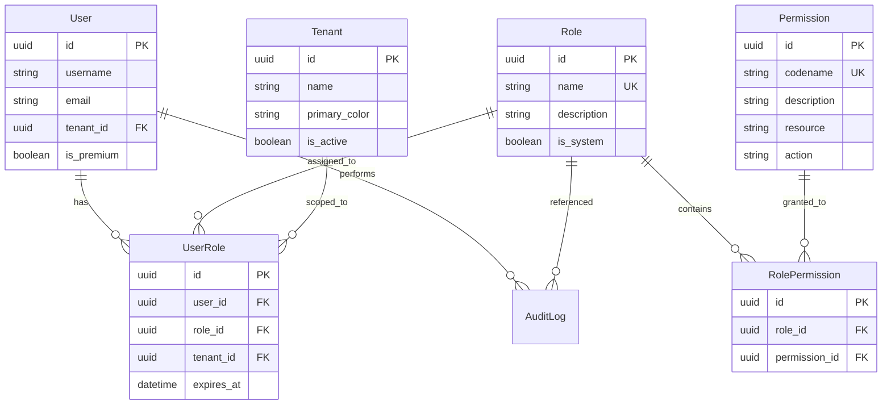
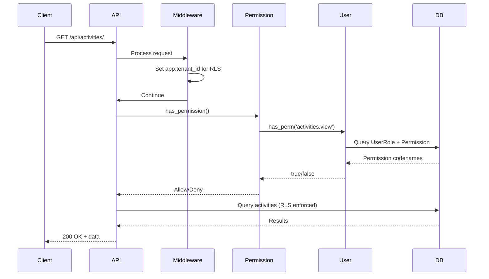

# 4VELO RBAC Redesign — Comprehensive Architecture Plan

> **Status:** Draft  
> **Date:** 2026-05-14  
> **Author:** Architect Mode  
> **Scope:** Backend (Django/DRF) + Frontend (React Admin)

---

## Table of Contents

1. [Current System Analysis](#1-current-system-analysis)
2. [Security Gaps & Risks](#2-security-gaps--risks)
3. [Proposed Architecture](#3-proposed-architecture)
4. [Role Definitions & Permission Matrix](#4-role-definitions--permission-matrix)
5. [Data Model Design](#5-data-model-design)
6. [Migration Strategy](#6-migration-strategy)
7. [API Design](#7-api-design)
8. [Middleware & Permission Class Changes](#8-middleware--permission-class-changes)
9. [Frontend Changes](#9-frontend-changes)
10. [Security Recommendations](#10-security-recommendations)
11. [Implementation Phases](#11-implementation-phases)

---

## 1. Current System Analysis

### 1.1 Current Role Model

The [`User`](backend/users/models.py:51) model has a single `role` CharField using Django's `TextChoices`:

```python
class Role(models.TextChoices):
    GLOBAL_OWNER     = 'GLOBAL_OWNER',     'Global Owner'
    TENANT_ADMIN     = 'TENANT_ADMIN',     'Tenant Admin / Owner'
    TENANT_MODERATOR = 'TENANT_MODERATOR', 'Moderator'
    ATHLETE          = 'ATHLETE',          'Athlete'
    SPONSOR          = 'SPONSOR',          'Sponsor'
```

### 1.2 Current Tenant Model

The [`Tenant`](backend/users/models.py:12) model uses a UUID primary key and represents a white-label deployment (city, corporation). Users have a nullable `ForeignKey` to `Tenant`.

### 1.3 Current Permission Classes

| File | Class | Logic |
|------|-------|-------|
| [`backend/users/permissions.py`](backend/users/permissions.py:4) | `IsGlobalOwner` | `user.role == Role.GLOBAL_OWNER` |
| [`backend/users/permissions.py`](backend/users/permissions.py:11) | `IsTenantAdmin` | `user.role == Role.TENANT_ADMIN` + object tenant match |
| [`backend/users/permissions.py`](backend/users/permissions.py:25) | `IsTenantModerator` | `user.role in [TENANT_ADMIN, TENANT_MODERATOR]` + object tenant match |
| [`backend/users/permissions.py`](backend/users/permissions.py:37) | `IsSponsor` | `user.role == Role.SPONSOR` |
| [`backend/activities/admin_views.py`](backend/activities/admin_views.py:14) | `IsAdminRole` | `user.role in ('GLOBAL_OWNER', 'TENANT_ADMIN', 'TENANT_MODERATOR')` |

### 1.4 Current Middleware

| Middleware | Purpose |
|------------|---------|
| [`TenantRLSMiddleware`](backend/core/middleware.py:5) | Sets PostgreSQL `app.tenant_id` session variable for Row-Level Security |
| [`ImpersonationAuditMiddleware`](backend/core/middleware.py:36) | Logs mutating actions by admins and impersonated sessions to `AuditLog` |

### 1.5 Permission Check Locations

All permission checks found in the codebase:

| Location | Check Type | Hardcoded? |
|----------|-----------|------------|
| `backend/activities/admin_views.py:45` | `user.role == 'GLOBAL_OWNER'` | Yes |
| `backend/activities/admin_views.py:58` | `user.role in ('TENANT_ADMIN', 'TENANT_MODERATOR')` | Yes |
| `backend/activities/views.py:294` | `User.objects.filter(role='ATHLETE')` | Yes |
| `backend/core/middleware.py:87` | `user_role in ('GLOBAL_OWNER', 'TENANT_ADMIN')` | Yes |
| `backend/users/permissions.py:9` | `user.role == Role.GLOBAL_OWNER` | Yes |
| `backend/users/permissions.py:16` | `user.role == Role.TENANT_ADMIN` | Yes |
| `backend/users/permissions.py:30` | `user.role in [TENANT_ADMIN, TENANT_MODERATOR]` | Yes |
| `backend/users/permissions.py:42` | `user.role == Role.SPONSOR` | Yes |
| `admin/src/core/auth/useAuth.ts:3` | `type Role = 'GLOBAL_OWNER' \| ...` | Yes (frontend) |
| `admin/src/core/guards/RoleGuard.tsx:21` | `allowedRoles.includes(user.role)` | Yes (frontend) |

---

## 2. Security Gaps & Risks

### 2.1 Hardcoded Role Checks

Every permission check compares `user.role` against hardcoded string literals or tuples. Adding a new role or changing permissions requires modifying multiple files across the codebase.

**Risk:** High — easy to miss a check during refactoring; no single source of truth.

### 2.2 No Granular Permissions

Roles are monolithic. A `TENANT_MODERATOR` gets the same access as `TENANT_ADMIN` for activity approval, but there is no way to distinguish "can approve" from "can delete" without adding more hardcoded checks.

**Risk:** Medium — violates principle of least privilege.

### 2.3 Tenant Isolation Relies on Middleware

The [`TenantRLSMiddleware`](backend/core/middleware.py:5) sets `app.tenant_id` for RLS, but `GLOBAL_OWNER` users bypass RLS entirely (line 30 clears the variable). Views must manually enforce tenant scoping.

**Risk:** High — if a view forgets to filter by `tenant_id`, a `TENANT_ADMIN` could access another tenant's data.

### 2.4 No Permission Inheritance or Hierarchy

There is no formal hierarchy. `IsTenantModerator` manually includes `TENANT_ADMIN` in its check, but this is duplicated logic.

**Risk:** Medium — inconsistent behavior if one check is updated but not another.

### 2.5 Frontend Role Checks Are Decoupled

The frontend [`RoleGuard`](admin/src/core/guards/RoleGuard.tsx:14) and [`useAuth`](admin/src/core/auth/useAuth.ts:3) define their own `Role` type. If backend roles change, the frontend must be manually updated.

**Risk:** Medium — drift between frontend and backend role definitions.

### 2.6 Audit Logging Is Role-Based, Not Permission-Based

[`ImpersonationAuditMiddleware`](backend/core/middleware.py:36) logs actions based on `user.role in ('GLOBAL_OWNER', 'TENANT_ADMIN')`. If a new admin-like role is added, it must be remembered here.

**Risk:** Medium — audit gaps for new roles.

---

## 3. Proposed Architecture

### 3.1 High-Level Design



### 3.2 Key Principles

1. **Separation of Concerns:** Roles define *what* a user is; permissions define *what* a user can do.
2. **Many-to-Many User-Role:** A user can have multiple roles (e.g., `ATHLETE` + `SPONSOR`).
3. **Tenant-Scoped Roles:** A role assignment can be scoped to a specific tenant or platform-wide (`tenant_id = NULL`).
4. **Granular Permissions:** Permissions are `resource.action` pairs (e.g., `activities.approve`, `users.impersonate`).
5. **Backward Compatible:** The existing `User.role` field is preserved during migration.

---

## 4. Role Definitions & Permission Matrix

### 4.1 Permission Catalog

| Permission Codename | Resource | Action | Description |
|---------------------|----------|--------|-------------|
| `activities.view` | activities | view | View activities |
| `activities.view_all` | activities | view_all | View all activities (cross-tenant) |
| `activities.create` | activities | create | Create activities |
| `activities.approve` | activities | approve | Approve/reject activities |
| `activities.delete` | activities | delete | Delete activities |
| `activities.export` | activities | export | Export activity data |
| `users.view` | users | view | View user profiles |
| `users.view_all` | users | view_all | View all users (cross-tenant) |
| `users.create` | users | create | Create users |
| `users.edit` | users | edit | Edit user profiles |
| `users.delete` | users | delete | Delete users |
| `users.impersonate` | users | impersonate | Impersonate other users |
| `users.invite` | users | invite | Send user invitations |
| `tenants.view` | tenants | view | View tenant details |
| `tenants.manage` | tenants | manage | Configure tenant settings |
| `tenants.create` | tenants | create | Create new tenants |
| `pois.view` | pois | view | View POIs |
| `pois.manage` | pois | manage | Create/edit/delete POIs |
| `vouchers.create` | vouchers | create | Create vouchers |
| `vouchers.redeem` | vouchers | redeem | Redeem vouchers |
| `analytics.view` | analytics | view | View analytics dashboards |
| `analytics.heatmap` | analytics | heatmap | Access heatmap analytics |
| `analytics.export` | analytics | export | Export analytics data |
| `telemetry.view` | telemetry | view | View live telemetry |
| `telemetry.configure` | telemetry | configure | Configure telemetry settings |
| `system.configure` | system | configure | System-wide configuration |
| `payments.manage` | payments | manage | Manage payment settings |
| `audit.view` | audit | view | View audit logs |

### 4.2 Role-Permission Matrix

| Permission | GLOBAL_OWNER | TENANT_ADMIN | TENANT_MODERATOR | SPONSOR | ATHLETE |
|------------|:------------:|:------------:|:----------------:|:-------:|:-------:|
| `activities.view` | ✅ | ✅ (tenant) | ✅ (tenant) | ✅ (tenant) | ✅ (own) |
| `activities.view_all` | ✅ | — | — | — | — |
| `activities.create` | ✅ | ✅ | ✅ | — | ✅ |
| `activities.approve` | ✅ | ✅ | ✅ | — | — |
| `activities.delete` | ✅ | ✅ | — | — | — |
| `activities.export` | ✅ | ✅ | ✅ | ✅ (tenant) | — |
| `users.view` | ✅ | ✅ (tenant) | ✅ (tenant) | ✅ (tenant) | ✅ (own) |
| `users.view_all` | ✅ | — | — | — | — |
| `users.create` | ✅ | ✅ (tenant) | — | — | — |
| `users.edit` | ✅ | ✅ (tenant) | — | — | ✅ (own) |
| `users.delete` | ✅ | ✅ (tenant) | — | — | — |
| `users.impersonate` | ✅ | ✅ (tenant) | — | — | — |
| `users.invite` | ✅ | ✅ (tenant) | — | — | — |
| `tenants.view` | ✅ | ✅ (own) | ✅ (own) | ✅ (own) | — |
| `tenants.manage` | ✅ | ✅ (own) | — | — | — |
| `tenants.create` | ✅ | — | — | — | — |
| `pois.view` | ✅ | ✅ (tenant) | ✅ (tenant) | ✅ (tenant) | ✅ |
| `pois.manage` | ✅ | ✅ (tenant) | — | ✅ (own) | — |
| `vouchers.create` | ✅ | ✅ (tenant) | — | ✅ (own) | — |
| `vouchers.redeem` | ✅ | ✅ | ✅ | ✅ | ✅ |
| `analytics.view` | ✅ | ✅ (tenant) | ✅ (tenant) | ✅ (tenant) | — |
| `analytics.heatmap` | ✅ | ✅ (tenant) | ✅ (tenant) | ✅ (tenant) | — |
| `analytics.export` | ✅ | ✅ (tenant) | — | ✅ (tenant) | — |
| `telemetry.view` | ✅ | ✅ (tenant) | ✅ (tenant) | — | — |
| `telemetry.configure` | ✅ | ✅ (tenant) | — | — | — |
| `system.configure` | ✅ | — | — | — | — |
| `payments.manage` | ✅ | ✅ (tenant) | — | ✅ (own) | — |
| `audit.view` | ✅ | ✅ (tenant) | — | — | — |

**Scope legend:**
- ✅ = Full access
- ✅ (tenant) = Access limited to user's tenant
- ✅ (own) = Access limited to own resources
- ✅ (own POI) = Access limited to POIs owned by sponsor
- — = No access

---

## 5. Data Model Design

### 5.1 New Models

```python
# backend/users/models.py (additions)

class Permission(models.Model):
    """
    Granular permission definition.
    Codename follows Django convention: 'resource.action'
    """
    id = models.UUIDField(primary_key=True, default=uuid.uuid4, editable=False)
    codename = models.CharField(max_length=100, unique=True)
    name = models.CharField(max_length=200)
    description = models.TextField(blank=True)
    resource = models.CharField(max_length=50)  # e.g., 'activities', 'users'
    action = models.CharField(max_length=50)    # e.g., 'view', 'approve', 'delete'

    class Meta:
        ordering = ['resource', 'action']

    def __str__(self):
        return self.codename


class Role(models.Model):
    """
    Role definition with optional system flag.
    System roles are seeded and cannot be deleted via API.
    """
    id = models.UUIDField(primary_key=True, default=uuid.uuid4, editable=False)
    name = models.CharField(max_length=100, unique=True)
    description = models.TextField(blank=True)
    is_system = models.BooleanField(default=False)
    permissions = models.ManyToManyField(Permission, through='RolePermission', blank=True)

    class Meta:
        ordering = ['name']

    def __str__(self):
        return self.name


class RolePermission(models.Model):
    """Through table for Role-Permission M2M."""
    role = models.ForeignKey(Role, on_delete=models.CASCADE)
    permission = models.ForeignKey(Permission, on_delete=models.CASCADE)

    class Meta:
        unique_together = ('role', 'permission')


class UserRole(models.Model):
    """
    User-Role assignment with optional tenant scoping.
    If tenant is NULL, the role is platform-wide.
    """
    id = models.UUIDField(primary_key=True, default=uuid.uuid4, editable=False)
    user = models.ForeignKey(settings.AUTH_USER_MODEL, on_delete=models.CASCADE, related_name='role_assignments')
    role = models.ForeignKey(Role, on_delete=models.CASCADE)
    tenant = models.ForeignKey(Tenant, on_delete=models.CASCADE, null=True, blank=True)
    granted_at = models.DateTimeField(auto_now_add=True)
    granted_by = models.ForeignKey(
        settings.AUTH_USER_MODEL, on_delete=models.SET_NULL,
        null=True, related_name='granted_roles'
    )
    expires_at = models.DateTimeField(null=True, blank=True)

    class Meta:
        unique_together = ('user', 'role', 'tenant')
        ordering = ['-granted_at']

    def __str__(self):
        tenant_str = f" @ {self.tenant}" if self.tenant else " (global)"
        return f"{self.user} → {self.role}{tenant_str}"
```

### 5.2 User Model Extensions

Add helper methods to the existing `User` model:

```python
class User(AbstractUser):
    # ... existing fields ...

    # New: M2M through UserRole
    roles = models.ManyToManyField(Role, through='UserRole', blank=True)

    def has_perm(self, perm_codename: str, tenant_id=None) -> bool:
        """
        Check if user has a specific permission.
        If tenant_id is provided, only checks tenant-scoped roles.
        """
        qs = self.role_assignments.select_related('role').prefetch_related(
            'role__permissions'
        )
        if tenant_id:
            qs = qs.filter(tenant_id=tenant_id)
        return qs.filter(role__permissions__codename=perm_codename).exists()

    def get_all_permissions(self, tenant_id=None) -> set[str]:
        """Return all permission codenames for the user."""
        qs = self.role_assignments.select_related('role').prefetch_related(
            'role__permissions'
        )
        if tenant_id:
            qs = qs.filter(tenant_id=tenant_id)
        return {p.codename for ra in qs for p in ra.role.permissions.all()}
```

### 5.3 Migration of Existing Role Field

The existing `User.role` CharField is **not deleted** during the initial migration. It is kept as a fallback and used to populate the new `UserRole` table.

---

## 6. Migration Strategy

### 6.1 Phase 1: Schema Migration (Backward Compatible)

```
0001_add_permission_model.py      — Create Permission model
0002_add_role_model.py            — Create Role model (new, separate from TextChoices)
0003_add_rolepermission_model.py  — Create RolePermission through table
0004_add_userrole_model.py        — Create UserRole through table
0005_add_user_roles_m2m.py        — Add User.roles M2M field
```

### 6.2 Phase 2: Data Migration

```
0006_seed_permissions.py          — Seed all permissions from the catalog
0007_seed_roles.py                — Seed system roles (GLOBAL_OWNER, TENANT_ADMIN, etc.)
0008_assign_role_permissions.py   — Assign permissions to roles per the matrix
0009_migrate_user_roles.py        — Populate UserRole from User.role field
```

Data migration logic:

```python
def migrate_user_roles(apps, schema_editor):
    User = apps.get_model('users', 'User')
    UserRole = apps.get_model('users', 'UserRole')
    Role = apps.get_model('users', 'Role')

    role_map = {
        'GLOBAL_OWNER': 'GLOBAL_OWNER',
        'TENANT_ADMIN': 'TENANT_ADMIN',
        'TENANT_MODERATOR': 'TENANT_MODERATOR',
        'ATHLETE': 'ATHLETE',
        'SPONSOR': 'SPONSOR',
    }

    for user in User.objects.all():
        if user.role in role_map:
            role = Role.objects.get(name=role_map[user.role])
            UserRole.objects.get_or_create(
                user=user,
                role=role,
                tenant_id=user.tenant_id,
            )
```

### 6.3 Phase 3: Feature Flag Rollout

Add a settings flag:

```python
# backend/core/settings.py
RBAC_USE_NEW_SYSTEM = os.getenv('RBAC_USE_NEW_SYSTEM', '0') == '1'
```

When `RBAC_USE_NEW_SYSTEM = False` (default):
- All existing permission checks use `User.role` field
- New permission classes check both old and new systems

When `RBAC_USE_NEW_SYSTEM = True`:
- All permission checks use the new `User.has_perm()` method
- Old `User.role` field is deprecated (read-only)

### 6.4 Phase 4: Cleanup (Post-Migration)

After confirming the new system works:

```
0010_deprecate_user_role_field.py  — Make User.role nullable, remove default
0011_remove_user_role_field.py     — Remove User.role field entirely
```

### 6.5 Rollback Plan

1. Keep `User.role` field until Phase 4 is confirmed stable.
2. Feature flag `RBAC_USE_NEW_SYSTEM` can be toggled off to revert to old behavior.
3. Data migration is idempotent — can be re-run if needed.
4. All new models use UUID primary keys — no conflict with existing integer PKs.

---

## 7. API Design

### 7.1 New Endpoints

| Method | Endpoint | Permission | Description |
|--------|----------|------------|-------------|
| `GET` | `/api/rbac/permissions/` | `system.configure` | List all permissions |
| `GET` | `/api/rbac/roles/` | `system.configure` | List all roles |
| `POST` | `/api/rbac/roles/` | `system.configure` | Create custom role |
| `PATCH` | `/api/rbac/roles/{id}/` | `system.configure` | Update role (not system roles) |
| `DELETE` | `/api/rbac/roles/{id}/` | `system.configure` | Delete role (not system roles) |
| `POST` | `/api/rbac/roles/{id}/permissions/` | `system.configure` | Add permission to role |
| `DELETE` | `/api/rbac/roles/{id}/permissions/{perm_id}/` | `system.configure` | Remove permission from role |
| `GET` | `/api/rbac/users/{id}/roles/` | `users.view` | List user's roles |
| `POST` | `/api/rbac/users/{id}/roles/` | `users.edit` | Assign role to user |
| `DELETE` | `/api/rbac/users/{id}/roles/{assignment_id}/` | `users.edit` | Remove role from user |
| `GET` | `/api/rbac/users/{id}/permissions/` | `users.view` | List user's effective permissions |
| `GET` | `/api/rbac/me/permissions/` | IsAuthenticated | List current user's permissions |

### 7.2 Serializers

```python
class PermissionSerializer(serializers.ModelSerializer):
    class Meta:
        model = Permission
        fields = ['id', 'codename', 'name', 'description', 'resource', 'action']

class RoleSerializer(serializers.ModelSerializer):
    permissions = PermissionSerializer(many=True, read_only=True)
    permission_ids = serializers.PrimaryKeyRelatedField(
        queryset=Permission.objects.all(),
        source='permissions',
        write_only=True,
        many=True,
        required=False,
    )

    class Meta:
        model = Role
        fields = ['id', 'name', 'description', 'is_system', 'permissions', 'permission_ids']

class UserRoleSerializer(serializers.ModelSerializer):
    role = RoleSerializer(read_only=True)
    role_id = serializers.PrimaryKeyRelatedField(
        queryset=Role.objects.all(),
        source='role',
        write_only=True,
    )
    tenant = serializers.StringRelatedField(read_only=True)
    tenant_id = serializers.PrimaryKeyRelatedField(
        queryset=Tenant.objects.all(),
        source='tenant',
        write_only=True,
        required=False,
        allow_null=True,
    )

    class Meta:
        model = UserRole
        fields = ['id', 'role', 'role_id', 'tenant', 'tenant_id', 'granted_at', 'granted_by', 'expires_at']
```

### 7.3 JWT Token Enhancement

Include permissions in the JWT payload:

```python
# backend/core/settings.py (SIMPLE_JWT extension)

def custom_jwt_payload_handler(user, request=None):
    payload = {
        'user_id': user.pk,
        'username': user.username,
        'email': user.email,
        'tenant_id': str(user.tenant_id) if user.tenant_id else None,
        'permissions': list(user.get_all_permissions(tenant_id=user.tenant_id)),
    }
    return payload
```

This eliminates the need to query permissions on every request.

---

## 8. Middleware & Permission Class Changes

### 8.1 New Permission Class: `HasPermission`

```python
# backend/users/permissions.py

class HasPermission(permissions.BasePermission):
    """
    Checks if the user has a specific permission codename.
    Supports tenant-scoped permission checks.
    """
    required_permission = None  # Override in subclass

    def has_permission(self, request, view):
        if not request.user.is_authenticated:
            return False

        # During migration, fall back to old role check
        if not getattr(settings, 'RBAC_USE_NEW_SYSTEM', False):
            return self._legacy_check(request)

        tenant_id = getattr(request.user, 'tenant_id', None)
        return request.user.has_perm(self.required_permission, tenant_id=tenant_id)

    def _legacy_check(self, request):
        # Fallback to old role-based checks during migration
        role = getattr(request.user, 'role', None)
        legacy_map = {
            'activities.view': ('GLOBAL_OWNER', 'TENANT_ADMIN', 'TENANT_MODERATOR', 'ATHLETE'),
            'activities.approve': ('GLOBAL_OWNER', 'TENANT_ADMIN', 'TENANT_MODERATOR'),
            'activities.delete': ('GLOBAL_OWNER', 'TENANT_ADMIN'),
            'users.impersonate': ('GLOBAL_OWNER', 'TENANT_ADMIN'),
            # ... etc
        }
        allowed = legacy_map.get(self.required_permission, ())
        return role in allowed
```

### 8.2 Updated View Permission Usage

Before:
```python
permission_classes = (permissions.IsAuthenticated, IsAdminRole)
```

After:
```python
class IsActivityApprover(HasPermission):
    required_permission = 'activities.approve'

permission_classes = (permissions.IsAuthenticated, IsActivityApprover)
```

### 8.3 Middleware Updates

#### TenantRLSMiddleware

No changes needed — RLS continues to work at the database level. The middleware already handles `GLOBAL_OWNER` by clearing `app.tenant_id`.

#### ImpersonationAuditMiddleware

Update to check for `users.impersonate` permission instead of hardcoded roles:

```python
# Before
if is_authenticated and user_role in ('GLOBAL_OWNER', 'TENANT_ADMIN'):

# After
if is_authenticated and request.user.has_perm('users.impersonate'):
```

### 8.4 Default Permission Classes

Update `REST_FRAMEWORK` settings:

```python
REST_FRAMEWORK = {
    'DEFAULT_PERMISSION_CLASSES': [
        'rest_framework.permissions.IsAuthenticated',
        'users.permissions.HasPermission',  # Global permission check
    ],
}
```

---

## 9. Frontend Changes

### 9.1 Update `useAuth.ts`

Replace the hardcoded `Role` type with a permissions-based approach:

```typescript
// admin/src/core/auth/useAuth.ts

export interface Permission {
  codename: string;
  resource: string;
  action: string;
}

export interface Role {
  id: string;
  name: string;
  description: string;
}

interface User {
  id: number;
  username: string;
  roles: Role[];
  permissions: string[];  // Permission codenames from JWT
  tenantId: string | null;
  tenantFlags: {
    has_heatmap_analytics: boolean;
  } | null;
  isImpersonated: boolean;
}

interface AuthState {
  user: User | null;
  isAuthenticated: boolean;
  token: string | null;
  refreshToken: string | null;
  hasPermission: (permission: string) => boolean;
  hasAnyPermission: (permissions: string[]) => boolean;
  hasRole: (roleName: string) => boolean;
  login: (token: string, refresh: string, user: User) => void;
  logout: () => void;
  impersonate: (token: string, user: User) => void;
}

export const useAuth = create<AuthState>((set, get) => ({
  // ... existing state ...
  hasPermission: (permission: string) => {
    const { user } = get();
    return user?.permissions?.includes(permission) ?? false;
  },
  hasAnyPermission: (permissions: string[]) => {
    const { user } = get();
    return permissions.some(p => user?.permissions?.includes(p) ?? false);
  },
  hasRole: (roleName: string) => {
    const { user } = get();
    return user?.roles?.some(r => r.name === roleName) ?? false;
  },
  // ... existing methods ...
}));
```

### 9.2 Update `RoleGuard.tsx`

Rename to `PermissionGuard` and support both role and permission checks:

```tsx
// admin/src/core/guards/PermissionGuard.tsx

interface PermissionGuardProps {
  requiredPermissions?: string[];
  requiredRoles?: string[];
  requireAll?: boolean;  // AND vs OR logic
  children?: React.ReactNode;
}

export const PermissionGuard: React.FC<PermissionGuardProps> = ({
  requiredPermissions = [],
  requiredRoles = [],
  requireAll = false,
  children,
}) => {
  const { user, isAuthenticated, hasPermission, hasAnyPermission, hasRole } = useAuth();

  if (!isAuthenticated || !user) {
    return <Navigate to="/login" replace />;
  }

  // Check permissions
  if (requiredPermissions.length > 0) {
    const hasRequired = requireAll
      ? requiredPermissions.every(hasPermission)
      : hasAnyPermission(requiredPermissions);
    if (!hasRequired) {
      return <Navigate to="/unauthorized" replace />;
    }
  }

  // Check roles (legacy support)
  if (requiredRoles.length > 0) {
    const hasRequiredRole = requiredRoles.some(hasRole);
    if (!hasRequiredRole) {
      return <Navigate to="/unauthorized" replace />;
    }
  }

  return children ? <>{children}</> : <Outlet />;
};
```

### 9.3 Route Protection Examples

```tsx
// Before
<Route element={<RoleGuard allowedRoles={['GLOBAL_OWNER', 'TENANT_ADMIN']} />}>
  <Route path="users" element={<Users />} />
</Route>

// After
<Route element={<PermissionGuard requiredPermissions={['users.view']} />}>
  <Route path="users" element={<Users />} />
</Route>

<Route element={<PermissionGuard requiredPermissions={['users.impersonate']} />}>
  <Route path="users/:id/impersonate" element={<ImpersonateUser />} />
</Route>
```

---

## 10. Security Recommendations

### 10.1 Principle of Least Privilege

1. **Default-deny:** New roles start with zero permissions. Permissions must be explicitly granted.
2. **Tenant scoping:** All role assignments should be tenant-scoped by default. Platform-wide roles require explicit `tenant = NULL`.
3. **Time-limited roles:** Support `expires_at` on `UserRole` for temporary access (e.g., contractor accounts).

### 10.2 Audit Logging Improvements

1. **Log permission checks:** Log when a permission check fails (potential unauthorized access attempt).
2. **Log role changes:** Every role assignment/removal should be logged with who made the change.
3. **Immutable audit log:** Use database-level triggers to prevent audit log modification.
4. **Include permission context:** Log the permission codename being checked, not just the action.

```python
class AuditLog(models.Model):
    # ... existing fields ...
    permission_checked = models.CharField(max_length=100, null=True, blank=True)
    resource_type = models.CharField(max_length=100, null=True, blank=True)
    resource_id = models.CharField(max_length=100, null=True, blank=True)
    details = models.JSONField(default=dict, blank=True)
```

### 10.3 Rate Limiting Per Role

Configure rate limits based on role:

```python
# backend/core/settings.py
ROLE_THROTTLE_RATES = {
    'GLOBAL_OWNER': {
        'user': '1000/minute',
    },
    'TENANT_ADMIN': {
        'user': '500/minute',
    },
    'TENANT_MODERATOR': {
        'user': '300/minute',
    },
    'SPONSOR': {
        'user': '200/minute',
    },
    'ATHLETE': {
        'user': '300/minute',
    },
    'default': {
        'user': '300/minute',
    },
}
```

Custom throttle class:

```python
class RoleBasedThrottle(UserRateThrottle):
    def get_rate(self):
        role = getattr(self.request.user, 'role', None)
        return settings.ROLE_THROTTLE_RATES.get(role, settings.ROLE_THROTTLE_RATES['default'])['user']
```

### 10.4 Session Management

1. **JWT permission caching:** Permissions are embedded in JWT tokens. When permissions change, existing tokens remain valid until expiration.
2. **Token revocation:** Implement a token blacklist for immediate permission revocation.
3. **Session timeout:** Implement idle timeout for admin sessions (30 minutes recommended).
4. **Concurrent session limit:** Limit concurrent sessions per user (configurable per role).

### 10.5 Cross-Tenant Access Controls

1. **RLS enforcement:** Continue using PostgreSQL RLS for database-level tenant isolation.
2. **Application-level checks:** Views must verify tenant ownership even with RLS (defense in depth).
3. **Cross-tenant audit:** `GLOBAL_OWNER` actions across tenants should be logged with both source and target tenant IDs.

### 10.6 API Security Headers

```python
# Add to middleware stack
SECURITY_MIDDLEWARE = {
    'X-Content-Type-Options': 'nosniff',
    'X-Frame-Options': 'DENY',
    'X-XSS-Protection': '1; mode=block',
    'Strict-Transport-Security': 'max-age=31536000; includeSubDomains',
    'Content-Security-Policy': "default-src 'self'",
}
```

---

## 11. Implementation Phases

### Phase 1: Foundation (Week 1-2)

- [ ] Create `Permission`, `Role`, `RolePermission`, `UserRole` models
- [ ] Create and run schema migrations
- [ ] Seed permissions and system roles via data migration
- [ ] Add `User.has_perm()` and `User.get_all_permissions()` methods
- [ ] Write unit tests for new models

### Phase 2: Integration (Week 2-3)

- [ ] Create `HasPermission` permission class
- [ ] Update existing views to use new permission classes
- [ ] Update `ImpersonationAuditMiddleware` to use permission checks
- [ ] Add JWT payload customization to include permissions
- [ ] Write integration tests for permission checks

### Phase 3: API Endpoints (Week 3-4)

- [ ] Create RBAC management API endpoints
- [ ] Create serializers for role/permission management
- [ ] Add admin UI for role management
- [ ] Write API tests

### Phase 4: Frontend Migration (Week 4-5)

- [ ] Update `useAuth.ts` with permission-based checks
- [ ] Create `PermissionGuard` component
- [ ] Update route protection to use permissions
- [ ] Update admin UI to show user permissions
- [ ] Test frontend with new permission system

### Phase 5: Rollout & Cleanup (Week 5-6)

- [ ] Enable `RBAC_USE_NEW_SYSTEM` feature flag in staging
- [ ] Run integration tests in staging
- [ ] Enable in production
- [ ] Monitor for permission-related errors
- [ ] Deprecate and remove `User.role` field
- [ ] Update documentation

---

## Appendix A: File Change Summary

| File | Change Type | Description |
|------|-------------|-------------|
| `backend/users/models.py` | Modify | Add Permission, Role, RolePermission, UserRole models; extend User |
| `backend/users/permissions.py` | Modify | Add HasPermission class; update existing classes |
| `backend/core/middleware.py` | Modify | Update ImpersonationAuditMiddleware |
| `backend/core/settings.py` | Modify | Add RBAC_USE_NEW_SYSTEM flag; update JWT payload |
| `backend/activities/admin_views.py` | Modify | Replace IsAdminRole with permission-based classes |
| `backend/activities/views.py` | Modify | Update permission checks |
| `admin/src/core/auth/useAuth.ts` | Modify | Add permission-based state and helpers |
| `admin/src/core/guards/RoleGuard.tsx` | Modify | Replace with PermissionGuard |
| `backend/users/migrations/` | Create | 11 migration files |

---

## Appendix B: Mermaid Sequence Diagram — Permission Check Flow



---

*End of document.*
