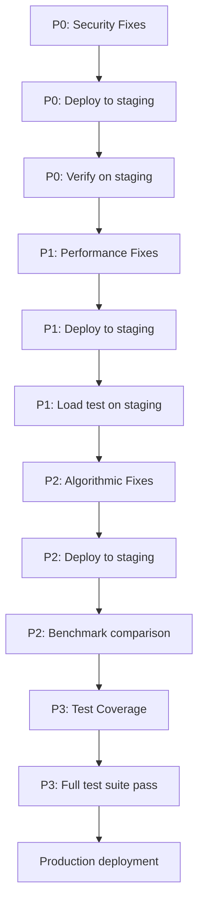

# Backend Refactoring Plan

> **Generated:** 2026-05-14
> **Scope:** `backend/` — Django REST API, Celery workers, signal processing, ML pipeline
> **Status:** Draft — pending review before implementation

---

## Summary Table

| # | Issue | Severity | File | Effort | Status |
|---|-------|----------|------|--------|--------|
| 1 | Webhook secret validation bypass | **P0 — Critical** | `activities/payments.py:47-49` | 5 min | Open |
| 2 | Middleware SQL DoS on every request | **P0 — Critical** | `core/middleware.py:17-26` | 10 min | Open |
| 3 | OAuth CSRF fallback to raw user_id | **P0 — Critical** | `activities/wearables.py:50-55` | 5 min | Open |
| 4 | SECRET_KEY unsafe fallback in production | **P0 — Critical** | `core/settings.py:11` | 5 min | Open |
| 5 | Double-encryption of refresh tokens | **P1 — High** | `activities/wearables.py:133, 287-288` | 15 min | Open |
| 6 | N+1 queries in admin dashboard | **P1 — High** | `activities/admin_views.py:92-109` | 20 min | Open |
| 7 | N+1 queries in analytics heatmap | **P1 — High** | `activities/heatmap.py:172-194` | 30 min | Open |
| 8 | O(N²) in Viterbi road matching | **P2 — Medium** | `activities/viterbi_matching.py:129` | 15 min | Open |
| 9 | prev_speed not reset on skip | **P2 — Medium** | `activities/signal_processing.py:289-290` | 5 min | Open |
| 10 | Artificial timestamps in anti-cheat gate | **P2 — Medium** | `activities/tasks.py:64` | 30 min | Open |
| 11 | Deprecated SECURE_BROWSER_XSS_FILTER | **P2 — Medium** | `core/settings.py:21` | 2 min | Open |
| 12 | Import organization | **P2 — Medium** | `activities/signal_processing.py:213`, `activities/services.py:53` | 10 min | Open |
| 13 | Missing tests: payments.py | **P3 — Test** | `activities/test_payments.py` (new) | 30 min | Open |
| 14 | Missing tests: middleware.py | **P3 — Test** | `core/test_middleware.py` (new) | 30 min | Open |
| 15 | Missing tests: admin_views.py | **P3 — Test** | `activities/test_admin_views.py` (new) | 30 min | Open |
| 16 | Missing tests: tasks.py pipeline | **P3 — Test** | `activities/test_tasks.py` (new) | 45 min | Open |
| 17 | Missing tests: ml_anomaly.py | **P3 — Test** | `activities/test_ml_anomaly.py` (new) | 30 min | Open |

---

## P0 — CRITICAL: Security (Fix Immediately, Block Deployment)

### Issue 1: Webhook Secret Validation Bypass

**File:** [`activities/payments.py:47-49`](activities/payments.py:47)

**Problem:**
```python
endpoint_secret = os.getenv('STRIPE_WEBHOOK_SECRET')
# If env var is not set, endpoint_secret is None
event = stripe.Webhook.construct_event(payload, sig_header, endpoint_secret)
```
When `STRIPE_WEBHOOK_SECRET` is not configured, `endpoint_secret` is `None`. Stripe's `construct_event` may accept `None` as a secret (depending on version), effectively **disabling signature verification**. This allows any attacker to forge webhook events — fake subscription creations, payment confirmations, etc.

**Fix:**
Add an explicit `None` check before calling `construct_event`. If the secret is not configured, reject the webhook with a 500-level error and log the misconfiguration.

```python
endpoint_secret = os.getenv('STRIPE_WEBHOOK_SECRET')
if not endpoint_secret:
    logger.critical("STRIPE_WEBHOOK_SECRET is not configured — rejecting webhook")
    return False
```

**Estimated effort:** 5 min (1 line + test)

**Files affected:**
- `backend/activities/payments.py`

**Test strategy:**
- Unit test: call `handle_webhook` with a valid payload when `STRIPE_WEBHOOK_SECRET` is unset — assert it returns `False` and logs a critical message.
- Unit test: call `handle_webhook` with an invalid signature — assert it returns `False`.
- Integration test: send a real Stripe test webhook event with the correct secret — assert it processes successfully.

---

### Issue 2: Middleware SQL DoS on Every Request

**File:** [`core/middleware.py:17-26`](core/middleware.py:17)

**Problem:**
`TenantRLSMiddleware` executes a SQL `set_config` query on **every single request**, including:
- Static file requests (`/static/`, `/media/`)
- Health checks (`/health/`)
- Favicon requests (`/favicon.ico`)
- Swagger docs (`/docs/`, `/redoc/`)
- Any other non-authenticated endpoint

Under load, this creates unnecessary database connections and can contribute to connection pool exhaustion.

**Fix:**
Add a skip-list for paths that don't need tenant context:

```python
SKIP_PATHS = ('/static/', '/media/', '/health/', '/favicon.ico', '/docs/', '/redoc/', '/admin/')

def __call__(self, request):
    if any(request.path.startswith(p) for p in self.SKIP_PATHS):
        return self.get_response(request)
    # ... rest of middleware
```

**Estimated effort:** 10 min (5 lines + test)

**Files affected:**
- `backend/core/middleware.py`

**Test strategy:**
- Unit test: request `/health/` — assert no SQL cursor is opened (mock `connection.cursor`).
- Unit test: request `/api/activities/` — assert SQL cursor IS opened.
- Unit test: request `/static/css/main.css` — assert no SQL cursor.
- Load test: simulate 1000 requests to `/health/` with and without the fix — compare DB connection count.

---

### Issue 3: OAuth CSRF Fallback to Raw user_id

**File:** [`activities/wearables.py:50-55`](activities/wearables.py:50)

**Problem:**
```python
def _store_oauth_state(user_id):
    try:
        r = get_redis()
        r.setex(f"oauth:state:{nonce}", OAUTH_STATE_TTL, str(user_id))
        return nonce
    except Exception:
        logger.warning("Redis unavailable — falling back to raw user_id.")
        return str(user_id)  # <-- CSRF vulnerability
```
When Redis is down, the OAuth state nonce becomes the raw `user_id`. An attacker can predict the state parameter and perform CSRF attacks to link their Strava/Garmin account to another user's account.

**Fix:**
Raise an exception or return `None` when Redis is unavailable. The OAuth flow should fail gracefully rather than weaken CSRF protection.

```python
    except Exception:
        logger.error("Redis unavailable for OAuth state — aborting flow")
        raise RuntimeError("OAuth state storage unavailable")
```

Note: `_resolve_oauth_state` already has partial handling for this; ensure both functions are consistent.

**Estimated effort:** 5 min (2 lines + test)

**Files affected:**
- `backend/activities/wearables.py`

**Test strategy:**
- Unit test: mock `get_redis()` to raise `ConnectionError` — assert `_store_oauth_state` raises `RuntimeError`.
- Unit test: verify `_resolve_oauth_state` also rejects raw user_id values.
- Integration test: complete OAuth flow with Redis available — assert success.

---

### Issue 4: SECRET_KEY Unsafe Fallback in Production

**File:** [`core/settings.py:11`](core/settings.py:11)

**Problem:**
```python
SECRET_KEY = os.getenv('SECRET_KEY', 'default-unsafe-key-for-dev')
```
If `SECRET_KEY` is not set in the environment, Django falls back to a hardcoded value. In production, this means:
- Session cookies can be forged by anyone who knows the default key
- CSRF tokens are predictable
- Password reset tokens are guessable

**Fix:**
Raise a `RuntimeError` if `SECRET_KEY` is not set and `DEBUG=False`:

```python
SECRET_KEY = os.getenv('SECRET_KEY')
if not SECRET_KEY and not DEBUG:
    raise RuntimeError(
        "SECRET_KEY must be set in production. "
        "Set the SECRET_KEY environment variable or generate one with "
        "python -c 'from django.core.management.utils import get_random_secret_key; print(get_random_secret_key())'"
    )
if not SECRET_KEY:
    SECRET_KEY = 'default-unsafe-key-for-dev'  # dev only, DEBUG=True
```

**Estimated effort:** 5 min (3 lines)

**Files affected:**
- `backend/core/settings.py`

**Test strategy:**
- Unit test: set `DEBUG=False` and unset `SECRET_KEY` — assert `RuntimeError` is raised during settings import.
- Unit test: set `DEBUG=True` and unset `SECRET_KEY` — assert settings load with fallback key.
- Unit test: set `SECRET_KEY` explicitly — assert it is used regardless of `DEBUG`.

---

## P1 — High Priority (Fix Within Sprint)

### Issue 5: Double-Encryption of Refresh Tokens

**File:** [`activities/wearables.py:133`](activities/wearables.py:133), [`activities/wearables.py:287-288`](activities/wearables.py:287)

**Problem:**
When Strava/Garmin token refresh doesn't return a new `refresh_token` in the API response, the code falls back to `integration.decrypted_refresh_token` — which is the **already-decrypted plaintext** value. This plaintext value is then assigned to `integration.refresh_token` (the encrypted field), and on `save()` it gets **re-encrypted**, resulting in double-encryption.

```python
# Strava (line 133)
integration.refresh_token = data.get('refresh_token', integration.decrypted_refresh_token)
# Garmin (line 288)
integration.refresh_token = data.get('refresh_token', integration.decrypted_refresh_token)
```

**Fix:**
Only assign `refresh_token` if the API actually returns a new one. Don't re-assign the existing value:

```python
# Strava
integration.access_token = data['access_token']
if 'refresh_token' in data:
    integration.refresh_token = data['refresh_token']
integration.expires_at = timezone.now() + timedelta(seconds=data['expires_in'])

# Garmin — same pattern
integration.access_token = data.get('access_token', integration.decrypted_access_token)
if 'refresh_token' in data:
    integration.refresh_token = data['refresh_token']
```

**Estimated effort:** 15 min (4 lines + test)

**Files affected:**
- `backend/activities/wearables.py`

**Test strategy:**
- Unit test: mock Strava response without `refresh_token` — assert `integration.refresh_token` is not modified.
- Unit test: mock Strava response with new `refresh_token` — assert it is updated.
- Unit test: verify that after save, the stored value can be decrypted correctly (no double-encryption).
- Same tests for Garmin flow.

---

### Issue 6: N+1 Queries in Admin Dashboard

**File:** [`activities/admin_views.py:92-109`](activities/admin_views.py:92)

**Problem:**
The admin dashboard loops over every active tenant and runs 4 separate queries per tenant:
```python
for tenant in Tenant.objects.filter(is_active=True):
    tenant_users = User.objects.filter(tenant=tenant).count()          # Query 1
    tenant_act_count = tenant_activities.count()                        # Query 2
    tenant_distance = tenant_activities.aggregate(Sum('distance'))      # Query 3
    tenant_verified = tenant_activities.filter(is_verified=True).count() # Query 4
```
With 50 tenants = **200 queries** per dashboard load.

**Fix:**
Replace the loop with a single annotated query:

```python
from django.db.models import Count, Sum, Q

per_tenant_stats = list(
    Tenant.objects.filter(is_active=True)
    .annotate(
        user_count=Count('user', distinct=True),
        activity_count=Count('activity', distinct=True),
        total_distance=Sum('activity__distance'),
        verified_count=Count('activity', filter=Q(activity__is_verified=True), distinct=True),
    )
    .values('id', 'name', 'user_count', 'activity_count', 'total_distance', 'verified_count',
            'primary_color', 'secondary_color')
)
```

Then compute `distance_km` and `verified_pct` in Python from the annotated values.

**Estimated effort:** 20 min (10 lines + test)

**Files affected:**
- `backend/activities/admin_views.py`

**Test strategy:**
- Unit test: assert the endpoint returns correct per-tenant stats for a known dataset.
- Performance test: use `assertNumQueries(1)` to verify only 1 query is executed for the tenant stats section.
- Integration test: create 50 tenants with varying activity counts — verify all stats are correct.

---

### Issue 7: N+1 Queries in Analytics Heatmap

**File:** [`activities/heatmap.py:172-194`](activities/heatmap.py:172)

**Problem:**
The analytics endpoint runs:
- 12 weekly queries (one per week for training load)
- 28 daily queries (one per day for ACWR)
- **Total: 40 queries per analytics request**

```python
for week_offset in range(11, -1, -1):
    km_sum = Activity.objects.filter(...).aggregate(total=Sum("distance"))  # 12 queries

for i in range(28):
    km = Activity.objects.filter(...).aggregate(total=Sum("distance"))      # 28 queries
```

**Fix:**
Use Django's `TruncDay`/`TruncWeek` with `GROUP BY` to aggregate in a single query:

```python
from django.db.models.functions import TruncDay, TruncWeek

# Single query for daily aggregation
daily_qs = (
    Activity.objects.filter(user=user, is_verified=True)
    .annotate(day=TruncDay('start_time'))
    .values('day')
    .annotate(total_distance=Sum('distance'))
    .order_by('day')
)

# Single query for weekly aggregation
weekly_qs = (
    Activity.objects.filter(user=user, is_verified=True)
    .annotate(week=TruncWeek('start_time'))
    .values('week')
    .annotate(total_distance=Sum('distance'))
    .order_by('week')
)
```

Then fill in missing days/weeks with zero in Python.

**Estimated effort:** 30 min (15 lines + test)

**Files affected:**
- `backend/activities/heatmap.py`

**Test strategy:**
- Unit test: verify daily_km output matches the old loop-based implementation for a known dataset.
- Unit test: verify weekly loads output matches the old implementation.
- Performance test: use `assertNumQueries(2)` to verify only 2 queries are executed.
- Edge case test: user with no activities — assert empty lists with correct date ranges.

---

## P2 — Medium Priority (Fix Within 2 Sprints)

### Issue 8: O(N²) in Viterbi Road Matching

**File:** [`activities/viterbi_matching.py:129`](activities/viterbi_matching.py:129)

**Problem:**
```python
nearest = min(road_points, key=lambda rp: haversine_m(...))
idx = road_points.index(nearest)  # O(N) scan
```
`road_points.index(nearest)` performs a linear scan to find the index of the nearest point. This is called for every observation that has no candidate within the radius, making the worst case **O(N × M)** where N = road points and M = observations.

**Fix:**
Track the index during the `min()` loop instead of doing a separate `index()` call:

```python
nearest = None
nearest_idx = -1
nearest_dist = float('inf')
for idx, rp in enumerate(road_points):
    d = haversine_m(obs.lat, obs.lon, rp.lat, rp.lon)
    if d < nearest_dist:
        nearest_dist = d
        nearest = rp
        nearest_idx = idx

candidates.append(RoadCandidate(
    lat=nearest.lat, lon=nearest.lon,
    road_idx=nearest_idx,
    dist_to_obs=nearest_dist,
))
```

**Estimated effort:** 15 min (5 lines + test)

**Files affected:**
- `backend/activities/viterbi_matching.py`

**Test strategy:**
- Unit test: verify the matched road index is correct for a known set of road points and observations.
- Performance test: run with 10,000 road points and 1,000 observations — compare execution time before/after.
- Property test: assert output is identical to the original implementation for random inputs.

---

### Issue 9: prev_speed Not Reset on Skip

**File:** [`activities/signal_processing.py:289-290`](activities/signal_processing.py:289)

**Problem:**
```python
for i in range(1, len(points)):
    dt = points[i].timestamp - points[i - 1].timestamp
    if dt <= 0:
        continue  # <-- prev_speed is NOT reset
    ...
    accel = (speed - prev_speed) / dt if prev_speed is not None else None
    prev_speed = speed
```
When `dt <= 0` (duplicate or out-of-order timestamp), the code skips the iteration but does **not** reset `prev_speed`. The next valid iteration will compute acceleration using a stale `prev_speed` from a potentially distant point, producing incorrect acceleration values.

**Fix:**
Reset `prev_speed = None` when skipping:

```python
    if dt <= 0:
        prev_speed = None  # Reset to avoid stale acceleration calculation
        continue
```

**Estimated effort:** 5 min (1 line + test)

**Files affected:**
- `backend/activities/signal_processing.py`

**Test strategy:**
- Unit test: create a track with a duplicate timestamp followed by a valid point — assert acceleration is `None` for the first valid point after the skip.
- Unit test: create a track with out-of-order timestamps — assert acceleration resets correctly.
- Property test: verify acceleration values are consistent for a clean track with no timestamp issues.

---

### Issue 10: Artificial Timestamps in Anti-Cheat Gate

**File:** [`activities/tasks.py:64`](activities/tasks.py:64)

**Problem:**
```python
raw_points = [GpsPoint(lat=c[1], lon=c[0], timestamp=float(i)) for i, c in enumerate(coords)]
```
The anti-cheat `fast_rejection_gate` relies on `dt` (time delta between consecutive points) to detect:
- Teleportation (large distance in small time)
- Unrealistic acceleration
- Motor vehicle fingerprints (unnaturally smooth speed)

Using `timestamp=float(i)` means every point has `dt=1.0` second, regardless of the actual GPS recording interval. This **completely defeats the anti-cheat gate** — a car traveling 30 m/s with real 5-second GPS intervals would appear to move 6 m/s with artificial 1-second timestamps.

**Fix:**
Extract real timestamps from activity telemetry. If the activity has a `start_time` and the GPS track includes time data, use those. Otherwise, use `start_time + offset` based on the actual recording interval:

```python
# Option A: If route_path has time data (e.g., GeoJSON with timestamps)
raw_points = [
    GpsPoint(lat=c[1], lon=c[0], timestamp=c[2])  # c[2] = timestamp
    for c in coords
]

# Option B: Use activity.start_time + estimated offset
from datetime import datetime
start_ts = activity.start_time.timestamp()
raw_points = [
    GpsPoint(lat=c[1], lon=c[0], timestamp=start_ts + i * 5.0)  # assume 5s interval
    for i, c in enumerate(coords)
]
```

**Estimated effort:** 30 min (10 lines + test)

**Files affected:**
- `backend/activities/tasks.py`
- Potentially `backend/activities/models.py` (if route_path schema needs updating)

**Test strategy:**
- Unit test: create an activity with known start_time and 10 GPS points — assert timestamps are realistic (not 0, 1, 2, ...).
- Unit test: verify `fast_rejection_gate` correctly detects a simulated car track when real timestamps are used.
- Integration test: process a real Strava activity — assert timestamps match the original GPX/TCX data.
- Regression test: verify the anti-cheat gate still passes for legitimate human activities.

---

### Issue 11: Deprecated SECURE_BROWSER_XSS_FILTER

**File:** [`core/settings.py:21`](core/settings.py:21)

**Problem:**
```python
SECURE_BROWSER_XSS_FILTER = True
```
This setting was removed in Django 3.0+. It has no effect in current Django versions and generates a deprecation warning. Modern browsers handle XSS protection via Content-Security-Policy headers, not the `X-XSS-Protection` header this setting controlled.

**Fix:**
Remove the line entirely.

**Estimated effort:** 2 min (-1 line)

**Files affected:**
- `backend/core/settings.py`

**Test strategy:**
- Smoke test: start Django server — assert no deprecation warnings in logs.
- Verify `python manage.py check` passes without warnings.

---

### Issue 12: Import Organization

**Files:** [`activities/signal_processing.py:213`](activities/signal_processing.py:213), [`activities/services.py:53`](activities/services.py:53)

**Problem:**
- `import os` appears at line 213 in `signal_processing.py`, in the middle of the file after constants and docstrings.
- `from .models import PrivacyZone` appears at line 53 in `services.py`, after a class definition and method.

This violates PEP 8 (imports should always be at the top of the file) and can cause:
- Circular import issues
- Linter warnings
- Confusion for developers reading the file

**Fix:**
Move all imports to the top of each file, organized as:
1. Standard library imports
2. Third-party imports
3. Local application imports

**Estimated effort:** 10 min (cosmetic)

**Files affected:**
- `backend/activities/signal_processing.py`
- `backend/activities/services.py`

**Test strategy:**
- Run `ruff check` or `flake8` — assert no import-order warnings.
- Run existing test suite — assert no regressions.

---

## P3 — Test Coverage (Parallel with P0-P2)

### Issue 13: Add Tests for `payments.py`

**Scope:** Webhook signature validation, missing secret handling, event type routing.

**Test cases:**
| Test | Description |
|------|-------------|
| `test_webhook_missing_secret` | `STRIPE_WEBHOOK_SECRET` unset — returns `False`, logs critical |
| `test_webhook_invalid_signature` | Wrong signature — returns `False`, logs warning |
| `test_webhook_valid_signature` | Correct signature — processes event, returns `True` |
| `test_webhook_checkout_session_completed` | `checkout.session.completed` event — creates/updates subscription |
| `test_webhook_invoice_payment_failed` | `invoice.payment_failed` event — marks subscription as past_due |
| `test_webhook_customer_subscription_deleted` | `customer.subscription.deleted` event — cancels subscription |

**Estimated effort:** 30 min

**New file:** `backend/activities/test_payments.py`

---

### Issue 14: Add Tests for `middleware.py`

**Scope:** `TenantRLSMiddleware` skip paths, `ImpersonationAuditMiddleware` logging.

**Test cases:**
| Test | Description |
|------|-------------|
| `test_middleware_skips_static` | `/static/css/main.css` — no SQL cursor opened |
| `test_middleware_skips_health` | `/health/` — no SQL cursor opened |
| `test_middleware_skips_favicon` | `/favicon.ico` — no SQL cursor opened |
| `test_middleware_skips_docs` | `/docs/` and `/redoc/` — no SQL cursor opened |
| `test_middleware_sets_tenant` | Authenticated request to `/api/activities/` — `set_config` called with tenant_id |
| `test_middleware_clears_tenant` | Unauthenticated request — `set_config` called with empty string |
| `test_impersonation_audit_post` | Impersonated POST request — AuditLog entry created |
| `test_impersonation_audit_get` | Impersonated GET request — no AuditLog entry |

**Estimated effort:** 30 min

**New file:** `backend/core/test_middleware.py`

---

### Issue 15: Add Tests for `admin_views.py`

**Scope:** Permission checks, N+1 fix verification, response schema.

**Test cases:**
| Test | Description |
|------|-------------|
| `test_admin_dashboard_requires_auth` | Unauthenticated request — returns 401 |
| `test_admin_dashboard_requires_staff` | Non-staff authenticated request — returns 403 |
| `test_admin_dashboard_returns_stats` | Staff request — returns correct total_users, total_activities |
| `test_admin_dashboard_per_tenant` | Response includes per_tenant_stats with correct structure |
| `test_admin_dashboard_query_count` | Uses `assertNumQueries` to verify N+1 is fixed (≤ 3 queries total) |
| `test_admin_dashboard_inactive_tenants_excluded` | Inactive tenants not in per_tenant_stats |

**Estimated effort:** 30 min

**New file:** `backend/activities/test_admin_views.py`

---

### Issue 16: Add Tests for `tasks.py` Celery Pipeline

**Scope:** Full pipeline integration with mocked BRouter, Redis, and external services.

**Test cases:**
| Test | Description |
|------|-------------|
| `test_process_activity_pipeline_success` | Full pipeline — returns `{"status": "success"}` |
| `test_process_activity_pipeline_empty_route` | Activity with no route — returns `{"status": "skipped"}` |
| `test_fast_rejection_gate_car` | Simulated car track — gate fails with reason |
| `test_fast_rejection_gate_human` | Simulated human run — gate passes |
| `test_viterbi_matching_integration` | Activity with GPS track — returns matched route |
| `test_privacy_masking_integration` | Activity near privacy zone — path is masked |
| `test_pipeline_brouter_failure` | Mock BRouter returns 500 — pipeline handles gracefully |
| `test_pipeline_redis_failure` | Mock Redis down — pipeline handles gracefully |

**Estimated effort:** 45 min

**New file:** `backend/activities/test_tasks_pipeline.py`

---

### Issue 17: Add Tests for `ml_anomaly.py`

**Scope:** Feature extraction, inference, missing model fallback.

**Test cases:**
| Test | Description |
|------|-------------|
| `test_feature_extraction_human` | Human running track — features within normal range |
| `test_feature_extraction_car` | Car track — features flagged as anomalous |
| `test_inference_with_model` | Model file exists — returns anomaly score |
| `test_inference_missing_model` | No model file — returns `None` gracefully, logs warning |
| `test_inference_sklearn_missing` | scikit-learn not installed — returns `None` gracefully |
| `test_model_training` | `train_model()` with sample data — saves model file |
| `test_feature_vector_shape` | Feature vector has 8 elements |

**Estimated effort:** 30 min

**New file:** `backend/activities/test_ml_anomaly.py`

---

## Testing Strategy

### Overall Approach

| Phase | Scope | Method |
|-------|-------|--------|
| **Phase 1** | P0 security fixes | Unit tests + manual verification before merge |
| **Phase 2** | P1 performance fixes | Unit tests + `assertNumQueries` + load testing |
| **Phase 3** | P2 algorithmic fixes | Unit tests + property-based tests + benchmark comparison |
| **Phase 4** | P3 test coverage | Full test suite — target ≥ 80% coverage on affected modules |

### Test Infrastructure

- **Framework:** `pytest` with `pytest-django`
- **Database:** SQLite for unit tests, PostgreSQL for integration tests (via `pytest.mark.django_db`)
- **Mocking:** `unittest.mock.patch` for Redis, Stripe API, BRouter, external HTTP calls
- **Performance:** `django.test.utils.CaptureQueriesContext` for N+1 verification
- **CI:** Run full test suite on every PR to `main`

### Coverage Targets

| Module | Current | Target |
|--------|---------|--------|
| `activities/payments.py` | ~0% | ≥ 80% |
| `core/middleware.py` | ~0% | ≥ 80% |
| `activities/wearables.py` | ~60% | ≥ 85% |
| `activities/admin_views.py` | ~0% | ≥ 80% |
| `activities/heatmap.py` | ~0% | ≥ 75% |
| `activities/viterbi_matching.py` | ~40% | ≥ 80% |
| `activities/signal_processing.py` | ~50% | ≥ 80% |
| `activities/tasks.py` | ~0% | ≥ 70% |
| `activities/ml_anomaly.py` | ~0% | ≥ 75% |

---

## Rollout Plan

### Order of Deployment



### Detailed Rollout Steps

1. **P0 — Security Hotfix (Day 1)**
   - Fix all 4 P0 issues in a single branch `hotfix/p0-security`
   - Run full test suite locally
   - Deploy to staging
   - Manual verification: webhook flow, OAuth flow, admin login, health endpoint
   - Merge to `main` and deploy to production
   - **Blocker:** No other deployments until P0 is live

2. **P1 — Performance Sprint (Days 2-4)**
   - Fix double-encryption bug (Issue 5) — highest risk of data corruption
   - Fix N+1 queries (Issues 6, 7) — highest impact on user experience
   - Deploy to staging
   - Load test: simulate 100 concurrent users on admin dashboard and analytics
   - Verify query counts with Django Debug Toolbar
   - Merge to `main`

3. **P2 — Algorithmic Cleanup (Days 5-7)**
   - Fix Viterbi O(N²) (Issue 8)
   - Fix prev_speed reset (Issue 9)
   - Fix artificial timestamps (Issue 10) — requires careful testing with real activity data
   - Remove deprecated setting (Issue 11)
   - Clean up imports (Issue 12)
   - Deploy to staging
   - Benchmark: compare route matching accuracy and anti-cheat detection rates
   - Merge to `main`

4. **P3 — Test Coverage (Parallel, Days 1-7)**
   - Write all new test files alongside P0-P2 fixes
   - Run coverage report: `pytest --cov=backend --cov-report=html`
   - Ensure all new code has ≥ 80% line coverage
   - Add tests to CI pipeline

5. **Production Deployment**
   - All P0-P2 fixes merged
   - Full test suite passing on CI
   - Deploy to production during low-traffic window
   - Monitor error rates, response times, and DB connection pool for 24 hours

---

## Risk Assessment

| Risk | Likelihood | Impact | Mitigation |
|------|------------|--------|------------|
| P0 fix breaks webhook processing | Low | High | Test with Stripe CLI before deploying |
| N+1 fix changes response schema | Low | Medium | Verify JSON schema matches old output exactly |
| Viterbi fix changes route matching accuracy | Medium | Medium | Property tests to ensure identical output |
| Anti-cheat timestamp fix rejects legitimate activities | Medium | High | Test with 100+ real Strava activities before deploying |
| Double-encryption fix corrupts existing tokens | Low | High | Migration to re-encrypt any double-encrypted tokens |

---

## Appendix: File Map

| File | Issues | Priority |
|------|--------|----------|
| `backend/activities/payments.py` | 1 | P0 |
| `backend/core/middleware.py` | 2 | P0 |
| `backend/activities/wearables.py` | 3, 5 | P0, P1 |
| `backend/core/settings.py` | 4, 11 | P0, P2 |
| `backend/activities/admin_views.py` | 6 | P1 |
| `backend/activities/heatmap.py` | 7 | P1 |
| `backend/activities/viterbi_matching.py` | 8 | P2 |
| `backend/activities/signal_processing.py` | 9, 12 | P2 |
| `backend/activities/tasks.py` | 10 | P2 |
| `backend/activities/services.py` | 12 | P2 |
| `backend/activities/ml_anomaly.py` | 17 | P3 |
