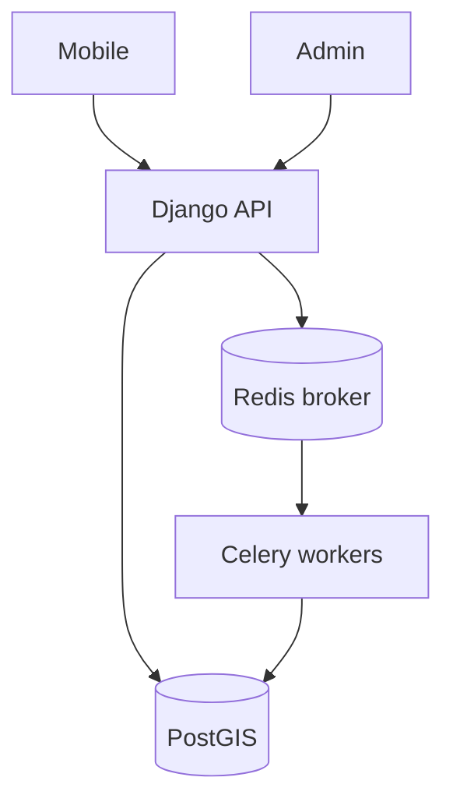

# 4VELO architecture

| | |
|--|--|
| **Status** | Active |
| **Owner role** | Tech Lead |
| **Last reviewed** | 2026-09-10 |
| **Audience** | Developers |
| **lang** | en |
| **translation** | [Polski](pl/ARCHITECTURE.md) |
| **canonical_path** | docs/ARCHITECTURE.md |

This describes repository code and configuration, not verified production deployment. Dependency manifests and the lockfile define exact versions; this page does not duplicate them.

## Component boundaries

| Path | Technology | Responsibility |
|---|---|---|
| [backend/](../backend/) | Django / DRF | API, auth, tenants, activities, rewards; Celery tasks |
| [telemetry/](../telemetry/) | FastAPI | GPS ingest, Redis queue, live WebSocket delivery |
| [admin/](../admin/) | React / Vite / Mantine | GLOBAL_ADMIN, LOCAL_ADMIN, MODERATOR; optional Electron |
| [mobile/](../mobile/) | Expo / React Native | GPS tracking, local storage, API access |
| [packages/api-client/](../packages/api-client/) | OpenAPI / Orval | Shared API paths and generated client |
| [packages/tokens/](../packages/tokens/) | TypeScript | Shared design tokens |
| [packages/eslint-config/](../packages/eslint-config/) | ESLint | Shared lint configuration |
| [packages/tsconfig/](../packages/tsconfig/) | TypeScript | Shared compiler configuration |

## Flows and responsibilities

- The backend stores domain data in PostGIS. `backend/core/settings.py` defines Celery queues and the beat schedule; workers execute tasks received through the Redis broker.
- Telemetry has its own entry point in `telemetry/main.py`. Ingest, queue, database and WebSocket handling live in separate service modules. Code presence does not prove ingestion durability during failure.
- Backend and simulator code call BRouter/OSRM. Stripe, SendGrid and wearable integrations also belong to backend code, not to the database or Redis.
- `backend/users/` owns users, tenants and permissions; `activities/` owns activities, simulation and integrations; `events/`, `clubs/`, `rewards/` own their domains. Shared configuration lives in `core/`.
- Authorization must be checked in endpoints, query filters and RLS policies. RLS presence alone does not establish isolation of all data.

## Deployment and verification limits

Compose, Railway worker directories and Kubernetes manifests describe deployment variants. They are not an inventory of running production services. Environment configuration, backups, MFA, simulator capacity and tenant isolation need separate operational evidence.

Do not edit `packages/api-client/src/generated/` manually. Start contract changes with the backend and OpenAPI export, then run the generator and review its diff.

## Further reading

- [Repository map](reports/REPOSITORY_MAP.md)
- [Quality command matrix](reports/QUALITY_COMMAND_MATRIX.md)
- [Risk and ownership map](reports/RISK_AND_OWNERSHIP_MAP.md)
- [Container diagrams](diagrams/architecture_c4.md)
- [BRouter operations](operations/BROUTER.md)
