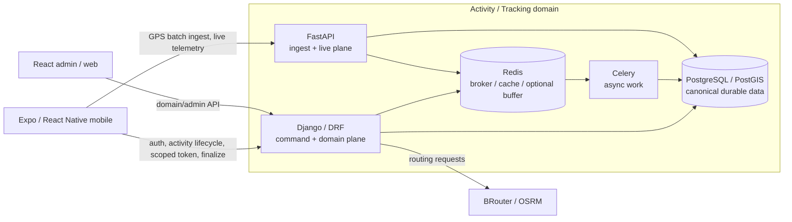

# 4VELO architecture

| | |
|--|--|
| **Status** | ✅ Active |
| **Document class** | REFERENCE |
| **Owner role** | Tech Lead |
| **Last reviewed** | 2026-09-30 |
| **Audience** | Developers, reviewers, operators |
| **lang** | en |
| **translation** | [Polski](pl/ARCHITECTURE.md) |
| **canonical_path** | docs/ARCHITECTURE.md |

This is the central architecture SSOT for repository boundaries and data ownership. It describes the intended runtime contracts implemented by the repository; it does **not** prove which deployment variant is currently running in production.

## 1. System at a glance


```mermaid
flowchart LR
  Mobile[Expo / React Native mobile]
  Admin[React admin / web]

  subgraph Domain["Activity / Tracking domain"]
    Django[Django / DRF\ncommand + domain plane]
    Telemetry[FastAPI\ningest + live plane]
    Workers[Celery\nasync work]
    DB[(PostgreSQL / PostGIS\ncanonical durable data)]
    Redis[(Redis\nbroker / cache / optional buffer)]

    Django --> DB
    Django --> Redis
    Redis --> Workers
    Workers --> DB
    Telemetry --> DB
    Telemetry --> Redis
  end

  Mobile -->|auth, activity lifecycle, scoped token, finalize| Django
  Mobile -->|GPS batch ingest, live telemetry| Telemetry
  Admin -->|domain/admin API| Django

  Django -->|routing requests| Routing[BRouter / OSRM]
```

The important boundary is **domain authority**, not process count:

- **Django is the command/domain plane**: identity, auth, tenants/RBAC, Activity lifecycle and durable finalization.
- **FastAPI is the ingest/live execution plane**: high-rate telemetry validation, load isolation, durable telemetry persistence and live delivery.
- Django and FastAPI are two execution planes inside the same **Activity / Tracking domain**. FastAPI is not an independent business source of truth.
- **PostgreSQL/PostGIS is canonical durable storage.**
- **Redis is infrastructure**: broker, cache, dedupe aid and optional buffering. It is not the authority for critical activity completion or delete-safe acknowledgement.

## 2. Repository component boundaries

| Path | Responsibility | Authority |
|---|---|---|
| [backend/](../backend/) | Django/DRF APIs, auth, tenants, activities, clubs/events/rewards, finalization, Celery tasks | Business/domain command authority |
| [telemetry/](../telemetry/) | GPS ingest, durable receipt path, load guard integration, live WebSocket/bridge paths | Telemetry execution plane |
| [mobile/](../mobile/) | Ride UX, local encrypted durability, GPS/background recording, durable upload outbox | Producer-side retryable copy until durable ACK |
| [admin/](../admin/) | Administrative and moderation UI | Client of domain APIs |
| [packages/api-client/](../packages/api-client/) | Shared API paths/generated contracts | Contract artifact; generated code is not hand-edited |
| [packages/tokens/](../packages/tokens/) | Shared design tokens | UI contract |
| [infrastructure/](../infrastructure/) | Compose/Kubernetes/Traccar and deployment assets | Deployment descriptions, not production proof |

## 3. Activity / Tracking domain

### 3.1 Command plane — Django

Django owns:

- authenticated user and tenant identity;
- Activity creation and lifecycle;
- authorization and RLS-facing context;
- issuing short-lived activity-scoped telemetry tokens;
- durable finalization and derived canonical route publication;
- business effects that depend on a durably completed activity.

A mobile screen must not treat a locally stopped recording as equivalent to a durably completed Activity.

### 3.2 Ingest/live plane — FastAPI

FastAPI owns execution concerns for the telemetry path:

- validating/scoping incoming telemetry;
- applying ingest guard/backpressure;
- persisting public GPS rows;
- persisting immutable ingest receipts used by finalization;
- optional legacy/non-critical queueing;
- live telemetry delivery/bridging.

Separating this plane from Django isolates a high-rate workload. It does **not** create a second Activity authority.

### 3.3 Canonical data and derived data

| Data | Role |
|---|---|
| mobile encrypted GPS buffer/outbox | Retryable producer copy; retained until delete-safe ACK |
| `gps_points` | Canonical public persisted telemetry coordinates |
| `telemetry_ingest_receipts` | Immutable batch ACK/coverage proof |
| `Activity` | Domain lifecycle record |
| `Activity.route_path` | Derived canonical route rebuilt/reconciled from durable telemetry during finalization |
| Redis dedupe/queue state | Operational optimization; never sufficient critical-data truth by itself |

## 4. Critical telemetry ACK invariant

[ADR 015](adr/015-critical-data-acknowledgement.md) is authoritative for critical-data acknowledgement.

For the receipt-backed mobile activity path:

```text
mobile durable outbox
      |
      v
FastAPI validates batch identity
      |
      v
PostgreSQL transaction
  ├─ public gps_points
  └─ telemetry_ingest_receipts
      |
      v
COMMIT
      |
      v
delete-safe ACK
      |
      v
mobile may remove local batch
```

A Redis Stream `XADD` alone is **not** a delete-safe ACK boundary for this path. Under guard pressure, the client retains its local durable copy and retries according to `Retry-After` unless a separately qualified durable-journal contract is introduced.

See [ADR 011](adr/011-telemetry-ingest-durability-under-load.md) for burst/load history and [DATA_RESILIENCE.md](DATA_RESILIENCE.md) for the end-to-end durability model.

## 5. Mobile application boundary

The normative mobile dependency direction is defined in [MOBILE_APPLICATION_ARCHITECTURE_V1](design/MOBILE_APPLICATION_ARCHITECTURE_V1.md):

```text
screen / component
  -> feature hook or controller
  -> feature interface
  -> production or deterministic adapter
  -> existing service / domain layer
```

New presentation code must not directly own raw GPS managers, MMKV/SecureStore, background tracking or raw API transport.

The current migration intentionally keeps proven GPS/durability services while moving presentation behind feature controllers. The production Ride adapter may still delegate to legacy orchestration until each lifecycle transition has a semantic domain command and acceptance proof.

## 6. Ride lifecycle truth

The first rebuilt Ride flow is defined by [MOBILE_RIDE_FLOW_V1](design/MOBILE_RIDE_FLOW_V1.md).

Key invariant:

```text
recording stopped
      !=
durable activity success
```

Terminal UI/business effects must distinguish:

- `durable-success`;
- `pending-finalization`;
- `recovery-required`.

PAUSE/RESUME semantics are a domain lifecycle concern, not a presentation flag. Until that transition is fully implemented and persisted, UI state alone must not be treated as authoritative lifecycle truth.

## 7. Background recording vs live delivery

These are separate capabilities:

- **background recording durability**: keeping GPS data safe across screen-off/process death and recovering the same activity identity;
- **background live delivery**: how fresh a remote viewer sees the rider while the app is backgrounded.

Accepted mobile runtime evidence proves the recording durability chain. It does not by itself establish a live-delivery freshness SLO. Any live-tracking guarantee needs its own product contract and physical runtime proof.

## 8. Security and tenancy boundary

Authorization is defense-in-depth:

- endpoint permission checks;
- owner/tenant-scoped querysets;
- scoped telemetry token validation;
- PostgreSQL RLS where applicable.

RLS presence does not replace application authorization, and application authorization does not justify bypassing RLS. Production security configuration must eventually fail closed on required signing/auth authority; operational proof lives in security/release documentation, not in this architecture page.

## 9. Async work and integrations

Celery/Redis are execution infrastructure for asynchronous domain work. External services such as routing engines, email, payments and wearable integrations are adapters invoked from domain-owned code; they do not become sources of domain truth merely because they run separately.

## 10. Deployment boundary

Compose, Railway descriptors and Kubernetes manifests describe supported deployment variants. They are **not** proof that a specific topology is currently live.

Release/runtime truth requires exact-SHA evidence from the appropriate gates. See:

- [Full Release lane](ci/FULL_RELEASE_LANE_V1.md)
- [Pre-release verification](pl/operations/PRE_RELEASE_VERIFICATION.md)
- [Home Lab](pl/operations/HOME_LAB.md)
- [Mobile runtime acceptance](quality/MOBILE_RUNTIME_ACCEPTANCE_V1.md)

## 11. Architecture authorities

Use these documents together:

| Concern | Authority |
|---|---|
| System/component boundaries | this document + [C4 diagrams](diagrams/architecture_c4.md) |
| Architectural decisions | [ADR index](adr/README.md) |
| Critical-data ACK | [ADR 015](adr/015-critical-data-acknowledgement.md) |
| Telemetry burst/load | [ADR 011](adr/011-telemetry-ingest-durability-under-load.md) |
| GPS/data durability | [DATA_RESILIENCE.md](DATA_RESILIENCE.md) |
| Mobile dependency direction | [MOBILE_APPLICATION_ARCHITECTURE_V1](design/MOBILE_APPLICATION_ARCHITECTURE_V1.md) |
| Ride state machine | [MOBILE_RIDE_FLOW_V1](design/MOBILE_RIDE_FLOW_V1.md) |
| Runtime proof | [MOBILE_RUNTIME_ACCEPTANCE_V1](quality/MOBILE_RUNTIME_ACCEPTANCE_V1.md) |
| Repo ownership/map | [REPOSITORY_MAP](reports/REPOSITORY_MAP.md) |

Do not use dated takeover plans, old audits or archived implementation proposals as current architecture authority.
