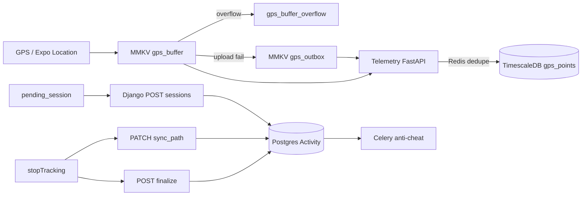

# Odporność na utratę danych — 4VELO / stunning-pancake

Dokument opisuje warstwy trwałości danych GPS i sesji treningowych oraz pozostałe ryzyka.

## Warstwy (od klienta do serwera)



### 1. MMKV na urządzeniu (`mobile/src/services/gpsSyncStorage.ts`, `GpsSyncManager.ts`)

| Klucz | Rola |
|-------|------|
| `gps_buffer` | Aktywny bufor punktów (do 2000; starsze trafiają do `gps_buffer_overflow`) |
| `gps_outbox` | Partie, które nie wyszły po 5 próbach — ponawiane przy starcie i co 30 s |
| `tracking_state` / `current_stats` | Stan trasy i metryk na żywo |
| `pending_session` | Payload POST `sessions/` gdy tworzenie sesji się nie uda |
| `tracking_recovery_pending` | Flaga UI: możliwe wznowienie / dokończenie uploadu |

**Recovery przy starcie:** `recoverGpsDataOnLaunch()` (wywołane z `App.tsx`) — retry `pending_session`, `processGpsOutbox()`, upload bufora.

**Koniec sesji:** flush outbox + bufor → `sync_path` (GeoJSON lista `[lon, lat]`, merge z istniejącą trasą) → `finalize` (idempotentny `end_time`, `distance`).

### 2. Telemetry (Railway / FastAPI)

- `POST /api/telemetry/ingest/batch` przyjmuje opcjonalne `client_batch_id`.
- Redis: `telemetry:dedupe:{client_batch_id}` TTL 7 dni (`TELEMETRY_DEDUPE_TTL_S`) — duplikat zwraca `deduped: true`, `inserted: 0` bez ponownego INSERT.

### 3. Django Activity

- `PATCH .../sync_path/` — parsuje listę współrzędnych / GeoJSON LineString, **scala** z `route_path`, idempotentny `200` przy tym samym `path_hash` (Redis 7 dni).
- `POST .../finalize/` — idempotentne zakończenie; ponowne wywołanie zwraca `200` z tym samym rekordem.

### 4. Wearables / leaderboard

Bez zmian w tym PR: dedupe `external_id`, idempotentny kredyt leaderboard — warstwa importu z zewnątrz.

## Zaimplementowane vs zaplanowane

| Element | Status |
|---------|--------|
| Recovery przy starcie + outbox | ✅ Kod |
| Overflow bufora zamiast cichego truncate | ✅ Kod |
| `client_batch_id` (mobile + telemetry Redis) | ✅ Kod |
| `pending_session` + `createSessionWithDurability` | ✅ Kod (wymaga użycia w ekranie startu jazdy) |
| `sync_path` merge + hash | ✅ Kod |
| `finalize` endpoint | ✅ Kod |
| NetInfo — upload po powrocie sieci | 📋 Dokumentacja (brak `@react-native-community/netinfo` w `package.json`) |
| UI „Wznów śledzenie” | 📋 Flaga `tracking_recovery_pending`; ekran HUD do podpięcia |
| UNIQUE w DB na `(activity_id, client_batch_id)` | 📋 Redis wystarcza bez migracji Timescale |
| PowerSync / offline-first DB | 📋 Osobna inicjatywa (`@powersync/react-native` w deps, nieaktywne) |

## Pozostałe ryzyka (uczciwie)

- **Zniszczenie telefonu** przed jakimkolwiek uploadem — dane tylko lokalnie, bez odzysku.
- **MMKV mock** w tle przy awarii JSI — punkty mogą nie zostać zapisane (log + Crashlytics).
- **Rozbieżność tras:** telemetry `gps_points` vs `Activity.route_path` — pełna rekonsyliacja wymaga joba serwerowego (nie zaimplementowany).
- **Brak NetInfo** — outbox odświeża się przy starcie i co 30 s, nie natychmiast po sieci.

## Deploy telemetry (Railway)

1. Wdróż serwis `telemetry` z aktualnym `main.py` (dedupe Redis).
2. Upewnij się, że `REDIS_URL` jest ustawione (ten sam Redis co Django zalecany).
3. Opcjonalnie: `TELEMETRY_DEDUPE_TTL_S` (domyślnie 604800 = 7 dni).
4. **Brak migracji DB** — tabela `gps_points` bez nowych kolumn.
5. Zweryfikuj: dwa razy ten sam `client_batch_id` → drugi response `deduped: true`.

## Deploy backend (Django)

- Nowe akcje na istniejącym routerze `sessions` — bez zmiany URL-i poza `finalize/` i rozszerzone `sync_path/`.
- Redis wymagany dla idempotentnego `path_hash` (graceful degrade: brak Redis = brak dedupe po hash).

## Testy

```bash
cd mobile && npm test -- __tests__/services/gpsSyncStorage.test.ts
cd backend && python manage.py test activities.test_route_sync
cd telemetry && pip install pytest pytest-asyncio && pytest test_ingest_dedupe.py -q
```
