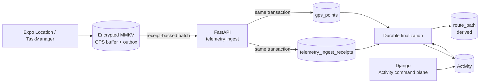
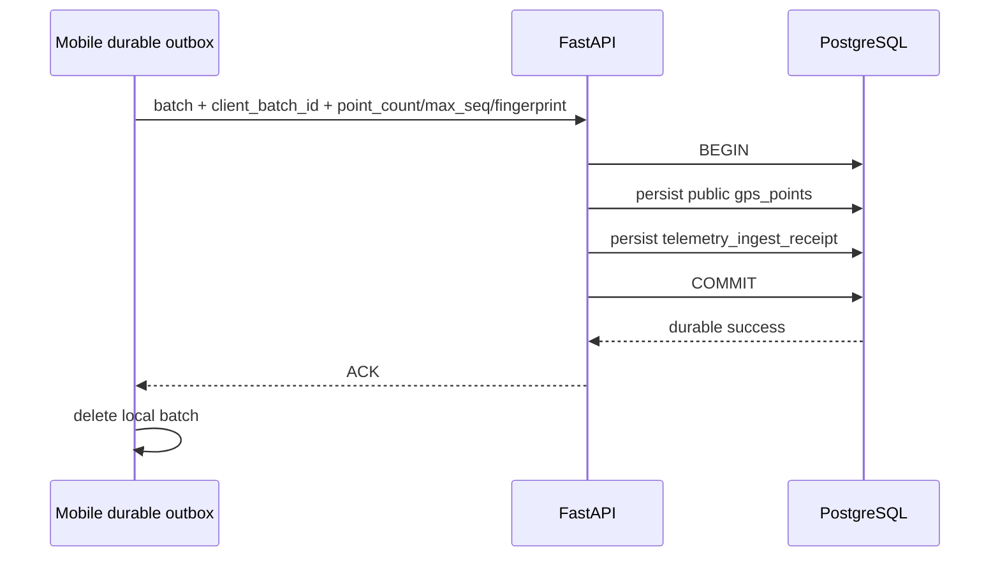

# 4VELO data resilience

| | |
|--|--|
| **Status** | ✅ Active |
| **Document class** | REFERENCE |
| **Owner role** | Mobile Lead / Platform Lead |
| **Last reviewed** | 2026-09-30 |
| **Audience** | Mobile, backend, telemetry, reviewers |
| **lang** | en |
| **translation** | [Polski](pl/DATA_RESILIENCE.md) |
| **canonical_path** | docs/DATA_RESILIENCE.md |

This document defines the end-to-end durability contract for Ride GPS data. It is intentionally narrower than deployment/runbooks: it answers **which copy is authoritative at each stage, when a producer may delete data, and how a stopped recording becomes a durably completed Activity**.

Related authorities:

- [ADR 004 — MMKV persistence](adr/004-persistent-storage-mmkv.md)
- [ADR 011 — telemetry under burst load](adr/011-telemetry-ingest-durability-under-load.md)
- [ADR 015 — critical-data acknowledgement](adr/015-critical-data-acknowledgement.md)
- [Architecture](ARCHITECTURE.md)
- [Mobile operations](pl/operations/MOBILE.md)

## 1. Durability model


```mermaid
flowchart LR
  GPS[Expo Location / TaskManager]
  Local[(Encrypted MMKV\nGPS buffer + outbox)]
  Django[Django\nActivity command plane]
  Tel[FastAPI\ntelemetry ingest]
  Points[(gps_points)]
  Receipts[(telemetry_ingest_receipts)]
  Finalize[Durable finalization]
  Activity[(Activity)]
  Route[(route_path\nderived)]

  GPS --> Local
  Local -->|receipt-backed batch| Tel
  Tel -->|same transaction| Points
  Tel -->|same transaction| Receipts
  Django --> Activity
  Receipts --> Finalize
  Points --> Finalize
  Activity --> Finalize
  Finalize --> Route
  Finalize --> Activity
```

The mobile outbox is the producer's retryable copy. It remains authoritative for retry until the server crosses the delete-safe ACK boundary.

## 2. Source-of-truth table

| State/data | Authority | Notes |
|---|---|---|
| GPS not yet durably accepted by server | encrypted mobile buffer/outbox | Must survive process death; do not delete on timeout/ambiguous response |
| persisted public GPS coordinates | PostgreSQL `gps_points` | Server durable telemetry evidence |
| batch acceptance/coverage | PostgreSQL `telemetry_ingest_receipts` | Immutable receipt identity/coverage used by finalization |
| Activity lifecycle | Django `Activity` | Command/domain authority |
| final canonical route | derived `Activity.route_path` | Rebuilt/reconciled from durable telemetry during finalization |
| Redis dedupe/queue/cache | operational state | Helpful for performance/legacy traffic; not sufficient critical-data truth |

## 3. Mobile durable producer

The current mobile durability chain uses encrypted local storage and a persistent outbox.

Important invariants:

- GPS/background production writes to persistent storage, not JS-memory-only state.
- The same Activity identity is recovered after process death where recovery is possible.
- A batch has stable identity and sequence metadata for idempotent retries.
- Failed/ambiguous uploads remain in the outbox.
- Upload workers are single-flight per Activity to avoid parallel retry storms.
- Only a server response that satisfies the critical ACK contract allows local deletion.

Accepted runtime evidence for encrypted storage, lost-key fail-closed behavior and locked/background producer continuity is tracked by the mobile recovery lane; see [MOBILE_RUNTIME_ACCEPTANCE_V1](quality/MOBILE_RUNTIME_ACCEPTANCE_V1.md).

## 4. Activity-scoped telemetry authentication

Mobile obtains a short-lived Activity-scoped telemetry JWT through the authenticated Django command plane, then uses that token against FastAPI ingest.

This separates:

- user/session authentication and Activity ownership — Django;
- high-rate telemetry ingestion — FastAPI.

The scoped token does not make FastAPI a second Activity authority; it is an execution credential for one Activity.

## 5. Delete-safe ACK boundary

[ADR 015](adr/015-critical-data-acknowledgement.md) is authoritative.

For a receipt-backed critical Activity batch, delete-safe ACK occurs only after PostgreSQL commits the durable evidence required by finalization.


```mermaid
sequenceDiagram
  participant M as Mobile durable outbox
  participant T as FastAPI
  participant P as PostgreSQL

  M->>T: batch + client_batch_id + point_count/max_seq/fingerprint
  T->>P: BEGIN
  T->>P: persist public gps_points
  T->>P: persist telemetry_ingest_receipt
  T->>P: COMMIT
  P-->>T: durable success
  T-->>M: ACK
  M->>M: delete local batch
```

Rules:

- timeout before confirmed ACK → retain and retry;
- `429/503 + Retry-After` → retain and retry later;
- Redis `XADD` alone → **not** delete-safe ACK for this path;
- duplicate/retry → validate against durable receipt identity; do not create duplicate route evidence;
- a fully privacy-dropped batch still needs receipt coverage so finalization can distinguish intentional dropping from missing telemetry.

Legacy/non-receipt queue traffic may still use Redis according to its own contract; it must not weaken the receipt-backed Activity path.

## 6. Durable finalization

Stopping GPS production is not equivalent to completing an Activity.

The finalization barrier uses durable server evidence to decide whether completion is truthful.

Conceptually:

```text
stop local recording
    |
flush/retry outstanding durable outbox
    |
request finalize
    |
Django verifies durable receipt coverage / telemetry truth
    |
rebuild/reconcile canonical route from durable gps_points
    |
commit final Activity truth
    |
durable-success
```

If required telemetry is not yet durable, the client/domain must represent a pending/recovery state rather than impersonating success.

The Ride UI contract therefore distinguishes:

- `durable-success`;
- `pending-finalization`;
- `recovery-required`.

## 7. Failure behavior

| Failure | Required behavior |
|---|---|
| network disappears during Ride | keep recording locally; outbox remains retryable |
| request times out after server may have committed | retry same batch identity; server resolves idempotently |
| telemetry service overloaded | respect `Retry-After`; do not clear local outbox |
| Redis unavailable | critical receipt-backed path must not invent durable ACK from missing cache/broker state |
| app process killed | recover durable local state and Activity identity where accepted runtime path supports it |
| encryption key unavailable | fail closed rather than silently treating encrypted GPS as empty |
| finalization sees incomplete receipt coverage | remain pending/recovery; no success business effects |
| device destroyed before any server ACK | data may be unrecoverable; no server-side system can recover a copy never uploaded |

## 8. Recording durability vs live tracking

These are deliberately separate product properties.

| Capability | Current architecture statement |
|---|---|
| background/locked GPS recording durability | Proven by the mobile physical recovery chain |
| local recovery after process death | Proven for the accepted recovery path |
| eventual upload after connectivity returns | Durable outbox design |
| remote live position freshness while screen-off | **Not implied by recording durability**; requires its own SLO/runtime proof |
| offline Ride start | Product/lifecycle decision; do not infer from outbox durability alone |
| PAUSE semantics | Persisted Ride lifecycle state: producer stopped, same Activity identity, paused time/movement excluded; see Mobile Ride Flow |

A JS upload timer running while the app is active is not evidence of a background live-delivery guarantee.

## 9. Pause durability

PAUSED remains the same open Activity/session.

Mobile persists `ridePhase=paused` in encrypted tracking state before quiescing the native location task. Relaunch restores PAUSED without restarting GPS production. Resume reuses the same Activity identity and excludes the pause interval from elapsed/GPS-active time and movement metrics.

Background upload/reconciliation may continue for points already produced before PAUSE; PAUSE does not delete or weaken the durable buffer/outbox.

## 10. Privacy and completeness

Privacy filtering and data completeness are different dimensions.

Receipt metadata records the original batch coverage (including intentionally privacy-dropped points) so finalization can reason about whether telemetry is complete without requiring private coordinates to be persisted as public `gps_points`.

Do not reconstruct missing telemetry with straight-line assumptions merely to make a route look complete.

## 11. Operational configuration

Home Lab and release proofs currently use the strict critical-data path (including scoped auth/audience and direct durable ACK). Generic environment defaults or old runbooks must not be interpreted as stronger authority than ADR 015.

Deployment instructions live in operations docs. This document defines invariants, not environment-variable copy/paste.

## 12. Verification

Relevant proof families include:

```bash
# Mobile durability / outbox
pnpm --filter mobile test -- gpsSyncStorage
pnpm --filter mobile test -- gpsFinalization

# Telemetry durable receipt / ACK
cd telemetry
pytest test_durable_receipts.py test_durable_receipt_collisions.py test_ingest_dedupe.py -q

# Backend durable finalization / reconciliation
cd backend
python manage.py test activities
```

Exact CI/runtime acceptance is determined by the repository's affected-test planner and release gates; these examples are not a substitute for the required CI matrix.

## 13. Open architecture decisions

Tracked separately, not papered over here:

1. product SLO for background live-delivery freshness;
2. fail-closed production authority for telemetry auth/signing configuration;
3. whether Redis is ever promoted to a qualified durable journal for critical Activity telemetry.

Until those decisions land, the conservative durability rule wins: **preserve the last retryable copy rather than acknowledge data whose durable authority is unproven.**
