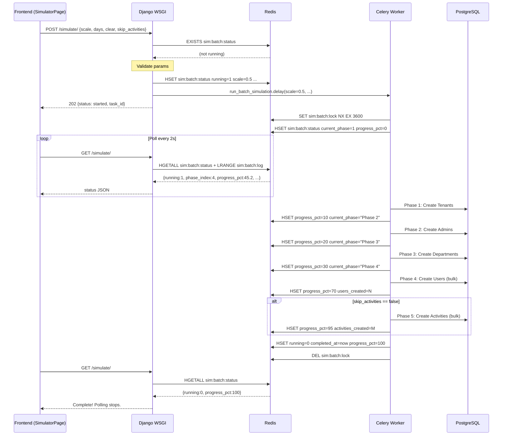
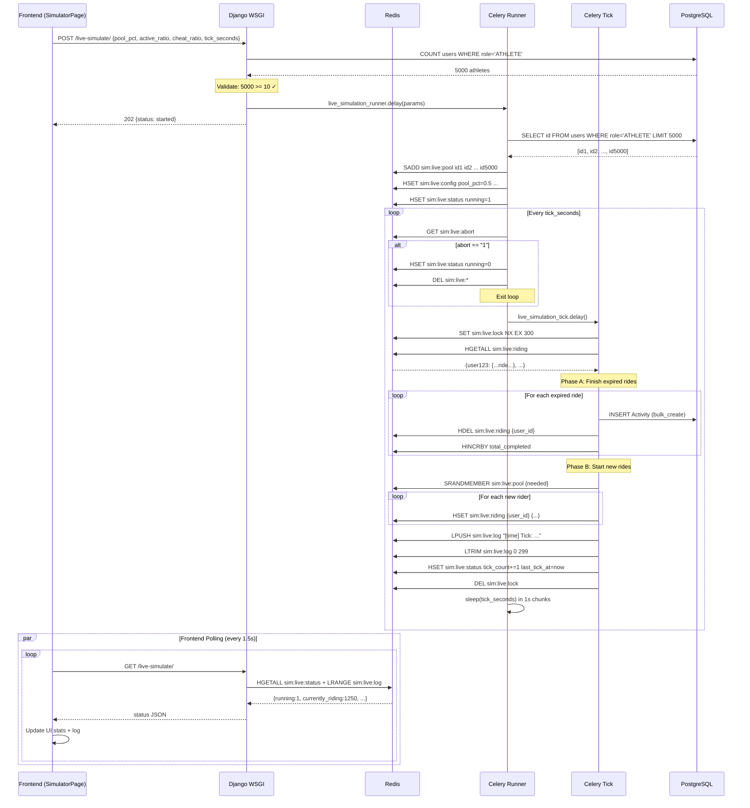
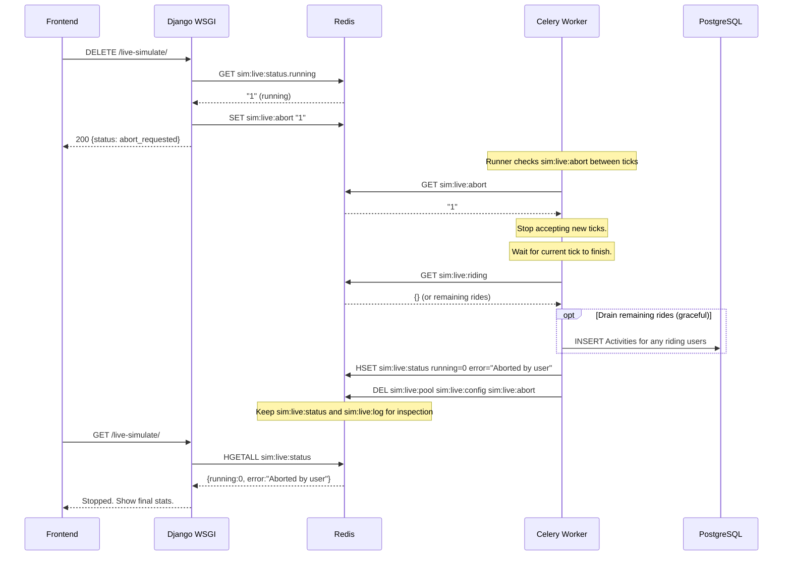
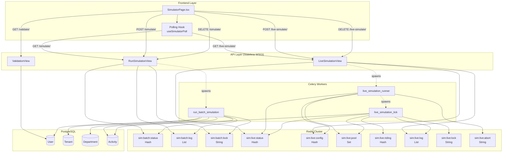

# Simulator Architecture — Redis + Celery Redesign

> **Status (2026-06-02):** **Zaimplementowane** — stan w Redis, taski Celery (`simulation`), frontend z pollingiem.  
> **Operacje na produkcji** (batch → live, env, BRouter, mapa): [operations/SIMULATOR.md](./operations/SIMULATOR.md).  
> Ten dokument pozostaje **specyfikacją** (API, klucze Redis, diagramy). Sekcja §1 opisuje **stary** model wątków — historycznie, jako uzasadnienie redesignu.

**Version:** 1.1 (ops cross-links)  
**Date:** 2026-05-17 (spec), ops update 2026-06-02  
**Replaces:** In-process threading in [`backend/activities/admin_views.py`](../backend/activities/admin_views.py)

---

## Table of Contents

1. [Current Architecture & Bug Analysis](#1-current-architecture--bug-analysis)
2. [Target Architecture Overview](#2-target-architecture-overview)
3. [Redis Key Schema](#3-redis-key-schema)
4. [Celery Task Definitions](#4-celery-task-definitions)
5. [API Endpoint Design](#5-api-endpoint-design)
6. [Data Flow Diagrams](#6-data-flow-diagrams)
7. [Concurrency & Locking Strategy](#7-concurrency--locking-strategy)
8. [Validation Strategy](#8-validation-strategy)
9. [Error Handling Strategy](#9-error-handling-strategy)
10. [Frontend Polling Fix](#10-frontend-polling-fix)
11. [Implementation Checklist](#11-implementation-checklist)

---

## 1. Current Architecture & Bug Analysis

### 1.1 Current State

The simulator currently uses **in-process threading** with two module-level dictionaries in [`backend/activities/admin_views.py`](../backend/activities/admin_views.py:344):

| State Dict | Lines | Purpose |
|---|---|---|
| `_simulation_state` | [344–356](../backend/activities/admin_views.py:344) | Batch generator state (running, log, abort_flag, etc.) |
| `_live_state` | [415–432](../backend/activities/admin_views.py:415) | Live ride simulator state (user_pool, active_rides, stats) |

Both use `threading.Lock()` ([357](../backend/activities/admin_views.py:357), [433](../backend/activities/admin_views.py:433)) for in-process mutual exclusion.

Background work is dispatched via `threading.Thread(daemon=True)`:
- Batch: [`_run_simulation_in_background`](../backend/activities/admin_views.py:369) spawned at [line 879](../backend/activities/admin_views.py:879)
- Live: [`_live_simulation_thread`](../backend/activities/admin_views.py:596) spawned at [line 744](../backend/activities/admin_views.py:744)

### 1.2 Root-Cause Bug Vectors

#### Bug 1: Multi-Worker State Invisibility
```
┌──────────┐   ┌──────────┐   ┌──────────┐
│ Worker 1 │   │ Worker 2 │   │ Worker 3 │
│ (port X) │   │ (port Y) │   │ (port Z) │
│          │   │          │   │          │
│ _live_   │   │ _live_   │   │ _live_   │
│  state   │   │  state   │   │  state   │
│  = {...} │   │  = {}    │   │  = {}    │
└────┬─────┘   └────┬─────┘   └────┬─────┘
     │              │              │
     ▼              ▼              ▼
  Thread A       GET /status     GET /status
  running here   → returns {}    → returns {}
```

Each Gunicorn worker has its own Python process with its own copy of `_live_state` and `_simulation_state`. The thread that started the simulation runs only in the worker that handled the `POST`. All other workers see empty state. The frontend polls `GET /live-simulate/` via a load balancer (or round-robin) and gets routed to a different worker — receiving `running: false` even though the simulation IS running.

#### Bug 2: No Validation for Empty Athlete Pools
In [`_live_simulation_thread`](../backend/activities/admin_views.py:596), line [615–617](../backend/activities/admin_views.py:615):
```python
user_ids = list(User.objects.filter(role='ATHLETE').values_list('id', flat=True)[:total_users])
if len(user_ids) < total_users:
    _live_log(f"WARNING: Only {len(user_ids)} athlete users available...")
```
This only logs a warning but proceeds. The tick loop at line [624](../backend/activities/admin_views.py:624) calls `_live_tick()` which at line [551](../backend/activities/admin_views.py:551) does `random.sample(pool, ...)` — if `pool` is empty, this raises `ValueError: Sample larger than population or is negative`. The error is caught at line [632](../backend/activities/admin_views.py:632), but the simulation silently dies with a log entry.

#### Bug 3: Frontend Polling Never Restarts on Tab Revisit
In [`SimulatorPage.tsx`](../admin/src/modules/analytics/SimulatorPage.tsx:44):
```tsx
useEffect(() => {
    fetchLiveStatus();
    return () => { if (pollRef.current) clearInterval(pollRef.current); };
}, [fetchLiveStatus]);
```
This effect runs once on mount. The cleanup function clears the interval. When a user switches tabs in the browser, React doesn't unmount/remount — BUT if the browser suspends the tab and later restores it, the interval may have been cleared. More critically, the `fetchLiveStatus` callback at line [41](../admin/src/modules/analytics/SimulatorPage.tsx:41) stops polling when `!data.running`:
```tsx
const fetchLiveStatus = useCallback(async () => {
    try {
        const { data } = await apiClient.get('/activities/admin/live-simulate/');
        setLiveStatus(data);
        if (!data.running && pollRef.current) {
            clearInterval(pollRef.current);
            pollRef.current = null;
        }
    } catch { }
}, []);
```
When a user revisits a tab after the simulation has ended, `data.running` is `false`, so polling stops immediately — but if the status was stale (from a different worker returning `running: false`), the user sees the wrong state with no path to recovery.

#### Bug 4: Batch Generator Hardcodes `skip_activities: true`
In [`SimulatorPage.tsx`](../admin/src/modules/analytics/SimulatorPage.tsx:67):
```tsx
await apiClient.post('/activities/admin/simulate/', {
    total_users: userCount, days, clear: true, skip_activities: true
});
```
The `skip_activities` parameter is hardcoded to `true`. This means the batch generator only creates users and departments but never generates activities with GPS tracks. There is no UI control to toggle activity generation.

---

## 2. Target Architecture Overview

### 2.1 Design Principles

1. **Redis as the source of truth** — All simulation state lives in Redis. Any WSGI worker can read/write it.
2. **Celery for async execution** — Replaces `threading.Thread` for both batch and live simulation. Celery workers are independent processes that write directly to Redis.
3. **Polling-based frontend (keep it simple)** — Fix the polling restart bug rather than introducing WebSocket complexity. The architecture supports future SSE/WebSocket upgrade.
4. **Validation before execution** — Pre-conditions checked BEFORE a Celery task is spawned, not inside it.
5. **Clean separation** — Batch generator (users + departments + activities) is one Celery task chain. Live ride simulator is a periodic Celery task.

### 2.2 High-Level Component Diagram

```
┌──────────────────────────────────────────────────────────────┐
│                     FRONTEND (React Admin)                     │
│  SimulatorPage.tsx  ◄── polling every 1.5s ──►  REST API     │
└──────────────────────────────────────┬───────────────────────┘
                                       │
┌──────────────────────────────────────▼───────────────────────┐
│                   DJANGO WSGI (Gunicorn)                      │
│  ┌───────────────────────────────────────────────────────┐   │
│  │  Simulator Views (stateless, read/write Redis only)   │   │
│  │  POST /simulate/    → spawns Celery task              │   │
│  │  GET  /simulate/    → reads Redis status              │   │
│  │  POST /live-simulate/ → spawns Celery beat or task    │   │
│  │  GET  /live-simulate/  → reads Redis status           │   │
│  └───────────────────────────────────────────────────────┘   │
└──────────────────────────────────────┬───────────────────────┘
                                       │
                    ┌──────────────────┼──────────────────┐
                    │                  │                  │
              ┌─────▼─────┐    ┌──────▼──────┐    ┌─────▼─────┐
              │  Redis     │    │   Celery    │    │PostgreSQL │
              │  (State)   │    │  (Workers)  │    │ (Models)  │
              │            │    │             │    │           │
              │ sim:batch  │◄──►│ batch_gen   │───►│ User      │
              │ sim:live   │    │ live_tick   │    │ Tenant    │
              │ sim:lock   │    │ live_runner │    │ Department│
              └────────────┘    └─────────────┘    │ Activity  │
                                                   └───────────┘
```

---

## 3. Redis Key Schema

### 3.1 Key Naming Convention

All simulator keys follow the pattern:
```
sim:{subsystem}:{entity}
```
Using the `{sim}` hash tag ensures all simulator keys hash to the same Redis Cluster slot, enabling atomic multi-key operations when needed.

### 3.2 Batch Simulation Keys

| Key | Type | TTL | Description |
|---|---|---|---|
| `sim:batch:status` | Hash | None | Batch simulator state |
| `sim:batch:log` | List | None | Ring-buffer log entries (max 200) |
| `sim:batch:lock` | String (lock) | 3600s | Distributed lock for batch execution |

**`sim:batch:status` Hash Fields:**

| Field | Type | Example | Description |
|---|---|---|---|
| `running` | bool | `"1"` | Whether batch simulation is active |
| `started_at` | float (epoch) | `"1715934400.123"` | When simulation started |
| `completed_at` | float (epoch) | `"1715934800.456"` | When simulation finished (if done) |
| `scale` | float | `"0.5"` | Scale factor used |
| `days` | int | `"30"` | Days of history |
| `total_users` | int | `"55000"` | Total users requested |
| `num_cities` | int | `"10"` | Number of cities |
| `clear` | bool | `"1"` | Whether data was cleared first |
| `skip_activities` | bool | `"0"` | Whether activity generation is skipped |
| `error` | string | `""` | Error message if failed |
| `current_phase` | string | `"Phase 4: Creating users"` | Human-readable phase description |
| `phase_index` | int | `"4"` | Current phase index (1-5) |
| `progress_pct` | float | `"45.2"` | Percentage complete (0-100) |
| `users_created` | int | `"25000"` | Users created so far |
| `activities_created` | int | `"0"` | Activities created so far |

**`sim:batch:log` List:**
- Left-pushed (LPUSH), trimmed to 200 entries (LTRIM)
- Each entry is a JSON string: `["HH:MM:SS", "message text"]`
- Example: `["14:32:15", "Phase 4: 15000/55000 users created"]`

### 3.3 Live Simulation Keys

| Key | Type | TTL | Description |
|---|---|---|---|
| `sim:live:status` | Hash | None | Live simulator state |
| `sim:live:config` | Hash | None | Immutable config for the current run |
| `sim:live:pool` | Set | None | User IDs in the athlete pool |
| `sim:live:riding` | Hash | None | Currently active rides: `{user_id} → JSON` |
| `sim:live:log` | List | None | Ring-buffer log entries (max 300) |
| `sim:live:lock` | String (lock) | 300s | Distributed lock for live tick execution |
| `sim:live:abort` | String | None | Abort flag; set to `"1"` to request stop |

**`sim:live:status` Hash Fields:**

| Field | Type | Example | Description |
|---|---|---|---|
| `running` | bool | `"1"` | Whether live simulation is active |
| `started_at` | float (epoch) | `"1715934400.123"` | When simulation started |
| `error` | string | `""` | Error message if crashed |
| `total_users` | int | `"5000"` | Total users in the pool |
| `currently_riding` | int | `"1250"` | Users currently mid-ride |
| `total_completed` | int | `"38420"` | Total completed rides across all ticks |
| `cheaters_caught` | int | `"1921"` | Total cheater activities created |
| `tick_count` | int | `"42"` | Number of ticks executed |
| `last_tick_at` | float (epoch) | `"1715934820.0"` | When the last tick ran |

**`sim:live:config` Hash Fields:**

| Field | Type | Example | Description |
|---|---|---|---|
| `pool_pct` | float | `"0.5"` | Percentage of all athletes in the pool |
| `active_ratio` | float | `"0.25"` | Percentage of pool actively riding at any time |
| `cheat_ratio` | float | `"0.05"` | Percentage of rides that are cheaters |
| `tick_seconds` | int | `"10"` | Seconds between ticks |
| `duration_min` | int | `"300"` | Minimum ride duration in seconds |
| `duration_max` | int | `"3600"` | Maximum ride duration in seconds |

**`sim:live:riding` Hash Fields:**
- Key = `user_id` (string), Value = JSON object
```json
{
    "start_time": "2026-05-17T14:32:15Z",
    "end_time": "2026-05-17T14:47:15Z",
    "act_type": "BIKE",
    "distance_m": 12500.0,
    "lat": 52.2297,
    "lon": 21.0122,
    "is_cheater": false
}
```

### 3.4 TTL & Cleanup Strategy

- All keys persist until explicitly deleted by an abort or completion action.
- The `sim:batch:lock` key has a 3600s TTL to prevent deadlocks — the Celery task refreshes it periodically.
- The `sim:live:lock` key has a 300s TTL — the periodic task re-acquires it each tick.
- When a simulation completes or is aborted, the cleanup function deletes all keys under the `sim:batch:*` or `sim:live:*` namespace (except `sim:live:abort` which can be deleted too).
- A Lua script can atomically check and delete all related keys.

---

## 4. Celery Task Definitions

### 4.1 Task Inventory

All tasks are registered in [`backend/activities/tasks.py`](../backend/activities/tasks.py). New tasks added below the existing ones.

```python
# ---- Batch Simulation Tasks ----

@shared_task(
    bind=True,
    queue="simulation",           # dedicated queue to avoid starving critical tasks
    max_retries=0,                # no auto-retry; manual restart only
    name="activities.tasks.run_batch_simulation",
)
def run_batch_simulation(self, scale: float, days: int, clear: bool, 
                         skip_activities: bool, total_users: int = None,
                         num_cities: int = None) -> dict:
    ...


@shared_task(
    bind=True,
    queue="simulation",
    max_retries=0,
    name="activities.tasks.run_batch_phase",
)
def run_batch_phase(self, phase_index: int, config_json: str) -> dict:
    ...


# ---- Live Simulation Tasks ----

@shared_task(
    bind=True,
    queue="simulation",
    max_retries=3,
    default_retry_delay=5,
    name="activities.tasks.live_simulation_tick",
)
def live_simulation_tick(self) -> dict:
    ...


@shared_task(
    bind=True,
    queue="simulation",
    max_retries=0,
    name="activities.tasks.live_simulation_runner",
)
def live_simulation_runner(self) -> dict:
    ...
```

### 4.2 Task: `run_batch_simulation`

**Purpose:** Entry point for batch simulation. Validates pre-conditions, sets initial Redis state, then chains phase sub-tasks.

**Flow:**
1. Acquire distributed lock `sim:batch:lock` (NX, TTL=3600s).
2. Validate: no existing batch running (`sim:batch:status.running == "0"`).
3. Validate: if `clear=True`, confirm at least one tenant exists to clear.
4. Write initial `sim:batch:status` hash.
5. Execute simulation phases sequentially (can NOT use Celery chain for live progress — see design note below).
6. On completion, set `running=0`, `completed_at`, `progress_pct=100`.
7. Release lock.

**Design Note — Why NOT a Celery Chain:**
Celery chains pass results between tasks. For the batch simulator, each phase needs to update Redis with progress for the frontend to poll. A chain would require serializing/deserializing the simulation state. Instead, the task runs all phases inline but reads/writes progress to Redis after each phase, enabling live progress monitoring. This is acceptable because batch simulation is a single long-running task, not a fan-out pattern.

### 4.3 Task: `live_simulation_tick`

**Purpose:** One tick of the live ride simulator — finishes expired rides and starts new ones. This is the core work unit.

**Pre-conditions (checked every tick):**
1. `sim:live:abort` is NOT set to `"1"`.
2. `sim:live:status.running` is `"1"`.
3. `sim:live:pool` is non-empty (SCARD > 0).

**Flow:**
1. Acquire lock `sim:live:lock` (NX, TTL=300s).
2. Read `sim:live:config` hash for params.
3. Read `sim:live:riding` hash — all active rides.
4. Read `sim:live:pool` set — athlete pool.
5. **Phase A — Finish Expired Rides:**
   - Iterate `sim:live:riding`. For each ride where `end_time <= now`:
     - Create `Activity` record (normal or cheater track).
     - HDEL from `sim:live:riding`.
     - Increment `total_completed` and `cheaters_caught` in `sim:live:status`.
6. **Phase B — Start New Rides:**
   - Calculate `target_riding = total_users * active_ratio`.
   - Calculate `needed = target_riding - current_riding_count`.
   - SRANDMEMBER from `sim:live:pool` to pick `needed` random users.
   - For each selected user, generate ride params and HSET into `sim:live:riding`.
7. Append log entry to `sim:live:log`.
8. Update `last_tick_at` and `tick_count` in `sim:live:status`.
9. Release lock.

**Performance Target:** Each tick should complete in under 2 seconds for pools up to 10,000 users with 2,500 riding concurrently.

### 4.4 Task: `live_simulation_runner`

**Purpose:** Orchestrates the live simulation loop. Runs as a long-lived task that spawns `live_simulation_tick` on a schedule.

**Flow:**
1. Validate pre-conditions (athlete count, no existing live sim).
2. Build `sim:live:pool` by querying `User.objects.filter(role='ATHLETE')` limited by `pool_pct`.
3. **VALIDATE:** If `len(pool) < 10`, abort with error `"Not enough athlete users (minimum 10 required)"`.
4. Write `sim:live:config` and `sim:live:status`.
5. Loop:
   - Check `sim:live:abort`. If set, break.
   - Call `live_simulation_tick.delay()` (async — does NOT wait).
   - Sleep for `tick_seconds` (split into 1s chunks for abort responsiveness).
6. Cleanup: delete all `sim:live:*` keys.

**Why the runner spawns ticks as separate tasks:**
This avoids a single Celery task holding a worker indefinitely. Each tick is a short-lived task. If a tick fails, the runner can detect it (via result backend or Redis status) and retry or abort gracefully.

---

## 5. API Endpoint Design

### 5.1 Endpoint Matrix

| Method | Path | Auth | Description |
|---|---|---|---|
| `GET` | `/api/activities/admin/simulate/` | IsAdminRole | Get batch simulation status |
| `POST` | `/api/activities/admin/simulate/` | IsAdminRole | Start batch simulation |
| `DELETE` | `/api/activities/admin/simulate/` | IsAdminRole | Abort batch simulation |
| `GET` | `/api/activities/admin/live-simulate/` | IsAdminRole | Get live simulation status |
| `POST` | `/api/activities/admin/live-simulate/` | IsAdminRole | Start live simulation |
| `DELETE` | `/api/activities/admin/live-simulate/` | IsAdminRole | Abort live simulation |
| `GET` | `/api/activities/admin/simulate/validate/` | IsAdminRole | Pre-flight validation checks |

### 5.2 Endpoint Specifications

#### `GET /api/activities/admin/simulate/`
Reads all fields from `sim:batch:status` hash and returns them as JSON. Always succeeds — if no simulation has ever run, returns `running: false` with all counters at zero.

**Response (running):**
```json
{
    "running": true,
    "elapsed_seconds": 124.5,
    "scale": 0.5,
    "days": 30,
    "total_users": 55000,
    "num_cities": 10,
    "clear": true,
    "skip_activities": false,
    "current_phase": "Phase 4: Creating users",
    "phase_index": 4,
    "progress_pct": 45.2,
    "users_created": 25000,
    "activities_created": 0,
    "error": null,
    "log": [["14:30:00", "Simulation starting..."], ...]
}
```

#### `POST /api/activities/admin/simulate/`
Validates input, checks for existing simulation, then spawns `run_batch_simulation.delay(...)`.

**Request Body:**
```json
{
    "scale": 0.5,
    "days": 30,
    "clear": true,
    "skip_activities": false,
    "total_users": null,
    "num_cities": null
}
```

**Validation Rules:**
- `scale` must be 0.001–1.0 (unless `total_users` is provided)
- `days` must be 1–365
- `total_users` (optional): 10–1,000,000
- `num_cities` (optional): 1–100
- Cannot start if `sim:batch:status.running == "1"`
- If `clear=true`, must confirm (the endpoint checks the flag)

**Response (202 Accepted):**
```json
{
    "status": "started",
    "task_id": "abc123-def456",
    "running": true,
    "scale": 0.5,
    "days": 30,
    "clear": true,
    "message": "Batch simulation started. Monitor via GET /simulate/"
}
```

**Response (409 Conflict):**
```json
{
    "error": "Batch simulation already running (124s elapsed)",
    "running": true,
    "elapsed_seconds": 124.5
}
```

#### `DELETE /api/activities/admin/simulate/`
Sets abort flag. The running Celery task checks this flag between phases.

**Response:**
```json
{
    "status": "abort_requested",
    "message": "Simulation will stop at the next checkpoint."
}
```

#### `GET /api/activities/admin/live-simulate/`
Reads all fields from `sim:live:status`, `sim:live:config`, and returns log snapshot.

**Response:**
```json
{
    "running": true,
    "elapsed_seconds": 420.0,
    "error": null,
    "total_users": 5000,
    "active_ratio": 0.25,
    "cheat_ratio": 0.05,
    "tick_seconds": 10,
    "currently_riding": 1250,
    "total_completed": 38420,
    "cheaters_caught": 1921,
    "tick_count": 42,
    "log": [["14:30:00", "LIVE SIMULATION: 5000 users..."], ...]
}
```

#### `POST /api/activities/admin/live-simulate/`
Validates input, performs pre-flight checks, then spawns `live_simulation_runner.delay(...)`.

**Request Body:**
```json
{
    "pool_pct": 0.5,
    "active_ratio": 0.25,
    "cheat_ratio": 0.05,
    "tick_seconds": 10
}
```

**Pre-flight Validation (executed synchronously before spawning Celery):**
1. `pool_pct` must be 0.01–1.0
2. `active_ratio` must be 0.01–1.0
3. `cheat_ratio` must be 0.0–1.0
4. `tick_seconds` must be 2–300
5. `User.objects.filter(role='ATHLETE').count()` must return >= 10
6. `sim:live:status.running` must NOT be `"1"`

**Response (202 Accepted):**
```json
{
    "status": "started",
    "task_id": "def789-ghi012",
    "running": true,
    "total_users": 5000,
    "pool_pct": 0.5,
    "active_ratio": 0.25,
    "cheat_ratio": 0.05,
    "tick_seconds": 10,
    "message": "Live simulation: 5000 users, 25% active, 5% cheaters"
}
```

#### `DELETE /api/activities/admin/live-simulate/`
Sets `sim:live:abort = "1"`. The runner loop checks this flag.

#### `GET /api/activities/admin/simulate/validate/`
Returns pre-flight validation results without starting anything.

**Response:**
```json
{
    "total_athletes": 110000,
    "total_tenants": 10,
    "total_departments": 1870,
    "can_run_batch": true,
    "can_run_live": true,
    "warnings": [],
    "recommendations": {
        "max_users_for_live": 110000,
        "suggested_pool_pct": 0.5,
        "estimated_ticks_per_minute": 6
    }
}
```

---

## 6. Data Flow Diagrams

### 6.1 Batch Simulation Flow



### 6.2 Live Simulation Flow



### 6.3 Abort Flow (Batch & Live)



### 6.4 Full System Architecture



---

## 7. Concurrency & Locking Strategy

### 7.1 Lock Types

| Lock Key | Type | Holder | TTL | Purpose |
|---|---|---|---|---|
| `sim:batch:lock` | Redis String (NX) | `run_batch_simulation` task | 3600s | Prevent concurrent batch simulations |
| `sim:live:lock` | Redis String (NX) | `live_simulation_tick` task | 300s | Prevent concurrent tick execution |

### 7.2 Lock Implementation

Using Redis `SET key value NX EX ttl` (atomic acquire):

```python
def acquire_lock(redis_client, lock_key: str, ttl: int) -> bool:
    """Returns True if lock was acquired."""
    return bool(redis_client.set(lock_key, "1", nx=True, ex=ttl))

def release_lock(redis_client, lock_key: str):
    """Release the lock. Safe to call even if not held."""
    redis_client.delete(lock_key)
```

### 7.3 Batch Simulation Concurrency

- **Only one batch simulation can run at a time.** The `POST /simulate/` endpoint checks `sim:batch:status.running` before spawning a task. The task also acquires `sim:batch:lock` as a safety net.
- **Lock refresh:** The batch task should `EXPIRE sim:batch:lock 3600` after each phase to prevent the lock from expiring during long-running phases.
- **Orphaned locks:** The 3600s TTL ensures a crashed Celery worker doesn't permanently block future simulations.

### 7.4 Live Simulation Concurrency

- **Only one live simulation can run at a time.** The `POST /live-simulate/` endpoint checks `sim:live:status.running`.
- **Only one tick executes at a time.** `live_simulation_tick` acquires `sim:live:lock` before reading/writing `sim:live:riding`.
- **The runner does NOT hold the tick lock.** The runner simply spawns tick tasks and sleeps. This avoids a long-held lock.
- **Tick timeout:** If a tick takes longer than 300s, the lock expires and the next tick can proceed. The stalled tick will fail on its own (its lock acquisition will have expired) and can be detected via monitoring.

### 7.5 Why NOT Redlock

For this use case, a single Redis instance lock (SET NX) is sufficient:
- We are not coordinating across independent Redis clusters.
- The consequence of a split-brain (two ticks running simultaneously) is duplicate activities, not data corruption. PostgreSQL uniqueness constraints prevent total chaos.
- Redlock (multi-node quorum) adds latency for marginal safety gain here.

### 7.6 Atomicity Guarantees

**Critical: Wipe + Restart scenario.** When a user clicks "Wipe All Data" and then starts a simulation, we must ensure the wipe completes before the simulation queries for users. This is enforced by:

1. `WipeDataView` at [`/api/activities/admin/wipe-data/`](../backend/activities/admin_views.py:762) executes synchronously (waits for DB deletes).
2. The `POST /simulate/` endpoint is called AFTER the wipe response returns.
3. The Celery task re-queries the DB, which will be empty at that point.

No Redis coordination is needed for this; the HTTP request/response cycle provides the ordering guarantee.

---

## 8. Validation Strategy

### 8.1 Pre-Flight Validation (Synchronous, Before Celery Spawn)

These checks happen in the Django view BEFORE calling `.delay()`:

| Check | Endpoint | Error Response |
|---|---|---|
| `pool_pct` in range 0.01–1.0 | POST /live-simulate/ | 400: "pool_pct must be 0.01–1.0" |
| `active_ratio` in range 0.01–1.0 | POST /live-simulate/ | 400: "active_ratio must be 0.01–1.0" |
| `cheat_ratio` in range 0.0–1.0 | POST /live-simulate/ | 400: "cheat_ratio must be 0.0–1.0" |
| `tick_seconds` in range 2–300 | POST /live-simulate/ | 400: "tick_seconds must be 2–300" |
| `scale` in range 0.001–1.0 | POST /simulate/ | 400: "scale must be 0.001–1.0" |
| `days` in range 1–365 | POST /simulate/ | 400: "days must be 1–365" |
| No existing batch running | POST /simulate/ | 409: "Batch simulation already running" |
| No existing live running | POST /live-simulate/ | 409: "Live simulation already running" |
| Athlete count >= 10 | POST /live-simulate/ | 400: "Need at least 10 athlete users. Run batch generator first." |
| Athlete count > 0 | POST /simulate/ (if skip_activities=false) | 400: "No athletes exist. Run with skip_activities=true first." |

### 8.2 Runtime Validation (Inside Celery Task)

These checks happen inside the task after it starts:

| Check | Location | Behavior |
|---|---|---|
| Lock acquisition failed | `run_batch_simulation` | Return error, do not execute |
| Lock acquisition failed | `live_simulation_tick` | Skip tick (another tick is running), return `{"skipped": true}` |
| Pool set empty (SCARD=0) | `live_simulation_tick` | Log warning, skip Phase B (no new rides), continue finishing existing rides |
| All rides finished and pool empty | `live_simulation_tick` | Set `running=0`, log "No riders left — simulation complete" |
| Abort flag detected | `live_simulation_runner` | Break loop, drain remaining rides, cleanup |

### 8.3 User-Facing Validation Endpoint

`GET /api/activities/admin/simulate/validate/` provides a health check before the user commits to a simulation. This is called by the frontend on page load to show available resources.

---

## 9. Error Handling Strategy

### 9.1 Error Categories

| Category | Example | Strategy |
|---|---|---|
| **Input validation** | `scale=5.0` | 400 response from view, never reaches Celery |
| **Resource unavailable** | Redis connection refused | 503 response from view, health check alert |
| **Pre-condition failed** | No athletes exist | 400 response from view, with actionable message |
| **Task startup failure** | Celery broker unreachable | 500 from view, admin sees error notification |
| **Mid-task DB error** | PostgreSQL deadlock | Catch in task, log error, set `error` field in Redis, set `running=0` |
| **Mid-task Redis error** | Redis OOM | Catch in task, set `error`, try to gracefully stop |
| **Orphaned lock** | Celery worker killed | TTL auto-expires, no manual intervention needed |
| **Tick timeout** | Tick takes > 300s | Lock expires, next tick runs independently, stalled tick's work may be duplicated |

### 9.2 Error Propagation Flow

```
Celery Task Error
    │
    ├──→ Redis: HSET sim:batch:status error="message" running=0
    │
    ├──→ Redis: LPUSH sim:batch:log ["HH:MM:SS", "ERROR: message"]
    │
    ├──→ Sentry: capture_exception() (via existing sentry integration)
    │
    └──→ Frontend: next poll picks up error field, shows red Alert
```

### 9.3 Graceful Degradation

- **If Redis is down:** The API views return 503 with `{"error": "Redis unavailable", "retry_after": 5}`. The frontend shows an error banner and retries after 5 seconds.
- **If Celery is down:** The POST endpoint attempts `.delay()`, catches the broker connection error, and returns 500 with `{"error": "Task queue unavailable. Try again in a moment."}`.
- **If PostgreSQL is down:** The Celery task catches `OperationalError`, sets error in Redis, and exits. The running simulation is effectively paused until DB recovers — rides in `sim:live:riding` will be finished in the next successful tick.

### 9.4 Monitoring Hooks

The existing `activities.tasks` infrastructure includes Sentry error capture. We extend this with:

```python
# In each simulator Celery task
from core.sentry import capture_exception

try:
    # ... simulation logic
except Exception as e:
    capture_exception(e)
    update_redis_error(str(e))
    raise  # Celery will mark task as failed
```

---

## 10. Frontend Polling Fix

### 10.1 The Bug

In [`SimulatorPage.tsx`](../admin/src/modules/analytics/SimulatorPage.tsx:44), the `useEffect` that manages polling runs once on mount. When a user switches browser tabs and returns, or when the API returns `running: false` (due to a stale worker), polling stops and never restarts.

### 10.2 Fix: Robust Polling Hook

Replace the current polling logic with a visibility-aware hook:

```tsx
// New hook: useSimulatorPoll
function useSimulatorPoll(endpoint: string, intervalMs: number) {
    const [status, setStatus] = useState<LiveStatus | null>(null);
    const [lastFetch, setLastFetch] = useState<number>(0);
    const timerRef = useRef<ReturnType<typeof setInterval> | null>(null);

    const fetchStatus = useCallback(async () => {
        try {
            const { data } = await apiClient.get(endpoint);
            setStatus(data);
            setLastFetch(Date.now());
        } catch {
            // Silently retry on next interval
        }
    }, [endpoint]);

    // Start/restart polling
    const startPolling = useCallback(() => {
        if (timerRef.current) clearInterval(timerRef.current);
        fetchStatus(); // immediate fetch
        timerRef.current = setInterval(fetchStatus, intervalMs);
    }, [fetchStatus, intervalMs]);

    // Stop polling
    const stopPolling = useCallback(() => {
        if (timerRef.current) {
            clearInterval(timerRef.current);
            timerRef.current = null;
        }
    }, []);

    // Page Visibility API — restart polling on tab revisit
    useEffect(() => {
        const handleVisibility = () => {
            if (document.visibilityState === 'visible') {
                // Re-fetch immediately and resume polling
                fetchStatus();
                if (!timerRef.current) {
                    timerRef.current = setInterval(fetchStatus, intervalMs);
                }
            }
        };
        document.addEventListener('visibilitychange', handleVisibility);
        return () => {
            document.removeEventListener('visibilitychange', handleVisibility);
            stopPolling();
        };
    }, [fetchStatus, intervalMs, stopPolling]);

    return { status, startPolling, stopPolling, lastFetch };
}
```

**Key improvements:**
1. **Visibility API listener** (`document.visibilitychange`) — restarts polling when the user returns to the tab.
2. **Polling never auto-stops** based on `running` status. The interval continues until the user navigates away or explicitly stops it. The UI shows "Complete" when `running: false` but polling continues so it picks up if a new simulation starts.
3. **Manual start/stop** functions expose control to the component.
4. **Immediate re-fetch** on visibility restore, before the interval fires.

### 10.3 Updated SimulatorPage Integration

```tsx
export const SimulatorPage: React.FC = () => {
    const { status: liveStatus, startPolling, stopPolling } = useSimulatorPoll(
        '/activities/admin/live-simulate/', 1500
    );

    const handleLiveStart = async () => {
        // ... POST to start simulation ...
        startPolling(); // Start polling after successful POST
    };

    const handleLiveAbort = async () => {
        // ... DELETE to abort ...
        // Polling continues — it will pick up running=false
    };

    // Polling continues even when simulation ends.
    // The UI shows "Complete" state when !running && elapsed > 0.
};
```

---

## 11. Implementation Checklist

> **Status 2026-06-02:** Fazy 1–4 **zrobione** w `backend/activities/simulator_state.py`, `simulator_tasks.py`, `admin_views.py`, `SimulatorPage.tsx`, `LiveMap.tsx`. Operacje: [operations/SIMULATOR.md](./operations/SIMULATOR.md). ADR: [010](./adr/010-simulator-redis-celery.md).  
> Poniższa lista jest **historycznym planem** z czasu specyfikacji.

### Phase 1: Redis State Layer
- [x] `backend/activities/simulator_state.py` — batch/live state, locks, pools
- [ ] Create `backend/core/simulator_state.py` module with:
  - `BatchSimState` class (reads/writes `sim:batch:*` keys)
  - `LiveSimState` class (reads/writes `sim:live:*` keys)
  - `SimulatorLock` context manager for distributed locking
  - `format_log_entry(ts, msg)` helper
- [ ] Write unit tests for all Redis state operations

### Phase 2: Celery Tasks
- [ ] Add `run_batch_simulation` task to [`backend/activities/tasks.py`](../backend/activities/tasks.py)
- [ ] Add `live_simulation_tick` task to [`backend/activities/tasks.py`](../backend/activities/tasks.py)
- [ ] Add `live_simulation_runner` task to [`backend/activities/tasks.py`](../backend/activities/tasks.py)
- [ ] Add `simulation` queue to Celery configuration
- [ ] Write integration tests for tasks with a real Redis instance

### Phase 3: API Endpoints
- [ ] Rewrite `RunSimulationView` in [`backend/activities/admin_views.py`](../backend/activities/admin_views.py:823) to use Redis + Celery
- [ ] Rewrite `LiveSimulationView` in [`backend/activities/admin_views.py`](../backend/activities/admin_views.py:686) to use Redis + Celery
- [ ] Add `SimulationValidateView` for pre-flight checks
- [ ] Remove `_simulation_state`, `_live_state`, `_sim_lock`, `_live_lock` globals
- [ ] Remove `_run_simulation_in_background`, `_live_tick`, `_live_simulation_thread`, `_generate_live_legacy_batch`
- [ ] Remove `import threading` (if no longer used elsewhere)

### Phase 4: Frontend Fixes
- [ ] Rewrite [`SimulatorPage.tsx`](../admin/src/modules/analytics/SimulatorPage.tsx) with `useSimulatorPoll` hook
- [ ] Add visibility-based polling restart
- [ ] Add `skip_activities` toggle in Batch Controls card
- [ ] Add pre-flight validation call on page mount (`GET /validate/`)
- [ ] Add error state handling for 503 (Redis down), 500 (Celery down)
- [ ] Disable "Start Live" button when athlete count < 10 (from validation endpoint)

### Phase 5: Documentation & Testing
- [ ] Update [`CHANGELOG.md`](../CHANGELOG.md) with architecture change
- [ ] Write manual test plan for simulator with multi-worker setup
- [ ] Verify Wipe + Simulate workflow end-to-end
- [ ] Verify abort behavior for both batch and live

---

## Appendix A: Redis Key Reference Card

```
# Batch Simulation
sim:batch:status    Hash    {running, started_at, completed_at, scale, days,
                             total_users, num_cities, clear, skip_activities,
                             error, current_phase, phase_index, progress_pct,
                             users_created, activities_created}
sim:batch:log       List    [json_array_of_timestamp_and_message]
sim:batch:lock      String  "1" (with TTL 3600)

# Live Simulation
sim:live:status     Hash    {running, started_at, error, total_users,
                             currently_riding, total_completed,
                             cheaters_caught, tick_count, last_tick_at}
sim:live:config     Hash    {pool_pct, active_ratio, cheat_ratio,
                             tick_seconds, duration_min, duration_max}
sim:live:pool       Set     {user_id_1, user_id_2, ...}
sim:live:riding     Hash    {user_id: json_ride_object}
sim:live:log        List    [json_array_of_timestamp_and_message]
sim:live:lock       String  "1" (with TTL 300)
sim:live:abort      String  "1" (set to request abort)
```

## Appendix B: Comparison — Before vs After

| Aspect | Before (Current) | After (This Design) |
|---|---|---|
| State storage | Python `dict` in WSGI worker memory | Redis hashes/sets/lists |
| Multi-worker safety | Broken (each worker has own state) | Guaranteed (Redis is shared) |
| Async execution | `threading.Thread(daemon=True)` | Celery tasks with dedicated queue |
| Locking | `threading.Lock()` (per-process) | Redis SET NX (cluster-wide) |
| Batch progress | No progress tracking | `progress_pct`, `current_phase`, `users_created` fields |
| Athlete validation | Logs warning, proceeds anyway | Blocks start with 400 error |
| Frontend polling | Stops on `running=false`, never restarts | Visibility API restores polling |
| Activity generation | Hardcoded `skip_activities: true` | User-controlled toggle |
| Error visibility | Logged to console only | Redis `error` field, Sentry, frontend alert |
| Cleanup | Manual (orphaned state persists) | Automatic key deletion on completion/abort |
| Scalability | Tied to one WSGI worker | Independent Celery workers, any number of WSGI workers |
