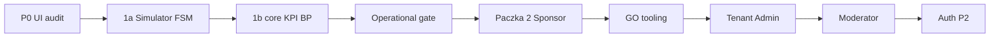

# Admin panel — unified roadmap (SSOT)

| | |
|--|--|
| **Status** | Active |
| **Owner role** | Admin / Frontend Lead |
| **Last reviewed** | 2026-06-07 |
| **Audience** | Admin developers, Release Manager, Platform Operator |
| **lang** | en |
| **translation** | [Polski](../pl/admin/ADMIN_ROADMAP.md) |
| **canonical_path** | docs/admin/ADMIN_ROADMAP.md |

---

Single timeline linking all admin planning docs. Detail lives in linked files — do not duplicate full specs here.

**Index:** [ADMIN_INDEX.md](./ADMIN_INDEX.md)

---

## Naming

| Term | Meaning |
|------|---------|
| **Paczka N** | P1 product sequence ([P1_ROADMAP.md](./P1_ROADMAP.md)) |
| **P2 roadmap** | Parallel track: GPX F1–F6 + Auth/MFA ([P2_ROADMAP.md](./P2_ROADMAP.md)) — **not** Paczka 2 Sponsor |
| **UI Audit P0–P3** | Snapshot priorities ([UI_AUDIT_2026-06-02.md](./UI_AUDIT_2026-06-02.md)) |
| **ROADMAP_V3** | Long-term architecture + premium phase 2 ([ROADMAP_V3.md](./ROADMAP_V3.md)) |

---

## Current position (2026-06-07)

| Milestone | Status |
|-----------|--------|
| P0 closure (code) | Done — verify prod via [P0_SMOKE_CHECKLIST.md](./P0_SMOKE_CHECKLIST.md) |
| Paczka 1a | Done |
| Paczka 1b core | Done |
| Operational gate | In progress — role smoke + routing queue stability |
| Paczka 2 Sponsor | Next product (after gate) |

---

## Execution sequence

### S0 — Operational gate (now)

| # | Criterion | Owner | Artifact |
|---|-----------|-------|----------|
| 1 | `simulator_light` pytest PASS | Dev | `python run_pytest.py … -m simulator_light` |
| 2 | `railway-verify-production.ps1` PASS | Platform Operator | 22/22 checks |
| 3 | P0 smoke all roles GO | QA | [P0_SMOKE_CHECKLIST.md](./P0_SMOKE_CHECKLIST.md) · `admin/scripts/p0-role-smoke.mjs` |
| 4 | `routing_queue_depth` stable below cap | Platform Operator | [SIMULATOR.md](../operations/SIMULATOR.md) |
| 5 | No backpressure log storm >15 min | Platform Operator | `sim.routing.backpressure` logs |

### S1 — Paczka 2 Sponsor

| Deliverable | Detail doc |
|-------------|------------|
| Nav: Dashboard, POI, Vouchers, Analytics | P1 §3 |
| Empty states + CTA | UI_AUDIT P3 |
| Sponsor-scoped pools API | `backend/rewards/views.py` |
| POI map editor UI | `admin/src/modules/sponsor/SponsorPOIMap.tsx` |

**Gate:** P0 smoke GO for SPONSOR section.

### S2 — Paczka 3 GO tooling

| Deliverable | Detail doc |
|-------------|------------|
| Control-plane health strip | UI_AUDIT §P1 Global Owner |
| Tenant row drill-down | P1 §4 Paczka 3 |
| Simulator excluded from prod KPI badge | UI_AUDIT P2 Simulator |

### S3 — Paczka 4 Tenant Admin

| Deliverable | Detail doc |
|-------------|------------|
| Scoped dashboard (`tenant_id`) | UI_AUDIT §P1 Tenant Admin |
| Departments moderator assign | UI_AUDIT P2 Departments |

### S4 — Paczka 5 Moderator

| Deliverable | Detail doc |
|-------------|------------|
| Unified inbox route | P1 §4 Paczka 5 |
| Anti-Cheat depth | ROADMAP_V3 §6 |
| GPX attachment in cases | P2 §2 overlap F1 |

### S5 — P2 Auth + GPX F2–F5

| Track | Detail doc |
|-------|------------|
| MFA / 2FA for GLOBAL_OWNER | [P2_ROADMAP.md](./P2_ROADMAP.md) §4 |
| GPX archive, anti-cheat, RODO ZIP | [P2_ROADMAP.md](./P2_ROADMAP.md) §2 (F1 done) |

### Later — ROADMAP_V3 premium §7

AI Coach studio · Voucher 3D customizer · ESG portal — [ROADMAP_V3.md](./ROADMAP_V3.md) §7.

---

## UI audit → paczka map

| UI Audit | Maps to |
|----------|---------|
| P0 KPI, Wipe, RBAC, Users, Impersonation, Sponsor nav | Done (code) |
| P1 Role IA, Sponsor portal, Moderator, tenant scope | Paczki 2–5 |
| P2 Feature Flags, Export, Settings, Anti-Cheat depth | After Paczka 3–4 |
| P3 Mobile nav, i18n, empty states, breadcrumbs | Continuous |

---

## Release path

1. [PRE_RELEASE_VERIFICATION.md](../operations/PRE_RELEASE_VERIFICATION.md)
2. [P0_SMOKE_CHECKLIST.md](./P0_SMOKE_CHECKLIST.md) → **GO**
3. [RAILWAY_PRODUCTION_CHECKLIST.md](../operations/RAILWAY_PRODUCTION_CHECKLIST.md) (if sim on prod)
4. Next paczka per table above
5. [RELEASE_LEGAL_COMPLIANCE_PACKAGE.md](../compliance/RELEASE_LEGAL_COMPLIANCE_PACKAGE.md) (public release)

---

## Related SSOT (outside admin/)

| Topic | Document |
|-------|----------|
| RBAC | [RBAC.md](../RBAC.md) |
| Simulator ops | [operations/SIMULATOR.md](../operations/SIMULATOR.md) |
| Live Map | [operations/LIVE_MAP.md](../operations/LIVE_MAP.md) |
| Reliability | [reports/RELIABILITY_AUDIT_PLAYBOOK.md](../reports/RELIABILITY_AUDIT_PLAYBOOK.md) |
| Department sponsors | [DEPARTMENT_ARCHITECTURE.md](../DEPARTMENT_ARCHITECTURE.md) |
