# 🗺️ 4VELO Admin Portal v3.0 Roadmap & Architectural Specification

This document specifies the architectural designs and technical layouts for the next-generation **4VELO Admin/Owner Portal (React 19 + Mantine v9)**. It outlines the immediate refactoring and provides detailed designs for the future premium modules, serving as the official reference for backend and frontend engineering.

---

## 🏛️ 1. Reorganized Navigational Architecture (6-Section Sidebar)

The sidebar navigation in `Layout.tsx` is restructured to eliminate redundant menu listings and group items logically by business domain.

```mermaid
graph TD
    A[Admin Portal Sidebar] --> B[1. Overview]
    A --> C[2. Management]
    A --> D[3. Operations]
    A --> E[4. Sponsorship & Rewards]
    A --> F[5. Analytics & Feedback]
    A --> G[6. System Settings]

    B --> B1[Dashboard]
    B --> B2[Smartphone Simulator]

    C --> C1[Tenants & Branding]
    C --> C2[Users Manager Drawer]
    C --> C3[Departments]

    D --> D1[Activities]
    D --> D2[Anti-Cheat SOC Console]
    D --> D3[Events Manager CRUD]

    E --> E1[Sponsor POI Dashboard]
    E --> E2[Sponsorship Analytics]
    E --> E3[Rewards & Vouchers]

    F --> F1[Department Performance]
    F --> F2[Global Heatmaps]
    F --> F3[Beta Feedback Logs]

    G --> G1[System Settings]
    G --> G2[RBAC Permissions]
    G --> G3[Feature Flags]
    G --> G4[Leaderboards]
    G --> G5[Export Center]
    G --> G6[API Playground]
```



### Business Domains:
1. **Overview**: Key visual summary views. Consolidates the **Global Dashboard** and the **Smartphone Simulator**.
2. **Management**: High-level system entities including **Tenants & Branding**, the new **Users Manager**, and **Departments**.
3. **Operations**: Core athletic day-to-day items: **Activities**, **Anti-Cheat SOC Console**, and the **Events Manager CRUD**.
4. **Sponsorship & Rewards**: Specialized portal for B2B sponsors, managing **Sponsor POIs (Map Editor)**, **Sponsorship Analytics**, and **Vouchers**.
5. **Analytics & Feedback**: Read-only business intelligence tools including **Department performance charts**, **Global Heatmaps**, and **Beta Feedback Logs**.
6. **System Settings**: Low-level administration: **System Settings**, **RBAC Manager**, **Feature Flags**, **Leaderboards**, **Export Center**, and the interactive **API Playground**.

---

## 👥 2. High-Performance Users Module & Drawer Profile Editor

### Client-Side Performance
To maintain 60fps responsiveness with **500+ users**, we implement **in-memory pagination** and rendering optimization using Mantine's high-performance `<Table>` and `<Pagination>`:
* **Initial Payload**: Fetch all users in a single optimized JSON request.
* **Client Filtering**: Perform search matching (username, email, role, tenant) and filtering purely in memory using standard array structures.
* **Pagination Window**: Render only 15–20 rows at a time in the DOM. This reduces rendering latency from $>1.5$s to $<50$ms.

### Drawer Profile Editor (GLOBAL_OWNER & TENANT_ADMIN)
When an administrator clicks a user row, an advanced sliding `<Drawer>` opens. It has two modes: read-only telemetry mode and edit mode.

#### Modifiable Fields:
* **Core Identity**: Username and Email.
* **Role assignment**: Dropdown (GLOBAL_OWNER, TENANT_ADMIN, TENANT_MODERATOR, SPONSOR, ATHLETE). *Role editing is restricted by RBAC rules (e.g., TENANT_ADMIN cannot create a GLOBAL_OWNER).*
* **Account Lock (`is_active`)**: A premium custom Toggle Switch. Toggling it calls the backend `/users/<pk>/update/` endpoint to instantly lock/unlock access.
* **Custom Profile Info**: Added support for editing custom **avatar images** (URL or file upload) and **biography description** text.
* **Reset Password Sub-panel**: Interactive password field with standard validation indicators, calling backend password reset functions.

---

## 🏆 3. Events CRUD Dashboard

Converting the read-only Events list into a full administration suite with backend multi-tenant Row-Level Security (RLS) protection.

### Component Design:
* **Vibrant Status Badges**:
  - `DRAFT`: Gray
  - `PUBLISHED`: Cyan
  - `ACTIVE`: Vibrant Green
  - `COMPLETED`: Indigo
  - `CANCELLED`: Red
* **Auto-Generating Slug field**:
  - Typing in the "Title" field automatically outputs an SEO-friendly slug (e.g., *"Tour de Warszawa"* $\rightarrow$ `"tour-de-warszawa"`).
* **Multi-Tenant Scoping**:
  - `GLOBAL_OWNER` can edit all events.
  - `TENANT_ADMIN` is restricted to events in their city/tenant.
  - On creation, the new event automatically inherits the tenant ID of the logged-in administrator.
* **Interactive Dynamic Pickers**:
  - **Opponent Tenant Dropdown**: For `INTER_TENANT` (City vs City) matches, the opponent tenant selector dynamically queries the `/users/tenants/` database list to populate active city choices, enabling easy matchup configurations.
  - **Dynamic Club Battles Selector**: Queries clubs in the tenant to populate club battle fields.
  - **Boundary GeoJSON Area Textarea**: Simple JSON box with built-in schema validation (validation checks for polygon geometry coords).

---

## 🏃 4. Activity GPS Route Inspector & Speed Telemetry

Replaces static, non-functional activity graphics with a fully interactive routing tool utilizing MapLibre GL.

### Architecture:
* **Vector Map Layer**: Embeds a MapLibre GL container loading the sleek `dark-matter` vector style.
* **Route Trajectory Overlay**:
  - Plots `route_coords` coordinates.
  - Color-codes the path vector based on verification status: verified activities are highlighted in a bright glowing neon cyan, while unverified or flagged activities are highlighted in a glowing hot orange/red to draw the attention of SOC operators.
* **Speed Profile / Elevation Telemetry**:
  - Employs a visual telemetry micro-chart displaying speed (km/h) and altitude (meters) across the distance of the run.
  - Hovering a crosshair over the speed chart dynamically shifts a glowing dot cursor along the MapLibre GPS path, showing the exact geographic location where speed spikes or elevation changes occurred.

---

## 🏢 5. White-Label Smartphone Live Simulator

A premium visual editor showing tenant brandings in real time.

```
┌─────────────────────────────────┐      ┌───────────────────────────┐
│  🎨 White-Label Config Panel    │      │   📱 Interactive Phone    │
│  ─────────────────────────────  │      │   ┌───────────────────┐   │
│  City Name: [ Warszawa        ] │      │   │ 🔋 12:00    📶 5G │   │
│                                 │      │   │ ───────────────── │   │
│  Primary Color:   [ #6366F1 ]   │ ───> │   │   Warszawa 4VELO  │   │
│  Secondary Color: [ #8B5CF6 ]   │      │   │   [ Start Ride ]  │   │
│                                 │      │   │   [ Leaders  ]    │   │
│  Logo Upload:     [ Choose  ]   │      │   │                       │   │
│  Splash Image:    [ Choose  ]   │      │   │   (Vibrant Theme)     │   │
└─────────────────────────────────┘      └───────────────────────────┘
```

### Technical Workflow:
1. When branding inputs are modified on the left, the values are updated in the React State.
2. The simulated Smartphone iframe/container on the right subscribes to the changes, dynamically updating CSS variables (`--primary-color`, `--secondary-color`) in real time.
3. The admin can toggle the simulator view between:
   - *Mobile Dashboard*: Previewing active routes, KPI cards, and custom city logos.
   - *Portal Navbar*: Previewing the tenant branding inside the desktop navigation headers.

---

## 🛡️ 6. Security Operations Center (SOC) Console

An upgraded Anti-Cheat moderation suite designed for high-throughput anomaly diagnostics.

### Features:
* **ML Diagnostics Timeline**: An interactive daily bar chart showing the frequency of anomalies caught by the ML engine.
* **SUSPECT GPS COMPARISON DRAW COMPONENT**:
  - Opens MapLibre GL.
  - Draws two overlapping polylines: the **raw uploaded coordinates** (in red) and the **snapped BRouter topological path** (in blue).
  - Highlights speed spikes, illegal elevation jumps, and geofence teleportations directly on the map.
* **Quick Moderation Panel**: Hotkeys or button triggers to immediately ban, approve, or warning-flag accounts.

---

## ⏳ 7. Future Premium Roadmap Extensions (Phase 2)

The following three modules are fully designed and prepared to be implemented in a subsequent Phase 2:

### 7.1 🤖 3D Avatar & AI Coach Customization Studio (ADR 007)
A specialized administrative interface to fine-tune the flagship **Intelligent Avatar Coach** described in `ADR 007`.

* **Model Settings**:
  - `ai_coach_personality`: ('ZEN', 'STRICT', 'FRIENDLY', 'CHAMPION')
  - `ai_coach_custom_prompt`: A custom system instruction limited strictly to **150 characters** (enforced via real-time frontend character counter) to maintain Text-to-Speech conciseness.
  - `ai_coach_hr_threshold`: Range slider for heart rate alert triggers.
  - `ai_coach_pace_drop_threshold`: Range slider for pace drops.
* **Voice waveform synthesizer**:
  - A text box where admins can type test prompts and press "Synthesize Voice". It simulates the generated output via a wave-animated canvas component.

### 7.2 🎫 B2B Sponsor Voucher Design Customizer & 3D Interactive Card Preview
A visual canvas editor for retail partners (Sponsors) to brand their reward vouchers.

* **Canvas Controls**: Background color selectors, typography picker, barcode template selection, and sponsor logo uploading.
* **3D Hover-Tilt Preview**:
  - The rendered preview card uses CSS 3D perspective transforms (`perspective(1000px) rotateX(...) rotateY(...)`) to tilt dynamically based on the cursor's coordinates.
  - An overlaid glossy gradient layer moves opposite to the tilt direction, creating a high-end holographic card gloss reflection.

### 7.3 🍃 Green City ESG Portal & Carbon-Offset Calculator
A dedicated sustainability dashboard showing ecological metrics to city representatives.

* **Infographics**:
  - **CO₂ Offset Calculator**: $Distance \times 0.21\text{ kg CO}_2\text{/km}$ avoided.
  - **Fuel Saved**: Equated to gas consumption ($distance \times 0.07$ liters/km).
  - **Active Health**: Calories burned community aggregator.
* **MapLibre Green Heatmap**:
  - A green-to-cyan density heatmap depicting commuter routing paths where carbon savings are most dense, allowing city planners to optimize bicycling infrastructures.
