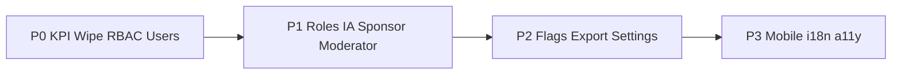

# Admin Panel — UI Audit & Market-Standard Roadmap

> **Date:** 2026-06-02  
> **Environment:** `admin-production-083b.up.railway.app`  
> **Role tested:** `GLOBAL_OWNER`  
> **Automation:** `admin/scripts/audit-admin-full.mjs`, `admin/scripts/explore-admin.mjs`  
> **Artifacts:** `admin/audit-screenshots/audit-report.json`, `admin/probe-screenshots/`

---

## 1. Executive summary

The admin panel is visually mature (Mantine v9, role-based nav, server-side user pagination at 10k+ scale, GPU Live Map LOD). Gaps versus enterprise admin consoles are mainly **actionability** (read-only RBAC, empty sponsor/flags modules), **role-scoped IA** (Sponsor sees one nav item; Moderator queue fragmented), and **production safety** (misleading KPI deltas, Wipe All Data exposure).

---

## 2. Audit methodology

| Step | Detail |
|------|--------|
| Login | Label-based selectors (`Username or Email`, `Enter your password`) |
| Route order | System first: RBAC → Feature Flags → Leaderboards → Export → API Playground → Settings → Dashboard → … → Users → Departments → … |
| Safe skips | Wipe All Data, Delete user confirm, Stop simulation, Launch N cyclists |
| Shell guard (v2) | Clicks limited to `AppShell-main`; skip Logout, theme toggle, sidebar collapse |
| Users deep-dive | Audit Log tab, Create User, Invite Staff, eye icon → edit drawer |

Re-run:

```bash
cd admin
npm install
# Playwright required: npm install -D playwright && npx playwright install chromium
ADMIN_URL=https://admin-production-083b.up.railway.app \
ADMIN_USER=global_owner \
ADMIN_PASS='***' \
node scripts/audit-admin-full.mjs
```

---

## 3. Routes exercised (2026-06-02)

| Route | Result | Notable interactions |
|-------|--------|----------------------|
| RBAC Manager | OK | 6 system roles + permissions-by-resource (read-only cards) |
| Feature Flags | Empty | “No feature flags configured” |
| Leaderboards | Empty | **Recalculate All** clicked |
| Export Center | OK | CSV / JSON / PDF export buttons |
| API Playground | OK | Link to Swagger (`/docs/`) |
| Settings | OK | Save Settings, Change Password; Wipe skipped |
| Dashboard | OK | KPIs, embedded Live Map zoom |
| White-Label | OK | Deploy Branding |
| Users | OK | 15 / 10 014 users; Audit Log (50); Create / Invite modals; edit drawer |
| Departments | Partial | List / Tree / New Department; script timeout on further buttons |

**Earlier probe** (`probe-screenshots/`): Activities (~2628), Anti-Cheat (~50), Live Map (~1.2s refresh @ z≈5.9), Simulator (error flag in UI), Sponsor (empty KPIs + placeholder).

**Known automation issues**

- First audit run logged out via shell **Logout** click — fixed in script.
- Second run stopped at Departments `TimeoutError` on button enumeration.
- KPI “+10 013 this week” vs total 10 014 athletes — misleading copy, not a pagination bug.

---

## 4. Findings by module

### 4.1 RBAC Manager

- **Current:** Visual catalog of roles and permission counts; no edit, no matrix, no change audit.
- **Risk:** Operators cannot answer “what can Moderator X do?” without API/docs.

### 4.2 Dashboard

- **Current:** Global owner sees full stats, tenant table, System Intelligence, embedded Live Map.
- **Issues:** Weekly trend can exceed plausible delta vs total; verification KPI links weakly to Anti-Cheat; simulator state mixed into prod metrics.

### 4.3 Users

- **Current:** Server pagination (15/page), debounced search, drawer edit, impersonation API exists in module.
- **Gaps:** No column sort, bulk actions, activity timeline in drawer, deep links to user id.

### 4.4 Sponsor

- **Current:** Four stat cards + “Recent Activity” placeholder; zeros in production probe.
- **Nav:** `SPONSOR` role only sees Sponsor Dashboard — not Vouchers / Analytics (see `Layout.tsx` roles).

### 4.5 Moderator

- **Current:** `ModeratorWorklist` on dashboard; Activities has bulk approve in code.
- **Gaps:** No unified queue; worklist uses `per_tenant[0]`; Anti-Cheat and Activities are separate journeys.

### 4.6 Tenant Admin

- **Gaps:** No enforced default tenant filter on lists; dashboard still framed as global overview for some widgets.

### 4.7 System / safety

- **Settings:** Local-only toggles for some prefs; **Wipe All Data** with typed confirm but no env guard / 2FA / separate role.
- **Feature Flags / Leaderboards:** Empty states without setup CTA.
- **Mobile nav:** Five items vs ~20 desktop routes — incomplete parity.

### 4.8 Live Map

- **Current:** LOD `detail=summary|standard|full`, GPU layers, zoom badge (see [README](./README.md) § Live Map).
- **Perf:** ~1.2s refresh at country zoom with ~4k active points in probe — tune caching/CDN.

---

## 5. Recommendations (market standards)

References: Auth0/Okta (RBAC), Stripe Dashboard (KPIs), GitHub (danger zone), LaunchDarkly (flags), Meta ModQueue (moderation), partner portals (Stripe Connect / voucher platforms).

### P0 — Trust, security, data correctness

| Item | Standard | Action |
|------|----------|--------|
| KPI trends | Separate total vs Δ7d vs % change | Fix `Dashboard` `StatCard` trend copy; badge when simulator data included |
| Wipe All Data | Typed confirm + role + environment | Restrict to `GLOBAL_OWNER`; require env name; audit log; consider 2FA |
| RBAC | Role × permission matrix + audit | Role click → drawer; later editable matrix with change log |
| Users 10k+ | Sort, filter export, drawer timeline | TanStack Table patterns; bulk lock/role |
| Impersonation | Banner + timeout + audit | Shopify-style support session UX |

### P1 — Role & information architecture

| Role | Standard | Action |
|------|----------|--------|
| Global Owner | Control plane health strip | API latency, mod queue depth, simulator ON/OFF |
| Global Owner | Tenant drill-down | Row click → filter Users / Activities / map bbox |
| Tenant Admin | Scoped dashboard | Default `tenant_id`; hide global 10k totals |
| Moderator | Unified inbox | Single queue: pending activities + anomalies + events |
| Moderator | Worklist bug | Use `user.tenantId`, not `per_tenant[0]` |
| Sponsor | Partner portal | Vouchers + analytics in nav for `SPONSOR`; empty states with CTA |

### P2 — Module depth

| Module | Action |
|--------|--------|
| Feature Flags | Env keys, % rollout, tenant overrides (LaunchDarkly-style) |
| Leaderboards | Period config, preview top N, dry-run recalc |
| Export | Async job + email link (GDPR-style) |
| API Playground | Embedded Swagger or saved requests with tenant header |
| Settings | Persist to API; wire dark mode to Mantine; MFA section |
| Departments | Assign moderator; tree DnD |
| Anti-Cheat | Severity, assignee, resolution, link to activity |
| Simulator | Clear RUNNING badge; exclude from prod KPIs on prod |

### P3 — UX / a11y / mobile

- Align `MobileNav` with RBAC-filtered desktop menu.
- i18n: single locale strategy (PL vs EN).
- Empty states: illustration + primary CTA, not “will appear here”.
- Breadcrumbs + hash deep links for user drawer.

---

## 6. Implementation roadmap



| Phase | Focus | Est. |
|-------|--------|------|
| Week 1 | KPI fix, Wipe hardening, RBAC drawer, Sponsor nav + empty states | P0 partial |
| Week 2 | Moderator queue, tenant scoping, bulk activities UI | P1 |
| Week 3 | Feature flags backend, async export, settings persistence | P2 |

Detailed product/tech spec: [ROADMAP_V3.md](./ROADMAP_V3.md). RBAC model: [../RBAC.md](../RBAC.md).

---

## 7. Related code & docs

| Area | Path |
|------|------|
| Nav / roles | `admin/src/core/Layout.tsx` |
| RBAC UI | `admin/src/modules/analytics/RbacManager.tsx` |
| Users | `admin/src/modules/users/Users.tsx` |
| Sponsor | `admin/src/modules/sponsor/SponsorDashboard.tsx` |
| Moderator worklist | `admin/src/modules/dashboard/ModeratorWorklist.tsx` |
| Settings / wipe | `admin/src/modules/settings/SettingsScreen.tsx` |
| Live Map | `admin/src/modules/analytics/LiveMap.tsx` |
| Simulator runbook | [../operations/SIMULATOR.md](../operations/SIMULATOR.md) |

---

## 8. P0 — DONE

| Field | Value |
|-------|--------|
| **Closure date** | 2026-06-02 |
| **Status** | Code merged to `main`; **production verification requires redeploy** of admin + API services, then [P0 smoke checklist](./P0_SMOKE_CHECKLIST.md). |
| **Do not start** | P1 items (CityAnalytics scoping, unified moderator queue, bulk on all list pages) until smoke sign-off is **GO**. |

### Areas closed (A–F)

| Area | Scope | Key commits / paths |
|------|--------|---------------------|
| **A — Dashboard KPI** | Trend copy separates total vs Δ7d; simulator-included badge on stats | `be6fdb06`, `6ec94c41` — `admin/src/modules/dashboard/Dashboard.tsx`, `backend/activities/admin_stats.py` |
| **B — Wipe safety** | `GLOBAL_OWNER` only; typed env phrase + MFA ack; progress polling; idempotent BE wipe | `be6fdb06`, `86be0484`, `72baa873` — `SettingsScreen.tsx`, `activities/admin_views.py` |
| **C — RBAC visibility** | Role click → permission drawer; read-only matrix; BE role/permission APIs | `be6fdb06`, `6ec94c41` — `RbacManager.tsx`, `users/rbac_views.py` |
| **D — Users at scale** | Cursor pagination, debounced search, drawer CRUD, tenant-scoped bulk jobs | `bee847e4`, `be6fdb06` — `Users.tsx`, `users/views.py`, `users/bulk_*` |
| **E — Impersonation** | `POST /users/impersonate/<id>/` → **403** for non–`GLOBAL_OWNER`; audit middleware; FE sandbox owner-only | `be6fdb06` — `ImpersonateUserView` + `test_impersonation_requires_global_owner` |
| **F — Role / nav gaps** | Sponsor vouchers + analytics in nav; moderator worklist tenant scoping; `PermissionGuard` alignment | `6ec94c41` — `Layout.tsx`, `ModeratorWorklist.tsx`, `PermissionGuard.tsx` |

### Post-deploy verification

1. Redeploy **admin** and **backend** (Railway or current prod target).
2. Run [P0_SMOKE_CHECKLIST.md](./P0_SMOKE_CHECKLIST.md) per role; record **GO/NO-GO**.
3. On **GO**, begin P1 from §5 (role IA, unified queue, tenant dashboard scoping).

---

## 9. Changelog

| Date | Change |
|------|--------|
| 2026-06-03 | §8 P0 formal closure; link to smoke checklist |
| 2026-06-02 | Initial audit doc from Playwright crawl + production probe |
