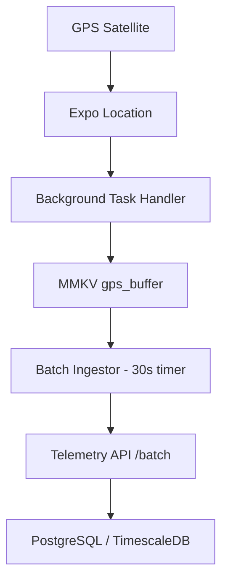

# ADR 005: Telemetry & Background Tracking

| | |
|--|--|
| **Status** | ✅ Active |
| **Owner role** | Documentation maintainer |
| **Last reviewed** | 2026-06-04 |
| **Audience** | See canonical document |
| **lang** | en |
| **translation** | [Polski](../pl/adr/005-telemetry-tracking.md) |
| **canonical_path** | docs/adr/005-telemetry-tracking.md |

---

| | |
|--|--|
| **Status** | Accepted |
| **Owner role** | Tech Lead |
| **Last reviewed** | 2026-06-03 |
| **Language** | English |
| **Index** | [docs/README.md](../README.md) |

## Status
Accepted (2026-05-13)

## Context
The core value of the SPORT app is accurate ride/run tracking. This data must be collected even when the screen is off or the app is in the background. We previously used `react-native-background-geolocation` (TransistorSoft) but found it too heavy for our custom telemetry needs.

## Decision
We migrated to **Expo Location + Expo Task Manager** for background tracking.

### Data Flow Architecture

### Key Mechanisms
1. **Background Task**: A named task (`BACKGROUND_LOCATION_TASK`) is registered via `TaskManager.defineTask`. It remains active even if the main UI thread is suspended.
2. **Buffering Strategy**: Coordinates are appended to a JSON array in MMKV. This avoids holding large objects in memory.
3. **Dynamic Resolution**: 
    - **HYPERSCALE**: 2m / 1s interval (Race mode).
    - **BALANCED**: 10m / 5s interval (Standard ride).
    - **POWER_SAVE**: 30m / 15s interval (Ultra-endurance).
4. **Foreground Service**: On Android, we maintain a persistent notification via `foregroundService` configuration to prevent the OS from killing the location task during long activities.

## Consequences
- **Positive**: Full control over the ingestion pipeline. We can tune precision vs battery consumption on-the-fly.
- **Positive**: Resilience. The batching logic handles intermittent 5G/LTE connectivity loss by persisting the buffer until a successful HTTP 201 is received.
- **Requirement**: Users must be educated on granting "Always Allow" location permissions, as "While Using App" will kill the session shortly after locking the screen.
