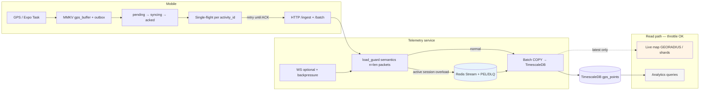

# ADR 011: Telemetry ingest durability under burst load

| | |
|--|--|
| **Status** | ✅ Active |
| **Owner role** | Documentation maintainer |
| **Last reviewed** | 2026-06-04 |
| **Audience** | See canonical document |
| **lang** | en |
| **translation** | [Polski](../pl/adr/011-telemetry-ingest-durability-under-load.md) |
| **canonical_path** | docs/adr/011-telemetry-ingest-durability-under-load.md |

---

| | |
|--|--|
| **Status** | Accepted |
| **Owner role** | Platform Operator / Tech Lead |
| **Last reviewed** | 2026-06-04 |
| **Language** | English |
| **Index** | [docs/README.md](../README.md) |

**Related:** [005-telemetry-tracking.md](./005-telemetry-tracking.md) · [004-persistent-storage-mmkv.md](./004-persistent-storage-mmkv.md) · [DATA_RESILIENCE.md](../DATA_RESILIENCE.md) · [EVENT_BURST_50K.md](../EVENT_BURST_50K.md) · [operations/TELEMETRY_SHARDING.md](../operations/TELEMETRY_SHARDING.md) · [operations/MOBILE.md](../operations/MOBILE.md) · [admin/P2_ROADMAP.md](../admin/P2_ROADMAP.md)

---

## Status

Accepted (2026-06-04)

## Context

SPORT’s core product promise is an **accurate, gap-free activity track** even on event day (~50k users). [ADR-005](./005-telemetry-tracking.md) established Expo Location → MMKV `gps_buffer` → 30s HTTP batch ingest → TimescaleDB. That design survives intermittent connectivity when the client can retry until HTTP **201/202**, but it does **not** guarantee durability when the **server rejects ingest** under platform overload.

Today, protection is layered (see [EVENT_BURST_50K.md](../EVENT_BURST_50K.md)):

1. **Global load guard** ([`backend/core/load_guard.py`](../../backend/core/load_guard.py)) — always-on sliding windows for join, session start, and telemetry ingest (`GLOBAL_MAX_INGEST_PER_SECOND`, default 20k/s). Fail-open on Redis errors.
2. **Event burst** — event-scoped join/session limits and concurrent live-map ceiling (~10k riders).

The FastAPI telemetry service ([`telemetry/main.py`](../../telemetry/main.py)) mirrors ingest limits via `_ingest_allowed()` and returns **`429 + Retry-After`** on `/api/telemetry/ingest` and `/ingest/batch` when the per-second cap is exceeded. Under a true burst, **excess packets are dropped at the edge** unless the mobile client keeps them in local storage and retries — which is only partially implemented today.

### Event-day geospatial hotspots

Mass events are not only a **global QPS** problem: riders cluster in the same **region and time window** (“every day is Ride London” for virtual/physical events). That concentrates:

- **Write hotspots** — dense `GEORADIUS` / shard keys and ingest queue shards for one bbox.
- **Read hotspots** — live map and spectator tiles hammer the same shard pair.

[TELEMETRY_SHARDING](../operations/TELEMETRY_SHARDING.md) scales **read/index** horizontally; this ADR adds **write absorption** (queue + drain) so local spikes do not correlate with straight-line gaps on finished activities. See [Strava Engineering – Activity Grouping](https://medium.com/strava-engineering/activity-grouping-the-heart-of-a-social-network-for-athletes-865751f7dca).

### Observed failure modes

| Symptom | Cause | Impact |
|---------|--------|--------|
| Straight-line gaps on finished ride | 429 on batch; buffer cleared or point not re-queued after “accepted” misunderstanding | User-visible bad track; ranking/PR disputes |
| Live map sparse while ride “feels” fine | Ingest throttled but session still active; only last broadcast position updated | Ops confusion, not always user-facing |
| WS ingest unbounded | `/ws/telemetry/ingest` bypasses `_ingest_allowed()` | DB pool pressure; unfair vs HTTP clients |
| Batch under-counts load | `_ingest_allowed()` increments **once per HTTP request**, not `len(batch.packets)` | Large batches slip under cap; then sudden 429s for small batches |
| Simulator vs mobile asymmetry | Django path uses `check_ingest(n)` with packet count; telemetry HTTP does not | Inconsistent guard semantics across entry points |
| Read path competes with writes | Live map `GEORADIUS` + shard fan-out ([TELEMETRY_SHARDING](../operations/TELEMETRY_SHARDING.md)) shares Redis/CPU with ingest | Correct to cap **concurrent live dots**; wrong to shed ingest and reads equally |
| Retry storm after 429 | Many clients backoff independently but still run parallel outbox workers per device | Amplifies overload; guard stays engaged longer |

### Design tension: shed reads, not writes

For an **active authenticated session** (user tapped “start ride”, valid `activity_id`):

- **Writes** (GPS points, HR samples) are **critical telemetry** — must land in durable storage eventually.
- **Reads** (live map for spectators, admin analytics tiles, historical queries) are **best-effort under load** — may return stale samples, lower `limit`, or 503 with retry.

Hard `429` on ingest is appropriate for **unauthenticated**, **abusive**, or **non-session** traffic. For **active rides**, we prefer **accept-and-queue** (HTTP 202 + durable server-side buffer) over **drop-on-floor**, while still applying backpressure to protect TimescaleDB and connection pools.

**Layered HTTP overload (Stripe-style):** distinguish **per-client rate limit** (`429`, fair share exhausted) from **system-wide capacity** (`503` + `Retry-After`, protect DB/Redis). Shed **reads and analytics first**; reserve capacity for queued ingest drains. References: [HLD Handbook – Rate Limiting](https://hld.handbook.academy/curriculum/building-blocks/rate-limiting/), [priority-aware load shedding](https://www.tiarebalbi.com/en/blog/priority-aware-load-shedding-adaptive-concurrency).

## Decision

Adopt a **layered durability model** that complements (does not replace) [load_guard](../../backend/core/load_guard.py) and [EVENT_BURST_50K](../EVENT_BURST_50K.md):

### 1. Mobile: durable outbox (extend MMKV)

Extend the existing MMKV pipeline ([ADR-004](./004-persistent-storage-mmkv.md), [`mobile/src/services/gpsSyncStorage.ts`](../../mobile/src/services/gpsSyncStorage.ts), [`GpsSyncManager.ts`](../../mobile/src/services/GpsSyncManager.ts)):

- Each point carries **`seq`** (monotonic per `activity_id`), **`timestamp`**, and **`idempotency_key`** (`activity_id` + `ts` + `seq` or UUID).
- **Atomic outbox write:** append each GPS point and its corresponding outbox queue entry in **one logical transaction** (SQLite transaction on a small local store, or MMKV batch write with recovery scan). A process kill must not leave a point in `gps_buffer` without a matching outbox row. Pattern: [offline-first outbox](https://www.sqliteforum.com/p/building-offline-first-applications-4f4).
- **Outbox state machine** per batch entry: `pending` → `syncing` → `acked`. Transition to `syncing` **before** the HTTP request starts; on app kill, restart retries `syncing` batches (idempotent keys prevent duplicate dots). Only `acked` may be deleted from MMKV.
- **Single-flight sync** per `activity_id`: at most one in-flight HTTP upload per ride so parallel timers/NetInfo callbacks do not multiply 429s into a retry storm. Other activities may sync concurrently.
- **Outbox entries** stay in MMKV until the server returns an explicit **ACK** (`202` with `client_batch_id` accepted, or `inserted` count matching non-deduped rows).
- On **429/503**, exponential backoff with jitter; **never** remove points from buffer/outbox until ACK.
- **Retry-storm coordination:** when the server returns `Retry-After` or a guard signal (e.g. `X-Ingest-Mode: queue-only` in response headers / future `guard_snapshot` field), the client sets a **global ingest pause** until that instant — all outbox workers for all activities respect it, not only the batch that received 429.
- `client_batch_id` (already used) remains the batch-level dedupe key; point-level keys protect partial batch retries.

#### 202 vs 201 — client ACK semantics (anti-pattern)

| Status | Meaning for mobile | Client action |
|--------|-------------------|---------------|
| **202 Accepted** | Enqueued server-side or accepted for async drain — **not yet durable in TimescaleDB** | Keep outbox until ACK body confirms `client_batch_id` / `inserted` |
| **201 Created** | Resource created synchronously in DB | Safe to ACK only when response explicitly confirms point persistence |
| **Anti-pattern** | Returning **201** for “queued but not flushed” ingest | Clients treat any 2xx as success and **clear buffer** → gaps |

Reserve **201** for synchronous paths (e.g. small unbatched ingest under no guard). Under overload, **202** is the contract for accept-and-queue. See [EventFlux status semantics](https://github.com/AghahowaJeffrey/EventFlux).

### 2. Server: accept-and-queue for active session ingest

When global ingest is **engaged** but the request is an **authenticated active ride** (valid JWT/session, `activity_id` in `ACTIVE` state):

- Respond **`202 Accepted`** immediately after validating auth + session.
- Append normalized rows to a **durable Redis Stream** (preferred) or Redis list with maxlen + spill policy, e.g. `telemetry:ingest:queue:{shard}`.
- **Background workers** (existing telemetry flush task or dedicated Celery/loop) drain queue → TimescaleDB at a controlled rate.
- Reserve **hard 429** for: no session, replay abuse, queue depth exceeded (per-device cap), or global mode `off` testing.
- Reserve **503 + Retry-After** for: Redis/DB pool saturated, drain consumer lag beyond SLO — signals **system** overload, not per-client fairness.

Unauthenticated Traccar/OSMand paths may remain **429-only** (no queue) to prevent queue flooding.

**Industry analogue (Strava):** validate + append raw stream fast; heavy aggregation and reads run asynchronously — ingest decoupled from expensive work. Our scope is narrower (GPS points → Timescale, not segment ML). References: [HLD Strava case study](https://hld.handbook.academy/curriculum/case-studies/strava-fitness/), [Strava system design overview](https://www.systemdesignhandbook.com/guides/design-strava/).

#### Redis Stream operations contract

Producer and consumer MUST implement an explicit ops contract (P1):

| Operation / metric | Purpose | Escalation |
|--------------------|---------|------------|
| `XADD` + `MAXLEN ~` | Bounded memory per stream | Alert if trim rate spikes (sustained overload) |
| Consumer group + `XREADGROUP` | At-least-once drain | — |
| `XLEN` | Total stream depth | Warn > threshold; page if growth unbounded |
| `XPENDING` / PEL | Stuck messages per consumer | Reclaim after visibility timeout; alert on age |
| `XACK` | Commit after Timescale insert | Only after successful batch insert |
| DLQ stream `telemetry:ingest:dead` | After N delivery failures | Manual replay tooling; never silent drop |

References: [Redis Streams use cases](https://redis.io/docs/latest/develop/use-cases/streaming/), [Redis Streams pipeline patterns](https://botmonster.com/posts/build-real-time-data-pipeline-redis-streams/).

#### Timescale drain worker specification

Queue consumers MUST NOT replay the API bottleneck on the database:

- **Batch size:** 1k–10k rows per flush (tunable via env; start conservative under load test).
- **Insert path:** multi-row `INSERT` or **`COPY`** into hypertable — prefer bulk over per-row round trips.
- **Sort before insert:** order rows by `(activity_id, time)` (or primary time column) to align with chunk boundaries and compression.
- **Unique index / dedupe:** `ON CONFLICT DO NOTHING` on `(activity_id, time, seq)`; avoid conflicting **direct compress** policies with duplicate keys in the same batch.
- **MERGE / backfill dedupe window:** when merging late outbox or backfill into canonical geometry, apply idempotent merge only within a **bounded time window** per activity (e.g. ride start − ε to finish + 30 min) so replays do not scan the full hypertable history. Pattern: [Delta Lake merge with time bounds](https://docs.delta.io/delta-update/).

References: [Tiger Data – insert performance](https://docs.tigerdata.com/use-timescale/latest/write-data/insert), [PostgreSQL ingest rate optimization](https://dev.to/tigerdata/5-step-postgresql-ingest-rate-optimization-guide-1aeo).

### 3. Traffic priority: ingest writes > live map reads > analytics

| Tier | Traffic | Under load |
|------|---------|------------|
| P0 | GPS/HR ingest (active session) | Queue + drain; never silently drop acknowledged client batches |
| P1 | Live position index (Redis GEO / shards) | Throttle refresh rate, reduce `limit`, widen bbox sampling — see sharding doc |
| P2 | Analytics / admin aggregates / history API | Rate-limit, cache, defer; prefer **503** over competing with P0 |

Concurrent rider cap (`EVENT_MAX_CONCURRENT_RIDERS`, `GLOBAL_MAX_CONCURRENT_RIDERS`) remains a **read/index** constraint, not an excuse to drop queued writes.

### 4. HTTP batch primary; WebSocket optional lane

- **Primary:** 30s HTTP batch ([ADR-005](./005-telemetry-tracking.md)) — authoritative for durability and guard counting.
- **Optional WS:** low-latency lane with **heartbeat**, monotonic **`seq`**, and **resume cursor** (last acked seq) so reconnects do not rely on polling alone (polling under burst can reorder or skip). WS MUST share guard + queue semantics with HTTP.
- **WS backpressure:** when the server or client ingest buffer is saturated, apply **bounded memory** policy: drop **oldest** points in the WS send window (with metric/log) or **disconnect** with policy close code + `retry_after` — never unbounded RAM per connection. References: [WebSocket vs HTTP comparison](https://piehost.com/websocket/websocket-vs-http-polling-vs-sse-vs-mqtt-deep-comparison), [long polling vs WebSockets](https://getstream.io/blog/long-polling-vs-websockets/).

`/ws/telemetry/ingest` must call the **same** `_ingest_allowed(n)` / queue path as HTTP batch:

- Count **`len(packets)`** per WS message toward the ingest window.
- On throttle: send WS error frame with `retry_after` (or close with policy code), **do not** enqueue to DB buffer without queue admission.

### 5. Fix batch ingest counting in the guard

Telemetry HTTP batch endpoints must increment the sliding window by **`len(batch.packets)`** (privacy-filtered count), matching `load_guard.check_ingest(n)` used from Django/simulator publish paths. One HTTP request with 200 points counts as 200 ingest events, not 1.

### 6. Idempotent point keys in storage

TimescaleDB insert path (and queue consumers) use dedupe on **`(activity_id, time, seq)`** or a hash of `(device_id, ts_ms, seq)`:

- Complements existing `client_batch_id` Redis dedupe (7d TTL) in `telemetry/main.py`.
- Allows safe **at-least-once** delivery from outbox retries and queue replays without duplicate dots on the map.
- Backfill and post-ride merge respect the **dedupe time window** (§2) so late drains remain idempotent without full-table scans.

### 7. Post-ride backfill window

After `session` → `finished`, allow a **bounded backfill** endpoint (e.g. 15–30 minutes, max N points) so late outbox drains can merge into the canonical activity polyline without reopening live map slots.

---

## Mobile-side guarantees

Server accept-and-queue (§2) and ingest guards protect the platform under burst; they do **not** replace **client-side** guarantees. Mobile is the first line of defense against straight-line gaps, impossible speeds (e.g. kinematic spikes such as “11380 km/h”), and **ride clock vs GPS clock** divergence (wall-clock ride time advancing while accepted GPS samples are sparse — the class of bugs seen in long-running modes like “Aktywne Miasta”). Backend kinematic checks, BRouter, and ingest dedupe remain **defense-in-depth**: they must not be the only filter before points enter MMKV or the outbox.

**Mobile SSOT:** [ADR-005](./005-telemetry-tracking.md) (Expo Location, 30s batch, Task Manager) · [ADR-004](./004-persistent-storage-mmkv.md) · [DATA_RESILIENCE](../DATA_RESILIENCE.md) · [operations/MOBILE.md](../operations/MOBILE.md) · [P2_ROADMAP §2 GPX](../admin/P2_ROADMAP.md) · [EVENT_BURST_50K](../EVENT_BURST_50K.md)

### Durability on device

Extends **§1 Mobile** outbox; operational baseline in [DATA_RESILIENCE](../DATA_RESILIENCE.md).

| Guarantee | Requirement |
|-----------|-------------|
| Append-only buffer | Points appended only; no in-place edits that orphan outbox rows |
| Outbox state machine | `pending` → `syncing` → `acked` per batch entry; only `acked` rows deleted |
| Single-flight sync | At most one in-flight HTTP upload per `activity_id` |
| Atomic write | GPS point + matching outbox row in one logical transaction (§1) |
| End-of-ride persistence | On stop: flush outbox + active buffer; optional local GPX/GeoJSON snapshot before `finalize` (product GPX download: [P2_ROADMAP §2](../admin/P2_ROADMAP.md) — not required to complete ride) |
| Session completion | Do **not** call `finalize` / show “ride complete” while `gps_buffer` or outbox is non-empty unless explicit UX (“N points still uploading”) with retry CTA |
| ACK semantics | Never clear buffer on generic 2xx; treat **202 ≠ 201** per §1 table |

### GPS quality filters (before append)

Apply **before** persisting to `gps_buffer` / outbox. Rejected samples are not drawn on the live map and are not queued for upload. Do **not** interpolate straight **chord lines** across time gaps.

| Filter | Typical rule | Prevents |
|--------|--------------|----------|
| Accuracy threshold | Drop if `accuracy_m` > profile cap (e.g. 50–100 m urban; tighter when speed > 0) | Multipath jitter, indoor ghosts |
| Max implied speed | Reject if Δdistance/Δt > cap (e.g. 80–120 km/h bike; sport profile configurable) | Impossible spikes (“11380 km/h”) |
| Jump distance | Reject single-step hop > N m with poor accuracy, or implied speed > max | Teleport straight lines |
| Monotonic timestamps | Reject `timestamp` ≤ last accepted (allow small clock-skew ε) | Out-of-order replay |
| Gap handling | If gap > T s: mark segment break; **no** chord interpolation | Tunnel/airport straight lines |
| Stationary dedup | Collapse samples within R m and Δt < T while speed ≈ 0 | Buffer bloat, inflated distance |

Under [EVENT_BURST_50K](../EVENT_BURST_50K.md), quality-filtered buffers reduce useless retries and server dedupe load during ingest storms.

### OS integration

| Topic | Requirement |
|-------|-------------|
| Location permission | **Always** (iOS) / background location (Android) before ride start; block start with education UI if denied |
| Android foreground service | Persistent notification during active ride ([ADR-005](./005-telemetry-tracking.md) background path) |
| Expo Task Manager | Background GPS writes to MMKV in task callback — not JS-heap-only |
| Battery optimization | User guidance to exempt 4VELO from manufacturer battery savers; detect restrictive mode → in-app banner |
| Offline-first sync UI | NetInfo-driven status: buffered count, last ACK time, global ingest pause (`Retry-After`), manual retry ([DATA_RESILIENCE](../DATA_RESILIENCE.md)) |

### Honest UX (ride time vs track truth)

| UX element | Rule |
|------------|------|
| Ride duration | Show **wall-clock ride time** (start → stop) separately from **GPS-active time** (sum of intervals between accepted samples) when they diverge |
| Live map | Render active polyline from **local buffer** during ride; do not assume server `route_path` is current under 429/queue |
| Suspicious points | Support/dev hint when filters drop spikes (non-alarming for casual riders) |
| GPX / export | Post-ride download from local snapshot or server `route_path` ([P2_ROADMAP F1](../admin/P2_ROADMAP.md)); does not block finalize |
| Manual retry | Keep “Send pending GPS” / recovery banner when auto-sync stalls ([DATA_RESILIENCE](../DATA_RESILIENCE.md)) |

### App resilience

| Topic | Requirement |
|-------|-------------|
| Crash recovery | Same `activity_id` after relaunch; resume Task Manager + outbox drain (`resumeTrackingAfterRelaunch`, `recoverGpsDataOnLaunch`) |
| Buffer schema versioning | Version field on MMKV JSON blobs; forward-compatible migration for `seq` / idempotency fields |
| Size limits | Cap active buffer (e.g. 2000 → overflow bucket per [DATA_RESILIENCE](../DATA_RESILIENCE.md)); never silent truncate |
| Reconciliation metadata | Each batch carries `point_count`, max `seq`, `activity_id` so client and server can detect gaps after drain |

### Mobile implementation priority (P0 / P1 / P2)

Aligned with [Implementation phases](#implementation-phases). Server-side mobile rows in those tables reference §1; this section is the **checklist** for GPS quality, OS, and UX.

#### P0 — Must ship before event-day hardening

| Item | Notes |
|------|--------|
| Outbox state machine + atomic point/queue write | §1 Decision |
| Single-flight per `activity_id` + global `Retry-After` pause | §1 |
| 202 ≠ 201 ACK; no buffer clear without ACK | §1 |
| No `finalize` while buffer/outbox non-empty (or explicit uploading UX) | Durability table above |
| GPS: max speed, jump distance, monotonic time | Pre-append filters |
| Accuracy threshold (configurable profile) | Pre-append |
| Always / background location gate before start | OS integration |
| Offline sync status + manual retry CTA | [DATA_RESILIENCE](../DATA_RESILIENCE.md) |
| Crash recovery same `activity_id` | Verification: kill during `syncing` |

#### P1 — Quality and ingest parity

| Item | Notes |
|------|--------|
| Per-point `seq` + `idempotency_key` | [Implementation phases](#implementation-phases) P1 mobile rows |
| Gap segment markers (no chord lines on map) | GPS filters |
| Stationary dedup | GPS filters |
| Ride time vs GPS-active time in UI | Honest UX |
| Buffer schema versioning + migration | App resilience |
| Local GPX/GeoJSON snapshot on stop (optional) | Until [P2 F1](../admin/P2_ROADMAP.md) server GPX |
| WS resume: heartbeat + last-acked `seq` | §4 (if WS lane enabled) |

#### P2 — Forensics and server artefacts

| Item | Notes |
|------|--------|
| Server `GET …/gpx/` from `route_path` | [P2_ROADMAP §2](../admin/P2_ROADMAP.md) |
| Batch kinematic / metadata forensics | P2 F3; complements mobile filters, does not replace them |

---

### Target architecture

## Industry patterns & external research

| Pattern | Application in SPORT | Reference |
|---------|---------------------|-----------|
| Offline-first atomic outbox | Point + queue entry one transaction | [sqliteforum.com](https://www.sqliteforum.com/p/building-offline-first-applications-4f4) |
| Outbox state machine | `pending` → `syncing` → `acked` | [flutter_offline_sync_manager](https://github.com/poojadev/flutter_offline_sync_manager) |
| Single-flight sync | One upload worker per `activity_id` | [flutter_offline_sync_manager](https://github.com/poojadev/flutter_offline_sync_manager) |
| 202 vs 201 semantics | Queue acceptance vs sync create | [EventFlux](https://github.com/AghahowaJeffrey/EventFlux) |
| Redis Streams ops | XLEN, PEL, DLQ, consumer groups | [redis.io Streams](https://redis.io/docs/latest/develop/use-cases/streaming/) |
| 429 vs 503 shedding | Client limit vs system capacity | [HLD Rate Limiting](https://hld.handbook.academy/curriculum/building-blocks/rate-limiting/) |
| Retry-storm pause | Global `Retry-After` / ingest mode | [tiarebalbi.com](https://www.tiarebalbi.com/en/blog/priority-aware-load-shedding-adaptive-concurrency) |
| Fast accept → async pipeline | 202 + Redis Stream + drain | [Strava HLD](https://hld.handbook.academy/curriculum/case-studies/strava-fitness/) |
| Event geospatial hotspots | Shard + queue under local peaks | [Strava Activity Grouping](https://medium.com/strava-engineering/activity-grouping-the-heart-of-a-social-network-for-athletes-865751f7dca) |
| HTTP batch + WS resume | Primary HTTP; WS heartbeat/seq | [tests.ws](https://tests.ws/learn/websocket-vs-http) |
| WS backpressure | Drop oldest or disconnect | [piehost.com](https://piehost.com/websocket/websocket-vs-http-polling-vs-sse-vs-mqtt-deep-comparison) |
| Timescale bulk ingest | COPY, sort, batch size | [Tiger Data insert](https://docs.tigerdata.com/use-timescale/latest/write-data/insert) |
| Bounded merge window | Backfill dedupe by time range | [Delta Lake merge](https://docs.delta.io/delta-update/) |

**Source quality note:** Strava/Garmin do not publish public “429 on live GPS ingest” policies. Strava-linked items are architectural analogues, not vendor guarantees.

## Alternatives considered

| Alternative | Why not (for now) |
|-------------|-------------------|
| **429 + client retry only** (current partial) | Works for brief spikes if outbox is perfect; fails when clients clear buffer on any 2xx, WS bypasses guard, or batch guard under-counts |
| **201 for queued ingest** | Misleading ACK; causes premature buffer clear |
| **Kafka / Pulsar ingest bus** | Correct long-term at very high sustained QPS; deferred — adds cluster ops Railway doesn’t need until queue depth proves Redis Streams insufficient |
| **Shed all traffic equally** | Violates product promise; dropping ingest while serving analytics is the wrong tradeoff |
| **Disable global guard on event day** | Unsafe — guard is the floor; event burst alone doesn’t protect viral non-event spikes |
| **Unlimited ingest, scale DB vertically only** | Connection pool and insert latency become the bottleneck before 50k × 1 Hz is reachable |
| **WS-only ingest under burst** | Polling/reconnect ordering issues; HTTP batch remains source of truth |

## Consequences

### Positive

- **Gap-free critical path** for paying athletes: points survive client offline periods *and* server ingest storms.
- **Predictable overload behaviour**: spectators see degraded live map, not corrupted activities.
- **Consistent guard math** across Django simulator, telemetry HTTP, and WS.
- **Complements** existing sharding ([TELEMETRY_SHARDING](../operations/TELEMETRY_SHARDING.md)) — shards scale **read/index** and geohotspots; queue scales **write absorption**.
- **Operable queue:** XLEN/PEL/DLQ metrics make P1 failures visible before user-visible gaps.
- **Coordinated client backoff** reduces retry storms that keep `ingest.engaged` latched.

### Negative

- **Operational complexity**: Redis Stream depth, consumer lag, PEL reclaim, DLQ replay, and per-activity queue caps must be monitored.
- **Storage duplication**: Queue + Timescale until drain; need maxlen and dead-letter policy.
- **Client upgrade**: Older app versions without outbox state machine / global pause may still show gaps until minimum version enforced.
- **Latency**: Queued ingest adds seconds to live map freshness under extreme load (acceptable per P1/P0 split).
- **WS policy tuning:** drop-oldest vs disconnect affects live UX; must be documented for support.

## Implementation phases

### P0 — Guard correctness and WS parity (no new infra)

Mobile GPS/OS/UX checklist: [Mobile-side guarantees](#mobile-side-guarantees) (P0 table).

| Change | Files |
|--------|--------|
| Batch/WS ingest counts `n` packets in `_ingest_allowed` | [`telemetry/main.py`](../../telemetry/main.py) |
| WS path calls same guard + 429/503/retry policy as HTTP | [`telemetry/main.py`](../../telemetry/main.py) |
| WS backpressure: bounded buffer, drop-oldest or disconnect | [`telemetry/main.py`](../../telemetry/main.py) |
| Django/simulator already uses `check_ingest(n)` — document parity | [`backend/core/load_guard.py`](../../backend/core/load_guard.py), [`backend/activities/services.py`](../../backend/activities/services.py) |
| Mobile: outbox state machine; atomic point+queue write | [`mobile/src/services/GpsSyncManager.ts`](../../mobile/src/services/GpsSyncManager.ts), [`gpsSyncStorage.ts`](../../mobile/src/services/gpsSyncStorage.ts) |
| Mobile: single-flight per `activity_id`; global pause on `Retry-After` | [`GpsSyncManager.ts`](../../mobile/src/services/GpsSyncManager.ts) |
| Mobile: do not clear buffer without ACK; treat 202≠201 | [`GpsSyncManager.ts`](../../mobile/src/services/GpsSyncManager.ts) |
| Point-level idempotency in insert SQL or `ON CONFLICT` | [`telemetry/main.py`](../../telemetry/main.py) (flush SQL), migration if new unique index |
| Layer 503 for system saturation vs 429 per-client | [`telemetry/main.py`](../../telemetry/main.py), [`load_guard.py`](../../backend/core/load_guard.py) |

### P1 — Accept-and-queue for active sessions

| Change | Files |
|--------|--------|
| Session-active check (JWT + `activity_id` status) | [`telemetry/main.py`](../../telemetry/main.py), possibly [`backend/activities/`](../../backend/activities/) models API |
| Redis Stream producer + consumer group + DLQ | [`telemetry/main.py`](../../telemetry/main.py), env in [`.env.example`](../../.env.example) |
| Metrics: `XLEN`, PEL lag, drain rate, DLQ depth | [`telemetry/main.py`](../../telemetry/main.py), ops dashboard notes in [TELEMETRY_LOAD_TEST](../operations/TELEMETRY_LOAD_TEST.md) |
| Drain worker: batch COPY, sort, tunable batch size | [`telemetry/main.py`](../../telemetry/main.py) |
| Mobile `seq` + idempotency_key on each point | [`gpsSyncStorage.ts`](../../mobile/src/services/gpsSyncStorage.ts), [`GpsSyncManager.ts`](../../mobile/src/services/GpsSyncManager.ts) |
| WS resume: heartbeat + last-acked seq | [`telemetry/main.py`](../../telemetry/main.py), mobile WS client |

### P2 — Read shedding and backfill

| Change | Files | Status |
|--------|--------|--------|
| Live map throttle under `guard_snapshot().signals.ingest.engaged` | [`backend/activities/telemetry_shard.py`](../../backend/activities/telemetry_shard.py), [`services.py`](../../backend/activities/services.py), admin [`LiveMap.tsx`](../../admin/src/modules/analytics/LiveMap.tsx) | **Done** — `live_map_read_policy()`, cap/cache/detail ceiling, client poll multiplier |
| Post-ride backfill API + bounded merge window | [`telemetry/routes.py`](../../telemetry/routes.py), Django `finalize` `post_ride_telemetry` hint | **Done** |
| Evaluate Kafka only if Redis queue SLO breached | New ADR or amendment — out of P1 scope | **Deferred** |
| Server `GET …/gpx/` | [`backend/activities/gpx_export.py`](../../backend/activities/gpx_export.py) | **Done** |
| Mobile WS ingest lane | [`mobile/src/services/gpsWsIngest.ts`](../../mobile/src/services/gpsWsIngest.ts) (`EXPO_PUBLIC_TELEMETRY_WS_INGEST=1`) | **Done** (opt-in) |
| JWT on telemetry ingest | [`telemetry/ingest_auth.py`](../../telemetry/ingest_auth.py) (`TELEMETRY_INGEST_JWT_REQUIRED=0` default) | **Done** (optional env) |
| Local GPX snapshot on stop | [`mobile/src/services/gpsLocalExport.ts`](../../mobile/src/services/gpsLocalExport.ts) | **Done** |
| Redis PEL reclaim + DLQ | [`telemetry/ingest_queue.py`](../../telemetry/ingest_queue.py), [TELEMETRY_INGEST_QUEUE](../operations/TELEMETRY_INGEST_QUEUE.md) | **Done** |
| Timescale drain (sort + optional COPY) | [`telemetry/db.py`](../../telemetry/db.py), [`ingest_queue.py`](../../telemetry/ingest_queue.py) | **Done** (default: sorted `executemany`) |

## Relation to existing decisions

| Document | Relationship |
|----------|----------------|
| [ADR-005](./005-telemetry-tracking.md) | **Extends** mobile batching and background task; does not change Expo Location choice |
| [ADR-004](./004-persistent-storage-mmkv.md) | **Extends** MMKV usage with structured outbox + seq/idempotency + state machine |
| [EVENT_BURST_50K](../EVENT_BURST_50K.md) | **Complementary** — burst limits joins/sessions/concurrent **live** riders; this ADR protects **write durability** when ingest guard engages |
| [load_guard](../../backend/core/load_guard.py) | **Complementary** — keeps hard caps and hysteresis; changes *what happens when cap hit* for active sessions (queue vs drop) |
| [TELEMETRY_SHARDING](../operations/TELEMETRY_SHARDING.md) | **Complementary** — horizontal scale for live **reads** and geohotspots; ingest queue is separate concern |
| [DATA_RESILIENCE](../DATA_RESILIENCE.md) | **Baseline** MMKV buffer/outbox/recovery; **Mobile-side guarantees** adds GPS filters + UX contracts |
| [operations/MOBILE.md](../operations/MOBILE.md) | **Runbook** — EAS release, MMKV keys, recovery troubleshooting |
| [P2_ROADMAP](../admin/P2_ROADMAP.md) | **GPX** post-ride artefact (F1+); optional local snapshot until server GPX ships |

## Verification

- Load test: [TELEMETRY_LOAD_TEST](../operations/TELEMETRY_LOAD_TEST.md) — engaged-guard section; `scripts/load-test-telemetry-ingest.py --assert-outbox`.
- Queue ops: [TELEMETRY_INGEST_QUEUE](../operations/TELEMETRY_INGEST_QUEUE.md); smoke `scripts/verify-adr011-ingest.sh`.
- Chaos: Redis unavailable → fail-open ingest (existing) but log `loadguard.*`; queue unavailable → fall back to 503/429 with client retry (P0).
- Redis Stream: inject stuck PEL → assert reclaim + DLQ after N attempts (`TELEMETRY_INGEST_MAX_DELIVERY`, manual `POST .../queue/reclaim`).
- Event day checklist: [EVENT_BURST_50K](../EVENT_BURST_50K.md) preflight + monitor queue lag (`XLEN`, consumer lag) metric (P1).
- Client: kill app during `syncing` → assert batch retries and no buffer clear without `acked`.
- Mobile: `npm test -- __tests__/services/gpsLocalExport.test.ts`; local snapshot on `stopTracking()` in [`GpsSyncManager.ts`](../../mobile/src/services/GpsSyncManager.ts).
- Telemetry: `pytest` in `telemetry/` (incl. `test_ingest_queue.py`, `test_ingest_jwt.py`).

---

## Appendix: Pattern summary (ADR 011 scope)

| # | Pattern | Where in ADR | Phase |
|---|---------|--------------|-------|
| 1 | Atomic outbox (point + queue entry) | §1 Mobile | P0 |
| 2 | Outbox state machine `pending`→`syncing`→`acked` | §1 Mobile | P0 |
| 3 | Single-flight sync per `activity_id` | §1 Mobile | P0 |
| 4 | 202 vs 201 ACK anti-pattern | §1 Mobile | P0 |
| 5 | Redis Stream ops (XLEN, PEL, DLQ) | §2 Server | P1 |
| 6 | 429 vs 503 layered shedding | Context, §2–3 | P0–P1 |
| 7 | Retry-storm global pause (`Retry-After`) | §1 Mobile | P0 |
| 8 | Fast accept → async pipeline (Strava analogue) | §2 Server | P1 |
| 9 | Event-day geospatial hotspots | Context | P1–P2 |
| 10 | HTTP batch primary; WS heartbeat/resume | §4 | P0–P1 |
| 11 | WS backpressure (drop oldest / disconnect) | §4 | P0 |
| 12 | Timescale drain (batch, COPY, sort) | §2 Server | P1 |
| + | MERGE dedupe time window | §2, §6, §7 | P2 |
| 13 | GPS pre-append filters (speed, jump, accuracy) | Mobile-side guarantees | P0 |
| 14 | No finalize with non-empty buffer (or explicit UX) | Mobile-side guarantees | P0 |
| 15 | Ride time vs GPS-active time (honest UX) | Mobile-side guarantees | P1 |
| 16 | Local GPX snapshot / server GPX (P2) | Mobile-side guarantees, P2_ROADMAP | P1–P2 |
| 17 | Server filters = defense-in-depth only | Mobile-side guarantees | P0 |

---

*When accepted, update [docs/README.md](../README.md) ADR table and set Status to Accepted with review date.*
