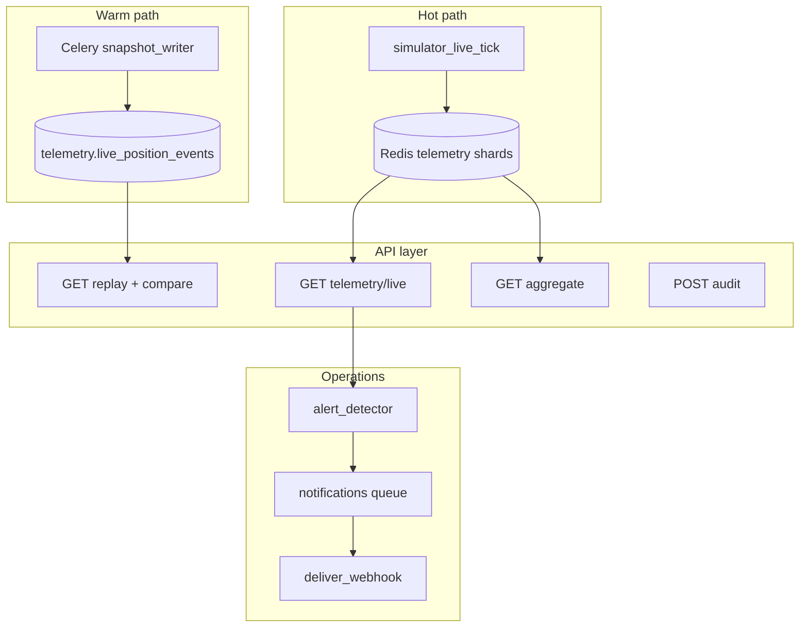

# ADR 012: Live Map Enterprise — Phase 2 architecture


| | |
|--|--|
| **Status** | ✅ Active |
| **Owner role** | Platform Operator / Tech Lead |
| **Last reviewed** | 2026-06-05 |
| **Audience** | Backend, admin frontend, on-call, B2B sales engineering |
| **lang** | en |
| **translation** | [Polski](../pl/adr/012-live-map-enterprise-phase2.md) |
| **canonical_path** | docs/adr/012-live-map-enterprise-phase2.md |

**Related:** [005-telemetry-tracking.md](./005-telemetry-tracking.md) · [011-telemetry-ingest-durability-under-load.md](./011-telemetry-ingest-durability-under-load.md) · [operations/LIVE_MAP.md](../operations/LIVE_MAP.md) · [operations/TELEMETRY_SHARDING.md](../operations/TELEMETRY_SHARDING.md)

---

## Status

Accepted (2026-06-05) — documents enterprise patterns and the Phase 2 delivery plan for the admin Live Map.

## Context

The admin Live Map already uses a **hot path** (Redis GEO via `TelemetryService`, simulator tick, SSE/poll). Phase 2 adds **B2B-grade** capabilities: multi-tenant isolation, warm-path replay, operability (audit + webhooks), white-label paint, and spatial aggregation at 10k+ riders.

This ADR records **how enterprises build fleet/live maps** and **how we map those patterns onto the SPORT stack** (Django + Redis + Timescale extension on existing Postgres + Celery).

## Decision summary

| Area | Enterprise pattern | SPORT decision |
|------|-------------------|----------------|
| Time-series | Hot + warm + cold tiers | Redis stays live source; **Timescale** schema `telemetry` for 30d replay/compare |
| Tenant/dept | Denormalize at ingest; enforce in API | `tenant_id` + `primary_department_id` on ride/telemetry; `live_map_rbac.py` |
| Scale LOD | Server-driven H3/hexbin | `GET /telemetry/live/aggregate/`; `meta.render_mode` |
| Alerts | Async detector + delivery | Celery `notifications` queue; Redis dedupe 10 min |
| Compliance | View audit per operator | `POST /telemetry/live/audit/` → `AuditLog` |

---

## 1. Time-series data (hot / warm / cold)

### Industry pattern

| Layer | Role | Typical tools |
|-------|------|---------------|
| **Hot** | Last seconds–minutes; live map | Redis GEO, Kafka, DynamoDB streams |
| **Warm** | Replay 24h–90d; compare vs yesterday | TimescaleDB, ClickHouse, BigQuery |
| **Cold** | Annual analytics; compliance | S3 + Parquet, data lake |

**How teams implement it:**

- **Async write** — live ingest never blocks on the time-series DB. A worker or Kafka consumer batches (e.g. 1–5 s, 500–5000 rows).
- **Postgres extension** — common for platform teams ~50–500 engineers: one Postgres + Timescale, separate `telemetry` schema, retention policies in Timescale.
- **Dedicated cluster** — when telemetry is a separate product (Datadog, Uber, delivery fleets): dedicated TS/ClickHouse; Postgres remains OLTP only.

**Enterprise add-ons:**

- Continuous aggregates (1 min, 1 h per tenant/cell)
- Compression after 7 days
- Multi-tenant: `tenant_id` on every row; access policies in **API** (RLS optional)

### SPORT mapping

```
simulator_live_tick → Redis (hot, unchanged)
        ↓
Celery Beat (10s) → snapshot_live_positions_to_timescale
        ↓
telemetry.live_position_events (hypertable, 30d retention, 7d compression)
        ↓
GET /telemetry/live/replay/ + /compare/
```

- **Never** write to Timescale on HTTP poll or SSE.
- Feature flag: `live_map_timescale_writer`.
- Existing `docker-compose.yml` already uses `timescale/timescaledb-ha:pg15-latest`.

**SLO (v1):** live GET p95 &lt; 200 ms (hot path unchanged); replay query p95 &lt; 800 ms (30s bucket, Poland bbox).

---

## 2. Tenant / department filter

### Industry pattern

- Attach `tenant_id`, `org_id`, `department_id` on **every position event** (snapshot from JWT / user profile).
- **No JOIN** to `UserDepartment` on every map poll (too expensive at 2 Hz × N operators).
- **RBAC at API layer:**
  - Global admin: optional `tenant_id` query
  - Tenant admin: `tenant_id` forced from token
  - Dept manager: `department_id IN (scoped_depts)`

**Department evolution:**

| Version | Model |
|---------|--------|
| v1 | One `primary_department_id` per ride/session |
| v2 | `department_ids[]` + OR filter |
| v3 | Dept tree — filter unit + sub-units (`department_path`) |

**Audit:** every live map query logs who + tenant + filters + `bbox_hash` (SOC2/GDPR).

### SPORT mapping

**Ingest denormalization** (`users/departments.py`, `simulator_live_tick.py`, `TelemetryService._encode_entry`):

- `ride_scope_from_user(user)` → `{tenant_id, primary_department_id}`
- Stored on live ride Redis hash and telemetry JSON (`tenantId`, `departmentId`)

**API enforcement** (`live_map_rbac.py`, `live_map_api.py`):

| Role | `tenant_id` | `department_id` |
|------|-------------|-----------------|
| `GLOBAL_OWNER` | optional query | optional (validated) |
| `TENANT_ADMIN` / `TENANT_MODERATOR` | forced from user | optional, tenant-scoped |
| Department moderator | forced tenant | IN `moderated_departments` |

**Meta:** `filters_applied`, `viewport_total_before_filter`, `viewport_filtered_out`.

**Code:** `backend/activities/live_map_rbac.py`, `live_map_api.py`, admin `liveMapFilters.ts`.

---

## 3. Spatial aggregation at scale (H3 / hexbin)

### Industry pattern (Uber, Mapbox, fleet tracking)

```
zoom out / high count  →  aggregated tiles (H3 cells)
zoom in / low count    →  clusters or raw points
```

- **H3** (Uber) or **S2** (Google) for global scale and “same cell yesterday” comparisons.
- **Rectangular hexbin** for single-city internal dashboards (fast MVP).
- **Vector tiles (MVT)** at very large scale — pre-aggregated counts per cell, not 10k GeoJSON features.

**Typical switch thresholds:**

| Viewport | Mode |
|----------|------|
| &lt; 2k points | Points / clusters |
| 2k–10k | Larger clusters, no labels |
| &gt; 10k or estimate ≫ returned | Cell heatmap only |

**Enterprise rule:** server decides (`detail=aggregate`, `resolution=h3:8`); client only paints fill layer. **`meta.capped`** must drive mode, not only a badge.

### SPORT mapping

- `GET /activities/telemetry/live/aggregate/` — `mode=h3|hexbin`, bbox, tenant/dept filters.
- Live source: Redis; history: Timescale continuous aggregate (when available).
- Redis cache: `{livemap}:agg:{bbox_hash}:{res}:{tenant}:{dept}` TTL 5–15 s.
- Hexbin fallback: logic from `heatmap.py` when `h3-py` unavailable.
- Live response meta: `render_mode: points|clusters|aggregate`, `aggregate_url`.
- Switch when `viewport_total_estimate >= 10_000` **or** `positions_returned >= 2000 && capped`.
- Feature flag: `live_map_h3_aggregate`.

Existing `heatmap.py` (grid + tenant) remains the pattern for **historical** activity heatmaps; live 10k+ uses the dedicated aggregate endpoint.

---

## 4. Webhooks and alerts

### Industry pattern

```
Detector (edge) → Event queue → Delivery worker → Webhook / PagerDuty / Slack
                      ↓
                 Dedupe store (Redis)
```

- **Never synchronous** in the user’s map HTTP request.
- **Detector** — separate logic: “did state change from OK → ALERT?” (hysteresis, cooldown 5–15 min).
- **Delivery** — Celery/SQS/Lambda, exponential backoff, DLQ, HMAC (`X-Signature-SHA256`).
- **Idempotency** — same `event_id`; duplicate POST must not page on-call.

| Event | Meaning |
|-------|---------|
| `ingest_lag` | Telemetry pipeline delayed |
| `viewport_saturated` | Sampling cap — incomplete data |
| `anomaly_spike` | Flagged / anti-cheat spike |
| `sla_breach` | Map stale &gt; X s |

Tenant UI: webhook URL + secret + subscribed events; test ping; delivery log (Stripe-style).

### SPORT mapping

Reuse pattern from `rewards/stripe_service.py`:

- Model: `LiveMapAlertWebhook` (tenant, url, secret, events[], enabled)
- Detector: `evaluate_live_map_alerts(meta, tenant_id)` — Celery after snapshot writer or Beat 60 s
- Dedupe: `livemap:alert:{tenant}:{event}:{bucket_10min}` TTL 600 s
- Delivery: queue **`notifications`**, headers `X-LiveMap-Signature`, `X-Event-Id`
- Feature flag: `live_map_webhooks`

**v1 events:** `viewport_capped`, `sync_stale`, `flagged_spike`, `zero_positions_anomaly`.

---

## 5. End-to-end architecture



### What distinguishes “enterprise” from “works locally”

1. **Multi-tenant isolation** — enforced in API, not only UI filters.
2. **Honest degradation** — on cap, switch to aggregate; not an empty map.
3. **Operability** — replay, compare, webhooks, audit for incident response.
4. **SLO** — live p95 &lt; 200 ms; replay async; alerts with cooldown.

---

## 6. Delivery order (product teams)

| Priority | Milestone | Deliverable |
|----------|-----------|-------------|
| P0 | M1 | Tenant/dept filter E2E |
| P1 | M2 | Timescale writer + 30d replay |
| P1 | M3 | Compare yesterday + server scrubber |
| P1 | M4 | Audit + webhooks v1 |
| P2 | M5 | `map_theme` dynamic cluster colors |
| P2 | M6 | H3 aggregate + auto LOD |

**Feature flags:** `live_map_timescale_writer`, `live_map_server_replay`, `live_map_h3_aggregate`, `live_map_webhooks`.

**Rollout:** GLOBAL_OWNER beta → per-tenant enable → default on.

---

## 7. Out of scope (Phase 2)

- Cold path S3/Parquet (annual analytics)
- Multi-dept OR filter (v2)
- Department tree / `department_path` (v3)
- MVT vector tiles
- Datadog integration (separate epic)

---

## 8. Implementation status

| Component | Status |
|-----------|--------|
| `live_map_rbac.py` + API scope filter | ✅ Shipped |
| Ride/telemetry denormalization | ✅ Shipped |
| Timescale hypertable + writer | ✅ Shipped |
| Replay / compare API + UI | ✅ Shipped |
| Audit POST | ✅ Shipped |
| Webhooks | ✅ Shipped |
| White-label `map_theme` | 🔲 Planned |
| H3 aggregate + LOD | 🔲 Planned (meta `render_mode` stub) |

---

## Consequences

- **Positive:** B2B-ready isolation and operability without replacing the proven Redis hot path.
- **Negative:** Additional Celery Beat load and Timescale storage (~30d per position snapshot).
- **Risks:** Positions without `tenantId` are hidden when tenant filter is active — simulator must denormalize on every new ride.
