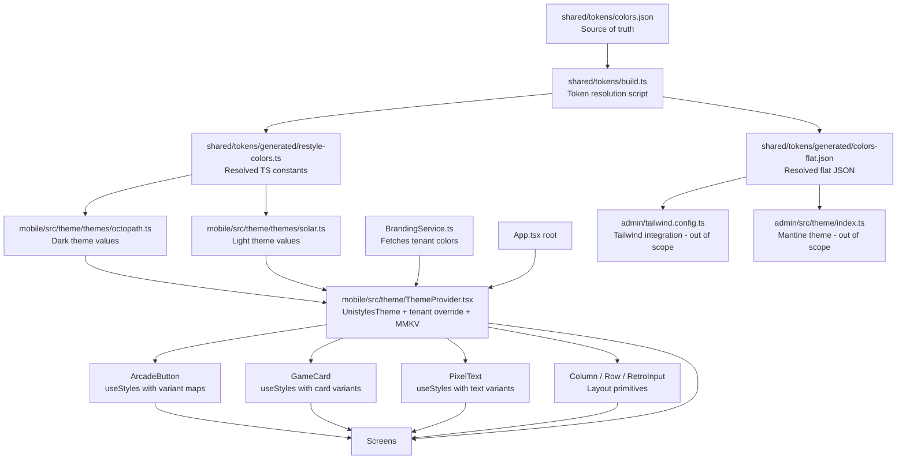

# SPORT Mobile App — UI Framework Rebuild: Implementation Tasks

**Date:** 2026-05-04
**Status:** Ready for execution
**Based on:** [`plans/ui-framework-rebuild-proposal.md`](plans/ui-framework-rebuild-proposal.md) (commit `fa53391a`)
**Chosen Framework:** **react-native-unistyles** (Option F — per task directive; overrides proposal's primary Restyle recommendation)

---

## Table of Contents

1. [Overview & Architecture](#1-overview--architecture)
2. [Dependency Graph](#2-dependency-graph)
3. [Phase 0: Design Token Infrastructure](#3-phase-0-design-token-infrastructure)
4. [Phase 1: Unistyles Setup & Theme Provider](#4-phase-1-unistyles-setup--theme-provider)
5. [Phase 2: Core Component Migration](#5-phase-2-core-component-migration)
6. [Phase 3: Screen-by-Screen Migration](#6-phase-3-screen-by-screen-migration)
7. [Phase 4: Cleanup, Validation & Optimization](#7-phase-4-cleanup-validation--optimization)
8. [Summary: Files Touched](#8-summary-files-touched)
9. [Execution Order & Parallelization](#9-execution-order--parallelization)

---

## 1. Overview & Architecture

### 1.1 Framework: react-native-unistyles

Unistyles replaces Restyle from the original proposal. Key differences in approach:

| Concern | Restyle (Proposal) | Unistyles (Implementation) |
|---|---|---|
| Theme provider | `ThemeProvider` from `@shopify/restyle` | `UnistylesTheme` from `react-native-unistyles` |
| Style API | `createBox`/`createText`/`createVariant` factories | `useStyles(theme => StyleSheet.create({...}))` — returns memoized `StyleSheet` objects |
| Variants | `createVariant` with typed variant maps | Variant logic inside `useStyles()` callback — conditionally select styles based on props |
| TypeScript | Auto-generates from theme config | Full inference from theme type definition passed to `UnistylesTheme` |
| Bundle impact | ~15 KB gzipped | ~8 KB gzipped |
| White-label nesting | Nested `ThemeProvider` | Nested `UnistylesTheme` (v3+) |
| Breakpoints | Built-in responsive props | Built-in breakpoints via `useStyles()` |

### 1.2 Shared Token System (Framework-Agnostic)

The design token layer (Phase 0) is identical regardless of whether Restyle or Unistyles is chosen. The `shared/tokens/` directory produces resolved output consumed by both mobile (Unistyles) and admin (Mantine/Tailwind).

---

## 2. Dependency Graph



### 2.1 Target Directory Structure (Post-Migration)

```
shared/
└── tokens/                           # NEW — single source of truth
    ├── colors.json                   # Token definitions with {primitive.*} refs
    ├── build.ts                      # Resolution script
    └── generated/                    # COMMITTED — consumers import from here
        ├── restyle-colors.ts         # Resolved TS constants (name kept for compat)
        └── colors-flat.json          # Resolved flat JSON for admin

mobile/
├── src/
│   ├── theme/                        # NEW — Unistyles theme system
│   │   ├── types.ts                  # Theme type definition
│   │   ├── themes/
│   │   │   ├── octopath.ts           # Dark theme
│   │   │   └── solar.ts              # Light theme
│   │   ├── ThemeProvider.tsx         # UnistylesTheme wrapper
│   │   └── useThemeMode.ts           # Reactive theme toggle hook
│   │
│   ├── components/
│   │   ├── arcade/                   # REFACTORED
│   │   │   ├── ArcadeButton.tsx      # useStyles() with variant maps
│   │   │   ├── GameCard.tsx          # useStyles() with card variants
│   │   │   └── PixelText.tsx         # useStyles() + RN Text
│   │   ├── layout/                   # NEW
│   │   │   ├── Column.tsx            # Replaces YStack
│   │   │   ├── Row.tsx               # Replaces XStack
│   │   │   └── ScrollContainer.tsx   # Theme-aware ScrollView
│   │   └── inputs/
│   │       └── RetroInput.tsx        # Replaces Tamagui Input
│   │
│   ├── services/
│   │   ├── ThemeService.ts           # REFACTORED — delegates to Unistyles
│   │   └── BrandingService.ts        # REFACTORED — returns theme partial
│   │
│   └── screens/                      # REFACTORED — colors from theme
│       ├── TrackingScreen.tsx
│       ├── ProfileScreen.tsx
│       ├── OnboardingScreen.tsx
│       ├── ActivitiesScreen.tsx
│       ├── LeaderboardScreen.tsx
│       ├── RewardsScreen.tsx
│       ├── SplashScreen.tsx
│       ├── GameHUD.tsx
│       ├── PopUpDialog.tsx
│       ├── PixelStats.tsx
│       ├── AdaptiveAsset.tsx
│       ├── AthleteSprite.tsx
│       ├── GameTabBar.tsx
│       └── SkiaMetrics.tsx
│
├── App.tsx                           # REFACTORED — UnistylesTheme replaces TamaguiProvider
├── tamagui.config.ts                 # DELETED (Phase 4)
├── babel.config.js                   # MODIFIED — Tamagui plugin removed (Phase 4)
└── metro.config.js                   # MODIFIED — watchFolders + extraNodeModules for @tokens
```

---

## 3. Phase 0: Design Token Infrastructure

**Goal:** Establish the shared token system, build pipeline, and workspace configuration. No existing code is modified — only new files are created and dependencies installed.

**Prerequisites:** None (this is the starting point).

### T0.1 — Create `shared/tokens/colors.json`

- **Scope:** Define the single source of truth for all design tokens using the three-tier hierarchy (primitive → semantic → theme-specific). All tokens use `{primitive.xxx}` reference syntax to avoid hex duplication.
- **Deliverable:** [`shared/tokens/colors.json`](shared/tokens/colors.json) — populated with the full token catalog from proposal §7.3 (lines 495–656), including all 21 primitive tokens, 6 semantic tokens, and full `octopath`/`solar` theme token sets.
- **Dependencies:** None
- **Complexity:** Low
- **Reference:** Proposal §7.1–7.3 (lines 477–657)

### T0.2 — Create `shared/tokens/build.ts` resolution script

- **Scope:** Implement the build script that parses `colors.json`, resolves all `{primitive.xxx}` references to flat hex strings, and writes two output files:
  - `shared/tokens/generated/restyle-colors.ts` — TypeScript `as const` export for mobile Unistyles consumption
  - `shared/tokens/generated/colors-flat.json` — flat JSON for admin Tailwind/Mantine consumption
- **Deliverable:** [`shared/tokens/build.ts`](shared/tokens/build.ts) implementing the logic from proposal §7.4.1 (lines 665–736), plus the `generated/` output directory.
- **Dependencies:** T0.1 (needs `colors.json` to parse)
- **Complexity:** Medium
- **Reference:** Proposal §7.4 (lines 659–798)

### T0.3 — Configure workspace path aliases for `@tokens`

- **Scope:** Add `@tokens` path alias to `tsconfig` files, Metro resolver, and Vite config so consumers can `import { colors } from '@tokens/generated/restyle-colors'` without fragile relative paths.
- **Deliverable:** Modifications to:
  - [`mobile/tsconfig.json`](mobile/tsconfig.json:1) — add `paths: { "@tokens/*": ["../shared/tokens/*"] }`
  - [`mobile/metro.config.js`](mobile/metro.config.js:1) — add `watchFolders` and `extraNodeModules` for `@tokens` (merge with existing `getDefaultConfig`, per proposal §7.6.2 lines 895–916)
  - [`admin/tsconfig.app.json`](admin/tsconfig.app.json:1) — add same `@tokens` path alias
  - [`admin/vite.config.ts`](admin/vite.config.ts:1) — add `resolve.alias` for `@tokens`
- **Dependencies:** None (can be done in parallel with T0.1/T0.2)
- **Complexity:** Medium
- **Reference:** Proposal §7.6 (lines 861–954)

### T0.4 — Run initial token build and verify output

- **Scope:** Execute `npx ts-node shared/tokens/build.ts` to generate the resolved output files. Verify that:
  - All `{primitive.xxx}` references resolve to actual hex strings (no unresolved references)
  - `restyle-colors.ts` exports a valid TypeScript `as const` object
  - `colors-flat.json` is valid JSON with flat hex values
  - The output directory `shared/tokens/generated/` is created
- **Deliverable:** Populated `shared/tokens/generated/` directory with verified output files.
- **Dependencies:** T0.1, T0.2
- **Complexity:** Low
- **Reference:** Proposal §7.4.2–7.4.4 (lines 738–799)

### T0.5 — Add `tokens:build` and `tokens:check` npm scripts

- **Scope:** Add scripts to root [`package.json`](package.json:1) for token build and CI verification. The `tokens:check` variant should exit 1 if generated output is stale (i.e., `colors.json` was modified but build wasn't re-run).
- **Deliverable:** Two new scripts in root [`package.json`](package.json:1):
  - `"tokens:build": "npx ts-node shared/tokens/build.ts"`
  - `"tokens:check": "npx ts-node shared/tokens/build.ts --check"`
- **Dependencies:** T0.2
- **Complexity:** Low
- **Reference:** Proposal §7.4.2 (lines 740–753)

### T0.6 — Install `react-native-unistyles`

- **Scope:** Install the Unistyles package in the mobile project. Unistyles is pure JS, has zero native dependencies, and is Expo SDK 55 compatible — no config plugin or dev client needed.
- **Deliverable:** `react-native-unistyles` added to [`mobile/package.json`](mobile/package.json:1) dependencies.
- **Dependencies:** None (can be done anytime, no conflicts with existing Tamagui)
- **Complexity:** Low

---

## 4. Phase 1: Unistyles Setup & Theme Provider

**Goal:** Build the Unistyles theme system with dark/light theme support, MMKV persistence, and tenant branding overrides. Theme provider is mounted but TamaguiProvider remains wrapped — both coexist.

**Prerequisites:** Phase 0 complete (tokens generated, `@tokens` alias working, Unistyles installed).

### T1.1 — Create theme type definitions

- **Scope:** Define the TypeScript `AppTheme` interface that Unistyles will use for full type inference. This is the contract that all `useStyles()` callbacks and theme consumers will reference.
- **Deliverable:** [`mobile/src/theme/types.ts`](mobile/src/theme/types.ts) — exports:
  - `AppTheme` interface with `colors`, `spacing`, `typography`, `borders`, `shadows`, `breakpoints`
  - Type exports for `ThemeMode` (`'octopath' | 'solar'`)
- **Dependencies:** T0.4 (need to know the shape of resolved tokens)
- **Complexity:** Low
- **Reference:** Proposal §6.2 directory structure (lines 380–438)

### T1.2 — Create octopath (dark) theme

- **Scope:** Define the `octopath` theme object by importing resolved tokens from `@tokens/generated/restyle-colors` and mapping them to the `AppTheme` shape. This is the dark/game theme with deep sea background, gold accents, and cream text.
- **Deliverable:** [`mobile/src/theme/themes/octopath.ts`](mobile/src/theme/themes/octopath.ts) — exports default `octopathTheme: AppTheme`
- **Dependencies:** T1.1 (types), T0.4 (resolved tokens)
- **Complexity:** Low
- **Reference:** Proposal §7.3 octopath token block (lines 535–562)

### T1.3 — Create solar (light) theme

- **Scope:** Define the `solar` theme object by importing resolved tokens and mapping them to the same `AppTheme` shape. This is the light theme with cream background, brown text, and darker accent colors.
- **Deliverable:** [`mobile/src/theme/themes/solar.ts`](mobile/src/theme/themes/solar.ts) — exports default `solarTheme: AppTheme`
- **Dependencies:** T1.1 (types), T0.4 (resolved tokens)
- **Complexity:** Low
- **Reference:** Proposal §7.3 solar token block (lines 565–593)

### T1.4 — Create ThemeProvider wrapper

- **Scope:** Build the central [`ThemeProvider`](mobile/src/theme/ThemeProvider.tsx) component that:
  - Reads the active theme mode from MMKV (default `'octopath'`)
  - Provides the base theme (octopath or solar) to Unistyles
  - Optionally nests a tenant theme override on top when `BrandingService` has fetched colors
  - Persists theme mode changes to MMKV
  - Exposes theme toggle via React context or the Unistyles runtime
- **Deliverable:** [`mobile/src/theme/ThemeProvider.tsx`](mobile/src/theme/ThemeProvider.tsx)
- **Dependencies:** T1.2, T1.3 (themes), T1.6 (useThemeMode hook)
- **Complexity:** High — core integration point for Unistyles, MMKV, and tenant branding
- **Reference:** Proposal §6.3 (data flow diagram lines 440–473), §11.2 (tenant override pattern lines 1295–1324)

### T1.5 — Create `useThemeMode` hook

- **Scope:** Replace the current [`ThemeService.ts`](mobile/src/services/ThemeService.ts:1) observable pattern with a reactive hook that:
  - Uses Unistyles' `useInitialTheme` or a custom `useMMKV` + React state approach
  - Provides `themeMode`, `toggleTheme()`, and `setTheme(mode)` 
  - Is reactive — components re-render on theme change
  - Persists to MMKV
- **Deliverable:** [`mobile/src/theme/useThemeMode.ts`](mobile/src/theme/useThemeMode.ts)
- **Dependencies:** T1.4 (co-designed with ThemeProvider)
- **Complexity:** Medium — must solve the reactivity problem that the current `@legendapp/state` one-shot read has
- **Reference:** Proposal §2.5 (broken theme switching audit lines 92–98), §6.2 (useThemeMode in directory structure line 395)

### T1.6 — Refactor ThemeService

- **Scope:** Modify [`ThemeService.ts`](mobile/src/services/ThemeService.ts:1) to delegate to the new Unistyles-based system. Options:
  - **Preferred:** Deprecate `ThemeService` entirely — all consumers migrate to `useThemeMode()`
  - **Fallback:** Keep `ThemeService` as a thin wrapper that calls the new hook's underlying MMKV store for any remaining non-React consumers
- **Deliverable:** [`mobile/src/services/ThemeService.ts`](mobile/src/services/ThemeService.ts:1) — refactored or deprecated
- **Dependencies:** T1.5
- **Complexity:** Low
- **Reference:** Proposal Phase 1 step 1.7 (line 982)

### T1.7 — Wire BrandingService into tenant theme overrides

- **Scope:** Modify [`BrandingService.ts`](mobile/src/services/BrandingService.ts:1) so that when tenant branding is fetched, the colors are fed into `ThemeProvider`'s nested theme override. The `colors()` method (currently never called) should return an `AppTheme` partial that `ThemeProvider` uses to override the base theme's `primary` and `secondary` colors. All components referencing `theme.colors.primary` will automatically resolve the tenant's color.
- **Deliverable:** [`mobile/src/services/BrandingService.ts`](mobile/src/services/BrandingService.ts:1) — refactored
- **Dependencies:** T1.4 (ThemeProvider must accept theme overrides)
- **Complexity:** Medium
- **Reference:** Proposal §2.6 (white-label audit lines 100–105), §11.2 (tenant override pattern lines 1295–1324)

### T1.8 — Add ESLint `no-restricted-imports` rule for Tamagui

- **Scope:** Add an ESLint rule that blocks new Tamagui imports during the coexistence period. The rule allows only aliased `useTheme as useTamaguiTheme` for screens not yet migrated, and blocks all other Tamagui imports.
- **Deliverable:** ESLint configuration update with the rule from proposal §8.3 (lines 1098–1120)
- **Dependencies:** None (should be added at Phase 1 start)
- **Complexity:** Low
- **Reference:** Proposal §8.3 lint guard (lines 1098–1120)

### Phase 1 Testing Checkpoint

| Test | What to Verify |
|---|---|
| ThemeProvider renders | Mount ThemeProvider → child component calls `useStyles()` → returns styles for octopath theme |
| Theme toggle | `toggleTheme()` → solar → component re-renders with solar styles |
| MMKV persistence | Set theme to `'solar'`, kill app, relaunch → theme is `'solar'` |
| Tenant branding | Mock `BrandingService` with `{ primary_color: '#FF0000' }` → `theme.colors.primary` resolves to `'#FF0000'` |
| Unistyles + Tamagui coexist | Both `UnistylesTheme` and `TamaguiProvider` mounted → no crashes, no style conflicts |

---

## 5. Phase 2: Core Component Migration

**Goal:** Rebuild the Arcade component layer on Unistyles `useStyles()` + direct React Native primitives, consuming theme tokens instead of hardcoded hex colors. Layout primitives (Column, Row, ScrollContainer) and RetroInput are created.

**Prerequisites:** Phase 1 complete (ThemeProvider with Unistyles mounted, themes defined, `@tokens` import path working).

### T2.1 — Rewrite PixelText on Unistyles + RN Text

- **Scope:** Replace Tamagui `Text` import with React Native `Text`. Replace hardcoded default color `#F5E6CC` with `theme.colors.text`. Move `fontFamily`, `fontSize`, `textShadowColor`, `textShadowOffset` into `useStyles()` callback. Preserve the `shadow` prop behavior (pixel-art drop shadow toggle).
- **Deliverable:** [`mobile/src/components/arcade/PixelText.tsx`](mobile/src/components/arcade/PixelText.tsx:1) — rewritten
- **Dependencies:** T1.4 (ThemeProvider must be available for `useStyles()`)
- **Complexity:** Low — small component, straightforward migration
- **Reference:** Proposal Phase 2 step 2.3 (line 999), current PixelText at [`PixelText.tsx`](mobile/src/components/arcade/PixelText.tsx:1)

### T2.2 — Rewrite ArcadeButton with useStyles() variant maps

- **Scope:** The most complex arcade component migration. Replace the hardcoded `colors` variant map (lines 30–36 of current file) with a `useStyles()` callback that selects styles based on `variant` prop, reading colors from `theme.colors`. Replace Tamagui `View` with RN `View`. Preserve all 3D drop-shadow rendering, haptic integration, press animation, disabled state, and size variants. Add `accessibilityRole="button"` and `accessibilityLabel={label}`.
- **Deliverable:** [`mobile/src/components/arcade/ArcadeButton.tsx`](mobile/src/components/arcade/ArcadeButton.tsx:1) — rewritten
- **Dependencies:** T2.1 (PixelText must be migrated first — ArcadeButton uses it)
- **Complexity:** High — 5 color variants × 3 sizes × disabled state × 3D shadow rendering × haptics × accessibility
- **Reference:** Proposal Phase 2 step 2.1 (line 997), §9.2 accessibility requirements (lines 1164–1172), current ArcadeButton at [`ArcadeButton.tsx`](mobile/src/components/arcade/ArcadeButton.tsx:1)

### T2.3 — Rewrite GameCard with useStyles() card variants

- **Scope:** Replace hardcoded variant color maps (`dark`, `metal`, `parchment`, `hologram`) with `useStyles()` callback. Replace Tamagui `View` with RN `View`. Preserve thick borders, inset highlight, and card-specific shadow effects. Add `accessibilityRole="summary"` for interactive cards.
- **Deliverable:** [`mobile/src/components/arcade/GameCard.tsx`](mobile/src/components/arcade/GameCard.tsx:1) — rewritten
- **Dependencies:** T2.1 (PixelText), T2.2 (may share variant patterns with ArcadeButton)
- **Complexity:** Medium — 4 variants, thick border rendering
- **Reference:** Proposal Phase 2 step 2.2 (line 998), §9.2 accessibility

### T2.4 — Create Column layout component

- **Scope:** Simple `<Column>` component that renders an RN `<View style={styles.column}>` with `flexDirection: 'column'`. Accepts optional `gap`, `padding`, `alignItems`, `justifyContent` props mapped to theme spacing tokens. This replaces all `YStack` usages across 8 files.
- **Deliverable:** [`mobile/src/components/layout/Column.tsx`](mobile/src/components/layout/Column.tsx) — new file
- **Dependencies:** T1.4 (needs theme for spacing tokens)
- **Complexity:** Low
- **Reference:** Proposal Phase 2 step 2.4 (line 1000), §2.1 Tamagui usage inventory (line 41)

### T2.5 — Create Row layout component

- **Scope:** Simple `<Row>` component that renders an RN `<View style={styles.row}>` with `flexDirection: 'row'`. Same prop pattern as Column. Replaces all `XStack` usages across 6 files.
- **Deliverable:** [`mobile/src/components/layout/Row.tsx`](mobile/src/components/layout/Row.tsx) — new file
- **Dependencies:** T1.4 (spacing tokens), T2.4 (may share base layout pattern)
- **Complexity:** Low
- **Reference:** Proposal Phase 2 step 2.5 (line 1001), §2.1 Tamagui usage inventory (line 42)

### T2.6 — Create ScrollContainer component

- **Scope:** Theme-aware `<ScrollContainer>` wrapping RN `ScrollView`. Replaces 3 usages of Tamagui `ScrollView` across screens. Applies theme background color by default.
- **Deliverable:** [`mobile/src/components/layout/ScrollContainer.tsx`](mobile/src/components/layout/ScrollContainer.tsx) — new file
- **Dependencies:** T1.4 (theme)
- **Complexity:** Low
- **Reference:** Proposal §6.2 directory structure (line 406)

### T2.7 — Create RetroInput component

- **Scope:** Theme-aware text input replacing Tamagui `Input`. Must support focus/blur border color resolution from theme tokens, pixel-art border styling, and the arcade aesthetic. Add `accessibilityLabel={placeholder}`. Used in OnboardingScreen and App.tsx auth.
- **Deliverable:** [`mobile/src/components/inputs/RetroInput.tsx`](mobile/src/components/inputs/RetroInput.tsx) — new file
- **Dependencies:** T1.4 (theme)
- **Complexity:** Medium
- **Reference:** Proposal Phase 2 step 2.6 (line 1002), §9.2 accessibility

### T2.8 — Deprecate or consolidate RetroCard and HD2DButton

- **Scope:** 
  - [`RetroCard.tsx`](mobile/src/components/RetroCard.tsx:1) — uses Tamagui `styled()`. Either deprecate in favor of `GameCard` (which has richer variants), or rewrite using `useStyles()` if it serves a distinct purpose.
  - [`HD2DButton.tsx`](mobile/src/components/HD2DButton.tsx:1) — barely used (actual button is `ArcadeButton`). Deprecate and remove Tamagui dependency, delegate to `ArcadeButton` internally, or delete if no consumers.
- **Deliverable:** [`mobile/src/components/RetroCard.tsx`](mobile/src/components/RetroCard.tsx:1) and [`mobile/src/components/HD2DButton.tsx`](mobile/src/components/HD2DButton.tsx:1) — refactored or deprecated
- **Dependencies:** T2.2 (ArcadeButton), T2.3 (GameCard)
- **Complexity:** Low
- **Reference:** Proposal Phase 2 steps 2.7–2.8 (lines 1003–1004)

### Phase 2 Testing Checkpoint

| Test | What to Verify |
|---|---|
| ArcadeButton — all variants | Render `gold`, `green`, `red`, `blue`, `ghost` in octopath theme → visual match to pre-migration |
| ArcadeButton — solar theme | Same variants in solar theme → correct solar colors, not octopath |
| ArcadeButton — disabled | Disabled state uses `theme.colors.disabled` grays, not hardcoded |
| ArcadeButton — sizes | `sm` (36px), `md` (50px), `lg` (64px) render correctly |
| ArcadeButton — accessibility | `accessibilityRole="button"` and `accessibilityLabel` present |
| GameCard — all variants | `dark`, `metal`, `parchment`, `hologram` render correctly in both themes |
| PixelText — sizes | `sm`(10), `md`(12), `lg`(14), `xl`(18) render with correct font size |
| PixelText — shadow | `shadow=true` renders pixel drop shadow, `shadow=false` does not |
| Column/Row | `flexDirection` produces correct layout, `gap` prop applies spacing |
| RetroInput | Focus/blur border color resolves from theme; text input functional |

---

## 6. Phase 3: Screen-by-Screen Migration

**Goal:** Migrate every screen from Tamagui primitives to Unistyles `useStyles()` + RN primitives + the new Arcade/layout components. Each screen is one commit for clean rollback. Hardcoded hex colors are replaced with `theme.colors.*` references.

**Prerequisites:** Phase 2 complete (all Arcade components and layout primitives ready).

### T3.1 — Migrate App.tsx (root)

- **Scope:** The most critical migration. Replace `TamaguiProvider` with the new `ThemeProvider`. Replace Tamagui `YStack`/`XStack` with `Column`/`Row`. Replace Tamagui `Input` with `RetroInput`. Wire theme toggle to `useThemeMode().toggleTheme()`. Ensure font loading (`Press Start 2P`) still works. Wire `BrandingService.fetch()` into the theme provider after auth.
- **Deliverable:** [`mobile/App.tsx`](mobile/App.tsx:1) — rewritten
- **Dependencies:** T1.4 (ThemeProvider), T2.4–T2.7 (Column, Row, ScrollContainer, RetroInput), T1.7 (BrandingService)
- **Complexity:** High — root component, auth flow, theme wiring, font loading
- **Reference:** Proposal Phase 3 step 3.1 (line 1019), §6.3 data flow diagram (lines 440–473)

### T3.2 — Migrate SplashScreen.tsx

- **Scope:** Replace Tamagui `YStack`/`Text`/`H1`/`View` with `Column` and `PixelText`. Replace hardcoded `#0B1D33`, `#D4A373`, `#F5E6CC`, `#1A2A3A`, `#FF6B35`, `#333` with theme token references.
- **Deliverable:** [`mobile/src/components/SplashScreen.tsx`](mobile/src/components/SplashScreen.tsx:1) — rewritten
- **Dependencies:** T2.1 (PixelText), T2.4 (Column)
- **Complexity:** Low
- **Reference:** Proposal Phase 3 step 3.8 (line 1026)

### T3.3 — Migrate OnboardingScreen.tsx

- **Scope:** The only screen actively using Tamagui theme tokens (`$primary`, `$color`, `$background`, `$hd2d.outlineColor`). Replace all `$token` references with `theme.colors.*` from `useStyles()`. Replace Tamagui `YStack`/`XStack`/`View`/`Text`/`Input`/`Label`/`Button` with `Column`/`Row`/`PixelText`/`RetroInput`/`ArcadeButton`. This is the screen with the most Tamagui API surface.
- **Deliverable:** [`mobile/src/screens/OnboardingScreen.tsx`](mobile/src/screens/OnboardingScreen.tsx:1) — rewritten
- **Dependencies:** T2.1–T2.7 (all Arcade/layout components)
- **Complexity:** High — most Tamagui-dependent screen
- **Reference:** Proposal Phase 3 step 3.4 (line 1022), §2.1 (usage inventory), §2.2 (only screen using theme tokens)

### T3.4 — Migrate TrackingScreen.tsx

- **Scope:** Replace Tamagui `YStack` with `Column`. Replace `useTheme()` from Tamagui with Unistyles `useStyles()`. Preserve map style switching logic (the sole dynamic theme-aware behavior noted in §2.5). Replace hardcoded `#0B1D33` with `theme.colors.background`.
- **Deliverable:** [`mobile/src/screens/TrackingScreen.tsx`](mobile/src/screens/TrackingScreen.tsx:1) — rewritten
- **Dependencies:** T2.4 (Column), T2.6 (ScrollContainer)
- **Complexity:** Medium — map integration, theme-aware map style
- **Reference:** Proposal Phase 3 step 3.2 (line 1020)

### T3.5 — Migrate ProfileScreen.tsx

- **Scope:** Largest screen file (~12k chars). Replace Tamagui `YStack`/`XStack`/`ScrollView`/`View`/`Text` with `Column`/`Row`/`ScrollContainer`/`PixelText`. Replace all hardcoded colors: `#0B1D33`, `#D4A373`, `#7BA05B`, `#2B303A`, `#F5E6CC`, `#9CA3AF`, `#000000`, `#FFFFFF`, `#FC4C02`, `#007CC3`. QR code section uses `#FFFFFF` — map to `theme.colors.textInverse`.
- **Deliverable:** [`mobile/src/screens/ProfileScreen.tsx`](mobile/src/screens/ProfileScreen.tsx:1) — rewritten
- **Dependencies:** T2.1 (PixelText), T2.4–T2.6 (Column, Row, ScrollContainer)
- **Complexity:** High — large file, many color references
- **Reference:** Proposal Phase 3 step 3.3 (line 1021), Appendix §13 color audit (line 1362)

### T3.6 — Migrate ActivitiesScreen.tsx

- **Scope:** Replace Tamagui `YStack`/`XStack`/`ScrollView`/`View` with `Column`/`Row`/`ScrollContainer`. Replace hardcoded colors with theme tokens.
- **Deliverable:** [`mobile/src/screens/ActivitiesScreen.tsx`](mobile/src/screens/ActivitiesScreen.tsx:1) — rewritten
- **Dependencies:** T2.4–T2.6 (layout primitives)
- **Complexity:** Medium
- **Reference:** Proposal Phase 3 step 3.5 (line 1023)

### T3.7 — Migrate LeaderboardScreen.tsx

- **Scope:** Replace Tamagui `YStack`/`XStack`/`ScrollView`/`View` with `Column`/`Row`/`ScrollContainer`. Replace hardcoded colors with theme tokens.
- **Deliverable:** [`mobile/src/screens/LeaderboardScreen.tsx`](mobile/src/screens/LeaderboardScreen.tsx:1) — rewritten
- **Dependencies:** T2.4–T2.6 (layout primitives)
- **Complexity:** Medium
- **Reference:** Proposal Phase 3 step 3.6 (line 1024)

### T3.8 — Migrate RewardsScreen.tsx

- **Scope:** Replace Tamagui `YStack`/`XStack`/`ScrollView`/`View` with `Column`/`Row`/`ScrollContainer`. Replace hardcoded colors with theme tokens.
- **Deliverable:** [`mobile/src/screens/RewardsScreen.tsx`](mobile/src/screens/RewardsScreen.tsx:1) — rewritten
- **Dependencies:** T2.4–T2.6 (layout primitives)
- **Complexity:** Medium
- **Reference:** Proposal Phase 3 step 3.7 (line 1025)

### T3.9 — Migrate GameHUD.tsx

- **Scope:** Replace Tamagui `YStack`/`XStack` with `Column`/`Row`. This is a HUD overlay component — ensure positioning and z-index layering are preserved.
- **Deliverable:** [`mobile/src/components/GameHUD.tsx`](mobile/src/components/GameHUD.tsx:1) — rewritten
- **Dependencies:** T2.4–T2.5 (Column, Row)
- **Complexity:** Medium — HUD overlay positioning
- **Reference:** Proposal Phase 3 step 3.9 (line 1027)

### T3.10 — Migrate PopUpDialog.tsx

- **Scope:** Replace Tamagui `XStack`/`YStack`/`Text`/`View` with `Row`/`Column`/`PixelText`. Add `accessibilityRole="alert"` and `AccessibilityInfo` API announcement.
- **Deliverable:** [`mobile/src/components/PopUpDialog.tsx`](mobile/src/components/PopUpDialog.tsx:1) — rewritten
- **Dependencies:** T2.1 (PixelText), T2.4–T2.5 (Column, Row)
- **Complexity:** Low
- **Reference:** Proposal Phase 3 step 3.10 (line 1028), §9.2 accessibility

### T3.11 — Migrate PixelStats.tsx

- **Scope:** Remove Tamagui `useTheme` import. Replace with Unistyles `useStyles()`. Replace any Tamagui `Text`/`View` with `PixelText`/RN `View`.
- **Deliverable:** [`mobile/src/components/PixelStats.tsx`](mobile/src/components/PixelStats.tsx:1) — rewritten
- **Dependencies:** T2.1 (PixelText)
- **Complexity:** Low
- **Reference:** Proposal Phase 3 step 3.11 (line 1029)

### T3.12 — Migrate AdaptiveAsset.tsx

- **Scope:** Remove Tamagui `useTheme` import. Replace with Unistyles `useStyles()`. This component likely uses `useTheme().name` for theme-aware asset selection.
- **Deliverable:** [`mobile/src/components/AdaptiveAsset.tsx`](mobile/src/components/AdaptiveAsset.tsx:1) — rewritten
- **Dependencies:** T1.5 (useThemeMode for theme name)
- **Complexity:** Low
- **Reference:** Proposal Phase 3 step 3.12 (line 1030)

### T3.13 — Migrate AthleteSprite.tsx

- **Scope:** Replace Tamagui `View` with RN `View`. Minimal change — this component likely only uses `View` as a container.
- **Deliverable:** [`mobile/src/components/AthleteSprite.tsx`](mobile/src/components/AthleteSprite.tsx:1) — rewritten
- **Dependencies:** None
- **Complexity:** Low
- **Reference:** Proposal Phase 3 step 3.13 (line 1031)

### T3.14 — Migrate GameTabBar.tsx

- **Scope:** Replace hardcoded colors (`#0B1D33`, `#D4A373`, `#9CA3AF`, `#8B7355`) with theme token references (`theme.colors.tabBarBg`, `theme.colors.tabBarBorder`, `theme.colors.tabActiveText`, `theme.colors.tabInactiveText`). Add `accessibilityRole="tab"` and `accessibilityState={{ selected }}` for each tab.
- **Deliverable:** [`mobile/src/navigation/GameTabBar.tsx`](mobile/src/navigation/GameTabBar.tsx:1) — rewritten
- **Dependencies:** T1.4 (theme)
- **Complexity:** Medium — tab bar navigation component, accessibility
- **Reference:** Proposal Phase 3 step 3.14 (line 1032), §9.2 accessibility, Appendix §13 color audit

### T3.15 — Migrate SkiaMetrics.tsx

- **Scope:** Check if this file imports from Tamagui. If yes, replace with RN `View`. Skia canvas rendering likely doesn't use Tamagui styling primitives — may only use `View` as container.
- **Deliverable:** [`mobile/src/components/SkiaMetrics.tsx`](mobile/src/components/SkiaMetrics.tsx:1) — checked and migrated if needed
- **Dependencies:** None
- **Complexity:** Low
- **Reference:** Proposal Phase 3 step 3.15 (line 1033)

### Phase 3 Testing Checkpoint

| Test | What to Verify |
|---|---|
| Visual regression — each screen | Screenshot comparison before/after migration in both octopath and solar themes |
| Theme toggle — each screen | Toggle octopath ↔ solar → all elements reflect correct theme colors |
| Tenant branding — all screens | Mock `BrandingService` with `{ primary_color: '#FF0000' }` → `primary` color cascades to buttons, borders, tabs across all screens |
| Lint — zero Tamagui imports | `grep -r "from 'tamagui'" mobile/src/` → 0 results (or only `useTamaguiTheme` alias) |
| Navigation | Tab bar works, screen transitions work, deep links work |
| Font loading | `Press Start 2P` font renders correctly on all screens |

---

## 7. Phase 4: Cleanup, Validation & Optimization

**Goal:** Remove Tamagui entirely, verify the migration, and optimize. At this point, no Tamagui imports remain in any source file — the framework is dead weight.

**Prerequisites:** Phase 3 complete (all screens migrated, zero active Tamagui imports).

### T4.1 — Uninstall Tamagui packages

- **Scope:** Remove `tamagui`, `@tamagui/config`, and `@tamagui/babel-plugin` from `package.json` dependencies/devDependencies. Run `npm install` to clean `node_modules`.
- **Deliverable:** [`mobile/package.json`](mobile/package.json:1) — tamagui packages removed. Expected bundle reduction: ~150–200 KB.
- **Dependencies:** T3.15 (all screens migrated)
- **Complexity:** Low
- **Reference:** Proposal Phase 4 step 4.1 (line 1047)

### T4.2 — Remove Tamagui babel plugin

- **Scope:** Remove the `@tamagui/babel-plugin` entry (lines 12–18) from [`babel.config.js`](mobile/babel.config.js:1). Keep the `transform-inline-environment-variables` plugin but remove `TAMAGUI_TARGET` from its includes.
- **Deliverable:** [`mobile/babel.config.js`](mobile/babel.config.js:1) — cleaned
- **Dependencies:** T4.1 (packages uninstalled)
- **Complexity:** Low
- **Reference:** Proposal Phase 4 step 4.2 (line 1048)

### T4.3 — Delete tamagui.config.ts

- **Scope:** Delete [`mobile/tamagui.config.ts`](mobile/tamagui.config.ts:1). All theme configuration now lives in `mobile/src/theme/`.
- **Deliverable:** [`mobile/tamagui.config.ts`](mobile/tamagui.config.ts:1) — deleted
- **Dependencies:** T4.1 (packages uninstalled, no references remain)
- **Complexity:** Low
- **Reference:** Proposal Phase 4 step 4.3 (line 1049)

### T4.4 — Verify zero Tamagui imports

- **Scope:** Run a project-wide grep for any remaining `from 'tamagui'` or `from '@tamagui/` imports. Also check for `tamagui` in `jest.config.js`, `metro.config.js`, and any test files.
- **Deliverable:** Confirmation that `grep -r "tamagui" mobile/src/ mobile/__tests__/ mobile/*.js mobile/*.ts` returns zero results.
- **Dependencies:** T4.1–T4.3
- **Complexity:** Low
- **Reference:** Proposal Phase 4 step 4.4 (line 1050)

### T4.5 — Update metro.config.js

- **Scope:** Review [`mobile/metro.config.js`](mobile/metro.config.js:1) for any Tamagui-specific settings. Remove if found. The Metro config should already have `@tokens` watchFolders and extraNodeModules from T0.3 — verify these are still correct.
- **Deliverable:** [`mobile/metro.config.js`](mobile/metro.config.js:1) — reviewed and cleaned
- **Dependencies:** T4.1
- **Complexity:** Low
- **Reference:** Proposal Phase 4 step 4.5 (line 1051)

### T4.6 — Run full test suite

- **Scope:** Execute `npm test` in the mobile project. Verify all existing Jest tests pass (`GameHUD.test.tsx`, `PopUpDialog.test.ts`, service tests). If any tests import Tamagui, they will fail at this point and need migration.
- **Deliverable:** All tests passing.
- **Dependencies:** T4.1–T4.5
- **Complexity:** Medium — may need test file updates if they mock Tamagui
- **Reference:** Proposal Phase 4 step 4.6 (line 1052)

### T4.7 — Archive old design_tokens.json

- **Scope:** Delete or move [`assets/branding/design_tokens.json`](assets/branding/design_tokens.json:1) to an archive location. This file has been superseded by `shared/tokens/colors.json`. The old file defines a different palette (cyan primary, placeholder solar values) that conflicts with the new token system.
- **Deliverable:** [`assets/branding/design_tokens.json`](assets/branding/design_tokens.json:1) — deleted or archived
- **Dependencies:** T0.4 (new token system operational)
- **Complexity:** Low
- **Reference:** Proposal §7.2 (line 487–489), Phase 4 step 4.7 (line 1053)

### T4.8 — Performance verification

- **Scope:** Verify bundle size reduction. Options:
  - Use `react-native-bundle-visualizer` to compare pre/post migration bundle sizes
  - Run `npx expo export` and check bundle output sizes
  - Expected: ~150–200 KB reduction from Tamagui removal, offset by ~8 KB for Unistyles
- **Deliverable:** Bundle size comparison report confirming net reduction.
- **Dependencies:** T4.1
- **Complexity:** Low
- **Reference:** Proposal §2.8 bundle savings (line 122), Footnote ² (line 1412)

### T4.9 — Accessibility audit

- **Scope:** Verify all interactive components have accessibility props:
  - `ArcadeButton` → `accessibilityRole="button"`, `accessibilityLabel`
  - `RetroInput` → `accessibilityLabel`
  - `GameTabBar` tabs → `accessibilityRole="tab"`, `accessibilityState={{ selected }}`
  - `PopUpDialog` → `accessibilityRole="alert"`
  - `GameCard` (interactive) → `accessibilityRole="summary"`
- **Deliverable:** Accessibility checklist confirming all WCAG 2.1 AA requirements from proposal §9.
- **Dependencies:** T3.15 (all screens migrated with accessibility props)
- **Complexity:** Low
- **Reference:** Proposal §9 (lines 1153–1208)

---

## 8. Summary: Files Touched

| Category | New | Modified | Deleted |
|---|---|---|---|
| **Phase 0 — Token System** | `shared/tokens/colors.json`, `shared/tokens/build.ts`, `shared/tokens/generated/restyle-colors.ts`, `shared/tokens/generated/colors-flat.json` | `mobile/tsconfig.json`, `mobile/metro.config.js`, `admin/tsconfig.app.json`, `admin/vite.config.ts`, root `package.json` | — |
| **Phase 1 — Unistyles Setup** | `mobile/src/theme/types.ts`, `mobile/src/theme/themes/octopath.ts`, `mobile/src/theme/themes/solar.ts`, `mobile/src/theme/ThemeProvider.tsx`, `mobile/src/theme/useThemeMode.ts` | `mobile/src/services/ThemeService.ts`, `mobile/src/services/BrandingService.ts`, ESLint config | — |
| **Phase 2 — Arcade Rebuild** | `mobile/src/components/layout/Column.tsx`, `mobile/src/components/layout/Row.tsx`, `mobile/src/components/layout/ScrollContainer.tsx`, `mobile/src/components/inputs/RetroInput.tsx` | `mobile/src/components/arcade/ArcadeButton.tsx`, `mobile/src/components/arcade/GameCard.tsx`, `mobile/src/components/arcade/PixelText.tsx`, `mobile/src/components/RetroCard.tsx`, `mobile/src/components/HD2DButton.tsx` | — |
| **Phase 3 — Screen Migration** | — | `mobile/App.tsx`, `mobile/src/components/SplashScreen.tsx`, `mobile/src/screens/OnboardingScreen.tsx`, `mobile/src/screens/TrackingScreen.tsx`, `mobile/src/screens/ProfileScreen.tsx`, `mobile/src/screens/ActivitiesScreen.tsx`, `mobile/src/screens/LeaderboardScreen.tsx`, `mobile/src/screens/RewardsScreen.tsx`, `mobile/src/components/GameHUD.tsx`, `mobile/src/components/PopUpDialog.tsx`, `mobile/src/components/PixelStats.tsx`, `mobile/src/components/AdaptiveAsset.tsx`, `mobile/src/components/AthleteSprite.tsx`, `mobile/src/navigation/GameTabBar.tsx`, `mobile/src/components/SkiaMetrics.tsx` | — |
| **Phase 4 — Cleanup** | — | `mobile/package.json`, `mobile/babel.config.js`, `mobile/metro.config.js` | `mobile/tamagui.config.ts`, `assets/branding/design_tokens.json` |
| **Totals** | **~14 new files** | **~26 modified files** | **2 deleted files** |

---

## 9. Execution Order & Parallelization

### 9.1 Strict Dependency Chain

Tasks must execute in this order (arrows = "must complete before"):

```
T0.1 (colors.json)
  ↓
T0.2 (build.ts)
  ↓
T0.4 (run build) ──→ T0.5 (npm scripts)
  ↓
T1.1 (types) ──→ T1.2 (octopath theme) ──→ T1.4 (ThemeProvider)
              └─→ T1.3 (solar theme)   ──→ T1.4
                                            ↓
T1.5 (useThemeMode) ──→ T1.6 (ThemeService refactor)
                        T1.7 (BrandingService wire)
                        
T1.4 (ThemeProvider) ──→ T2.1 (PixelText) ──→ T2.2 (ArcadeButton)
                                        └─→ T2.3 (GameCard)
                        T2.4 (Column) ──→ T3.x (all screens)
                        T2.5 (Row)     ──→ T3.x
                        T2.6 (ScrollContainer) ──→ T3.x
                        T2.7 (RetroInput) ──→ T3.1 (App.tsx), T3.3 (Onboarding)
                        
T2.1–T2.7 ──→ T3.1 (App.tsx) ──→ T3.2–T3.15 (remaining screens in any order)
T3.15 (last screen) ──→ T4.1–T4.9 (cleanup, in order)
```

### 9.2 Parallelizable Work

These tasks can execute in parallel (no data dependencies between them):

- **T0.3** (workspace config) ∥ T0.1/T0.2 (token files)
- **T0.6** (install Unistyles) ∥ T0.1–T0.5
- **T1.2** ∥ **T1.3** (octopath and solar themes — same level)
- **T1.8** (ESLint rule) ∥ T1.1–T1.7
- **T2.4** ∥ **T2.5** ∥ **T2.6** (layout primitives — independent)
- **T2.8** (RetroCard/HD2DButton) ∥ T2.1–T2.3 (after Arcade components exist)
- **T3.5–T3.15** — screens can be migrated in any order after T3.1 (App.tsx) is done; multiple developers can work on different screens simultaneously

### 9.3 Recommended Execution Batches

| Batch | Tasks | Rationale |
|---|---|---|
| **Batch A** | T0.1, T0.2, T0.3, T0.6 | All Phase 0 ground work — no dependencies on each other |
| **Batch B** | T0.4, T0.5, T1.1, T1.8 | Build tokens, define types, add lint guard |
| **Batch C** | T1.2, T1.3 | Create both theme files in parallel |
| **Batch D** | T1.5, T1.4 | Hook then Provider (co-designed) |
| **Batch E** | T1.6, T1.7 | Service refactors |
| **Batch F** | T2.4, T2.5, T2.6, T2.7 | Layout primitives + RetroInput (all independent) |
| **Batch G** | T2.1, T2.2, T2.3, T2.8 | Arcade component rebuild (PixelText first, then ArcadeButton/GameCard, then cleanup) |
| **Batch H** | T3.1 | App.tsx — gates all screen migrations |
| **Batch I** | T3.2–T3.15 | All screens — parallelizable across developers |
| **Batch J** | T4.1–T4.9 | Cleanup — strictly sequential within Phase 4 |

---

*End of implementation task breakdown.*
