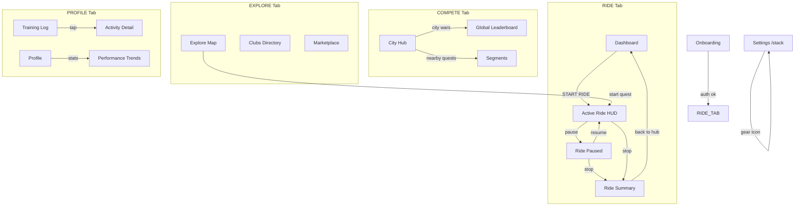

# STITCH — Screen Architecture Plan

> Proposed navigation architecture for 15 STITCH screens mapped to React Native (Expo Router).

## Navigation Architecture

```
Root (Expo Router)
├── (auth)/
│   └── onboarding            → SetupScreen
│
├── (tabs)/                   ← Bottom Tab Navigator (4 tabs)
│   │
│   ├── (ride)/               ← Tab 1: RIDE
│   │   ├── index              → RideDashboardScreen (pre-ride landing)
│   │   ├── tracking           → ActiveRideHUDScreen (full-bleed HUD)
│   │   ├── paused             → RidePausedModal (transient overlay)
│   │   └── summary/[id]       → RideSummaryScreen (post-ride)
│   │
│   ├── (compete)/            ← Tab 2: COMPETE
│   │   ├── index              → GlobalLeaderboardScreen
│   │   ├── city               → CityHubScreen
│   │   └── segments           → SegmentsScreen
│   │
│   ├── (explore)/            ← Tab 3: EXPLORE
│   │   ├── index              → ExploreMapScreen
│   │   ├── clubs              → ClubsDirectoryScreen
│   │   └── marketplace        → MarketplaceScreen (XP shop)
│   │
│   └── (profile)/            ← Tab 4: PROFILE
│       ├── index              → AthleteProfileScreen
│       ├── training           → TrainingLogScreen
│       ├── performance        → PerformanceTrendsScreen
│       └── activity/[id]      → ActivityDetailScreen
│
└── (stack)/                  ← Top-level stack (no tab bar, accessed via gear icon)
    └── settings               → SettingsScreen (full screen with own SideNav)
```

## Key Architecture Decisions

1. **4 tabs, nie 5** — TRAIN (analityka) wchodzi pod PROFILE, bo to dane osobiste zawodnika. Mniej tabów = czystszy UI mobilny.

2. **Settings jako osobny stack** — dostępny przez ⚙️ gear icon w TopAppBar (widoczny na każdym ekranie). Settings ma własny SideNav (SENSORS, POWER ZONES, GEAR GARAGE, ACHIEVEMENTS) per mockup `12-settings.html`. Nie jest podrzędny wobec żadnego taba.

3. **RIDE jako pierwszy tab** — najbardziej lewy, najważniejszy flow. Core aplikacji to jazda.

4. **Deep linking**: `/ride/summary/[id]`, `/profile/activity/[id]` umożliwiają linkowanie z powiadomień push.

5. **Transient states jako modal routes**: Ride Paused to overlay, nie pełny ekran — zachowuje kontekst mapy pod spodem.

## Tab Mapping

| Tab | Label | Icon | Screens | Flow |
|:----|:------|:-----|:--------|:-----|
| 1 | **RIDE** | `directions_bike` | Dashboard → HUD → Paused → Summary | Core cycling |
| 2 | **COMPETE** | `leaderboard` | Global LB → City Hub → Segments | Competition |
| 3 | **EXPLORE** | `map` | Explore Map → Clubs → Marketplace | Discovery |
| 4 | **PROFILE** | `person` | Profile → Training Log → Performance → Activity Detail | Athlete |

> **Settings** — dostępny z ⚙️ w TopAppBar, otwiera się jako full-screen stack (`/settings`) z własnym SideNav.

## Screen-to-File Mapping

| # | Screen | Route | File | Priority |
|:--|:-------|:------|:-----|:---------|
| F1 | Ride Dashboard | `/ride` | `screens/RideDashboardScreen.tsx` | **P0** (nowy) |
| F2 | Active Ride HUD | `/ride/tracking` | `screens/ActiveRideHUDScreen.tsx` | **P0** (refaktor TrackingScreen) |
| F3 | Ride Paused | `/ride/paused` | `screens/RidePausedScreen.tsx` | **P1** (nowy modal) |
| F4 | Ride Summary | `/ride/summary/[id]` | `screens/RideSummaryScreen.tsx` | **P0** (nowy) |
| F5 | Global Leaderboard | `/compete` | `screens/GlobalLeaderboardScreen.tsx` | **P1** (refaktor LeaderboardScreen) |
| F6 | City Hub | `/compete/city` | `screens/CityHubScreen.tsx` | **P0** (nowy) |
| F7 | Segments | `/compete/segments` | `screens/SegmentsScreen.tsx` | **P2** (nowy) |
| F8 | Explore Map | `/explore` | `screens/ExploreMapScreen.tsx` | **P2** (nowy) |
| F9 | Clubs Directory | `/explore/clubs` | `screens/ClubsDirectoryScreen.tsx` | **P2** (nowy) |
| F10 | Marketplace | `/explore/marketplace` | `screens/MarketplaceScreen.tsx` | **P1** (refaktor RewardsScreen) |
| F11 | Athlete Profile | `/profile` | `screens/AthleteProfileScreen.tsx` | **P1** (refaktor ProfileScreen) |
| F12 | Training Log | `/profile/training` | `screens/TrainingLogScreen.tsx` | **P1** (refaktor ActivitiesScreen) |
| F13 | Performance Trends | `/profile/performance` | `screens/PerformanceTrendsScreen.tsx` | **P2** (nowy) |
| F14 | Activity Detail | `/profile/activity/[id]` | `screens/ActivityDetailScreen.tsx` | **P0** (nowy) |
| F15 | Settings & Sensors | `/settings` | `screens/SettingsScreen.tsx` | **P2** (nowy, stack) |

## Implementation Phases

```
Phase 1 (MVP Redesign) — 5 P0 items:
  F1  RideDashboardScreen     NEW
  F2  ActiveRideHUDScreen     REFACTOR
  F4  RideSummaryScreen       NEW
  F6  CityHubScreen           NEW
  F14 ActivityDetailScreen    NEW

Phase 2 (Social + Shop) — 5 P1 items:
  F3  RidePausedScreen        NEW
  F5  GlobalLeaderboardScreen REFACTOR
  F10 MarketplaceScreen       REFACTOR
  F11 AthleteProfileScreen    REFACTOR
  F12 TrainingLogScreen       REFACTOR

Phase 3 (Explore + Advanced) — 5 P2 items:
  F7  SegmentsScreen          NEW
  F8  ExploreMapScreen        NEW
  F9  ClubsDirectoryScreen    NEW
  F13 PerformanceTrendsScreen NEW
  F15 SettingsScreen          NEW (stack)
```

## Navigation Flow



## Migration z obecnej struktury

```
Obecny plik                        → Nowy plik (Phase)
─────────────────────────────────────────────────────────────
TrackingScreen.tsx                 → ActiveRideHUDScreen.tsx (P0)
ActivitiesScreen.tsx               → TrainingLogScreen.tsx (P1)  [pod /profile]
LeaderboardScreen.tsx              → GlobalLeaderboardScreen.tsx (P1)
RewardsScreen.tsx                  → MarketplaceScreen.tsx (P1)
ProfileScreen.tsx                  → AthleteProfileScreen.tsx (P1)
OnboardingScreen.tsx               → SetupScreen.tsx (keep)
—                                  → RideDashboardScreen.tsx (P0) NEW
—                                  → RideSummaryScreen.tsx (P0) NEW
—                                  → ActivityDetailScreen.tsx (P0) NEW [pod /profile]
—                                  → CityHubScreen.tsx (P0) NEW
—                                  → RidePausedScreen.tsx (P1) NEW
—                                  → PerformanceTrendsScreen.tsx (P2) NEW [pod /profile]
—                                  → SegmentsScreen.tsx (P2) NEW
—                                  → ExploreMapScreen.tsx (P2) NEW
—                                  → ClubsDirectoryScreen.tsx (P2) NEW
—                                  → SettingsScreen.tsx (P2) NEW [osobny /stack]
```
