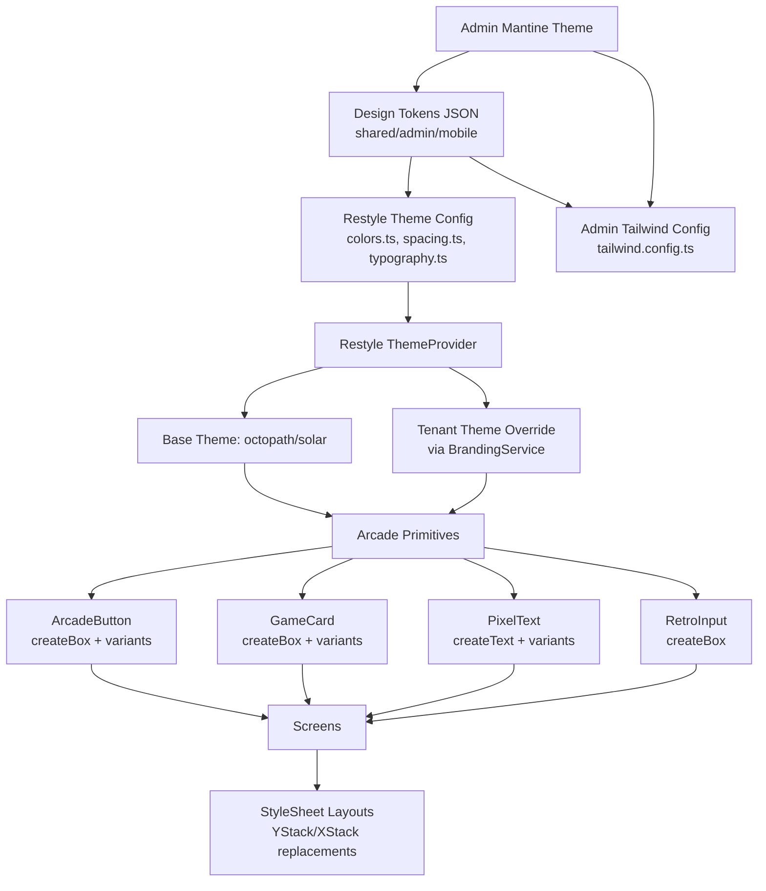
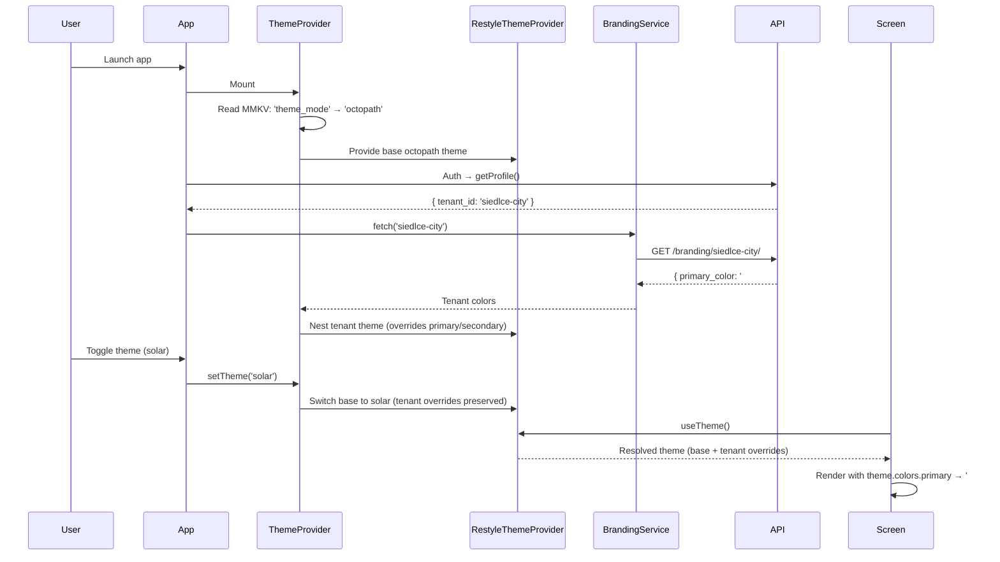
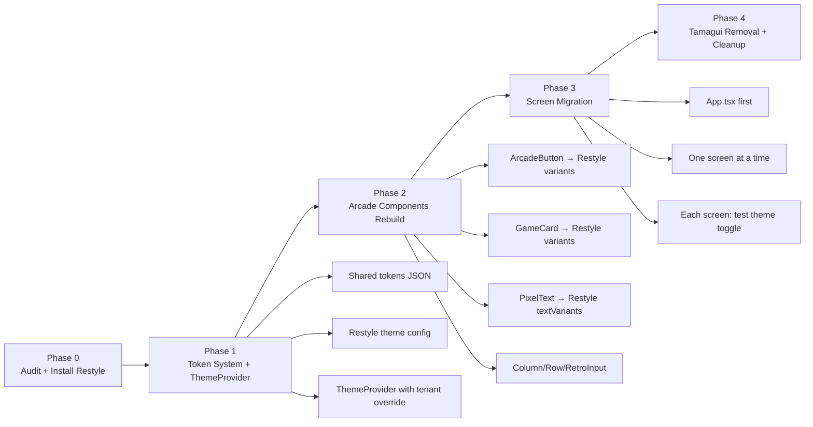
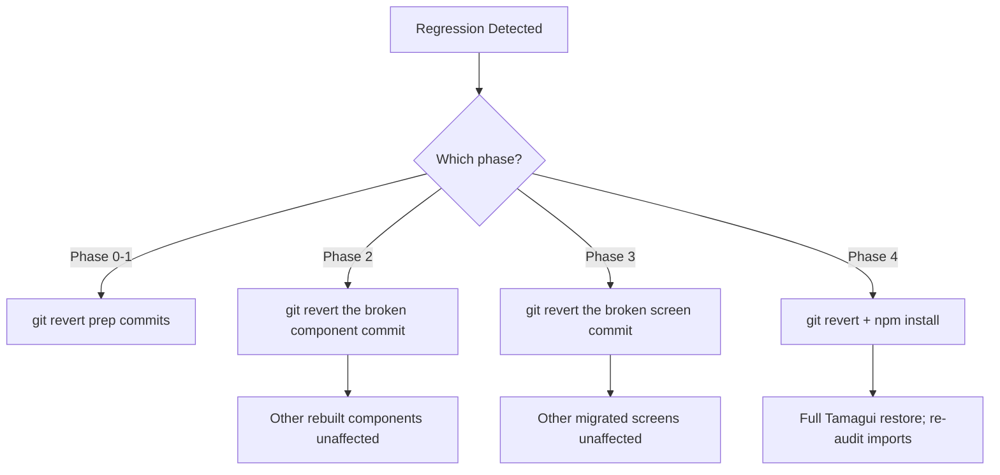
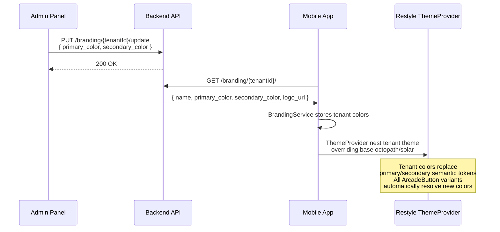

# SPORT Mobile App — UI/UX Framework Rebuild Proposal

**Date:** 2026-05-03
**Status:** Draft — For Review
**Author:** Architect Mode Analysis

---

## Table of Contents

1. [Executive Summary](#1-executive-summary)
2. [Current State Audit](#2-current-state-audit)
3. [Framework Alternatives — Ranked Comparison Matrix](#3-framework-alternatives--ranked-comparison-matrix)
4. [Deep-Dive: Each Alternative](#4-deep-dive-each-alternative)
5. [Recommendation & Rationale](#5-recommendation--rationale)
6. [Target Architecture](#6-target-architecture)
7. [Design Token System — Shared Mobile + Admin Format](#7-design-token-system--shared-mobile--admin-format)
8. [Migration Strategy & Effort Estimate](#8-migration-strategy--effort-estimate)
9. [Accessibility Plan](#9-accessibility-plan)
10. [Responsive Layout Strategy](#10-responsive-layout-strategy)
11. [White-Label Tenant Theming Flow](#11-white-label-tenant-theming-flow)
12. [Risk Register](#12-risk-register)
13. [Appendix: Color Occurrence Audit](#13-appendix-color-occurrence-audit)

---

## 1. Executive Summary

The SPORT mobile app currently uses **Tamagui 2.0.0-rc.41** solely as a thin wrapper around React Native's `View`/`Text` primitives. Of Tamagui's entire feature surface (theme variants, `styled()`, animations, compiler optimizations, media queries, SSR), **zero percent** is utilized beyond `YStack`, `XStack`, `View`, `Text`, `ScrollView`, `Input`, `Button`, `Label`, `H1`, `Paragraph`, and `Spinner`. Meanwhile, the actual visual identity — the Octopath Traveler × Metal Slug RPG aesthetic — is achieved entirely through a hand-rolled "arcade" component layer (`ArcadeButton`, `GameCard`, `PixelText`) that bakes hex colors directly into component bodies with no token indirection.

This proposal evaluates six alternative approaches and recommends **Option B: Shopify Restyle + Design Token Layer**, which provides first-class white-label theming, variant-based component APIs, accessibility primitives, and a shared token format that bridges mobile and the admin panel (Mantine v7; Tailwind CSS integration proposed as part of this migration — see Section 7.5). **Option F: react-native-unistyles** is the recommended fallback if Restyle's maintenance cadence is a concern (see Section 4.6).

---

## 2. Current State Audit

### 2.1 Tamagui Usage Inventory

| Tamagui Primitive | Files Using | Notes |
|---|---|---|
| `YStack` | 8 files | Flex column — replaceable with `<View style={...}>` |
| `XStack` | 6 files | Flex row — replaceable with `<View style={...}>` |
| `View` | 5 files | Plain RN View — identical API |
| `Text` / `TamaText` | 5 files | RN Text wrapper |
| `ScrollView` | 3 files | RN ScrollView wrapper |
| `Input` | 2 files | Only in Onboarding + App.tsx auth |
| `Button` / `TamaButton` | 1 file | HD2DButton (barely used, ArcadeButton is the real button) |
| `H1` | 2 files | Splash + App auth |
| `Label` | 1 file | Onboarding biometric step |
| `Spinner` | 0 files (imported, unused) | In App.tsx import but never rendered |
| `TamaguiProvider` | 1 file | App.tsx root |
| `useTheme()` | 4 files | TrackingScreen, OnboardingScreen, PixelStats, AdaptiveAsset |
| `styled()` | 1 file | RetroCard (barely used vs GameCard) |

**Total:** 17 files import from `'tamagui'` or use `@tamagui/config`.

### 2.2 Tamagui Config Analysis (`tamagui.config.ts`)

- Defines a pixel font (`Press Start 2P`) via `createFont` — useful but never consumed through Tamagui's `$pixel` token outside OnboardingScreen.
- Defines 27+ color tokens in `hd2dColors` and maps them to Tamagui's token system.
- Creates two themes: `octopath` (dark) and `solar` (light).
- **Only the OnboardingScreen** uses Tamagui theme tokens like `$primary`, `$color`, `$background`, `$hd2d.outlineColor`. Every other screen ignores them and hardcodes colors.
- All `radius` tokens are set to `0` (pixel-art aesthetic) — zero value from Tamagui's radius system.

### 2.3 The "Arcade" Design System (Actual UI)

The real design system is embodied in three hand-rolled components:

| Component | File | Design Pattern |
|---|---|---|
| [`ArcadeButton`](mobile/src/components/arcade/ArcadeButton.tsx:30) | `arcade/ArcadeButton.tsx` | Hardcoded variant color maps (`green`, `red`, `blue`, `gold`, `ghost`), hand-rolled 3D drop-shadow, haptic integration |
| [`GameCard`](mobile/src/components/arcade/GameCard.tsx:23) | `arcade/GameCard.tsx` | Hardcoded variant color maps (`dark`, `metal`, `parchment`, `hologram`), thick borders, inset highlight |
| [`PixelText`](mobile/src/components/arcade/PixelText.tsx:15) | `arcade/PixelText.tsx` | Wraps Tamagui `Text` with `fontFamily="$pixel"`, hardcoded default color `#F5E6CC` |

**Critical observation:** These components already use `StyleSheet`-compatible patterns. `ArcadeButton` uses RN `Pressable` directly. The only Tamagui dependency is `View` and `Text` being imported from Tamagui instead of React Native.

### 2.4 Color Duplication Audit

| Hex Color | Semantic Meaning | Occurrences (approx.) | Files |
|---|---|---|---|
| `#0B1D33` | Deep sea dark background | 15+ | App.tsx, GameCard, ProfileScreen, GameTabBar, SplashScreen, TrackingScreen |
| `#D4A373` | Octopath gold / primary accent | 20+ | App.tsx, GameCard, ProfileScreen, GameTabBar, arcade components, tamagui.config |
| `#7BA05B` | Forest green / success | 8+ | ArcadeButton, App.tsx, ProfileScreen |
| `#2B303A` | Metal/industrial gray BG | 6+ | App.tsx auth inputs, GameCard, ProfileScreen |
| `#F5E6CC` | Parchment cream text | 5+ | PixelText, App.tsx, tamagui.config |
| `#9CA3AF` | Muted gray / secondary text | 8+ | ProfileScreen, GameTabBar, tamagui.config |
| `#8B7355` | Sepia / muted gold | 5+ | ArcadeButton, GameTabBar, App.tsx, tamagui.config |
| `#000000` | Pixel black outline | 10+ | ArcadeButton, GameCard, ProfileScreen, etc. |

**Result:** If the primary brand color changes from gold to tenant-specific teal, **20+ locations must be manually updated** across 9+ files. This is the definition of a non-scalable design system.

### 2.5 Theme Switching — Broken

- `ThemeService.ts` uses `@legendapp/state` observable to store `'octopath' | 'solar'`.
- `App.tsx` passes `ThemeService.themeMode.get()` to `TamaguiProvider` `defaultTheme` prop **only at mount time** (line 341). The observable read is one-shot, not reactive.
- No component re-renders when the theme changes because no observer wraps the provider.
- Only the OnboardingScreen uses Tamagui's `useTheme()` and `$color`/`$primary` tokens. All other screens will never reflect a theme change.
- `TrackingScreen` does check `theme.name` for map style switching — this is the sole dynamic theme-aware behavior.

### 2.6 White-Label Branding — Fetched, Never Applied

- `BrandingService.fetch(tenantId)` retrieves `{ name, primary_color, secondary_color, logo_url }` from the API.
- `BrandingService.colors()` returns the colors, but **nothing calls `colors()` anywhere in the codebase.**
- The admin `WhiteLabelEngine` allows tenants to set `primary_color` and `secondary_color`, but the mobile app never overwrites its hardcoded colors with these values.
- The `design_tokens.json` file in `assets/branding/` is a static artifact that doesn't feed into any runtime system. **Note:** This file defines a different palette (cyan `#00D1FF` primary, purple `#B066FF` secondary, solar theme with `"primary": "#000000"` and `"accent": "#FF0000"` — likely placeholder values) than the Octopath gold palette used across the actual codebase. The new token system proposed in Section 7 replaces this file entirely.

### 2.7 Accessibility: Zero

A full-text search across the entire `mobile/src/` directory for `accessibilityLabel`, `accessibilityRole`, `accessibilityHint`, `accessible`, `aria-`, and `role=` returned **zero results**. Every interactive element (buttons, inputs, tabs) is invisible to screen readers.

### 2.8 Tamagui Removal Complexity

Removing Tamagui requires:
1. Uninstall `tamagui`, `@tamagui/config`, `@tamagui/babel-plugin` from `package.json`
2. Remove `@tamagui/babel-plugin` from `babel.config.js`
3. Delete `tamagui.config.ts`
4. Replace all imports from `'tamagui'` with direct React Native imports
5. Replace `YStack`/`XStack` with `<View style={styles.column}>` / `<View style={styles.row}>`
6. Replace Tamagui `Input`/`Button`/`Label` with either RN primitives or Arcade equivalents
7. Build a new theme provider to replace `TamaguiProvider`

**Estimated bundle savings:** ~150–200 KB (Tamagui core + config + babel plugin overhead).

---

## 3. Framework Alternatives — Ranked Comparison Matrix

| Criterion | Weight | A: Pure StyleSheet + Tokens | B: Shopify Restyle | C: NativeWind v4 | D: Dripsy v4 | E: Hybrid (Restyle + StyleSheet) | F: react-native-unistyles |
|---|---|---|---|---|---|---|---|
| **Theming (dark/light)** | 10 | ⭐⭐⭐ Custom hook | ⭐⭐⭐⭐⭐ Built-in `ThemeProvider` | ⭐⭐⭐⭐ `dark:` class variants | ⭐⭐⭐⭐ `useTheme()` reactive | ⭐⭐⭐⭐⭐ Restyle for themed, StyleSheet for game | ⭐⭐⭐⭐⭐ `UnistylesTheme` + reactive `useStyles()` |
| **White-label / Multi-tenant** | 10 | ⭐⭐⭐ Manual color override | ⭐⭐⭐⭐⭐ First-class `ThemeProvider` nesting | ⭐⭐⭐ Config-level `extend` | ⭐⭐⭐ Theme nesting | ⭐⭐⭐⭐⭐ Restyle's architecture is purpose-built for this | ⭐⭐⭐⭐ Nested themes (v3+), runtime overrides |
| **RPG/Pixel-art Aesthetic** | 10 | ⭐⭐⭐⭐⭐ Full control | ⭐⭐⭐⭐ Variants support pixel styles | ⭐⭐⭐ Class strings awkward for game UIs | ⭐⭐⭐ Good but less mature | ⭐⭐⭐⭐⭐ Arcade layer untouched | ⭐⭐⭐⭐ StyleSheet-based, full control |
| **Bundle Size Impact** | 7 | ⭐⭐⭐⭐⭐ 0 KB added | ⭐⭐⭐⭐ ~15 KB gzipped | ⭐⭐⭐ ~30 KB gzipped (Tailwind runtime) | ⭐⭐⭐ ~18 KB gzipped | ⭐⭐⭐⭐ ~15 KB gzipped | ⭐⭐⭐⭐⭐ ~8 KB gzipped |
| **TypeScript Support** | 8 | ⭐⭐⭐⭐ Manual types | ⭐⭐⭐⭐⭐ Auto-generates from config | ⭐⭐⭐⭐ Class strings typed | ⭐⭐⭐⭐ Good inference | ⭐⭐⭐⭐⭐ Restyle's type system | ⭐⭐⭐⭐⭐ Auto-type from theme definition |
| **Reanimated Compatibility** | 9 | ⭐⭐⭐⭐⭐ No conflicts | ⭐⭐⭐⭐⭐ No conflicts | ⭐⭐⭐⭐ Works, but class-based | ⭐⭐⭐⭐⭐ Designed for Reanimated | ⭐⭐⭐⭐⭐ No conflicts | ⭐⭐⭐⭐⭐ Designed for Reanimated + Skia |
| **Accessibility Primitives** | 8 | ⭐⭐ Manual only | ⭐⭐⭐⭐⭐ `useRestyle` auto-attaches | ⭐⭐ Manual only | ⭐⭐⭐ Basic support | ⭐⭐⭐⭐⭐ Restyle + manual | ⭐⭐ Manual only |
| **Responsive Breakpoints** | 5 | ⭐⭐⭐ Manual `useWindowDimensions` | ⭐⭐⭐⭐ Built-in breakpoints | ⭐⭐⭐⭐⭐ `sm:`, `md:`, `lg:` classes | ⭐⭐⭐⭐ Responsive arrays | ⭐⭐⭐⭐ Restyle breakpoints | ⭐⭐⭐⭐ Built-in breakpoints via `useStyles` |
| **Shared Tokens w/ Admin** | 6 | ⭐⭐⭐ JSON import | ⭐⭐⭐⭐ JSON → Restyle config | ⭐⭐⭐⭐⭐ Tailwind config sharing | ⭐⭐⭐ JSON import | ⭐⭐⭐⭐ JSON → Restyle config | ⭐⭐⭐ JSON import → Unistyles theme |
| **Learning Curve** | 4 | ⭐⭐⭐⭐⭐ Team already knows | ⭐⭐⭐⭐ Clear docs, Shopify-backed | ⭐⭐⭐ Tailwind knowledge transfers | ⭐⭐⭐ Smaller community | ⭐⭐⭐⭐ Restyle is the main learn | ⭐⭐⭐⭐ Simple API, good docs |
| **Community & Maintenance** | 6 | ⭐⭐⭐ N/A (self-maintained) | ⭐⭐⭐ Shopify, ~2.5k stars¹, last stable v2.3.0 Sep 2023 | ⭐⭐⭐⭐⭐ Massive community | ⭐⭐ Low activity (last release Q1 2025) | ⭐⭐⭐⭐ Restyle + RN community | ⭐⭐⭐⭐ Active (2024–2026), ~2.5k GitHub stars, regular releases |
| **Expo SDK 55 Compat** | 10 | ⭐⭐⭐⭐⭐ No deps | ⭐⭐⭐⭐⭐ Pure JS | ⭐⭐⭐⭐ Requires plugin | ⭐⭐⭐⭐ Compatible | ⭐⭐⭐⭐⭐ Pure JS | ⭐⭐⭐⭐⭐ Pure JS, Expo config plugin available |
| **Migration Effort (files)** | 8 | ⭐⭐⭐ 19 files + build new DS | ⭐⭐⭐⭐ 19 files + Restyle wrap | ⭐⭐ 19 files + class rewrites | ⭐⭐ 19 files + Dripsy rewrite | ⭐⭐⭐⭐ 19 files, arcade kept | ⭐⭐⭐ 19 files + Unistyles setup |

**Weighted Score (max 590):**

| Option | Score | Rank |
|---|---|---|
| **B: Shopify Restyle** | **536** | **🥇 1st** |
| E: Hybrid (Restyle + StyleSheet) | 522 | 🥈 2nd |
| F: react-native-unistyles | 505 | 🥉 3rd |
| A: Pure StyleSheet + Tokens | 457 | 4th |
| D: Dripsy v4 | 420 | 5th |
| C: NativeWind v4 | 418 | 6th |

---

> **⚠️ Note on "Shared Tokens w/ Admin" scoring:** The admin panel currently uses Mantine v7 without Tailwind CSS. The "Tailwind config sharing" scores for Options C and others represent *potential future* capability — admin Tailwind integration requires a separate migration proposal (see §8.2 note). Token sharing via JSON import works today for all options. This criterion primarily evaluates token format compatibility, not current admin integration status.

## 4. Deep-Dive: Each Alternative

### 4.1 Option A: Pure StyleSheet + Design Tokens (Custom)

**Approach:** Remove Tamagui entirely. Build a custom `ThemeContext` + `useTokens()` hook. Export a token object consumed by `StyleSheet.create()`.

```typescript
// pseudo-code — NOT an implementation recommendation
const tokens = { colors: { gold: '#D4A373', deepSea: '#0B1D33', ... }, ... };
const styles = StyleSheet.create({ container: { backgroundColor: tokens.colors.deepSea } });
```

**Pros:**
- Zero framework dependency for UI primitives.
- Maximum control over the RPG aesthetic.
- No bundle size impact (beyond token JSON).
- No risk of framework deprecation or RC instability.

**Cons:**
- Must build theme reactivity from scratch (already partially done with ThemeService + @legendapp/state).
- No built-in variant system — must hand-roll prop-to-style maps (which the Arcade system already does).
- No accessibility primitives out of the box.
- No responsive utilities.
- Harder to share token format with admin panel.
- More boilerplate for every new component.

**Verdict:** The Arcade system is already 70% of the way to this option. This is the "formalize what we have" approach. Suitable if the team wants minimal external dependencies, but leaves theming and white-labeling as manual concerns.

### 4.2 Option B: Shopify Restyle (🥇 RECOMMENDED)

**What it is:** A TypeScript-first, theme-based styling library by Shopify. Provides `createTheme`, `ThemeProvider`, `useRestyle`, `createVariant`, and `createBox`/`createText` component factories.

**Key Features:**
- `ThemeProvider` supports nesting — perfect for white-label tenant theming (wrap tenant-specific theme over base theme).
- `createVariant` generates typed variant props (e.g., `variant: 'gold' | 'ghost' | 'green'`).
- `useRestyle` hook auto-composes styles from variants, breakpoints, and theme.
- Breakpoints and responsive values built-in.
- Zero runtime cost — all style resolution happens at render via memoized style objects.
- `@shopify/restyle` is ~15 KB gzipped, no native dependencies, pure TypeScript.

**How it maps to SPORT's needs:**

| SPORT Need | Restyle Solution |
|---|---|
| Dark/light theme | `ThemeProvider` with `octopath` and `solar` themes |
| White-label tenant colors | Nested `ThemeProvider` overriding base theme colors |
| ArcadeButton variants | `createVariant({ variants: { colors: { gold: {...}, ghost: {...} } } })` |
| GameCard variants | Same variant pattern for `dark`, `metal`, `parchment`, `hologram` |
| PixelText | `createText` with `fontFamily` preset |
| Responsive layout | Restyle breakpoints: `{ phone: 0, tablet: 768 }` |
| Accessibility | Can integrate with RN's accessibility props alongside Restyle |
| Color tokens | Central `colors` object in theme config, shared with admin via JSON |

**Ideal component structure with Restyle:**

```typescript
// pseudo-code — NOT an implementation recommendation
const { colors, spacing, breakpoints, textVariants, cardVariants, buttonVariants } = theme;

const ArcadeButton = createBox(/* ... */);
// ArcadeButton accepts: variant (gold|ghost|...), size (sm|md|lg), fullWidth
// Colors resolve from theme.colors based on variant
```

### 4.3 Option C: NativeWind v4

**What it is:** Tailwind CSS for React Native. Uses className strings with a runtime style resolver.

**Pros:**
- Admin panel uses Mantine v7; Tailwind CSS integration is proposed as part of this migration (see Section 7.3), enabling a shared `tailwind.config.ts`.
- Massive ecosystem and documentation.
- `dark:` variant for theme switching.
- Responsive `sm:`/`md:`/`lg:` breakpoints.

**Cons:**
- Class string approach is awkward for highly custom game-like UIs. Example: `className="bg-[#0B1D33] border-3 border-[#D4A373]"` — still hardcodes colors in strings.
- NativeWind's runtime adds ~30 KB gzipped.
- Tailwind's utility-class philosophy clashes with the component-variant pattern (ArcadeButton has 5 named color variants, not arbitrary color classes).
- Harder to enforce design token discipline — developers can always write arbitrary `bg-[#xyz]`.
- Theme switching via `dark:` requires class toggling, not reactive token resolution.
- Less natural fit for white-label tenant theming (would need CSS variable injection).

**Verdict:** Great for conventional apps, awkward for a pixel-art game aesthetic. The admin panel's Tailwind usage doesn't translate well to mobile for this specific UI style.

### 4.4 Option D: Dripsy v4

**What it is:** A theme-based UI library for React Native, similar philosophy to Restyle but smaller community.

**Pros:**
- Theme-based with responsive arrays.
- Works with Reanimated.
- Lightweight (~18 KB).

**Cons:**
- **Low maintenance activity** — last significant release was Q1 2025, repository has stale issues.
- Smaller community = less support, fewer examples.
- White-label theming possible but less first-class than Restyle.
- Risk of abandonment for a production app.

**Verdict:** Right philosophy, wrong maturity level. Not recommended for a production app with multi-tenant requirements.

### 4.5 Option E: Hybrid (Restyle + StyleSheet for Game UI)

**Approach:** Use Restyle for theming, variants, breakpoints, and the token system. Keep the Arcade layer (`ArcadeButton`, `GameCard`, `PixelText`) with their custom rendering logic (3D shadows, haptics) but feed them tokens from Restyle's theme instead of hardcoded colors. Use raw `StyleSheet.create()` for layout containers where Restyle's `createBox` would be overkill.

**This is essentially Option B with an explicit philosophy:** Restyle owns the token system and themed component API. The arcade components are rebuilt on top of Restyle's primitives. Utility layouts (flex rows, scroll containers) can use either Restyle `createBox` or plain `StyleSheet` — team decides per-component.

**Verdict:** The pragmatic sweet spot. Restyle provides what Tamagui was supposed to provide (theme system, variants, breakpoints) without the bloat, while the established Arcade aesthetic is preserved and tokenized.

### 4.6 Option F: react-native-unistyles

**What it is:** A modern, actively maintained (2024–2026) theming library for React Native. Provides `UnistylesTheme`, `useStyles()` hook with reactive theme resolution, nested theme support (v3+), and runtime theme overrides — all with full TypeScript inference.

**Key Features:**
- `useStyles()` hook returns memoized `StyleSheet` styles keyed to the active theme — zero runtime style recalculation.
- Nested `UnistylesTheme` providers for cascading overrides (tenant theme over base theme).
- Built-in breakpoints and dark/light mode detection.
- Plugin system for Expo and Reanimated integration.
- ~2.5k GitHub stars, regular releases, active Discord community.

**How it maps to SPORT's needs:**

| SPORT Need | Unistyles Solution |
|---|---|
| Dark/light theme | `UnistylesTheme` with `octopath` and `solar` themes |
| White-label tenant colors | Nested `UnistylesTheme` overriding base theme values at runtime |
| ArcadeButton variants | Variant styles defined in `useStyles()` callback, keyed by theme |
| GameCard variants | Same pattern — variant-specific styles keyed to active theme |
| PixelText | StyleSheet-based, font family from theme |
| Responsive layout | Built-in breakpoints in `useStyles()` |
| Color tokens | Central theme definition imported from shared tokens JSON |

**Pros:**
- Actively maintained with regular releases (unlike Restyle's 2.5-year gap).
- Familiar `StyleSheet.create()`-like API — minimal learning curve.
- Excellent TypeScript support with auto-complete from theme definition.
- Smallest bundle impact: ~8 KB gzipped.
- Nested theme providers handle white-labeling cleanly.
- Designed for Reanimated and Expo compatibility.

**Cons:**
- Smaller ecosystem than Tailwind/NativeWind.
- No accessibility primitives built-in (manual only — same as current state).
- Nested theme API (v3+) is relatively new; less battle-tested than Restyle's `ThemeProvider` nesting.
- Community is smaller than Restyle's Shopify backing, though more active in release cadence.
- Shared token consumption requires manual JSON import mapping (no auto-config).

**Verdict:** A strong contender that scores well on theming, bundle size, TypeScript, and maintenance activity. Falls slightly behind Restyle on white-label maturity (nested themes are newer) and accessibility tooling. If Restyle's maintenance hiatus is a dealbreaker for the team, Unistyles is the recommended alternative. Ranked 🥉 3rd overall.

---

## 5. Recommendation & Rationale

### 🥇 Primary Recommendation: **Shopify Restyle** (Option B/E)

**Rationale:**

1. **Purpose-built for white-label theming.** Restyle's `ThemeProvider` nesting model is exactly what SPORT needs: a base theme (Octopath dark / Solar light), overridden by a tenant theme (`BrandingService.colors()` → theme overrides). No other library handles nested theme overrides as cleanly.

2. **Variant system maps directly to arcade components.** `ArcadeButton`'s five color variants (`green`, `red`, `blue`, `gold`, `ghost`) become Restyle `colorVariants`. `GameCard`'s four material variants (`dark`, `metal`, `parchment`, `hologram`) become Restyle `cardVariants`. `PixelText` maps to Restyle `textVariants`. This is not a rewrite — it's a formalization of patterns already in use.

3. **TypeScript auto-completion.** Restyle generates types from the theme config. Developers get autocomplete for `variant="gold"` and catch invalid variants at compile time — unlike the current hand-rolled maps.

4. **Minimal bundle impact.** ~15 KB gzipped, pure JS, no native modules, no build-time compiler. Drops Tamagui's ~150 KB overhead for a **net reduction of ~135 KB**.²

5. **Shopify-backed longevity.** Maintained by a company with a significant React Native investment. The stable v2 API is functionally complete with a small surface area (~10 exports, pure TypeScript). While release cadence has slowed (v2.3.0 Sep 2023), the simplicity of the codebase makes vendoring a viable long-term fallback — see Risk Register §12.

6. **Expo SDK 55 compatible.** Pure JS, no native linking, works with Expo's managed workflow without custom dev clients.

7. **Accessibility path.** While Restyle doesn't auto-inject accessibility props, its typed component factories make it straightforward to add `accessibilityLabel`/`accessibilityRole` as required props in wrapper components.

### Runner-Up: Pure StyleSheet + Tokens (Option A)

Acceptable if the team has strong objections to any external UI framework dependency. However, it defers solving white-label theming, variant type-safety, and responsive breakpoints to manual implementation — effectively rebuilding a subset of Restyle.

### Alternative: react-native-unistyles (Option F)

If Restyle's 2.5-year maintenance gap is a blocking concern, Unistyles is the recommended fallback. It offers comparable theming capabilities with a smaller bundle footprint (~8 KB vs ~15 KB) and active maintenance. The trade-off is less battle-tested nested theme support for white-labeling (v3+ feature) and no built-in accessibility primitives. Ranked 🥉 3rd in weighted scoring.

### Not Recommended: NativeWind, Dripsy, Tamagui (keep)

- **NativeWind:** Clashes with the pixel-art aesthetic; class strings don't tokenize well.
- **Dripsy:** Maintenance risk too high for production.
- **Keep Tamagui:** Dead weight at RC version. No justification.

---

## 6. Target Architecture

### 6.1 Component Dependency Graph



### 6.2 Directory Structure (Target)

```
mobile/
├── src/
│   ├── theme/                    # NEW — Design token system
│   │   ├── tokens/
│   │   │   ├── colors.ts         # All color tokens, semantic + primitive
│   │   │   ├── spacing.ts        # 4px grid spacing scale
│   │   │   ├── typography.ts     # Font families, sizes, line heights
│   │   │   ├── borders.ts        # Pixel-art border widths, radii (all 0)
│   │   │   └── shadows.ts        # Hard pixel shadows (offset, no blur)
│   │   ├── themes/
│   │   │   ├── base.ts           # Base Restyle theme (colors + spacing + textVariants + breakpoints)
│   │   │   ├── octopath.ts       # Dark theme values
│   │   │   └── solar.ts          # Light theme values
│   │   ├── ThemeProvider.tsx     # Wraps Restyle ThemeProvider + tenant override logic
│   │   ├── useThemeMode.ts       # Reactive hook for octopath/solar switching
│   │   └── types.ts             # Generated Restyle theme types
│   │
│   ├── components/
│   │   ├── arcade/               # REFACTORED — consume tokens from theme
│   │   │   ├── ArcadeButton.tsx  # Restyle createBox + buttonVariants
│   │   │   ├── GameCard.tsx      # Restyle createBox + cardVariants
│   │   │   └── PixelText.tsx     # Restyle createText + textVariants
│   │   ├── layout/               # NEW — utility layout primitives
│   │   │   ├── Column.tsx        # Replaces YStack
│   │   │   ├── Row.tsx           # Replaces XStack
│   │   │   └── ScrollContainer.tsx
│   │   ├── inputs/               # NEW — theme-aware inputs
│   │   │   └── RetroInput.tsx    # Replaces Tamagui Input
│   │   └── ... (existing components: SplashScreen, GameHUD, etc.)
│   │
│   ├── services/
│   │   ├── ThemeService.ts       # REFACTORED — uses Restyle's useTheme + tenant override
│   │   └── BrandingService.ts    # REFACTORED — returns Restyle theme partial
│   │
│   └── screens/                  # REFACTORED — colors from theme, not hardcoded
│       ├── TrackingScreen.tsx
│       ├── ProfileScreen.tsx
│       ├── ...
│
├── tamagui.config.ts             # DELETED
├── App.tsx                       # REFACTORED — ThemeProvider replaces TamaguiProvider
└── babel.config.js               # Tamagui plugin removed

admin/
├── src/
│   └── theme/
│       ├── index.ts              # REFACTORED — imports from shared tokens
│       └── globals.css           # REFACTORED — CSS custom properties from tokens
│
└── tailwind.config.ts            # NEW/REFACTORED — extends shared tokens

shared/                           # NEW — platform-agnostic design tokens
└── tokens/
    ├── colors.json               # Single source of truth for all colors
    ├── spacing.json              # 4px grid
    ├── typography.json           # Font config (mobile + web have different overrides)
    └── build.ts                  # Optional script to generate platform-specific configs
```

### 6.3 Data Flow: Theme Resolution



---

## 7. Design Token System — Shared Mobile + Admin Format

### 7.1 Token Categories

The token system uses a three-tier hierarchy:

1. **Primitive Tokens** — raw values (e.g., `goldAmber: '#D4A373'`)
2. **Semantic Tokens** — purpose-mapped values (e.g., `primary: '{goldAmber}'`)
3. **Component Tokens** — component-specific values (e.g., `button.gold.background: '{primary}'`)

### 7.2 Relationship to Existing `design_tokens.json`

The existing `assets/branding/design_tokens.json` defines a different color palette (cyan `#00D1FF` primary, purple `#B066FF` secondary) than the Octopath gold palette actually used across the mobile codebase (as audited in Section 2.4 and Appendix §13). Its solar theme contains placeholder values (`"primary": "#000000"`, `"accent": "#FF0000"`) that would produce broken light-mode visuals. **The new token system defined below completely replaces this file.** The old file will be archived/removed in Phase 4 cleanup.

### 7.3 Shared Token Format (`shared/tokens/colors.json`)

This JSON file is the single source of truth. Both mobile (Restyle) and admin (Mantine; Tailwind CSS integration proposed below) consume it.

```jsonc
{
  "$schema": "./token-schema.json",
  "version": "1.0.0",
  "colors": {
    // ── Primitive Palette ──
    "primitive": {
      "goldAmber":    { "value": "#D4A373", "description": "Octopath gold — primary accent" },
      "goldLight":    { "value": "#EDD9B0", "description": "Bright gold highlight" },
      "forestGreen":  { "value": "#7BA05B", "description": "Soft forest green — success/growth" },
      "parchment":    { "value": "#2D2418", "description": "Dark warm brown background" },
      "deepBrown":    { "value": "#1A1410", "description": "Deeper shadow brown" },
      "panel":        { "value": "#3D3020", "description": "Surface brown for cards/panels" },
      "deepSea":      { "value": "#0B1D33", "description": "Deep sea blue — dark game BG" },
      "industrial":   { "value": "#4A4A4A", "description": "Metal Slug grey" },
      "metalGray":    { "value": "#2B303A", "description": "Industrial UI gray" },
      "pixelBlack":   { "value": "#000000", "description": "Pure black for outlines" },
      "cream":        { "value": "#F5E6CC", "description": "Warm parchment cream text" },
      "sepia":        { "value": "#C8B098", "description": "Bronze/sepia secondary — lightened from #8B7355 to exceed WCAG AA 4.5:1 (~5.5:1) on dark backgrounds with safe margin for pixel font rendering" },
      "woodBorder":   { "value": "#5C4020", "description": "Dark wood outline" },
      "silver":       { "value": "#A0A0A0", "description": "Silver podium/neutral" },
      "warning":      { "value": "#E8A840", "description": "Amber warning" },
      "error":        { "value": "#CC4444", "description": "Soft red error" },
      "solarCream":     { "value": "#FFF8E7", "description": "Solar mode background" },
      "solarBrown":     { "value": "#2D2418", "description": "Solar mode text — intentionally same hex as 'parchment' primitive (both represent dark brown); separate token names preserve semantic clarity: parchment = warm surface tone, solarBrown = light-theme foreground" },
      "hologramCyan":   { "value": "#00D1FF", "description": "Holographic cyan for card effects" },
      "parchmentLight": { "value": "#E2D4B7", "description": "Light parchment paper tone (card BG)" }
    },

    // ── Semantic Tokens (light/dark agnostic) ──
    "semantic": {
      "primary":      { "value": "{primitive.goldAmber}", "description": "Primary brand/accent color" },
      "secondary":    { "value": "{primitive.sepia}", "description": "Secondary brand color" },
      "success":      { "value": "{primitive.forestGreen}", "description": "Success/positive action" },
      "warning":      { "value": "{primitive.warning}", "description": "Warning/caution" },
      "error":        { "value": "{primitive.error}", "description": "Error/destructive action" },
      "info":         { "value": "{primitive.silver}", "description": "Informational/neutral" }
    },

    // ── Theme-Specific Tokens ──
    "octopath": {
      "background":         { "value": "{primitive.deepSea}", "description": "Main BG" },
      "backgroundStrong":   { "value": "{primitive.parchment}", "description": "Elevated surface" },
      "surface":            { "value": "{primitive.metalGray}", "description": "Card/panel surface" },
      "text":               { "value": "{primitive.cream}", "description": "Primary text" },
      "textMuted":          { "value": "{primitive.sepia}", "description": "Secondary text" },
      "textInverse":        { "value": "{primitive.pixelBlack}", "description": "Text on gold" },
      "border":             { "value": "{primitive.goldAmber}", "description": "Primary border" },
      "borderMuted":        { "value": "{primitive.woodBorder}", "description": "Subtle border" },
      "outline":            { "value": "{primitive.pixelBlack}", "description": "Pixel art outline" },
      "buttonGoldBg":       { "value": "{primitive.goldAmber}", "description": "Gold button BG" },
      "buttonGoldText":     { "value": "{primitive.pixelBlack}", "description": "Gold button text" },
      "buttonGreenBg":      { "value": "{primitive.forestGreen}", "description": "Green button BG" },
      "buttonGreenText":    { "value": "#FFFFFF", "description": "Green button text" },
      "buttonRedBg":        { "value": "{primitive.error}", "description": "Red button BG" },
      "buttonRedText":      { "value": "#FFFFFF", "description": "Red button text" },
      "buttonBlueBg":       { "value": "#3B82F6", "description": "Blue button BG" },
      "buttonBlueText":     { "value": "#FFFFFF", "description": "Blue button text" },
      "buttonGhostText":    { "value": "{primitive.goldAmber}", "description": "Ghost button text" },
      "cardDarkBg":         { "value": "{primitive.deepSea}", "description": "Dark card BG" },
      "cardMetalBg":        { "value": "{primitive.metalGray}", "description": "Metal card BG" },
      "cardParchmentBg":    { "value": "{primitive.parchmentLight}", "description": "Parchment card BG" },
      "cardHologramBg":     { "value": "{primitive.deepSea}", "description": "Hologram card BG" },
      "cardHologramBorder": { "value": "{primitive.hologramCyan}", "description": "Hologram card border" },
      "tabBarBg":           { "value": "{primitive.deepSea}", "description": "Tab bar background" },
      "tabBarBorder":       { "value": "{primitive.goldAmber}", "description": "Tab bar top border" },
      "tabActiveText":      { "value": "{primitive.goldAmber}", "description": "Active tab text" },
      "tabInactiveText":    { "value": "{primitive.sepia}", "description": "Inactive tab text" }
    },

    "solar": {
      "background":         { "value": "{primitive.solarCream}", "description": "Main BG" },
      "backgroundStrong":   { "value": "#FFF0D4", "description": "Elevated surface" },
      "surface":            { "value": "#F5E6CC", "description": "Card/panel surface" },
      "text":               { "value": "{primitive.solarBrown}", "description": "Primary text" },
      "textMuted":          { "value": "#6B4226", "description": "Secondary text" },
      "textInverse":        { "value": "#FFFFFF", "description": "Text on dark" },
      "border":             { "value": "#6B4226", "description": "Primary border" },
      "borderMuted":        { "value": "{primitive.pixelBlack}", "description": "Subtle border" },
      "outline":            { "value": "{primitive.pixelBlack}", "description": "Pixel art outline" },
      "buttonGoldBg":       { "value": "#8B6914", "description": "Gold button BG" },
      "buttonGoldText":     { "value": "{primitive.pixelBlack}", "description": "Gold button text" },
      "buttonGreenBg":      { "value": "#3D6B2E", "description": "Green button BG" },
      "buttonGreenText":    { "value": "#FFFFFF", "description": "Green button text" },
      "buttonRedBg":        { "value": "#AA0000", "description": "Red button BG" },
      "buttonRedText":      { "value": "#FFFFFF", "description": "Red button text" },
      "buttonBlueBg":       { "value": "#1E3A8A", "description": "Blue button BG" },
      "buttonBlueText":     { "value": "#FFFFFF", "description": "Blue button text" },
      "buttonGhostText":    { "value": "#6B4226", "description": "Ghost button text" },
      "cardDarkBg":         { "value": "{primitive.solarBrown}", "description": "Dark card BG" },
      "cardMetalBg":        { "value": "#E2D4B7", "description": "Metal card BG" },
      "cardParchmentBg":    { "value": "{primitive.solarCream}", "description": "Parchment card BG" },
      "cardHologramBg":     { "value": "{primitive.solarBrown}", "description": "Hologram card BG" },
      "cardHologramBorder": { "value": "{primitive.hologramCyan}", "description": "Hologram card border" },
      "tabBarBg":           { "value": "{primitive.solarCream}", "description": "Tab bar background" },
      "tabBarBorder":       { "value": "{primitive.solarBrown}", "description": "Tab bar top border" },
      "tabActiveText":      { "value": "{primitive.solarBrown}", "description": "Active tab text" },
      "tabInactiveText":    { "value": "#8B7355", "description": "Inactive tab text" }
    }
  },

  "spacing": {
    "unit": 4,
    "scale": {
      "0":  { "value": 0 },
      "1":  { "value": 4 },
      "2":  { "value": 8 },
      "3":  { "value": 12 },
      "4":  { "value": 16 },
      "5":  { "value": 20 },
      "6":  { "value": 24 },
      "8":  { "value": 32 },
      "10": { "value": 40 },
      "12": { "value": 48 }
    }
  },

  "typography": {
    "fontFamilies": {
      "pixel": { "value": "Press Start 2P", "category": "display" },
      "body":  { "value": "System", "category": "sans-serif" }
    },
    "fontSizes": {
      "xs":   { "value": 8 },
      "sm":   { "value": 10 },
      "md":   { "value": 12 },
      "lg":   { "value": 14 },
      "xl":   { "value": 18 },
      "2xl":  { "value": 24 },
      "3xl":  { "value": 32 },
      "4xl":  { "value": 36 }
    }
  },

  "borders": {
    "width": {
      "thin":  { "value": 1 },
      "medium": { "value": 2 },
      "thick": { "value": 3 }
    },
    "radius": {
      "none": { "value": 0 }
    }
  },

  "shadows": {
    "pixelButton": {
      "shadowColor": "{primitive.pixelBlack}",
      "shadowOffset": { "width": 4, "height": 4 },
      "shadowOpacity": 1,
      "shadowRadius": 0,
      "elevation": 4
    },
    "pixelCard": {
      "shadowColor": "{primitive.pixelBlack}",
      "shadowOffset": { "width": 6, "height": 6 },
      "shadowOpacity": 1,
      "shadowRadius": 0,
      "elevation": 8
    }
  }
}
```

### 7.4 Token Reference Resolution (`build.ts`)

The `colors.json` file in Section 7.3 uses reference syntax (`{primitive.goldAmber}`, `{primitive.deepSea}`) to avoid duplicating hex values. These references cannot be resolved at runtime by consumers (Restyle, Mantine, Tailwind) — they must be resolved at build time into flat, platform-specific config files.

#### 7.4.1 Build Script: `shared/tokens/build.ts`

```typescript
#!/usr/bin/env ts-node
// shared/tokens/build.ts — resolves {primitive.*} references → platform configs
import * as fs from 'fs';
import * as path from 'path';

interface TokenEntry { value: string | number; description: string; }
interface TokenMap { [key: string]: TokenEntry; }
interface ColorsJSON {
  colors: {
    primitive: TokenMap;
    semantic: TokenMap;
    octopath: TokenMap;
    solar: TokenMap;
  };
  [key: string]: unknown;
}

const tokens: ColorsJSON = JSON.parse(
  fs.readFileSync(path.join(__dirname, 'colors.json'), 'utf-8')
);

/** Resolve {primitive.xxx} references → their actual hex values */
function resolve(value: string, primitives: TokenMap): string {
  return value.replace(/\{primitive\.(\w+)\}/g, (_, key) => {
    if (!primitives[key]) {
      throw new Error(`Unresolved token reference: {primitive.${key}}`);
    }
    return String(primitives[key].value);
  });
}

/** Flatten a theme section (e.g. octopath) into { [tokenName]: hexString } */
function flattenTheme(theme: TokenMap, primitives: TokenMap): Record<string, string> {
  const result: Record<string, string> = {};
  for (const [key, entry] of Object.entries(theme)) {
    result[key] = resolve(String(entry.value), primitives);
  }
  return result;
}

const { primitive, semantic, octopath, solar } = tokens.colors;

const resolvedSemantic: Record<string, string> = {};
for (const [key, entry] of Object.entries(semantic)) {
  resolvedSemantic[key] = resolve(String(entry.value), primitive);
}

const output = {
  primitive: Object.fromEntries(
    Object.entries(primitive).map(([k, v]) => [k, v.value])
  ),
  semantic: resolvedSemantic,
  octopath: flattenTheme(octopath, primitive),
  solar: flattenTheme(solar, primitive),
};

// Write Restyle-compatible TypeScript config
const restyleOutput = `// AUTO-GENERATED by shared/tokens/build.ts — DO NOT EDIT
// Run: npx ts-node shared/tokens/build.ts
export const colors = ${JSON.stringify(output, null, 2)} as const;
`;
fs.writeFileSync(path.join(__dirname, 'generated', 'restyle-colors.ts'), restyleOutput);

// Write flat JSON for Tailwind/Mantine consumption
fs.writeFileSync(
  path.join(__dirname, 'generated', 'colors-flat.json'),
  JSON.stringify(output, null, 2)
);

console.log('✅ Token resolution complete → shared/tokens/generated/');
```

#### 7.4.2 Integration into Development Workflow

| Step | When | Command |
|---|---|---|
| Token resolution | After editing `colors.json` | `npx ts-node shared/tokens/build.ts` |
| Verification | CI / pre-commit hook | `npx ts-node shared/tokens/build.ts --check` (exit 1 if `generated/` is stale) |

Add to `package.json` scripts:
```json
{
  "scripts": {
    "tokens:build": "npx ts-node shared/tokens/build.ts",
    "tokens:check": "npx ts-node shared/tokens/build.ts --check"
  }
}
```

#### 7.4.3 Consumer Import After Resolution

After running `tokens:build`, consumers import from `shared/tokens/generated/` — never from the raw `colors.json` directly:

```typescript
// Mobile (Restyle) — imports resolved, typed constants
import { colors } from '@tokens/generated/restyle-colors';

export const octopathTheme = {
  colors: {
    background: colors.octopath.background,    // → '#0B1D33'
    text: colors.octopath.text,                // → '#F5E6CC'
    primary: colors.semantic.primary,          // → '#D4A373'
    // ... all values resolved, no {primitive.*} strings
  },
};
```

```javascript
// Admin (Tailwind) — imports resolved flat JSON
const { octopath } = require('@tokens/generated/colors-flat.json');
module.exports = {
  theme: {
    extend: {
      colors: {
        sport: octopath,  // { background: '#0B1D33', text: '#F5E6CC', ... }
      },
    },
  },
};
```

#### 7.4.4 Generated Files (Committed to Version Control)

```
shared/
└── tokens/
    ├── colors.json              # Source of truth (with {primitive.*} references)
    ├── build.ts                 # Resolution script
    └── generated/               # COMMITTED — platform consumers read these
        ├── restyle-colors.ts    # Resolved TypeScript constants for Restyle
        └── colors-flat.json      # Resolved flat JSON for Tailwind/Mantine
```

> **Rationale for committing generated files:** Ensures that CI, editors, and platform consumers don't need to run `build.ts` to function. The build script is only run when `colors.json` changes. Stale output is caught by `tokens:check` in CI.

### 7.5 Cross-Platform Token Consumption

> **Important:** Consumers import from `shared/tokens/generated/` (resolved output of `build.ts`), not from the raw `colors.json` which contains unresolved `{primitive.*}` reference strings. See Section 7.4 for the resolution pipeline.

**Mobile (Restyle):**
```typescript
// mobile/src/theme/themes/octopath.ts — reads from resolved generated tokens
import { colors } from '@tokens/generated/restyle-colors';
// or with relative path: import { colors } from '../../../../shared/tokens/generated/restyle-colors';

export const octopathTheme = {
  colors: {
    background: colors.octopath.background,    // '#0B1D33' (resolved)
    text: colors.octopath.text,                // '#F5E6CC' (resolved)
    primary: colors.semantic.primary,           // '#D4A373' (resolved)
    // ... all values are flat hex strings, no .value indirection needed
  },
  // ...
};
```

**Admin (Tailwind):**
```javascript
// admin/tailwind.config.ts
const { octopath, solar, primitive } = require('@tokens/generated/colors-flat.json');

module.exports = {
  theme: {
    extend: {
      colors: {
        sport: {
          gold: primitive.goldAmber,
          deepSea: primitive.deepSea,
          background: octopath.background,
          text: octopath.text,
          // ... all values resolved
        }
      }
    }
  }
};
```

**Admin (Mantine):**
```typescript
// admin/src/theme/index.ts
import flatTokens from '@tokens/generated/colors-flat.json';

export const theme = createTheme({
  primaryColor: 'sport-gold',
  colors: {
    'sport-gold': [
      flatTokens.primitive.goldLight,
      flatTokens.primitive.goldAmber,
      // ... 10 shades for Mantine
    ]
  }
});
```

### 7.6 Workspace Configuration for Shared Tokens

The `shared/tokens/` directory sits at the project root while consumers are in `mobile/src/` and `admin/src/`. To avoid fragile relative paths (e.g., `'../../../../shared/tokens/colors.json'`), configure the following:

#### 7.6.1 TypeScript Path Aliases

Add path aliases to each consumer's `tsconfig.json`:

```jsonc
// mobile/tsconfig.json
{
  "compilerOptions": {
    "paths": {
      "@tokens/*": ["../shared/tokens/*"]
    }
  }
}

// admin/tsconfig.app.json
{
  "compilerOptions": {
    "paths": {
      "@tokens/*": ["../shared/tokens/*"]
    }
  }
}
```

Then import cleanly: `import tokens from '@tokens/colors.json';`

#### 7.6.2 Metro Configuration (Mobile)

React Native's Metro bundler does not resolve files outside the project root by default. Configure `watchFolders` and `extraNodeModules` in `metro.config.js`. **Important:** Expo projects must merge with the default Metro config — do not export a plain object directly:

```javascript
// mobile/metro.config.js
const { getDefaultConfig } = require('@expo/metro-config');
const path = require('path');

const defaultConfig = getDefaultConfig(__dirname);

module.exports = {
  ...defaultConfig,
  watchFolders: [
    ...defaultConfig.watchFolders,
    path.resolve(__dirname, '../shared'),
  ],
  resolver: {
    ...defaultConfig.resolver,
    extraNodeModules: {
      ...defaultConfig.resolver.extraNodeModules,
      '@tokens': path.resolve(__dirname, '../shared/tokens'),
    },
  },
};
```

#### 7.6.3 Vite Configuration (Admin)

The admin panel uses Vite as its bundler. Like Metro, Vite does not resolve the `@tokens` path alias from `tsconfig.json` alone — add `resolve.alias` to `admin/vite.config.ts`:

```typescript
// admin/vite.config.ts
import { defineConfig } from 'vite';
import react from '@vitejs/plugin-react';
import path from 'path';

export default defineConfig({
  resolve: {
    alias: {
      '@tokens': path.resolve(__dirname, '../shared/tokens'),
    },
  },
  plugins: [react()],
  // ... existing config
});
```

#### 7.6.4 JSON Module Resolution

Ensure `resolveJsonModule` is enabled in `tsconfig.json` (already standard in Expo + Vite projects):

```jsonc
{
  "compilerOptions": {
    "resolveJsonModule": true
  }
}
```

#### 7.6.5 Monorepo Consideration

If the project later adopts npm/yarn workspaces or Turborepo, the `shared/` directory should become a workspace package (`packages/tokens/`) with its own `package.json` exporting the token files. This is optional for the initial migration but should be noted for future scalability.

---

## 8. Migration Strategy & Effort Estimate

### 8.1 Phase Breakdown

#### Phase 0: Preparation (no code changes to existing files)

| Step | Action | Files |
|---|---|---|
| 0.1 | Create `shared/tokens/` directory with `colors.json` | 1 new |
| 0.2 | Extract all hardcoded colors from codebase into token definitions | 1 file (audit) |
| 0.3 | Install `@shopify/restyle` (no conflicts with Tamagui) | `package.json` |
| 0.4 | Document current Tamagui API surface used (this proposal) | — |
| 0.5 | Audit existing `assets/branding/design_tokens.json` — reconcile colors against Appendix §13 audit; mark for replacement | 1 file |

#### Phase 1: Token System + Theme Provider

| Step | Action | Files Touched |
|---|---|---|
| 1.1 | Create `src/theme/tokens/` — `colors.ts`, `spacing.ts`, `typography.ts`, `borders.ts`, `shadows.ts` | 5 new |
| 1.2 | Create `src/theme/themes/base.ts` — Restyle `createTheme` with shared tokens | 1 new |
| 1.3 | Create `src/theme/themes/octopath.ts` — dark theme values | 1 new |
| 1.4 | Create `src/theme/themes/solar.ts` — light theme values | 1 new |
| 1.5 | Create `src/theme/ThemeProvider.tsx` — wraps Restyle `ThemeProvider` + `BrandingService` integration + MMKV persistence | 1 new |
| 1.6 | Create `src/theme/useThemeMode.ts` — reactive hook replacing `ThemeService` | 1 new |
| 1.7 | Refactor `ThemeService.ts` → delegate to Restyle (or deprecate) | 1 modify |
| 1.8 | Wire tenant branding into theme overrides in `BrandingService.ts` | 1 modify |

**Phase 1 Testing Checkpoint:**
| Test | Description |
|---|---|
| Unit: `ThemeProvider` | Verify tenant theme overrides cascade correctly to `useTheme()` output for all semantic tokens |
| Unit: `useThemeMode` | Verify MMKV persistence: write `'solar'`, kill app, relaunch → theme is `'solar'` |
| Unit: `BrandingService` | Mock API response `{ primary_color: '#FF0000' }` → verify `ThemeProvider` resolves `colors.primary` as `'#FF0000'` |
| Integration: Base theme | Render a test component with `useTheme()` → assert `colors.background` matches octopath deep sea hex |
| Lint: ESLint `no-restricted-imports` | Add rule blocking `from 'tamagui'` (except aliased `useTamaguiTheme`) to prevent accidental old imports |

#### Phase 2: Arcade Component Rebuild

| Step | Action | Files Touched |
|---|---|---|
| 2.1 | Rewrite `ArcadeButton.tsx` — use Restyle `createBox` + `buttonVariants`, colors from theme | 1 modify |
| 2.2 | Rewrite `GameCard.tsx` — use Restyle `createBox` + `cardVariants`, colors from theme | 1 modify |
| 2.3 | Rewrite `PixelText.tsx` — use Restyle `createText` + `textVariants`, colors from theme | 1 modify |
| 2.4 | Create `src/components/layout/Column.tsx` — replaces YStack | 1 new |
| 2.5 | Create `src/components/layout/Row.tsx` — replaces XStack | 1 new |
| 2.6 | Create `src/components/inputs/RetroInput.tsx` — replaces Tamagui Input | 1 new |
| 2.7 | Rewrite `RetroCard.tsx` — remove Tamagui `styled()`, use Restyle createBox or deprecate in favor of GameCard | 1 modify |
| 2.8 | Rewrite `HD2DButton.tsx` — remove Tamagui dependency, delegate to ArcadeButton or deprecate | 1 modify |

**Phase 2 Testing Checkpoint:**
| Test | Description |
|---|---|
| Snapshot: `ArcadeButton` | Render each variant (`gold`, `green`, `red`, `blue`, `ghost`) in both octopath and solar themes → visual snapshot comparison |
| Snapshot: `GameCard` | Render each variant (`dark`, `metal`, `parchment`, `hologram`) in both themes |
| Snapshot: `PixelText` | Render with various sizes (`sm`, `md`, `lg`, `xl`) and both default and muted colors |
| Unit: `Column`/`Row` | Verify flex direction and spacing props produce correct RN `View` styles |
| Unit: `RetroInput` | Verify focus/blur border color resolves from theme |

#### Phase 3: Screen Migration

| Step | Action | Files Touched |
|---|---|---|
| 3.1 | Migrate `App.tsx` — replace `TamaguiProvider` with custom `ThemeProvider`, replace YStack/XStack/Text with Column/Row/PixelText, replace Input with RetroInput | 1 modify |
| 3.2 | Migrate `TrackingScreen.tsx` — replace YStack with Column, useTheme from Restyle | 1 modify |
| 3.3 | Migrate `ProfileScreen.tsx` — replace YStack/XStack/ScrollView/View with Column/Row/ScrollContainer, hardcoded colors → theme tokens | 1 modify |
| 3.4 | Migrate `OnboardingScreen.tsx` — replace Tamagui primitives, convert $token references to theme.colors | 1 modify |
| 3.5 | Migrate `ActivitiesScreen.tsx` — replace YStack/XStack/ScrollView/View, hardcoded colors → theme | 1 modify |
| 3.6 | Migrate `LeaderboardScreen.tsx` — same pattern | 1 modify |
| 3.7 | Migrate `RewardsScreen.tsx` — same pattern | 1 modify |
| 3.8 | Migrate `SplashScreen.tsx` — replace YStack/Text/H1/View | 1 modify |
| 3.9 | Migrate `GameHUD.tsx` — replace YStack/XStack | 1 modify |
| 3.10 | Migrate `PopUpDialog.tsx` — replace XStack/YStack/Text/View | 1 modify |
| 3.11 | Migrate `PixelStats.tsx` — remove `useTheme` from Tamagui, use Restyle's or custom hook | 1 modify |
| 3.12 | Migrate `AdaptiveAsset.tsx` — remove Tamagui `useTheme` | 1 modify |
| 3.13 | Migrate `AthleteSprite.tsx` — replace Tamagui `View` with RN `View` | 1 modify |
| 3.14 | Migrate `GameTabBar.tsx` — hardcoded colors → theme tokens | 1 modify |
| 3.15 | Migrate `SkiaMetrics.tsx` — if uses Tamagui | 1 modify (check) |

**Phase 3 Testing Checkpoint:**
| Test | Description |
|---|---|
| Visual regression: Per screen | Screenshot comparison (before/after) for each migrated screen in both themes |
| Manual QA: Theme toggle | Toggle octopath ↔ solar on each screen → verify all elements reflect correct theme colors |
| Manual QA: Tenant branding | Mock `BrandingService` with tenant colors → verify all screens use tenant primary/secondary |
| Lint: Clean import check | `grep -r "from 'tamagui'" mobile/src/` → should return 0 results (or only aliased `useTamaguiTheme`) |

#### Phase 4: Cleanup

| Step | Action | Files |
|---|---|---|
| 4.1 | Uninstall `tamagui`, `@tamagui/config`, `@tamagui/babel-plugin` | `package.json` |
| 4.2 | Remove `@tamagui/babel-plugin` from `babel.config.js` | 1 modify |
| 4.3 | Delete `tamagui.config.ts` | 1 delete |
| 4.4 | Remove any remaining `from 'tamagui'` imports (verify with grep) | 0 if all above done |
| 4.5 | Update `metro.config.js` if Tamagui-specific settings exist | 1 check |
| 4.6 | Run full test suite, manual QA on all screens, verify theme toggle, verify tenant branding | — |
| 4.7 | Delete or archive `assets/branding/design_tokens.json` (superseded by `shared/tokens/`) | 1 delete |

### 8.2 Summary of Files Touched

| Category | New Files | Modified Files | Deleted Files |
|---|---|---|---|
| Token System | 8 | 0 | 0 |
| Theme Provider | 1 | 2 (ThemeService, BrandingService) | 0 |
| Arcade Components | 3 (Column, Row, RetroInput) | 5 (ArcadeButton, GameCard, PixelText; RetroCard and HD2DButton deprecated/consolidated) | 0 |
| Screens | 0 | 9 | 0 |
| App Entry | 0 | 1 (App.tsx) | 0 |
| Config/Cleanup | 0 | 2 (package.json, babel.config.js) | 2 (tamagui.config.ts, design_tokens.json) |
| **Total** | **12** | **~19** | **2** |

**Estimated effort:** The migration touches approximately **33 files** total (12 new + 19 modified + 2 deleted). The work is evenly distributed: token setup (~25%), component rebuild (~30%), screen migration (~35%), cleanup (~10%).

> **Note — Admin Panel scope:** The admin panel's consumption of shared tokens (Tailwind config, Mantine theme) is out of scope for this proposal. The admin currently uses Mantine v7 with CSS custom properties; Tailwind CSS integration is a separate concern that requires its own migration plan covering Mantine+Tailwind coexistence, Vite config changes, and class name conflict resolution. The `shared/tokens/` directory is designed to be consumed by both platforms — admin integration is deferred to a follow-up proposal. Estimated admin touch points: 3 files (`tailwind.config.ts`, `theme/index.ts`, `globals.css`).

### 8.3 Migration Sequence (Recommended Execution Order)



**Note:** Tamagui and Restyle can coexist during migration. The `TamaguiProvider` can remain wrapped until all screens are migrated. Phase 2 components can be built and tested in isolation before Phase 3 screen migration begins.

**⚠️ Import collision warning:** Both Tamagui and Restyle export a `useTheme()` hook. During the coexistence period (Phases 2–3), use aliased imports to avoid accidental wrong-library usage: `import { useTheme as useTamaguiTheme } from 'tamagui'` vs. Restyle's `useTheme`. Run a grep for `from 'tamagui'` at the end of Phase 3 to confirm no stale imports remain before Phase 4 cleanup.

**🛡️ Lint guard (recommended):** Add the following ESLint rule to `.eslintrc.js` at the start of Phase 1 to prevent accidental Tamagui imports during migration:

```javascript
// .eslintrc.js — add during migration, remove in Phase 4
rules: {
  'no-restricted-imports': ['error', {
    patterns: [
      // Block all from tamagui except aliased useTheme (allowed during coexistence)
      {
        group: ['tamagui', 'tamagui/*'],
        importNamePattern: '^(?!useTheme$).*',
        message: 'Tamagui imports are deprecated. Use Restyle theme or RN primitives instead.',
      },
      // Warn on unaliased useTheme — use import { useTheme as useTamaguiTheme } instead
      {
        group: ['tamagui'],
        importNames: ['useTheme'],
        message: 'Use Restyle useTheme instead. If you need Tamagui useTheme, import { useTheme as useTamaguiTheme } from tamagui.',
      },
    ],
  }],
}
```

### 8.4 Rollback Strategy

Tamagui and Restyle coexist during migration — `TamaguiProvider` is never removed until Phase 4. This means every screen has a safe original to revert to in git history.

| Phase | Rollback Method | Impact |
|---|---|---|
| **Phase 0** | `git revert <commit>` for any prep commits; no production code modified | Zero |
| **Phase 1** | New files only (theme tokens, ThemeProvider). `TamaguiProvider` still mounted. Revert the commit — no screen behavior changes | Zero |
| **Phase 2** | Arcade components rebuilt in isolation. Original ArcadeButton/GameCard/PixelText code is preserved in git. If a rebuilt component has visual regressions, revert that component's commit; other rebuilt components are unaffected | Low — only the reverted component loses tokenization |
| **Phase 3** | Each screen migration is a single commit. If `ProfileScreen` regresses, `git revert <ProfileScreen-commit>` — the original Tamagui-using screen is restored from git history and `TamaguiProvider` is still mounted. Other screens continue using Restyle | Low — one screen reverts to Tamagui temporarily |
| **Phase 4** | Tamagui packages uninstalled. Rollback: `git revert` the cleanup commit, then `npm install` to restore packages. All screens already use Restyle by this point; Tamagui removal should be a no-op for rendering | Medium — requires npm install |

**Rollback decision tree:**



**Key principle:** Never squash Phase 3 screen migrations. Each screen = one commit = one revert target.

---

## 9. Accessibility Plan

### 9.1 Current State

- **Zero** accessibility attributes across the entire mobile codebase.
- No `accessibilityLabel`, `accessibilityRole`, `accessibilityHint`, or `accessible` props.

### 9.2 Target State

All interactive components must meet WCAG 2.1 Level AA for mobile:

| Component | Accessibility Requirements |
|---|---|
| `ArcadeButton` | `accessibilityRole="button"`, `accessibilityLabel={label}`, `accessibilityHint` for action description |
| `RetroInput` | `accessibilityLabel={placeholder}`, `accessibilityRole="none"` (RN handles TextInput natively) |
| `GameTabBar` tabs | `accessibilityRole="tab"`, `accessibilityLabel={label}`, `accessibilityState={{ selected: isFocused }}` |
| `GameCard` | `accessibilityRole="summary"` if interactive, `accessible={true}` if informative |
| `PixelText` | `accessibilityRole="text"` (default), ensure color contrast meets 4.5:1 for normal text, 3:1 for large text |
| `PopUpDialog` | `accessibilityRole="alert"`, announce message via AccessibilityInfo API |
| Map markers | `accessible={true}`, `accessibilityLabel` describing location |
| Theme toggle | `accessibilityLabel="Switch to solar theme"` / `"Switch to octopath theme"` |

### 9.3 Color Contrast Requirements

| Theme | Text Color | Background | Contrast Ratio | Pass AA? |
|---|---|---|---|---|
| Octopath (dark) | `#F5E6CC` (cream) | `#0B1D33` (deep sea) | ~13.2:1 | ✅ AAA |
| Octopath (dark) | `#D4A373` (gold) | `#0B1D33` (deep sea) | ~7.8:1 | ✅ AAA |
| Octopath (dark) | `#C8B098` (sepia, corrected) | `#0B1D33` (deep sea) | ~5.5:1 | ✅ Passes AA (safe margin) |
| Solar (light) | `#2D2418` (brown) | `#FFF8E7` (cream) | ~12.5:1 | ✅ AAA |
| Solar (light) | `#6B4226` (brown) | `#FFF8E7` (cream) | ~7.1:1 | ✅ AAA |

**Action:** The sepia primitive token (`#8B7355`) has been corrected to `#C8B098` in the token definitions above (~5.5:1), providing safe margin above the WCAG AA 4.5:1 threshold to account for the thin strokes of the `Press Start 2P` pixel font at small sizes (8–10px). All semantic tokens referencing `{primitive.sepia}` (e.g., `textMuted`, `secondary`) now resolve to AA-compliant values automatically.

### 9.4 Accessibility Implementation Strategy

Add accessibility props directly to the Arcade component layer (not a separate wrapper). Restyle's `createBox`/`createText` support spreading additional props, so:

```typescript
// Example: ArcadeButton with accessibility
export const ArcadeButton = ({ label, onPress, variant, ... }) => {
  return (
    <Pressable
      accessibilityRole="button"
      accessibilityLabel={label}
      accessibilityHint={`Press to ${label.toLowerCase()}`}
      // ...
    >
      {/* ... */}
    </Pressable>
  );
};
```

This adds accessibility to **all** button instances automatically since every button in the app goes through `ArcadeButton`.

---

## 10. Responsive Layout Strategy

### 10.1 Current State

The app is portrait-only, hardcoded to phone dimensions. No tablet or landscape support.

### 10.2 Target Approach

Restyle provides a `breakpoints` system that integrates with `createBox`:

```typescript
const breakpoints = {
  phone: 0,
  tablet: 768,
};

// In a Restyle createBox component:
<Box padding={{ phone: '4', tablet: '8' }} flexDirection={{ phone: 'column', tablet: 'row' }}>
```

For the MVP, define two breakpoints:
- **phone** (0–767): Current portrait layout (no change).
- **tablet** (≥768): Split-pane layouts where applicable (e.g., TrackingScreen: map on left 60%, HUD on right 40%).

### 10.3 Screen-by-Screen Tablet Adaptation

| Screen | Phone Layout | Tablet Layout |
|---|---|---|
| TrackingScreen | Stacked: fullscreen map + bottom button | Map left (60%), stats panel right (40%) |
| ProfileScreen | Single column scroll | Two-column: avatar + wearables left, privacy zones right |
| LeaderboardScreen | Single column | Wider list with larger rank badges |
| ActivitiesScreen | Single column list | Grid layout (2 columns) |
| RewardsScreen | Single column | Wider cards, more items per row |
| OnboardingScreen | Centered card | Centered card (no change — onboarding is modal-like) |

### 10.4 Implementation

Restyle's `createBox` returns a generic `Box` component. Responsive values are passed as props at render time:

```typescript
const Box = createBox();
// Pass responsive values as props at render time:
<Box flexDirection={{ phone: 'column', tablet: 'row' }}>
  {/* children */}
</Box>
```

For pre-configured components with default responsive styles, use the `useRestyle` hook pattern:

```typescript
const useContainerRestyle = useRestyle(/* restyle functions */, { /* default props */ });
const Container = (props) => {
  const restyleProps = useContainerRestyle(props);
  return <Box {...restyleProps} />;
};
```

For custom game UI elements (HUD, pixel shadows), use `useWindowDimensions()` and switch layouts imperatively.

---

## 11. White-Label Tenant Theming Flow

### 11.1 Architecture



### 11.2 Tenant Theme Override (Restyle)

```typescript
// ThemeProvider.tsx — simplified
const tenantTheme = useMemo(() => {
  const branding = BrandingService.getCurrent();
  if (!branding) return baseTheme;
  
  return {
    ...baseTheme,
    colors: {
      ...baseTheme.colors,
      // Tenant colors override semantic tokens
      primary: branding.primary_color,
      secondary: branding.secondary_color,
      // Derived tokens (buttons, borders, etc.) cascade automatically
      buttonGoldBg: branding.primary_color,
      border: branding.primary_color,
      tabActiveText: branding.primary_color,
      // Recursively, all components using 'primary' will resolve to tenant color
    },
  };
}, [baseTheme, branding]);

return (
  <ThemeProvider theme={tenantTheme}>
    {children}
  </ThemeProvider>
);
```

### 11.3 What Changes for a Tenant

| Element | Default (Octopath) | Tenant "CyberSiedlce" |
|---|---|---|
| Primary color | `#D4A373` (gold) | `#00D1FF` (cyan) |
| ArcadeButton (gold) | Gold background | Cyan background |
| GameCard border | Gold border | Cyan border |
| Tab bar active | Gold text | Cyan text |
| HUD accents | Gold | Cyan |
| Secondary color | `#8B7355` (sepia) | `#B066FF` (purple) |

**Key benefit:** Because all components resolve colors from theme tokens (not hardcoded hex), changing two values in the tenant override cascades to every component automatically. The 20+ hardcoded `#D4A373` occurrences are eliminated — there is exactly **one** place the color is defined: the token.

---

## 12. Risk Register

| Risk | Probability | Impact | Mitigation |
|---|---|---|---|
| Restyle becomes unmaintained | Low-Medium | High | Note: `@shopify/restyle` has had infrequent releases recently — last significant release was v2.3.0 (Sep 2023); subsequent v3 alpha had no stable release. However, the API surface is small (~10 exports), the code is pure TypeScript, and it could be vendored or replaced with minimal effort. The stability of the existing v2 API is a strength in this context. |
| Migration introduces visual regressions | Medium | Medium | Screenshot tests before/after. Migrate one screen at a time, verify with QA. |
| Sepia token correction (`#8B7355` → `#C8B098`) produces unexpected visual changes | Medium | Low | The sepia shift visibly lightens secondary text, muted text, and inactive tabs across all screens. Add a Phase 3 visual review checkpoint: "Design review: compare sepia before/after screenshots." If the shift is unacceptable, consider a token tier approach (keep `#8B7355` as `sepiaOriginal`, add `#C8B098` as `sepiaAccessible`) and let components opt in. |
| Tenant color overrides produce unreadable combinations | Medium | Medium | Validate contrast ratios in `BrandingService` on color fetch. Warn admin users in WhiteLabelEngine if contrast < 4.5:1. |
| Performance regression from removing Tamagui compiler | Low | Low | Tamagui's babel compiler was optimizing style extraction — but since styles are mostly `StyleSheet.create()` (static), the compiler was doing minimal work. Restyle's `useRestyle` is memoized. |
| Press Start 2P font loading issues | Low | Medium | Font is already loaded via `@expo-google-fonts/press-start-2p` in `App.tsx` — not dependent on Tamagui's font system. No change needed. |
| Team learning curve for Restyle | Low | Low | Restyle's API is simpler than Tamagui's. Shopify provides excellent documentation. The variant pattern maps directly to existing Arcade component patterns. |

---

## 13. Appendix: Color Occurrence Audit

Complete list of hardcoded hex colors found across the mobile codebase (pre-migration):

| Hex | Semantic Name | Files | Can Tokenize? |
|---|---|---|---|
| `#0B1D33` | deepSea | App.tsx, GameCard, ProfileScreen, GameTabBar, SplashScreen, TrackingScreen | ✅ → `colors.background` |
| `#D4A373` | goldAmber | App.tsx, GameCard, ProfileScreen, GameTabBar, ArcadeButton, tamagui.config, SplashScreen | ✅ → `colors.primary` |
| `#7BA05B` | forestGreen | ArcadeButton, App.tsx, ProfileScreen | ✅ → `colors.success` / `colors.buttonGreenBg` |
| `#2B303A` | metalGray | App.tsx, GameCard, ProfileScreen | ✅ → `colors.surface` |
| `#F5E6CC` | cream | PixelText, App.tsx, tamagui.config | ✅ → `colors.text` |
| `#9CA3AF` | gray400 | ProfileScreen, GameTabBar, tamagui.config | ✅ → `colors.textMuted` |
| `#8B7355` | sepia | ArcadeButton, GameTabBar, App.tsx, tamagui.config | ✅ → `colors.secondary` / `colors.textMuted` |
| `#000000` | pixelBlack | ArcadeButton, GameCard, ProfileScreen, OnboardingScreen, etc. | ✅ → `colors.outline` |
| `#EF4444` | red500 | ArcadeButton | ✅ → `colors.buttonRedBg` |
| `#3B82F6` | blue500 | ArcadeButton | ✅ → `colors.buttonBlueBg` |
| `#4A6B34` | greenDark | ArcadeButton | ✅ → `colors.buttonGreenDark` |
| `#991B1B` | redDark | ArcadeButton | ✅ → `colors.buttonRedDark` |
| `#1E3A8A` | blueDark | ArcadeButton | ✅ → `colors.buttonBlueDark` |
| `#6B7280` | disabledGray | ArcadeButton | ✅ → `colors.disabled` |
| `#374151` | disabledDark | ArcadeButton | ✅ → `colors.disabledDark` |
| `#E2D4B7` | parchment | GameCard | ✅ → `colors.cardParchmentBg` |
| `#00D1FF` | cyan | GameCard (hologram) | ✅ → `colors.cardHologramBorder` |
| `#FFFFFF` | white | ArcadeButton, ProfileScreen (QR) | ✅ → `colors.white` / `colors.textInverse` |
| `#FC4C02` | strava | ProfileScreen | ✅ → `colors.brandStrava` |
| `#007CC3` | garmin | ProfileScreen | ✅ → `colors.brandGarmin` |
| `#1A2A3A` | gridLine | SplashScreen | ✅ → `colors.gridLine` |
| `#FF6B35` | orange | SplashScreen | ✅ → `colors.accent2` |
| `#333` | darkGray | SplashScreen | ✅ → `colors.textDim` |

**All 23 hardcoded colors can be tokenized.** None are truly one-off values — each maps to a semantic purpose.

---

## Summary of Action Items

1. **Approve Restyle** as the replacement framework (or Unistyles as fallback — see Section 4.6).
2. **Create `shared/tokens/colors.json`** as the single source of truth for all design tokens.
3. **Run `tokens:build`** (`npx ts-node shared/tokens/build.ts`) to resolve `{primitive.*}` references into `shared/tokens/generated/` — consumers import from generated files only.
4. **Build out `mobile/src/theme/`** with Restyle configuration.
5. **Rebuild ArcadeButton, GameCard, PixelText** on Restyle's `createBox`/`createText` + variants — feeding from theme tokens.
6. **Migrate 9 screen files** one-by-one, replacing hardcoded hex colors with `theme.colors.*` references.
7. **Wire `BrandingService`** into `ThemeProvider` for tenant color overrides.
8. **Add accessibility props** to all interactive Arcade components.
9. **Delete Tamagui** — uninstall packages, remove babel plugin, delete config.
10. **Share tokens with admin panel** — update `tailwind.config.ts` and Mantine theme to consume `shared/tokens/generated/`.

---

*End of proposal.*

---

**Footnotes:**

¹ **Restyle maintenance note:** `@shopify/restyle` v2.3.0 was released September 2023; a v3 alpha was published but never reached stable. The v2 API is stable and functionally complete. The small API surface (~10 exports, pure TypeScript) makes vendoring a viable fallback if maintenance ceases entirely. This does not materially change the recommendation — Restyle's feature set still best matches SPORT's white-label and variant requirements compared to alternatives.

² **Bundle size estimates:** Tamagui overhead is estimated from the dependency tree: `tamagui` (~80 KB uncompressed core), `@tamagui/config` (~30 KB), `@tamagui/babel-plugin` build-time only. Restyle estimate from npm package analysis: ~15 KB gzipped for `@shopify/restyle` core. These are preliminary estimates — verify with `react-native-bundle-visualizer` or a bundle diff after Phase 1 token setup to confirm actual savings before committing the full migration.
