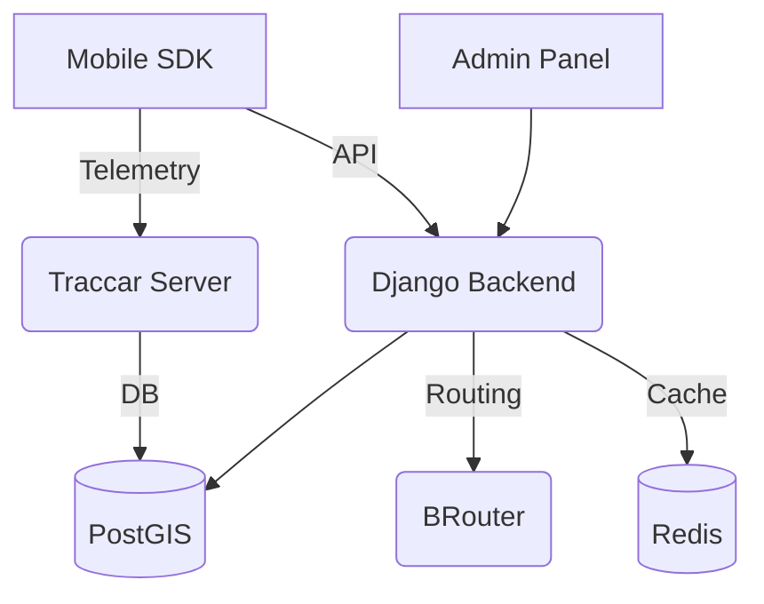

# Presentation of the SPORT Platform
*Vision, Technology, Future*

---

## 1. Project Vision

---

## 🏢 Part 1: Business Perspective (For Laypeople)
### What is SPORT?
It is not just another running app. It is a **complete ecosystem** for cities and corporations that turns physical movement into real benefits.

- **Gamification**: Competition between districts, companies, and clubs.
- **Real-Time Tracking**: Live view of all event participants on an interactive map.
- **Vouchers**: Points for kilometers exchanged for coffee, discounts, or rewards at local partners.
- **Privacy**: Advanced GPS masking around the user's home (Privacy Zones).

### Security and Integrity
The SPORT platform solves the biggest problem of sports applications: **fraud**.
- **Anti-Cheat**: Our system verifies whether the running route overlaps with a tram line or whether the average speed suggests driving a car.
- **Article 10 Principle**: The foundation of the project is the "SPORT Constitution," which guarantees that sensitive data will never leak.

---

## ⚙️ Part 2: Technical Perspective (For Developers)
### "Power Couple" Tech Stack
The project combines the iteration speed of Python (Django) with the performance of TypeScript (React).

- **Backend**: Django + GeoDjango + PostGIS (spatial analysis).
- **Infrastructure**: Podman/Docker, Redis (O(1) rankings), Traccar (telemetry).
- **Routing**: BRouter (topological route validation on OSM maps).
- **Frontend**: React + Vite + MapLibre GL (Canvas/GPU rendering).
- **Mobile**: Flutter (offline-first SDK).

### Architecture Diagram

### Telemetry Pipeline
1. **Device** sends position via OSMand protocol to the **Traccar** server.
2. **Django Backend** retrieves data, enriches it with athlete metadata, and filters it through **PrivacyService**.
3. **Admin Dashboard** fetches data (3s polling) and renders it smoothly on the map using a **Custom Layer** (Canvas API).

---

## 🚀 What's next? (Roadmap)
- **Events 2.0**: Dynamic challenge engine (Checkpoints, Route Match).
- **E2EE Chat**: Matrix integration (club chats with full encryption).
- **Mobile SDK**: Completion of "Sync Manager" logic for offline work.
- **AI Analytics**: Detection of anomalies in athlete movement.
