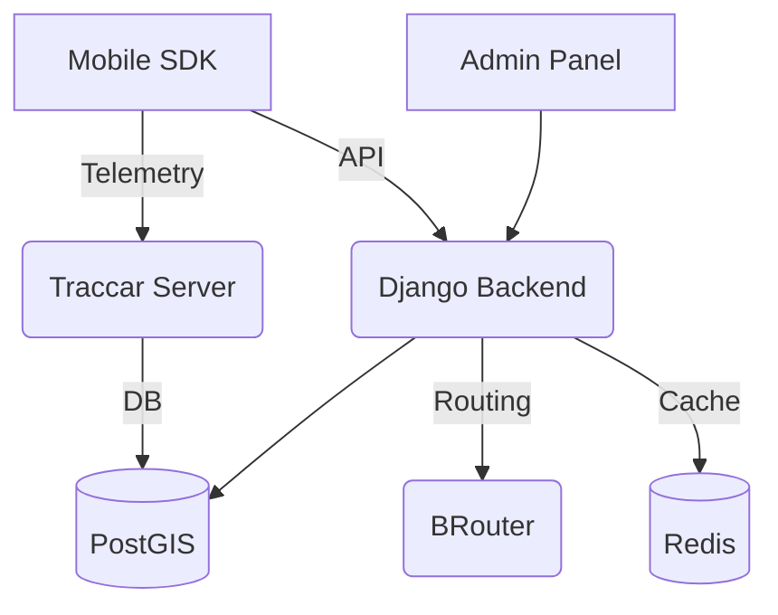

# Prezentacja Platformy SPORT
*Wizja, Technologia, Przyszłość*

---

## 1. Wizja Projektu

---

## 🏢 Część 1: Perspektywa Biznesowa (Dla Laika)
### Co to jest SPORT?
To nie tylko kolejna aplikacja do biegania. To **kompletny ekosystem** dla miast i korporacji, który zamienia ruch fizyczny w realne korzyści.

- **Gamifikacja**: Rywalizacja między dzielnicami, firmami i klubami.
- **Real-Time Tracking**: Widok na żywo wszystkich uczestników wydarzenia na interaktywnej mapie.
- **Vouchery**: Punkty za kilometry wymieniane na kawę, zniżki lub nagrody u lokalnych partnerów.
- **Prywatność**: Zaawansowane maskowanie GPS wokół domu użytkownika (Strefy Prywatności).

### Bezpieczeństwo i Integrytność
Platforma SPORT rozwiązuje największy problem aplikacji sportowych: **oszustwa**.
- **Anti-Cheat**: Nasz system weryfikuje, czy trasa biegu nie pokrywa się z linią tramwajową lub czy średnia prędkość nie sugeruje jazdy samochodem.
- **Zasada Article 10**: Fundamentem projektu jest "Konstytucja SPORT", która gwarantuje, że dane wrażliwe nigdy nie wyciekną.

---

## ⚙️ Część 2: Perspektywa Techniczna (Dla Programisty)
### Stack Techniczny "Power Couple"
Projekt łączy szybkość iteracji Python (Django) z wydajnością TypeScript (React).

- **Backend**: Django + GeoDjango + PostGIS (analiza przestrzenna).
- **Infrastruktura**: Podman/Docker, Redis (rankingi O(1)), Traccar (telemetria).
- **Routing**: BRouter (topologiczna walidacja tras na mapach OSM).
- **Frontend**: React + Vite + MapLibre GL (Canvas/GPU rendering).
- **Mobile**: Flutter (SDK offline-first).

### Diagram Architektury

### Pipeline Telemetrii
1. **Urządzenie** wysyła pozycję przez protokół OSMand do serwera **Traccar**.
2. **Backend Django** pobiera dane, wzbogaca je o metadane zawodnika i filtruje przez **PrivacyService**.
3. **Admin Dashboard** pobiera dane (polling 3s) i renderuje je płynnie na mapie za pomocą **Custom Layer** (Canvas API).

---

## 🚀 Co dalej? (Roadmap)
- **Events 2.0**: Silnik dynamicznych wyzwań (Checkpointy, Route Match).
- **E2EE Chat**: Integracja z Matrix (rozmowy klubowe z pełnym szyfrowaniem).
- **Mobile SDK**: Dokończenie logiki "Sync Manager" dla pracy offline.
- **AI Analytics**: Wykrywanie anomalii w ruchu zawodników.
