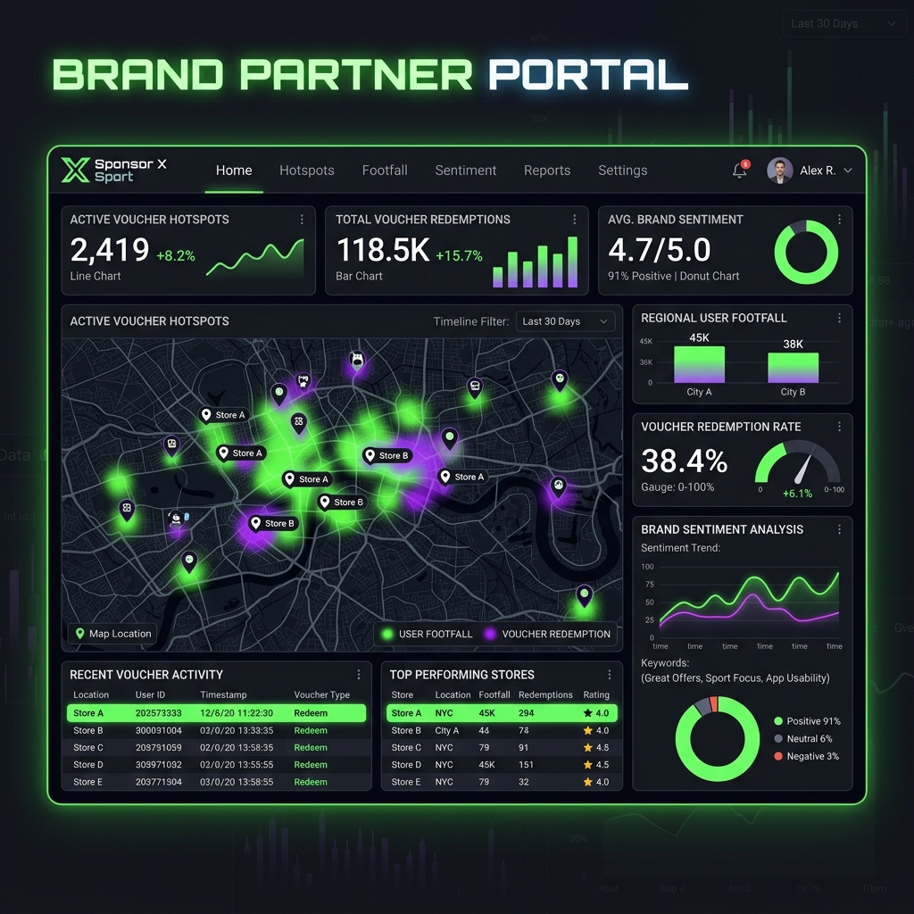
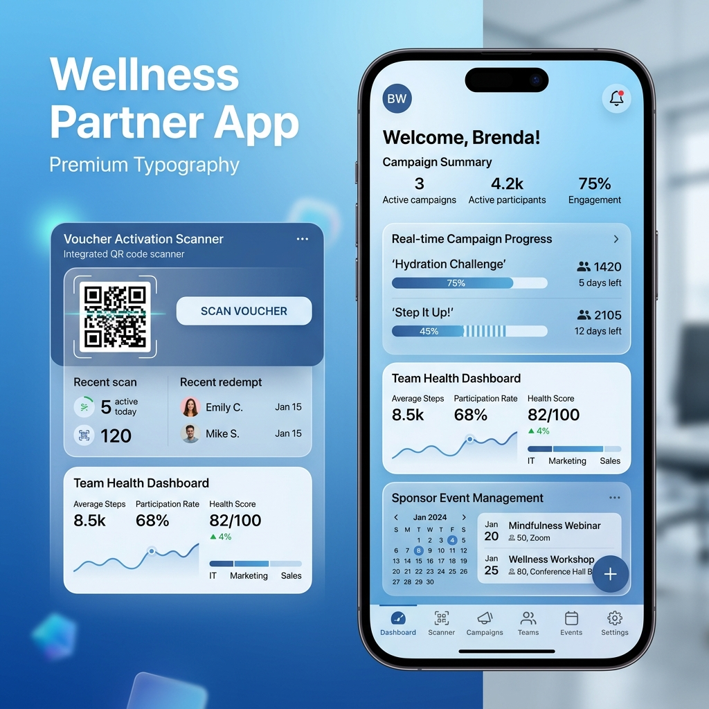
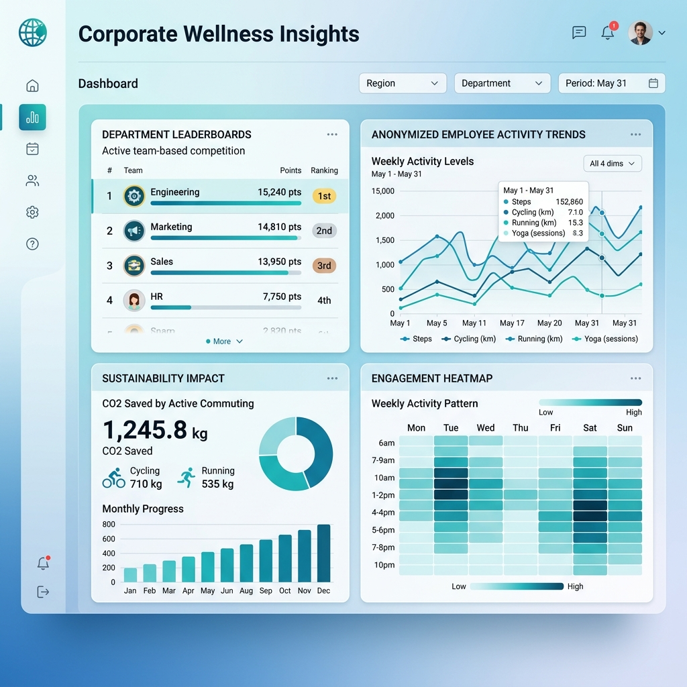
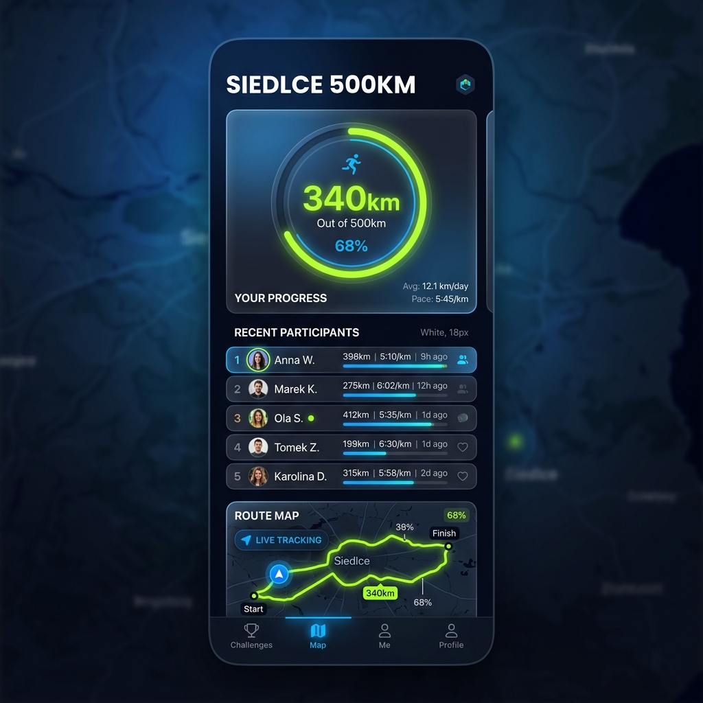
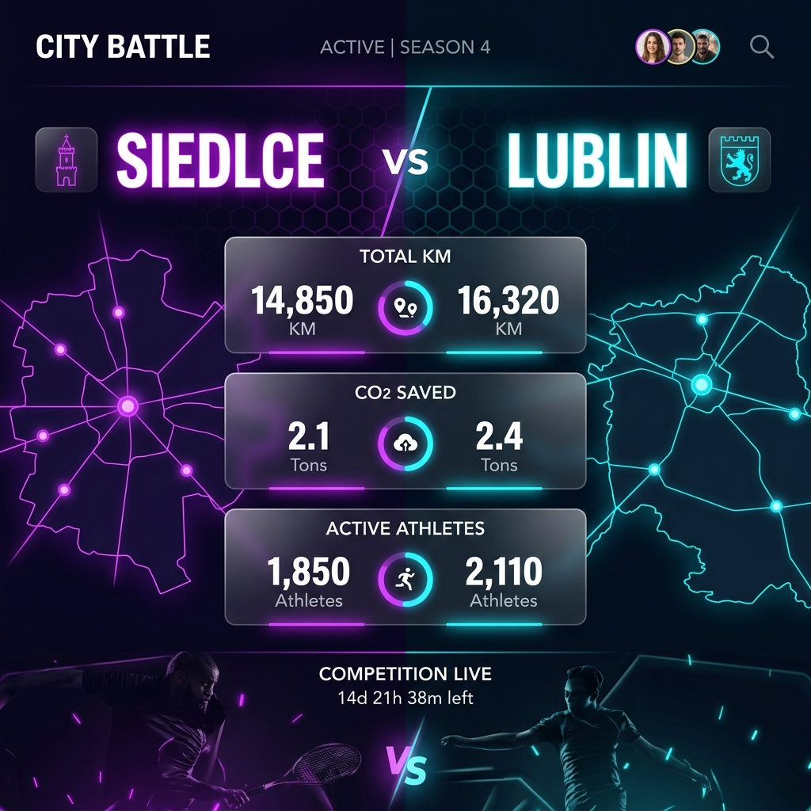
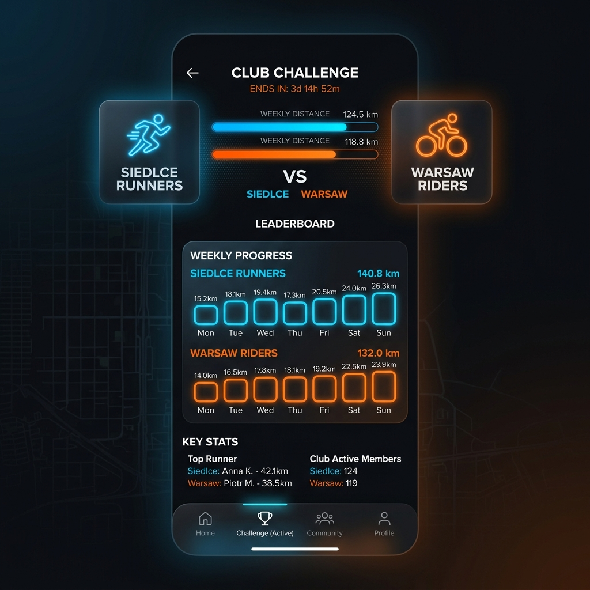
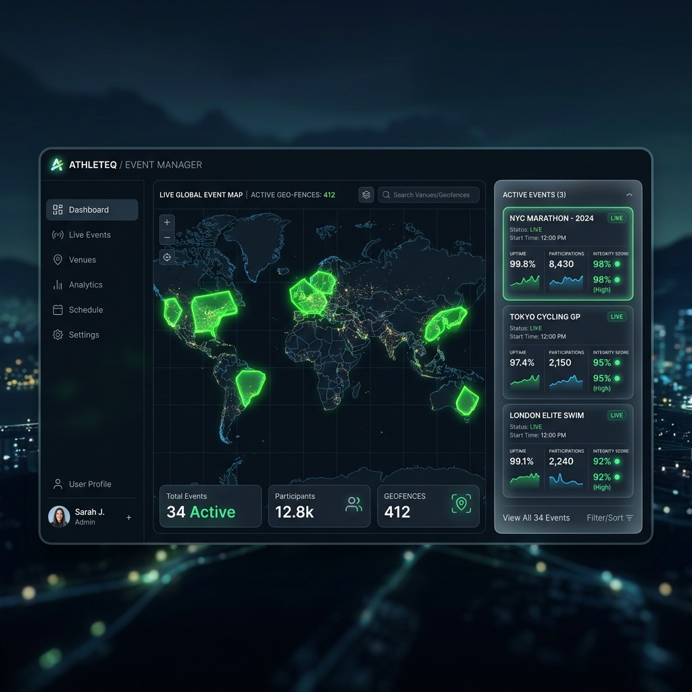

# PROJECT CONSTITUTION: "SPORT"
# PROJECT CONSTITUTION: "SPORT"

## 1. Mission and Identity
A B2B/B2C sports platform built 100% on **Permissive Open Source** foundations and a rigorous **Safety Constitution** (AI Quality Standards). The project aims to provide advanced telemetry, gamification, and social tools while maintaining full commercial freedom (White-Label) without the risk of copyleft (GPL) infection.

## 2. Tech Canon (Permissive Stack)
Strictly selected components to ensure business security:
- **Telemetry Core**: Traccar (Apache 2.0) — **pozycje przesyłane bezpośrednio do Redis (pub/sub), omijając HTTP**.
- **Mobile Tracking**: React Native 0.76 + `react-native-background-geolocation` (ISC).
- **Validation and Map-Matching**: BRouter (MIT).
- **Map Visualization**: MapLibre GL (BSD-2/MIT).
- **Communication**: Matrix (Apache 2.0).
- **Gamification**: Redis (BSD-3-Clause) — Sorted Sets + Pipeline batch.
- **Admin Panel**: React 19 + Vite + TypeScript.

## 3. Visual Vision (UX/UI Manifesto)
The interface must inspire trust and motivate activity.
- **Aesthetic**: Dark mode, glassmorphism, dynamic gradients.
- **Data Visualization**: High-performance vector maps, interactive telemetry charts.
- **Projects**: Management Panel (Admin Panel) as a command center with Live view.

### User Application (Android/iOS)
#### Active Session View


#### Community and Clans (Matrix Chat)


#### Privacy Zones Configuration


#### Rewards and Sponsors Marketplace


### Management Panel (Web/Windows)
#### Main Dashboard


#### Anti-Cheat Verification (Deep Dive)


#### City Analytics (Heatmaps)


## 4. System Architecture
### High-Level Architecture Overview


### Offline-First Model
The mobile app treats the local database (SQLite) as the single source of truth during an activity. Synchronization with the server occurs asynchronously (batching), minimizing battery consumption.

### Anti-Cheat System (3-Layer Architecture)

Każda aktywność przechodzi przez trójwarstwowy filtr przed zapisem do bazy:

**Warstwa 1 — Fast Selection Gate** (`fast_rejection_gate`, O(N), zero I/O):
- **TELEPORT**: Skok GPS >500m między kolejnymi punktami → natychmiastowe odrzucenie.
- **ACCELERATION**: Przyspieszenie >6 m/s² → tramwaje, samochody, GPS spoof.
- **MOTOR FINGERPRINT**: Współczynnik zmienności prędkości CV<5% → nieludzka stałość (pojazd szynowy/drogowy).
- **STRAIGHT-LINE RATIO**: Przemieszczenie/dystans >92% → linia prosta = pojazd drogowy.

**Warstwa 2 — V-max Kinematic Check** (`analyze_anomalies`):
- Biomechaniczne progi prędkości per sport (RUN 12 m/s, BIKE 25 m/s, WALK 3.5 m/s).
- Odrzucenie przy >20% segmentów powyżej progu lub ≥3 kolejnych naruszeń.

**Warstwa 3 — BRouter Topological Validation** (wywoływana TYLKO jeśli warstwy 1+2 przeszły):
- Dopasowanie do siatki OSM, weryfikacja że trasa nie przecina barier fizycznych.
- Algorytm Viterbi HMM dla map matchingu.

### Leaderboards and Gamification
The use of **Sorted Sets** in Redis allows for instantaneous recalculation of rankings for millions of users with minimal overhead.

## 5. Privacy and Security
- **Privacy Zones**: Dynamic track masking near sensitive locations (home, work).
- **E2EE**: End-to-end encryption via the Matrix protocol.
- **Anonymization**: Variable-radius vector clipping triangulation.

## 6. Operational Standards (AI Toolkit)
The project applies strict **[Safety Constitution](./ai_toolkit_constitution.md)** rules, including:
- Article I: Safety First (no data loss, no blind execution).
- Article VI: Repair Discipline (no dead code, immediate bug fixes).
- Planning before implementation and evidence-based verification before task completion.

## 7. Model Komercjalizacji
- **B2B (Corporate Wellness)**: SaaS model with full client branding and advanced HR analytics (see Section 18).
- **B2C (Freemium)**: Advanced training plans, premium maps, and special event access.
- **Sponsors POI**: Dynamic partner points on the map with a voucher system and Brand Portal (see Section 17).

## 8. Coding and Documentation Standards

To ensure the "SPORT" project is maintainable and readable for any professional developer, we strictly adhere to the following standards:

### 8.1 Python (Backend)
- **Tooling**: We use **Ruff** as our unified linter and formatter (replaces flake8, isort, black, and pyupgrade). Configuration is centralized in `pyproject.toml`.
- **Typing**: Strict type hints are required for all public APIs and core business logic. Use `mypy` or `pyright` for static analysis. Prefer `list[str]` over `typing.List[str]`.
- **Data Models**: Use **Pydantic v2** or **dataclasses** for structured data. Avoid raw dictionaries for complex objects.
- **Testing**: **pytest** is our standard testing framework. Follow the Arrange-Act-Assert (AAA) pattern.
- **Docstrings**: Use **Google Style** docstrings for all functions, classes, and modules.

### 8.2 TypeScript (Frontend/Mobile)
- **Tooling**: **ESLint** (Flat Config) for code quality and **Prettier** for formatting.
- **Type Safety**: `strict: true` must be enabled in `tsconfig.json`. Avoid `any` at all costs; use `unknown` if the type is truly uncertain.
- **Runtime Validation**: Use **Zod** for schema validation at the system boundaries (API responses, form inputs).
- **Naming Conventions**: 
  - Variables/Functions: `camelCase`
  - Classes/Types/Interfaces: `PascalCase`
  - Constants: `UPPER_SNAKE_CASE`
  - Files/Folders: `kebab-case` (e.g., `user-profile-service.ts`)
- **Documentation**: Use **JSDoc** for all public functions and interfaces.

### 8.3 Documentation and Architecture (Non-Negotiable)
- **"Documentation is Foundation" Policy**: No code change will be merged without updated technical and API documentation. Documentation is treated as a first-class citizen of the codebase.
- **API Documentation**: Every API endpoint must be fully described using **OpenAPI/Swagger** (via drf-spectacular). This includes parameter descriptions, request/response schemas, and error codes.
- **Architecture Decisions**: Major architectural changes must be documented using **ADR** (Architecture Decision Records) in the `docs/adr/` directory.
- **Code Documentation**:
  - **Python**: Google Style docstrings are mandatory for all public members.
  - **TypeScript**: JSDoc is mandatory for all interfaces, types, and exported functions.
- **Living Documentation**: The `/docs` folder must always reflect the current state of the implementation.

### 8.4 Git and Workflow
- **Commit Messages**: Follow **Conventional Commits** (e.g., `feat:`, `fix:`, `docs:`, `refactor:`).
- **PR Rules**: All PRs must pass linting, type checking, and tests before merging. 

## 9. Performance and Data Integrity Strategy

To ensure a "lightning-fast" user experience and stable data flow under high load, the following strategies are mandatory:

### 9.1 Optimistic UI & Local-First Approach
- **Instant Feedback**: Use **TanStack Query** (Web) and **Riverpod** (Mobile) to implement optimistic updates. The UI must reflect user actions immediately, with synchronization happening in the background.
- **Conflict Resolution**: Implement robust local-first logic with automatic retries and rollback mechanisms in case of server-side failures.

### 9.2 Asynchronous Processing & Task Queues
- **Worker Pattern**: Heavy computational tasks, such as GPX validation via BRouter or leaderboard recalculations, must be handled off-thread using **Celery** or **Redis Queue (RQ)**.
- **Non-blocking API**: The API should acknowledge data receipt immediately and notify the user of results via WebSockets or Push Notifications once background processing is complete.

### 9.3 Data Efficiency & Batching
- **GPS Batching**: GPS points must be batched locally and sent to the server in compressed chunks (e.g., via optimized JSON or Protocol Buffers) to minimize battery drain and network overhead.
- **Exponential Backoff**: Implement smart retry logic for network requests to prevent "thundering herd" issues during server recovery.

### 9.4 Geospatial Optimization (PostGIS)
- **GIST Indexing**: All spatial columns must be indexed using GIST to ensure sub-millisecond query times for geofencing and proximity checks.
- **Geometry Simplification**: Use algorithms like **Douglas-Peucker** to store simplified versions of tracks for high-speed map previews, while preserving high-resolution raw data for analytical validation.

### 9.5 Real-time Scalability
- **Redis Pub/Sub**: Use Redis as a message broker for WebSockets to scale real-time telemetry updates across multiple server nodes efficiently.
- **Multiplexing**: Minimize active WebSocket connections by multiplexing data streams based on user context (e.g., current clan or city view).

### 9.6 Map Performance
- **Vector Tiles & CDN**: Utilize **Vector Tiles** (PMTiles or similar) served via CDN to offload map rendering from the application server and ensure global low-latency map availability.

## 10. Security and Privacy Governance

Security is the foundation of user trust in a location-based sports application. The following security measures are mandatory:

### 10.1 User Privacy (Privacy-by-Design)
- **Dynamic Privacy Zones**: Automatic masking of start/finish points within a user-defined radius (e.g., home, work).
- **Data Minimization**: Only collect and retain GPS data necessary for route validation. Raw tracks should be purged or anonymized after processing according to user preferences and GDPR.
- **E2EE Communication**: All social interaction (clan/city chats) must be end-to-end encrypted via the Matrix protocol.

### 10.2 API and Server Security
- **Rate Limiting & Throttling**: Protection against Brute Force attacks and API abuse using Redis-based rate limiters.
- **Modern Auth**: Implementation of JWT-based authentication with short-lived Access Tokens and secure Refresh Tokens (OAuth2 standard).
- **CORS & CSP**: Strict Cross-Origin Resource Sharing and Content Security Policies to prevent XSS and data injection attacks.

### 10.3 Data Protection
- **Encryption at Rest**: Databases (PostgreSQL/PostGIS) and storage buckets must be encrypted at rest.
- **Secret Management**: Absolute prohibition of committing secrets to the repository. Use environment variables or managed secret stores (e.g., HashiCorp Vault, AWS Secrets Manager).
- **SQL Injection Prevention**: Mandatory use of ORMs with parameterized queries for all database interactions.

### 10.4 Auditing and Compliance
- **Audit Logs**: Maintain immutable logs of all administrative actions (e.g., manual route approval, user bans).
- **Automated Security Scanning**: Continuous scanning of dependencies for known vulnerabilities (CVEs) using tools like `ruff` and GitHub Dependabot.

## 11. Internationalization and Localization (i18n/L10n)

The "SPORT" platform is designed from the ground up to be **multi-language** and multi-regional.

### 11.1 Language Standards
- **Primary Development Language**: English (Code, Commits, Technical Documentation).
- **Default End-User Locale**: **Polish (pl_PL)**.
- **Supported Launch Locales**: English (en_US), Polish (pl_PL).

### 11.2 Implementation Strategy
- **Frontend/Mobile**: Use standard i18n libraries (e.g., `react-i18next` for web, `easy_localization` or `flutter_localizations` for Flutter).
- **Backend**: Implement locale-aware API responses. Error messages and notifications must be localized based on the user's preferred language.
- **Externalization**: No user-facing strings should be hardcoded. All text must be stored in localization files (e.g., JSON or ARB).
- **Date/Currency**: Use international standards for date formatting (ISO 8601) and currency handling to ensure consistency across regions.

## 12. Authentication and Financial Infrastructure

### 12.1 Authentication (AuthN/AuthZ)
- **Multi-Channel Login**: Support for Social Auth (Google, Apple ID, Facebook) and traditional Email/Password.
- **B2B Single Sign-On (SSO)**: Integration with Enterprise IDPs (Azure AD, Okta, SAML) for corporate clients.
- **Passwordless Flow**: Implementation of Magic Links and OTP (One-Time Password) for frictionless onboarding.
- **MFA**: Optional Multi-Factor Authentication for administrative and moderator accounts.

### 12.2 Payments and Billing
- **Subscription Management**: Integration with **Stripe** or **Adyen** for B2C premium plans (monthly/annual).
- **B2B Invoicing**: Automated billing system for corporate licenses and seat management.
- **PCI DSS Compliance**: No sensitive payment data is stored locally; all transactions are handled via PCI-compliant processors.
- **Virtual Economy**: Support for "Vouchers" and "Points" exchangeable for sponsor rewards.

## 13. AI and Data Intelligence Strategy

The "SPORT" platform leverages data to provide value beyond simple tracking:
- **Predictive Insights**: Use lightweight ML models to identify patterns of overtraining or suggest rest days.
- **Smart Routing**: Recommendation engine for routes based on user preferences (elevation, surface type, popularity).
- **Automated Anti-Cheat**: AI-enhanced anomaly detection to identify non-human movement patterns (e.g., motorized transport spoofing).

## 14. CI/CD and Quality Assurance Standards

### 14.1 Automation Pipeline
- **Continuous Integration**: Automated linting, type checking, and unit tests run on every Pull Request.
- **Continuous Deployment**: Automated deployments to staging/production environments following a successful merge.
- **Canary Releases**: Ability to roll out features to a percentage of users to monitor stability before full deployment.

### 14.2 Testing Strategy
- **Visual Regression**: Automated screenshot testing to ensure UI consistency across different device resolutions.
- **E2E Testing**: Critical paths (Login, Start Session, Payment) must be covered by End-to-End tests (Playwright/Cypress/Appium).
- **Performance Budgets**: Monitoring of API response times and mobile frame rates (FPS) to maintain high responsiveness.

## 15. Governance and User Roles

The "SPORT" platform follows a hierarchical access control model to ensure secure and efficient management.

### 15.1 Project Owner (akarn)
- **Supreme Authority**: Full access to all system modules, global financial reports, and infrastructure configurations.
- **Constitutional Control**: Only the Project Owner can authorize changes to the Project Constitution and Core AI Safety standards.
- **Administrative Oversight**: Power to appoint and revoke Global Administrators.

### 15.2 Global Administrator
- **B2B Management**: Oversight of corporate and municipal clients (tenants).
- **Global Anti-Cheat Tuning**: Authority to adjust validation thresholds for the entire platform.
- **Security Monitoring**: Access to system-wide audit logs and security alerts.

### 15.3 Local Moderator (Tenant Level)
- **Community Management**: Management of clans, users, and local challenges within a specific B2B tenant.
- **Route Verification**: Manual review of flagged tracks and handling of user disputes.

### 15.4 End User (Athlete)
- **Personal Profile**: Management of personal data, privacy zones, and training history.
- **Social Interaction**: Participation in clans, cities, and leaderboard competitions.

## 16. Reliability, Maintenance, and Compliance Standards

To ensure the long-term viability and professional standing of the "SPORT" platform, the following operational standards are established.

### 16.1 Disaster Recovery and Backups
- **Automated Backups**: Full database backups (PostgreSQL/TimescaleDB) are performed daily and stored in a geographically isolated location.
- **Point-in-Time Recovery (PITR)**: Enable write-ahead logging (WAL) archiving to allow recovery to any specific second in case of data corruption.
- **Recovery Testing**: Backup restoration must be tested and verified at least once per quarter.

### 16.2 Energy Efficiency and Resource Management
- **Adaptive GPS Sampling**: The mobile app must adjust GPS polling frequency based on current battery levels and movement speed to prevent excessive drain during long activities.
- **Battery Impact Monitoring**: Continuous monitoring of the app's battery footprint using native profiling tools (Android Battery Historian, iOS Instruments).

### 16.3 Update and Deployment Strategy
- **Staged Rollouts**: New mobile app versions are released to 5%, 10%, 20%, and then 100% of users to monitor for crashes.
- **OTA (Over-the-Air) Updates**: Critical bug fixes for the web and mobile (logic layer) can be deployed via OTA mechanisms to bypass slow App Store approval cycles.

### 16.4 Observability and Monitoring
- **Error Tracking**: Integration with **Sentry** or similar for real-time crash reporting across backend, web, and mobile.
- **Health Metrics**: Use **Prometheus** and **Grafana** to monitor server health (CPU, RAM, DB connection pools) and API performance.
- **Synthetic Monitoring**: Automated "smoke tests" that simulate user login and session starts every 15 minutes to verify system uptime.

### 16.5 Legal, Licensing, and Attribution
- **Open Source Compliance**: The app must include an "Open Source Licenses" screen providing proper attribution to OpenStreetMap, BRouter, MapLibre, and other core components.
- **Privacy Compliance**: Strict adherence to GDPR (Europe) and CCPA (USA) for data processing, including the "Right to be Forgotten" and data export features.

## 17. Sponsorship and Brand Integration Module

The "Brand Partner Portal" allows companies to interact with the active community through spatial gamification.

### 17.1 Brand Portal Features
- **Voucher Hotspots**: Sponsors can place dynamic reward zones on the map. Users who complete activities passing through these zones unlock exclusive brand vouchers.
- **User Footfall Analytics**: Real-time heatmaps showing user density around sponsor locations (anonymized).
- **Brand Sentiment Monitoring**: Integrated feedback loop for sponsored events and challenges.

### 17.2 Visual Identity


#### Brand Wellness Mobile App
For store managers and local wellness coordinators to manage vouchers and live events.


## 18. Corporate Wellness and HR Analytics

Dedicated dashboard for B2B clients to monitor and incentivize employee health.

### 18.1 Corporate Features
- **Department Leaderboards**: Internal competition between teams (Sales vs. Engineering) to drive engagement.
- **Sustainability Impact**: Tracking CO2 savings by employees choosing active commuting over vehicles.
- **Engagement Insights**: Deep analytics on employee participation rates and milestone achievements.
- **Privacy First**: HR managers only see aggregated, anonymized data to protect individual employee privacy.

### 18.2 Visual Identity


## 19. Accessibility and Inclusion

The "SPORT" platform must be usable by everyone, regardless of physical ability.

- **Adaptive Profiles**: Support for wheelchair and handcycle activities with specific routing profiles in BRouter.
- **High-Contrast Themes**: Specialized UI modes for users with visual impairments.
- **Screen Reader Optimization**: Full compliance with WCAG 2.1 for the web dashboard and mobile app.

## 20. Viral Growth and Social Mechanics

To ensure rapid adoption, the platform includes built-in viral loops:

- **Dynamic Social Cards**: Automated generation of beautiful, shareable "Activity Cards" with stats, maps, and brand logos for social media.
- **Referral Rewards**: Gamified system where users unlock premium features or badges by inviting friends and colleagues.
- **Cross-Platform Sharing**: Seamless integration with Strava, Instagram, and Matrix for activity broadcasting.

## 21. Event System and Real-Time Competitions

The Event System is the engine of collective activity, enabling cities, corporations, and global brands to host time-bound and location-based challenges.

### 21.1 Event Types
- **Accumulative Challenges**: Users compete by reaching a total distance, elevation, or time goal within a specific period (e.g., "Siedlce 500km Month").
- **Checkpoint/POI Runs**: Users must visit a series of Points of Interest or pass through specific Geofences in a defined order.
- **Route Matches**: Real-time or asynchronous racing on a specific segment or official marathon route, validated against OSM topology.
- **Inter-Tenant Leagues (B2B/B2G)**: Competitions between different corporations or cities.
- **Club/Clan Challenges**: Grassroots competitions between user-created sports clubs (e.g., "Siedlce Cycling Club vs. Warsaw Riders").

### 21.2 Technical Implementation & Normalization
- **Aggregation Engine**: Real-time aggregation of activity data based on `tenant_id`, `department_id`, and `club_id`.
- **Normalization Score**: To ensure fairness, scores are calculated using: `Score = (Total Distance * Complexity Factor) / Active Participants`.
- **Matrix Integration**: Every club automatically gets a private E2EE Matrix room for coordination and social interaction.
- **Traccar Geofencing**: Real-time event triggers when an athlete enters or exits a predefined zone.
- **BRouter Validation**: Every event-related activity undergoes rigorous topological verification to ensure integrity and prevent spoofing.
- **Redis Leaderboards**: Instantaneous ranking updates per event, category, and department, allowing for high-frequency "comet trail" visualizations on the live dashboard.

### 21.3 Visual Identity


#### City vs. City Battles
Competitive leagues between municipalities with normalized scoring.


#### Club vs. Club Challenges
Grassroots social competition with Matrix integration.


#### Admin Event Management
Tool for creating, scheduling, and monitoring real-time sports events.


## 22. Notification Infrastructure

Real-time push notifications are a critical engagement driver, especially for time-sensitive event alerts (e.g., "Your city just overtook Lublin!").

### 22.1 Delivery Channels
- **Mobile Push (Primary)**: FCM (Firebase Cloud Messaging) for Android, APNs for iOS.
- **WebSockets (Secondary)**: For real-time in-app notifications on the admin panel without page refresh.
- **Email (Fallback)**: Digest emails for weekly rankings and event summaries.

### 22.2 Notification Categories
- **Event Triggers**: Milestone reached, geofence entry/exit, leaderboard position change.
- **Social**: New club member, challenge invitation, Matrix room message (badge only).
- **Anti-Cheat**: Activity flagged for review, verification result delivered.
- **System**: Voucher expiry, subscription renewal, maintenance windows.

### 22.3 Technical Architecture
- **Decoupled via Celery**: All notifications are dispatched via the `notifications` Celery queue to prevent blocking the main API thread.
- **`NotificationTemplate` Model**: Localized templates (pl/en) with variable interpolation stored in the database.
- **User Preferences**: Granular opt-in/opt-out per notification category stored in `UserProfile`.

### 22.4 Privacy
- Notification content must **never** include raw GPS coordinates.
- Aggregated metrics only (e.g., "Your club covered 120km this week").

## 23. Plugin-Based Extensibility Architecture

To allow rapid innovation without bloating the core engine, the SPORT platform follows a strict plugin-based strategy for experimental features and third-party integrations.

### 23.1 Plugin Principles
- **Isolation**: Plugins must be decoupled from the core Django models where possible, using signals or dedicated registration hooks.
- **Registry**: The PluginRegistry manages the lifecycle (load/unload/config) of external logic modules.
- **Sandboxing**: Experimental plugins (e.g., new gamification ideas) are initially deployed in 'Pilot' mode for specific tenants.
- **Idea Gate**: Every new feature starts as a Plugin before being considered for core engine promotion.

### 23.2 Nienaruszalność Jądra (Core Immutability)
Pluginy **pod żadnym pozorem nie mogą modyfikować kodu jądra** systemu (core apps: users, activities, core). Interakcja z jądrem musi odbywać się wyłącznie poprzez:
- **Django Signals**: Nasłuchiwanie na zdarzenia systemowe bez modyfikacji nadawcy.
- **Middleware Hooks**: Przechwytywanie zapytań bez ingerencji w logikę widoków jądra.
- **Adapter Pattern**: Tworzenie warstw pośrednich dla nowych funkcjonalności.

Każda próba bezpośredniej edycji modeli bazowych lub widoków jądra przez plugin będzie odrzucana na etapie walidacji AI Gate.

## 24. Zaawansowane Standardy Techniczne (Sync v2.0)
*Niniejszy rozdział został zsynchronizowany z Gemini Gem "APLIKACJA SPORTOWA" i stanowi priorytet techniczny dla implementacji fazy 2+.*

### 24.1 Architektura Hybrydowa (Power Couple v2)
System ewoluuje w stronę podziału na dwa silniki:
1.  **Django (Core)**: Obsługa procesów biznesowych, tożsamości (Auth) i relacyjnych struktur danych.
2.  **FastAPI (Telemetry)**: Dedykowany, asynchroniczny mikroserwis do obsługi strumieni GPS i integracji z Traccar. Zapewnia brak blokowania I/O przy wysokim natężeniu ruchu.

### 24.2 Przetwarzanie Sygnału i Prawda Geoprzestrzenna
Wprowadziliśmy rygorystyczną walidację sygnału przed zapisem do bazy:
- **Fast Selection Gate (Layer 1)**: O(N) filtr kinematyczny — teleport, przyspieszenie, fingerprint pojazdu, stosunek linii prostej. Zero I/O. Patrz §24.5.
- **Filtrowanie Kalmana**: Redukcja dryfu GPS i szumów pozycjonowania.
- **Analiza V-max (Layer 2)**: Per-sport progi biomechaniczne z konfigurowalnym marginesem.
- **HMM (Hidden Markov Models)**: Algorytm Viterbi do precyzyjnego Map Matchingu (OSM).
- **BRouter Topological Validation (Layer 3)**: Wywoływana wyłącznie gdy warstwy 1 i 2 przeszły — oszczędność zasobów serwerowych.

### 24.3 Persystencja i Szeregi Czasowe (TimescaleDB)
- Wszystkie punkty GPS trafiajÄ… do **Hypertabel w TimescaleDB**.
- Wykorzystanie mechanizmu *chunking* i *continuous aggregates* dla błyskawicznego generowania statystyk (heatmaps, pace analysis) bez obciążania głównej bazy PostgreSQL.
- **city_rankings_mv**: Zmaterializowany widok PostGIS agregujący dystanse per miasto/użytkownik. Odświeżany asynchronicznie przez Celery (`REFRESH MATERIALIZED VIEW CONCURRENTLY`).

### 24.4 Interoperacyjność OGC
- Implementacja standardu **OGC API — Moving Features** jako domyślnego formatu wymiany danych telemetrycznych.
- Przygotowanie platformy na rolę "Data Providera" dla zewnętrznych systemów Smart City.

### 24.5 Fast Selection Layer — Specyfikacja Techniczna

> **Zasada:** Zanim jakikolwiek punkt GPS dotrze do BRoutera, musi przejść przez bramę kinematyczną. Koszt bramki = O(N) czystej matematyki. Koszt BRoutera = sieć + CPU + DB. Bramka jest najtańszą inwestycją w skalowanie.

| Test | Algorytm | Próg domyślny | Env var | Co wykrywa |
|:---|:---|:---:|:---|:---|
| TELEPORT | `dist > threshold` | 500 m | `GATE_TELEPORT_M` | GPS spoof, pojazd |
| ACCELERATION | `Δv/Δt > threshold` | 6.0 m/s² | `GATE_MAX_ACCEL` | Tramwaj, samochód |
| MOTOR FINGERPRINT | `σ/μ(speed) < threshold` | 0.05 | `GATE_MOTOR_VAR` | Autobus, kolej |
| STRAIGHT-LINE | `displacement/track > threshold` | 0.92 | `GATE_STRAIGHT_RATIO` | Pojazd drogowy |

**Wynik odrzucenia gate'u:**
```json
{ "status": "rejected_gate", "reason": "MOTOR_FINGERPRINT: speed CV=0.02 < 0.05", "details": {"speed_cv": 0.02} }
```

**Pluggy hook po odrzuceniu:** `activity.suspicious` z `anomaly_ratio=1.0`.

### 24.6 Moderator Control Panel
- **Widok split-screen**: Lista oflagowanych aktywności + podgląd trasy GPS na MapLibre.
- **Akcje manualne**: Approve / Reject / Ban User — bezpośrednio z mapy.
- **RBAC**: Dostępny tylko dla ról `GLOBAL_ADMIN` i `LOCAL_MODERATOR`.
- **Komponenty**: `ModeratorView.tsx`, `MapTrackViewer.tsx` (`admin/src/`).

## 25. STANDARD ESTETYCZNY: CUD
*Niniejszy rozdzia³ definiuje DNA wizualne projektu SPORT. Odstêpstwo od tych zasad jest traktowane jako b³¹d krytyczny (Critical Bug).*

### 25.1. Specyfikacja Glassmorphism i Aura
- **Deep Glass**: ackdrop-filter: blur(20px). T³o musi byæ pó³przezroczyste (rgba 20, 20, 20, 0.7).
- **Inner Glow**: Ka¿dy panel musi posiadaæ wewnêtrzny cieñ inset 0 0 20px rgba(0, 242, 255, 0.05).
- **Aura Gradients**: Wykorzystanie palety:
  - **Primary Cyan**: #00f2ff
  - **Neon Purple**: #7000ff
  - **Safety Orange**: #ffaa00 (tylko dla alertów)
  - **Background**: Deep Obsidian (#050505)

### 25.2. Standard Wykresów i Analityki
- **Radar Charts**: Wype³nienie gradientowe (Cyan to Purple) z poœwiat¹. Linie siatki o widocznoœci 10%.
- **Integrity Gauge**: Gradient liniowy (Red -> Yellow -> Cyan). Wskazówka musi rzucaæ cieñ typu neon-glow.
- **Sensor Analysis**: Ostre, cienkie linie z efektem 'glow' (drop-shadow).

### 25.3. InteraktywnoϾ Map
- **Geofencing**: Obrysy poligonów musz¹ mieæ stroke-width: 2px i efekt pulsuj¹cego neonu.
- **Telemetry Trails**: Œlad trasy musi byæ gradientowy (od starego punktu do nowego) z poœwiat¹.

### 25.4. Polityka Zero Tolerancji dla "Kaszany"
- Funkcjonalnoœæ bez estetyki premium jest uznawana za niegotow¹.
- Ka¿dy komponent musi przejœæ walidacjê wizualn¹ Gemini (Nano Banana) pod k¹tem zgodnoœci z mockupami.
