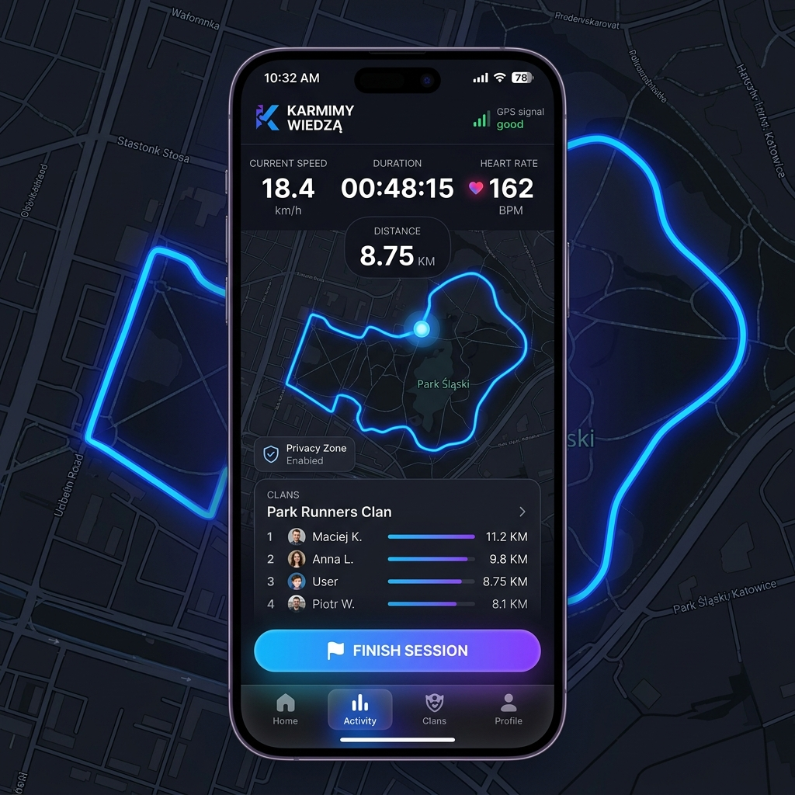
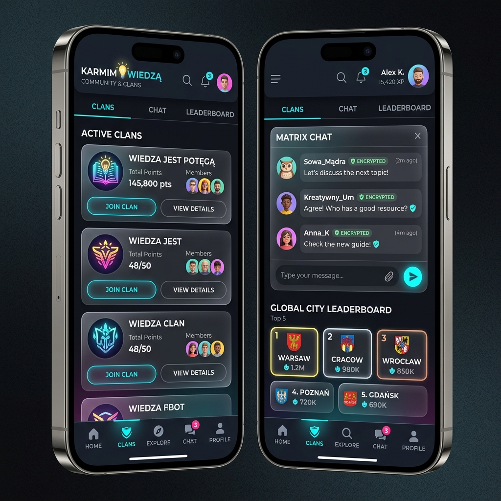
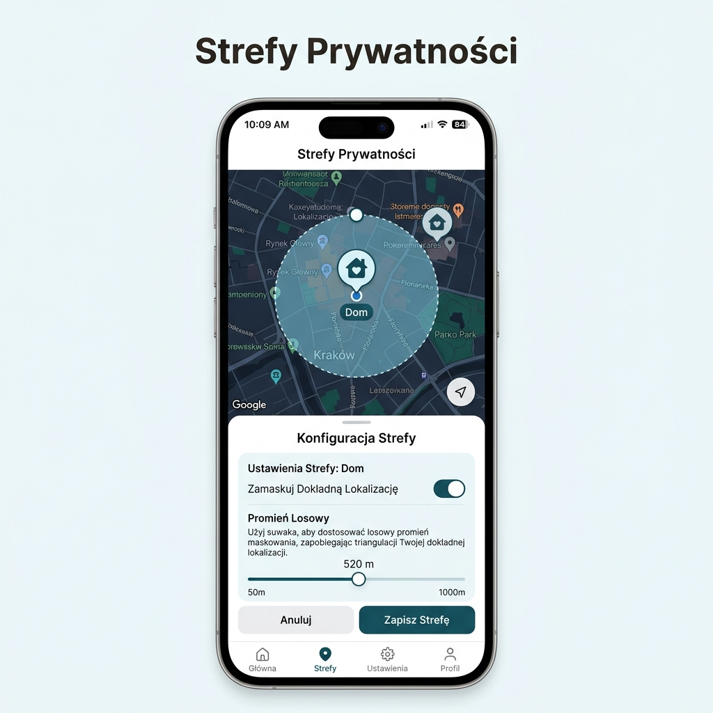
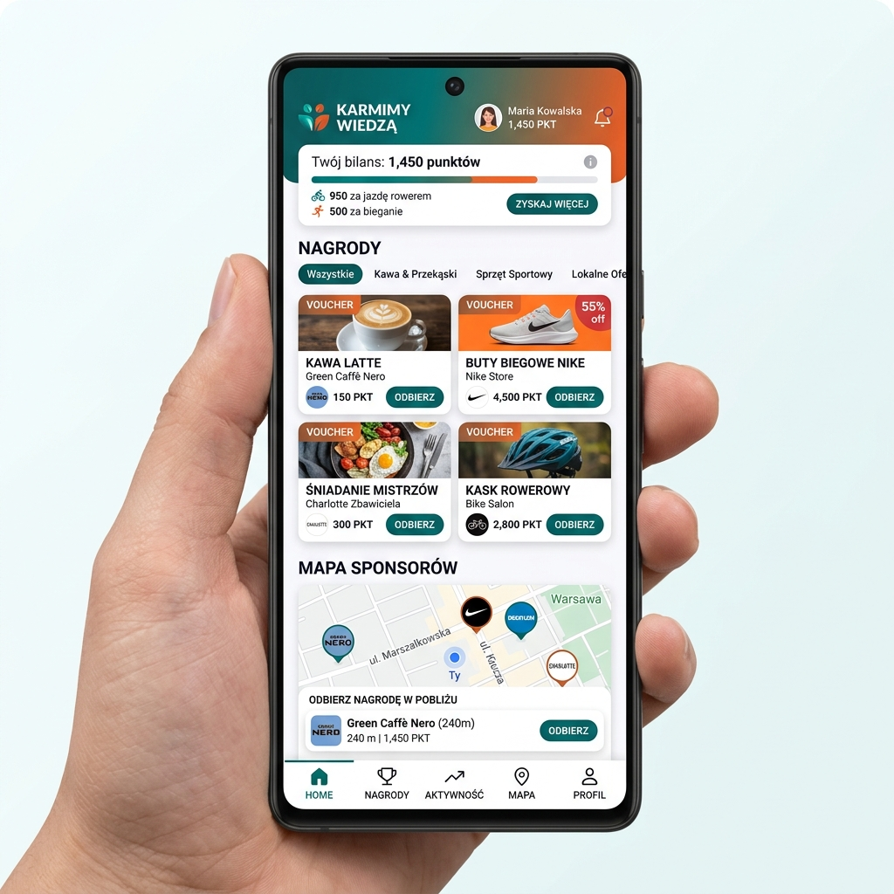
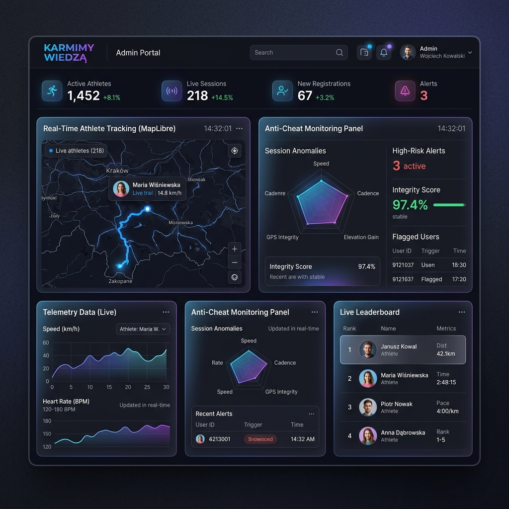
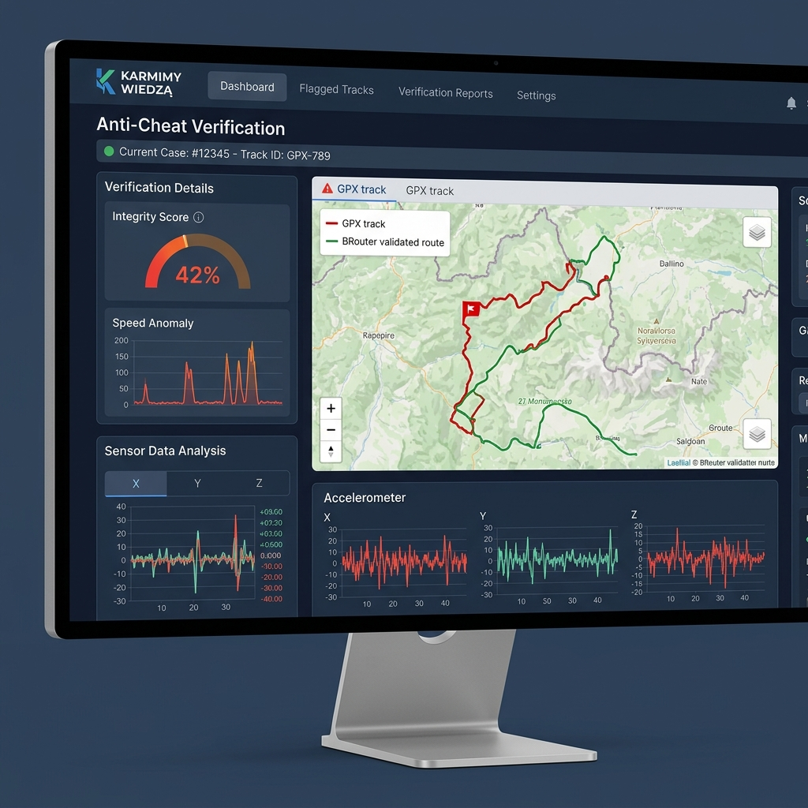
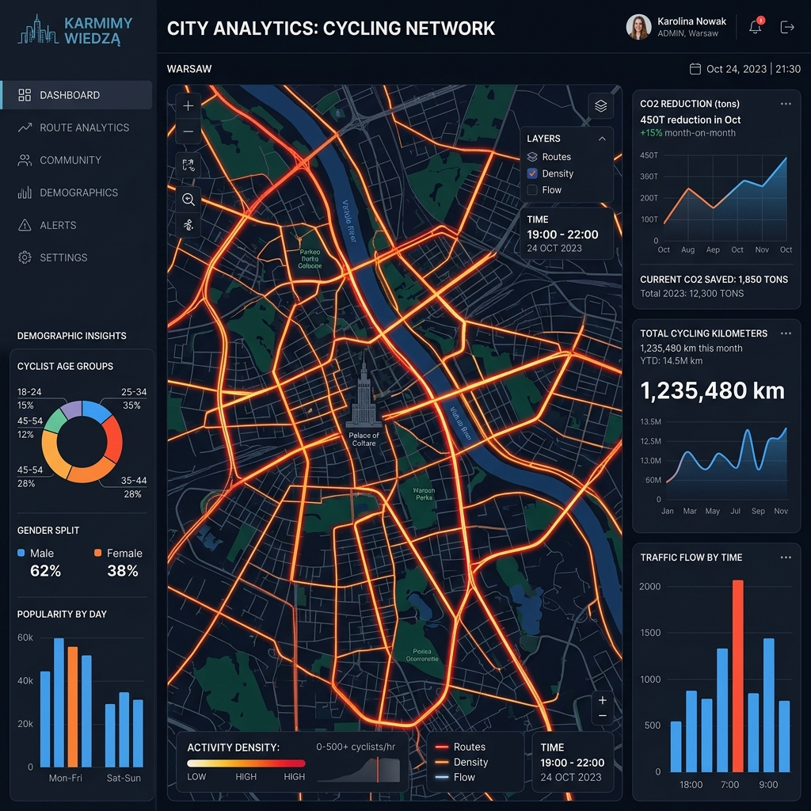
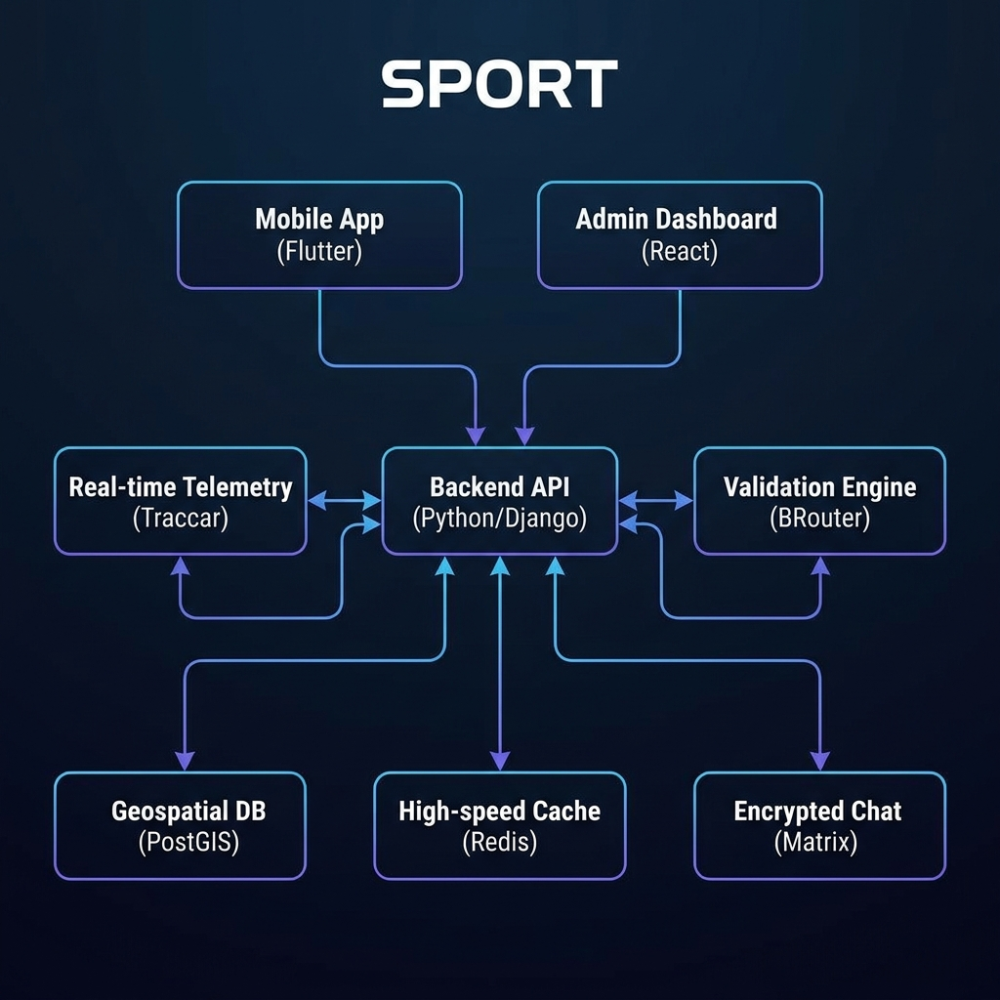

# PROJECT CONSTITUTION: "SPORT"

## 1. Mission and Identity
A B2B/B2C sports platform built 100% on **Permissive Open Source** foundations and a rigorous **Safety Constitution** (AI Quality Standards). The project aims to provide advanced telemetry, gamification, and social tools while maintaining full commercial freedom (White-Label) without the risk of copyleft (GPL) infection.

## 2. Tech Canon (Permissive Stack)
Strictly selected components to ensure business security:
- **Telemetry Core**: Traccar (Apache 2.0).
- **Mobile Tracking**: OpenTracks (ISC).
- **Validation and Map-Matching**: BRouter (MIT).
- **Map Visualization**: MapLibre GL (BSD-2/MIT).
- **Communication**: Matrix (Apache 2.0).
- **Gamification**: Redis (BSD-3-Clause).
- **Interfaces**: Flutter (BSD-3).

## 3. Visual Vision (UX/UI Manifesto)
The interface must inspire trust and motivate activity.
- **Aesthetic**: Dark mode, glassmorphism, dynamic gradients.
- **Data Visualization**: High-performance vector maps, interactive telemetry charts.
- **Projects**: Management Panel (Admin Panel) as a command center with Live view.

### User Application (Android/iOS)
#### Active Session View

#### Community and Clans (Matrix Chat)

#### Privacy Zones Configuration

#### Rewards and Sponsors Marketplace

### Management Panel (Web/Windows)
#### Main Dashboard

#### Anti-Cheat Verification (Deep Dive)

#### City Analytics (Heatmaps)

## 4. System Architecture
### High-Level Architecture Overview

### Offline-First Model
The mobile app treats the local database (SQLite) as the single source of truth during an activity. Synchronization with the server occurs asynchronously (batching), minimizing battery consumption.

### Anti-Cheat System
Every GPX track is topologically validated by the BRouter engine. The system detects GPS "drifting" and cheating attempts (e.g., driving a car instead of running) through physical parameter analysis and OpenStreetMap topology.

### Leaderboards and Gamification
The use of **Sorted Sets** in Redis allows for instantaneous recalculation of rankings for millions of users with minimal overhead.

## 5. Privacy and Security
- **Privacy Zones**: Dynamic track masking near sensitive locations (home, work).
- **E2EE**: End-to-end encryption via the Matrix protocol.
- **Anonymization**: Variable-radius vector clipping triangulation.

## 6. Operational Standards (AI Toolkit)
The project applies strict **[Safety Constitution](./ai_toolkit_constitution.md)** rules, including:
- Article I: Safety First (no data loss, no blind execution).
- Article VI: Repair Discipline (no dead code, immediate bug fixes).
- Planning before implementation and evidence-based verification before task completion.

## 7. Commercial Model
- **B2B (Corporate Wellness)**: SaaS model with full client branding.
- **B2C (Freemium)**: Advanced training plans and premium maps.
- **Sponsors POI**: Dynamic partner points on the map with a voucher system.

## 8. Coding and Documentation Standards

To ensure the "SPORT" project is maintainable and readable for any professional developer, we strictly adhere to the following standards:

### 8.1 Python (Backend)
- **Tooling**: We use **Ruff** as our unified linter and formatter (replaces flake8, isort, black, and pyupgrade). Configuration is centralized in `pyproject.toml`.
- **Typing**: Strict type hints are required for all public APIs and core business logic. Use `mypy` or `pyright` for static analysis. Prefer `list[str]` over `typing.List[str]`.
- **Data Models**: Use **Pydantic v2** or **dataclasses** for structured data. Avoid raw dictionaries for complex objects.
- **Testing**: **pytest** is our standard testing framework. Follow the Arrange-Act-Assert (AAA) pattern.
- **Docstrings**: Use **Google Style** docstrings for all functions, classes, and modules.

### 8.2 TypeScript (Frontend/Mobile)
- **Tooling**: **ESLint** (Flat Config) for code quality and **Prettier** for formatting.
- **Type Safety**: `strict: true` must be enabled in `tsconfig.json`. Avoid `any` at all costs; use `unknown` if the type is truly uncertain.
- **Runtime Validation**: Use **Zod** for schema validation at the system boundaries (API responses, form inputs).
- **Naming Conventions**: 
  - Variables/Functions: `camelCase`
  - Classes/Types/Interfaces: `PascalCase`
  - Constants: `UPPER_SNAKE_CASE`
  - Files/Folders: `kebab-case` (e.g., `user-profile-service.ts`)
- **Documentation**: Use **JSDoc** for all public functions and interfaces.

### 8.3 Documentation and Architecture
- **Architecture Decisions**: Major architectural changes must be documented using **ADR** (Architecture Decision Records) in the `docs/adr/` directory.
- **Project Docs**: All internal documentation must be written in **Markdown** and kept in the `docs/` folder.
- **Comments**: Code should be self-documenting. Use comments only to explain "Why" something is done, not "What" is done.

### 8.4 Git and Workflow
- **Commit Messages**: Follow **Conventional Commits** (e.g., `feat:`, `fix:`, `docs:`, `refactor:`).
- **PR Rules**: All PRs must pass linting, type checking, and tests before merging. 

## 9. Performance and Data Integrity Strategy

To ensure a "lightning-fast" user experience and stable data flow under high load, the following strategies are mandatory:

### 9.1 Optimistic UI & Local-First Approach
- **Instant Feedback**: Use **TanStack Query** (Web) and **Riverpod** (Mobile) to implement optimistic updates. The UI must reflect user actions immediately, with synchronization happening in the background.
- **Conflict Resolution**: Implement robust local-first logic with automatic retries and rollback mechanisms in case of server-side failures.

### 9.2 Asynchronous Processing & Task Queues
- **Worker Pattern**: Heavy computational tasks, such as GPX validation via BRouter or leaderboard recalculations, must be handled off-thread using **Celery** or **Redis Queue (RQ)**.
- **Non-blocking API**: The API should acknowledge data receipt immediately and notify the user of results via WebSockets or Push Notifications once background processing is complete.

### 9.3 Data Efficiency & Batching
- **GPS Batching**: GPS points must be batched locally and sent to the server in compressed chunks (e.g., via optimized JSON or Protocol Buffers) to minimize battery drain and network overhead.
- **Exponential Backoff**: Implement smart retry logic for network requests to prevent "thundering herd" issues during server recovery.

### 9.4 Geospatial Optimization (PostGIS)
- **GIST Indexing**: All spatial columns must be indexed using GIST to ensure sub-millisecond query times for geofencing and proximity checks.
- **Geometry Simplification**: Use algorithms like **Douglas-Peucker** to store simplified versions of tracks for high-speed map previews, while preserving high-resolution raw data for analytical validation.

### 9.5 Real-time Scalability
- **Redis Pub/Sub**: Use Redis as a message broker for WebSockets to scale real-time telemetry updates across multiple server nodes efficiently.
- **Multiplexing**: Minimize active WebSocket connections by multiplexing data streams based on user context (e.g., current clan or city view).

### 9.6 Map Performance
- **Vector Tiles & CDN**: Utilize **Vector Tiles** (PMTiles or similar) served via CDN to offload map rendering from the application server and ensure global low-latency map availability.

## 10. Security and Privacy Governance

Security is the foundation of user trust in a location-based sports application. The following security measures are mandatory:

### 10.1 User Privacy (Privacy-by-Design)
- **Dynamic Privacy Zones**: Automatic masking of start/finish points within a user-defined radius (e.g., home, work).
- **Data Minimization**: Only collect and retain GPS data necessary for route validation. Raw tracks should be purged or anonymized after processing according to user preferences and GDPR.
- **E2EE Communication**: All social interaction (clan/city chats) must be end-to-end encrypted via the Matrix protocol.

### 10.2 API and Server Security
- **Rate Limiting & Throttling**: Protection against Brute Force attacks and API abuse using Redis-based rate limiters.
- **Modern Auth**: Implementation of JWT-based authentication with short-lived Access Tokens and secure Refresh Tokens (OAuth2 standard).
- **CORS & CSP**: Strict Cross-Origin Resource Sharing and Content Security Policies to prevent XSS and data injection attacks.

### 10.3 Data Protection
- **Encryption at Rest**: Databases (PostgreSQL/PostGIS) and storage buckets must be encrypted at rest.
- **Secret Management**: Absolute prohibition of committing secrets to the repository. Use environment variables or managed secret stores (e.g., HashiCorp Vault, AWS Secrets Manager).
- **SQL Injection Prevention**: Mandatory use of ORMs with parameterized queries for all database interactions.

### 10.4 Auditing and Compliance
- **Audit Logs**: Maintain immutable logs of all administrative actions (e.g., manual route approval, user bans).
- **Automated Security Scanning**: Continuous scanning of dependencies for known vulnerabilities (CVEs) using tools like `ruff` and GitHub Dependabot.

## 11. Internationalization and Localization (i18n/L10n)

The "SPORT" platform is designed from the ground up to be **multi-language** and multi-regional.

### 11.1 Language Standards
- **Primary Development Language**: English (Code, Commits, Technical Documentation).
- **Default End-User Locale**: **Polish (pl_PL)**.
- **Supported Launch Locales**: English (en_US), Polish (pl_PL).

### 11.2 Implementation Strategy
- **Frontend/Mobile**: Use standard i18n libraries (e.g., `react-i18next` for web, `easy_localization` or `flutter_localizations` for Flutter).
- **Backend**: Implement locale-aware API responses. Error messages and notifications must be localized based on the user's preferred language.
- **Externalization**: No user-facing strings should be hardcoded. All text must be stored in localization files (e.g., JSON or ARB).
- **Date/Currency**: Use international standards for date formatting (ISO 8601) and currency handling to ensure consistency across regions.

## 12. Authentication and Financial Infrastructure

### 12.1 Authentication (AuthN/AuthZ)
- **Multi-Channel Login**: Support for Social Auth (Google, Apple ID, Facebook) and traditional Email/Password.
- **B2B Single Sign-On (SSO)**: Integration with Enterprise IDPs (Azure AD, Okta, SAML) for corporate clients.
- **Passwordless Flow**: Implementation of Magic Links and OTP (One-Time Password) for frictionless onboarding.
- **MFA**: Optional Multi-Factor Authentication for administrative and moderator accounts.

### 12.2 Payments and Billing
- **Subscription Management**: Integration with **Stripe** or **Adyen** for B2C premium plans (monthly/annual).
- **B2B Invoicing**: Automated billing system for corporate licenses and seat management.
- **PCI DSS Compliance**: No sensitive payment data is stored locally; all transactions are handled via PCI-compliant processors.
- **Virtual Economy**: Support for "Vouchers" and "Points" exchangeable for sponsor rewards.

## 13. AI and Data Intelligence Strategy

The "SPORT" platform leverages data to provide value beyond simple tracking:
- **Predictive Insights**: Use lightweight ML models to identify patterns of overtraining or suggest rest days.
- **Smart Routing**: Recommendation engine for routes based on user preferences (elevation, surface type, popularity).
- **Automated Anti-Cheat**: AI-enhanced anomaly detection to identify non-human movement patterns (e.g., motorized transport spoofing).

## 14. CI/CD and Quality Assurance Standards

### 14.1 Automation Pipeline
- **Continuous Integration**: Automated linting, type checking, and unit tests run on every Pull Request.
- **Continuous Deployment**: Automated deployments to staging/production environments following a successful merge.
- **Canary Releases**: Ability to roll out features to a percentage of users to monitor stability before full deployment.

### 14.2 Testing Strategy
- **Visual Regression**: Automated screenshot testing to ensure UI consistency across different device resolutions.
- **E2E Testing**: Critical paths (Login, Start Session, Payment) must be covered by End-to-End tests (Playwright/Cypress/Appium).
- **Performance Budgets**: Monitoring of API response times and mobile frame rates (FPS) to maintain high responsiveness.

## 15. Governance and User Roles

The "SPORT" platform follows a hierarchical access control model to ensure secure and efficient management.

### 15.1 Project Owner (akarn)
- **Supreme Authority**: Full access to all system modules, global financial reports, and infrastructure configurations.
- **Constitutional Control**: Only the Project Owner can authorize changes to the Project Constitution and Core AI Safety standards.
- **Administrative Oversight**: Power to appoint and revoke Global Administrators.

### 15.2 Global Administrator
- **B2B Management**: Oversight of corporate and municipal clients (tenants).
- **Global Anti-Cheat Tuning**: Authority to adjust validation thresholds for the entire platform.
- **Security Monitoring**: Access to system-wide audit logs and security alerts.

### 15.3 Local Moderator (Tenant Level)
- **Community Management**: Management of clans, users, and local challenges within a specific B2B tenant.
- **Route Verification**: Manual review of flagged tracks and handling of user disputes.

### 15.4 End User (Athlete)
- **Personal Profile**: Management of personal data, privacy zones, and training history.
- **Social Interaction**: Participation in clans, cities, and leaderboard competitions.
