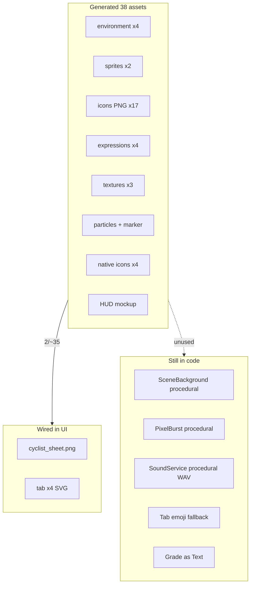

# Grand Prix UI Consistency Audit — Post-Asset Integration Roadmap

| | |
|--|--|
| **Status** | Active (historical handoff) |
| **Date** | 2026-06-13 |
| **Owner role** | Mobile Lead / Design |
| **Audience** | Mobile engineers, designers, frontend |
| **lang** | en |
| **translation** | [Polski](../pl/design/GRAND_PRIX_UI_CONSISTENCY_AUDIT.md) |
| **canonical_path** | docs/design/GRAND_PRIX_UI_CONSISTENCY_AUDIT.md |
| **Related** | [DESIGN_SYSTEM_MOBILE.md](./DESIGN_SYSTEM_MOBILE.md) · [MOBILE_ASSET_NANO_BANANA_PROMPTS.md](./MOBILE_ASSET_NANO_BANANA_PROMPTS.md) · [ADR 014](../adr/014-mobile-immersive-pixel-art-and-bike-computer.md) |

---

Full audit after the **Nano Banana Pro** asset pack landed in repo (`assets/generated/`, `mobile/assets/generated/`, native icons in `mobile/assets/`). **Assets are done; UI integration is not.**

**Commits (2026-06-13):** `c7f5210` (38 assets + SSOT pipeline), `4cb7586` (regenerated currency/GPS/HUD/native icons).

> **Important:** this audit contains historical implementation snapshots from the integration phase. Treat operationally current status as defined by:
> - `docs/design/4VELO_MOBILE_FULL_VISION_IMPLEMENTATION.md`
> - `docs/design/MOBILE_REQUIREMENTS_TRACEABILITY_MATRIX.md`
> - `docs/pl/operations/MOBILE_FULL_VISION_VERIFICATION.md`

## Execution snapshot (2026-06-14)

- This audit is kept as historical integration record.
- Operationally current status is tracked in:
  - `docs/design/4VELO_MOBILE_FULL_VISION_IMPLEMENTATION.md`
  - `docs/design/MOBILE_REQUIREMENTS_TRACEABILITY_MATRIX.md`
  - `docs/en/operations/MOBILE_SPRINT1_REVIEW_PACKET.md`
- Mobile technical gates currently green:
  - `pnpm exec tsc --noEmit`
  - full Jest suite (`19/19` suites, `97/97` tests)
- Remaining release blockers are operational only:
  - manual device QA matrix (Android/iOS),
  - final cross-functional GO/NO-GO sign-off.

---

## Executive summary

| Area | Status |
|------|--------|
| Asset generation pipeline | Done — SSOT prompts, reference image, character lock |
| Bundled PNGs (37 + sfx JSON) | Done — `mobile/assets/generated/` |
| Native app icons | Done — `mobile/assets/icon.png` etc. |
| **Wired in UI** | **Integrated** — tabs, scenes, HUD, game chrome, particles, sfx, hero prefs (PR1–PR7) |
| Design tokens | Split across 4 sources — not Grand Prix aligned |
| Fonts | Press Start 2P name mismatch; VT323 missing |
| Active Ride HUD | Far from sun-readability mockup spec |
| Scene / particles / sounds | Still procedural placeholders |

**Senior takeaway:** the asset pipeline is ready; **visual integration and design system consolidation lag behind**. Users currently see a mix: new hero on old flat backgrounds, emoji instead of PNG icons, English labels instead of PL HUD mockup.

---

## Current state diagram



---

## Wired vs not wired

### Wired

| Consumer | Asset | Path |
|----------|-------|------|
| `SpriteAnimator.tsx` | cyclist sheet | `sprites/cyclist_sheet.png` |
| `CyclistSprite` → many screens | via SpriteAnimator | Dashboard, Summary, Map overlay, etc. |
| `tabIcons.ts` → `PixelTabIcon` | 4× **SVG** (not PNG) | `icons/tab_*.svg` |

### Not wired (bundled, unused)

| Asset IDs | Notes |
|-----------|-------|
| `tab_*` PNG, `tab_history` | PNGs exist; code uses SVG |
| `grade_s`…`grade_d` | Rank shown as styled `Text` |
| `power_*`, `currency_*` | Text/emoji bars |
| `cyclist_idle/happy/tired/victory` | Sheet used instead of expression PNGs |
| `ghost_sheet` | No ghost pace UI |
| `env_*` (4 layers) | `SceneBackground` uses flat stitch colors |
| `particle_atlas` | No `ParticleSystem`; `PixelBurst` is procedural |
| `map_marker_cyclist` | Map uses `CyclistSprite` overlay |
| `parchment_grain`, `metal_plate`, `wood_grain` | No `ImageBackground` |
| `sfx_params` | `SoundService` uses in-memory tones |
| `manifest.ts` | Zero runtime imports |
| `active_ride_hud_mockup` | Marketing/layout reference only |

---

## Phase 0 — Foundation (blocks everything)

### 0.1 Fonts

| Issue | Files |
|-------|-------|
| `App.tsx` loads `'Press Start 2P'`, components use `'PressStart2P'` → system fallback | `mobile/App.tsx`, `PixelText.tsx`, `ArcadeButton.tsx`, `RetroInput.tsx` |
| VT323 not loaded — spec requires VT323 for HUD numbers | [DESIGN_SYSTEM_MOBILE.md §3](./DESIGN_SYSTEM_MOBILE.md) |

**Action:** load VT323 + Press Start 2P; normalize one family name (alias in `useFonts`); apply in `DataFieldCell`, `ArcadeButton`, status bar.

### 0.2 Single token SSOT

Four parallel color systems:

- `mobile/src/theme/stitch.ts` — active Unistyles theme
- `@4velo/tokens` / octopath-solar — used by `PixelText`, `ArcadeButton`, `GameCard` while theme = `stitch`
- Generator palette — hardcoded in `PixelTabIcon`, `PixelBurst`
- Inline hex in screens (`CityHubScreen`, `ArcadeButton`)

**Critical conflicts:** `parchment` `#F5F5DC` (stitch) vs `#2D2418` (tokens); `goldAmber` `#FFB800` vs `#D4A373` (Grand Prix).

**Action:** align `stitch.ts` with [MOBILE_ASSET_NANO_BANANA_PROMPTS.md §4](./MOBILE_ASSET_NANO_BANANA_PROMPTS.md); add `hudPanel`, `hudOutline`, `hudShadow`, `scrimStrong/Soft`; route legacy components through `theme.colors`.

### 0.3 Runtime asset registry

`mobile/src/assets/manifest.ts` — catalog only, no UI imports.

**Action:** add `mobile/src/assets/assetRegistry.ts` — typed static `require()` map (Metro needs static paths):

```typescript
export const ASSETS = {
  icons: { tab_home: require('../../assets/generated/icons/tab_home.png'), /* ... */ },
  environment: { sky_day: require('../../assets/generated/environment/sky_day.png'), /* ... */ },
} as const;
```

---

## Phase 1 — Asset wiring (P0 visual consistency)

### 1.1 Tab bar: SVG → PNG

| Now | Target |
|-----|--------|
| `tabIcons.ts` imports 4× `.svg` | PNG from `icons/tab_*.png` |
| `PixelTabIcon` emoji when immersive OFF | PNG always (immersive default ON) |

**Action:** `Image` + `resizeMode: 'contain'` + integer scale ([DESIGN_SYSTEM §8](./DESIGN_SYSTEM_MOBILE.md)); remove SVG after migration.

### 1.2 SceneBackground: procedural → parallax PNG

| Now | Target |
|-----|--------|
| `SceneBackground.tsx` flat `View` + stitch tokens | 4 PNG layers: `sky_day`, `hills_far`, `town_mid`, `road_near` |
| `theme/scenes.ts` placeholder comment | `screenId → layers[]` registry |

**Consumers:** Splash, Auth, Onboarding, Dashboard, Summary, Profile, CityHub, ExploreHub.

**Action:** `ParallaxLayer` (Reanimated); horizontal tile; `useMotionDegrade` disables parallax on low FPS.

### 1.3 ParticleSystem + atlas

Replace `PixelBurst.tsx` procedural squares with Skia `drawAtlas` + `particle_atlas.png`. Use on Ride Summary; minimal on HUD (focus zone).

### 1.4 Game chrome icons

| Asset | Wire into |
|-------|-----------|
| `grade_s`…`grade_d` | `ShareResultCard`, Ride Summary rank |
| `currency_xp/coin/energy` | `LevelXpBar`, `EnergyBar`, `DailyQuestCard` |
| `power_*` | Marketplace / power-up UI |

### 1.5 UI textures

`parchment_grain`, `metal_plate`, `wood_grain` → subtle `ImageBackground` on `GameCard`, HUD frames (5–8% opacity).

### 1.6 Sounds

Wire `SoundService.ts` to `sfx_params.json`; keep procedural fallback offline.

---

## Phase 2 — Active Ride HUD (focus zone, P0 safety)

Layout reference: `assets/generated/marketing/active_ride_hud_mockup.png` — **HUD chrome only**, not composited 2.5D scene under live data ([ADR 014 §2](../adr/014-mobile-immersive-pixel-art-and-bike-computer.md)).

| Spec ([DESIGN_SYSTEM §3](./DESIGN_SYSTEM_MOBILE.md)) | Status |
|------------------------------------------------------|--------|
| Status bar: GPS lock, battery %, clock | Missing |
| Framed panels 1–2px outline + pixel shadow (tokens) | Partial — `borderWidth: 4`, hardcoded |
| VT323 numbers + Press Start 2P labels | Missing |
| PL labels via i18n (`PRĘDKOŚĆ`, `DYSTANS`, …) | Missing — English `defaultLabel` |
| Action bar: STOP / PAUSE / RESUME (3 large buttons) | Vertical stack |
| STOP confirm (long-press / slide) | Missing |
| Map + marker only | OK — `RideMapView` |
| Remove `SpeechBubble` / `EnergyBar` from live ride | Still shown when immersive ON |

**New components:** `RideStatusBar`, `RideActionBar`, `HudDataFieldCell` (refactor `DataFieldCell`).

**i18n:** add `ride.fields.*` in `strings.pl.ts` / `strings.en.ts`; wire `labelKey` from `dataFields.ts`.

**Map marker:** keep `CyclistSprite` on map (recommended); optional `map_marker_cyclist.png` fallback for reduced motion. Sync `retro-ride-style.json` with stitch/Grand Prix tokens.

---

## Phase 3 — Configurable hero (P1)

Per [MOBILE_ASSET_NANO_BANANA_PROMPTS.md §2](./MOBILE_ASSET_NANO_BANANA_PROMPTS.md):

- One base sprite (`cyclist_sheet`, `cyclist_idle`)
- Helmet = palette-swap (default red `#CC4444`)
- Jersey city text = **i18n decal overlay**, not baked PNG

**Action:** Skia decal on `CyclistSprite`; MMKV `heroHelmetColor`, `heroCityText`; use expression PNGs on Summary/Profile; `ghost_sheet` for pace comparison (backlog).

---

## Phase 4 — Polish (P2)

| Item | Action |
|------|--------|
| Share card 1080×1920 | Skia snapshot in `ShareResultCard` |
| GPS lost / offline banners | Pixel-art chrome in `GpsRecoveryBanner` |
| Haptics | HUD → `HapticService` (not raw `expo-haptics`) |
| Voice cues | `VoiceCueService` turn-by-turn TTS |
| `SkiaMetrics.tsx` | Remove or wire (dead code) |
| octopath/solar legacy | Deprecate in `unistyles.ts` |
| Post-process | Quant UI chrome only — not scenes ([prompts §18](./MOBILE_ASSET_NANO_BANANA_PROMPTS.md)) |

---

## Phase 5 — QA and rollout

- Maestro smoke: tab PNG, parallax, HUD sun-readability
- Visual regression snapshots (Dashboard, Active Ride, Summary)
- `immersiveTheme` default ON — remove emoji fallback after PNG migration
- `useFrameBudgetMonitor` + degrade particles/parallax ([ADR 012](../adr/012-mobile-performance-budgets.md))
- Monitor APK size (~35 PNG bundle)

---

## Recommended PR sequence

| PR | Scope | Estimate |
|----|-------|----------|
| **PR1** | Fonts + token SSOT + `assetRegistry.ts` | 1–2 days |
| **PR2** | Tab PNG + grade/currency icons | 1 day |
| **PR3** | SceneBackground parallax PNG | 2 days |
| **PR4** | Active Ride HUD (status bar, action bar, i18n, typography) | 2–3 days |
| **PR5** | ParticleSystem + textures + SoundService sfx | 1–2 days |
| **PR6** | Configurable hero + expression portraits | 2 days |
| **PR7** | Share card, edge states, legacy cleanup | 1–2 days |

**Total:** ~10–14 working days to full visual consistency end-to-end.

---

## Checklist (copy to sprint board)

- [x] **f0-fonts-tokens** — Press Start 2P alias (`PressStart2P`) + VT323 loaded in `App.tsx`; `stitch.ts` palette aligned to Grand Prix anchors (`goldAmber` `#D4A373`, `parchment` `#F5E6CC`) + `hudPanel`/`hudPanelNight`/`hudOutline`/`hudShadow` + `gp*` anchors added. _Follow-up: route legacy `@4velo/tokens` components (`PixelText`, `ArcadeButton`) through `theme.colors` (tracked under f4)._
- [x] **f0-asset-registry** — `mobile/src/assets/assetRegistry.ts` typed static `require()` map
- [x] **f1-tab-png** — `tabIcons.ts` PNG via `assetRegistry`; `PixelTabIcon` integer-scale; emoji/SVG fallback removed
- [x] **f1-scene-parallax** — 4 environment PNG layers in `SceneBackground` + `scenes.ts` registry + motion degrade
- [x] **f1-particles-textures** — `ParticleSystem` (atlas tiles) + `TextureBackground` on cards/HUD; `PixelBurst` delegates to atlas
- [x] **f1-game-icons-sfx** — grade/currency PNG in game UI; `SoundService` reads `sfx_params.json` with procedural fallback
- [x] **f2-hud-chrome** — `RideStatusBar` + `RideActionBar` + `HudDataFieldCell` / `DataFieldCell` hudMode on Active Ride
- [x] **f2-hud-i18n** — `ride.fields.*` + `ride.actions.*` PL/EN; wired via `useI18n` in cells and action bar
- [x] **f3-configurable-hero** — `HeroPreferencesService` (helmet + city decal); expression PNGs on Summary via `expressionMode`
- [x] **f4-polish** — share card 1080×1920 constants + grade PNG; GPS banner pixel chrome + i18n; `HapticService` on tab/HUD; `SkiaMetrics` removed; octopath/solar deprecated in `unistyles.ts`

---

## Consistency drift — 2026-06-13 (post UX/routing redesign)

Resolved in mobile UX & routing redesign pass:

| Drift | Fix |
|-------|-----|
| Emoji chrome (⚙️⚔️🏆) on Ride/CityHub/Profile | `ChromeIcon` + `chromeIcons.ts` PNG mapping |
| Brand split (`4VELO` / `QUEST VELOS`) | `APP_BRAND_NAME` = **4VELO** (`theme/brand.ts`) |
| Solar White cards on GP chrome | Light GP tints in `stitch.ts` (`#FBF3E2` bg, `#F5E6CC` surface); rival bar uses `rival` `#1F4E5F` not error red |
| Boolean overlay routing (`showSettings`, etc.) | Native Stack over Tab (`NavigationShell` + `navigation/types.ts`) |
| Fake progression defaults (4200 XP) | `progression.ts` zeros; Ride/Profile read API history |
| `Alert` for start-ride failure | `EdgeStateBanner` on Ride dashboard via `startRideError` state |
| Auth sci-fi strings hardcoded EN | `auth.*` i18n keys + GP parchment card chrome |
| Settings fake read-only rows | `RiderPreferencesService` editable weight/HR/haptics |
| Summary XP duplicate | XP only in `ShareResultCard`; banner removed |
| HUD null sensor slots | `fieldHasValue` hides empty cells in `hudMode` |
| MOO easter egg broken (empty toggle) | Speech bubble on City Wars tap with auto-dismiss + `t.compete.moo` |
| Duplicate POI rows on map list | Dedup by id/name+coords in `ExploreMapScreen` |
| Explore tab internal Shop/Map tabs | Marketplace tab + stack `ExploreMap` screen |

**Still open:** full device QA pass with Remote JS Debugging OFF; battery % in RideStatusBar when native module available.

---

## Do NOT do (pitfalls)

- Do **not** composite `active_ride_hud_mockup` as a live ride layer — layout reference only ([ADR 014 §2](../adr/014-mobile-immersive-pixel-art-and-bike-computer.md)).
- Do **not** hard-quantize scenes/portraits in postprocess — flattens Grand Prix palette.
- Do **not** generate N sprite sheets per city — helmet swap + decal only.
- Do **not** mix SVG tab icons with PNG bundle — delete SVG after migration.

---

## Regenerate assets (if needed)

```bash
python scripts/generate_assets.py --no-deepseek --save-prompts --delay 2.5
python scripts/bundle_mobile_assets.py
```

Single asset: `python scripts/generate_assets.py --asset cyclist_idle --no-deepseek --save-prompts`

Prompt audit: `assets/generated/prompts/<id>.txt`
