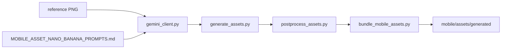

# Mobile Asset Prompts — Nano Banana SSOT (Cyklo-Siedlce Grand Prix)

| | |
|--|--|
| **Status** | Active (living spec) |
| **Owner role** | Mobile Lead / Design |
| **Last reviewed** | 2026-06-13 |
| **Audience** | Mobile engineers, designers, asset pipeline |
| **lang** | en |
| **translation** | [Polski](../pl/design/MOBILE_ASSET_NANO_BANANA_PROMPTS.md) |
| **canonical_path** | docs/design/MOBILE_ASSET_NANO_BANANA_PROMPTS.md |
| **Decision record** | [ADR 014](../adr/014-mobile-immersive-pixel-art-and-bike-computer.md) |
| **Design SSOT** | [DESIGN_SYSTEM_MOBILE.md](./DESIGN_SYSTEM_MOBILE.md) |

---

This is the canonical source of truth for **generating every mobile visual asset** in the Cyklo-Siedlce Grand Prix art direction. Each asset has a copy-paste prompt written the way a senior pixel-art director would brief **Nano Banana Pro** (`gemini-3-pro-image`) with the reference sheet attached.

These prompts **supersede** the older descriptions embedded in [`scripts/asset_definitions.py`](../../scripts/asset_definitions.py), which describe a flat Stitch palette and a gold-helmet hero that does not match the target.

## 1. Reference sheet (attach to every call)

The visual target is the user-authored concept frame:


`docs/design/reference/cyklo-siedlce-grand-prix.png` — attach this image as an input on **every** Nano Banana request. It locks art direction, palette, hero design and crowd/town energy. Without it, the model drifts to generic pixel art.

**How to attach:**

- **AI Studio:** upload the PNG in the prompt box, then paste the per-asset prompt.
- **Gemini API (Python, `google-genai`):**

```python
from google import genai
from google.genai import types

client = genai.Client()
ref = client.files.upload(file="docs/design/reference/cyklo-siedlce-grand-prix.png")
resp = client.models.generate_content(
    model="gemini-3-pro-image",
    contents=[ref, PROMPT_TEXT],
    config=types.GenerateContentConfig(response_modalities=["IMAGE"]),
)
```

## 2. Hero character bible (canon = silhouette + proportions; skin = configurable)

The hero is **configurable per player**. What is **locked canon** (never changes) is the silhouette, proportions and perspective; what is **theming** (driven by the onboarding city / customization) is the helmet color and the city text on the jersey.

**Locked canon (every cyclist asset):**

- **Proportions:** caricatured / chibi — **large head, small body**. This is the signature look; do not draw realistic proportions.
- **Perspective (in-world cyclist — sprite, marker):** **isometric, behind-the-back (rear three-quarter)** view, as in the reference scene. Portraits stay front-facing bust.
- **Bike:** dark charcoal road bike, drop bars, thin frame.
- **Rendering:** clean sharp pixels, vibrant saturated colors, 16-bit feel.
- **Mood:** energetic, humorous arcade-sports exaggeration (Sensible Soccer-style readability).
- **Jersey template:** **blue-dominant** with a clear flat area reserved for a city name.

**Configurable (theming layer, NOT baked per sprite):**

- **Helmet color:** default **bright red** aero helmet with white visor highlight; recolorable via palette-swap.
- **Jersey city text:** default **"SIEDLCE"**; the city comes from onboarding (e.g. `"MIŃSK MAZ."`). Render the text as an **i18n decal/overlay on top of the sprite**, not as pixels baked into the PNG — so one base sprite serves every city.

> The reference scene shows the **default** configuration (red helmet, blue/yellow "SIEDLCE"). A green helmet + `"MIŃSK MAZ."` jersey is simply another valid configuration of the same hero, NOT a different character.

**v1 scope:** ship **one** base sprite (default red + "SIEDLCE"); per-city variation = helmet palette-swap + jersey text decal at runtime. Do **not** generate N full per-city sprite sheets. Do **not** use the legacy gold-helmet / deep-sea-jersey description, and do **not** draw a lean realistic racer.

### Proven example prompt (character lock)

This exact prompt produced an on-style hero and is the canonical seed for `cyclist_idle` / `cyclist_sheet` / `map_marker_cyclist` (generate the **default** SIEDLCE config; the city text is replaced by a decal at runtime):

```
A single caricatured pixel art cyclist in 16-bit style, viewed from an isometric
behind-the-back perspective. Large head, small body, wearing a blue and yellow jersey
with 'SIEDLCE' text. Clean sharp pixels, vibrant colors, on a plain white background
for a clean preview. Character only, no background elements.
```

Generate the hero on a **plain white background** for a clean preview, then trim to transparent in post-process before bundling.

## 3. Global style block (prefix every prompt)

Prepend this to each per-asset prompt (the per-asset text then adds subject + framing):

```
Match the attached reference image "Cyklo-Siedlce Grand Prix" exactly in art direction:
16-bit SNES/GBA-quality pixel art, isometric Polish small-town bike-race energy,
vibrant saturated palette, clean sharp pixels, crisp 1px black outlines (no blur, no anti-aliasing).
Hero cyclist: caricatured large-head/small-body build, blue-and-yellow jersey with white "SIEDLCE" text,
bright red aero helmet, dark charcoal road bike, isometric behind-the-back (rear three-quarter) view.
World cues: cobblestone street, cafe/shop awnings, cheering pixel crowd, playful arcade HUD vibe.
Output exactly {WIDTH}x{HEIGHT}px PNG, {BACKGROUND}, no watermark, no extra logo or caption text unless specified.
```

**Shared negatives** (append to every prompt): `flat procedural blocky shapes, Imagen-style smear, gradient blur, anti-aliased soft edges, wrong hero (gold helmet / deep-sea jersey / realistic lean proportions), random English words baked into sprite sheets, photorealism, vector/SVG flat-icon look, drop shadows.`

## 4. Palette reference (token anchors)

Scenes may be richer/more saturated than UI chrome; UI chrome keeps Stitch tokens for legibility (see [DESIGN_SYSTEM_MOBILE.md](./DESIGN_SYSTEM_MOBILE.md) §5).

| Token | Hex | Use |
|-------|-----|-----|
| deepSea | `#0B1D33` | icon backgrounds, jersey shadow, sky top |
| goldAmber | `#D4A373` | UI accents, banners, spokes |
| goldLight | `#EDD9B0` | highlights |
| forestGreen | `#7BA05B` | energy bar, foliage, hills |
| cream | `#F5E6CC` | parchment, skin highlight, clouds |
| sepia | `#C8B098` | ghost, dust, far hills |
| error | `#CC4444` | red helmet, danger, hearts |
| warning | `#E8A840` | energy bolt, bronze |
| silver | `#A0A0A0` | bike frame, A-rank |
| industrial | `#4A4A4A` | road asphalt, C-rank |
| metalGray | `#2B303A` | metal plate texture |

## 5. Generation order (recommended)

1. **Character lock:** `cyclist_idle` first, then reuse it (img2img + same described seed) for `cyclist_sheet` so frames stay coherent.
2. `ghost_sheet` (same silhouette, sepia dither).
3. Remaining portraits: `cyclist_happy`, `cyclist_tired`, `cyclist_victory`.
4. Environment: `env_sky_day` → `env_hills_far` → `env_town_mid` → `env_road_near`.
5. `particle_atlas`, `map_marker_cyclist`, textures.
6. UI icons (17 PNG).
7. Native icons (4, Phase 14).

Budget: ~36 Nano Banana Pro calls; 2–3 s delay between requests to respect rate limits.

---

## 6. Asset inventory

| Group | Count | IDs | Format | Size |
|-------|-------|-----|--------|------|
| Tab bar | 5 | `tab_home` … `tab_profile` | PNG | 24×24 |
| Grade badges | 5 | `grade_s` … `grade_d` | PNG | 32×32 |
| Power-ups | 4 | `power_speed` … `power_gps` | PNG | 24×24 |
| Currency | 3 | `currency_xp/coin/energy` | PNG | 16×16 |
| Portraits | 4 | `cyclist_idle/happy/tired/victory` | PNG | 64×64 |
| Sprite sheets | 2 | `cyclist_sheet`, `ghost_sheet` | PNG | 512×64, 256×64 |
| Parallax env | 4 | `env_sky_day` … `env_road_near` | PNG | 512×128/96/64 |
| Particles / map | 2 | `particle_atlas`, `map_marker_cyclist` | PNG | 128×32, 32×32 |
| UI textures | 3 | `parchment_grain`, `metal_plate`, `wood_grain` | PNG | 128×128 tile |
| Native (Phase 14) | 4 | `app_icon`, `splash_icon`, `adaptive_icon`, `favicon` | PNG | 1024 / 1280 / 432 / 48 |
| Marketing / layout | 1 | `active_ride_hud_mockup` | PNG | 1080×1920 |
| Excluded | 1 | `sfx_params` | JSON | jsfxr presets, not an image |

**Total image assets: 37.** `sfx_params` is documented as a non-image exception (see §11). `active_ride_hud_mockup` is a marketing/onboarding hero illustration and the canonical data-field layout reference — **not** an in-app composited layer (see §16b).

---

## 7. Tab bar icons (24×24 PNG, background `#0B1D33`)

Pixel-perfect, readable at 24px, gold (`#D4A373`) primary on deep-sea background, matching the HUD chrome seen on the reference. Single centered subject, no caption text.

### `tab_home` — bike wheel hub

| | |
|--|--|
| Path | `assets/generated/icons/tab_home.png` |
| Size | 24×24 | Model | `gemini-3-pro-image` | Reference | required |

**Prompt:** A side-on detailed bicycle wheel as a tab-bar icon: circular hub centered, 6 straight gold spokes, thin tire ring, gold `#D4A373` on solid `#0B1D33` background. Crisp, symmetrical, legible at 24px. Same warm gold accent tone as the HUD in the reference.

### `tab_history` — route trail

**Prompt:** A winding route trail with 3–4 waypoint dots for an activity-log tab icon. Sepia `#C8B098` path line with clean pixel stepping, cream `#F5E6CC` waypoint dots, on `#0B1D33`. Reads as a cycling route on a map at 24px.

### `tab_ranking` — podium with bike

**Prompt:** A three-tier winners podium (1-2-3) with a tiny bike silhouette on the top step. Gold `#D4A373` first place, silver `#A0A0A0` second, sepia `#C8B098` third, on `#0B1D33`. Clear distinct step heights at 24px.

### `tab_rewards` — trophy cup

**Prompt:** A classic trophy cup with a subtle bike-chain link pattern on the cup body. Gold `#D4A373` trophy with `#EDD9B0` highlights, on `#0B1D33`. Bold readable trophy silhouette at 24px.

### `tab_profile` — cycling helmet

**Prompt:** A front-view aerodynamic cycling helmet with visor and vent slits as a profile tab icon. Match the hero's bright red `#CC4444` helmet with a white visor highlight, on `#0B1D33`. Recognizable helmet silhouette at 24px.

## 8. Grade badges (32×32 PNG)

Ornate achievement badges with a bold center letter and a bike-chain border pattern. Each badge keeps the arcade-sports feel of the reference's HUD.

### `grade_s`

**Prompt:** An S-rank top-tier badge: large bold letter "S" centered, ornate border with a bike-chain link pattern, gold `#D4A373` body, `#EDD9B0` highlight, 1px black outline, on transparent background. 32×32, premium feel.

### `grade_a`

**Prompt:** An A-rank badge: bold "A" centered, clean silver border, silver `#A0A0A0` body with cream `#F5E6CC` highlight, 1px black outline, transparent background, 32×32.

### `grade_b`

**Prompt:** A B-rank badge: bold "B" centered, warm bronze body using amber `#E8A840` with `#EDD9B0` highlight, 1px black outline, transparent background, 32×32.

### `grade_c`

**Prompt:** A C-rank badge: bold "C" centered, industrial grey `#4A4A4A` body with sepia `#C8B098` accent, simple border, 1px black outline, transparent background, 32×32.

### `grade_d`

**Prompt:** A D-rank lowest-tier badge: bold "D" centered, red `#CC4444` body with cream `#F5E6CC` letter, simple border, 1px black outline, transparent background, 32×32.

## 9. Power-up icons (24×24 PNG, transparent)

Game power-up tokens in the arcade style of the reference HUD.

### `power_speed`

**Prompt:** A winged bicycle wheel speed-boost token: gold `#D4A373` wheel with `#EDD9B0` feathered wings on each side, dynamic motion feel, 1px black outline, transparent, 24×24.

### `power_shield`

**Prompt:** A helmet-as-shield protection token: a cycling helmet reading as a defensive shield, forest green `#7BA05B` body with gold `#D4A373` trim, 1px black outline, transparent, 24×24.

### `power_double_xp`

**Prompt:** Two crossed bicycle silhouettes forming an X (double-XP token), gold `#D4A373` and `#EDD9B0`, clean recognizable bike shapes, 1px black outline, transparent, 24×24.

### `power_gps`

**Prompt:** An 8-point compass rose GPS-lock token: gold `#D4A373` main points, cream `#F5E6CC` secondary points, navigation feel, 1px black outline, transparent, 24×24.

## 10. Currency icons (16×16 PNG, transparent)

Tiny but legible at 16px.

### `currency_xp`

**Prompt:** An isometric XP cube orb: gold `#D4A373` cube with `#EDD9B0` top face and a tiny star glint, 1px black outline, transparent, 16×16, readable at small size.

### `currency_coin`

**Prompt:** A round gold coin with a 4-point star center: gold `#D4A373` rim, `#EDD9B0` face, 1px black outline, transparent, 16×16.

### `currency_energy`

**Prompt:** A sharp jagged lightning bolt energy token: amber `#E8A840` body with `#EDD9B0` highlight, hard angular pixel edges, 1px black outline, transparent, 16×16.

## 11. Portraits (64×64 PNG, transparent)

Big-head caricatured bust of the **hero** (blue-and-yellow SIEDLCE jersey, red aero helmet). Front-facing for the portrait (the only non-rear view). Keep identical face/helmet/jersey across all four; only the expression changes.

### `cyclist_idle`

**Prompt:** A 64×64 caricatured (large head, small body) head-and-shoulders portrait of the hero cyclist: blue-and-yellow jersey with a hint of white "SIEDLCE" collar, bright red `#CC4444` aero helmet with white visor highlight, neutral determined expression, cream skin tone, clean sharp pixels, 1px black outline, plain background. This is the canonical face — lock it for reuse.

### `cyclist_happy`

**Prompt:** Same caricatured hero portrait, big enthusiastic grin with sparkle/star glints in the eyes, celebratory mood (just set a personal best). Identical helmet/jersey/face as `cyclist_idle`. 64×64.

### `cyclist_tired`

**Prompt:** Same caricatured hero portrait, exhausted after a hard climb: drooped eyes, a sweat drop on the forehead, heavy breathing implied. Identical helmet/jersey/face as `cyclist_idle`. 64×64.

### `cyclist_victory`

**Prompt:** Same caricatured hero, both arms raised in a triumphant victory pose, wide smile, a few confetti pixels around the head. Identical helmet/jersey/face as `cyclist_idle`. 64×64.

## 12. Sprite sheets (PNG, transparent)

### `cyclist_sheet` — 8-frame pedaling

| | |
|--|--|
| Path | `assets/generated/sprites/cyclist_sheet.png` |
| Size | 512×64 (8 × 64×64) | Model | `gemini-3-pro-image` | Reference | required |

**Prompt:** A horizontal sprite sheet, exactly 8 evenly spaced 64×64 frames in ONE row (total 512×64). The caricatured hero cyclist (large head, small body, blue-and-yellow SIEDLCE jersey, bright red aero helmet, dark road bike) in isometric behind-the-back (rear three-quarter) view, pedaling; each frame a distinct pedal position completing one full 360° crank cycle. Clean sharp pixels, vibrant colors, consistent character size and palette in every frame, plain white background for clean cutting, 1px black outlines. Character only, no background elements, no ground line, no caption text, no "CYCLING SPORT" lettering.

> Lock to the §2 proven prompt: generate `cyclist_idle` first, then img2img the same character into the 8 pedaling frames so the build stays identical.

### `ghost_sheet` — 4-frame ghost float

| | |
|--|--|
| Path | `assets/generated/sprites/ghost_sheet.png` |
| Size | 256×64 (4 × 64×64) | Model | `gemini-3-pro-image` | Reference | required |

**Prompt:** A horizontal sprite sheet, exactly 4 evenly spaced 64×64 frames in ONE row (total 256×64). A translucent ghost version of the same caricatured hero cyclist (large head, small body, isometric behind-the-back view) for pace comparison, rendered in semi-transparent sepia `#C8B098` using dithering (not alpha gradient) for the ghost effect, smooth gliding float across 4 frames (no pedaling). Transparent background, consistent size, no text.

## 13. Parallax environment (PNG)

Side-scrolling layers composited bottom-up (sky → hills → town → road) under the HUD, matching the reference street scene.

### `env_sky_day` — sky band

**Prompt:** A 512×128 horizontal pixel sky band for a day scene, tileable left-right: warm gradient from deep-sea `#0B1D33` top through a forest-green `#7BA05B` horizon hint down to cream `#F5E6CC`, with a few fluffy pixel clouds. Clean 1px steps, no anti-aliasing, full-bleed (no transparency).

### `env_hills_far` — distant hills

**Prompt:** A 512×96 distant rolling-hills silhouette parallax layer: muted forest green `#7BA05B` and sepia `#C8B098`, gentle Polish countryside profile, transparent above and along the bottom edge for layering. Tileable left-right, no anti-aliasing.

### `env_town_mid` — finish-line town

| | |
|--|--|
| Path | `assets/generated/environment/town_mid.png` |
| Size | 512×128 | Model | `gemini-3-pro-image` | Reference | required |

**Prompt:** A 512×128 mid-ground parallax layer of a Polish small-town race street matching the reference: a row of 2–3 storey brick/plaster townhouses with cafe and shop awnings, a church spire, a checkered finish arch, gold `#D4A373` banner accents, and a cheering pixel crowd along the base. Transparent sky area above the rooftops for layering. Side-scroll friendly, rich saturated palette — NOT flat rectangles.

### `env_road_near` — foreground road

**Prompt:** A 512×64 foreground cobblestone/asphalt road strip for the bottom parallax layer, tileable horizontally: industrial `#4A4A4A` surface with gold `#D4A373` center dashes and a hint of cobble texture like the reference street. Flat perspective, full-bleed, 1px outlines on dashes.

## 14. Particles and map marker (PNG, transparent)

### `particle_atlas` — 4-tile FX atlas

| | |
|--|--|
| Path | `assets/generated/particles/particle_atlas.png` |
| Size | 128×32 (4 × 32×32) | Model | `gemini-3-pro-image` | Reference | required |

**Prompt:** A 128×32 particle atlas: exactly 4 distinct 32×32 tiles in one row — (1) flame puff, (2) blue sweat drop, (3) tan dust puff, (4) red heart. Flat pixels, 1px black outline per tile, transparent background, evenly spaced, no gradients. For Skia `drawAtlas`.

### `map_marker_cyclist` — top-down marker

**Prompt:** A 32×32 top-down map marker of the caricatured hero on a bike: oversized bright red `#CC4444` helmet dot, blue-and-yellow jersey, dark bike frame seen from above, 1px black outline, transparent background. Clean silhouette for a MapLibre symbol layer.

## 15. UI textures (128×128 PNG, seamlessly tileable)

Subtle surfaces for card chrome; these stay quiet so data stays legible.

### `parchment_grain`

**Prompt:** A 128×128 seamlessly tileable parchment paper-grain texture, very subtle (5–8% visible fiber), warm brown `#2D2418` fibers on cream `#F5E6CC` base, no anti-aliasing. Octopath-style idle-screen paper.

### `metal_plate`

**Prompt:** A 128×128 seamlessly tileable brushed dark-metal plate, subtle horizontal brushing, dark grey `#2B303A` / `#4A4A4A`, tough industrial Metal-Slug feel, no gradients.

### `wood_grain`

**Prompt:** A 128×128 seamlessly tileable dark wood-grain texture, warm dark brown `#2D2418` with subtle sepia `#C8B098` grain lines, organic feel, for podium/frame chrome.

## 16. Native app icons (Phase 14, PNG)

Used by `mobile/app.config.js` (`icon`, `splash.image`, `android.adaptiveIcon.foregroundImage`, `web.favicon`). Brand-mark only, no small caption text.

### `app_icon`

| | |
|--|--|
| Path | `mobile/assets/icon.png` |
| Size | 1024×1024 | Model | `gemini-3-pro-image` | Reference | required |

**Prompt:** A 1024×1024 App Store icon: a bold close-up of the caricatured hero cyclist (large head, small body) in a dynamic pose — bright red `#CC4444` aero helmet, blue-and-yellow SIEDLCE jersey — over a stylized cobblestone street, vibrant saturated Cyklo-Siedlce palette, crisp pixel art scaled cleanly. No app name text, no small captions, full-bleed square. High contrast so it reads on a home screen.

### `splash_icon`

| | |
|--|--|
| Path | `mobile/assets/splash-icon.png` |
| Size | 1280×1280 | Model | `gemini-3-pro-image` | Reference | required |

**Prompt:** A 1280×1280 launch splash artwork: the hero cyclist mid-race through the Siedlce street scene from the reference (crowd, banners, finish arch), centered with breathing room, on a `#f8faf0` cream backdrop to match the configured splash background. Arcade-energetic, no caption text.

### `adaptive_icon`

| | |
|--|--|
| Path | `mobile/assets/adaptive-icon.png` |
| Size | 432×432 (safe zone ~66%) | Model | `gemini-3-pro-image` | Reference | required |

**Prompt:** A 432×432 Android adaptive-icon foreground: the caricatured hero's red helmet + blue-and-yellow SIEDLCE jersey bust (large head) centered inside the inner safe circle (~66% of frame), transparent padding around the edges, no background (the launcher uses `#f8faf0`). Bold, legible when masked to circle/squircle.

### `favicon`

| | |
|--|--|
| Path | `mobile/assets/favicon.png` |
| Size | 48×48 | Model | `gemini-3-pro-image` | Reference | required |

**Prompt:** A 48×48 web favicon: simplified hero red helmet front view (the most recognizable brand element) on `#0B1D33`, ultra-clean at tiny size, 1px outlines.

## 16b. Active Ride HUD mockup (marketing / layout reference)

| | |
|--|--|
| Path | `assets/generated/marketing/active_ride_hud_mockup.png` |
| Size | 1080×1920 (9:16) | Model | `gemini-3-pro-image` | Reference | required |

This full-screen mockup is a **marketing / onboarding hero illustration and the canonical data-field layout + sun-readability reference** for the bike-computer HUD. It is **NOT** an in-app composited layer. Per [ADR 014](../adr/014-mobile-immersive-pixel-art-and-bike-computer.md) §2, the live Active Ride screen stays a **focus zone**: real ride = MapLibre map + cyclist marker + minimal motion. The scrolling 2.5D scene shown here belongs to engagement surfaces (Dashboard / onboarding / store screenshots), not to the live-riding default. The data-field layout, status bar, action bar and high-contrast styling below ARE adopted by the real HUD (see [DESIGN_SYSTEM_MOBILE.md](./DESIGN_SYSTEM_MOBILE.md) §3).

**Prompt (full, verbatim; default hero config — city = SIEDLCE):**

```
A detailed full-screen (9:16) dynamic first-person perspective of a bicycle tracker
application screen, presented in an advanced HD pixel art style, optimized for clear
readability in bright sunlight. The screen is a detailed 2.5D top-down isometric view of
a cycling workout in progress. Central to the lower-middle is the pixel art cyclist seen
from behind (the caricatured hero: large head/small body, red helmet, blue-and-yellow
"SIEDLCE" jersey, sweat drops, hearts at the wheel, and a humorous 'ALE PĘD POTU!' speech
bubble above the head), actively pedaling. A dynamic pixel art map of Siedlce scrolls
continuously around and beneath the cyclist. Key map features such as 'UL. STAROWIEJSKA'
(vertical and scrolling), 'PARK SIKORSKI' (to the left with trees and icons), and a
library building to the right with icons, are clearly labelled and visible but scaled
for the scrolling view. The interface is designed for high contrast and sun-readability.

At the very top, a high-visibility StatusBar: GPS icon (solid green), battery level (95%),
and the time (10:15 AM), all with clear black outlines. Below it, a large prominent central
data field on a light-colored framed panel: PRĘDKOŚĆ: 32.8 km/h (large, bold numbers).

Left high-contrast data panels: DYSTANS: 18.5 km / CZAS: 35:22 min / PRZEWYŻSZ.: +15 m.
Right high-contrast data panels: ŚR. PRĘDK.: 29.1 km/h / TĘTNO: 155 bpm (pixel heart icon)
/ KIERUNEK: N (pixel compass rose). All data fields have clear titles, large bold numbers,
black outlines, light framed backgrounds for maximum sun readability.

At the bottom, a prominent button bar with large, brightly colored, tactile buttons, each
with clear text and icon and a black outline:
[ STOP (square icon, red) ] [ PAUSE / RESUME (two bars, yellow) ] [ RESUME (triangle, green) ].
Buttons are large, colorful, pixel-font labelled.

The scene is brightly lit by an intense simulated sun, but all UI and text stay non-fading
and non-glaring via high contrast, bold fonts, clear outlines and an optimized palette. The
map scroll speed conveys rapid movement. A small pixel heart floats where two scrolling road
names cross.
```

**Notes:** city text on the jersey (`SIEDLCE`) follows the configurable-hero rule (§2) — a runtime decal in-app. Data-field labels are Polish and map 1:1 to `DataFieldRegistry` (see DESIGN_SYSTEM §3). The sun-readability requirements (framed high-contrast panels, black outlines, large bold numbers, colored tactile STOP/PAUSE/RESUME bar, status bar) are normative for the real HUD chrome.

## 17. Non-image exception — `sfx_params`

`sfx_params` (`assets/generated/sounds/sfx_params.json`) is **not** an image. It is a set of jsfxr parameter presets for 9 8-bit sound effects, authored in [`scripts/generators/jsfxr_params.py`](../../scripts/generators/jsfxr_params.py) and written by the pipeline. It is listed in the catalog for completeness but is never sent to Nano Banana.

## 18. Post-process notes

- Run [`scripts/postprocess_assets.py`](../../scripts/postprocess_assets.py) for nearest-neighbor scaling and trimming.
- **Palette-quant is optional and only for UI chrome** (icons, badges, currency). Do **not** hard-quantize scenes/portraits/sprite sheets — it flattens the rich Grand Prix palette this document is meant to preserve.
- Bundle with [`scripts/bundle_mobile_assets.py`](../../scripts/bundle_mobile_assets.py) → `mobile/assets/generated/` + typed [`mobile/src/assets/manifest.ts`](../../mobile/src/assets/manifest.ts).

## 19. Pipeline wiring (follow-up, tracked separately)



After this doc is accepted:

- Update [`scripts/asset_definitions.py`](../../scripts/asset_definitions.py): icons become `format: png`, `model: gemini`; descriptions point at these prompts.
- [`scripts/generators/gemini_client.py`](../../scripts/generators/gemini_client.py): attach the reference image on every call and source prompt text from this SSOT.
- [`mobile/src/assets/tabIcons.ts`](../../mobile/src/assets/tabIcons.ts): import PNG icons instead of SVG.
- **UI integration roadmap:** [GRAND_PRIX_UI_CONSISTENCY_AUDIT.md](./GRAND_PRIX_UI_CONSISTENCY_AUDIT.md) — full audit of wired vs unwired assets, tokens, fonts, HUD, scenes (2026-06-13).

## 20. Sun-readability spec (HUD chrome — normative)

Derived from the §16b mockup. Applies to the real Active Ride HUD chrome (the `DataFieldGrid`, status bar and action bar), even though the live screen stays focus-mode (map + marker, no 2.5D scene). See [DESIGN_SYSTEM_MOBILE.md](./DESIGN_SYSTEM_MOBILE.md) §3.

- **Framed high-contrast panels:** every data field sits on a light, slightly framed panel with a hard 1px–2px black outline and a hard pixel shadow — legible over any map tile.
- **Number-first hierarchy:** large bold value, smaller unit, small UPPERCASE label. Numbers in VT323; labels in Press Start 2P.
- **Status bar:** GPS state (solid green when locked), battery %, clock — black outlines, top of screen.
- **Action bar:** large tactile buttons with icon + label and black outline — STOP (square, red), PAUSE/RESUME (two bars, yellow), RESUME (triangle, green). STOP requires confirm (long-press / slide) to prevent accidental stop while riding.
- **Auto day/night:** HUD palette switches by time-of-day / ambient light (light panels in sun, dark at night) — targets WCAG-AA contrast in both.
- **Colorblind safety:** zone/state meaning conveyed by icon shape too, not color alone.
- **Localized labels:** PL data labels map 1:1 to `DataFieldRegistry` — `PRĘDKOŚĆ`, `DYSTANS`, `CZAS`, `PRZEWYŻSZ.`, `ŚR. PRĘDK.`, `TĘTNO`, `KIERUNEK`.

## 21. Senior recommendations (layout + graphics + asset engineering)

**Readability & safety**
- Do not render a scrolling 2.5D scene under live ride data (battery/safety/motion-sickness); keep live ride to map + marker + minimal motion. The 2.5D scene is for Dashboard / onboarding / marketing only.
- Per-panel scrim + hard outline so values survive any map background.

**Data hierarchy (Garmin/Wahoo)**
- Presets 2/4/6/8 fields + one large central metric; colored thresholds (HR zone, speed); cap simultaneous fields to avoid clutter.

**Graphics & localization**
- No baked text in PNGs — city names and speech bubbles are i18n decals/overlays on top of sprites (supports configurable hero + translations).
- Map style cohesion: retro MapLibre palette uses the same tokens as scenes; the map marker is the configured hero.
- Regional landmark in the scene per onboarding city (e.g. Park Sikorski for Siedlce) — personalization without new characters.

**Asset engineering**
- Reproducibility: manifest stores prompt + seed + reference hash (ADR 014 §7); lock the character via img2img.
- Budget: atlas packing + Skia `drawAtlas`; degrade particles under FPS drops (ADR 012); cap sheet resolution; target < ~1 MB extra bundle.
- Integer scaling for pixel icons (`resizeMode: 'contain'` + integer multiples) to avoid blur.
- Hard pixel shadow / outline as design tokens, not hardcoded values.

**Edge states & growth**
- Style empty/error states in pixel art too (GPS lost banner, no-data, offline) — not system defaults.
- Share card in dedicated social formats (1080×1920 / 1200×630), deterministic render, brand mark.

## 22. City crests (48×48 PNG, transparent) — Vision parity (City Wars)

Heraldic city shields (herby) for the city list and City Wars versus bar. Faithful Polish municipal tinctures, readable at 24px, hard 1–2px black outline, no anti-aliasing, no caption text. Single centered shield on transparent background.

### `crest_lublin`

**Prompt:** A heraldic city crest of Lublin as a pixel-art shield: a white `#F5E6CC` goat (capricorn) rearing on its hind legs nibbling a green `#7BA05B` grapevine, on a red `#CC4444` field, thin gold `#D4A373` shield border. Centered, symmetrical, 1–2px black outline, transparent background, 48×48, legible at 24px.

### `crest_warszawa`

**Prompt:** A heraldic city crest of Warsaw as a pixel-art shield: the Warsaw mermaid (Syrenka) — a silver `#A0A0A0` figure raising a gold `#D4A373` sword and round shield — on a red `#CC4444` field with a gold shield border. Centered, bold silhouette, 1–2px black outline, transparent background, 48×48, legible at 24px.

### `crest_siedlce`

**Prompt:** A heraldic city crest of Siedlce as a pixel-art shield: a gold `#D4A373` crowned emblem over a split field of deep-sea blue `#0B1D33` and red `#CC4444`, cream `#F5E6CC` highlights, gold shield border. Centered, simple readable charge, 1–2px black outline, transparent background, 48×48, legible at 24px.

### `crest_gdansk`

**Prompt:** A heraldic city crest of Gdańsk as a pixel-art shield: two cream `#F5E6CC` crosses stacked vertically beneath a gold `#D4A373` crown, on a red `#CC4444` field with a gold shield border. Centered, symmetrical, 1–2px black outline, transparent background, 48×48, legible at 24px.

### `crest_katowice`

**Prompt:** A heraldic city crest of Katowice as a pixel-art shield: in the upper half a half gold `#D4A373` eagle on deep-sea blue `#0B1D33`, in the lower half crossed industrial mining hammers in sepia `#C8B098` on a cream `#F5E6CC` field, gold shield border. Centered, 1–2px black outline, transparent background, 48×48, legible at 24px.

## 23. Department icons (40×40 PNG, transparent) — Vision parity (teams)

Department/team pixel glyphs for the onboarding department picker. Forest green `#7BA05B` base with gold `#D4A373` accents, single centered subject, 1–2px black outline, no text, transparent background.

### `dept_it`

**Prompt:** A department icon for IT: a front-view laptop showing code brackets `</>` on its screen, forest green `#7BA05B` body, gold `#D4A373` screen glow, cream `#F5E6CC` brackets, 1–2px black outline, transparent background, 40×40, legible at small size.

### `dept_marketing`

**Prompt:** A department icon for Marketing: a megaphone tilted up with three gold `#D4A373` sound arcs, forest green `#7BA05B` body, cream `#F5E6CC` highlight, 1–2px black outline, transparent background, 40×40, legible at small size.

### `dept_hr`

**Prompt:** A department icon for HR: a cogwheel with a person silhouette centered inside it, forest green `#7BA05B` gear, gold `#D4A373` person, cream `#F5E6CC` highlight, 1–2px black outline, transparent background, 40×40, legible at small size.

### `dept_sales`

**Prompt:** A department icon for Sales: a trophy cup with a small upward arrow, gold `#D4A373` cup with `#EDD9B0` highlight on a forest green `#7BA05B` base, 1–2px black outline, transparent background, 40×40, legible at small size.

## 24. Achievement badges (64×64 PNG, transparent) — Vision parity (profile grid)

Hexagonal medal badges for the profile achievement grid (matches `vision/12_profile.png`). Each: beveled hexagon, colored core, gold `#D4A373` rim with `#EDD9B0` highlight, bold central pixel glyph, 1–2px black outline, transparent background. No baked caption text — the glyph carries the meaning (labels are rendered in-app). Locked state is a desaturated tint applied in code.

### `ach_100km`

**Prompt:** A hexagonal achievement medal with a mountain range glyph (distance milestone), forest green `#7BA05B` core, gold `#D4A373` rim, `#EDD9B0` highlight, bold beveled hexagon, 1–2px black outline, transparent background, 64×64.

### `ach_10rides`

**Prompt:** A hexagonal achievement medal with a side-on bicycle glyph (rides milestone), deep-sea blue `#0B1D33` core, gold `#D4A373` rim, `#EDD9B0` highlight, beveled hexagon, 1–2px black outline, transparent background, 64×64.

### `ach_500m`

**Prompt:** A hexagonal achievement medal with a sharp mountain peak glyph (elevation milestone), sepia `#C8B098` core, gold `#D4A373` rim, `#EDD9B0` highlight, beveled hexagon, 1–2px black outline, transparent background, 64×64.

### `ach_kom`

**Prompt:** A hexagonal achievement medal with a crown glyph (King of the Mountain), red `#CC4444` core, gold `#D4A373` crown and rim, `#EDD9B0` highlight, beveled hexagon, 1–2px black outline, transparent background, 64×64.

### `ach_5h`

**Prompt:** A hexagonal achievement medal with an analog clock glyph (time milestone), deep-sea blue `#0B1D33` core, gold `#D4A373` rim and clock hands, `#EDD9B0` highlight, beveled hexagon, 1–2px black outline, transparent background, 64×64.

### `ach_endurance`

**Prompt:** A hexagonal achievement medal with a heart glyph (endurance), red `#CC4444` heart core, gold `#D4A373` rim, `#EDD9B0` highlight, beveled hexagon, 1–2px black outline, transparent background, 64×64.

### `ach_1000kcal`

**Prompt:** A hexagonal achievement medal with a flame glyph (calories burned), amber `#E8A840` flame core, gold `#D4A373` rim, `#EDD9B0` highlight, beveled hexagon, 1–2px black outline, transparent background, 64×64.

### `ach_7days`

**Prompt:** A hexagonal achievement medal with a sprouting seedling glyph (7-day streak), forest green `#7BA05B` sprout core, gold `#D4A373` rim, `#EDD9B0` highlight, beveled hexagon, 1–2px black outline, transparent background, 64×64.

### `ach_explorer`

**Prompt:** A hexagonal achievement medal with an 8-point compass rose glyph (explorer), deep-sea blue `#0B1D33` core, gold `#D4A373` compass and rim, `#EDD9B0` highlight, beveled hexagon, 1–2px black outline, transparent background, 64×64.

### `ach_passion`

**Prompt:** A hexagonal achievement medal with a ribboned medal glyph (passion), gold `#D4A373` medal core with a red `#CC4444` ribbon, gold rim, `#EDD9B0` highlight, beveled hexagon, 1–2px black outline, transparent background, 64×64.

## 25. Profile frames (PNG, transparent) — Vision parity (profile)

Ornamental frames for the profile and cards (matches `vision/12_profile.png`). Warm gold Grand Prix trim, transparent interior so content shows through.

### `avatar_frame`

**Prompt:** A circular gold laurel ring avatar frame: two gold `#D4A373` laurel branches with `#EDD9B0` highlights curving around a fully transparent circular center, a thin inner ring, hard 1–2px black outline, fully transparent outside and inside the ring, 128×128, centered and symmetrical for a 96px circular portrait.

### `frame_ornate`

**Prompt:** An ornate parchment scroll card frame designed for 9-slice tiling: gold `#D4A373` and wood-sepia `#C8B098` trim with small corner rivets, `#EDD9B0` highlights, four detailed 32px corners and thin straight edges, a fully transparent interior, hard 1–2px black outline, 96×96, perfectly symmetrical so edges and corners tile cleanly as a 9-slice border.

## 26. Banners & scenes (PNG) — Vision parity (compete / finish)

Pixel scenes for the City-of-the-week banner and the race-finish celebration. Warm Grand Prix palette, no baked caption text (ribbon/labels are overlaid in-app).

### `banner_city_lublin`

**Prompt:** A pixel-art panorama banner of Lublin old town by day: the castle and pastel `#F5E6CC` / `#C8B098` townhouses with terracotta roofs along a ridge, a clear blue `#0B1D33`-to-cream sky, soft gold `#D4A373` morning light, an empty lower ribbon band left clear for an overlaid city name. 512×256 landscape, crisp pixels, no text.

### `finish_meta`

**Prompt:** A pixel-art race-finish "META" scene: a checkered black-and-cream finish-line gantry banner spanning the top, a cheering crowd rendered as warm pixel dots waving gold `#D4A373` and red `#CC4444` 4VELO flags, the caricatured hero cyclist seen from behind crossing the line, a warm orange `#E8A840`/pink sunset sky. 512×320 landscape, crisp pixels, no baked text.

## 27. Parallax skies (512×512 PNG, horizontally tileable) — Vision parity

Parallax sky layers matching the existing `sky_day` style; horizontally tileable (left and right edges align seamlessly), full-bleed (no transparency).

### `sky_sunset`

**Prompt:** A horizontally tileable parallax sky layer at sunset: a warm gradient from amber `#E8A840` and pink near the horizon up to a deeper `#0B1D33` blue, soft pixel-art clouds tinted gold `#D4A373` and cream `#EDD9B0`, gentle banding in the arcade Grand Prix style. Full-bleed 512×512, left and right edges seamlessly tileable, no text.

### `sky_night`

**Prompt:** A horizontally tileable parallax sky layer at night: a deep blue `#0B1D33` gradient darkening upward, scattered cream `#F5E6CC` pixel stars, a small gold `#D4A373` crescent moon, faint sepia `#C8B098` cloud wisps, arcade pixel-art style. Full-bleed 512×512, left and right edges seamlessly tileable, no text.

## 28. HUD action icons (24×24 PNG, transparent) — Vision parity (active-ride HUD)

Pixel-art action buttons for the bike-computer HUD overlay. Single centered pixel-art subjects, transparent background, hard 1–2px black outline, no anti-aliasing. DO NOT attach the reference sheet — these are minimal UI icons, not characters.

### `hud_stop`

**Prompt:** A 24×24 pixel-art STOP icon: a solid red `#CC4444` filled square with 2px black `#000000` outline. Single centered subject, transparent background, crisp pixels, no anti-aliasing. No scene, no cyclist, no buildings — just the icon.

### `hud_pause`

**Prompt:** A 24×24 pixel-art PAUSE icon: two vertical 4×12 bars in deep blue `#0B1D33` with a 3px gap between them, 2px black `#000000` outline on each bar. Single centered subject, transparent background, crisp pixels, no anti-aliasing. No scene, no cyclist, no buildings — just the icon.

### `hud_play`

**Prompt:** A 24×24 pixel-art PLAY icon: a right-pointing triangle in forest green `#7BA05B` with 2px black `#000000` outline, filled solid. Single centered subject, transparent background, crisp pixels, no anti-aliasing. No scene, no cyclist, no buildings — just the icon.
