# Audyt UI — emulator mobile (4VELO)

| | |
|--|--|
| **Data** | 2026-06-14 |
| **Urządzenie** | `emulator-5554` |
| **Pakiet** | `com.sport.athlete` |
| **Build** | `assembleRelease` (lokalny APK) |
| **Zrzuty** | [`screenshots/2026-06-14-emulator-audit/`](screenshots/2026-06-14-emulator-audit/) |
| **Wizje UI (referencja)** | [`screenshots/2026-06-14-emulator-audit/vision/`](screenshots/2026-06-14-emulator-audit/vision/) |
| **Skrypt** | `python scripts/emulator-ui-audit.py` |
| **Onboarding helper** | `python scripts/emulator-onboarding.py` |

## Podsumowanie wykonawcze

Przeprowadzono automatyczny przegląd UI na emulatorze Android. **Główna aplikacja (zakładki Jazda / Rywalizacja / Odkrywaj / Profil) nie została w pełni uchwycona** — audyt został zablokowany przez:

1. **Onboarding** — po `pm clear` lub restarcie aplikacja ląduje na `OnboardingScreen` (krok miasto 33%).
2. **E2E skip** — `EXPO_PUBLIC_E2E_SKIP_ONBOARDING=true` w `mobile/.env` **nie omija onboardingu** w zainstalowanym APK (naprawa częściowa: `app.config.js` + `e2eConfig.ts` — wymaga weryfikacji po kolejnym buildzie).
3. **Finish onboarding** — przycisk „DOŁĄCZ DO RYWALIZACJI” nie przenosi trwale do `NavigationShell` (prawdopodobnie `onFinish` / API / GPS).
4. **Utrata focusu** — podczas audytu adb część zrzutów to **systemowe ustawienia lokalizacji Android**, nie aplikacja.

**Wynik automatycznego audytu zakładek:** 1 OK · 0 ostrzeżeń · **16 błędów** · 2 pominięte (z 19 kroków).

## Wizje UI — docelowy kierunek wizualny

Dla każdego zrzutu z audytu (56 plików PNG) przygotowano **referencyjną wizję** w katalogu [`vision/`](screenshots/2026-06-14-emulator-audit/vision/) — ten sam plik, ta sama nazwa, spójny styl:

- ciepła paleta (zachód słońca / parchment zamiast ciemnego granatu),
- jeden jasny krok na ekranie (bez duplikacji nagłówków),
- spójne przyciski (zielony wybór + pomarańczowy CTA),
- pixel-art scena u dołu w harmonii z UI,
- polskie nazwy miast i naturalny copy.

> Zrzuty audytu pokazują **stan faktyczny** (często zablokowany onboarding). Pliki w `vision/` pokazują **stan docelowy** dla danego ekranu / kroku.

### Onboarding — porównanie

| Krok | Stan audytu | Wizja docelowa |
|------|-------------|----------------|
| Miasto | 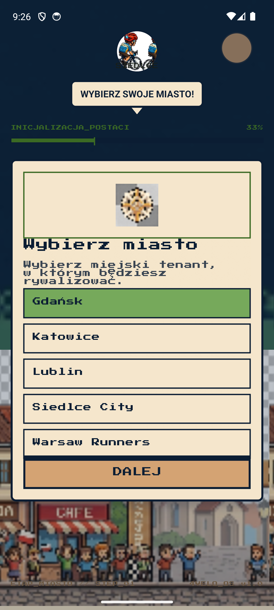 | 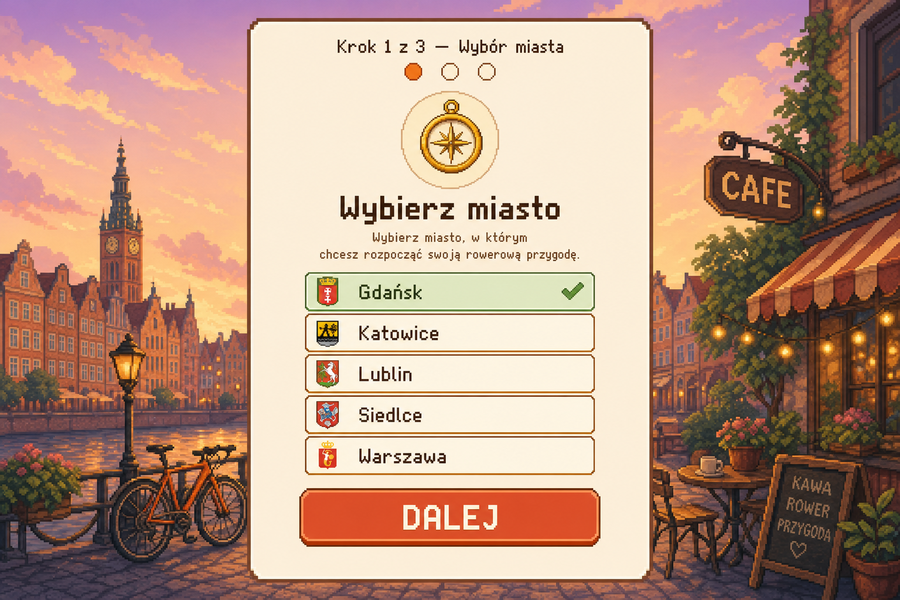 |
| Dział | 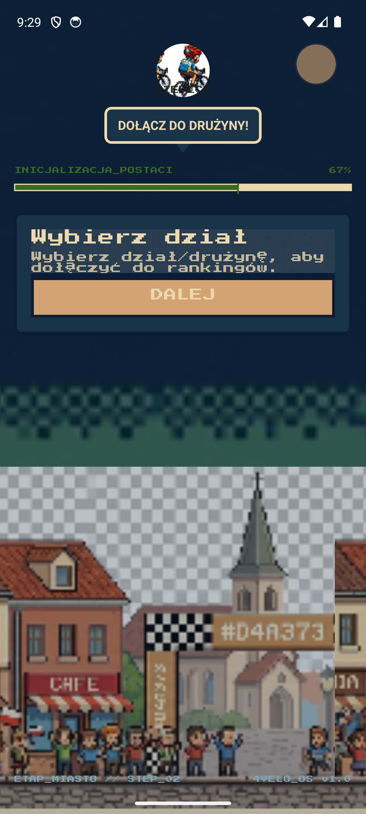 | 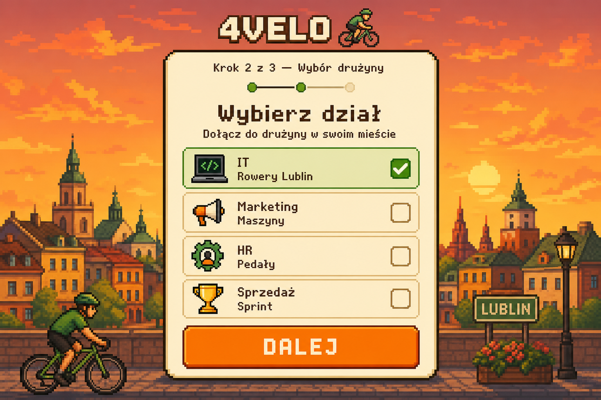 |
| Finish | 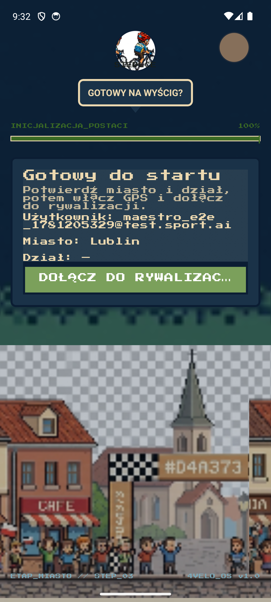 | 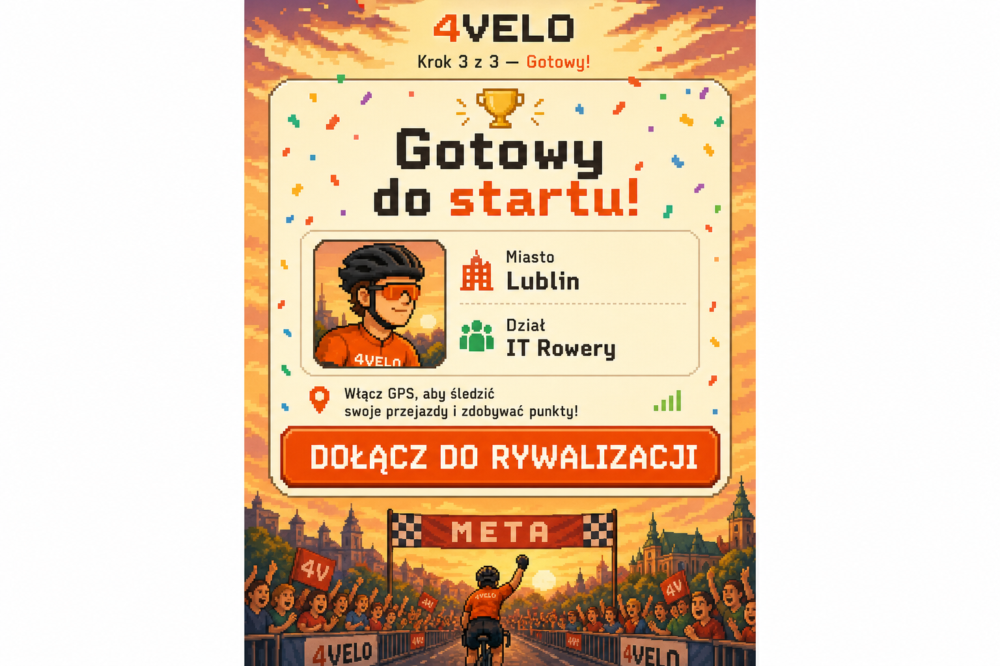 |

### Zakładki — porównanie (po odblokowaniu P0)

| Ekran | Stan audytu | Wizja docelowa |
|-------|-------------|----------------|
| Jazda | 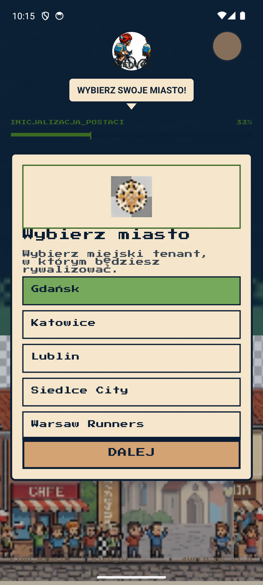 | 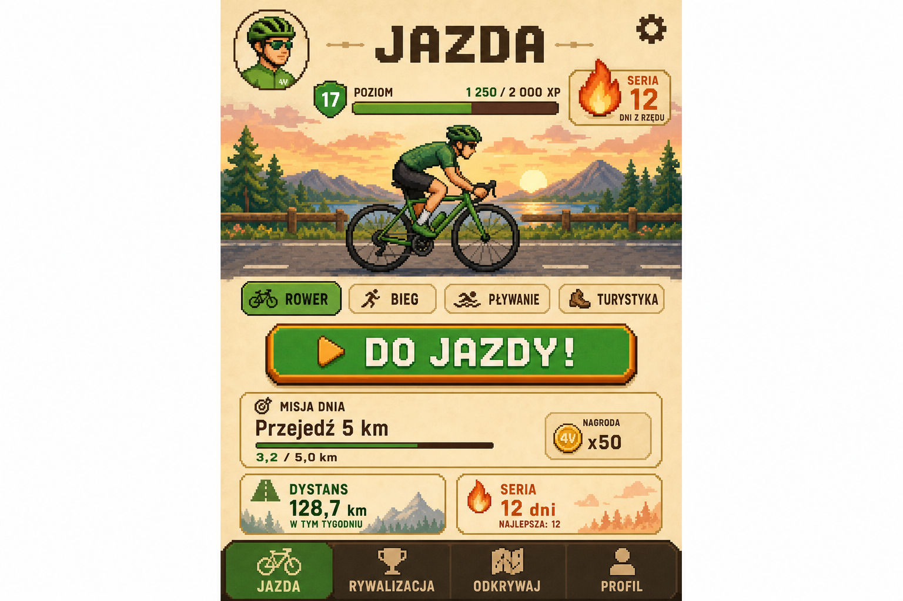 |
| HUD jazdy | 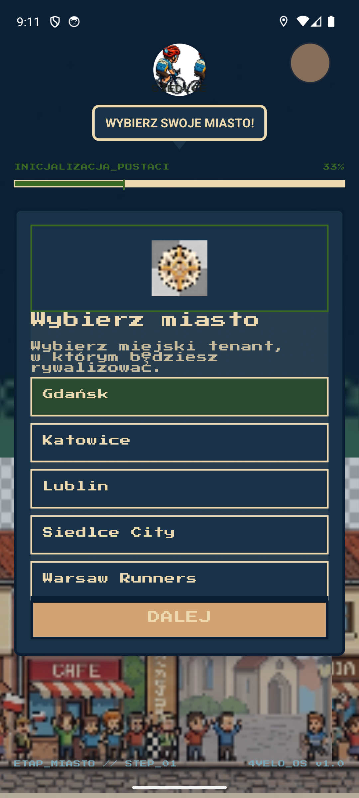 | 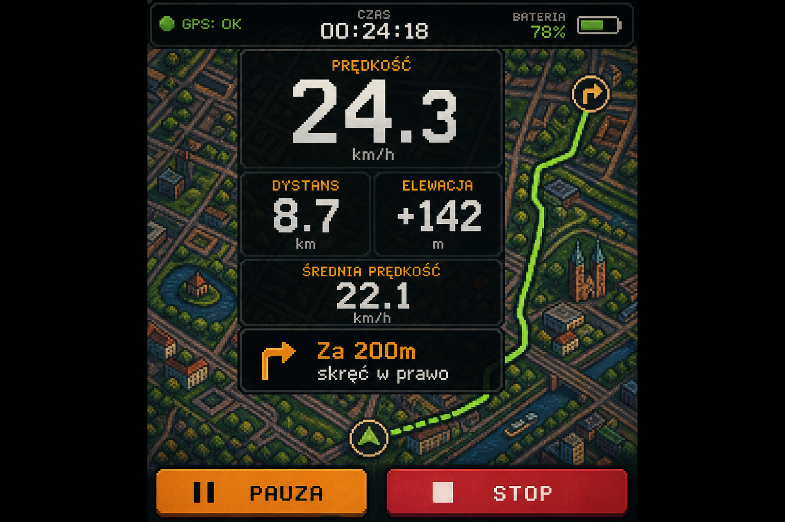 |
| Rywalizacja | 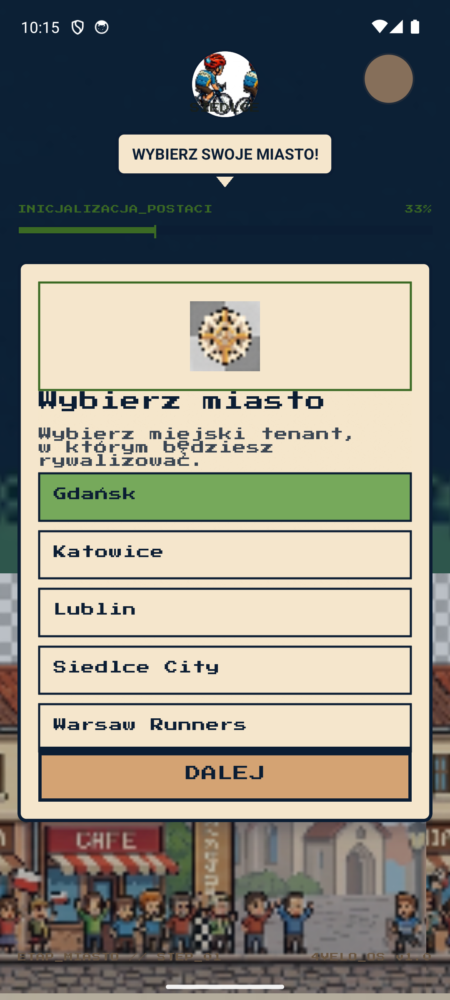 | 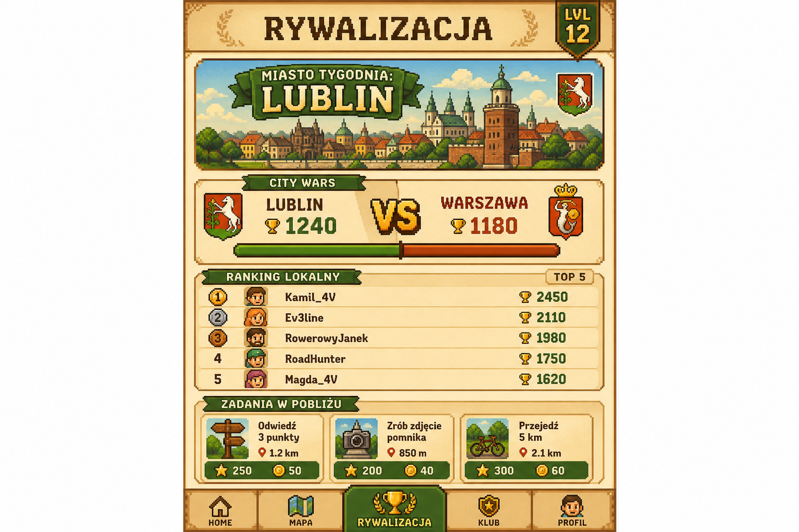 |
| Odkrywaj | 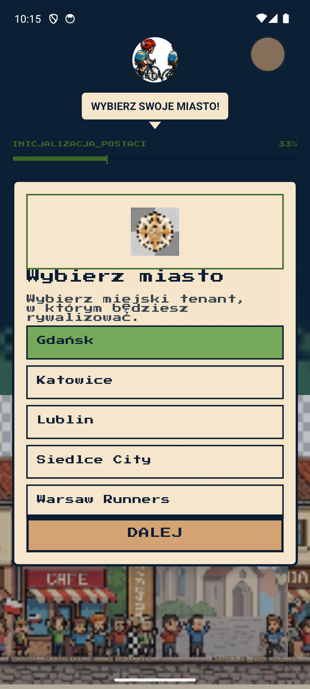 | 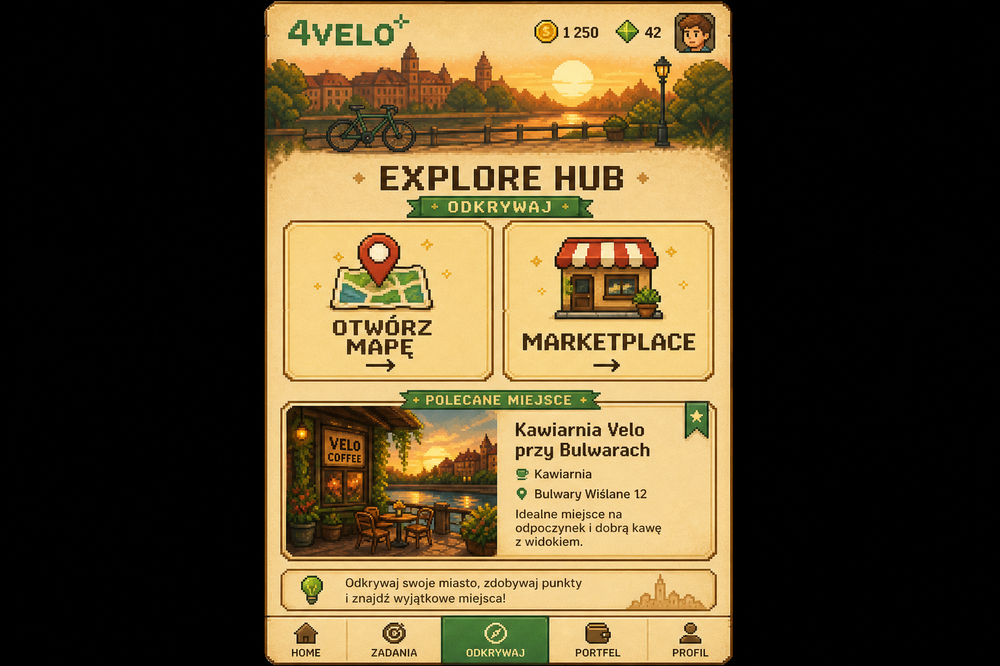 |
| Profil | 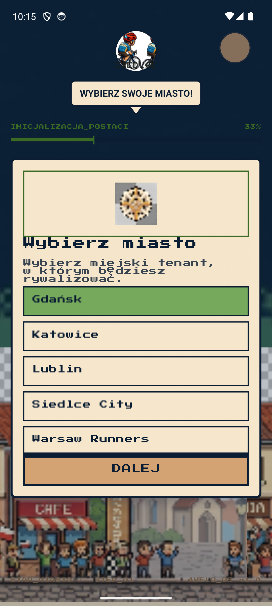 | 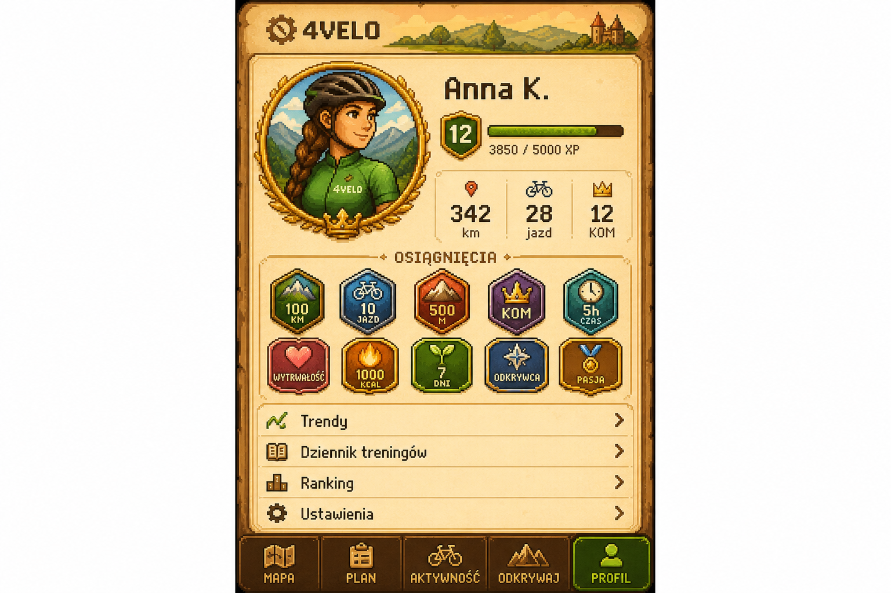 |

Pełna lista 1:1: każdy `screenshots/.../NN_name.png` → `screenshots/.../vision/NN_name.png`.

## Ustalenia do poprawy (priorytet)

### P0 — blokery produktu / QA

| # | Problem | Dowód |
|---|---------|-------|
| 1 | **E2E skip onboarding nie działa** po `pm clear` | Zrzut `00_onboarding_city.png` po świeżej instalacji |
| 2 | **Onboarding nie kończy się** — `DOŁĄCZ` nie zapisuje stanu | `00_onboarding_finish.png`, restart → znowu krok miasto |
| 3 | **Puste działy** w kroku 2 (`Dział: —`) | `00_onboarding_department.png`, `00_onboarding_finish.png` |
| 4 | **Biały ekran** po próbie wejścia do aplikacji | `_after_clear.png` / sesja z błędnym `onFinish` |
| 5 | **Audyt adb trafia w launcher / ustawienia systemu** | Wiele kroków `system_settings` w logu skryptu |

### P1 — UI / UX (do weryfikacji po odblokowaniu P0)

- Spójność tła: onboarding (night chrome) vs zakładki (parchment) — stitch DS.
- Empty/error states API: ranking, marketplace, kluby, segmenty.
- Ustawienia: ikona w `AppHeader` — tap `(1000,130)` nie otwiera modala.
- Tab bar: Press Start 2P 8px — czytelność na urządzeniu.

### P2

- Long-press `STOP` na HUD — zawodny przez adb; działa ścieżka `PAUZA` → `ZATRZYMAJ JAZDĘ`.

## Flow onboardingu (3 kroki) — zrzuty

### Krok 1 — Wybór miasta (33%)


- Widoczne: `WYBIERZ SWOJE MIASTO`, lista tenantów (Gdańsk, Katowice, Lublin, Siedlce City, Warsaw Runners), `DALEJ`.
- `ETAP_MIASTO // STEP_01`.

### Krok 2 — Wybór działu (67%)


- Widoczne: `DOŁĄCZ DO DRUŻYNY`, `Wybierz dział` — **brak listy drużyn na ekranie** (API `DepartmentService.getTree()`?).

### Krok 3 — Potwierdzenie (100%)


- Użytkownik: `_maestro_e2e_1781205329@test.sport.ai`
- Miasto: Lublin
- Dział: `—` (pusty)
- CTA: `DOŁĄCZ DO RYWALIZACJI` → wymaga GPS; emulator otwiera **systemowe** ustawienia lokalizacji.

### System — uprawnienia lokalizacji (poza aplikacją)

Podczas finish onboarding emulator pokazuje ekran Android **Location permission** dla 4VELO (nie jest to ekran aplikacji).

## Macierz audytu zakładek

| ID | Ekran | Status | Uwagi |
|----|-------|--------|-------|
| 00_onboarding_complete | Po onboardingu | ❌ | Onboarding lub ustawienia systemu |
| 00_blocker | Bloker onboardingu | ❌ | Główna nawigacja niedostępna |
| 01_ride_dashboard | Jazda — dashboard | ❌ | Zrzut = onboarding miasto |
| 02_active_ride_hud | HUD jazdy | ⏭️ | Brak `DO JAZDY` |
| 03_ride_paused | Pauza jazdy | — | Nie wykonano |
| 04_gps_diagnostics | Kreator GPS | ❌ | Onboarding zamiast modala |
| 05_compete_hub | Rywalizacja | ❌ | Ustawienia systemu / onboarding |
| 06_compete_scrolled | Rywalizacja scroll | ❌ | j.w. |
| 07_clubs | Kluby | ❌ | j.w. |
| 08_segments | Segmenty | ❌ | Onboarding miasto |
| 09_explore_hub | Odkrywaj | ❌ | Ustawienia systemu |
| 10_explore_map | Mapa POI | ❌ | j.w. |
| 11_marketplace | Marketplace | ❌ | Onboarding miasto |
| 12_profile | Profil | ❌ | Ustawienia systemu |
| 13_profile_scrolled | Profil scroll | ❌ | j.w. |
| 14_trends | Trendy | ❌ | j.w. |
| 15_leaderboard | Ranking | ❌ | j.w. |
| 16_training_log | Dziennik | ❌ | Onboarding (fałszywy OK w pierwszym przebiegu) |
| 17_settings | Ustawienia | ⏭️ | Ikona header nie otworzyła modala |
| 19_final | Stan końcowy Jazda | ❌ | Ustawienia systemu |

## Zmiany techniczne wprowadzone podczas audytu

1. **`scripts/emulator-ui-audit.py`** — walidacja zrzutów po pikselach (onboarding / blank / system settings), uczciwa macierz statusów.
2. **`scripts/emulator-onboarding.py`** — przejście onboardingu współrzędnymi (RN nie eksponuje tekstu w `uiautomator`).
3. **`mobile/app.config.js`** — ładowanie `.env` + przekazanie flag E2E do `extra`.
4. **`mobile/src/bootstrap/e2eConfig.ts`** — odczyt z `Constants.expoConfig.extra` jako fallback.

## Checklist wizualny (do wykonania po naprawie P0)

- [ ] Tokeny stitch (parchment / gpDeepSea / primary) — spójność między zakładkami
- [ ] Kontrast WCAG na parchment i night chrome
- [ ] Tab bar + safe area (80px)
- [ ] Modale: Settings, GPS Diagnostics, Ride Paused
- [ ] Empty states: Compete leaderboard, Marketplace, Training log
- [ ] Bannery: offline, GPS recovery, start ride error

## Jak powtórzyć audyt

```bash
adb devices
# Uprawnienia (przed startem)
adb -s emulator-5554 shell pm grant com.sport.athlete android.permission.ACCESS_FINE_LOCATION
adb -s emulator-5554 shell pm grant com.sport.athlete android.permission.ACCESS_COARSE_LOCATION
adb -s emulator-5554 shell pm grant com.sport.athlete android.permission.POST_NOTIFICATIONS

# Build z .env (E2E)
cd mobile/android && ./gradlew assembleRelease
adb -s emulator-5554 install -r app/build/outputs/apk/release/app-release.apk

# Audyt
python scripts/emulator-onboarding.py   # jeśli skip E2E nadal nie działa
python scripts/emulator-ui-audit.py
```

## Następne kroki naprawcze (rekomendacja)

1. **Naprawić E2E skip** — potwierdzić w runtime że `e2eConfig.skipOnboarding === true` po buildzie; ewentualnie ustawić flagi w `eas.json` dla profilu `preview`.
2. **Naprawić finish onboarding** — obsłużyć błąd API w `OnboardingScreen.nextStep()` i i tak wywołać `onFinish` lokalnie; sprawdzić `DepartmentService.getTree()` dla tenant Lublin.
3. **Przebudować APK** i ponowić audyt — dopiero wtedy zebrać prawdziwe zrzuty Ride / Compete / Explore / Profile.
4. Rozważyć **`testID` / `accessibilityLabel`** na `ArcadeButton` (DALEJ, DOŁĄCZ) pod Maestro — obecnie adb tap na RN bywa niewiarygodny.

---

*Raport wygenerowany po sesji audytu emulatora. Zrzuty w `docs/design/screenshots/2026-06-14-emulator-audit/`.*
