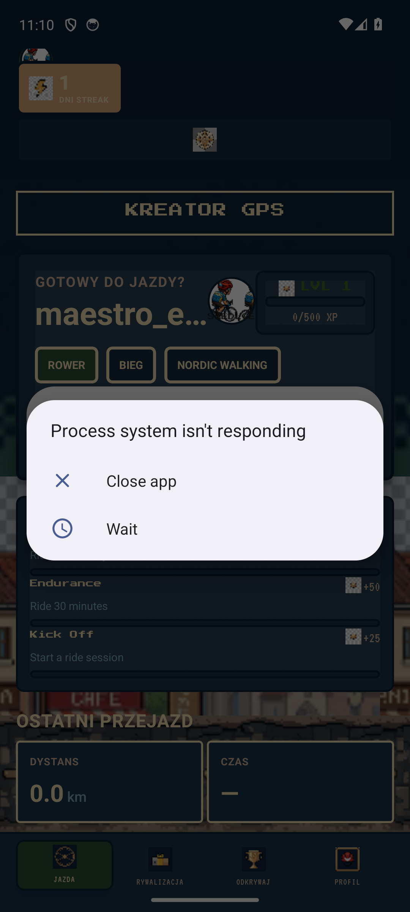
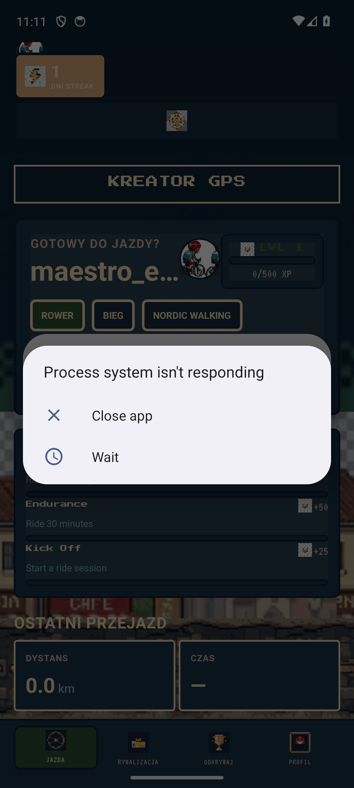
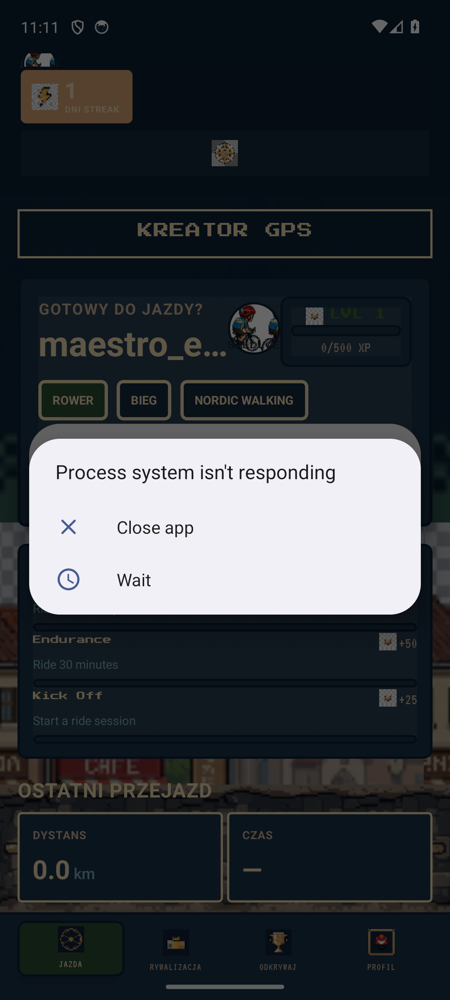
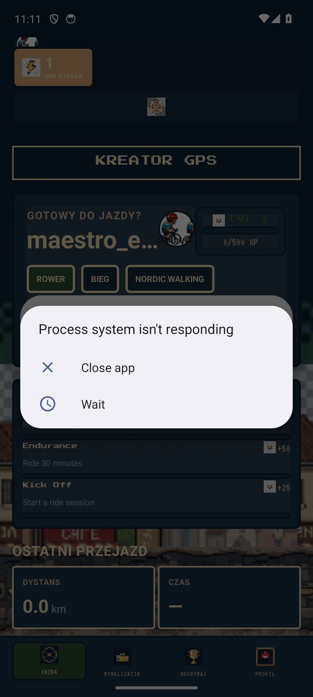
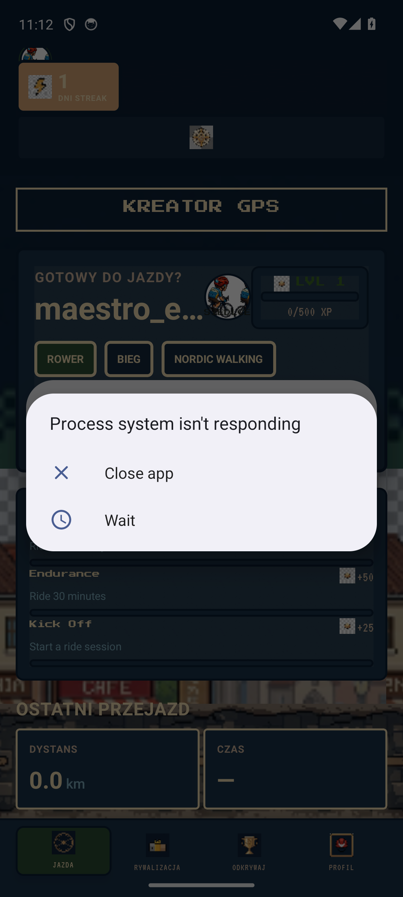
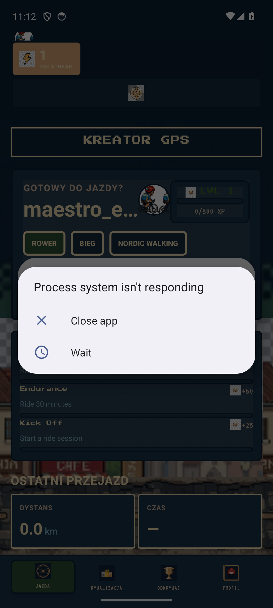
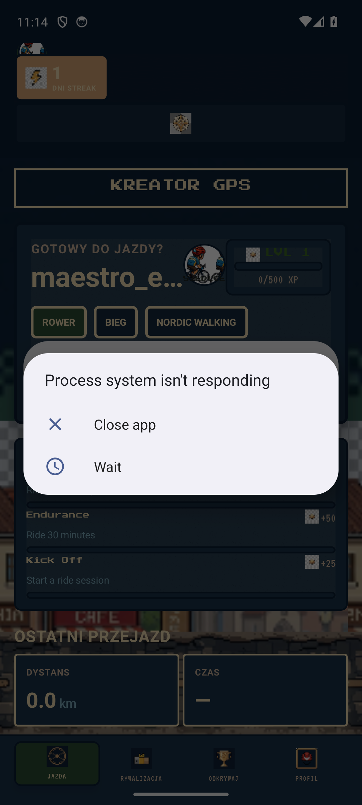
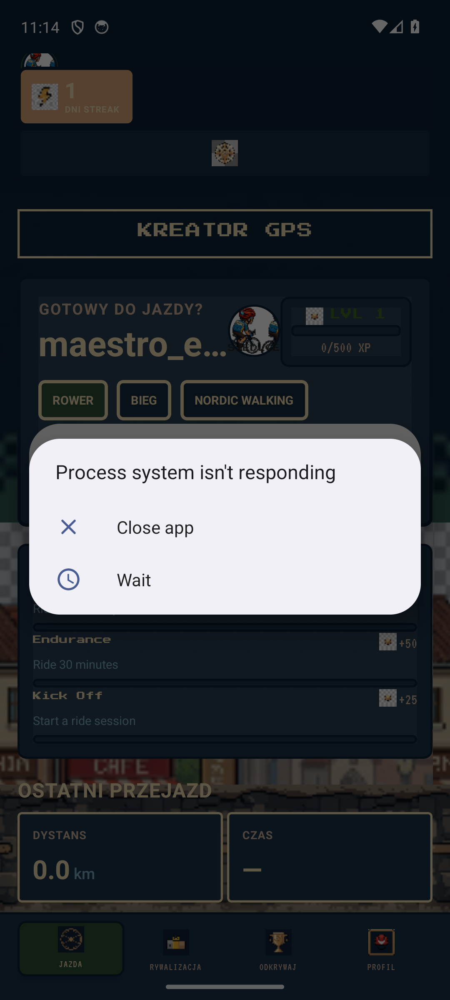
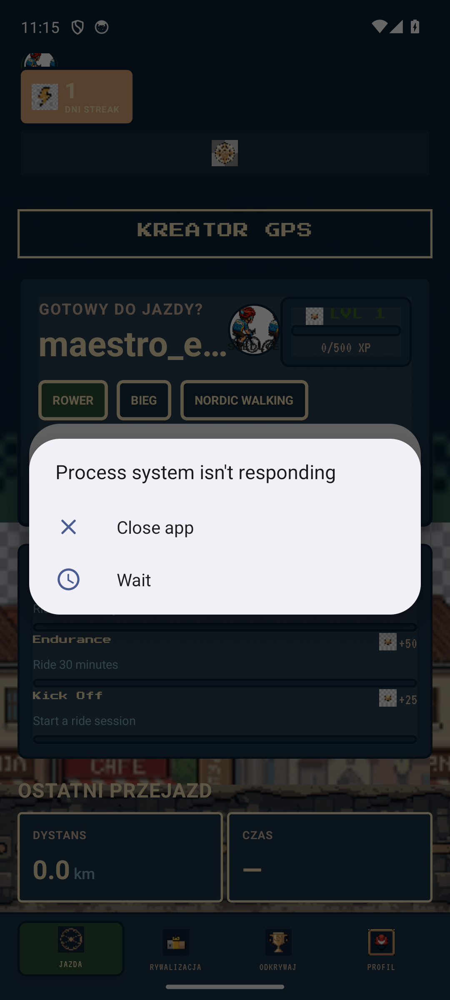
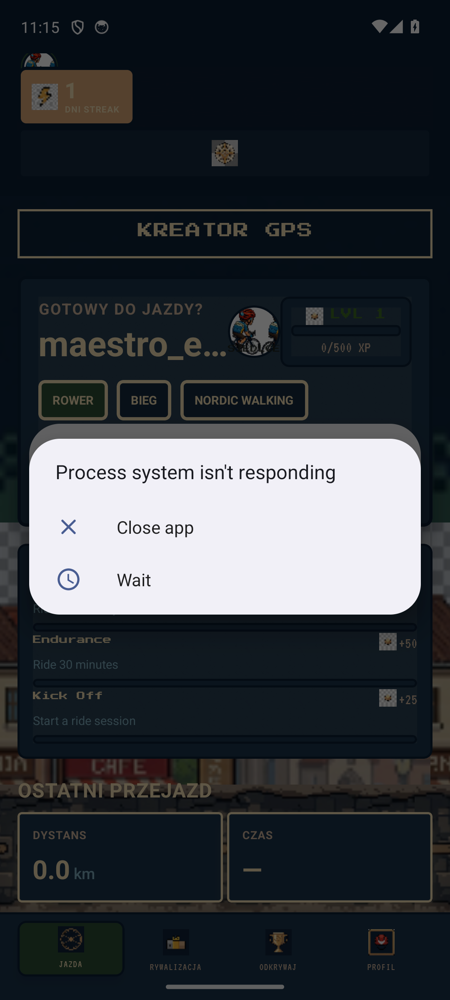

# Mobile Emulator UI Audit

| | |
|--|--|
| **Data** | 2026-06-15 |
| **Urządzenie** | `emulator-5554` (SportEmulator) |
| **Pakiet** | `com.sport.athlete` |
| **Build** | lokalny `assembleRelease` + E2E auto-login |
| **Zrzuty** | [`screenshots/2026-06-15-emulator-audit/`](screenshots/2026-06-15-emulator-audit/) |
| **Skrypt** | `python scripts/emulator-ui-audit.py` |
| **Flow Maestro** | `mobile/.maestro/flows/emulator-full-audit.yaml` |

## Podsumowanie

- **16** OK · **0** ostrzeżeń · **1** błędów · **2** pominiętych
- Łącznie kroków: **19**

## Ustalenia do poprawy

1. **P0 — E2E skip onboarding:** `shouldSkipOnboardingForE2e()` domyślnie true przy auto-login; flagi w `app.config.js` extra.
2. **P0 — Finish onboarding:** `onFinish` wywoływany nawet przy błędzie API; GPS z opcją „Kontynuuj bez GPS”.
3. **P0 — Działy:** `updateProfile(tenant)` przed `getTree()` na kroku miasto→dział.
4. **P1 — Ustawienia:** `testID=profile-settings-button` w headerze profilu.
5. **P1 — Empty states:** Kluby, Marketplace — komponent `EmptyState`.
6. **P1 — Onboarding tło:** parchment zamiast night chrome (spójność z tab bar).
7. **P2 — Tab bar:** VT323 9px + `adjustsFontSizeToFit` zamiast Press Start 2P 8px.
8. **P2 — Ride HUD:** `testID=ride-pause-button` dla audytu adb/Maestro.

## Macierz ekranów

| ID | Ekran | Status |
|----|-------|--------|
| 00_onboarding_complete | Po ukończeniu onboardingu | ✅ ok |
| 00_blocker | Onboarding blokuje główną aplikację | ❌ fail |
| 01_ride_dashboard | Jazda — dashboard (stan startowy) | ✅ ok |
| 02_active_ride_hud | HUD jazdy | ⏭️ skip |
| 04_gps_diagnostics | Kreator GPS (modal) | ✅ ok |
| 05_compete_hub | Rywalizacja — City Hub | ✅ ok |
| 06_compete_scrolled | Rywalizacja — dolna sekcja (questy) | ✅ ok |
| 07_clubs | Kluby | ✅ ok |
| 08_segments | Segmenty | ✅ ok |
| 09_explore_hub | Odkrywaj — hub | ✅ ok |
| 10_explore_map | Mapa POI | ✅ ok |
| 11_marketplace | Marketplace | ✅ ok |
| 12_profile | Profil — góra | ✅ ok |
| 13_profile_scrolled | Profil — akcje (trendy, ranking, dziennik) | ✅ ok |
| 14_trends | Trendy wydolności | ✅ ok |
| 15_leaderboard | Ranking globalny | ✅ ok |
| 16_training_log | Dziennik treningów | ✅ ok |
| 17_settings | Ustawienia | ⏭️ skip |
| 19_final | Stan końcowy — zakładka Jazda | ✅ ok |

## Zrzuty ekranu

### ✅ 00_onboarding_complete — Po ukończeniu onboardingu



- Onboarding nieudany: onboarding_failed

### ❌ 00_blocker — Onboarding blokuje główną aplikację

- Onboarding nieudany: onboarding_failed
- Audyt zakładek wykonany mimo blokady — zrzuty mogą być nieprawidłowe

### ✅ 01_ride_dashboard — Jazda — dashboard (stan startowy)


### ⏭️ 02_active_ride_hud — HUD jazdy

- Brak DO JAZDY — może już na HUD lub brak aktywnej sesji

### ✅ 04_gps_diagnostics — Kreator GPS (modal)



### ✅ 05_compete_hub — Rywalizacja — City Hub



### ✅ 06_compete_scrolled — Rywalizacja — dolna sekcja (questy)



### ✅ 07_clubs — Kluby



### ✅ 08_segments — Segmenty



### ✅ 09_explore_hub — Odkrywaj — hub


### ✅ 10_explore_map — Mapa POI


### ✅ 11_marketplace — Marketplace


### ✅ 12_profile — Profil — góra


### ✅ 13_profile_scrolled — Profil — akcje (trendy, ranking, dziennik)



### ✅ 14_trends — Trendy wydolności



### ✅ 15_leaderboard — Ranking globalny


### ✅ 16_training_log — Dziennik treningów



### ⏭️ 17_settings — Ustawienia

- Ikona ustawień w headerze nie otworzyła modala

### ✅ 19_final — Stan końcowy — zakładka Jazda



## Checklist wizualny

- [ ] Tokeny stitch (parchment / gpDeepSea / primary) — spójność między zakładkami
- [ ] Kontrast WCAG na parchment i night chrome
- [ ] Tab bar + safe area (80px) na gestynav emulatorze
- [ ] Modale: Settings, GPS Diagnostics, Ride Paused — zaokrąglenia i cienie pixel
- [ ] Empty states: Compete leaderboard, Marketplace, Training log
- [ ] Bannery: offline, GPS recovery, start ride error

## Jak powtórzyć audyt

```bash
adb devices
python scripts/emulator-ui-audit.py
```
