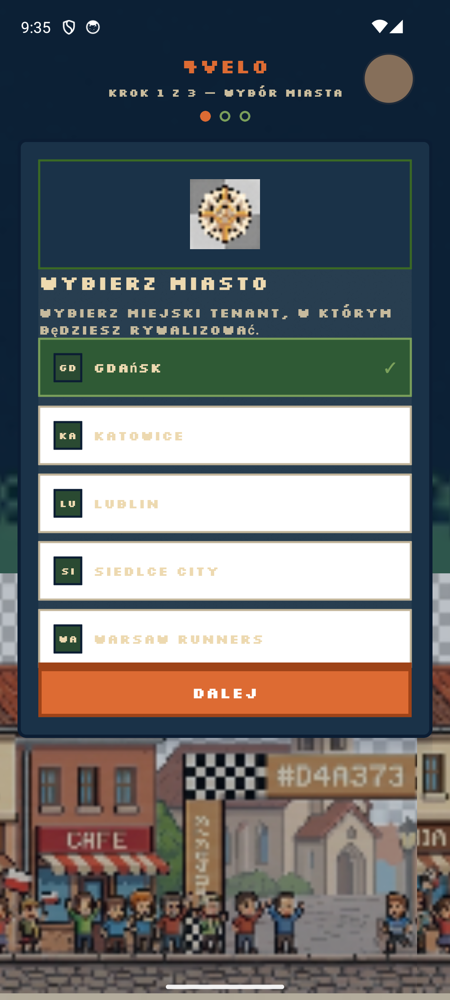

# Mobile Emulator UI Audit

| | |
|--|--|
| **Data** | 2026-06-15 |
| **Urządzenie** | `emulator-5554` (SportEmulator) |
| **Pakiet** | `com.sport.athlete` |
| **Build** | lokalny `assembleRelease` + E2E auto-login |
| **Zrzuty** | [`screenshots/2026-06-15-emulator-audit/`](screenshots/2026-06-15-emulator-audit/) |
| **Skrypt** | `python scripts/emulator-ui-audit.py` |
| **Flow Maestro** | `mobile/.maestro/flows/emulator-full-audit.yaml` |

## Podsumowanie

- **3** OK · **0** ostrzeżeń · **1** błędów · **0** pominiętych
- Łącznie kroków: **4**

## Ustalenia do poprawy

1. **P0 — E2E skip onboarding:** `shouldSkipOnboardingForE2e()` domyślnie true przy auto-login; flagi w `app.config.js` extra.
2. **P0 — Finish onboarding:** `onFinish` wywoływany nawet przy błędzie API; GPS z opcją „Kontynuuj bez GPS”.
3. **P0 — Działy:** `updateProfile(tenant)` przed `getTree()` na kroku miasto→dział.
4. **P1 — Ustawienia:** `testID=profile-settings-button` w headerze profilu.
5. **P1 — Empty states:** Kluby, Marketplace — komponent `EmptyState`.
6. **P1 — Onboarding tło:** parchment zamiast night chrome (spójność z tab bar).
7. **P2 — Tab bar:** VT323 9px + `adjustsFontSizeToFit` zamiast Press Start 2P 8px.
8. **P2 — Ride HUD:** `testID=ride-pause-button` dla audytu adb/Maestro.

## Macierz ekranów

| ID | Ekran | Status |
|----|-------|--------|
| 00_onboarding_city | Onboarding — wybór miasta | ✅ ok |
| 00_onboarding_department | Onboarding — wybór działu | ✅ ok |
| 00_onboarding_finish | Onboarding — ekran końcowy | ✅ ok |
| 00_blocker | Onboarding blokuje główną aplikację | ❌ fail |

## Zrzuty ekranu

### ✅ 00_onboarding_city — Onboarding — wybór miasta


**Widoczny tekst:** `←`, `USTAWIENIA`, `OGÓLNE`, `SENSORY`, `PRYWATNOŚĆ`, `GARAŻ`, `Język, Polski`, `Język`, `Polski`, `Motyw pixel Grand Prix, Wł.`, `Motyw pixel Grand Prix`, `Wł.`

### ✅ 00_onboarding_department — Onboarding — wybór działu


**Widoczny tekst:** `←`, `USTAWIENIA`, `OGÓLNE`, `SENSORY`, `PRYWATNOŚĆ`, `GARAŻ`, `Język, Polski`, `Język`, `Polski`, `Motyw pixel Grand Prix, Wł.`, `Motyw pixel Grand Prix`, `Wł.`

### ✅ 00_onboarding_finish — Onboarding — ekran końcowy



**Widoczny tekst:** `←`, `USTAWIENIA`, `OGÓLNE`, `SENSORY`, `PRYWATNOŚĆ`, `GARAŻ`, `Język, Polski`, `Język`, `Polski`, `Motyw pixel Grand Prix, Wł.`, `Motyw pixel Grand Prix`, `Wł.`

### ❌ 00_blocker — Onboarding blokuje główną aplikację

- Onboarding nie zakończył przejścia do shella głównego
- Audyt zakładek wykonany mimo blokady — zrzuty mogą być nieprawidłowe

## Checklist wizualny

- [ ] Tokeny stitch (parchment / gpDeepSea / primary) — spójność między zakładkami
- [ ] Kontrast WCAG na parchment i night chrome
- [ ] Tab bar + safe area (80px) na gestynav emulatorze
- [ ] Modale: Settings, GPS Diagnostics, Ride Paused — zaokrąglenia i cienie pixel
- [ ] Empty states: Compete leaderboard, Marketplace, Training log
- [ ] Bannery: offline, GPS recovery, start ride error

## Jak powtórzyć audyt

```bash
adb devices
python scripts/emulator-ui-audit.py
```
