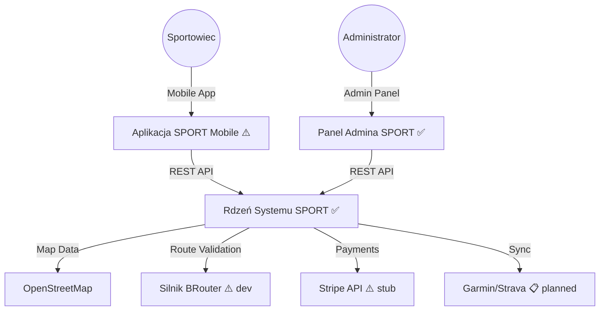
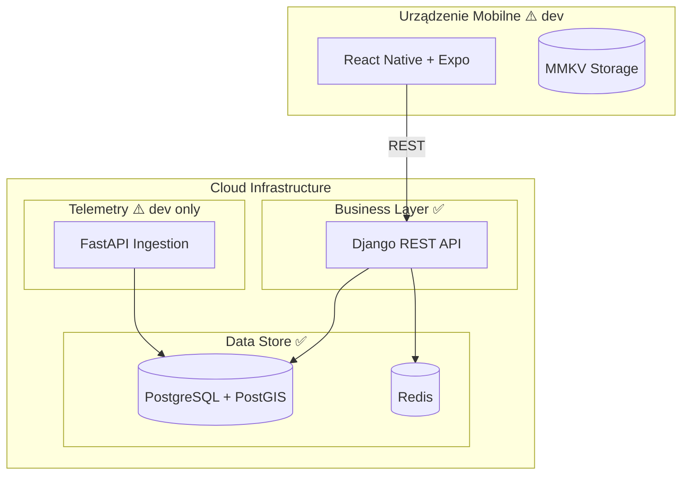
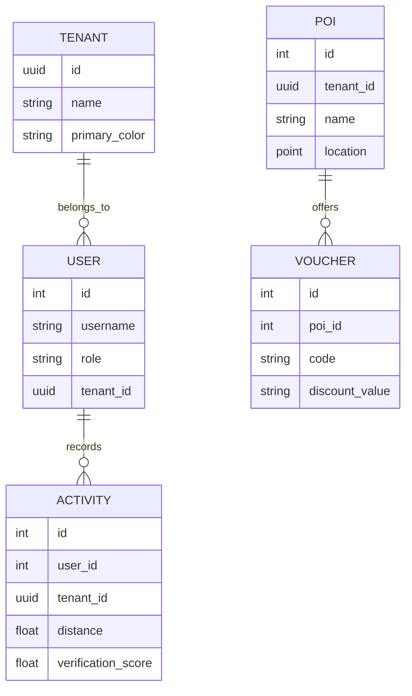

# SYSTEM ARCHITECTURE — MODEL C4 (v0.1.0-beta.2)

| | |
|--|--|
| **Status** | ✅ Active |
| **Owner role** | Documentation maintainer |
| **Last reviewed** | 2026-06-04 |
| **Audience** | See canonical document |
| **lang** | en |
| **translation** | [Polski](../pl/diagrams/architecture_c4.md) |
| **canonical_path** | docs/diagrams/architecture_c4.md |

---

| | |
|--|--|
| **Status** | ✅ Active |
| **Owner role** | Tech Lead |
| **Last reviewed** | 2026-06-03 |
| **Audience** | Architekci, nowi deweloperzy |

> Legenda: ✅ = deployed on production | ⚠️ = dev only | 📋 = planned  

**Powiązane:** [ARCHITECTURE.md](../ARCHITECTURE.md)

## 1. Context Diagram (Diagram Kontekstowy)

## 2. Container Diagram (Diagram Kontenerów)

## 3. Data Model (ERD) — Uproszczony

## 4. Deployment (Railway) — stan faktyczny

| Komponent | Port | Status |
|---|---|---|
| Django REST API | 8000 | ✅ `docker-backend-production-123c.up.railway.app` |
| FastAPI Telemetry | 8001 | ⚠️ Dev only, not on Railway |
| PostgreSQL | 5432 | ✅ Railway managed DB |
| Redis | 6379 | ✅ Railway managed |
| Celery Worker | — | ⚠️ Dev only |
| Celery Beat | — | ⚠️ Dev only |
| BRouter | 17777 | ✅ Osobny serwis Railway + Compose (`infrastructure/brouter`) |
| Celery simulation | — | ✅ `celery-worker-simulation`, kolejka `simulation` |
| Traccar | 8082 | ⚠️ Dev only (local docker) |
