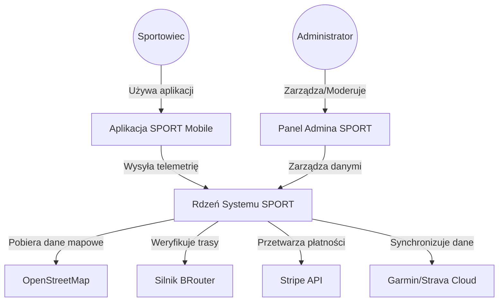
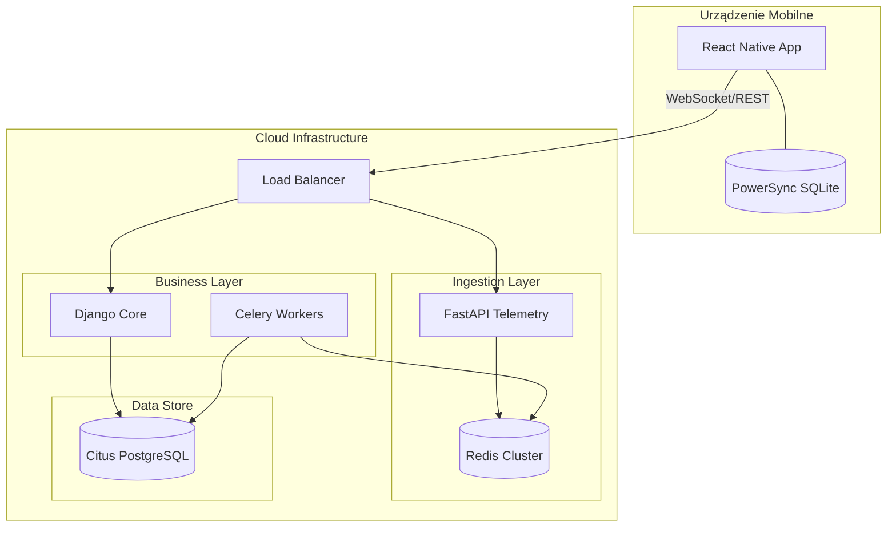
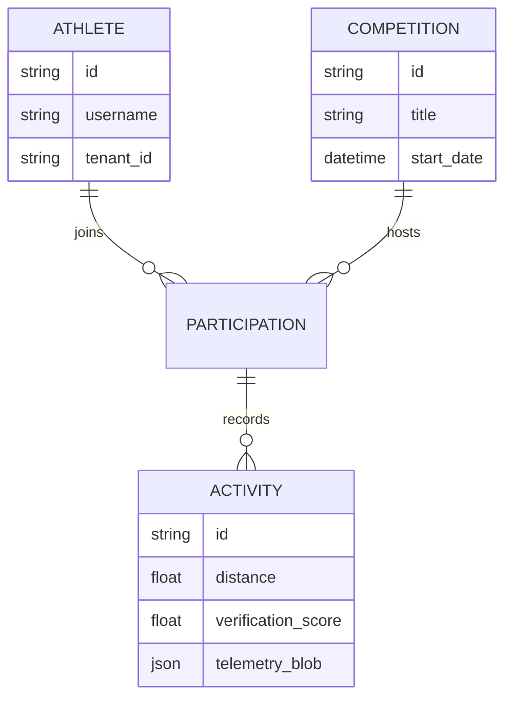

# SYSTEM ARCHITECTURE — MODEL C4

## 1. Context Diagram (Diagram Kontekstowy)

```mermaid
graph TD
    User((Sportowiec)) -->|Używa aplikacji| MobileApp[Aplikacja SPORT Mobile]
    Admin((Administrator)) -->|Zarządza/Moderuje| AdminPanel[Panel Admina SPORT]
    
    MobileApp -->|Wysyła telemetrię| Backend[Rdzeń Systemu SPORT]
    AdminPanel -->|Zarządza danymi| Backend
    
    Backend -->|Pobiera dane mapowe| OSM[OpenStreetMap]
    Backend -->|Weryfikuje trasy| BRouter[Silnik BRouter]
    Backend -->|Przetwarza płatności| Stripe[Stripe API]
    Backend -->|Synchronizuje dane| Wearables[Garmin/Strava Cloud]
```

## 2. Container Diagram (Diagram Kontenerów)

```mermaid
graph TB
    subgraph "Urządzenie Mobilne"
        App[React Native App]
        DB_Local[(PowerSync SQLite)]
        App --- DB_Local
    end

    subgraph "Cloud Infrastructure"
        LB[Load Balancer]
        
        subgraph "Ingestion Layer"
            FastAPI[FastAPI Telemetry]
            Redis[(Redis Cluster)]
        end
        
        subgraph "Business Layer"
            Django[Django Core]
            Celery[Celery Workers]
        end
        
        subgraph "Data Store"
            Citus[(Citus PostgreSQL)]
        end
    end

    App -->|WebSocket/REST| LB
    LB --> FastAPI
    LB --> Django
    FastAPI --> Redis
    Django --> Citus
    Celery --> Citus
    Celery --> Redis
```

## 3. Data Model (ERD) — Uproszczony

```mermaid
erDiagram
    ATHLETE ||--o{ PARTICIPATION : joins
    ATHLETE {
        string id
        string username
        string tenant_id
    }
    COMPETITION ||--o{ PARTICIPATION : hosts
    COMPETITION {
        string id
        string title
        datetime start_date
    }
    PARTICIPATION ||--o{ ACTIVITY : records
    ACTIVITY {
        string id
        float distance
        float verification_score
        json telemetry_blob
    }
```
