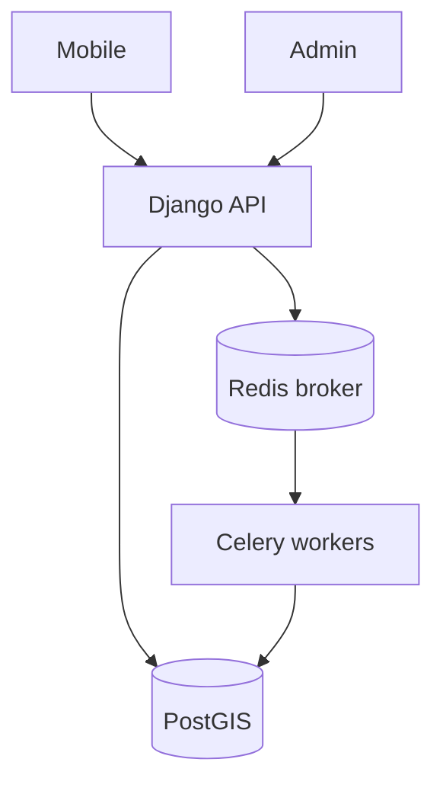
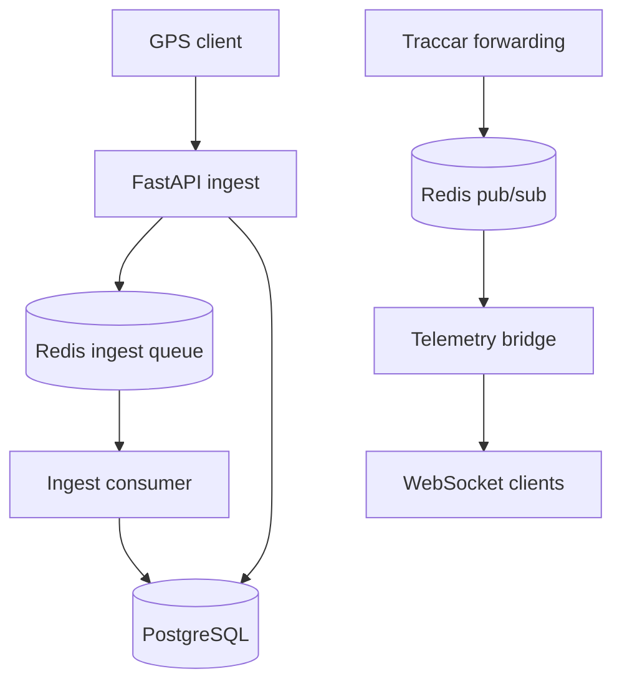

# 4VELO container diagrams

| | |
|--|--|
| **Status** | Active |
| **Owner role** | Tech Lead |
| **Last reviewed** | 2026-09-10 |
| **Audience** | Developers |
| **lang** | en |
| **translation** | [Polski](../pl/diagrams/architecture_c4.md) |
| **canonical_path** | docs/diagrams/architecture_c4.md |

[Architecture](../ARCHITECTURE.md). These diagrams describe code responsibilities, not production status. The former illustrative ERD is omitted: Django models and migrations define the schema.

## API / tasks

## Telemetry

Sources: `telemetry/ingest_service.py`, `telemetry/ingest_queue.py`, `telemetry/bridges.py`, `telemetry/ws_manager.py`, `infrastructure/traccar/conf/traccar.xml`.

Queueing and delivery depend on configuration. The diagram does not guarantee ordering, durability or complete delivery. Railway, Celery, worker and beat are technical names and must not be automatically translated.
