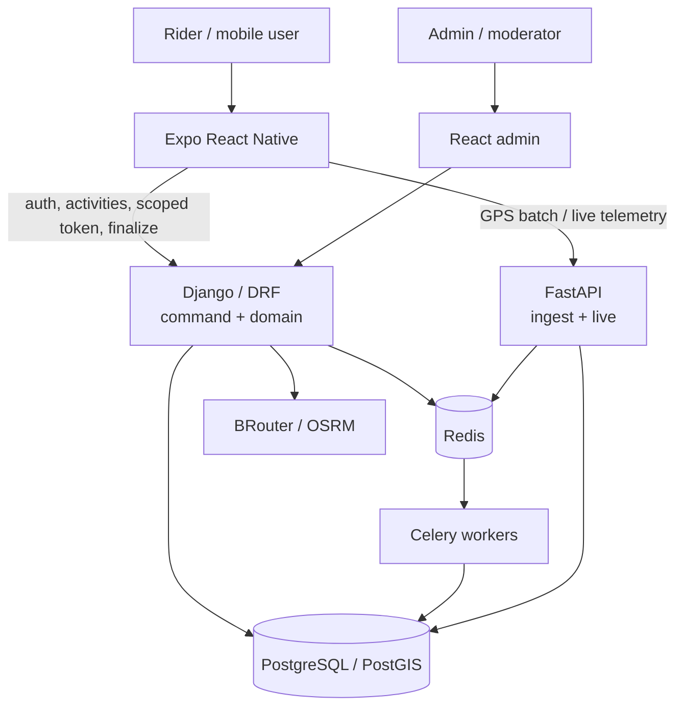
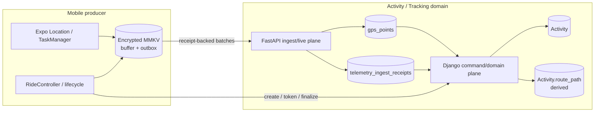
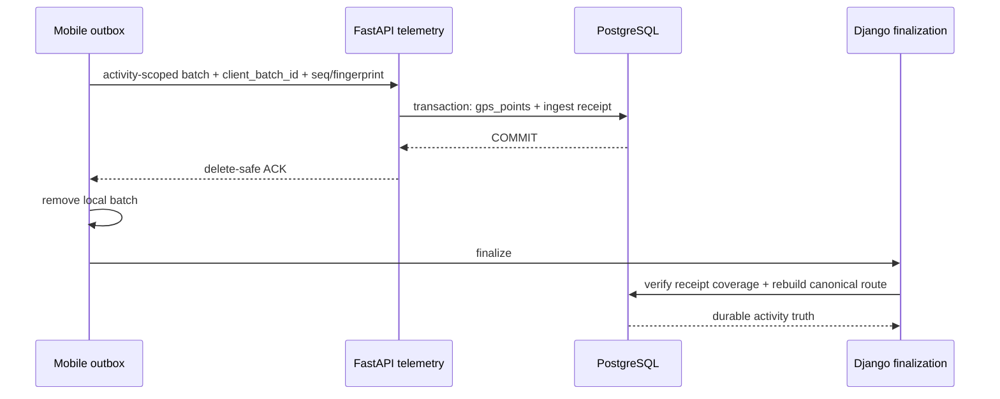
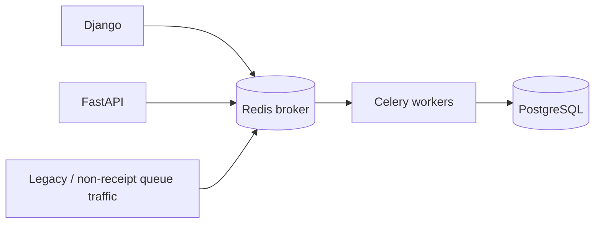
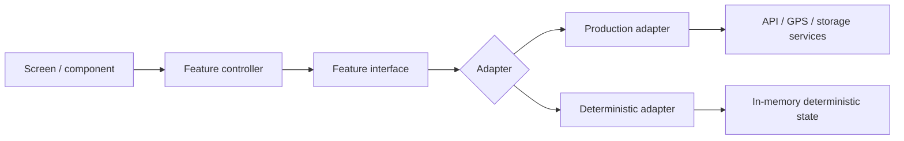

# 4VELO container diagrams

| | |
|--|--|
| **Status** | ✅ Active |
| **Document class** | REFERENCE |
| **Owner role** | Tech Lead |
| **Last reviewed** | 2026-09-30 |
| **Audience** | Developers, reviewers |
| **lang** | en |
| **translation** | [Polski](../pl/diagrams/architecture_c4.md) |
| **canonical_path** | docs/diagrams/architecture_c4.md |

[Architecture SSOT](../ARCHITECTURE.md). These diagrams describe repository/runtime boundaries, not verified production deployment.

## 1. System containers

```mermaid
flowchart TB
  Rider[Rider / mobile user]
  Operator[Admin / moderator]

  Mobile[Expo React Native]
  Admin[React admin]
  Django[Django / DRF\ncommand + domain]
  Telemetry[FastAPI\ningest + live]
  Workers[Celery workers]
  DB[(PostgreSQL / PostGIS)]
  Redis[(Redis)]
  Routing[BRouter / OSRM]

  Rider --> Mobile
  Operator --> Admin
  Mobile -->|auth, activities, scoped token, finalize| Django
  Mobile -->|GPS batch / live telemetry| Telemetry
  Admin --> Django

  Django --> DB
  Django --> Redis
  Redis --> Workers
  Workers --> DB
  Telemetry --> DB
  Telemetry --> Redis
  Django --> Routing
```

## 2. Activity / Tracking domain

```mermaid
flowchart LR
  subgraph Producer["Mobile producer"]
    GPS[Expo Location / TaskManager]
    Local[(Encrypted MMKV\nbuffer + outbox)]
    Ride[RideController / lifecycle]
    GPS --> Local
    Ride --> Local
  end

  subgraph Domain["Activity / Tracking domain"]
    Django[Django command/domain plane]
    Tel[FastAPI ingest/live plane]
    Points[(gps_points)]
    Receipts[(telemetry_ingest_receipts)]
    Activity[(Activity)]
    Route[(Activity.route_path\nderived)]

    Django --> Activity
    Tel --> Points
    Tel --> Receipts
    Points --> Django
    Receipts --> Django
    Django --> Route
  end

  Ride -->|create / token / finalize| Django
  Local -->|receipt-backed batches| Tel
```

The database tables shown above have different roles: persisted GPS points and immutable ingest receipts are input evidence; `Activity.route_path` is a derived domain representation produced by reconciliation/finalization.

## 3. Durable ACK path

```mermaid
sequenceDiagram
  participant M as Mobile outbox
  participant T as FastAPI telemetry
  participant P as PostgreSQL
  participant D as Django finalization

  M->>T: activity-scoped batch + client_batch_id + seq/fingerprint
  T->>P: transaction: gps_points + ingest receipt
  P-->>T: COMMIT
  T-->>M: delete-safe ACK
  M->>M: remove local batch
  M->>D: finalize
  D->>P: verify receipt coverage + rebuild canonical route
  P-->>D: durable activity truth
```

If guard pressure would send a receipt-backed batch to an unqualified Redis queue, the server returns retryable overload instead of a delete-safe ACK.

## 4. Async infrastructure

```mermaid
flowchart LR
  Django[Django] --> Redis[(Redis broker)]
  Redis --> Celery[Celery workers]
  Celery --> DB[(PostgreSQL)]
  Tel[FastAPI] --> Redis
  Legacy[Legacy / non-receipt queue traffic] --> Redis
```

Redis may be used for broker/cache/operational buffering. Its existence does not make queue admission authoritative for critical activity data.

## 5. Mobile dependency direction

```mermaid
flowchart LR
  Screen[Screen / component] --> Controller[Feature controller]
  Controller --> Interface[Feature interface]
  Interface --> Adapter{Adapter}
  Adapter --> Prod[Production adapter]
  Adapter --> Det[Deterministic adapter]
  Prod --> Services[API / GPS / storage services]
  Det --> State[In-memory deterministic state]
```

## 6. Architecture notes

- FastAPI and Django are separate execution planes in one Activity/Tracking domain.
- Recording durability and live-delivery freshness are separate capabilities.
- Traccar/bridges, routing engines and external integrations are adapters/infrastructure, not business truth.
- Deployment topology must be proven by release/ops evidence; these diagrams do not assert what is running now.
