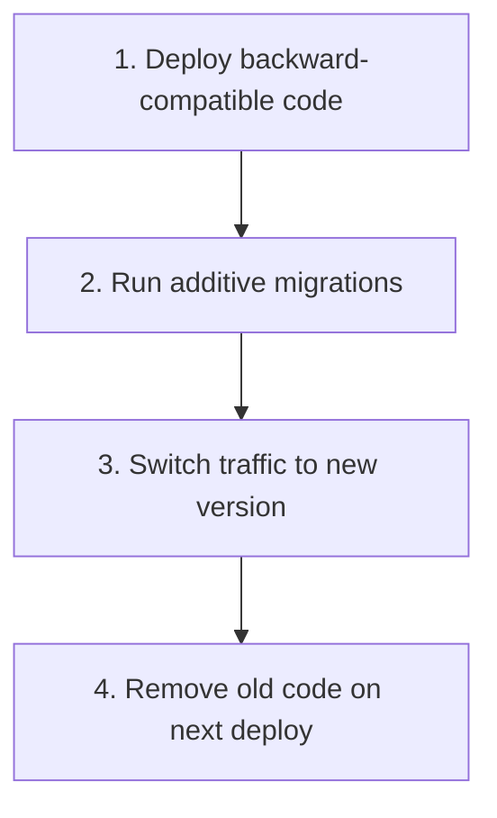

# Document

| | |
|--|--|
| **Status** | ✅ Active |
| **Owner role** | Documentation maintainer |
| **Last reviewed** | 2026-06-04 |
| **Audience** | See canonical document |
| **lang** | en |
| **translation** | [Polski](../MIGRATION.md) |
| **canonical_path** | docs/en/MIGRATION.md |
---

| | |
|--|--|
| **Status** | ✅ Active |
| **Owner role** | Backend Lead/DBA |
| **Last reviewed** | 2026-06-03 |
| **Audience** | Developers, DevOps |

Guide to database migration, RBAC migration, zero-downtime deployment strategies and rollback procedures.

---

## 🗄️ Database migrations

### Django Migrations

The platform uses Django Migrations to manage the database schema.

### Basic commands```bash
# Sprawdzenie stanu migracji
python manage.py showmigrations

# Uruchomienie wszystkich migracji
python manage.py migrate

# Migracja konkretnej aplikacji
python manage.py migrate users
python manage.py migrate activities

# Cofnięcie migracji
python manage.py migrate users 0008
python manage.py migrate activities 0005

# Fake migration (oznaczenie jako wykonane bez uruchamiania)
python manage.py migrate users 0009 --fake

# Migracja do konkretnego stanu
python manage.py migrate users zero  # cofnięcie wszystkich
```### Create new migrations```bash
# Po zmianie w models.py
python manage.py makemigrations

# Dla konkretnej aplikacji
python manage.py makemigrations users
python manage.py makemigrations activities

# Z nazwą migracji
python manage.py makemigrations users --name add_custom_field

# Sprawdzenie SQL migracji
python manage.py sqlmigrate users 0010
```### Migration structure```
backend/users/migrations/
├── 0001_initial.py          # Pierwsze modele
├── 0002_...py               # Kolejne zmiany
├── ...
├── 0009_rbac_models.py      # Modele RBAC
├── 0010_seed_rbac_data.py   # Dane RBAC
├── 0011_migrate_legacy_roles.py  # Migracja legacy → RBAC
└── __init__.py
```---

## 🛡️ RBAC Migration (Legacy → New System)

### Overview

The RBAC system was designed as a hybrid - the new system with granular permissions works in parallel with the legacy system based on the `User.role` field.

### Migration steps

#### Step 1: Seeding the RBAC system```bash
# Utworzenie ról, uprawnień i relacji
python manage.py seed_rbac
```This creates:
- 5 system roles (`global_owner`, `tenant_admin`, `tenant_moderator`, `sponsor`, `athlete`)
- All permissions (`activities.view`, `users.create`, etc.)
- Role-authority relationships

#### Step 2: Migrate legacy roles```bash
# Konwersja legacy User.role → UserRole assignments
python manage.py migrate_legacy_roles
```This creates:
- `UserRole` for each user based on legacy `User.role`
- Maintains tenant scoping
- Maintains existing permissions

#### Step 3: Verification```bash
# Sprawdzenie przypisań ról
python manage.py shell
>>> from users.rbac_models import UserRole
>>> UserRole.objects.count()  # Powinno być > 0
>>> from users.models import User
>>> user = User.objects.first()
>>> user.get_permissions()  # Powinno zwrócić uprawnienia
```### Fallback legacy

If the new RBAC system does not return permissions, the system uses legacy mapping:```python
# users/permissions.py - _legacy_check()
role_perms = {
    'GLOBAL_OWNER': True,
    'TENANT_ADMIN': ['activities.view', 'activities.create', ...],
    'TENANT_MODERATOR': ['activities.view', 'activities.approve', ...],
    'SPONSOR': ['activities.view', 'poi.view', ...],
    'ATHLETE': ['activities.view', 'activities.create', ...],
}
```---

## 🚀 Zero-Downtime Deployment Strategy

### Strategy



Rules:

- Never drop columns in the same deploy
- Add columns with DEFAULT/NULL
- Rename via: ADD new → MIGRATE data → DROP old
- Use feature flags for breaking changes

### Step by step

#### Phase 1: Preparation```bash
# 1. Stwórz branch feature
git checkout -b feature/new-migration

# 2. Dodaj nowe pole (nullable lub z default)
# models.py
class User(models.Model):
    new_field = models.CharField(max_length=100, null=True, blank=True)
```#### Phase 2: Deploy code```bash
# 1. Push na main
git push origin main

# 2. Railway automatycznie deployuje
# Lub ręcznie:
railway up
```#### Phase 3: Migrations```bash
# Uruchom migracje (backward compatible)
railway run python manage.py migrate
```#### Phase 4: Verification```bash
# Sprawdź health
curl https://<domena>/api/infra/health/

# Sprawdź logi
railway logs
```#### Phase 5: Cleanup (next deploy)```bash
# Usuń legacy code
# models.py - usuń old_field

# Usuń kolumnę (opcjonalnie)
python manage.py makemigrations
python manage.py migrate
```### Example: Changing the name of a column```python
# Faza 1: Dodaj nową kolumnę
class User(models.Model):
    old_name = models.CharField(max_length=100)  # legacy
    new_name = models.CharField(max_length=100, null=True)  # new

# Faza 2: Migracja danych
def migrate_data(apps, schema_editor):
    User = apps.get_model('users', 'User')
    for user in User.objects.all():
        user.new_name = user.old_name
        user.save()

# Faza 3: Usuń starą kolumnę (następny deploy)
class User(models.Model):
    new_name = models.CharField(max_length=100)  # only new
```---

## ↩️ Rollback Procedures

### Migration rollback```bash
# Cofnij ostatnią migrację
python manage.py migrate users 0010  # cofnij do 0010

# Cofnij wszystkie migracje aplikacji
python manage.py migrate users zero

# Fake rollback (tylko oznaczenie)
python manage.py migrate users 0010 --fake
```### Code rollback (Railway)

1. In Railway Dashboard, go to **Deployments**
2. Find the previous version
3. Click **"Redeploy"**

### Code rollback (Git)```bash
# Sprawdź historię commitów
git log --oneline -10

# Cofnij do poprzedniego commita
git revert <commit-hash>

# Lub reset (uwaga: niszczy historię)
git reset --hard <commit-hash>
git push --force
```### Database rollback```bash
# Restore z backupu
railway run pg_restore -d 4velo_db --clean --if-exists backup.dump

# Lub przez Docker
docker compose exec -T db pg_restore -U 4velo_user -d 4velo_db < backup.dump
```### Rollback plan checklist

- [ ] Identify the problem (logs, Sentry, health check)
- [ ] Stop deployment (if in progress)
- [ ] Undo migrations (if applicable)
- [ ] Redeploy previous version
- [ ] Restore database backup (if necessary)
- [ ] Verify operation
- [ ] Notify the team

---

## 📊 Migration monitoring

### Before migration```bash
# Backup bazy
railway run pg_dump -Fc 4velo_db > backup_$(date +%Y%m%d_%H%M%S).dump

# Sprawdź stan migracji
railway run python manage.py showmigrations

# Sprawdź liczbę rekordów
railway run python manage.py shell -c "
from users.models import User
from activities.models import Activity
print(f'Users: {User.objects.count()}')
print(f'Activities: {Activity.objects.count()}')
"
```### After migration```bash
# Sprawdź stan migracji
railway run python manage.py showmigrations

# Weryfikacja danych
railway run python manage.py shell -c "
from users.rbac_models import UserRole
print(f'UserRole assignments: {UserRole.objects.count()}')
"

# Health check
curl https://<domena>/api/infra/health/
```---

> **See also:** [🌐 Deployment Guide](./DEPLOYMENT.md) - production deployment  
> **See also:** [🔍 Troubleshooting](./TROUBLESHOOTING.md) - Troubleshooting
