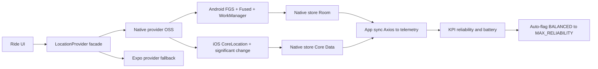

# Background tracking migration (Android/iOS) — runbook and architecture decision

| | |
|--|--|
| **Status** | Proposed (decision accepted, staged rollout) |
| **Owner role** | Mobile Lead |
| **Last reviewed** | 2026-06-11 |
| **Audience** | Mobile Lead, Platform Operator, QA, Founder |
| **lang** | en |
| **translation** | [Polski](../../pl/operations/MOBILE_BACKGROUND_TRACKING_MIGRATION.md) |
| **canonical_path** | docs/en/operations/MOBILE_BACKGROUND_TRACKING_MIGRATION.md |
| **Related** | [MOBILE.md](./MOBILE.md) · [DATA_RESILIENCE.md](../../DATA_RESILIENCE.md) · [adr/001-react-native-bridgeless.md](../../adr/001-react-native-bridgeless.md) |
| **Code** | `mobile/src/services/GpsSyncManager.ts`, `mobile/app.config.js`, `mobile/package.json` |

---

## 0. Purpose

Define **how to improve background location tracking reliability** on Android/iOS (battery optimization, app in background, Doze/OEM kill, different phone models) and **document the decision** to migrate from pure Expo to a native tracking provider — without recurring license fees and without breaking backend anti-cheat.

Owner decision:
- **Path:** migrate to a native background location library.
- **Default mode:** battery/reliability balance.
- **Rule:** if balance proves insufficient (KPI below threshold), **flag it** and in the next cycle propose switching to **maximum reliability** mode.

---

## 1. Current state (repository)

| Element | Where | Note |
|---------|-------|------|
| Tracking | [GpsSyncManager.ts](../../../mobile/src/services/GpsSyncManager.ts) | `expo-location` + `expo-task-manager`, task `BACKGROUND_LOCATION_TASK` |
| Profiles | `RESOLUTION_CONFIG` | `HYPERSCALE` / `BALANCED` / `POWER_SAVE` (`distanceInterval`, `deferredUpdatesInterval`, `accuracy`) |
| Foreground service | `startLocationUpdatesAsync(...)` | "4VELO — Tracking Active" notification |
| Permissions | [app.config.js](../../../mobile/app.config.js) | `ACCESS_BACKGROUND_LOCATION`, `FOREGROUND_SERVICE`, `FOREGROUND_SERVICE_LOCATION`, iOS `UIBackgroundModes: location, fetch` |
| Persistence | MMKV buffer + outbox | [DATA_RESILIENCE.md](../../DATA_RESILIENCE.md) |
| Recovery | `recoverGpsDataOnLaunch()` | Banner after relaunch |
| New Architecture | `app.config.js` `newArchEnabled: true`, RN 0.83.6 | Bridgeless mode |

**Conclusion:** the foundation is good (profiles, foreground service, outbox), but state persistence and wake-ups depend on the JS layer, which on Bridgeless + aggressive OEM/Doze can be unreliable (Headless JS, "Runtime not ready", update batching up to several minutes).

---

## 2. Typical Android/iOS problems (what actually breaks tracking)

### Android

| Problem | Symptom | Source |
|---------|---------|--------|
| Doze / App Standby | No updates with screen off (API 31+) | OS power management |
| OEM kill (Xiaomi/MIUI, Samsung, Huawei, Oppo) | Process killed despite foreground service | Vendor skins |
| Battery optimization ON | Tracking paused in background | No `ACTION_REQUEST_IGNORE_BATTERY_OPTIMIZATIONS` whitelist |
| FGS Android 14/15 | `SecurityException` without `FOREGROUND_SERVICE_LOCATION` | Service type requirement |
| Unstable `LocationManager` | No `onLocationChanged` with screen off | Fused Location Provider recommended |
| Batched updates | Points delivered in bulk after minutes | Energy saver buffering |

### iOS

| Problem | Symptom | Source |
|---------|---------|--------|
| Watchdog / 30 s budget | `SIGKILL 0x8BADF00D` on long wake | iOS background policy |
| App Nap / suspend | Stops in background | OS |
| `allowsBackgroundLocationUpdates` | No background updates when unset | CoreLocation |
| Deferred updates only low-power | Not in debug (Xcode keeps app awake) | CoreLocation |
| "Allow Once" | Silent fail of `requestBackground` | Permission policy |
| No FGS notification | Blue status bar instead of sticky card | iOS UX |

### Phone model differences
- Worst: **Xiaomi/Redmi (MIUI/HyperOS), Huawei, Oppo/Realme, Samsung (aggressive "Sleeping apps")**.
- Need UX guiding the user to vendor settings + battery whitelist.

---

## 3. Options and decision

| Option | Pro | Con | Verdict |
|--------|-----|-----|---------|
| Expo hardening (stay) | Lowest cost | Does not remove root cause (JS in background loop) | Fallback only |
| **Native OSS** (`@gabriel-sisjr/react-native-background-location`) | MIT, TurboModules, Room/Core Data, WorkManager, crash recovery | Less battle-tested than commercial | **Selected** |
| Transistorsoft `react-native-background-geolocation` | Battle-tested, Motion API | ~$350/yr license | Rejected (cost) |

**Decision:** native OSS provider with the "bypass JS in background" paradigm (native SQLite/Room/Core Data persistence, app-side sync), Expo as a feature-flagged fallback.

> Corrective note: `expo-location` is not "dead" on New Architecture — it works but has platform limits. OSS native is not a guaranteed 1:1 equivalent of Transistorsoft — it needs a POC and hard KPIs before full rollout.

---

## 4. Target architecture

Principle: the native layer collects and persists points independently of JS; the app reads batches (`getLocations(tripId)`), POSTs to telemetry, and on `200 OK` calls `clearTrip(tripId)`.

---

## 5. Parameterization for anti-cheat (do NOT break the backend)

The backend (Constitution §24.2) verifies telemetry in layers; wrong client parameters break verification. Binding settings:

| Backend layer | Goal | Client parameter | Value |
|---------------|------|------------------|-------|
| Fast Selection Gate | Reject teleports/vehicles | `accuracy` | `HIGH_ACCURACY` (GNSS only, not network/BTS) |
| Kalman (`GpsKalmanSmoother`) | Drift smoothing | `distanceFilter` | `0` or max 2–3 m (dense stream) |
| V-Max kinematics | Speed limits (RUN 12, BIKE 25, WALK 3.5 m/s) | `onUpdateInterval` | Stable throttle (e.g. 1 s sample, 3 s UI) |
| BRouter / Viterbi HMM | Map matching to OSM | frequency | Constant, no artificial gaps |
| ML Isolation Forest | Dense kinematic features | point density | Do not truncate (high density) |

**Forbidden:** high `distanceFilter` (15–20 m) "for battery" — it breaks Kalman and under-counts distance.

---

## 6. Implementation plan (stages)

1. **Provider facade** — `LocationProvider` interface, two implementations (`ExpoLocationProvider` legacy, `NativeLocationProvider`), feature flag. Change point: [GpsSyncManager.ts](../../../mobile/src/services/GpsSyncManager.ts).
2. **Native integration** — library + config plugin (Android FGS, iOS bg modes); map profiles `BALANCED/POWER_SAVE/HYPERSCALE` to native parameters.
3. **Android hardening** — diagnostic screen: permission status, battery optimization, power saver, OEM settings helper.
4. **iOS hardening** — `activityType`, pause/resume policy, restore after kill/reboot, "Allow Once" handling.
5. **KPI telemetry** — reliability and battery metrics per session.
6. **Escalation rule** — auto-flag when KPI < threshold.
7. **Documentation** — update [MOBILE.md](./MOBILE.md) + device test report in `docs/reports/`.

---

## 7. Device test matrix (minimum before release)

| Class | Example | Scenario |
|-------|---------|----------|
| Android stock | Pixel | Screen off 60 min, run |
| Aggressive Android OEM | Xiaomi/Redmi MIUI | Battery saver ON, app in background |
| Android OEM | Samsung (Sleeping apps) | Background + reboot mid-session |
| Current iPhone | iPhone 14/15 | Background + Always permission |
| Older iPhone | iPhone SE/11 | Low Power Mode + background |

For each: % rides completed without recovery, GPS gaps >60 s count, % dropped points, battery drain/h.

---

## 8. KPI and escalation rule (owner decision)

**Default:** `BALANCED`.

**Thresholds (per release/tenant, 2-week window):**

| KPI | Acceptance threshold |
|-----|----------------------|
| Rides completed without recovery | ≥ 97% |
| Sessions with GPS gap > 60 s | ≤ 3% |
| Sessions needing recovery (pending) | ≤ 2% |
| Battery drain / h of tracking | Reported (baseline) |

**Rule:** if any threshold is unmet for 2 consecutive weeks → mark as `BALANCE_INSUFFICIENT` and in the next cycle propose switching to **`MAX_RELIABILITY`** (`HYPERSCALE`-like: `HIGH_ACCURACY`, `distanceFilter` ~0, more frequent sampling, more aggressive foreground service) at the cost of battery.

---

## 9. Permissions and store compliance

- **Android 14/15:** `FOREGROUND_SERVICE_LOCATION` + sticky notification; `ACCESS_BACKGROUND_LOCATION` requested separately after foreground; review requires justification.
- **iOS:** `UIBackgroundModes: location`, `allowsBackgroundLocationUpdates`, `Info.plist` descriptions; justification: anti-cheat for race rewards (Milestone Rewards).
- **Review justification:** continuous tracking required for fair play in prize leagues (cycling/running/nordic walking).

---

## 10. Rollback

| Layer | Action |
|-------|--------|
| Feature flag | Switch provider to `ExpoLocationProvider` (legacy) |
| Build | Previous EAS tag (`eas build`) |
| Profile | Force `POWER_SAVE` or `BALANCED` if `MAX_RELIABILITY` drains battery |

---

## 11. References

- GitHub: [`@gabriel-sisjr/react-native-background-location`](https://github.com/gabriel-sisjr/react-native-background-location), [`react-native-background-guardian`](https://github.com/ivangonzalezg/react-native-background-guardian) (OEM/Doze helpers), [Transistorsoft `react-native-background-geolocation`](https://github.com/transistorsoft/react-native-background-geolocation) (commercial reference)
- [Android — Launch a foreground service](https://developer.android.com/develop/background-work/services/fgs/launch)
- [Apple — deferredLocationUpdatesAvailable](https://developer.apple.com/documentation/corelocation/cllocationmanager/deferredlocationupdatesavailable())
- [Expo Location](https://docs.expo.dev/versions/latest/sdk/location/)
- Internal: [DATA_RESILIENCE.md](../../DATA_RESILIENCE.md), [MOBILE.md](./MOBILE.md), [ADR-001 Bridgeless](../../adr/001-react-native-bridgeless.md)

---

## 12. Source and scope

This document is based on an analysis of the mobile stack (RN 0.83.6 / Expo SDK 55 / New Architecture), Android/iOS problems, and GitHub research. Decision: migrate to a native OSS provider, default battery/reliability balance, with an escalation rule to maximum reliability. Staged rollout with an Expo fallback.
