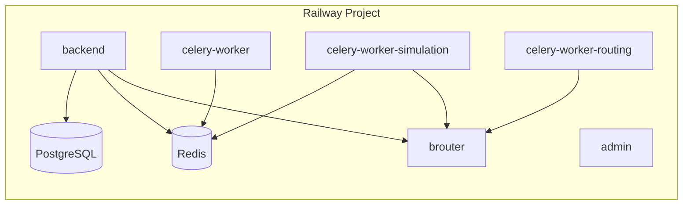
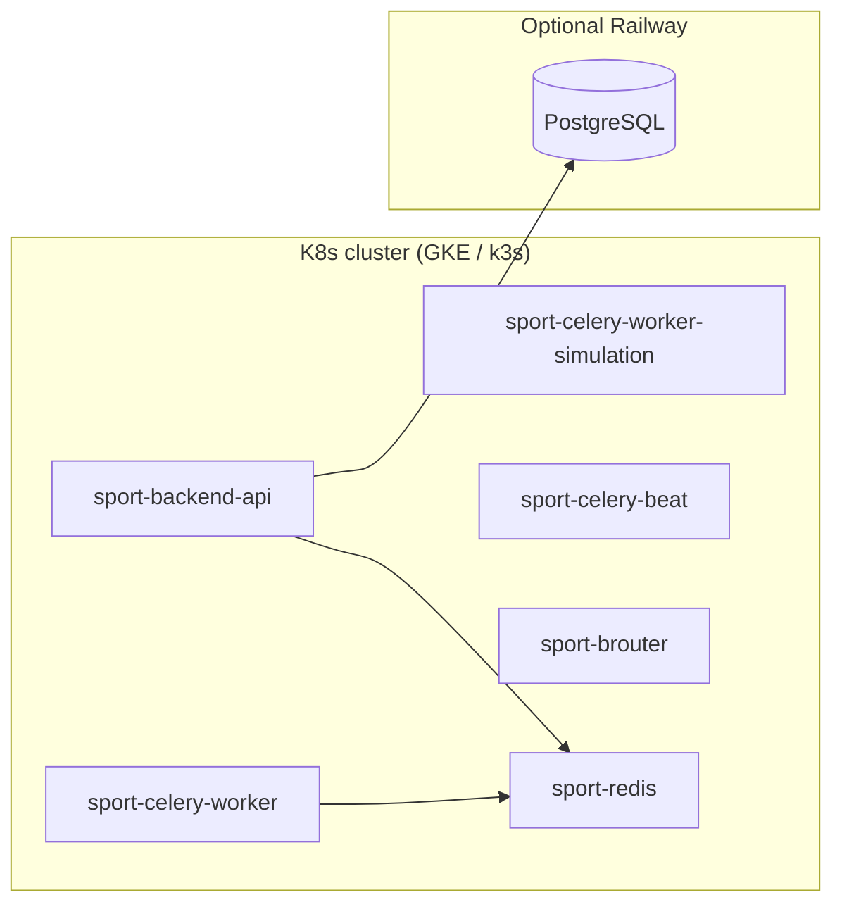

# Railway and Kubernetes — deployment decision guide

| | |
|--|--|
| **Status** | ✅ Active |
| **Owner role** | Documentation maintainer |
| **Last reviewed** | 2026-06-04 |
| **Audience** | See canonical document |
| **lang** | en |
| **translation** | [Polski](../../pl/operations/RAILWAY_KUBERNETES.md) |
| **translation_status** | reviewed |
| **translation_reviewed** | 2026-06-04 |
| **canonical_path** | docs/en/operations/RAILWAY_KUBERNETES.md |

---

**Status:** ✅ Active  
**Last update:** 2026-06-03  
**Context:** production on Railway (Docker + `railway.json`), manifests in `infrastructure/k8s/`.  
**Related:** [OPERATIONS_INDEX.md](./OPERATIONS_INDEX.md) · [RAILWAY_PRODUCTION_CHECKLIST.md](./RAILWAY_PRODUCTION_CHECKLIST.md)

---

## TL;DR — "Kubernetes on Railway"

| Question | Answer |
|---------|--------|
| Does Railway host **managed Kubernetes** (EKS/GKE-like)? | **No.** Railway is a PaaS: Docker services, managed databases, internal network `*.railway.internal`. |
| Is there a "Railway K8s" beta? | **No official offering** (2025/2026). Railway publicly positions itself as a platform *without* K8s/Helm/Terraform for typical teams. |
| What to do **today** on Railway production? | **Option B** — native Railway scaling + manifests as a future target. |
| When **Option A** (a real cluster)? | When you need HPA across nodes, your own ingress/controller, multi-region compute, or BYOC — then **GKE / k3s / other managed K8s**; Postgres/Redis can stay on Railway or migrate together. |

Manifests in the repository **do not break** the current Railway deployment — they are additive. This document describes the migration mapping and checklist.

---

## 1) What Railway actually offers

Railway runs **containers** from the repository:

- `backend/railway.json`, `admin/railway.json`, `celery-worker/railway.json`, `celery-worker-simulation/railway.json`, `celery-worker-routing/railway.json`, `telemetry/railway.json`, `infrastructure/brouter/railway.json`
- Build: **Dockerfile** (or Nixpacks)
- Scaling: **Replicas** per service, **RAM/CPU** under Settings → Resources, variables under **Variables**
- Network: public URL + private `http://<service>.railway.internal:<port>`
- Databases: **PostgreSQL**, **Redis** as separate plugins (`DATABASE_URL`, `REDIS_URL`)

This is **not** a Kubernetes cluster. You do not `kubectl apply` on Railway — Railway does not expose the Kubernetes API.

---

## 2) Target architectures

### Option B (recommended **now**) — Railway-native

Stay on Railway for **compute**; use manifests as **documentation / future** target.



**What to configure today (Dashboard):**

1. **Project** → linked GitHub repo, branch `main`, auto-deploy enabled.
2. **Services** (each with the correct root / `railway.json`):
   - `backend` — root `backend/` or Dockerfile from repo
   - `admin` — root `admin/`
   - `celery-worker` — Dockerfile `celery-worker/`
   - `celery-worker-simulation` — Dockerfile `celery-worker-simulation/`
   - `brouter` — `infrastructure/brouter/Dockerfile`, segment volume
3. **PostgreSQL + Redis** — Add Database; wire `${{Postgres.DATABASE_URL}}` references into Django/Celery services.
4. **Variables** — copy from `infrastructure/k8s/config/railway-to-k8s.env.template` (per-service sections).
5. **Resources** — simulation worker **≥ 2 GB RAM**; see [RAILWAY_CELERY_MEMORY.md](./RAILWAY_CELERY_MEMORY.md).
6. **Replicas** — for large live sim: a second `celery-worker-simulation` replica instead of `CONCURRENCY=8` on low RAM.
7. **Networking** — `BROUTER_URL=http://brouter.railway.internal:17777/brouter` on backend + simulation workers.
8. **Custom domain** — Settings → Domains on backend/admin; update `ALLOWED_HOSTS`, `CORS_ALLOWED_ORIGINS`, OAuth redirect URI.

Worker details: [RAILWAY_CELERY_SIMULATION.md](../../RAILWAY_CELERY_SIMULATION.md), [DEPLOYMENT.md](../../DEPLOYMENT.md).

### Option A — real Kubernetes (compute off Railway)

Compute on **GKE / DigitalOcean K8s / k3s (Hetzner, OVH, own VPS)**. Data optionally:

- **A1:** Postgres + Redis still on Railway (`DATABASE_URL` / `REDIS_URL` in k8s Secret) — fast start, single-region.
- **A2:** Full DB migration to Cloud SQL / managed Postgres in the K8s cloud — less Railway dependency.



Apply runbook: [KUBERNETES.md](./KUBERNETES.md).

### Option C — "Railway K8s beta"

**N/A** — no product to document. If Railway announces K8s, update this document; until then treat **Option B** as production source of truth.

---

## 3) Mapping: Railway service ↔ K8s manifest

| Railway (service) | K8s Deployment | Notes |
|------------------|----------------|-------|
| `backend` | `sport-backend-api` | Gunicorn, health `/api/infra/health/` |
| `celery-worker` | `sport-celery-worker` | Queues `critical,default,notifications` |
| `celery-worker-simulation` | `sport-celery-worker-simulation` | Queue `simulation` |
| *(no separate Railway service)* | `sport-celery-beat` | On Railway Beat often shares the worker image — in k8s a separate Deployment |
| `brouter` | `sport-brouter` | PVC for tiles in k8s; on Railway **Volume** |
| Redis plugin | `sport-redis` | In-cluster in k8s; **managed Redis** on Railway |
| PostgreSQL plugin | *(external)* | In k8s `DATABASE_URL` in Secret, not `optional/postgres` |

Variables: template **`infrastructure/k8s/config/railway-to-k8s.env.template`** — same keys as `app-configmap.yaml` + `app-secrets.template.yaml`, with comments for which Railway service sets them.

---

## 4) Railway → k3s / GKE migration checklist

Use when planning to leave Railway **compute** (databases can move in a separate step).

### Phase 0 — preparation

- [ ] Account and cluster (e.g. GKE Autopilot or k3s on 2+ VMs)
- [ ] `kubectl`, `metrics-server`, ingress controller (nginx / traefik)
- [ ] Image registry: GHCR (`ghcr.io/<org>/sport-backend:latest` etc.) — build from the same Dockerfiles as Railway
- [ ] Copy production variables from Railway Variables → fill `app-secrets` + `app-configmap` (see env template)

### Phase 1 — data (highest risk)

- [ ] Snapshot Postgres (Railway → backup → restore in target DB **or** logical `pg_dump`)
- [ ] Maintenance window; set `MAINTENANCE_MODE` if you have the flag
- [ ] New `DATABASE_URL` in k8s Secret; test connection from migrate job

### Phase 2 — Redis / BRouter

- [ ] Redis: cloud-managed **or** `kubectl apply -f workloads/redis.yaml`
- [ ] BRouter: PVC + import Polish tiles (see [BROUTER.md](./BROUTER.md))
- [ ] `BROUTER_URL` in ConfigMap points to k8s Service

### Phase 3 — application (order from KUBERNETES.md)

```bash
kubectl apply -f infrastructure/k8s/namespace.yaml
kubectl apply -f infrastructure/k8s/config/app-configmap.yaml
# Secrets: generate from railway-to-k8s.env.template; do NOT commit values
kubectl apply -f infrastructure/k8s/config/app-secrets.yaml   # local file, .gitignore
kubectl apply -f infrastructure/k8s/workloads/redis.yaml      # if in-cluster
kubectl apply -f infrastructure/k8s/workloads/brouter.yaml
kubectl apply -f infrastructure/k8s/jobs/migrate-job.yaml
kubectl wait --for=condition=complete job/sport-backend-migrate -n sport --timeout=300s
kubectl apply -f infrastructure/k8s/workloads/api.yaml
kubectl apply -f infrastructure/k8s/workloads/worker.yaml
kubectl apply -f infrastructure/k8s/workloads/worker-simulation.yaml
kubectl apply -f infrastructure/k8s/workloads/beat.yaml
kubectl apply -f infrastructure/k8s/policy/
kubectl apply -f infrastructure/k8s/network/ingress.yaml
```

### Phase 4 — traffic switch

- [ ] DNS: `api.<domain>` → Ingress LB
- [ ] `ALLOWED_HOSTS`, TLS cert (cert-manager)
- [ ] Smoke: health, admin login, one live sim tick
- [ ] Disable Railway auto-deploy **only after** stable k8s (compute services can be removed; keep DB until replication is ready)

### Phase 5 — rollback

- [ ] Keep DB snapshot and previous Railway deployment (Rollback in Dashboard)
- [ ] `kubectl rollout undo deployment/sport-backend-api -n sport`

---

## 5) Scaling on Railway (without K8s) — what to set today

| Goal | Where in Railway | Action |
|-----|-----------------|--------|
| More API throughput | `backend` → Settings → **Replicas** or higher CPU plan | 2+ replicas behind Railway load balancer |
| Queue backlog growing | `celery-worker` → Replicas / `CELERY_WORKER_CONCURRENCY` | See [RAILWAY_CELERY_MEMORY.md](./RAILWAY_CELERY_MEMORY.md) |
| Live sim / 300k | `celery-worker-simulation` | `CELERY_WORKER_POOL=solo`, caps `SCALE_*`, RAM ≥ 2 GB, optionally **Replicas=2** |
| OOM SIGKILL | Same service → **Resources** | Lower concurrency or increase RAM |
| BRouter timeout | `brouter` volume + health | [BROUTER.md](./BROUTER.md) |

Variables in `celery-worker-simulation/railway.json` are already a safe baseline — **do not override** with higher `CELERY_WORKER_CONCURRENCY` without increasing RAM.

---

## 6) Files in the repository

| File | Role |
|------|------|
| `infrastructure/k8s/` | Production manifests (k8s target) |
| `infrastructure/k8s/config/railway-to-k8s.env.template` | Railway env ↔ ConfigMap/Secret mapping |
| `docs/pl/operations/KUBERNETES.md` | `kubectl apply` runbook (canonical PL) |
| `docs/en/operations/KUBERNETES.md` | English mirror |
| `docs/pl/operations/RAILWAY_CELERY_MEMORY.md` | Railway worker tuning |
| `scripts/ops/check-railway-k8s-env-parity.ps1` | Compare keys with template (local) |

---

## 7) FAQ

**Can I deploy `infrastructure/k8s` to Railway?**  
No — Railway does not run manifests. Keep them in the repo and apply on an external cluster.

**Is migrating to K8s worth it?**  
Only if you need platform control (custom HPA, multi-cluster, compliance). For a single product on Railway, **Option B** is cheaper to operate.

**Postgres stays on Railway with k8s API?**  
Yes (A1) — set `DATABASE_URL` in Secret to the Railway URL (enable SSL if required). Watch cross-cloud latency.

---

## Related documents

- [KUBERNETES.md](./KUBERNETES.md)
- [RAILWAY_CELERY_MEMORY.md](./RAILWAY_CELERY_MEMORY.md)
- [RAILWAY_CELERY_SIMULATION.md](../../RAILWAY_CELERY_SIMULATION.md)
- [DEPLOYMENT.md](../../DEPLOYMENT.md)
