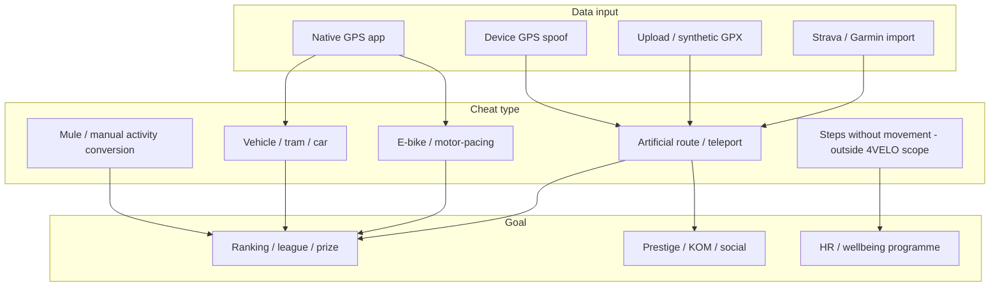
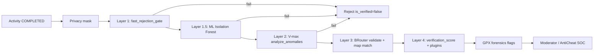

# SPORT / 4VELO — report: how cheating athletes operate

| | |
|--|--|
| **Status** | Active |
| **Date** | 2026-06-11 |
| **Owner role** | Product / Security / Moderation |
| **Audience** | Product, Engineering, Moderation, Sales, Legal |
| **lang** | en |
| **translation** | [Polski](../../reports/SPORT_CHEATING_ATHLETES_REPORT_2026-06-11.pl.md) |
| **canonical_path** | docs/en/reports/SPORT_CHEATING_ATHLETES_REPORT_2026-06-11.en.md |
| **Related** | [Market GTM report](./SPORT_FULL_CONVERSATION_REPORT_2026-06-11.en.md) · [90-day checklist](./SPORT_DELIVERY_CHECKLIST_90D_2026-06-11.en.md) |

---

## 0. Purpose

Describe **how participants actually cheat** in sports-competition apps (city leagues, companies, clubs), focused on **4VELO's three product disciplines**:

- **cycling**,
- **running**,
- **nordic walking**.

This report combines: community signals (Reddit, forums), market incidents (Strava, step challenges), open-source tools (GitHub), competitor benchmarks, and the **existing anti-cheat pipeline in the SPORT repository**.

Operational goal: know **what to defend rankings against**, what to communicate to clients (local government / HR / clubs), and which product gaps to close.

---

## 1. Scope and assumptions

| In scope | Out of scope (by design) |
|----------|--------------------------|
| GPS spoof, vehicle, e-bike, fake GPX, mules, duplicate routes | Step-only wellness (Activy) — competitor context only |
| Cycling, running, nordic walking (`WALK` type in backend) | 18 disciplines like Aktywne Miasta |
| Cheating with prizes / leagues / KOMs | Esport, gambling, move-to-earn |
| 4VELO technical defence + moderation playbook | Full legal analysis of contest regulations |

**Nordic walking in code:** mapped to `WALK` with a kinematic limit of ~3.5 m/s (~12.6 km/h) — higher than casual walking, below running.

---

## 2. Methodology

| Source | What it provides |
|--------|------------------|
| [SPORT_FULL_CONVERSATION_REPORT_2026-06-11.en.md](./SPORT_FULL_CONVERSATION_REPORT_2026-06-11.en.md) | Market context, AM/Strava issues, fair-play pitch |
| SPORT repository (`backend/activities/`) | Actual anti-cheat layers and forensics |
| Internet: Strava, Fast Company, BikeRadar, MoveSpring, TestDevLab, Upkeep | Methods and market responses |
| GitHub: `fake-run`, `jogmock`, `strava-cheater` | GPX generation/manipulation tools |
| Communities: Reddit, AnandTech, People.com, Wykop (prior research) | User motivations and "hacks" |

Note: this report documents **publicly known attack vectors** solely for product defence and fair-play policy — not as instructions.

---

## 3. Cheating taxonomy (common model)

### Matrix: method × discipline × detectability (simplified)

| Method | Cycling | Running | Nordic walking | Typical detectability without tech |
|--------|:-------:|:-------:|:--------------:|-------------------------------------|
| Car / tram ride | ✓✓✓ | ✓✓ | ✓ | Low (rules only) |
| E-bike logged as regular ride | ✓✓✓ | — | — | Medium (Strava ML) |
| GPS Joystick / mock location | ✓✓ | ✓✓ | ✓✓ | Low |
| Fake GPX (web/GitHub generator) | ✓✓ | ✓✓ | ✓ | Low |
| Mule / paid "run for you" | ✓ | ✓ | ○ | Very low |
| Shake-phone (steps) | — | — | — | N/A (outside product) |
| Run instead of NW / NW instead of walk | — | ✓ | ✓✓ | Low without pole sensors |

Legend: ✓✓✓ very common · ✓✓ common · ✓ possible · — rarely relevant

---

## 4. Cheating methods — details

### 4.1 Vehicle and public transport (most common in km leagues)

**How it works:** user records a route on a tram, bus, or in a car (sometimes "forgets to stop GPS" after training — honest mistake or excuse).

**Kinematic signature:**
- high, stable speed (low coefficient of variation),
- high displacement / track length ratio (straight line),
- GPS jumps (teleport) with poor signal or spoof.

**Why it works in leagues:** km sum for city/company/club — one long ride "delivers" more than a week of training.

**Market examples:** AM incident (km complaints), STADTRADELN GPS FAQ, Strava removes millions of "in vehicle" activities.

**4VELO defence:** layer 1 `fast_rejection_gate` — TELEPORT, ACCEL, MOTOR_FINGERPRINT, STRAIGHT-LINE RATIO tests (`backend/activities/signal_processing.py`).

---

### 4.2 GPS spoofing (mock location apps)

**How it works:** on Android (more often), apps like "GPS Joystick", "Mock Locations" — device reports false position without physical movement. User can "ride" a map route from home.

**Why popular:** no effort, fast km, hard to detect without sensor analysis (accelerometer, barometer) — Strava Community notes lack of a `spoofed` flag in the API.

**Risk for 4VELO:** slow spoof with artificial variability may pass simple speed thresholds (Naviki pattern: 25/50 km/h is insufficient).

**4VELO defence:** gate + ML (Isolation Forest, 8 kinematic features) + BRouter (route must be routable on the road network) + GPS vs BRouter distance comparison.

---

### 4.3 Synthetic and edited GPX/TCX files

**How it works:**

1. **Route generators** — draw on a map, set pace, download GPX, upload to Strava/Garmin/organizer.
2. **Speed editors** — speed multiplier on an existing file (all timestamps scaled proportionally).
3. **"Realistic" generators** — Perlin noise on speed (harder to catch with rules).

**Economics:** FakeMy.Run ~$0.42/file; "Strava mules" $10–20 to "run for someone" (Fast Company, NYT cited in press).

**GitHub repositories (2025–2026 sample):**

| Repo | Description | Threat |
|------|-------------|--------|
| [Lo9ic/fake-run](https://github.com/Lo9ic/fake-run) | Web: draw route, pace, GPX export (Strava/Garmin) | High — low barrier |
| [renbou/jogmock](https://github.com/renbou/jogmock) | CLI: Perlin noise on speed, Strava upload | High — "looks like a real run" |
| [snmslavk/strava-cheater](https://github.com/snmslavk/strava-cheater) | GPX/TCX speed multiplier | Medium — wearable import |

**4VELO defence:**
- `route_fingerprint` — same route hash for another user → `duplicate_route_fingerprint` flag (`gpx_forensics.py`),
- `metadata_distance_mismatch` — metadata distance vs polyline >15%,
- Strava/Garmin import → `wearable_imported` flag (higher risk, needs policy).

---

### 4.4 E-bike and motor assistance (cycling)

**How it works:** electric bike logged as a "regular ride"; motor-pacing (drafting a car); downhill with unrealistic average speed.

**Market scale:** Strava (2025–2026) removed **2.3M** e-bike activities logged as regular rides, **1.6M** vehicle activities; ML model on **57 factors** (speed, acceleration, etc.) — BikeRadar, Strava Engineering Blog.

**Industry gaps:** drafting, tailwind, peloton, velodrome — Strava acknowledges false negatives and false positives.

**4VELO defence:**
- `BIKE` V-max 25 m/s (~90 km/h) in `analyze_anomalies` / forensics,
- MOTOR_FINGERPRINT (unnaturally constant speed),
- no explicit "e-bike declared" model — **product gap** if clients require category split.

---

### 4.5 Social and organizational cheating

**Mule (human for someone else):** someone physically runs/rides but activity is on another account (paid service). Technically GPS is "real" — detection needs account/device/time patterns.

**Manual step conversion (company context):** coworker ~65,000 steps by converting yoga/volleyball (People.com / Reddit) — organizer did not disqualify.

**Non-technical manipulation:** false km claims to support (AM: 1000+ complaints after server crash), political pressure on local government.

**HR playbook (MoveSpring):** do not accuse publicly; collect dates and data; user explanation; quiet accusation chat.

---

### 4.6 Nordic walking — specifics

**Typical cheats in km leagues:**
- **running instead of NW** (higher speed, different biomechanics) — GPS alone cannot distinguish,
- **cycling / skating** with phone — caught by vehicle gate,
- **spoof** along a bike path — BRouter may help if unroutable for `WALK`.

**Market direction (outside 4VELO):** smart poles (Gabel e-poles, ONWF European Championships 2026) — pole sensors: plant timing, ground contact, arm sync; detecting run vs proper technique.

**Implication for 4VELO:** for NW positioning, **GPS + kinematic anti-cheat is the minimum**; distinguishing NW technique from running is a **gap** without extra signals (cadence, accelerometer, optional external device).

**Code limits:** `WALK` max 3.5 m/s — amateur runner on a short segment may exceed; requires **whole-route** analysis, not single segment.

---

### 4.7 Honest errors vs cheating (false positive / false negative)

| Situation | Looks like cheat | Actually |
|-----------|------------------|----------|
| Weak GPS in tunnel | Teleport, jumps | Device error |
| Cycling descent | Speed > limit | Legal downhill |
| Elite runner | V-max spike | Real sprint |
| Phone in NW pocket | Irregular GPS | Poor signal |
| GPS left on in car after workout | Whole route in vehicle | User mistake (Strava: crop) |

Product must distinguish **technical rejection** vs **flag for moderation** — today `auto_ban` in `process_activity_async` may reject aggressively (`telemetry:config`).

---

## 5. What competitors do

| Platform | Approach | Effectiveness |
|----------|----------|---------------|
| **Strava** | ML 57 features, auto-flag, community flag, mass leaderboard backfill | High on KOMs; weaker outside segments |
| **Naviki** | 25/50 km/h thresholds, max 100 km length | Basic — spoof still possible |
| **Aktywne Miasta** | No public tech policy | Low with prizes |
| **Activy / MoveSpring** | Rules + HR investigation; no GPS anti-cheat | Very low on steps |
| **Upkeep / advanced step apps** | GPS + cadence + HR correlation | Medium, steps only |

Conclusion from [GTM report](./SPORT_FULL_CONVERSATION_REPORT_2026-06-11.en.md): **fair play is a 4VELO USP only if visible** (public policy, verification status in UI, organizer report).

---

## 6. 4VELO anti-cheat pipeline (repository state)

### Layers — summary

| Layer | File / module | What it catches |
|-------|---------------|-----------------|
| **1 — Fast gate** | `signal_processing.fast_rejection_gate` | Teleport >500 m, accel >6 m/s², speed CV <5%, straight line >92% |
| **1.5 — ML** | `ml_anomaly.py` | Statistical anomalies (8 features: mean/std speed, CV, accel, p90, fast fraction, straight ratio, seg var) |
| **2 — V-max** | `analyze_anomalies` | RUN 12 m/s, BIKE 25 m/s, WALK 3.5 m/s; anomaly ratio >20% or 3+ consecutive violations |
| **3 — BRouter** | `BRouterService.validate_track` | Unroutable track / topo distance vs GPS |
| **4 — Score + plugins** | `tasks.process_activity_async` | `verification_score`, `registry.fire('validate_activity')` |
| **Forensics (batch)** | `gpx_forensics.scan_activity_forensics` | Duplicate fingerprint, distance mismatch, peak speed, wearable import, sim |

**V-max limits (m/s):** RUN 12 · BIKE 25 · WALK 3.5 · WHEELCHAIR 8 (`signal_processing.py`, `gpx_forensics.py`).

**Moderation:** panel `admin/src/modules/anti-cheat/AntiCheat.tsx`, API `AntiCheatEngine.get_recent_anomalies`.

---

## 7. Still-possible vectors (gaps)

| Vector | Why it passes | Mitigation priority |
|--------|---------------|---------------------|
| "Realistic" GPX (jogmock) at moderate speed | Meets V-max and may pass BRouter | Higher ML weight + route duplicates + league import limits |
| Mule / shared account | Real GPS, different owner | Device binding, account anomalies, rate limits |
| Moderate e-bike | Below "motor vehicle fingerprint" | Category declaration, power/cadence from Garmin when available |
| NW vs run | Same `WALK` type | Step cadence, optional smart-pole partner (long term) |
| Slow spoof on winding streets | Higher CV, lower straight ratio | Accelerometer in mobile (not in server-only pipeline) |
| Teammate rides "for the club" | Morally grey, technically OK | Rules + normalization per active member, not sum |
| Organizer does not enforce | No process | HR/local-gov playbook + fair-play flags report |

---

## 8. Recommendations for 4VELO

### Tier 0 — policy and trust (no code)

1. **Public Anti-Cheat / Scoring Policy** — explicit disqualification criteria, appeal process (from GTM checklist).
2. **User UI status:** verified / queued / rejected + reason (not just "missing km").
3. **League rules:** vehicle, spoof, third-party GPX, mules forbidden; with prizes — moderator verification.

### Tier 1 — product (90 days)

4. **Limit disciplines** to cycling / running / NW in UI and rules (already in checklist).
5. **Prize leagues:** default to `is_verified=true` activities + native GPS only (Strava/Garmin import = flag, no auto-count or lower weight).
6. **End-of-season report** with `forensics_flags` and rejection % (for HR/mayor).
7. **Calibrate `auto_ban`:** hard reject vs soft flag for moderation (fewer false positives on descents).

### Tier 2 — technical hardening

8. **Accelerometer / cadence** in mobile as auxiliary signal (verify "device was moving").
9. **NW heuristics:** typical average 1.5–2.5 m/s; long stretches >4 m/s → "possible run not NW" flag.
10. **Graph fraud:** same route fingerprint across many tenants / events.
11. **Retrain ML** on labeled production rejections (Strava model: labeled data from community flags).

### Deliberately not at start

- Full smart-pole integration (Gabel) — federation niche, not corporate league MVP.
- Competing with Strava on KOM segment detection — different use case (tenant leagues).

---

## 9. Moderation playbook (operational summary)

1. **Queue priority:** `verification_score` < 0.15 (critical) → < 0.25 (high) — `AntiCheatEngine.anomaly_severity`.
2. **Check flags:** `duplicate_route_fingerprint`, `kinematic_speed_anomaly`, `metadata_distance_mismatch`, `wearable_imported`.
3. **Do not publish accusations** in league chat (MoveSpring pattern).
4. **Contact user:** specific dates and metrics ("14 Jun average 38 km/h for 40 min").
5. **Decisions:** approve (false positive) · reject activity · warn · ban from event · escalate to GO.
6. **Time target:** <60 s per case (from TENANT_ADMIN overhaul) — measure in production.

---

## 10. Summary

Cheating athletes in **cycling / running / nordic walking** leagues most often:

1. **"Deliver km" by vehicle** or e-bike (biggest ranking impact),
2. **Synthetically generate GPX** (web and GitHub tools — low cost),
3. **Spoof GPS** on the phone,
4. **Use mules / imports** where the organizer does not verify,
5. In NW, **substitute running for technique** — GPS cannot see this.

4VELO has a **rare municipal-market stack** (gate + ML + V-max + BRouter + forensics), but **winning leagues also depends on process** (policy, moderation, reporting). The biggest product gap vs NW ambition: **no biomechanical signal** beyond GPS kinematics.

---

## 11. Sources and scope

- Internal docs: `docs/reports/SPORT_*_2026-06-11*.md`, `docs/pl/ARCHITECTURE.md`, `docs/admin/P2_ROADMAP.md`
- Code: `backend/activities/tasks.py`, `signal_processing.py`, `ml_anomaly.py`, `gpx_forensics.py`, `services.py`
- External: [Strava Segment Guidelines](https://support.strava.com/hc/en-us/articles/216919507), [Strava Engineering — leaderboards](https://stories.strava.com/articles/keeping-stravas-segment-leaderboards-fair-an-engineers-perspective), [BikeRadar — Strava cleanup](https://www.bikeradar.com/news/strava-deletes-2-3m-electric-bike-activities), [Fast Company — Fake My Run](https://www.fastcompany.com/91345326/this-viral-app-lets-users-upload-fake-workouts-to-strava), [TestDevLab — fitness app cheating](https://www.testdevlab.com/blog/testing-fitness-apps-can-you-cheat-the-algorithm), [Upkeep — step anti-cheat](https://upkeep.social/blog/how-anti-cheat-works-step-challenge-apps), GitHub: fake-run, jogmock, strava-cheater

Report prepared 2026-06-11. Does not replace legal advice for prize contest regulations.
