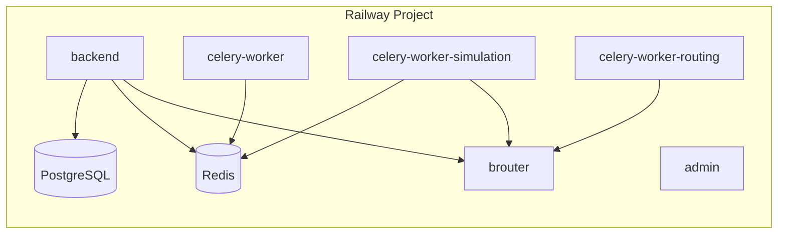
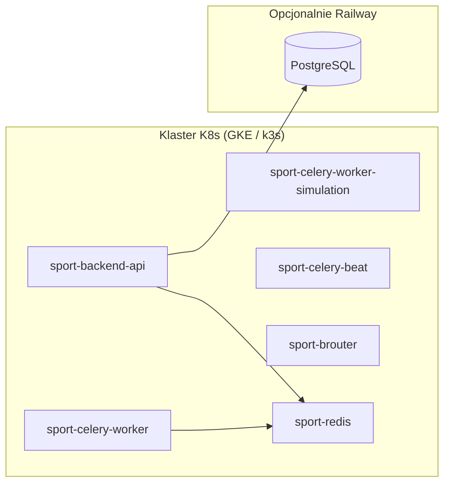

# Railway a Kubernetes — decyzja i ścieżka wdrożenia

**Status:** ✅ Active  
**Ostatnia aktualizacja:** 2026-06-03  
**Kontekst:** produkcja na Railway (Docker + `railway.json`), manifesty w `infrastructure/k8s/`.  
**Powiązane:** [OPERATIONS_INDEX.md](./OPERATIONS_INDEX.md) · [RAILWAY_PRODUCTION_CHECKLIST.md](./RAILWAY_PRODUCTION_CHECKLIST.md)

---

## TL;DR — odpowiedź na „Kubernetsy na Railway”

| Pytanie | Odpowiedź |
|---------|-----------|
| Czy Railway hostuje **managed Kubernetes** (EKS/GKE‑like)? | **Nie.** Railway to PaaS: usługi Docker, bazy zarządzane, sieć wewnętrzna `*.railway.internal`. |
| Czy jest beta „Railway K8s”? | **Brak oficjalnej oferty** (2025/2026). Railway publicznie opisuje się jako platforma *bez* K8s/Helm/Terraform dla typowych teamów. |
| Co robić **dziś** na produkcji Railway? | **Opcja B** — skalowanie natywne Railway + manifesty jako przyszły target. |
| Kiedy **Opcja A** (prawdziwy klaster)? | Gdy potrzebujesz HPA na wielu nodach, własnego ingress/controllera, multi-region compute, BYOC — wtedy **GKE / k3s / inny managed K8s**, a Postgres/Redis mogą zostać na Railway lub migrować razem. |

Manifesty w repozytorium **nie psują** obecnego deployu Railway — są additive. Ten dokument opisuje mapowanie i checklistę migracji.

---

## 1) Co Railway faktycznie oferuje

Railway uruchamia **kontenery** z repozytorium:

- `backend/railway.json`, `admin/railway.json`, `celery-worker/railway.json`, `celery-worker-simulation/railway.json`, `celery-worker-routing/railway.json`, `telemetry/railway.json`, `infrastructure/brouter/railway.json`
- Build: **Dockerfile** (lub Nixpacks)
- Skalowanie: **Replicas** na serwisie, **RAM/CPU** w Settings → Resources, zmienne w **Variables**
- Sieć: publiczny URL + prywatna `http://<service>.railway.internal:<port>`
- Bazy: **PostgreSQL**, **Redis** jako osobne pluginy (zmienne `DATABASE_URL`, `REDIS_URL`)

To **nie jest** klaster Kubernetes. Nie aplikujesz `kubectl apply` na Railway — Railway nie eksponuje API Kubernetes.

---

## 2) Architektury docelowe

### Opcja B (zalecana **teraz**) — Railway-native

Zostań na Railway dla **compute**, używaj manifestów jako **dokumentacji / przyszłego** targetu.



**Co kliknąć / ustawić dziś (Dashboard):**

1. **Project** → połączone repo GitHub, branch `main`, auto-deploy włączony.
2. **Serwisy** (każdy z właściwym root / `railway.json`):
   - `backend` — root `backend/` lub Dockerfile z repo
   - `admin` — root `admin/`
   - `celery-worker` — Dockerfile `celery-worker/`
   - `celery-worker-simulation` — Dockerfile `celery-worker-simulation/`
   - `brouter` — `infrastructure/brouter/Dockerfile`, volume segmentów
3. **PostgreSQL + Redis** — Add Database; podłącz referencje `${{Postgres.DATABASE_URL}}` do serwisów Django/Celery.
4. **Variables** — skopiuj z szablonu `infrastructure/k8s/config/railway-to-k8s.env.template` (sekcje per serwis).
5. **Resources** — simulation worker **≥ 2 GB RAM**; patrz [RAILWAY_CELERY_MEMORY.md](./RAILWAY_CELERY_MEMORY.md).
6. **Replicas** — przy dużym live sim: druga replika `celery-worker-simulation` zamiast `CONCURRENCY=8` na małym RAM.
7. **Networking** — `BROUTER_URL=http://brouter.railway.internal:17777/brouter` na backend + workerach symulacji.
8. **Custom domain** — Settings → Domains na backend/admin; zaktualizuj `ALLOWED_HOSTS`, `CORS_ALLOWED_ORIGINS`, redirect URI OAuth.

Szczegóły workerów: [RAILWAY_CELERY_SIMULATION.md](../RAILWAY_CELERY_SIMULATION.md), [DEPLOYMENT.md](../DEPLOYMENT.md).

### Opcja A — prawdziwy Kubernetes (poza Railway compute)

Compute na **GKE / DigitalOcean K8s / k3s (Hetzner, OVH, własny VPS)**. Dane opcjonalnie:

- **A1:** Postgres + Redis nadal na Railway (tylko `DATABASE_URL` / `REDIS_URL` w Secret k8s) — szybki start, single-region.
- **A2:** Pełna migracja DB do Cloud SQL / managed Postgres w chmurze K8s — mniej zależności od Railway.



Runbook apply: [KUBERNETES.md](./KUBERNETES.md).

### Opcja C — „Railway K8s beta”

**Nie dotyczy** — brak produktu do udokumentowania. Jeśli Railway kiedyś ogłosi K8s, ten dokument należy zaktualizować; do tego czasu traktuj **Opcję B** jako źródło prawdy dla produkcji.

---

## 3) Mapowanie: serwis Railway ↔ manifest K8s

| Railway (serwis) | K8s Deployment | Uwagi |
|------------------|----------------|-------|
| `backend` | `sport-backend-api` | Gunicorn, health `/api/infra/health/` |
| `celery-worker` | `sport-celery-worker` | Kolejki `critical,default,notifications` |
| `celery-worker-simulation` | `sport-celery-worker-simulation` | Kolejka `simulation` |
| *(brak osobnego serwisu)* | `sport-celery-beat` | Na Railway Beat często w tym samym obrazie co worker — w k8s osobny Deployment |
| `brouter` | `sport-brouter` | PVC na kafelki w k8s; na Railway **Volume** |
| Redis plugin | `sport-redis` | W k8s in-cluster; na Railway **managed Redis** |
| PostgreSQL plugin | *(external)* | W k8s `DATABASE_URL` w Secret, nie `optional/postgres` |

Zmienne: szablon **`infrastructure/k8s/config/railway-to-k8s.env.template`** — te same klucze co `app-configmap.yaml` + `app-secrets.template.yaml`, z komentarzami który serwis Railway je ustawia.

---

## 4) Checklist migracji Railway → k3s / GKE

Użyj przy planowanym wyjściu z Railway **compute** (bazy można przenieść w osobnym kroku).

### Faza 0 — przygotowanie

- [ ] Konto i klaster (np. GKE Autopilot lub k3s na 2+ VM)
- [ ] `kubectl`, `metrics-server`, ingress controller (nginx / traefik)
- [ ] Registry obrazów: GHCR (`ghcr.io/<org>/sport-backend:latest` itd.) — zbuduj z tych samych Dockerfile co Railway
- [ ] Skopiuj produkcyjne zmienne z Railway Variables → wypełnij `app-secrets` + `app-configmap` (patrz szablon env)

### Faza 1 — dane (największe ryzyko)

- [ ] Snapshot Postgres (Railway → backup → restore w docelowej bazie **lub** logical dump `pg_dump`)
- [ ] Okno maintenance; ustaw `MAINTENANCE_MODE` jeśli macie flagę
- [ ] Nowy `DATABASE_URL` w Secret k8s; test połączenia z jobem migrate

### Faza 2 — Redis / BRouter

- [ ] Redis: managed w chmurze **albo** `kubectl apply -f workloads/redis.yaml`
- [ ] BRouter: PVC + import kafelki Polski (jak [BROUTER.md](./BROUTER.md))
- [ ] `BROUTER_URL` w ConfigMap wskazuje na Service k8s

### Faza 3 — aplikacja (kolejność z KUBERNETES.md)

```bash
kubectl apply -f infrastructure/k8s/namespace.yaml
kubectl apply -f infrastructure/k8s/config/app-configmap.yaml
# Sekrety: wygeneruj z railway-to-k8s.env.template, NIE commituj wartości
kubectl apply -f infrastructure/k8s/config/app-secrets.yaml   # lokalny plik, .gitignore
kubectl apply -f infrastructure/k8s/workloads/redis.yaml      # jeśli in-cluster
kubectl apply -f infrastructure/k8s/workloads/brouter.yaml
kubectl apply -f infrastructure/k8s/jobs/migrate-job.yaml
kubectl wait --for=condition=complete job/sport-backend-migrate -n sport --timeout=300s
kubectl apply -f infrastructure/k8s/workloads/api.yaml
kubectl apply -f infrastructure/k8s/workloads/worker.yaml
kubectl apply -f infrastructure/k8s/workloads/worker-simulation.yaml
kubectl apply -f infrastructure/k8s/workloads/beat.yaml
kubectl apply -f infrastructure/k8s/policy/
kubectl apply -f infrastructure/k8s/network/ingress.yaml
```

### Faza 4 — przełączenie ruchu

- [ ] DNS: `api.<domena>` → Ingress LB
- [ ] `ALLOWED_HOSTS`, TLS cert (cert-manager)
- [ ] Smoke: health, login admin, jeden live sim tick
- [ ] Wyłącz auto-deploy Railway **dopiero po** stabilnym k8s (serwisy compute można usnąć; DB zostaw do czasu replikacji)

### Faza 5 — rollback

- [ ] Trzymaj snapshot DB i poprzedni Railway deployment (Rollback w Dashboard)
- [ ] `kubectl rollout undo deployment/sport-backend-api -n sport`

---

## 5) Skalowanie na Railway (bez K8s) — „co ustawić dziś”

| Cel | Gdzie w Railway | Akcja |
|-----|-----------------|-------|
| Więcej throughput API | `backend` → Settings → **Replicas** lub wyższy plan CPU | 2+ repliki za load balancerem Railway |
| Kolejka rośnie | `celery-worker` → Replicas / `CELERY_WORKER_CONCURRENCY` | Patrz [RAILWAY_CELERY_MEMORY.md](./RAILWAY_CELERY_MEMORY.md) |
| Live sim / 300k | `celery-worker-simulation` | `CELERY_WORKER_POOL=solo`, caps `SCALE_*`, RAM ≥ 2 GB, ewentualnie **Replicas=2** |
| OOM SIGKILL | Ten sam serwis → **Resources** | Zmniejsz concurrency albo zwiększ RAM |
| BRouter timeout | `brouter` volume + health | [BROUTER.md](./BROUTER.md) |

Zmienne z `celery-worker-simulation/railway.json` są już ustawione jako bezpieczny baseline — **nie nadpisuj** ich wyższym `CELERY_WORKER_CONCURRENCY` bez zwiększenia RAM.

---

## 6) Pliki w repozytorium

| Plik | Rola |
|------|------|
| `infrastructure/k8s/` | Manifesty produkcyjne (target k8s) |
| `infrastructure/k8s/config/railway-to-k8s.env.template` | Mapowanie env Railway ↔ ConfigMap/Secret |
| `docs/operations/KUBERNETES.md` | Runbook `kubectl apply` |
| `docs/operations/RAILWAY_CELERY_MEMORY.md` | Tuning workerów na Railway |
| `scripts/ops/check-railway-k8s-env-parity.ps1` | Porównanie kluczy z szablonem (lokalnie) |

---

## 7) FAQ

**Czy mogę wrzucić `infrastructure/k8s` na Railway?**  
Nie — Railway nie uruchamia manifestów. Możesz je trzymać w repo i apply na zewnętrznym klastrze.

**Czy warto migrować na K8s?**  
Tylko jeśli potrzebujesz kontroli platformy (HPA custom, multi-cluster, compliance). Dla jednego produktu na Railway **Opcja B** jest tańsza operacyjnie.

**Postgres zostaje na Railway przy k8s API?**  
Tak (A1) — ustaw `DATABASE_URL` w Secret na URL Railway (włącz SSL jeśli wymagane). Uważaj na latency cross-cloud.

---

## Powiązane dokumenty

- [KUBERNETES.md](./KUBERNETES.md)
- [RAILWAY_CELERY_MEMORY.md](./RAILWAY_CELERY_MEMORY.md)
- [RAILWAY_CELERY_SIMULATION.md](../RAILWAY_CELERY_SIMULATION.md)
- [DEPLOYMENT.md](../DEPLOYMENT.md)
