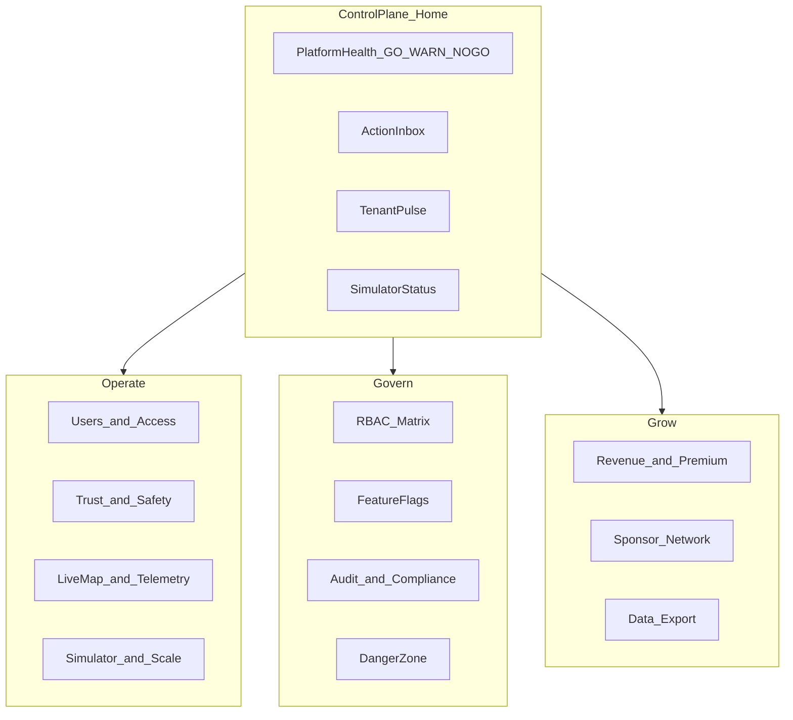
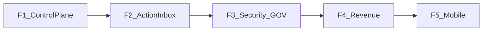

# GLOBAL OWNER Experience Overhaul — wizja wymagającego klienta

| | |
|--|--|
| **Status** | Code complete ☑ |
| **Owner role** | Platform Operator / Product |
| **Last reviewed** | 2026-06-10 |
| **Audience** | GLOBAL_OWNER, Admin developers, Backend Lead |
| **Scope** | Pełna wizja produktowa (control plane, governance, revenue, mobile on-call) |
| **canonical_path** | docs/overhaul_plan/GLOBAL_OWNER_EXPERIENCE_OVERHAUL.md |

**Powiązane:** [P1_ROADMAP](../admin/P1_ROADMAP.md) · [P2_ROADMAP](../admin/P2_ROADMAP.md) · [UI_AUDIT](../admin/UI_AUDIT_2026-06-02.md) · [RBAC](../en/RBAC.md)

---

## Kim jestem jako klient

Jestem **właścicielem platformy multi-tenant** z 10k+ użytkowników, dziesiątkami tenantów, live simem, kolejką moderacji i produkcją na Railway. **Nie chcę „panelu admina współdzielonego z tenant adminem”** — chcę **konsoli operacyjnej platformy**, w stylu Stripe Dashboard + LaunchDarkly + Meta Business Suite, gdzie w 30 sekund wiem: *czy mogę spać spokojnie*.

Dziś mam solidną bazę (`admin/src/core/Layout.tsx`, `admin/src/modules/dashboard/Dashboard.tsx`, `admin/src/core/components/GoHealthStrip.tsx`), ale to wciąż **zbiór modułów**, nie **jeden system dowodzenia**.

---

## North Star — 5 pytań, na które panel MUSI odpowiadać

| # | Pytanie | Dziś | Docelowo |
|---|---------|------|----------|
| 1 | Czy platforma jest zdrowa? | Częściowo (`GoHealthStrip`, `SystemHealth`) | Jedno GO/WARN/NO-GO + drill-down do przyczyny |
| 2 | Czy coś wymaga mojej uwagi? | Rozproszone (mod queue, anti-cheat, sim) | Unified **Action Inbox** z priorytetem i SLA |
| 3 | Co się dzieje w tenantach? | Tabela per-tenant + drill-down | Tenant Command Center z trendami i alertami |
| 4 | Kto co zmienił i czy to bezpieczne? | Audit log (GO-only API) | Pełny audit + MFA + impersonation guardrails |
| 5 | Czy biznes rośnie? | Brak | Revenue, premium, sponsor health |

---

## Docelowa architektura informacji

**Kluczowa zmiana IA:** osobna sekcja **Control Plane** (tylko `GLOBAL_OWNER`), reszta ról dostaje uproszczony shell — nie ten sam dashboard z ukrytymi linkami.

---

## Faza 1 — Control Plane (tydzień 1–3)

### 1.1 Platform Health Dashboard

Rozszerzenie `admin/src/core/components/GoHealthStrip.tsx`.

Jako klient chcę **jeden pasek + panel szczegółów**, nie 6 badge’y bez kontekstu:

- **API latency** (p50/p95), error rate, ostatni deploy
- **Infra:** PostgreSQL, Redis, Celery workers, Citus — dziś `/api/infra/health/` (`backend/core/infra_views.py`) wymaga `is_staff`, nie `GLOBAL_OWNER` → **spiąć z rolą GO**
- **Mod queue depth** + wiek najstarszego case’a
- **Simulator:** ON/OFF, routing queue, backpressure, data-plane (`prod` vs `sim-lab`)
- **Data integrity:** badge gdy KPI zawiera dane syntetyczne (już częściowo w `DataSourceBanner`)

**Acceptance:** klik w NO-GO → widzę *konkretną przyczynę* i *jeden link do naprawy*.

### 1.2 Action Inbox (nowy moduł — konsolidacja)

Dziś moderacja jest rozbita: `ModeratorInbox`, `AntiCheat`, `ActivitiesList`, beta feedback.

**Chcę jedną kolejkę** z filtrami:

| Typ | Źródło | Priorytet |
|-----|--------|-----------|
| Pending activity | `recent_unverified` ze stats | P1 |
| Anti-cheat flag | anomaly API | P0 |
| Beta feedback | unresolved | P2 |
| Sim alert | backpressure, tick_stale | P0 |
| Infra alert | health check fail | P0 |

Każdy item: tenant, assignee, age, quick actions (approve/reject/escalate), deep link do GPX forensics (P2 już w kodzie).

### 1.3 Tenant Command Center

Rozszerzenie tabeli tenantów na Dashboard (`TenantDrillDownMenu`):

- Sparkline: users / activities / verified% (7d)
- Status chip: `healthy` | `queue_backlog` | `sim_heavy` | `inactive`
- Row actions: Users, Activities, Live Map, Branding, **Suspend tenant** (nowe)
- Global search tenantów (Cmd+K)

---

## Faza 2 — Operacje i skala (tydzień 4–6)

### 2.1 Users jako narzędzie platformowe

`admin/src/modules/users/Users.tsx` — 10k+ użytkowników to nie lista, to **CRM platformy**:

- Sortowanie kolumn, zapisane filtry, bulk lock/role/tenant move
- Drawer: timeline aktywności, ostatnie logowania, MFA status, link impersonate
- **Impersonation session UX** (Shopify-style): persistent banner, countdown, auto-exit, audit entry widoczny w drawerze
- Blokada: tylko GO może tworzyć GO (już w BE) — UI musi to komunikować

### 2.2 Simulator jako codzienne narzędzie GO

`admin/src/modules/analytics/SimulatorPage.tsx` — GO-only (poprawnie):

- **Jasny podział:** prod metrics vs sim metrics (nigdy nie mieszać na Dashboard)
- One-screen: start/stop live sim, queue depth, warming/routing/active FSM
- **Scale preflight** + capacity planner (`simInfraPlanner.ts` — wynieść do UI)
- Operational gate status inline (P0 smoke, routing stability) — link do [P0_SMOKE_CHECKLIST](../admin/P0_SMOKE_CHECKLIST.md)

### 2.3 Live Map — platform ops view

`admin/src/modules/analytics/live-map/LiveMap.tsx`:

- Domyślny widok: cała platforma, filtr tenant/department
- Panel webhooks cross-tenant (API już wspiera GO)
- Cheat deep-links dla flagged riders
- Cap banner (`LiveMapCapBanner`) + alert gdy zbliżamy się do limitu

---

## Faza 3 — Governance i bezpieczeństwo (tydzień 7–9)

### 3.1 RBAC — edytowalna macierz, nie katalog

`RbacManager.tsx` dziś: read-only karty.

**Chcę:**

- Macierz Role × Permission z toggle
- Preview: „co zobaczy TENANT_MODERATOR po tej zmianie?”
- Change log każdej modyfikacji RBAC (audit)
- Obsługa `department_moderator` (istnieje w BE, brak w FE)

### 3.2 Feature Flags — LaunchDarkly-grade

`FeatureFlags.tsx` + `backend/core/feature_views.py`:

**Krytyczna luka:** API flags jest `IsAuthenticated` — każdy zalogowany user może CRUD. **Musi być GO-only.**

Docelowo:

- Env keys (prod/staging), % rollout, tenant overrides
- Audit: kto włączył `live_map_h3_aggregate` i kiedy
- Kill switch dla live map / sim

### 3.3 Auth hardening dla GO

Z [P2_ROADMAP](../admin/P2_ROADMAP.md):

- **MFA wymagane przy logowaniu** GO (dziś: `required_for_role` bez enforcement)
- Wipe All Data: typed phrase + MFA + env name (częściowo done) + **drugi approver** (opcjonalnie P3)
- Session management: aktywne sesje GO, revoke all

### 3.4 Audit & Compliance Center

`AuditLog` + `GET /api/users/audit-log/`:

- Filtry: action, user, tenant, date range, IP
- Eksport CSV dla DPO
- GDPR: status eksportów użytkowników (`UserDataExport`)
- Retention policy dashboard (GPX archive F2 z P2)

---

## Faza 4 — Grow: revenue i partnerzy (tydzień 10–12)

### 4.1 Revenue Dashboard (nowy — brak w BE)

Dziś: tylko user checkout (`payments.py`), brak platform billing API.

**Minimalny MVP revenue:**

- MRR / aktywne subskrypcje premium per tenant
- Churn (anulowane w 30d)
- Stripe webhook health (ostatni event, błędy)
- Tenant `stripe_account_id` status (sponsor payouts)

Wymaga nowych endpointów: `GET /api/admin/revenue/summary/`, `IsGlobalOwner`.

### 4.2 Sponsor Network Overview

Konsolidacja `SponsorDashboard` z widokiem GO:

- Cross-tenant: aktywne POI, vouchery, redemption rate
- Puste stany z CTA (już w roadmap P1)
- Alerty: voucher pool wyczerpany, POI bez lokalizacji

### 4.3 Export Center — async jobs

`ExportCenter.tsx`:

- Job queue: start export → email/link gdy gotowe
- Historia eksportów z audit
- Tenant-scoped vs platform-wide (GO)

---

## Faza 5 — Mobile on-call i UX polish (tydzień 13–14)

### 5.1 Mobile Control Plane

`MobileNav.tsx` — dziś 5 pozycji vs ~20 desktop.

Dla GO na telefonie (on-call):

- Health strip + Action Inbox (P0/P1 only)
- Push-style notifications (web) dla NO-GO i mod queue > threshold
- Simulator emergency stop

### 5.2 Command Palette (Cmd+K)

- Jump to: tenant, user, activity, route
- Quick actions: impersonate, toggle sim, open live map tenant

### 5.3 i18n PL/EN

Jedna strategia locale; GO często PL, dokumentacja EN — przełącznik w shell.

---

## Co już mam (nie psuć)

| Obszar | Status |
|--------|--------|
| GO health strip + drill-down | ✅ Paczka 3 |
| Tenant filter + scope banners | ✅ |
| Simulator FSM + backpressure | ✅ Paczka 1 |
| Wipe hardening + impersonation GO-only | ✅ P0 |
| RBAC drawer (read-only) | ✅ P0 |
| Live Map LOD + privacy | ✅ |
| GPX forensics F1 | ✅ P2 |

---

## Mapowanie na pliki (implementacja)

| Nowy / zmiana | Pliki |
|---------------|-------|
| Control Plane home | `Dashboard.tsx`, nowy `ControlPlaneDetail.tsx` |
| Action Inbox | nowy `ActionInbox.tsx`, BE: unified queue endpoint |
| Infra dla GO | `infra_views.py`, `permissions.py` |
| RBAC edit | `RbacManager.tsx`, `rbac_views.py` |
| Flags GO-only | `feature_views.py`, `FeatureFlags.tsx` |
| Revenue | nowy moduł `RevenueDashboard.tsx`, nowe BE views |
| Mobile GO | `MobileNav.tsx`, `Layout.tsx` |
| Command palette | nowy `CommandPalette.tsx` |

---

## Metryki sukcesu (klient mierzy was)

1. **Time-to-diagnose:** NO-GO → root cause < 60s
2. **Mod SLA:** P0 case resolved < 4h (widoczny w inbox)
3. **Zero prod/sim KPI confusion:** 0 ticketów „dlaczego KPI skacze”
4. **Security:** 100% GO sessions z MFA; 0 unauthorized flag toggles
5. **On-call:** mobile health check < 15s

---

## Kolejność wdrożenia (rekomendacja)

**Quick wins (pierwszy sprint):** infra health dla GO, flags API lockdown, Action Inbox MVP (pending + anti-cheat), KPI sim/prod separation audit.

**Nie zaczynać od:** pełnego revenue stack — najpierw control plane i trust, bo bez tego billing dashboard to „ładny wykres na płonącym serwerze”.

---

## Checklist implementacji

| ID | Faza | Zadanie | Status |
|----|------|---------|--------|
| f1-control-plane | 1 | Platform Health Dashboard — rozszerzyć GoHealthStrip + spiąć infra health z GLOBAL_OWNER | ☑ |
| f1-action-inbox | 1 | Action Inbox — unified queue (moderation + anti-cheat + sim alerts + feedback) | ☑ |
| f1-tenant-center | 1 | Tenant Command Center — sparklines, status chips, suspend tenant | ☑ |
| f2-users-sim-livemap | 2 | Users power tools, Simulator ops UI, Live Map platform view | ☑ |
| f3-governance | 3 | Editable RBAC matrix, GO-only flags + audit, MFA enforcement, Audit Center | ☑ |
| f4-revenue | 4 | Revenue Dashboard (nowe BE API) + Sponsor Network + async Export | ☑ |
| f5-mobile-ux | 5 | Mobile on-call nav, Command Palette (Cmd+K), i18n PL/EN | ☑ |
