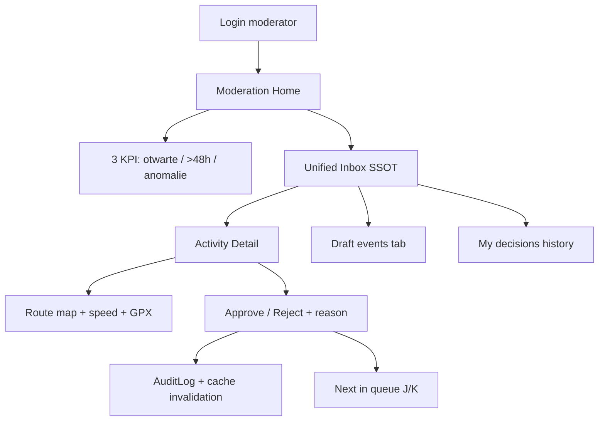
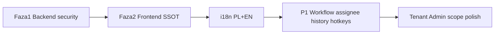

# Tenant/Moderator Experience — wymagania wymagającego klienta

| | |
|--|--|
| **Status** | Code complete ☑ |
| **Priorytet** | TENANT_MODERATOR (moderator-first) |
| **Język UI** | i18n PL + EN od dnia zero |
| **Last reviewed** | 2026-06-10 |
| **canonical_path** | docs/overhaul_plan/MODERATOR_PANEL_OVERHAUL.md |
| **Powiązane** | [UI_AUDIT §4.5](../admin/UI_AUDIT_2026-06-02.md), [ADMIN_ROADMAP S4](../admin/ADMIN_ROADMAP.md), [TENANT_ADMIN_EXPERIENCE_OVERHAUL](./TENANT_ADMIN_EXPERIENCE_OVERHAUL.md) |

---

## Kim jestem i czego NIE akceptuję

Jestem **koordynatorem programu miejskiego** (np. „Kraków na rowerze”). Mam 2–3 moderatorów na zmiany. Loguję się rano i oczekuję odpowiedzi na jedno pytanie: **„Co muszę zrobić teraz, żeby uczestnicy nie czekali na punkty?”**

Dzisiaj panel mnie rozczarowuje:

- Po logowaniu trafiam na [`ModeratorInbox`](../../admin/src/modules/dashboard/ModeratorInbox.tsx), ale **dashboard nadal pokazuje globalne KPI** i duplikuje pracę przez [`ModeratorWorklist`](../../admin/src/modules/dashboard/ModeratorWorklist.tsx) — to samo approve/reject w dwóch miejscach.
- W [`ActivityDetail`](../../admin/src/modules/dashboard/ActivityDetail.tsx) widzę mapę GPX i wynik anti-cheat, ale **nie mogę zatwierdzić ani odrzucić** — muszę wracać do tabeli.
- [`AntiCheat`](../../admin/src/modules/anti-cheat/AntiCheat.tsx) pozwala mi **edytować progi systemu** — to nie moja rola; chcę tylko rozpatrywać przypadki.
- Odrzucenie bez **powodu** to problem prawny i operacyjny — uczestnik dzwoni, a ja nie wiem co mu powiedzieć.
- Brak **badge w menu**, brak **auto-odświeżania**, brak **historii moich decyzji** — jak w latach 2010.

**Nie płacę za „panel global ownera z ukrytymi zakładkami”. Płacę za narzędzie pracy moderatora miasta.**

---

## Wizja docelowa (moderator-first)

---

## P0 — „Żeby w ogóle móc pracować” (MVP, 1–2 sprinty)

### 1. Jedna kolejka prawdy (SSOT)

| Wymaganie | Dlaczego |
|-----------|----------|
| Jeden moduł `admin/src/modules/moderation/` zamiast duplikatów Inbox + Worklist | Zero rozjazdów liczników |
| Endpoint `GET /api/activities/admin/moderation/queue/` z paginacją i filtrami (`type`, `score_lt`, `assigned_to=me`) | 500 pending ≠ 8 w workliście |
| Zakładki: **Aktywności** · **Anomalie** · **Wydarzenia DRAFT** w jednym inboxie | Nie chodzę po 4 ekranach |
| Badge przy „Moderation Inbox” w [`Layout.tsx`](../../admin/src/core/Layout.tsx) | Widzę backlog bez wchodzenia w moduł |
| Auto-refresh 60s + przycisk Odśwież | Zmiana bez F5 |

Źródło techniczne: fazy 1–2 w sekcji [Kolejność implementacji](#kolejność-implementacji) poniżej (ten dokument jest SSOT).

### 2. Decyzja tam, gdzie jest kontekst

| Wymaganie | Stan dziś |
|-----------|-----------|
| `ModerationActionBar` w ActivityDetail dla `!is_verified` | Mapa jest, **brak przycisków** |
| `RejectReasonModal`: `GPS_SPOOF`, `DISTANCE_MISMATCH`, `DUPLICATE`, `OTHER` + notatka | Reject bez body |
| Po decyzji: toast + **następna w kolejce** (`?queue=1`) | Martwy koniec ścieżki |
| Bulk approve/reject w inboxie (jak w ActivitiesList) | Tylko pojedyncze w workliście |

### 3. Bezpieczeństwo i audyt (bez tego nie podpisuję umowy)

Backend w [`admin_views.py`](../../backend/activities/admin_views.py) — wymagam:

- `_get_moderatable_activity()` — **403 cross-tenant**, nie tylko „mam rolę”
- Pola na `Activity`: `moderated_at`, `moderated_by`, `rejection_reason`, `rejection_notes`
- `AuditLog`: `MODERATION_APPROVE` / `MODERATION_REJECT`
- `invalidate_dashboard_stats_cache(tenant_id)` po każdej decyzji
- Testy: moderator w tenant A **nie** dotyka aktywności tenant B

### 4. Dashboard tylko pod moderację

Dla `TENANT_MODERATOR` w [`Dashboard.tsx`](../../admin/src/modules/dashboard/Dashboard.tsx):

- **Ukryć** globalne StatCard (athletes, distance, calories)
- **Pokazać 3 karty**: Otwarte · Starsze niż 48h · Anomalie anti-cheat
- Jedno CTA: „Przejdź do inboxu” → `/owner/moderation`
- Usunąć `ModeratorWorklist` z dashboardu (zostaje link z inboxu)

### 5. Anti-Cheat read-only + sensowne linki

- Moderator: **tylko podgląd** configu w Anti-Cheat; POST zablokowany ([`views.py`](../../backend/activities/views.py) RBAC)
- „Pokaż na mapie” → `/owner/activities/:id` (ActivityDetail), **nie** Live Map (brak w nav dla moderatora)

### 6. i18n od dnia zero (PL + EN)

- `admin/src/i18n/strings.{pl,en}.ts` — wszystkie stringi moderatora (inbox, powody reject, KPI, toasty)
- Przełącznik języka w ustawieniach profilu lub globalnym selectorze
- Domyślny język: **PL** dla ról `TENANT_*`, EN dla `GLOBAL_OWNER` (konfigurowalne)

---

## P1 — „Żeby zespół 3 osób nie wchodził sobie w drogę”

| Wymaganie | Opis |
|-----------|------|
| **Assignee** | `moderation_assignee` + PATCH assign + filtr „Przypisane do mnie” |
| **Wiek w kolejce** | `QueueAgeBadge` z `created_at` — czerwony po 48h |
| **Historia decyzji** | `/owner/moderation/history` — moje approve/reject, export CSV |
| **Hotkeys** | A = approve, R = reject, J/K = następna/poprzednia w kolejce |
| **Polling + toast** | Layout: nowe pozycje w kolejce → powiadomienie Mantine |
| **Moderacja eventów** | `POST /events/<id>/approve|reject` zamiast surowego PATCH statusu |

---

## P2 — Tenant Admin (warstwa wspólna, po MVP moderatora)

Moderator jest priorytetem, ale **tenant admin** musi dzielić ten sam „tenant scope”:

- [`TenantScopeBanner`](../../admin/src/core/components/TenantScopeBanner.tsx) + [`useTenantScope`](../../admin/src/hooks/useTenantScope.ts) — już są; wymagam **100% list z domyślnym `tenant_id`**
- [`TenantAdminQuickActions`](../../admin/src/core/components/TenantAdminQuickActions.tsx) — rozszerzyć o „Pending review” z licznikiem zsynchronizowanym z kolejką moderatora
- Departments: przypisanie moderatora do działu (backend [`department_serializers.py`](../../backend/users/department_serializers.py) ma pole `moderator`)
- White-label preview: admin widzi branding miasta; moderator widzi **logo/nazwę** w headerze (bez edycji)

---

## Kryteria akceptacji (smoke — wymagający klient)

1. Loguję się jako `TENANT_MODERATOR` → ląduję na inboxie, **badge** pokazuje ten sam count co API queue.
2. Otwieram aktywność → widzę trasę, GPX, score → **approve/reject z powodem** bez powrotu do tabeli.
3. Odrzucam z powodem `GPS_SPOOF` → w historii widać wpis; uczestnik (w API/mobile) dostaje reason (jeśli ekspozycja w API — osobny task).
4. Drugi moderator w innym mieście **nie widzi** mojej kolejki (test cross-tenant).
5. Przełączam PL/EN → wszystkie etykiety moderatora się zmieniają.
6. Anti-cheat: **zero** możliwości zapisu configu jako moderator.
7. Dashboard moderatora: **zero** globalnych KPI platformy.

Testy: rozszerzyć [`p0-role-smoke.mjs`](../../admin/scripts/p0-role-smoke.mjs) + [`test_admin.py`](../../backend/activities/test_admin.py).

---

## Kolejność implementacji

| Faza | Zakres | Pliki kluczowe |
|------|--------|----------------|
| **1** | Model Activity, tenant guard, audit, `moderation/queue` API | `models.py`, `admin_views.py`, nowy `moderation_views.py` |
| **2** | Moduł `moderation/`, przepisany Inbox, dashboard scoped, ActivityDetail actions, Anti-Cheat read-only, nav badge | `admin/src/modules/moderation/*`, `ModeratorInbox.tsx`, `Dashboard.tsx`, `ActivityDetail.tsx`, `Layout.tsx` |
| **3** | i18n + P1 workflow | `strings.pl.ts`, `strings.en.ts`, `ModerationHistory.tsx` |
| **4** | QA + docs | `P0_SMOKE_CHECKLIST.md`, `API.md`, usunięcie `ModeratorWorklist.tsx` |

---

## Checklist implementacji

- [x] **Faza 1** — Backend: pola Activity, tenant guard approve/reject, AuditLog, GET moderation/queue, testy cross-tenant
- [x] **Faza 2** — Frontend SSOT: moduł `moderation/`, przepisany Inbox, usunięcie ModeratorWorklist, nav badge, dashboard 3-KPI
- [x] **ActivityDetail** — ModerationActionBar + RejectReasonModal; next-in-queue po decyzji
- [x] **Anti-Cheat** — RBAC telemetry config POST (GO/TENANT_ADMIN) + UI read-only dla TENANT_MODERATOR
- [x] **i18n** — `strings.pl.ts` + `strings.en.ts`; przełącznik języka; domyślny PL dla TENANT_*
- [x] **P1 workflow** — Assignee, QueueAgeBadge, historia, hotkeys A/R/J/K, polling toast
- [x] **QA** — p0-role-smoke rozszerzony (+ forbidden paths TENANT_ADMIN), test_admin, API.md sync (prod P0_SMOKE = gate operacyjny)

---

## Świadomie poza zakresem MVP

- Email/SMS do uczestnika po reject (wymaga infrastruktury mail)
- Live Map dla moderatora (wystarczy mapa w ActivityDetail)
- Pełny portal Tenant Admin (branding wizard, ESG) — po zamknięciu moderatora

---

## Podsumowanie jednym zdaniem

**Chcę panelu, który traktuje mnie jak operatora kolejki miejskiej — nie jak gościa na konsoli platformy SaaS: jedna kolejka, decyzja przy mapie, powód odrzucenia, audyt, PL/EN, i zero globalnych liczb, które mnie nie dotyczą.**
