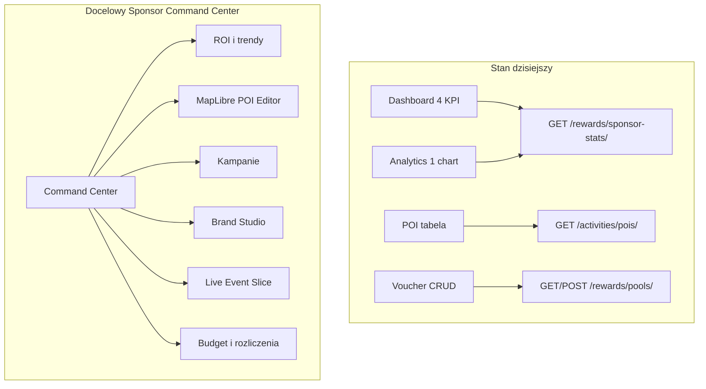
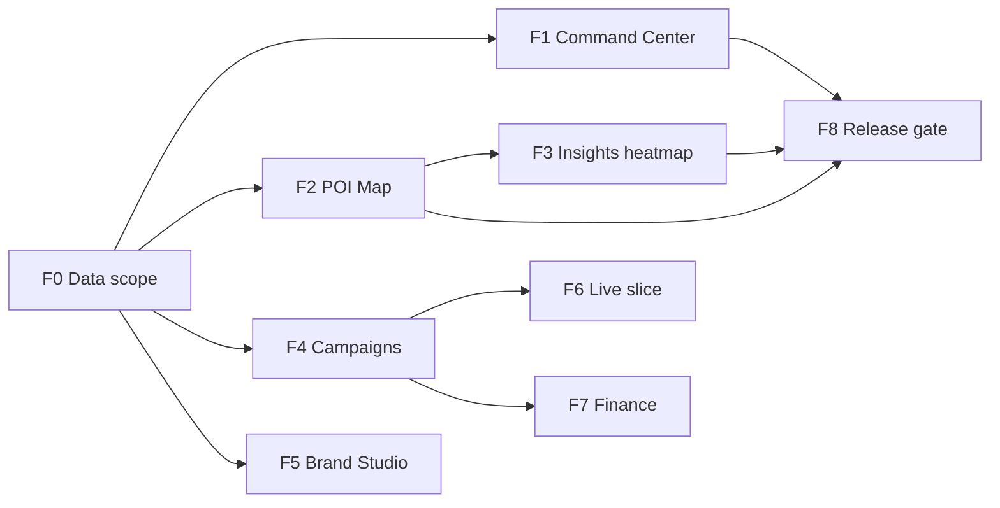

# Sponsor Experience Overhaul — wizja wymagającego klienta

| | |
|--|--|
| **Status** | Code complete ☑ |
| **Owner role** | Product / Admin Lead |
| **Last reviewed** | 2026-06-10 |
| **Audience** | SPONSOR, Admin developers, Backend Lead |
| **Scope** | Pełna wizja ROADMAP_V3 — Command Center, mapa POI, kampanie, analityka ROI, branding voucherów, finanse |
| **canonical_path** | docs/overhaul_plan/SPONSOR_EXPERIENCE_OVERHAUL.md |

**Powiązane:** [ROADMAP_V3](../pl/admin/ROADMAP_V3.md) · [P1_ROADMAP](../admin/P1_ROADMAP.md) · [CONSTITUTION](../pl/CONSTITUTION.md) · [UI_AUDIT](../admin/UI_AUDIT_2026-06-02.md)

---

## Kim jestem jako klient

Jestem **sponsorem B2B** — lokalną kawiarnią, siecią retail lub partnerem eventowym. Płacę za widoczność i realny ruch w moich lokalizacjach. **Nie chcę „czterech rozproszonych ekranów z licznikami”** — chcę **Command Center**, w którym w 30 sekund wiem: *czy moja inwestycja się opłaca*.

Dziś mam działającą bazę (Paczka 2 — code complete, prod gate 🟡), ale portal to wciąż **zbiór modułów**, nie **jeden system dowodzenia sponsoringiem**.

---

## North Star — 5 pytań, na które panel MUSI odpowiadać

| # | Pytanie | Dziś | Docelowo |
|---|---------|------|----------|
| 1 | Czy to się opłaca? | 4 KPI + 1 wykres słupkowy | ROI, trendy, per-POI/per-offer, eksport do CFO |
| 2 | Czy ludzie mnie widzą? | Brak | Heatmapa wokół POI, live widok podczas eventu |
| 3 | Czy moja marka wygląda profesjonalnie? | Stub 3D bez persistencji | Brand Studio + designer voucherów w aplikacji mobilnej |
| 4 | Czy mam kontrolę operacyjną? | CRUD pul, tabela POI | Kampanie, budżet, mapa z drag, bulk import |
| 5 | Czy rozliczenia są transparentne? | Stripe stub w backendzie | Panel budżetu, Stripe Connect, faktury |

---

## Co dziś zawodzi (gap analysis)

Portal to 4 rozproszone widoki (`SponsorDashboard.tsx`, `SponsorPOIMap.tsx`, `SponsorshipAnalytics.tsx`, `RewardsVouchers.tsx`) z jednym endpointem agregującym (`sponsor_stats_view` w `backend/rewards/views.py`):

| Oczekiwanie klienta | Stan dziś | Problem |
|---------------------|-----------|---------|
| Mapa POI z kliknięciem/drag | Tabela + lat/lng w formularzu | Nazwa „POI Map” bez MapLibre |
| Analityka kampanii | 4 KPI + 1 wykres słupkowy | Brak serii czasowej, per-POI, per-pula |
| Sponsored heatmapy (Konstytucja §RBAC) | Heatmapy tylko dla GO/TENANT_ADMIN | Sponsor nie widzi ruchu przy swoich POI |
| Branding vouchera | Stub `VoucherCustomizer3D` | Brak uploadu logo, brak persistencji designu |
| Kampanie eventowe | Brak modelu | Nie da się „Tour de Warszawa, 14 dni, 3 POI” |
| Własność POI | POI tenant-scoped, brak `sponsor` FK | Stats liczą **wszystkie** POI tenanta, nie moje |
| Recent Activity | Jedna linia tekstu | Brak feedu redempcji / proximity events |
| Finanse | Stripe B2B stub w backendzie | Brak UI budżetu, payoutów |

---

## Docelowa architektura nawigacji

Zamiast 4 równorzędnych pozycji w sekcji „Sponsorship & Rewards” (`Layout.tsx`) — **jeden hub** z podstronami:

| Trasa | Nazwa dla sponsora | Opis |
|-------|-------------------|------|
| `/owner/sponsor` | **Command Center** | KPI, alerty, onboarding, skróty akcji |
| `/owner/sponsor/locations` | **Moje lokalizacje** | MapLibre editor (create/edit/delete/drag) |
| `/owner/sponsor/campaigns` | **Kampanie** | Okna czasowe, budżet, powiązanie pul + POI |
| `/owner/sponsor/offers` | **Oferty i vouchery** | CRUD pul + designer + status redempcji |
| `/owner/sponsor/insights` | **Analityka** | Trendy, per-POI, heatmap overlay, eksport |
| `/owner/sponsor/brand` | **Profil marki** | Logo, website, kolory (z modelu `Sponsor`) |
| `/owner/sponsor/live` | **Live (event)** | Read-only slice Live Map filtrowany po POI sponsora |

Istniejące trasy (`/owner/analytics/sponsorship`, `/owner/sponsor/poi`) → redirecty w routerze dla kompatybilności bookmarków.

---

## Fazy implementacji (pełna wizja ROADMAP_V3)

### Faza 0 — Fundament danych i scope (bloker)

**Backend** — naprawa własności i spójności danych:

- Migracja `POI`: dodać `sponsor = FK(Sponsor, null=True)` + backfill z `created_by` / tenant assignment rules.
- `sponsor_stats_view`: `poi_count` i analityka tylko dla POI przypisanych do `request.user.sponsor_profile`.
- Nowy model `SponsorCampaign`:
  - `sponsor`, `name`, `status` (DRAFT/ACTIVE/PAUSED/ENDED)
  - `starts_at`, `ends_at`
  - M2M → `VoucherPool`, M2M → `POI`
  - `budget_points` / `max_redemptions` (soft cap)
- Rozszerzyć `VoucherPool`: `design_json` (kolory, logo_url, template_id), opcjonalnie `campaign` FK.
- Rozszerzyć `Sponsor`: `brand_colors`, `design_defaults` (już są `logo_url`, `website` — brakuje UI).
- Endpointy:
  - `GET/PATCH /api/rewards/sponsor-profile/`
  - `GET /api/rewards/sponsor-stats/?range=7d&group_by=day`
  - `GET /api/rewards/sponsor-stats/by-poi/`
  - `GET /api/rewards/sponsor-activity/` (feed ostatnich redempcji)
  - CRUD `/api/rewards/campaigns/`

**Testy:** scope SPONSOR nie widzi cudzych pul/POI; tenant isolation.

### Faza 1 — Command Center (nowy dom sponsora)

Przebudowa `SponsorDashboard.tsx`:

- **Hero strip**: nazwa sponsora + logo + status aktywnej kampanii.
- **KPI row** (6 kart): Active offers, Redemptions (7d), Conversion, POI reach, Budget used %, Athletes nearby (24h).
- **Onboarding wizard** (zamiast samego `SponsorEmptyCta`): 4 kroki — profil marki → pierwszy POI na mapie → pierwsza oferta → pierwsza kampania.
- **Activity feed**: tabela „ostatnie redempcje” z pulą, datą, kodem (maskowanym), POI (jeśli proximity).
- **Quick actions**: „Nowa kampania”, „Dodaj lokalizację”, „Wstrzymaj ofertę”.

### Faza 2 — MapLibre POI Editor (lokalny + sieć retail)

Zastąpienie `SponsorPOIMap.tsx` prawdziwym edytorem:

- Reużycie infrastruktury map z `admin/src/core/map/mapBasemap.ts` i wzorców z Live Map (bez ciężkiego importu całego `LiveMap.tsx`).
- **Click-to-place** marker, **drag** do korekty, geocoder/search (opcjonalnie Nominatim).
- **Drawer** edycji: nazwa, kategoria, opis, godziny otwarcia (nowe pole opcjonalne).
- **Bulk import CSV** dla sieci retail (lat, lng, name, category).
- PATCH/DELETE w UI (API już wspiera w `activities/views.py`).
- Warstwa podglądu: promień proximity 100m (zgodnie z `VoucherHotspotPlugin` w backendzie).

### Faza 3 — Insights 2.0 (analityka dla CFO)

Przebudowa `SponsorshipAnalytics.tsx` → `/owner/sponsor/insights`:

- **Wykres liniowy** redempcji w czasie (7d/30d/90d/custom).
- **Per-POI breakdown**: tabela + mapa choropleth „który sklep konwertuje”.
- **Per-offer breakdown**: która pula ma najlepszy CR.
- **Sponsored heatmap overlay**: `GET /api/heatmap/sponsor/?bbox=&poi_ids=` — agregacja ruchu w buforze wokół POI sponsora (reuse logiki z `GlobalHeatmap.tsx`, RBAC: tylko własne POI).
- **Eksport**: CSV/PDF „Raport miesięczny”.
- **Benchmark copy**: „Twoja konwersja vs średnia tenanta” — agregat tenant-level, anonymized.

### Faza 4 — Campaign Engine (lokalny + eventowy)

Nowy moduł `admin/src/modules/sponsor/SponsorCampaigns.tsx`:

- **Wizard kampanii**: nazwa, daty, wybór POI (multi-select z mapy), wybór pul, budżet.
- **Stany**: Draft → Active → Paused → Ended (auto-expire via Celery beat).
- **Event mode**: kampania powiązana z `Event` (opcjonalny FK) — countdown i link do Live slice.
- **Alerty**: email/in-app gdy budżet 80%/100%, gdy CR spada poniżej progu.
- Backend: walidacja nakładających się kampanii na tę samą pulę.

### Faza 5 — Brand Studio + Voucher Designer (ROADMAP_V3 §7.2)

Rozbudowa `VoucherCustomizer3D.tsx` → `/owner/sponsor/offers/:id/design`:

- Upload logo (S3/R2 lub URL) → zapis w `VoucherPool.design_json`.
- Color picker, typography preset, szablony barcode/QR.
- Podgląd 3D z tilt + **podgląd mobilny** (jak widzi athlete).
- Persistencja: design przypięty do puli, nie tylko sesja UI.
- Podgląd na mapie POI: pin z logo sponsora.

### Faza 6 — Live Event Slice (sponsor eventowy)

Nowy widok `/owner/sponsor/live` — **read-only** wycinek Live Map:

- Filtr: tylko athleci w promieniu X km od POI kampanii / event bbox.
- Licznik live: „47 rowerzystów w zasięgu Twojej strefy”.
- Brak dostępu do SOC, symulatora, moderacji — tylko `live_map.view_sponsor` permission (nowy slug RBAC).
- Reużycie streamu pozycji z live-map engine, bez pełnego panelu operacyjnego.

### Faza 7 — Finanse i budżet (Stripe Connect)

UI na bazie `backend/rewards/stripe_service.py`:

- **Panel budżetu**: punkty wydane / limit kampanii / prognoza wyczerpania.
- **Stripe Connect onboarding**: link do onboardingu, status `stripe_connect_id` na `User`.
- **Rozliczenia B2B**: historia faktur (Stripe Customer Portal embed).
- Degradacja graceful gdy Stripe nie skonfigurowany.

### Faza 8 — Polish, RBAC, release gate

- Aktualizacja `useAuth.ts`: nowe permissiony (`campaigns.*`, `sponsor.insights`, `sponsor.live`).
- P0 smoke SPONSOR w `docs/admin/P0_SMOKE_CHECKLIST.md` — rozszerzyć o mapę, kampanie, eksport.
- E2E: `navigation-smoke.spec.ts` + nowy `sponsor-journey.spec.ts`.
- Audit screenshots: command center, map editor, campaign wizard.
- Sync docs: `ROADMAP_V3.md`, `CONSTITUTION.md` §sponsor RBAC.

---

## Persony — jak każda korzysta z tego samego panelu

| Persona | Kluczowe ekrany | „Aha moment” |
|---------|-----------------|--------------|
| Lokalny partner | Onboarding → 1 POI na mapie → 1 oferta | „Widzę redempcję z mojej kawiarni wczoraj” |
| Sieć retail | Bulk POI + insights per-store | „Sklep Mokotów ma 3× lepszą konwersję niż Centrum” |
| Sponsor eventowy | Kampania + Live slice | „Podczas wyścigu 120 osób minęło obok mojego namiotu” |

---

## Co już mam (nie psuć)

| Obszar | Status |
|--------|--------|
| Paczka 2 Sponsor portal (code) | ✅ |
| RBAC SPONSOR scope (pools, POI create) | ✅ |
| `SponsorEmptyCta` onboarding CTA | ✅ |
| Voucher pool CRUD (`RewardsVouchers`) | ✅ |
| `sponsor-stats` API | ✅ (wymaga scope fix w F0) |
| Voucher 3D preview stub | ✅ (Phase 2 w ROADMAP_V3) |
| Stripe service skeleton | ✅ backend |

---

## Mapowanie na pliki (implementacja)

| Warstwa | Pliki |
|---------|-------|
| UI hub | `admin/src/modules/sponsor/*` (nowe: Campaigns, Insights, Brand, LiveSlice) |
| Nawigacja | `admin/src/core/Layout.tsx`, `admin/src/App.tsx` |
| API client | `admin/src/api/client.ts` |
| Backend models | `backend/rewards/models.py`, `backend/activities/models.py` |
| Backend API | `backend/rewards/views.py`, nowy `campaigns_views.py`, heatmap sponsor filter |
| RBAC | `backend/users/permissions.py`, `admin/src/core/auth/useAuth.ts` |
| Map reuse | `admin/src/core/map/mapBasemap.ts` |

---

## Metryki sukcesu (klient mierzy was)

1. Sponsor tworzy pierwszą kampanię (POI + oferta) w **<10 min** bez supportu.
2. Dashboard pokazuje dane **tylko własne** (zero wycieku tenant/foreign POI).
3. Insights: eksport CSV z ostatnich 30 dni jednym kliknięciem.
4. POI Map: zero ręcznego wpisywania współrzędnych dla happy path.
5. P0 smoke SPONSOR: 100% pass przed prod gate (obecnie 🟡 w P1_ROADMAP).

---

## Kolejność wdrożenia (rekomendacja)

**F0 jest blokerem** — bez `sponsor` na POI i kampanii każda analityka będzie kłamać wymagającemu klientowi.

**Quick wins (pierwszy sprint):** scope fix POI/stats, MapLibre POI editor MVP, Command Center z activity feed, redirecty tras.

**Nie zaczynać od:** Stripe Connect UI — najpierw dane i mapa, bo bez poprawnego scope billing dashboard to „ładny wykres na cudzych liczbach”.

---

## Checklist implementacji

| ID | Faza | Zadanie | Status |
|----|------|---------|--------|
| f0-data-scope | 0 | POI.sponsor FK, SponsorCampaign model, rozszerzone API stats/activity/profile + testy scope | ☑ |
| f1-command-center | 1 | Przebudowa SponsorDashboard → Command Center z wizardem, feedem i quick actions | ☑ |
| f2-poi-map-editor | 2 | MapLibre POI editor (click/drag/edit/delete/bulk CSV) zastępujący tabelę | ☑ |
| f3-insights | 3 | Insights 2.0 — serie czasowe, per-POI/per-offer, sponsored heatmap overlay, eksport CSV | ☑ |
| f4-campaigns | 4 | Campaign Engine — CRUD, stany, budżet, powiązanie pul+POI, alerty | ☑ |
| f5-brand-studio | 5 | Brand Studio + pełny Voucher Designer z persistencją design_json | ☑ |
| f6-live-slice | 6 | Sponsor Live Event slice — read-only mapa filtrowana po kampanii/POI | ☑ |
| f7-finance | 7 | Panel budżetu + Stripe Connect onboarding UI | ☑ |
| f8-release | 8 | RBAC, redirecty tras, P0 smoke + E2E sponsor-journey, docs sync | ☑ |
