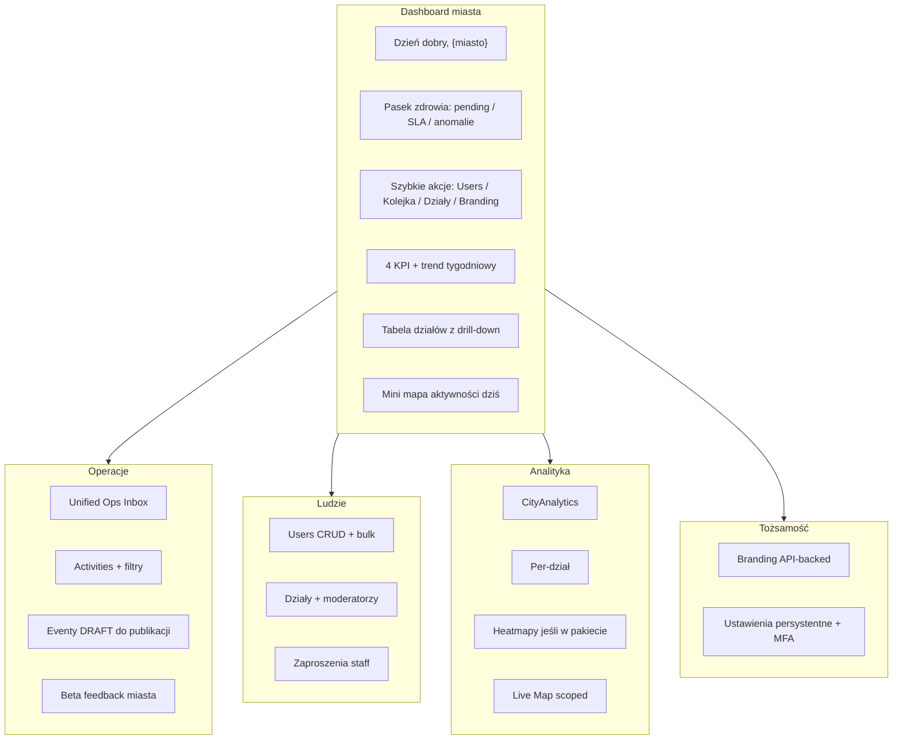
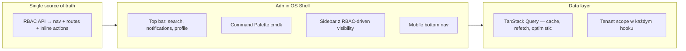

# TENANT ADMIN Experience Overhaul — wizja wymagającego klienta

| | |
|--|--|
| **Status** | Code complete ☑ |
| **Owner role** | Product / Admin Lead |
| **Last reviewed** | 2026-06-10 |
| **Audience** | TENANT_ADMIN, Admin developers, Backend Lead |
| **Scope** | Pełna wizja produktowa — City Command Center, operacje, ludzie, branding, analityka |
| **canonical_path** | docs/overhaul_plan/TENANT_ADMIN_EXPERIENCE_OVERHAUL.md |

**Powiązane:** [ADMIN_ROADMAP](../admin/ADMIN_ROADMAP.md) · [P1_ROADMAP](../admin/P1_ROADMAP.md) · [UI_AUDIT](../admin/UI_AUDIT_2026-06-02.md) · [MODERATOR_PANEL_OVERHAUL](./MODERATOR_PANEL_OVERHAUL.md) · [REDESIGN_MOCKUP](../../admin/docs/REDESIGN_MOCKUP.md)

---

## Kim jestem jako klient

Jestem **dyrektorem programu sportowego miasta** (np. Siedlce). Płacę za platformę, mam 4 000 zawodników, 12 działów, 2 moderatorów i sponsorów lokalnych. Nie interesuje mnie „panel developerski” — chcę **centrum dowodzenia miastem**, które działa jak Stripe Dashboard + Linear: szybkie, przewidywalne, bez zgadywania czy dane są moje czy globalne.

Priorytet: **TENANT_ADMIN**. Horyzont: **pełna wizja** (bez cięcia zakresu).

---

## Moja filozofia (non-negotiables)

1. **„Moje miasto, moje dane”** — nigdy nie widzę globalnych KPI, UUID zamiast nazwy miasta, ani narzędzi platformowych (simulator, wipe, RBAC).
2. **Jedna prawda operacyjna** — pending activities, anomalie, draft eventy i feedback w **jednym miejscu**, nie w 4 zakładkach.
3. **Decyzja w 3 kliknięcia** — approve/reject z mapą trasy, powodem odrzucenia i audytem; bez przechodzenia przez 3 ekrany.
4. **Branding, który działa** — kolory, logo, map theme zapisane w API, widoczne w aplikacji mobilnej zawodników.
5. **Keyboard-first** — `Cmd+K`, skróty A/R w kolejce, jak w [REDESIGN_MOCKUP.md](../../admin/docs/REDESIGN_MOCKUP.md).
6. **Polski UI** — mieszanka PL/EN (np. Live Map „Wszystkie miasta” vs angielskie labele) to sygnał niedokończonego produktu.
7. **Mobile/tablet** — moderator w terenie na tablecie; obecny [MobileNav.tsx](../../admin/src/core/components/MobileNav.tsx) jest martwy.

---

## Co chcę widzieć po zalogowaniu (City Command Center)

---

## Dashboard — nie kopia global ownera, tylko mój pulpit

Obecny stan: [Dashboard.tsx](../../admin/src/modules/dashboard/Dashboard.tsx) ma `TenantScopeBanner` + quick actions — dobry start, ale brakuje:

| Chcę | Dziś | Gap |
|------|------|-----|
| Nazwa miasta zawsze widoczna (nie UUID) | `useTenantScope` zależy od `stats.per_tenant` | Brak `tenantName` w profilu JWT / `/me` |
| Pasek SLA: „12 pending, 3 >48h” | Tylko badge w quick actions | Brak dedykowanego KPI SLA |
| Widget „co wymaga uwagi” (unified) | Rozproszone: Activities, Events, Feedback | Brak Unified Ops Inbox dla admina |
| Mini live map (tylko moje miasto) | Tylko global owner ma embed | Live Map jest, ale nie na home |
| Trend vs poprzedni tydzień na KPI | `CityAnalytics` osobno | KPI bez kontekstu trendu |
| Konfigurowalny układ widgetów | Sztywny layout | Brak personalizacji |

---

## Unified Ops Inbox (dla admina i moderatora)

Admin ma `activities.approve` w [useAuth.ts](../../admin/src/core/auth/useAuth.ts), ale **Moderation Inbox** jest ukryty w nav dla TENANT_ADMIN ([Layout.tsx](../../admin/src/core/Layout.tsx)). To błąd produktowy.

**Chcę jedną kolejkę** (rozszerzenie [MODERATOR_PANEL_OVERHAUL](./MODERATOR_PANEL_OVERHAUL.md)):

- Zakładki: Pending Activities | Anomalie | Draft Events | Feedback krytyczny
- Kolumny: użytkownik, typ, dystans, score, **wiek w kolejce**, assignee, mapa GPX, akcje
- Bulk approve/reject z `RejectReasonModal`
- Auto-refresh 60s + badge w sidebarze
- Skróty: `A` approve, `R` reject, `J/K` nawigacja

Backend: `GET /api/activities/admin/moderation/queue/` (planowany w MODERATOR_PANEL_OVERHAUL) + tenant guard + AuditLog.

---

## Activity Detail — decyzja z kontekstem

[ActivityDetail.tsx](../../admin/src/modules/dashboard/ActivityDetail.tsx) dziś ma placeholder mapy. Chcę:

- `ActivityRouteMap` (wzorzec już w [ActivityRouteMap.tsx](../../admin/src/core/components/ActivityRouteMap.tsx))
- `ModerationActionBar` gdy pending
- Po decyzji: „następna w kolejce” (`?queue=1`)
- Historia: kto moderował, powód reject

---

## Ludzie i organizacja

**Users** ([Users.tsx](../../admin/src/modules/users/Users.tsx)) — **najlepszy moduł dziś**. Chcę rozszerzeń:

- **Audit log scoped do mojego tenanta** (dziś tylko GLOBAL_OWNER)
- Eksport CSV użytkowników mojego miasta (bez globalnego Export Center)
- Zaproszenia e-mail z szablonem brandingowym
- Widok „kto jest online / aktywny dziś” (opcjonalnie P2)

**Departments** ([Departments.tsx](../../admin/src/modules/departments/Departments.tsx)) — działa. Chcę:

- Przypisanie moderatora do działu (już w planie P1)
- Dashboard per-dział z linkiem z tabeli na home
- [DepartmentAnalyticsPage.tsx](../../admin/src/modules/analytics/DepartmentAnalyticsPage.tsx) ze `TenantScopeBanner` i jasnym „czym różni się od tabeli na dashboardzie”

---

## Branding — koniec z mockiem

[WhiteLabelEngine.tsx](../../admin/src/modules/tenants/WhiteLabelEngine.tsx) to **demo UI** (hardcoded „Siedlce City”). Backend ma `TenantBrandingView` — klient oczekuje:

- Podgląd na żywo (kolory, logo, map theme)
- Zapis do API + walidacja
- Info: „zmiany widoczne w aplikacji w ciągu X min”
- Historia zmian brandingowych (audit)

---

## Analityka miasta

| Moduł | Oczekiwanie klienta | Stan |
|-------|---------------------|------|
| CityAnalytics | Tygodniowe wykresy, per-dział | Działa |
| Live Map | Tylko moje miasto, pełne PII | Działa ([liveMapPrivacy.ts](../../admin/src/modules/analytics/live-map/engine/liveMapPrivacy.ts)) |
| Heatmaps | W nav jeśli płacę za pakiet | **Bug:** `tenantFlags.has_heatmap_analytics` ładowane tylko dla GLOBAL_OWNER ([App.tsx](../../admin/src/App.tsx)) |
| Feedback | Filtrowane do tenanta | Sprawdzić scope |
| ESG / AI Coach | Albo działają, albo nie ma ich w nav | Premium placeholders — ukryć lub dokończyć |

---

## Ustawienia, które naprawdę zapisują się

[SettingsScreen.tsx](../../admin/src/modules/settings/SettingsScreen.tsx): toggles pokazują toast, **nie zapisują**. Chcę:

- Persystencja preferencji (notifications, locale, theme) — API lub user profile
- MFA setup (już częściowo)
- Zmiana hasła (wired)
- Sekcja „mój plan” — jakie feature flags ma moje miasto (heatmap, live map tier)
- **Brak** Danger Zone / wipe (tylko global owner)

---

## Fundament platformowy (wszystkie role, ale blokuje jakość admina)

Te elementy są w [REDESIGN_MOCKUP.md](../../admin/docs/REDESIGN_MOCKUP.md), ale **nie zaimplementowane**:

1. **Jeden model autoryzacji** — dziś nav filtruje po `role`, routes po `permissions`, RBAC Manager edytuje coś trzeciego. Klient nie powinien widzieć `/owner/system/rbac` po wpisaniu URL, jeśli nie ma go w nav.
2. **Command palette** (`cmdk` w package.json, zero użycia) — „Idź do Users”, „Pokaż pending”, „Eksportuj dział X”.
3. **React Query** — provider jest w [main.tsx](../../admin/src/main.tsx); wzorzec zapytań skrzynki moderacji znajduje się w [useModerationInboxData.ts](../../admin/src/hooks/queries/useModerationInboxData.ts).
4. **i18n** — `strings.pl.ts` dla moderatora/admina; jeden język per tenant lub user preference.
5. **Powiadomienia** — dzwonek w top bar: wzrost pending count, nowy feedback, event do publikacji.

---

## Czego NIE chcę jako TENANT_ADMIN

- Simulator, wipe, RBAC globalny, feature flags platformy
- Globalne KPI „48k activities” bez kontekstu
- Placeholder premium (ESG kalkulator offline, AI Coach bez voice) w głównej nawigacji
- Dwa entry pointy do tej samej operacji (ModeratorWorklist + ModeratorInbox — duplikat do usunięcia)
- Settings „teatrzyk” bez persist

---

## Mapa faz (pełna wizja, priorytet tenant admin)

### Faza A — Trust & Scope (fundament zaufania)

- [x] Hydracja `tenantName` + `tenantFlags` z profilu/logowania ([useAuth.ts](../../admin/src/core/auth/useAuth.ts))
- [x] Fix heatmap nav dla tenantów z `has_heatmap_analytics`
- [x] WhiteLabelEngine → real API ([users/views.py](../../backend/users/views.py))
- [x] Settings persist (user/tenant preferences API)
- [x] Zamknięcie „route holes” — system routes niewidoczne i zablokowane dla TENANT_ADMIN
- [x] `TenantScopeBanner` na dashboardzie + `TenantAnalyticsScope` na stronach analityki

### Faza B — City Command Center (home)

- [x] Dashboard v2: SLA strip, unified „wymaga uwagi”, mini map, KPI z trendem
- [x] `TenantAdminQuickActions` rozszerzone o Ops Inbox (moderation tile)
- [x] Konfigurowalne widgety (localStorage + user prefs API)

### Faza C — Unified Ops (moderacja dla admina)

- [x] Moduł [admin/src/modules/moderation/](../../admin/src/modules/moderation/) (z MODERATOR_PANEL_OVERHAUL)
- [x] Backend: moderation queue, tenant guard, audit, reject reasons
- [x] ActivityDetail: mapa + akcje + queue navigation
- [x] Nav badge + polling notifications
- [x] Anti-Cheat read-only dla moderatora; TENANT_ADMIN może edytować config

### Faza D — Admin OS Shell (pełny redesign)

- [x] Command palette (Cmd+K) + dzwonek ops (`OpsNotificationBell`) w Layout
- [x] Mobile nav — i18n PL/EN w GameTabBar
- [x] React Query migration (Dashboard, Users, Moderation queue)
- [x] i18n PL
- [x] Tenant-scoped audit log UI

### Faza E — Głębia analityczna i ludzie

- [x] Department drill-down z dashboardu → analytics
- [x] Eksport CSV scoped (`/owner/analytics/export` + backend tenant filter)
- [x] Feedback triage (zakres tenant, filtry open/resolved/kategoria)
- [x] Event publish workflow w inbox (`publishEvent` na draft events)

### Faza F — Premium: ukryj lub dokończ

- [x] ESG / AI Coach usunięte z nav i route guard dla TENANT_ADMIN (tylko GLOBAL_OWNER)

---

## Metryki sukcesu (jak ocenię dostawę)

| Metryka | Cel |
|---------|-----|
| Czas approve pierwszej aktywności po loginie | < 60 s (3 kliknięcia) |
| % ekranów z poprawną nazwą miasta | 100% |
| White-label save → widoczny w API | < 5 s |
| TENANT_ADMIN P0 smoke | Wszystkie ścieżki GO ([P0_SMOKE_CHECKLIST.md](../admin/P0_SMOKE_CHECKLIST.md)) |
| Playwright crawl jako TENANT_ADMIN | Nowy suite (dziś audit tylko GLOBAL_OWNER) |
| Nav items reachable only by permission | 0 „ukrytych” URL bez guard |

---

## Pliki epicentrum implementacji

**Frontend:**

- [admin/src/core/Layout.tsx](../../admin/src/core/Layout.tsx) — nav, badge, mobile, top bar
- [admin/src/App.tsx](../../admin/src/App.tsx) — guards, tenant flags on login
- [admin/src/modules/dashboard/Dashboard.tsx](../../admin/src/modules/dashboard/Dashboard.tsx) — City Command Center
- [admin/src/modules/tenants/WhiteLabelEngine.tsx](../../admin/src/modules/tenants/WhiteLabelEngine.tsx) — branding real
- [admin/src/modules/moderation/](../../admin/src/modules/moderation/) — nowy moduł (z MODERATOR_PANEL_OVERHAUL)
- [admin/src/modules/settings/SettingsScreen.tsx](../../admin/src/modules/settings/SettingsScreen.tsx) — persist

**Backend:**

- `backend/activities/moderation_views.py` — nowy (queue API)
- [backend/activities/admin_views.py](../../backend/activities/admin_views.py) — tenant guard approve/reject
- [backend/users/views.py](../../backend/users/views.py) — branding + tenant profile flags

**Docs / QA:**

- [MODERATOR_PANEL_OVERHAUL.md](./MODERATOR_PANEL_OVERHAUL.md) — SSOT workflow moderacji (rozszerzyć o TENANT_ADMIN w nav)
- [admin/docs/REDESIGN_MOCKUP.md](../../admin/docs/REDESIGN_MOCKUP.md) — shell v2
- [admin/scripts/p0-role-smoke.mjs](../../admin/scripts/p0-role-smoke.mjs) — rozszerzyć o tenant admin pełną ścieżkę

---

## Rekomendacja startu

Największy **ROI dla wymagającego klienta** w pierwszej iteracji:

1. **Fix tenantFlags + tenantName** (odblokowuje heatmap, buduje zaufanie)
2. **WhiteLabel → API** (obietnica produktu vs demo)
3. **Unified Ops Inbox w nav dla TENANT_ADMIN** (Faza C — największa bolączka operacyjna)

Potem shell redesign (Faza D) — bez tego panel pozostanie „dobrym backendem w średnim UI”.
