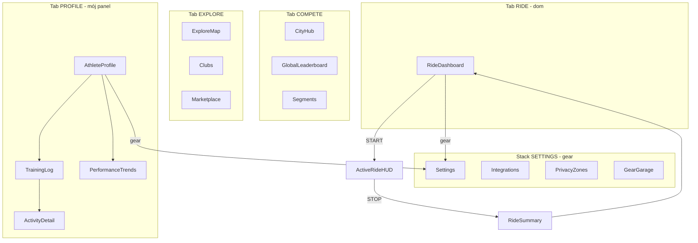
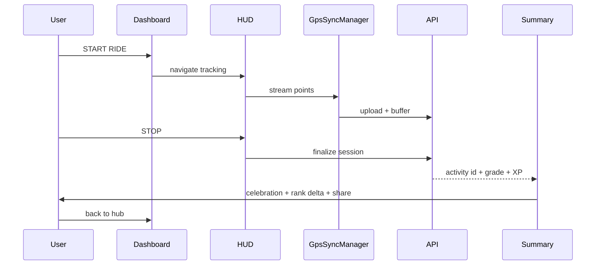
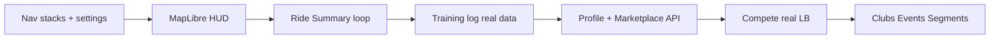

# Wymagający klient: co chcę mieć w swoim panelu

| | |
|--|--|
| **Status** | Code complete ☑ (MVP P0–P3) |
| **Owner role** | Product / Mobile Lead |
| **Last reviewed** | 2026-06-10 |
| **Audience** | Product, mobile developers, QA |
| **lang** | pl |
| **canonical_path** | docs/overhaul_plan/USER_PANEL_VISION.md |

---

Wizja i backlog UX z perspektywy wymagającego zawodnika (mobile 4VELO): jeden spójny „mój panel”, prawdziwe dane zamiast mocków, domknięta pętla jazdy i obietnice z FAQ zrealizowane w UI.

## Checklist (wysoki poziom)

- [x] **P0** — Nawigacja (stacki per tab + Settings), MapLibre HUD, Ride Summary, Training Log
- [x] **P1** — Profil/Marketplace z API, Settings overlay, i18n PL/EN + przełącznik
- [x] **P2** — Kluby (`ClubsDirectoryScreen`), segmenty (`SegmentsScreen`), CityHub compete tab
- [x] **P3** — Wearables w Settings, privacy zones API (`PrivacyService`), GPS recovery polish

---

## Kim jestem

Jestem **zwykłym użytkownikiem** — jeżdżę 3–4 razy w tygodniu, śledzę XP, chcę widzieć gdzie jestem w rankingu miasta i wymieniać punkty na vouchery. Nie interesuje mnie „panel admina”. Mój **panel** to:

- **Dom jazdy** — zakładka RIDE ([`RideDashboardScreen.tsx`](../../mobile/src/screens/RideDashboardScreen.tsx))
- **Mój profil zawodnika** — zakładka PROFILE ([`AthleteProfileScreen.tsx`](../../mobile/src/screens/AthleteProfileScreen.tsx))
- **Ustawienia** — osobny stack z ⚙️ ([`SettingsScreen.tsx`](../../mobile/src/screens/SettingsScreen.tsx), plan w [`screen-architecture-plan.md`](../archive/plans/screen-architecture-plan.md))

Dziś aplikacja wygląda jak **demo z piękną skórką**: 16 ekranów na dysku, ale większość **nieosiągalna**, dane **zahardkodowane**, mapa to **placeholder**, a po zakończeniu jazdy dostaję `Alert` po polsku zamiast ekranu podsumowania.

---

## Mój manifest (nie negocjuję)

| # | Wymaganie | Dlaczego |
|---|-----------|----------|
| 1 | **W 10 sekund wiem co robić** | Otwieram app → GPS lock, ostatnia jazda, dzisiejszy cel, jeden przycisk START |
| 2 | **Mapa na żywo, nie kolorowy prostokąt** | Bez mapy nie ufam prędkości, trasie ani anti-cheatowi |
| 3 | **Po jeździe — gratulacje + ocena + co dalej** | [`RideSummaryScreen`](../../mobile/src/screens/RideSummaryScreen.tsx) jest zaimportowany w [`App.tsx`](../../mobile/App.tsx), ale **nigdy nie jest pokazywany** |
| 4 | **Moje dane są prawdziwe** | Profil, log treningów, rankingi — z API, nie z tablic `const MOCK_*` |
| 5 | **FAQ = UI** | FAQ obiecuje Rewards, Integracje, strefy prywatności ([`docs/pl/product/FAQ.md`](../pl/product/FAQ.md)) — muszę to **zobaczyć i kliknąć** |
| 6 | **Jeden język** | EN w onboardingu + PL w alertach po jeździe = brak zaufania |
| 7 | **Offline nie zabija mojej trasy** | GPS sync jest mocny ([`GpsSyncManager.ts`](../../mobile/src/services/GpsSyncManager.ts)) — chcę to **widzieć** (banner, postęp, „odzyskano X km”) |
| 8 | **Wiem dlaczego moja trasa została odrzucona** | FAQ to wyjaśnia; w appce chcę status + powód + co zrobić |
| 9 | **Nagrody mają sens** | XP → voucher → QR w punkcie — nie sklep z fikcyjnymi itemami |
| 10 | **Wydarzenia i kluby istnieją** | Backend ma [`clubs/`](../../backend/clubs/) i events; ja ich **nie widzę** |

---

## Wizja: mój panel zawodnika

### Tab RIDE — „centrum dowodzenia”

Chcę widzieć:

- Status GPS (lock / słaby sygnał / recovery pending)
- Ostatnia jazda: dystans, czas, ocena weryfikacji, link do szczegółów
- Dzisiejszy streak / tygodniowy cel (nie losowe słupki demo)
- Aktywne wydarzenie klubowe / city challenge — **jeden tap** do startu z `event_id`
- START RIDE — zgodnie z FAQ: przytrzymanie, nie przypadkowy tap

**Dziś:** [`RideDashboardScreen.tsx`](../../mobile/src/screens/RideDashboardScreen.tsx) miesza live stats z losowymi danymi tygodniowymi; ⚙️ ma pusty `onPress`.

### Tab PROFILE — prawdziwy „character sheet”

Chcę widzieć:

- **Prawdziwe** LVL/XP z backendu (`RewardsService`, `ActivityService` w [`api.ts`](../../mobile/src/services/api.ts))
- Saldo punktów + skrót do Marketplace
- Ostatnie 3 aktywności z statusem (zweryfikowana / oczekuje / odrzucona + **powód**)
- Przyciski: Training Log, Performance, Integrations — **wszystkie działają**

**Dziś:** [`AthleteProfileScreen.tsx`](../../mobile/src/screens/AthleteProfileScreen.tsx) — hardcoded RPG stats; callbacki `onTraining` / `onPerformance` nie są podpięte w `App.tsx`.

### Settings (⚙️) — moje konto, nie ozdoba

Zgodnie z planem architektury i FAQ:

- **Integracje** — Strava / Garmin (onboarding już to sugeruje w [`OnboardingScreen.tsx`](../../mobile/src/screens/OnboardingScreen.tsx))
- **Strefy prywatności** — edytor mapy + promień (API `privacy-zones` istnieje po stronie BE)
- **Czujniki / power zones / gear** — [`SettingsScreen.tsx`](../../mobile/src/screens/SettingsScreen.tsx)
- **Eksport danych RODO** — link do self-export
- **Język** — PL/EN

**Dziś:** ekran istnieje, **brak nawigacji** do niego.

### Pętla jazdy (najważniejszy flow)

**Dziś:** STOP → `Alert` w [`App.tsx`](../../mobile/App.tsx) — [`RideSummaryScreen`](../../mobile/src/screens/RideSummaryScreen.tsx) martwy.

### Tab COMPETE — chcę wiedzieć „gdzie jestem”

- Ranking **mojego miasta** z prawdziwymi danymi (`ActivityService.getLeaderboard`)
- Moja pozycja podświetlona, delta od wczoraj
- City wars / questy — tylko jeśli backend je zasila; inaczej nie pokazuj fake

**Dziś:** [`CityHubScreen.tsx`](../../mobile/src/screens/CityHubScreen.tsx) i [`GlobalLeaderboardScreen.tsx`](../../mobile/src/screens/GlobalLeaderboardScreen.tsx) — mocki; Global LB **niewpięty** w nawigację.

### Tab EXPLORE — odkrywanie, nie sklep z plastiku

- **Mapa** z segmentami, POI sponsorów, klubami w pobliżu ([`ExploreMapScreen.tsx`](../../mobile/src/screens/ExploreMapScreen.tsx) + MapLibre już w `package.json`)
- **Kluby** — lista, dołącz, wyzwania ([`ClubsDirectoryScreen.tsx`](../../mobile/src/screens/ClubsDirectoryScreen.tsx))
- **Marketplace** — saldo XP, redeem, QR ([`MarketplaceScreen.tsx`](../../mobile/src/screens/MarketplaceScreen.tsx) + `RewardsService`)

**Dziś:** Explore tab pokazuje tylko Marketplace z mock items; mapa i kluby niedostępne.

---

## Brutalna ocena obecnego stanu

| Obszar | Ocena klienta | Dowód w kodzie |
|--------|---------------|----------------|
| Wygląd / vibe | 8/10 | STITCH theme, [`GameTabBar`](../../mobile/src/navigation/GameTabBar.tsx) |
| Nawigacja | 3/10 | Flat 4 tabs vs plan 4 stacks + settings w [`screen-architecture-plan.md`](../archive/plans/screen-architecture-plan.md) |
| Dane live | 2/10 | Mocki na większości ekranów |
| Core ride loop | 5/10 | GPS sync OK, brak summary + mapy |
| Obietnice produktu | 2/10 | FAQ vs rzeczywiste UI |
| Coach / gamifikacja | 1/10 | [`AvatarTrainerService`](../../mobile/src/services/AvatarTrainerService.ts), [`LlmCoachService`](../../mobile/src/services/LlmCoachService.ts) — zero użycia w screenach |

---

## Backlog (wizja → priorytety)

### P0 — „Nie wstydzę się pokazać znajomemu”

1. **Nawigacja zgodna z planem** — stacki per tab + `/settings` z gear icon; podpięcie 10+ istniejących ekranów
2. **MapLibre na HUD i Explore** — zastąpić placeholdery w [`ActiveRideHUDScreen`](../../mobile/src/screens/ActiveRideHUDScreen.tsx) i [`ExploreMapScreen`](../../mobile/src/screens/ExploreMapScreen.tsx)
3. **Ride Summary po STOP** — pokazać [`RideSummaryScreen`](../../mobile/src/screens/RideSummaryScreen.tsx) z danymi sesji (dystans, czas, grade, XP)
4. **Training Log + Activity Detail** — `ActivityService.getHistory` → lista → mapa trasy + wykres prędkości
5. **Status moderacji na aktywności** — pending / approved / rejected + `rejection_reason` gdy backend dostarczy (spójność z FAQ anti-cheat)
6. **GpsRecoveryBanner widoczny** — [`GpsRecoveryBanner`](../../mobile/src/components/GpsRecoveryBanner.tsx) na dashboardzie i HUD

### P1 — „Zostaję w aplikacji”

7. **Profil z prawdziwymi statami** — XP, level, saldo, ostatnie jazdy z API
8. **Marketplace z RewardsService** — redeem + QR, nie mock shop
9. **City Hub + Leaderboard z API** — moja pozycja, filtr miasta/departamentu
10. **Settings + Integrations** — Strava/Garmin flow z onboardingu przeniesiony do ustawień
11. **Strefy prywatności** — edytor zgodny z FAQ
12. **Ujednolicenie języka** — i18n PL/EN, jeden copy SSOT
13. **Coach podczas jazdy** — powierzchowne tipy z `AvatarTrainerService` / milestone z `MilestoneTracker`

### P2 — „To jest moja społeczność”

14. **Kluby** — discovery, join, club leaderboard (`backend/clubs/`)
15. **Wydarzenia** — lista, zapis, start jazdy z `event_id`
16. **Segmenty** — [`SegmentsScreen`](../../mobile/src/screens/SegmentsScreen.tsx) + map overlay
17. **Performance Trends** — CTL/ATL/TSB z historii, nie mock
18. **Push deep links** — `/ride/summary/[id]`, `/profile/activity/[id]` (plan architektury)
19. **Udostępnianie** — share card po jeździe (grafika + link)

### P3 — „Premium, ale uczciwe”

20. **Wearables sync status** — Garmin/Strava last sync, błędy
21. **Privacy-first UX** — podgląd co widać publicznie vs prywatnie
22. **Offline-first polish** — progress bar syncu, „X punktów w kolejce”

---

## Co NIE chcę (red lines)

- Kolejnych ekranów-mockupów bez API — najpierw podłączyć istniejące serwisy
- Piątej zakładki w dolnym pasku — analityka pod PROFILE (zgodnie z planem)
- „Panelu admina” w aplikacji zawodnika
- Fałszywych KPI („+10k this week” gdy to total) — uczciwe delty lub brak delty
- Obietnic w FAQ bez ekranu — albo UI, albo zmiana FAQ

---

## Proponowana kolejność realizacji (gdy przejdziecie z wizji do kodu)

**Kryterium sukcesu P0 (smoke test zawodnika):**

1. Start jazdy → mapa na HUD → stop → summary z XP → activity detail z trasą
2. Profil → training log → klik aktywności → mapa + status weryfikacji
3. ⚙️ → settings → integrations (nawet jeśli OAuth w toku)
4. Explore → mapa ładuje POI / heatmapę (read-only OK)
5. Zero hardcoded leaderboardów na ścieżce głównej

---

## Powiązane artefakty w repo

| Dokument | Rola |
|----------|------|
| [`screen-architecture-plan.md`](../archive/plans/screen-architecture-plan.md) | Docelowa IA — **SSOT nawigacji** |
| [`docs/pl/product/FAQ.md`](../pl/product/FAQ.md) | Obietnice produktu do domknięcia w UI |
| [`docs/DATA_RESILIENCE.md`](../DATA_RESILIENCE.md) | UX offline/sync |
| [`docs/archive/designmobile.md`](../archive/designmobile.md) | Wygląd STITCH |
| [`scripts/audit-mobile-routes.ts`](../../scripts/audit-mobile-routes.ts) | Audyt pliki vs plan |

**Kluczowe pliki implementacyjne:** [`mobile/App.tsx`](../../mobile/App.tsx), [`mobile/src/services/api.ts`](../../mobile/src/services/api.ts), [`mobile/src/screens/`](../../mobile/src/screens/)

---

## Podsumowanie dla product team

Jako wymagający klient nie kupuję **16 pięknych ekranów w folderze**. Kupuję **jedną spójną grę rowerową**, w której:

- wiadomo co robić po otwarciu appki,
- jazda kończy się satysfakcjonującym podsumowaniem,
- mój profil mówi prawdę,
- ranking i nagrody mają konsekwencje w realnym świecie,
- a FAQ nie kłamie.

Największy ROI: **nawigacja + ride loop + prawdziwe dane na PROFILE/COMPETE** — reszta to rozszerzenie tej bazy.

---

## Checklist implementacji (2026-06-10)

| ID | Priorytet | Zadanie | Status |
|----|-----------|---------|--------|
| p0-nav | P0 | 4 taby + settings overlay + training log overlay | ☑ |
| p0-ride-summary | P0 | Ride Summary po STOP (`RideSummaryScreen`) | ☑ |
| p0-gps-recovery | P0 | `GpsRecoveryBanner` na dashboardzie i HUD | ☑ |
| p0-training-log | P0 | Training log z `ActivityService.getHistory` + status moderacji | ☑ |
| p0-explore | P0 | Explore hub: Marketplace API + mapa POI (`ExploreHubScreen`) | ☑ |
| p1-profile | P1 | Profil z API (`AthleteProfileScreen`) | ☑ |
| p1-marketplace | P1 | Marketplace `RewardsService` redeem | ☑ |
| p1-compete-api | P1 | Ranking miasta z API w `CityHubScreen` | ☑ |
| p1-settings | P1 | Settings + wearables stub + i18n PL/EN | ☑ |
| p1-i18n | P1 | Mobile i18n SSOT + `GameTabBar` | ☑ |
| p2-clubs | P2 | Kluby overlay z City Hub | ☑ |
| p2-segments | P2 | Segmenty overlay z City Hub | ☑ |
| p3-wearables | P3 | Status Garmin/Strava w Settings (`WearableService`) | ☑ |

**Poza MVP (świadomie):** pełny MapLibre na HUD, city wars z backendem, coach LLM w trakcie jazdy, push deep links — backlog post-overhaul.
