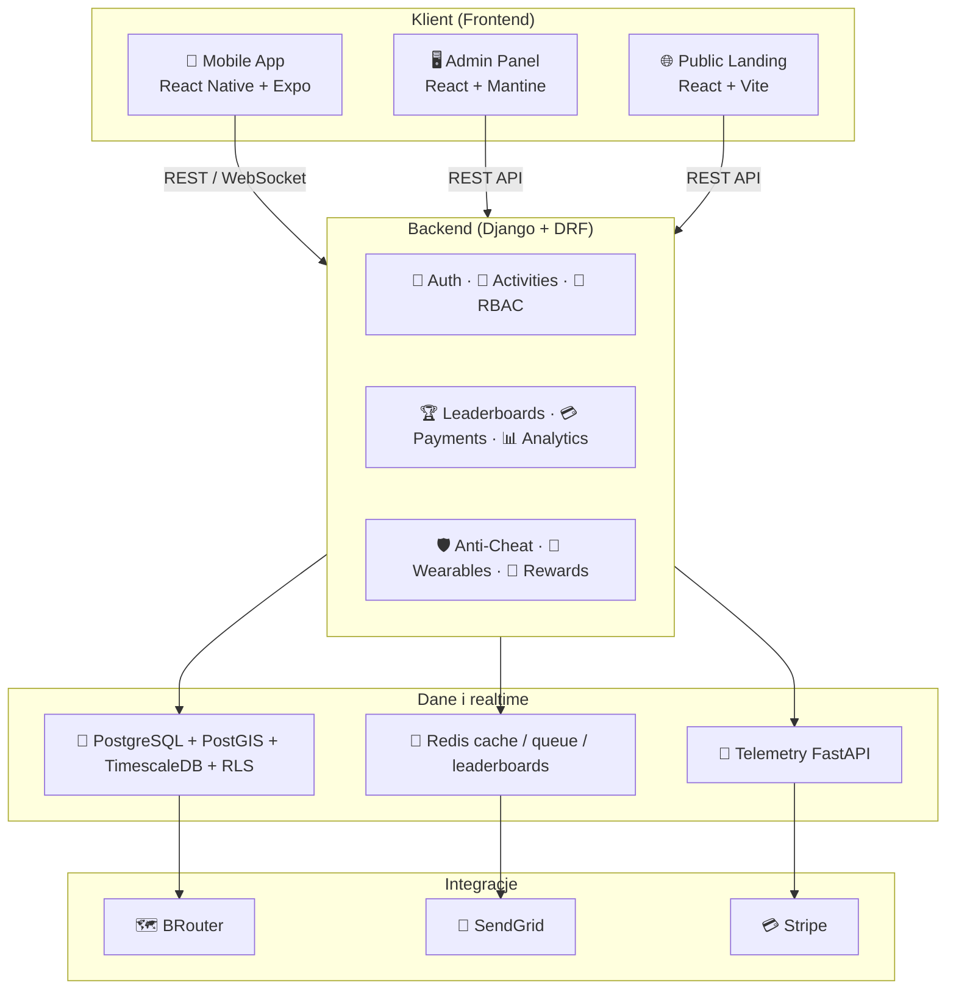
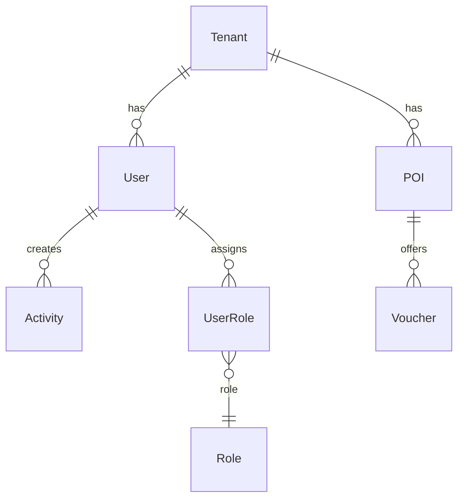
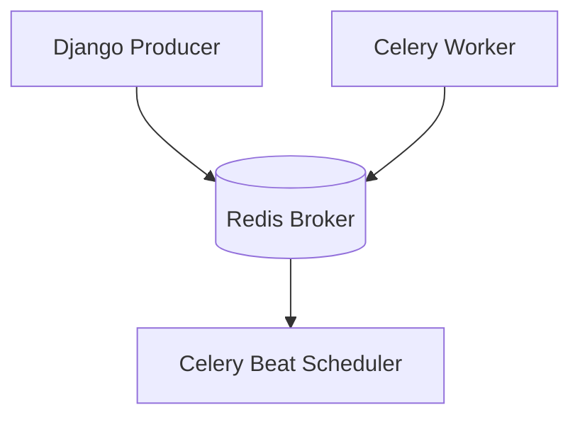
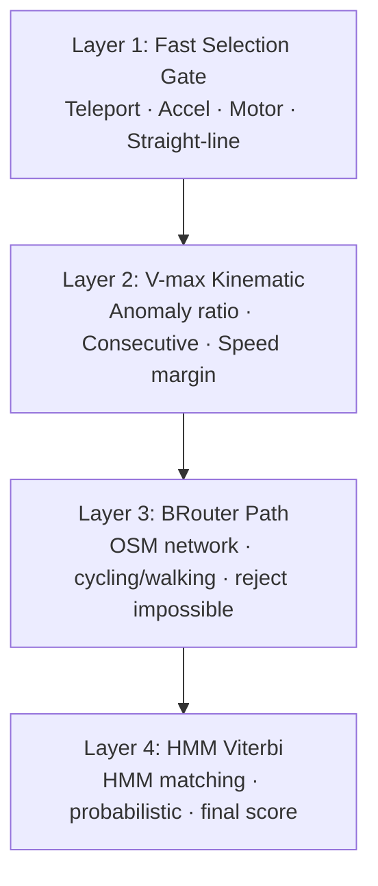
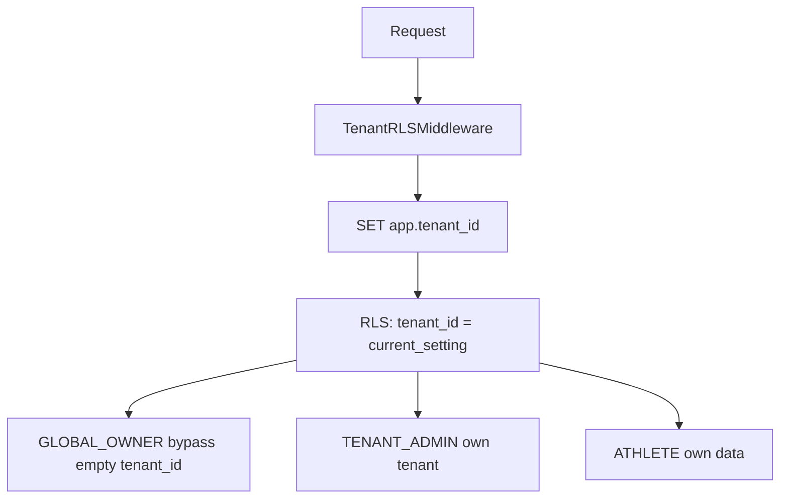

# Document

| | |
|--|--|
| **Status** | ✅ Active |
| **Owner role** | Documentation maintainer |
| **Last reviewed** | 2026-06-04 |
| **Audience** | Zobacz dokument kanoniczny |
| **lang** | pl |
| **translation** | [English](../ARCHITECTURE.md) |
| **canonical_path** | docs/pl/ARCHITECTURE.md |
---

| | |
|--|--|
| **Status** | ✅ Active |
| **Owner role** | Tech Lead / Backend Lead |
| **Last reviewed** | 2026-06-03 |
| **Audience** | Deweloperzy, architekci |

Kompletny opis architektury platformy 4VELO — wysokowydajnego ekosystemu sportowego B2B/B2C.

**Powiązane:** [diagrams/architecture_c4.md](./diagrams/architecture_c4.md) · [adr/008-backend-strategy.md](./adr/008-backend-strategy.md) · [operations/SIMULATOR.md](../operations/SIMULATOR.md)

---

## 📐 Diagram architektury (wysoki poziom)



### BRouter (produkcja i dev)

| Użycie | Środowisko | URL / serwis |
|--------|------------|--------------|
| Anti-cheat (warstwa 3) | Railway + Compose | `BRouterService` → `BROUTER_URL` |
| Live sim (trasy po drogach) | `celery-worker-simulation` + serwis `brouter` | `http://brouter.railway.internal:17777/brouter` |
| Lokalnie | Docker Compose | `http://brouter:17777/brouter` |

- Obraz i kafelki `.rd5`: [infrastructure/brouter/README.md](../../infrastructure/brouter/README.md).
- Operacje: [operations/BROUTER.md](../operations/BROUTER.md).
- Symulator (batch → live): [operations/SIMULATOR.md](../operations/SIMULATOR.md), ADR [010](./adr/010-simulator-redis-celery.md).

---

## 🔧 Backend — Django + DRF + PostGIS + Celery

### Technologia

| Komponent | Technologia | Wersja |
|-----------|-------------|--------|
| Framework | Django | 4.2.x |
| REST API | Django REST Framework | 3.15.x |
| GIS | PostGIS + djangorestframework-gis | 1.1.x |
| Auth | djangorestframework-simplejwt | 5.3.x |
| Social Auth | django-allauth | 65.14.x |
| Tasks | Celery + django-celery-beat | 5.4.x |
| Monitoring | Sentry SDK | 2.22.x |
| Email | SendGrid | 6.11.x |
| ML Anti-Cheat | scikit-learn + numpy | 1.5.0 / 1.26.4 |

### Struktura modułów```
backend/
├── core/               # Konfiguracja Django, middleware, URL-e
│   ├── settings.py     # Ustawienia główne
│   ├── middleware.py   # TenantRLSMiddleware, ImpersonationAuditMiddleware
│   └── urls.py         # Główne routowanie API
├── users/              # Użytkownicy, RBAC, tenanci
│   ├── models.py       # User, Tenant, AuditLog
│   ├── rbac_models.py  # Permission, Role, RolePermission, UserRole
│   ├── rbac_views.py   # API RBAC
│   ├── permissions.py  # Klasy uprawnień DRF
│   └── serializers.py  # Serializery
├── activities/         # Aktywności, anti-cheat, wearables
│   ├── models.py       # Activity, PrivacyZone, POI, Voucher
│   ├── views.py        # Endpointy aktywności
│   ├── admin_views.py  # Endpointy admina
│   ├── services.py     # TelemetryService
│   ├── wearables.py    # StravaService, GarminService
│   ├── signal_processing.py  # Przetwarzanie sygnału GPS
│   ├── ml_anomaly.py   # ML anomaly detection
│   ├── viterbi_matching.py   # HMM Viterbi matching
│   └── tasks.py        # Zadania Celery
├── clubs/              # Kluby sportowe
├── events/             # Wydarzenia sportowe
├── rewards/            # System nagród i punktów
└── requirements.txt    # Zależności Python
```### Middleware

| Middleware | Cel |
|------------|-----|
| [`TenantRLSMiddleware`](../../backend/core/middleware.py:6) | Ustawia `app.tenant_id` w sesji PostgreSQL dla Row-Level Security |
| [`ImpersonationAuditMiddleware`](../../backend/core/middleware.py:48) | Loguje akcje adminów i sesje impersonowane do `AuditLog` |

---

## 🖥️ Frontend — React + Mantine + Vite

### Technologia

| Komponent | Technologia | Wersja |
|-----------|-------------|--------|
| Framework | React | 18+ |
| UI Library | Mantine | 7+ |
| Build Tool | Vite | 5+ |
| Routing | React Router | 6+ |
| State Management | Zustand | 4+ |
| HTTP Client | Axios | 1.7.x |
| Charts | Tremor | 3+ |

### Struktura modułów```
admin/
├── src/
│   ├── App.tsx               # Główny komponent aplikacji
│   ├── main.tsx              # Entry point
│   ├── api/
│   │   └── client.ts         # Konfiguracja Axios + interceptory
│   ├── core/
│   │   ├── Layout.tsx        # Główny layout aplikacji
│   │   ├── auth/
│   │   │   ├── LoginPage.tsx # Ekran logowania
│   │   │   └── useAuth.ts    # Hook auth (Zustand store)
│   │   ├── guards/
│   │   │   ├── RoleGuard.tsx       # Guard na podstawie roli
│   │   │   └── PermissionGuard.tsx # Guard na podstawie uprawnień
│   │   └── components/
│   │       └── PageHeader.tsx
│   └── modules/
│       ├── dashboard/        # Dashboard + ModeratorWorklist
│       ├── users/            # Zarządzanie użytkownikami
│       ├── tenants/          # Tenants + White-Label Engine
│       ├── analytics/        # CityAnalytics, GlobalHeatmap
│       ├── anti-cheat/       # AntiCheat, AdaptiveIntegrity
│       ├── sponsor/          # SponsorDashboard
│       ├── settings/         # SettingsScreen
│       └── public/           # LandingPage
└── package.json
```### Autoryzacja Stana (stan)```typescript
interface AuthState {
  user: User | null;
  isAuthenticated: boolean;
  token: string | null;
  refreshToken: string | null;
  permissions: string[];
  login: (token, refresh, user) => Promise<void>;
  logout: () => void;
  impersonate: (token, user) => void;
  hasPermission: (permission: string) => boolean;
  hasAnyPermission: (permissions: string[]) => boolean;
  hasRole: (roleSlug: string) => boolean;
}
```---

## 📱 Mobile — React Native + Expo

### Technologia

| Komponent | Technologia |
|-----------|-------------|
| Framework | React Native (Expo) |
| UI | Tamagui + Skia |
| State | Legend-State |
| Storage | MMKV |
| Maps | react-native-maps |
| GPS | expo-location |

### Kluczowe funkcje

- Map-first tracking z auto-hide HUD
- Offline-first z SQLite
- 4-warstwowy anti-cheat po stronie serwera
- Integracje z Strava i Garmin

---

## 🗄️ Schemat bazy danych

### Główne tabele



### Relacje

| Tabela | Relacja | Opis |
|--------|---------|------|
| Tenant → User | 1:N | Tenant ma wielu użytkowników |
| User → Activity | 1:N | Użytkownik ma wiele aktywności |
| User → UserRole | 1:N | Użytkownik ma wiele przypisań ról |
| UserRole → Role | N:1 | Wiele przypisań do jednej roli |
| Tenant → POI | 1:N | Tenant ma wiele punktów POI |
| POI → Voucher | 1:N | POI ma wiele voucherów |

---

## 🔴 Serwis komunikacji — Redis + Celery

### Architektura



### Kolejki Redis

| Kolejka | Opis |
|---------|------|
| `critical,notifications` | Domyślne kolejki zadań |
| `traccar:positions` | Pozycje GPS z Traccar |
| Leaderboard Sorted Sets | Rankingi miast (`leaderboard:{city_id}`) |

### Zadania Celery

| Zadanie | Opis |
|---------|------|
| `process_activity` | Przetwarzanie i weryfikacja aktywności |
| `sync_wearable_activity` | Synchronizacja aktywności z wearable |
| `retrain_ml_model` | Retrenowanie modelu ML anti-cheat |
| `send_email` | Wysyłka emaili przez SendGrid |

---

## 🛡️ Pipeline Anti-Cheat

### 4-warstwowa walidacja



### Konfiguracja (zmienne środowiskowe)

| Zmienna | Domyślna | Opis |
|---------|----------|------|
| `GATE_TELEPORT_M` | 500 | Max skok GPS w metrach |
| `GATE_MAX_ACCEL` | 6.0 | Max przyspieszenie fizjologiczne |
| `GATE_MOTOR_VAR` | 0.05 | Max współczynnik zmienności silnika |
| `GATE_STRAIGHT_RATIO` | 0.92 | Min ratio prostej do trasy |
| `VMAX_ANOMALY_RATIO` | 0.20 | Max ratio anomalii |
| `VMAX_CONSECUTIVE` | 3 | Max kolejnych naruszeń |
| `VMAX_MARGIN` | 1.10 | Margines prędkości |
| `BROUTER_URL` | — | Base URL silnika (wymagane na prod dla warstwy 3 i live sim) |
| `BROUTER_TIMEOUT` | 30 | Timeout HTTP do BRouter (sekundy) |

---

## 🔐 Row Level Security (RLS)

### Architektura izolacji tenantów



---

### Department Hierarchy (Organizational Units)

Wspiera strukturę organizacyjną wewnątrz tenantów:

- **Firmy**: działy (IT, HR, Sprzedaż)
- **Szkoły**: klasy (4A, 4B, 5A)
- **Uczelnie**: wydziały/katedry
- **NGO**: zespoły projektowe
- **Miasta**: dzielnice/osiedla

Model: `Department` z relacją parent/children, przypisaniem do tenanta, moderatorem i typem.

---

> **Zobacz także:** [C4 Architecture Diagrams](./diagrams/architecture_c4.md)
