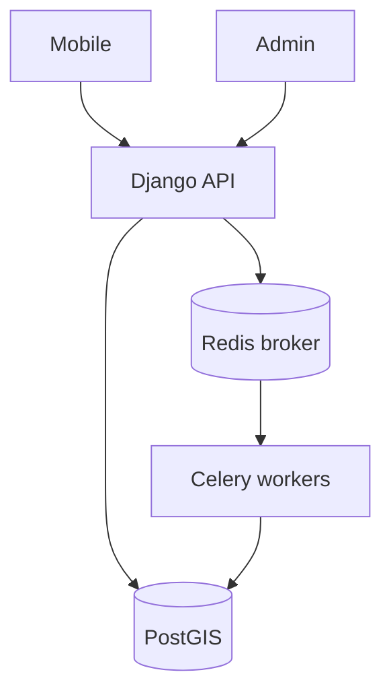

# 4VELO — architektura

| | |
|--|--|
| **Status** | Active |
| **Owner role** | Tech Lead |
| **Last reviewed** | 2026-09-10 |
| **Audience** | Developers |
| **lang** | pl |
| **translation** | [English](../ARCHITECTURE.md) |
| **canonical_path** | docs/pl/ARCHITECTURE.md |

Opis kodu i konfiguracji repozytorium, nie potwierdzenie wdrożenia produkcyjnego. Dokładne wersje zależności są w manifestach i lockfile; nie duplikujemy ich tutaj.

## Granice komponentów

| Path | Technology | Responsibility |
|---|---|---|
| [backend/](../../backend/) | Django / DRF | API, auth, tenants, activities, rewards; Celery tasks |
| [telemetry/](../../telemetry/) | FastAPI | GPS ingest, Redis queue, live WebSocket delivery |
| [admin/](../../admin/) | React / Vite / Mantine | GLOBAL_ADMIN, LOCAL_ADMIN, MODERATOR; optional Electron |
| [mobile/](../../mobile/) | Expo / React Native | GPS tracking, local storage, API access |
| [packages/api-client/](../../packages/api-client/) | OpenAPI / Orval | Shared API paths and generated client |
| [packages/tokens/](../../packages/tokens/) | TypeScript | Shared design tokens |
| [packages/eslint-config/](../../packages/eslint-config/) | ESLint | Shared lint configuration |
| [packages/tsconfig/](../../packages/tsconfig/) | TypeScript | Shared compiler configuration |

## Przepływy i odpowiedzialność

- Backend zapisuje dane domenowe w PostGIS. `backend/core/settings.py` definiuje kolejki Celery i harmonogram beat; workery wykonują zadania z brokera Redis.
- Telemetria ma własny punkt wejścia w `telemetry/main.py`. Obsługę ingestu, kolejek, bazy i WebSocketów rozdzielono między moduły tej usługi. Obecność kodu nie dowodzi trwałości ingestu przy awarii.
- Routing BRouter/OSRM wywołuje kod backendu i symulatorów. Stripe, SendGrid i integracje wearables również należą do kodu backendu, nie do bazy danych lub Redis.
- `backend/users/` odpowiada za użytkowników, tenantów i uprawnienia; `activities/` za aktywności, symulację i integracje; `events/`, `clubs/`, `rewards/` za swoje domeny. Konfiguracja wspólna jest w `core/`.
- Autoryzację należy sprawdzać w endpointach, filtrach zapytań i politykach RLS. Samo istnienie RLS nie potwierdza izolacji wszystkich danych.

## Wdrożenie i stan wiedzy

Compose, katalogi workerów Railway i manifesty Kubernetes opisują warianty wdrożenia. Nie są inwentarzem działającej produkcji. Konfiguracja środowiska, kopie zapasowe, MFA, skala symulatorów i izolacja tenantów wymagają oddzielnych dowodów operacyjnych.

Nie edytuj ręcznie klienta w `packages/api-client/src/generated/`. Zmiany kontraktów zaczynaj od backendu i eksportu OpenAPI; następnie uruchom generator i sprawdź jego diff.

## Dalsza lektura

- [Repository map](../reports/REPOSITORY_MAP.md)
- [Quality command matrix](../reports/QUALITY_COMMAND_MATRIX.md)
- [Risk and ownership map](../reports/RISK_AND_OWNERSHIP_MAP.md)
- [Container diagrams](diagrams/architecture_c4.md)
- [BRouter operations](../operations/BROUTER.md)
