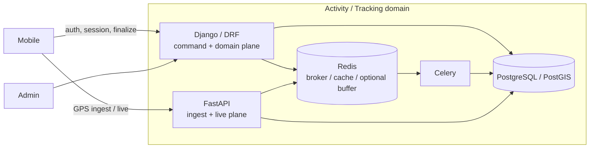

# 4VELO — architektura

| | |
|--|--|
| **Status** | ✅ Active |
| **Document class** | REFERENCE |
| **Owner role** | Tech Lead |
| **Last reviewed** | 2026-09-30 |
| **Audience** | Developerzy, reviewerzy, operatorzy |
| **lang** | pl |
| **translation** | [English](../ARCHITECTURE.md) |
| **canonical_path** | docs/pl/ARCHITECTURE.md |

To jest polskie podsumowanie centralnego SSOT architektury. Pełna wersja kanoniczna: [ARCHITECTURE.md](../ARCHITECTURE.md).

## Model systemu


```mermaid
flowchart LR
  Mobile[Mobile]
  Admin[Admin]

  subgraph Activity["Activity / Tracking domain"]
    Django[Django / DRF\ncommand + domain plane]
    Tel[FastAPI\ningest + live plane]
    DB[(PostgreSQL / PostGIS)]
    Redis[(Redis\nbroker / cache / optional buffer)]
    Celery[Celery]

    Django --> DB
    Django --> Redis
    Redis --> Celery
    Celery --> DB
    Tel --> DB
    Tel --> Redis
  end

  Mobile -->|auth, session, finalize| Django
  Mobile -->|GPS ingest / live| Tel
  Admin --> Django
```

Najważniejsza zasada: **proces nie jest domeną**.

- Django jest właścicielem komend i prawdy biznesowej: identity/auth, tenant/RBAC, Activity lifecycle i durable finalization.
- FastAPI jest osobnym plane'em wykonawczym dla wysokiego ruchu telemetrycznego i realtime, ale nie jest osobnym źródłem prawdy o Activity.
- PostgreSQL/PostGIS przechowuje trwałą prawdę.
- Redis jest brokerem/cache/buforem operacyjnym; nie jest autorytetem dla krytycznego ACK ani zakończenia aktywności.

## Prawda danych telemetrycznych

| Dane | Rola |
|---|---|
| zaszyfrowany mobile buffer/outbox | lokalna kopia retry do trwałego ACK |
| `gps_points` | kanoniczne publiczne punkty GPS |
| `telemetry_ingest_receipts` | trwały dowód przyjęcia i pokrycia batcha |
| `Activity` | rekord lifecycle domeny |
| `Activity.route_path` | dane pochodne odbudowane/rekonsyliowane przy finalizacji |
| Redis dedupe/queue | optymalizacja operacyjna, nie krytyczna prawda danych |

## ACK krytycznej telemetrii

[ADR 015](../adr/015-critical-data-acknowledgement.md) jest nadrzędny.

Dla receipt-backed activity batch:

```text
mobile outbox
 -> FastAPI
 -> transakcja PostgreSQL
      gps_points + telemetry_ingest_receipts
 -> COMMIT
 -> delete-safe ACK
 -> dopiero wtedy mobile usuwa batch
```

Samo `XADD` do Redis Stream nie daje prawa do skasowania ostatniej retryable copy klienta.

## Mobile

Normatywny kierunek zależności:

```text
screen
 -> controller
 -> feature interface
 -> production / deterministic adapter
 -> services / domain
```

Szczegóły: [MOBILE_APPLICATION_ARCHITECTURE_V1](../design/MOBILE_APPLICATION_ARCHITECTURE_V1.md).

Zatrzymanie recordingu nie oznacza jeszcze sukcesu domenowego. UI rozróżnia `durable-success`, `pending-finalization` i `recovery-required`.

PAUSE/RESUME to lifecycle domeny, nie zwykły setter UI.

## Background

Osobno traktujemy:

1. trwałość nagrania GPS przy screen-off/process death;
2. freshness live trackingu dla zdalnego widza.

Proofy mobile potwierdzają pierwszą właściwość. Druga wymaga osobnego SLO i runtime proof.

## Dalej

- [Diagramy C4](diagrams/architecture_c4.md)
- [DATA_RESILIENCE](DATA_RESILIENCE.md)
- [ADR index](../adr/README.md)
- [ADR 015](../adr/015-critical-data-acknowledgement.md)
- [Ride flow](../design/MOBILE_RIDE_FLOW_V1.md)
- [Mobile runtime acceptance](../quality/MOBILE_RUNTIME_ACCEPTANCE_V1.md)
