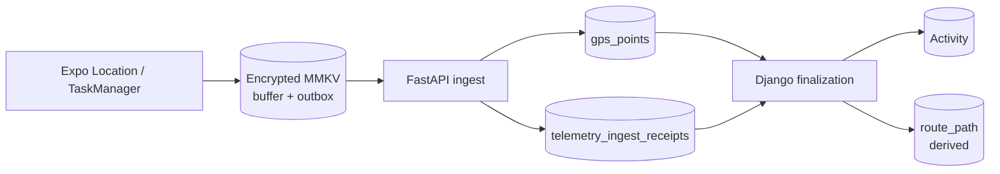

# Odporność danych — 4VELO

| | |
|--|--|
| **Status** | ✅ Active |
| **Document class** | REFERENCE |
| **Owner role** | Mobile Lead / Platform Lead |
| **Last reviewed** | 2026-09-30 |
| **Audience** | Mobile, backend, telemetry, reviewerzy |
| **lang** | pl |
| **translation** | [English](../DATA_RESILIENCE.md) |
| **canonical_path** | docs/pl/DATA_RESILIENCE.md |

To jest polskie podsumowanie kontraktu trwałości danych Ride. Pełna wersja kanoniczna: [DATA_RESILIENCE.md](../DATA_RESILIENCE.md).

## Łańcuch trwałości



## Prawda danych

- zaszyfrowany mobile buffer/outbox = ostatnia retryable copy przed trwałym ACK;
- `gps_points` = trwałe publiczne punkty GPS;
- `telemetry_ingest_receipts` = trwały dowód przyjęcia/pokrycia batcha;
- `Activity` = prawda lifecycle domeny;
- `Activity.route_path` = dane pochodne odbudowane/rekonsyliowane z trwałej telemetrii;
- Redis = broker/cache/bufor operacyjny, nie krytyczny autorytet danych.

## Delete-safe ACK

[ADR 015](../adr/015-critical-data-acknowledgement.md) jest nadrzędny.

```text
mobile durable outbox
 -> FastAPI
 -> PostgreSQL transaction
      gps_points + telemetry_ingest_receipts
 -> COMMIT
 -> ACK
 -> dopiero wtedy kasujemy lokalny batch
```

Timeout, 429/503 lub samo Redis `XADD` nie upoważnia do usunięcia ostatniej kopii retry.

## Finalizacja

Stop recordingu != zakończona aktywność.

Django finalizuje Activity dopiero na podstawie trwałych danych/receiptów i odbudowuje kanoniczny `route_path`. Jeżeli pokrycie telemetrii nie jest jeszcze kompletne, stan pozostaje `pending-finalization` lub `recovery-required`; UI nie może udawać sukcesu.

## Awarie

| Awaria | Zachowanie |
|---|---|
| brak sieci | nagrywaj lokalnie, zachowaj outbox |
| timeout po wysłaniu | retry tego samego batch identity |
| przeciążenie | respektuj Retry-After, niczego nie kasuj |
| kill procesu | odzyskaj trwały local state i Activity identity |
| brak klucza szyfrowania | fail closed |
| brak pełnego receipt coverage | brak durable-success |

## Background recording != live tracking

Proofy mobile potwierdzają trwałość background/locked recording i recovery. Nie dowodzą automatycznie, że zdalny live tracking ma określony freshness przy screen-off.

Live SLO i offline start pozostają osobnymi decyzjami. Semantyka PAUSE/RESUME jest już domenowym kontraktem Ride: ten sam Activity, persisted PAUSED, zatrzymany producent GPS, czas/ruch z pauzy wykluczone z metryk i truthful relaunch do PAUSED.

## Trwałość PAUSE

PAUSED pozostaje tą samą otwartą Activity/session.

Mobile zapisuje `ridePhase=paused` w szyfrowanym tracking state przed zatrzymaniem natywnego Location task. Relaunch odtwarza PAUSED bez cichego restartu GPS. Resume używa tego samego Activity identity i wyklucza przerwę z czasu jazdy, GPS-active time oraz ruchu.

Upload/reconciliation wcześniej zapisanych punktów może działać podczas pauzy; PAUSE nie osłabia buffer/outbox.

## Powiązane

- [Architektura](ARCHITECTURE.md)
- [ADR 011](../adr/011-telemetry-ingest-durability-under-load.md)
- [ADR 015](../adr/015-critical-data-acknowledgement.md)
- [Mobile operations](operations/MOBILE.md)
- [Ride flow](../design/MOBILE_RIDE_FLOW_V1.md)
- [Mobile runtime acceptance](../quality/MOBILE_RUNTIME_ACCEPTANCE_V1.md)
