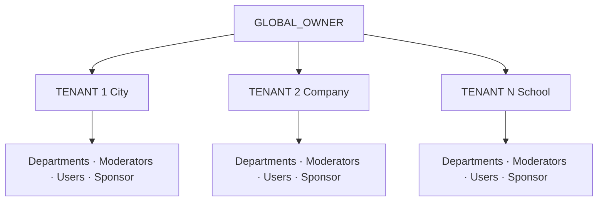
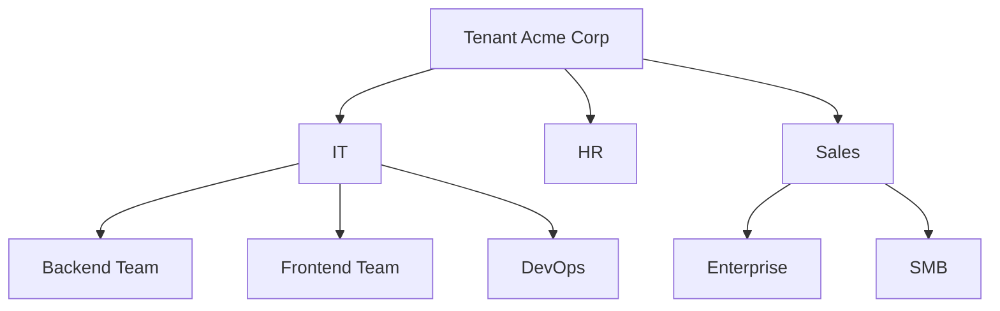
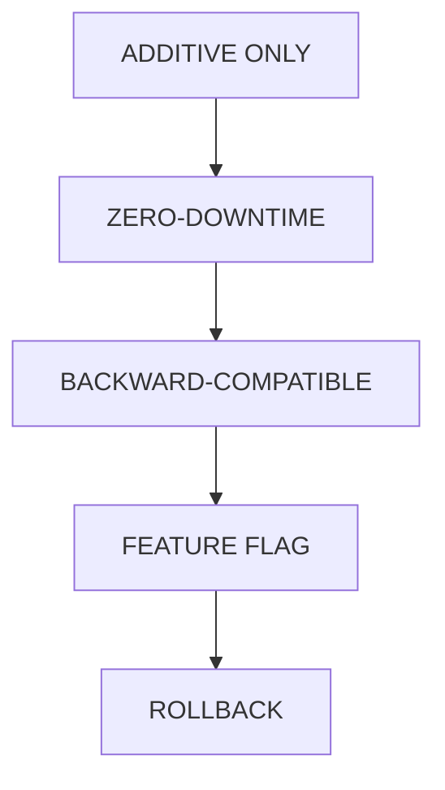
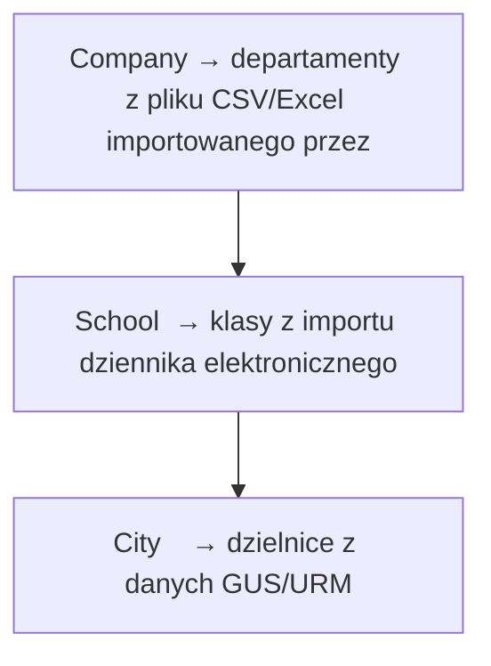
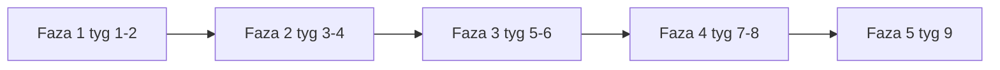

# Document

| | |
|--|--|
| **Status** | ✅ Active |
| **Owner role** | Documentation maintainer |
| **Last reviewed** | 2026-06-04 |
| **Audience** | Zobacz dokument kanoniczny |
| **lang** | pl |
| **translation** | [English](../DEPARTMENT_ARCHITECTURE.md) |
| **canonical_path** | docs/pl/DEPARTMENT_ARCHITECTURE.md |
---

| | |
|--|--|
| **Status** | ✅ Active |
| **Owner role** | Product / Backend Lead |
| **Last reviewed** | 2026-06-03 |
| **Audience** | Deweloperzy, product |

Kompletny plan dodania hierarchii "Department/Class" do wielodzierżawczej platformy SaaS 4VELO.

**Powiązane:** [RBAC.md](../RBAC.md) · [ARCHITECTURE.md](./ARCHITECTURE.md)

---

## 📋 Spis treści

1. [Diagram hierarchii](#1-diagram-hierarchii)
2. [Schemat bazy danych (ERD)](#2-schemat-bazy-danych-erd)
3. [Macierz uprawnień RBAC](#3-macierz-uprawnień-rbac)
4. [Endpointy API](#4-endpointy-api)
5. [Projekt polityk RLS](#5-projekt-polityk-rls)
6. [Strategia migracji](#6-strategia-migracji)
7. [Zmiany w frontendzie](#7-zmiany-w-frontendzie)
8. [Fazy implementacji](#8-fazy-implementacji)

---

## 1. Diagram hierarchii

### 1.1. Pełna hierarchia systemu




### 1.2. Typy tenantów i odpowiadające departamenty

| Typ Tenanta | Typ Departamentu | Przykłady nazw |
|-------------|------------------|----------------|
| city | district | "Śródmieście", "Mokotów" |
| company | department | "IT", "HR", "Sales", "Marketing" |
| school | class | "4A", "4B", "5A", "5B" |
| university | faculty | "Wydział Informatyki", "Wydział Mechaniczny" |
| ngo | team | "Zespół Ekologiczny", "Wolontariat" |

### 1.3. Hierarchia departamentów (zagnieżdżanie)


---

## 2. Schemat bazy danych (ERD)

### 2.1. Nowy model: `Department`

| Pole | Typ | Opis |
|------|-----|------|
| id | UUID PK | Unikalny identyfikator |
| name | VARCHAR(200) NOT NULL | Nazwa działu/klasy |
| tenant_id | UUID FK→Tenant | Przypisanie do tenanta |
| parent_id | UUID FK→self | NULL = brak rodzica |
| moderator_id | INT FK→User | NULL = brak moderatora |
| department_type | VARCHAR(50) NOT NULL | `department`, `class`, … |
| description | TEXT | Opis (opcjonalny) |
| is_active | BOOLEAN DEFAULT True | |
| created_at | TIMESTAMP AUTO_NOW_ADD | |
| updated_at | TIMESTAMP AUTO_NOW | |

**Constraints:** UNIQUE `(tenant_id, name)` · INDEX `tenant_id`, `parent_id`, `moderator_id`, `department_type`

### 2.2. Relacja User-Department (ManyToMany)

| Pole | Typ | Opis |
|------|-----|------|
| id | UUID PK | |
| user_id | INT FK→User | |
| department_id | UUID FK→Department | |
| role_in_dept | VARCHAR(50) DEFAULT `member` | `member`, `lead` |
| joined_at | TIMESTAMP AUTO_NOW_ADD | |

**Constraints:** UNIQUE `(user_id, department_id)` · INDEX `user_id`, `department_id`


### 2.3. Pełny ERD z relacjami

```mermaid
erDiagram
  Tenant ||--o{ Department : rel
  Tenant ||--o{ User : rel
  Department o--o| Department : rel
  User ||--o{ UserDepartment : rel
  Department ||--o{ UserDepartment : rel
  User ||--o{ Activity : rel
  User ||--o{ UserRole : rel
```


### 2.4. Rozszerzenie modelu Activity (opcjonalne)

```mermaid
erDiagram
  Tenant ||--o{ Department : rel
  Department o--o| Department : rel
  Department ||--o{ UserDepartment : rel
```
> **Uwaga:** Pole `department_id` w Activity jest opcjonalne. Można je dodać, jeśli potrzebne są rankingi i analityka na poziomie departamentów. Alternatywnie, departament użytkownika można wyznaczyć przez relację User→UserDepartment.

---

## 3. Macierz uprawnień RBAC

### 3.1. Nowe uprawnienia departamentowe

| Codename | Resource | Opis |
| --- | --- | --- |
| departments.view | departments | Podgląd listy departamentów |
| departments.create | departments | Tworzenie nowego departamentu |
| departments.edit | departments | Edycja departamentu |
| departments.delete | departments | Usuwanie departamentu |
| departments.view_users | departments | Podgląd użytkowników w departamencie |
| departments.assign_users | departments | Przypisywanie użytkowników |
| departments.remove_users | departments | Usuwanie użytkowników z depart. |
| departments.view_activities | departments | Podgląd aktywności departamentu |
| departments.view_analytics | departments | Analityka departamentu |


### 3.2. Zaktualizowana macierz uprawnień

| Uprawnienie | Global Owner | Tenant Admin | Dept. Moderator | Sponsor | Athlete |
|-------------|--------------|--------------|-----------------|---------|---------|
| departments.view | ✅ WSZYSTKIE | ✅ WSZYSTKIE | ✅ SWÓJ | ❌ | ❌ |
| departments.create | ✅ | ✅ | ❌ | ❌ | ❌ |
| departments.edit | ✅ | ✅ | ✅ SWÓJ | ❌ | ❌ |
| departments.delete | ✅ | ✅ | ❌ | ❌ | ❌ |
| departments.view_users | ✅ WSZYSTKIE | ✅ WSZYSTKIE | ✅ SWÓJ | ❌ | ❌ |
| departments.assign_users | ✅ | ✅ | ✅ SWÓJ | ❌ | ❌ |
| departments.remove_users | ✅ | ✅ | ✅ SWÓJ | ❌ | ❌ |
| departments.view_activities | ✅ WSZYSTKIE | ✅ WSZYSTKIE | ✅ SWÓJ | ❌ | ❌ |
| departments.view_analytics | ✅ WSZYSTKIE | ✅ WSZYSTKIE | ✅ SWÓJ | ❌ | ❌ |
| activities.view | ✅ | ✅ | ✅ SWÓJ | ✅ | ✅ |
| activities.approve | ✅ | ✅ | ✅ SWÓJ | ❌ | ❌ |
| users.view | ✅ | ✅ | ✅ SWÓJ | ❌ | ✅ |
| users.create | ✅ | ✅ | ✅ SWÓJ | ❌ | ❌ |
| users.edit | ✅ | ✅ | ✅ SWÓJ | ❌ | ❌ |
| analytics.view | ✅ | ✅ | ✅ SWÓJ | ✅ | ❌ |
| analytics.export | ✅ | ✅ | ❌ | ❌ | ❌ |

Legenda: ✅ WSZYSTKIE = wszystkie departamenty w systemie/tenancie · ✅ SWÓJ = tylko swój departament · ✅ = bez scope departamentu

### 3.3. Nowa rola systemowa: `department_moderator`

```python
class Role(models.Model):
    SLUG_CHOICES = [
        ('global_owner', 'Global Owner'),
        ('tenant_admin', 'Tenant Admin'),
        ('department_moderator', 'Department Moderator'),  # NOWA ROLA
        ('tenant_moderator', 'Tenant Moderator'),
        ('sponsor', 'Sponsor'),
        ('athlete', 'Athlete'),
    ]
```

### 3.4. Uprawnienia dla roli `department_moderator`

| Uprawnienie | Scope |
|-------------|-------|
| departments.view | Tylko swój departament (i pod-departamenty) |
| departments.edit | Tylko swój departament |
| departments.view_users | Tylko użytkownicy w swoim departamencie |
| departments.assign_users | Tylko przypisywanie do swojego departamentu |
| departments.remove_users | Tylko usuwanie ze swojego departamentu |
| departments.view_activities | Tylko aktywności użytkowników z departamentu |
| departments.view_analytics | Tylko analityka swojego departamentu |
| activities.view | Tylko aktywności użytkowników z departamentu |
| activities.approve | Tylko aktywności użytkowników z departamentu |
| users.view | Tylko użytkownicy w swoim departamencie |
| users.create | Tylko tworzenie użytkowników w departamencie |
| users.edit | Tylko edycja użytkowników w departamencie |

---

## 4. API punktu końcowego

### 4.1. Podstawowy adres URL: `/api/users/rbac/departments/`

| Endpoint | Metoda | Opis | Wymagana rola |
|----------|--------|------|---------------|
| `/api/users/rbac/departments/` | GET | Lista departamentów (filtrowana po roli) | Authenticated |
| `/api/users/rbac/departments/` | POST | Utwórz departament | Tenant Admin+ |
| `/api/users/rbac/departments/{id}/` | GET | Szczegóły departamentu | Authenticated |
| `/api/users/rbac/departments/{id}/` | PUT/PATCH | Edycja departamentu | Tenant Admin+ |
| `/api/users/rbac/departments/{id}/` | DELETE | Usuń departament* | Tenant Admin+ |
| `/api/users/rbac/departments/{id}/users/` | GET | Użytkownicy w departamencie | Authenticated |
| `/api/users/rbac/departments/{id}/assign/` | POST | Przypisz użytkownika | Tenant Admin+ |
| `/api/users/rbac/departments/{id}/remove/` | POST | Usuń użytkownika z depart. | Tenant Admin+ |
| `/api/users/rbac/departments/{id}/activities/` | GET | Aktywności departamentu | Authenticated |
| `/api/users/rbac/departments/{id}/analytics/` | GET | Analityka departamentu | Authenticated |
| `/api/users/rbac/departments/{id}/leaderboard/` | GET | Ranking departamentu | Authenticated |
| `/api/users/rbac/departments/tree/` | GET | Drzewo departamentów | Authenticated |
| `/api/users/rbac/departments/my/` | GET | Moje departamenty | Authenticated |
| `/api/users/rbac/departments/{id}/moderator/` | PUT | Ustaw moderatora | Tenant Admin+ |

\* Dept. Moderator może usunąć tylko pusty departament bez użytkowników.

### 4.2. Parametry zapytań dla GET `/departments/`

| Parametr | Typ | Opis |
| --- | --- | --- |
| tenant_id | UUID | Filtruj po tenancie (Tenant Admin+) |
| department_type | string | Filtruj po typie: 'department','class',... |
| is_active | boolean | Filtruj po statusie aktywności |
| parent_id | UUID | Filtruj po departamencie rodzica |
| search | string | Wyszukiwanie po nazwie |
| include_inactive | boolean | Czy uwzględniać nieaktywne (domyślnie false) |


### 4.3. Przykłady request/response

#### POST `/api/users/rbac/departments/` — Tworzenie departamentu

```json
// Request
{
  "name": "Dział IT",
  "department_type": "department",
  "parent_id": null,
  "moderator_id": 42,
  "description": "Zespół odpowiedzialny za infrastrukturę IT"
}

// Response 201 Created
{
  "id": "550e8400-e29b-41d4-a716-446655440000",
  "name": "Dział IT",
  "tenant": {
    "id": "tenant-uuid",
    "name": "Acme Corp"
  },
  "parent": null,
  "moderator": {
    "id": 42,
    "username": "jan_kowalski"
  },
  "department_type": "department",
  "description": "Zespół odpowiedzialny za infrastrukturę IT",
  "is_active": true,
  "user_count": 0,
  "created_at": "2026-05-15T18:00:00Z"
}
```#### POST `/api/users/rbac/departments/{id}/assign/` — Przypisanie użytkownika

```json
// Request
{
  "user_id": 15,
  "role_in_dept": "member"
}

// Response 200 OK
{
  "status": "assigned",
  "user": {
    "id": 15,
    "username": "anna_nowak"
  },
  "department": {
    "id": "550e8400-e29b-41d4-a716-446655440000",
    "name": "Dział IT"
  },
  "role_in_dept": "member"
}
```#### GET `/api/users/rbac/departments/tree/` — Drzewo departamentów

```json
// Response 200 OK
[
  {
    "id": "dept-it-uuid",
    "name": "IT",
    "department_type": "department",
    "user_count": 10,
    "children": [
      {
        "id": "dept-backend-uuid",
        "name": "Backend Team",
        "department_type": "department",
        "user_count": 5,
        "children": []
      },
      {
        "id": "dept-frontend-uuid",
        "name": "Frontend Team",
        "department_type": "department",
        "user_count": 3,
        "children": []
      }
    ]
  },
  {
    "id": "dept-hr-uuid",
    "name": "HR",
    "department_type": "department",
    "user_count": 4,
    "children": []
  }
]
```---

## 5. Projekt polityk RLS

### 5.1. Nowe polityki RLS dla tabeli `Department`

```sql
-- ─────────────────────────────────────────────────────────────────────
-- RLS Policies: users_department
-- ─────────────────────────────────────────────────────────────────────

-- Włącz RLS na tabeli
ALTER TABLE users_department ENABLE ROW LEVEL SECURITY;

-- 1. Global Owner — pełny dostęp do wszystkich departamentów
CREATE POLICY dept_global_owner_select ON users_department
    FOR SELECT
    USING (
        current_setting('app.user_role', '') = 'global_owner'
    );

CREATE POLICY dept_global_owner_all ON users_department
    FOR ALL
    USING (
        current_setting('app.user_role', '') = 'global_owner'
    );

-- 2. Tenant Admin — pełny dostęp do departamentów w swoim tenancie
CREATE POLICY dept_tenant_admin_select ON users_department
    FOR SELECT
    USING (
        current_setting('app.user_role', '') = 'tenant_admin'
        AND tenant_id = current_setting('app.tenant_id', '')::uuid
    );

CREATE POLICY dept_tenant_admin_all ON users_department
    FOR ALL
    USING (
        current_setting('app.user_role', '') = 'tenant_admin'
        AND tenant_id = current_setting('app.tenant_id', '')::uuid
    );

-- 3. Department Moderator — dostęp do swojego departamentu
CREATE POLICY dept_moderator_select ON users_department
    FOR SELECT
    USING (
        current_setting('app.user_role', '') = 'department_moderator'
        AND id = current_setting('app.user_department_id', '')::uuid
    );

CREATE POLICY dept_moderator_update ON users_department
    FOR UPDATE
    USING (
        current_setting('app.user_role', '') = 'department_moderator'
        AND id = current_setting('app.user_department_id', '')::uuid
    );

-- 4. Athlete/Sponsor — widzą tylko departamenty, do których należą
CREATE POLICY dept_member_select ON users_department
    FOR SELECT
    USING (
        id IN (
            SELECT department_id
            FROM users_userdepartment
            WHERE user_id = current_setting('app.user_id', '')::int
        )
    );
```

### 5.2. Nowe polityki RLS dla tabeli `UserDepartment`

```sql
-- ─────────────────────────────────────────────────────────────────────
-- RLS Policies: users_userdepartment
-- ─────────────────────────────────────────────────────────────────────

ALTER TABLE users_userdepartment ENABLE ROW LEVEL SECURITY;

-- 1. Global Owner — pełny dostęp
CREATE POLICY userdept_global_owner_all ON users_userdepartment
    FOR ALL
    USING (
        current_setting('app.user_role', '') = 'global_owner'
    );

-- 2. Tenant Admin — dostęp do przypisań w swoim tenancie
CREATE POLICY userdept_tenant_admin_all ON users_userdepartment
    FOR ALL
    USING (
        current_setting('app.user_role', '') = 'tenant_admin'
        AND department_id IN (
            SELECT id FROM users_department
            WHERE tenant_id = current_setting('app.tenant_id', '')::uuid
        )
    );

-- 3. Department Moderator — dostęp do przypisań w swoim departamencie
CREATE POLICY userdept_moderator_all ON users_userdepartment
    FOR ALL
    USING (
        current_setting('app.user_role', '') = 'department_moderator'
        AND department_id = current_setting('app.user_department_id', '')::uuid
    );

-- 4. Użytkownik — widzi tylko swoje przypisania
CREATE POLICY userdept_self_select ON users_userdepartment
    FOR SELECT
    USING (
        user_id = current_setting('app.user_id', '')::int
    );
```

### 5.3. Rozszerzenie polityk RLS dla Activity

```sql
-- ─────────────────────────────────────────────────────────────────────
-- Rozszerzenie RLS: activities_activity (dla Department Moderator)
-- ─────────────────────────────────────────────────────────────────────

-- Department Moderator widzi aktywności użytkowników ze swojego departamentu
CREATE POLICY activity_dept_moderator_select ON activities_activity
    FOR SELECT
    USING (
        current_setting('app.user_role', '') = 'department_moderator'
        AND user_id IN (
            SELECT user_id FROM users_userdepartment
            WHERE department_id = current_setting('app.user_department_id', '')::uuid
        )
    );
```

### 5.4. Middleware — rozszerzenie TenantRLSMiddleware

``| ROZSZERZENIE: TenantRLSMiddleware |
| --- |
| Istniejące zmienne sesji PostgreSQL: |
| - app.tenant_id        — ID tenanta |
| - app.user_role        — rola użytkownika |
| - app.user_id          — ID użytkownika |
| NOWE zmienne sesji PostgreSQL: |
| - app.user_department_id  — ID głównego departamentu użytkownika |
| - app.user_departments    — lista ID departamentów (JSON array) |
| Flow: |
| 1. Użytkownik się loguje → pobierz jego departamenty |
| 2. Ustaw app.user_department_id = pierwszy departament |
| 3. Ustaw app.user_departments = JSON array wszystkich depart. |
| 4. RLS policies używają tych zmiennych do filtrowania |
``---

## 6. Strategia migracji

### 6.1. Zasady migracji




### 6.2. Kolejność migracji

```mermaid
erDiagram
  Tenant ||--o{ Department : rel
  Tenant ||--o{ User : rel
  Department o--o| Department : rel
  User ||--o{ UserDepartment : rel
  Department ||--o{ UserDepartment : rel
  User ||--o{ Activity : rel
  User ||--o{ UserRole : rel
```


### 6.3. Migracja danych — automatyczne tworzenie departamentów




### 6.4. Plan wycofania

``| PLAN WYCOFANIA |
| --- |
| Każda migracja ma metodę reverse(): |
| 1. DROP TABLE users_userdepartment CASCADE |
| 2. DROP TABLE users_department CASCADE |
| 3. Usuń rolę 'department_moderator' i powiązane uprawnienia |
| 4. Przywróć TenantRLSMiddleware do poprzedniej wersji |
| 5. Usuń polityki RLS dla departamentów |
| UWAGA: Przed usunięciem tabel należy wyeksportować dane |
| do pliku JSON/CSV w przypadku potrzeby przywrócenia. |
``---

## 7. Zmiany w frontendzie

### 7.1. Nowe komponenty

```mermaid
erDiagram
  Tenant ||--o{ Department : rel
  Tenant ||--o{ User : rel
  Department o--o| Department : rel
  User ||--o{ UserDepartment : rel
  Department ||--o{ UserDepartment : rel
  User ||--o{ Activity : rel
  User ||--o{ UserRole : rel
```


### 7.2. Rozszerzenie istniejących komponentów

```mermaid
erDiagram
  Tenant ||--o{ Department : rel
  Tenant ||--o{ User : rel
  Department o--o| Department : rel
  User ||--o{ UserDepartment : rel
  Department ||--o{ UserDepartment : rel
  User ||--o{ Activity : rel
  User ||--o{ UserRole : rel
```


### 7.3. Typowy TypeScript

```typescript
// admin/src/api/client.ts — nowe typy

interface Department {
  id: string;                    // UUID
  name: string;
  tenant: {
    id: string;
    name: string;
  };
  parent: Department | null;
  moderator: {
    id: number;
    username: string;
  } | null;
  department_type: 'department' | 'class' | 'faculty' | 'team' | 'district';
  description: string;
  is_active: boolean;
  user_count: number;
  created_at: string;
}

interface DepartmentTree extends Department {
  children: DepartmentTree[];
}

interface UserDepartment {
  id: string;                    // UUID
  user: {
    id: number;
    username: string;
  };
  department: {
    id: string;
    name: string;
  };
  role_in_dept: 'member' | 'lead';
  joined_at: string;
}

interface DepartmentAnalytics {
  total_activities: number;
  total_distance: number;
  total_duration: number;
  active_users: number;
  avg_activities_per_user: number;
  top_users: Array<{
    user: { id: number; username: string };
    activities_count: number;
    total_distance: number;
  }>;
}
```

### 7.4. Rozszerzenie stanu auth (Zustand)

```typescript
interface AuthState {
  user: User | null;
  // ... istniejące pola ...

  // NOWE: Departamenty
  departments: Department[];          // Departamenty użytkownika
  primaryDepartmentId: string | null; // Główny departament
  hasDepartmentPermission: (permission: string, departmentId?: string) => boolean;
}

interface User {
  // ... istniejące pola ...
  departments?: Department[];         // NOWE: Lista departamentów użytkownika
  primary_department_id?: string;     // NOWE: ID głównego departamentu
}
```

### 7.5. Widok listy departamentów — mockup

``| 🏢 Departamenty                                    [+ Nowy depart.] |
| --- |
| [🔍 Szukaj departamentu...]  [Typ: Wszystkie ▼]  [Status: Aktywne] |
| ┌─────────────────────────────────────────────────────────────┐ |
| 📁 IT (10 użytkowników)                      [⚙️] [👥] [📊] |
| Moderator: Jan Kowalski |
| ┌───────────────────────────────────────────────────────┐ |
| 📂 Backend Team (5 użytkowników)        [⚙️] [👥] [📊] |
| └───────────────────────────────────────────────────────┘ |
| ┌───────────────────────────────────────────────────────┐ |
| 📂 Frontend Team (3 użytkowników)       [⚙️] [👥] [📊] |
| └───────────────────────────────────────────────────────┘ |
| ┌───────────────────────────────────────────────────────┐ |
| 📂 DevOps (2 użytkowników)              [⚙️] [👥] [📊] |
| └───────────────────────────────────────────────────────┘ |
| └─────────────────────────────────────────────────────────────┘ |
| ┌─────────────────────────────────────────────────────────────┐ |
| 📁 HR (4 użytkowników)                       [⚙️] [👥] [📊] |
| Moderator: Maria Zielińska |
| └─────────────────────────────────────────────────────────────┘ |
| ┌─────────────────────────────────────────────────────────────┐ |
| 📁 Sales (14 użytkowników)                   [⚙️] [👥] [📊] |
| Brak moderatora  [🔗 Ustaw moderatora] |
| └─────────────────────────────────────────────────────────────┘ |
``---

## 8. Fazy implementacji

### 8.1. Faza 1: Fundamenty (Backend) — ~2 tygodnie

```mermaid
erDiagram
  Tenant ||--o{ Department : rel
  Tenant ||--o{ User : rel
  Department o--o| Department : rel
  User ||--o{ UserDepartment : rel
  Department ||--o{ UserDepartment : rel
  User ||--o{ Activity : rel
  User ||--o{ UserRole : rel
```


### 8.2. Faza 2: API i RLS — ~2 tygodnie

```mermaid
erDiagram
  Tenant ||--o{ Department : rel
  Tenant ||--o{ User : rel
  Department o--o| Department : rel
  Department ||--o{ UserDepartment : rel
```


### 8.3. Faza 3: Frontend — Departamenty — ~2 tygodnie

```mermaid
erDiagram
  Tenant ||--o{ Department : rel
  Tenant ||--o{ User : rel
  Department o--o| Department : rel
  User ||--o{ UserDepartment : rel
  Department ||--o{ UserDepartment : rel
  User ||--o{ Activity : rel
  User ||--o{ UserRole : rel
```


### 8.4. Faza 4: Integracja z istniejącymi modułami — ~2 tygodnie

```mermaid
erDiagram
  Tenant ||--o{ Department : rel
  Tenant ||--o{ User : rel
  Department o--o| Department : rel
  User ||--o{ UserDepartment : rel
  Department ||--o{ UserDepartment : rel
  User ||--o{ Activity : rel
  User ||--o{ UserRole : rel
```


### 8.5. Faza 5: Feature Flag i dokumentacja — ~1 tydzień

``| FAZA 5: FEATURE FLAG I DOKUMENTACJA |
| --- |
| Zadania: |
| ├── [5.1] Dodaj "departments_enabled" do Tenant.config_json |
| ├── [5.2] Middleware sprawdza feature flag przed RLS |
| ├── [5.3] Frontend ukrywa departamenty jeśli wyłączone |
| ├── [5.4] Dokumentacja API departamentów |
| ├── [5.5] Dokumentacja RLS policies |
| ├── [5.6] Przewodnik konfiguracji dla Tenant Admina |
| └── [5.7] Testy end-to-end |
| Deliverables: |
| - Feature flag wdrożony |
| - Pełna dokumentacja |
| - Testy E2E przechodzące |
``

### 8.6. Harmonogram



Kamienie milowe: po F1 modele i migracje · po F2 API i RLS · po F3 frontend CRUD · po F4 integracja · po F5 produkcja z feature flag

---

## 9. Rozszerzenia przyszłościowe

### 9.1. Potencjalne rozszerzenia

```mermaid
erDiagram
  Tenant ||--o{ Department : rel
  Department o--o| Department : rel
  Department ||--o{ UserDepartment : rel
```
---

## 10. Podsumowanie

### 10.1. Kluczowe decyzje architektoniczne

```mermaid
erDiagram
  Tenant ||--o{ Department : rel
  Tenant ||--o{ User : rel
  Department o--o| Department : rel
  User ||--o{ UserDepartment : rel
  Department ||--o{ UserDepartment : rel
  User ||--o{ Activity : rel
  User ||--o{ UserRole : rel
```


### 10.2. Ryzyka i mitigacje

| Ryzyko | Mitigacja |
|--------|-----------|
| Wydajność zapytań z wieloma JOIN-ami | Indeksy na `department_id`, `user_id`; cache Redis |
| Złożoność RLS policies | Testy RLS per rola; symulacja scenariuszy |
| Migracja danych dla istniejących tenantów | Import CSV/Excel; auto-tworzenie departamentów |
| Backward compatibility | Feature flag; stare API; użytkownicy bez departamentu |
| Złożoność frontendu | Stopniowe wdrażanie: CRUD, potem integracja |

---

> **Zobacz także:** [🛡️ RBAC Guide](../RBAC.md) — system uprawnień  
> **Zobacz także:** [🏛️ Architecture](./ARCHITECTURE.md) — architektura systemu  
> **Zobacz także:** [📡 API Reference](./API.md) — endpointy API
