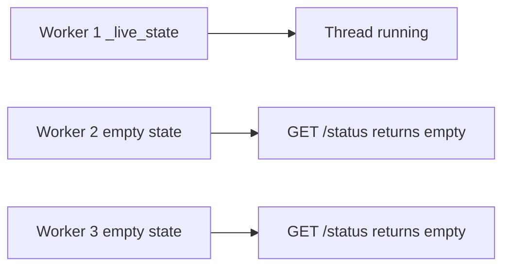
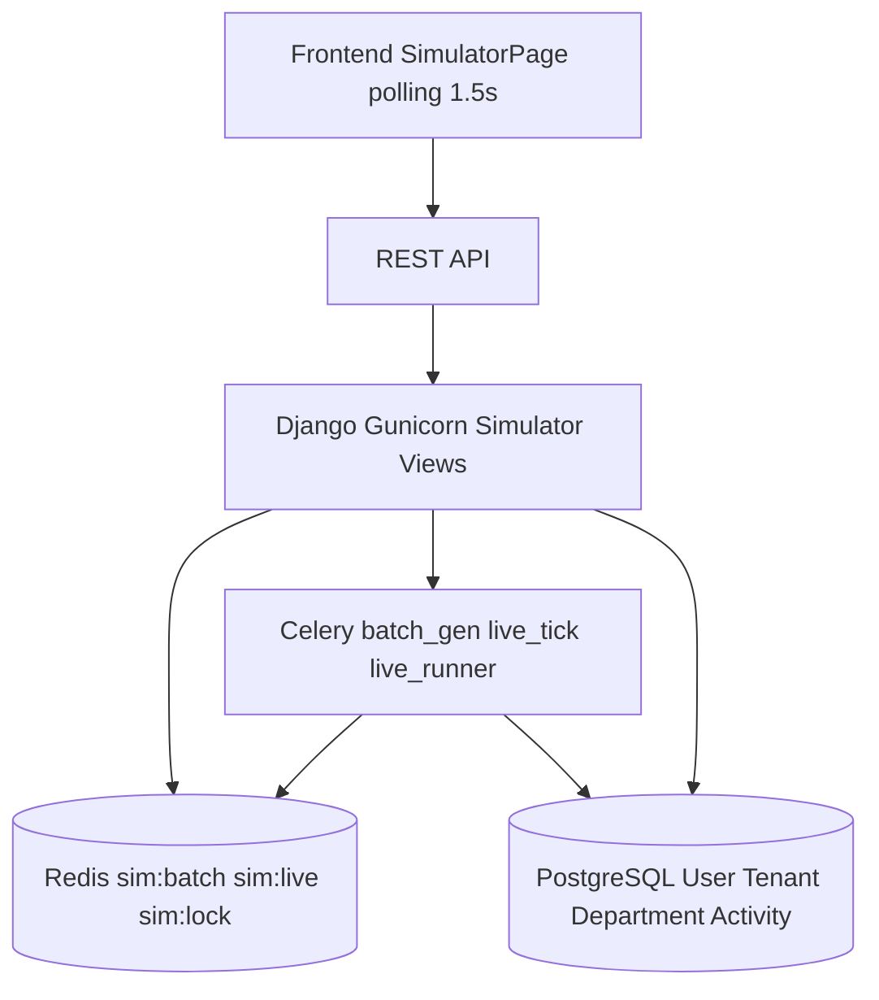
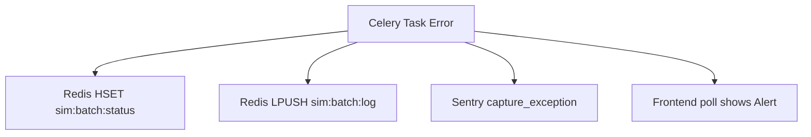

# Document

| | |
|--|--|
| **Status** | ✅ Active |
| **Owner role** | Documentation maintainer |
| **Last reviewed** | 2026-06-04 |
| **Audience** | Zobacz dokument kanoniczny |
| **lang** | pl |
| **translation** | [English](../SIMULATOR_ARCHITECTURE.md) |
| **canonical_path** | docs/pl/SIMULATOR_ARCHITECTURE.md |
---

| | |
|--|--|
| **Stan** | ✅Aktywny (wdrożony) |
| **Rola właściciela** | Główny backend |
| **Ostatnia recenzja** | 2026-06-03 |
| **Publiczność** | Zaplecze, operator platformy |

**Operacje (runbook):** [operations/SIMULATOR.md](../operations/SIMULATOR.md) — partia → live, env, BRouter, mapa.  
Dziesięć dokumentów = **spec** (API, klucze Redis, diagramy). §1 = stary model wątku (historycznie).

**Wersja:** 1.2 · **ADR:** [adr/010-simulator-redis-celery.md](./adr/010-simulator-redis-celery.md)

---

## Spis treści

1. [Aktualna architektura i analiza błędów](#1-bieżąca-architektura--analiza-błędów)
2. [Przegląd architektury docelowej](#2-przegląd architektury docelowej)
3. [Schemat klucza Redis] (schemat klucza Redis nr 3)
4. [Definicje zadania dotyczącego selera](#4-definicje zadania-selera)
5. [Projekt punktu końcowego API](#5-api-endpoint-design)
6. [Schematy przepływu danych](#6-diagramy przepływu danych)
7. [Strategia współbieżności i blokowania](#7-współbieżność-strategia blokowania)
8. [Strategia walidacji](#8-strategia-walidacji)
9. [Strategia obsługi błędów](#9-strategia-obsługi błędów)
10. [Poprawka odpytywania frontendu](#10-poprawka-pollingu frontendu)
11. [Lista kontrolna wdrożenia](#11-lista kontrolna wdrożenia)

---

## 1. Aktualna architektura i analiza błędów

### 1.1 Stan bieżący

Symulator obecnie wykorzystuje **wątkowość w procesie** z dwoma słownikami na poziomie modułu w [`backend/activities/admin_views.py`](../../backend/activities/admin_views.py:344):

| Dyktat stanowy | Linie | Cel |
|---|---|---|
| `_stan_symulacji` | [344–356](../../backend/activities/admin_views.py:344) | Stan generatora wsadowego (działa, log, flaga przerwania itp.) |
| `_stan_aktywności` | [415–432](../../backend/activities/admin_views.py:415) | Stan symulatora jazdy na żywo (pula_użytkowników, aktywne_przejażdżki, statystyki) |

Obydwa używają `threading.Lock()` ([357](../../backend/activities/admin_views.py:357), [433](../../backend/activities/admin_views.py:433)) do wzajemnego wykluczania w procesie.

Praca w tle jest wykonywana poprzez `threading.Thread(daemon=True)`:
- Partia: [`_run_simulation_in_background`](../../backend/activities/admin_views.py:369) powstała w [lini 879](../../backend/activities/admin_views.py:879)
- Na żywo: [`_live_simulation_thread`](../../backend/activities/admin_views.py:596) pojawił się w [lini 744](../../backend/activities/admin_views.py:744)

### 1.2 Wektory błędów będących przyczyną źródłową

#### Błąd 1: Niewidzialność stanu wielu pracowników



Każdy proces roboczy Gunicorn ma swój własny proces Pythona z własną kopią `_live_state` i `_simulation_state`. Wątek, który rozpoczął symulację, działa tylko w procesie roboczym, który obsługiwał operację POST. Wszyscy pozostali pracownicy widzą stan pusty. Frontend odpytuje `GET /live-simulate/` za pośrednictwem modułu równoważenia obciążenia (lub działania okrężnego) i zostaje przekierowany do innego procesu roboczego — otrzymując komunikat „running: false”, mimo że symulacja JEST uruchomiona.

#### Błąd 2: Brak sprawdzania pustych pul zawodników
W [`_live_simulation_thread`](../../backend/activities/admin_views.py:596), wierszu [615–617](../../backend/activities/admin_views.py:615):```python
user_ids = list(User.objects.filter(role='ATHLETE').values_list('id', flat=True)[:total_users])
if len(user_ids) < total_users:
    _live_log(f"WARNING: Only {len(user_ids)} athlete users available...")
```Spowoduje to jedynie zarejestrowanie ostrzeżenia, ale będzie kontynuowane. Pętla zaznaczająca w linii [624](../../backend/activities/admin_views.py:624) wywołuje funkcję `_live_tick()`, która w linii [551](../../backend/activities/admin_views.py:551) wykonuje `random.sample(pool, ...)` — jeśli `pula` jest pusta, pojawia się `ValueError: Próbka większa niż populacja lub jest negatywny”. Błąd zostaje wykryty w linii [632](../../backend/activities/admin_views.py:632), ale symulacja po cichu kończy się wraz z wpisem do dziennika.

#### Błąd 3: Odpytywanie frontonu nigdy nie uruchamia się ponownie po ponownym wejściu na kartę
W [`SimulatorPage.tsx`](../../admin/src/modules/analytics/SimulatorPage.tsx:44):```tsx
useEffect(() => {
    fetchLiveStatus();
    return () => { if (pollRef.current) clearInterval(pollRef.current); };
}, [fetchLiveStatus]);
```Efekt ten działa raz na wierzchowca. Funkcja czyszczenia czyści interwał. Kiedy użytkownik przełącza karty w przeglądarce, React nie odmontowuje/ponownie montuje — ALE jeśli przeglądarka zawiesi kartę i później ją przywróci, odstęp mógł zostać wyzerowany. Co ważniejsze, wywołanie zwrotne `fetchLiveStatus` w linii [41](../../admin/src/modules/analytics/SimulatorPage.tsx:41) zatrzymuje odpytywanie, gdy `!data.running`:```tsx
const fetchLiveStatus = useCallback(async () => {
    try {
        const { data } = await apiClient.get('/activities/admin/live-simulate/');
        setLiveStatus(data);
        if (!data.running && pollRef.current) {
            clearInterval(pollRef.current);
            pollRef.current = null;
        }
    } catch { }
}, []);
```Gdy użytkownik ponownie odwiedzi kartę po zakończeniu symulacji, parametr „data.running” ma wartość „false”, więc odpytywanie zostaje natychmiast zatrzymane — ale jeśli status był nieaktualny (inny proces roboczy zwrócił komunikat „uruchomiony: fałsz”), użytkownik widzi nieprawidłowy stan bez ścieżki do odzyskania.

#### Błąd 4: Kody stałe generatora wsadowego „skip_activities: true”.
W [`SimulatorPage.tsx`](../../admin/src/modules/analytics/SimulatorPage.tsx:67):```tsx
await apiClient.post('/activities/admin/simulate/', {
    total_users: userCount, days, clear: true, skip_activities: true
});
```Parametr „skip_activities” ma na stałe ustawioną wartość „true”. Oznacza to, że generator wsadowy tworzy tylko użytkowników i działy, ale nigdy nie generuje działań na podstawie śladów GPS. Nie ma kontroli interfejsu użytkownika umożliwiającej przełączanie generowania działań.

---

## 2. Przegląd architektury docelowej

### 2.1 Zasady projektowania

1. **Redis jako źródło prawdy** — Cały stan symulacji żyje w Redis. Każdy pracownik WSGI może go czytać/zapisywać.
2. **Seler do wykonywania asynchronicznego** — Zastępuje `threading.Thread` zarówno w przypadku symulacji wsadowej, jak i na żywo. Pracownicy selera to niezależne procesy, które zapisują bezpośrednio do Redis.
3. **Nakładka oparta na odpytywaniu (zachowaj prostotę)** — Napraw błąd ponownego uruchomienia odpytywania, zamiast wprowadzać złożoność protokołu WebSocket. Architektura obsługuje przyszłą aktualizację SSE/WebSocket.
4. **Weryfikacja przed wykonaniem** — Warunki wstępne sprawdzane PRZED pojawieniem się zadania Seler, a nie wewnątrz niego.
5. **Czysta separacja** — Generator wsadowy (użytkownicy + działy + działania) to jeden łańcuch zadań Celery. Symulator jazdy na żywo to okresowe zadanie Selera.

### 2.2 Schemat komponentów wysokiego poziomu



---

## 3. Schemat klucza Redis

### 3.1 Konwencja nazewnictwa kluczy

Wszystkie klawisze symulatora są zgodne ze wzorem:```
sim:{subsystem}:{entity}
```Użycie znacznika skrótu `{sim}` zapewnia skrót wszystkich kluczy symulatora do tego samego gniazda klastra Redis, umożliwiając w razie potrzeby niepodzielne operacje na wielu kluczach.

### 3.2 Klawisze symulacji wsadowej

| Klucz | Wpisz | TTL | Opis |
|---|---|---|---|
| `sim:partia:status` | Hash | Brak | Stan symulatora wsadowego |
| `sim:partia:log` | Lista | Brak | Wpisy dziennika bufora pierścieniowego (maks. 200) |
| `sim:partia:blokada` | Ciąg (blokada) | 3600s | Rozproszona blokada wykonywania wsadowego |

**`sim:batch:status` Pola mieszające:**

| Pole | Wpisz | Przykład | Opis |
|---|---|---|---|
| „bieganie” | bool | `"1"` | Czy symulacja wsadowa jest aktywna |
| `rozpoczął_o` | unosić się (epoka) | `"1715934400.123"` | Kiedy rozpoczęła się symulacja |
| `ukończono_o` | unosić się (epoka) | `"1715934800,456"` | Po zakończeniu symulacji (jeśli została wykonana) |
| „skala” | pływać | `"0,5"` | Zastosowany współczynnik skali |
| `dni` | int | `„30”` | Dni historii |
| `wszyscy_użytkownicy` | int | ``55000'` | Całkowita liczba żądanych użytkowników |
| `liczba_miast` | int | `"10"` | Liczba miast |
| „jasne” | bool | `"1"` | Czy dane zostały najpierw usunięte |
| `pomiń_aktywności` | bool | `"0"` | Czy generowanie działań jest pomijane |
| `błąd` | ciąg | `""` | Komunikat o błędzie w przypadku niepowodzenia |
| `faza_bieżąca` | ciąg | `„Faza 4: Tworzenie użytkowników”` | Opis fazy czytelny dla człowieka |
| `indeks_fazy` | int | ``4'` | Indeks fazy prądu (1-5) |
| `progres_pct` | pływać | ``45,2'` | Procent ukończenia (0-100) |
| `użytkownicy_utworzeni` | int | ``25000'` | Użytkownicy utworzeni do tej pory |
| `aktywności_utworzone` | int | `"0"` | Dotychczasowe działania |

**`sim:batch:log` Lista:**
- Lewy przycisk (LPUSH), przycięty do 200 wpisów (LTRIM)
- Każdy wpis jest ciągiem JSON: `["HH:MM:SS", "tekst wiadomości"]`
- Przykład: `["14:32:15", "Faza 4: utworzono 15000/55000 użytkowników"]`

### 3.3 Klawisze symulacji na żywo

| Klucz | Wpisz | TTL | Opis |
|---|---|---|---|
| `sim:na żywo:status` | Hash | Brak | Stan symulatora na żywo |
| `sim:live:config` | Hash | Brak | Niezmienna konfiguracja dla bieżącego uruchomienia |
| `sim:na żywo:basen` | Ustaw | Brak | Identyfikatory użytkowników w puli sportowców |
| `sim:na żywo:jazda` | Hash | Brak | Aktualnie aktywne przejazdy: `{user_id} → JSON` |
| `sim:na żywo:log` | Lista | Brak | Wpisy dziennika bufora pierścieniowego (maks. 300) |
| `sim:na żywo:blokada` | Ciąg (blokada) | 300. | Rozproszona blokada wykonywania znaczników na żywo |
| `sim:na żywo:przerwanie` | Ciąg | Brak | Flaga przerwania; ustaw na `"1"`, aby zażądać zatrzymania |

**`sim:live:status` Pola mieszające:**

| Pole | Wpisz | Przykład | Opis |
|---|---|---|---|
| „bieganie” | bool | `"1"` | Czy symulacja na żywo jest aktywna |
| `rozpoczął_o` | unosić się (epoka) | `"1715934400.123"` | Kiedy rozpoczęła się symulacja |
| `błąd` | ciąg | `""` | Komunikat o błędzie w przypadku awarii |
| `wszyscy_użytkownicy` | int | ``5000'' | Całkowita liczba użytkowników w puli |
| `aktualnie_jeżdżę` | int | ``1250'` | Użytkownicy obecnie w połowie jazdy |
| `całkowita_ukończona` | int | ``38420'` | Całkowita liczba ukończonych przejazdów we wszystkich znacznikach |
| `przyłapani_oszuści` | int | ``1921'' | Całkowita liczba utworzonych działań oszustów |
| `liczba_tyk` | int | ``42'` | Liczba wykonanych taktów |
| `last_tick_at` | unosić się (epoka) | `"1715934820.0"` | Kiedy ostatni tik przebiegł |

**`sim:live:config` Pola mieszające:**

| Pole | Wpisz | Przykład | Opis |
|---|---|---|---|
| `pula_pkt` | pływać | `„0,5”` | Procent wszystkich sportowców w basenie |
| `aktywny_współczynnik` | pływać | `"0,25"` | Procent basenu aktywnie jeżdżącego w dowolnym momencie |
| `współczynnik oszustw` | pływać | `„0,05”` | Procent przejazdów, które są oszustami |
| `tick_sekund` | int | `"10"` | Sekundy między znacznikami |
| `czas trwania_min` | int | `„300”` | Minimalny czas jazdy w sekundach |
| `czas_maks.` | int | ``3600'` | Maksymalny czas jazdy w sekundach |

**`sim:live:jazda` Pola skrótu:**
- Klucz = `user_id` (string), Wartość = obiekt JSON```json
{
    "start_time": "2026-05-17T14:32:15Z",
    "end_time": "2026-05-17T14:47:15Z",
    "act_type": "BIKE",
    "distance_m": 12500.0,
    "lat": 52.2297,
    "lon": 21.0122,
    "is_cheater": false
}
```### 3.4 TTL i strategia czyszczenia

- Wszystkie klucze pozostają aktywne, dopóki nie zostaną jawnie usunięte przez akcję przerwania lub zakończenia.
- Klucz `sim:batch:lock` ma TTL 3600 s, aby zapobiec zakleszczeniom — zadanie Seler odświeża go okresowo.
- Klawisz `sim:live:lock` ma TTL wynoszący 300 s — zadanie okresowe odzyskuje go po każdym taktowaniu.
- Po zakończeniu lub przerwaniu symulacji funkcja czyszczenia usuwa wszystkie klucze z przestrzeni nazw `sim:batch:*` lub `sim:live:*` (z wyjątkiem `sim:live:abort`, które również można usunąć).
- Skrypt Lua może atomowo sprawdzać i usuwać wszystkie powiązane klucze.

---

## 4. Definicje zadań związanych z selerem

### 4.1 Inwentarz zadań

Wszystkie zadania są rejestrowane w [`backend/activities/tasks.py`](../../backend/activities/tasks.py). Nowe zadania dodane poniżej istniejących.```python
# ---- Batch Simulation Tasks ----

@shared_task(
    bind=True,
    queue="simulation",           # dedicated queue to avoid starving critical tasks
    max_retries=0,                # no auto-retry; manual restart only
    name="activities.tasks.run_batch_simulation",
)
def run_batch_simulation(self, scale: float, days: int, clear: bool, 
                         skip_activities: bool, total_users: int = None,
                         num_cities: int = None) -> dict:
    ...


@shared_task(
    bind=True,
    queue="simulation",
    max_retries=0,
    name="activities.tasks.run_batch_phase",
)
def run_batch_phase(self, phase_index: int, config_json: str) -> dict:
    ...


# ---- Live Simulation Tasks ----

@shared_task(
    bind=True,
    queue="simulation",
    max_retries=3,
    default_retry_delay=5,
    name="activities.tasks.live_simulation_tick",
)
def live_simulation_tick(self) -> dict:
    ...


@shared_task(
    bind=True,
    queue="simulation",
    max_retries=0,
    name="activities.tasks.live_simulation_runner",
)
def live_simulation_runner(self) -> dict:
    ...
```### 4.2 Zadanie: `run_batch_simulation`

**Cel:** Punkt wejścia do symulacji wsadowej. Sprawdza warunki wstępne, ustawia początkowy stan Redis, a następnie łączy podzadania fazy.

**Przepływ:**
1. Uzyskaj rozproszoną blokadę `sim:batch:lock` (NX, TTL=3600s).
2. Sprawdź: nie ma uruchomionej partii (`sim:batch:status.running == "0"`).
3. Sprawdź: jeśli `clear=True`, potwierdź, że istnieje co najmniej jeden dzierżawca do wyczyszczenia.
4. Wpisz początkowy skrót `sim:batch:status`.
5. Wykonuj fazy symulacji sekwencyjnie (NIE można używać łańcucha Selera do postępu na żywo — patrz uwaga projektowa poniżej).
6. Po zakończeniu ustaw `running=0`, `completed_at`, `progress_pct=100`.
7. Zwolnij blokadę.

**Uwaga projektowa — dlaczego NIE łańcuszek z selera:**
Łańcuchy selera przekazują wyniki między zadaniami. W przypadku symulatora wsadowego każda faza musi zaktualizować Redis o postęp, aby frontend mógł odpytywać. Łańcuch wymagałby serializacji/deserializacji stanu symulacji. Zamiast tego zadanie uruchamia wszystkie fazy inline, ale po każdej fazie odczytuje/zapisuje postęp w Redis, umożliwiając monitorowanie postępu na żywo. Jest to dopuszczalne, ponieważ symulacja wsadowa jest pojedynczym, długotrwałym zadaniem, a nie wzorcem rozłożenia.

### 4.3 Zadanie: `live_simulation_tick`

**Cel:** Jedno kliknięcie symulatora jazdy na żywo — kończy wygasłe przejazdy i rozpoczyna nowe. Jest to podstawowa jednostka pracy.

**Warunki wstępne (sprawdzane przy każdym zaznaczeniu):**
1. `sim:live:abort` NIE jest ustawione na ``1''.
2. `sim:live:status.running` to ``1''.
3. `sim:live:pool` nie jest pusty (SCARD > 0).

**Przepływ:**
1. Uzyskaj blokadę `sim:live:lock` (NX, TTL=300s).
2. Przeczytaj skrót `sim:live:config` dla parametrów.
3. Przeczytaj skrót `sim:live:riding` — wszystkie aktywne przejazdy.
4. Przeczytaj zestaw `sim:live:pool` — basen sportowca.
5. **Faza A — Zakończ przejażdżki, które utraciły ważność:**
   - Powtórz `sim:live:jazda`. Dla każdego przejazdu, w którym „czas_końca <= teraz”:
     - Utwórz rekord „Aktywność” (ścieżka normalna lub oszukańcza).
     - HDEL z `sim:live:riding`.
     - Zwiększono wartości `total_completed` i `cheaters_caught` w `sim:live:status`.
6. **Faza B — Rozpocznij nowe przejazdy:**
   - Oblicz `target_riding = total_users * active_ratio`.
   - Oblicz `potrzebne = target_riding - current_riding_count`.
   - SRANDMEMBER z `sim:live:pool`, aby wybrać `potrzebnych` losowych użytkowników.
   - Dla każdego wybranego użytkownika wygeneruj parametry jazdy i HSET w `sim:live:riding`.
7. Dołącz wpis dziennika do `sim:live:log`.
8. Zaktualizuj `last_tick_at` i `tick_count` w `sim:live:status`.
9. Zwolnij blokadę.

**Docelowa wydajność:** Każde zaznaczenie powinno zakończyć się w czasie krótszym niż 2 sekundy w przypadku pul obejmujących do 10 000 użytkowników i 2500 użytkowników korzystających jednocześnie.

### 4.4 Zadanie: `live_simulation_runner`

**Cel:** Organizuje pętlę symulacji na żywo. Działa jako długotrwałe zadanie, które zgodnie z harmonogramem uruchamia „live_simulation_tick”.

**Przepływ:**
1. Sprawdź warunki wstępne (liczba zawodników, brak istniejącej symulacji na żywo).
2. Zbuduj `sim:live:pool` poprzez zapytanie `User.objects.filter(role='ATHLETE')` ograniczone przez `pool_pct`.
3. **WALIDACJA:** Jeśli `len(pool) < 10`, przerwij z błędem ``Za mało użytkowników-sportowców (wymaganych minimum 10)'`.
4. Wpisz `sim:live:config` i `sim:live:status`.
5. Pętla:
   - Zaznacz `sim:live:abort`. Jeśli ustawione, przerwa.
   - Wywołaj `live_simulation_tick.delay()` (asynchronicznie — NIE czeka).
   - Uśpij na `tick_sekundy` (podzielone na 1-sekundowe fragmenty w celu przerwania reakcji).
6. Oczyszczanie: usuń wszystkie klucze `sim:live:*`.

**Dlaczego biegacz tworzy kleszcze jako osobne zadania:**
Pozwala to uniknąć sytuacji, w której pojedyncze zadanie Selera przetrzymuje pracownika w nieskończoność. Każdy tik jest zadaniem krótkotrwałym. Jeśli zaznaczenie nie powiedzie się, biegacz może to wykryć (poprzez zaplecze wyników lub status Redis) i spróbować ponownie lub bezpiecznie przerwać.

---

## 5. Projekt punktu końcowego API

### 5.1 Macierz punktów końcowych

| Metoda | Ścieżka | Autoryzacja | Opis |
|---|---|---|---|
| `DOBIERZ` | `/api/activities/admin/simulate/` | Jest Rolą Administratora | Uzyskaj status symulacji wsadowej |
| `POST` | `/api/activities/admin/simulate/` | Jest Rolą Administratora | Rozpocznij symulację wsadową |
| `USUŃ` | `/api/activities/admin/simulate/` | Jest Rolą Administratora | Przerwij symulację wsadową |
| `DOBIERZ` | `/api/activities/admin/live-simulate/` | Jest Rolą Administratora | Uzyskaj status symulacji na żywo |
| `POST` | `/api/activities/admin/live-simulate/` | Jest Rolą Administratora | Rozpocznij symulację na żywo |
| `USUŃ` | `/api/activities/admin/live-simulate/` | Jest Rolą Administratora | Przerwij symulację na żywo |
| `DOBIERZ` | `/api/activities/admin/simulate/validate/` | Jest Rolą Administratora | Kontrole sprawdzające przed lotem |

### 5.2 Specyfikacje punktu końcowego

#### `POBIERZ /api/activities/admin/simulate/`
Odczytuje wszystkie pola z skrótu `sim:batch:status` i zwraca je jako JSON. Zawsze kończy się sukcesem — jeśli nigdy nie przeprowadzono żadnej symulacji, zwraca „bieganie: fałsz”, gdy wszystkie liczniki są na zero.**Reakcja (bieganie):**```json
{
    "running": true,
    "elapsed_seconds": 124.5,
    "scale": 0.5,
    "days": 30,
    "total_users": 55000,
    "num_cities": 10,
    "clear": true,
    "skip_activities": false,
    "current_phase": "Phase 4: Creating users",
    "phase_index": 4,
    "progress_pct": 45.2,
    "users_created": 25000,
    "activities_created": 0,
    "error": null,
    "log": [["14:30:00", "Simulation starting..."], ...]
}
```#### `POST /api/activities/admin/simulate/`
Sprawdza poprawność danych wejściowych, sprawdza istniejącą symulację, a następnie uruchamia `run_batch_simulation.delay(...)`.

**Treść żądania:**```json
{
    "scale": 0.5,
    "days": 30,
    "clear": true,
    "skip_activities": false,
    "total_users": null,
    "num_cities": null
}
```**Zasady walidacji:**
- `scale` musi wynosić 0,001–1,0 (chyba że podano `total_users`)
- „dni” muszą wynosić 1–365
- `total_users` (opcjonalnie): 10–1 000 000
- `num_cities` (opcjonalnie): 1–100
- Nie można uruchomić, jeśli `sim:batch:status.running == "1"`
- Jeśli `clear=true`, należy potwierdzić (punkt końcowy sprawdza flagę)

**Odpowiedź (202 zaakceptowanych):**```json
{
    "status": "started",
    "task_id": "abc123-def456",
    "running": true,
    "scale": 0.5,
    "days": 30,
    "clear": true,
    "message": "Batch simulation started. Monitor via GET /simulate/"
}
```**Odpowiedź (409 Konflikt):**```json
{
    "error": "Batch simulation already running (124s elapsed)",
    "running": true,
    "elapsed_seconds": 124.5
}
```#### `USUŃ /api/activities/admin/simulate/`
Ustawia flagę przerwania. Uruchomione zadanie Celery sprawdza tę flagę pomiędzy fazami.

**Odpowiedź:**```json
{
    "status": "abort_requested",
    "message": "Simulation will stop at the next checkpoint."
}
```#### `POBIERZ /api/activities/admin/live-simulate/`
Odczytuje wszystkie pola z `sim:live:status`, `sim:live:config` i zwraca migawkę dziennika.

**Odpowiedź:**```json
{
    "running": true,
    "elapsed_seconds": 420.0,
    "error": null,
    "total_users": 5000,
    "active_ratio": 0.25,
    "cheat_ratio": 0.05,
    "tick_seconds": 10,
    "currently_riding": 1250,
    "total_completed": 38420,
    "cheaters_caught": 1921,
    "tick_count": 42,
    "log": [["14:30:00", "LIVE SIMULATION: 5000 users..."], ...]
}
```#### `POST /api/activities/admin/live-simulate/`
Sprawdza wprowadzone dane, sprawdza przed lotem, następnie uruchamia `live_simulation_runner.delay(...)`.

**Treść żądania:**```json
{
    "pool_pct": 0.5,
    "active_ratio": 0.25,
    "cheat_ratio": 0.05,
    "tick_seconds": 10
}
```**Weryfikacja przed lotem (wykonywana synchronicznie przed pojawieniem się selera):**
1. „pool_pct” musi wynosić 0,01–1,0
2. „aktywny współczynnik” musi wynosić 0,01–1,0
3. `cheat_ratio` musi wynosić 0,0–1,0
4. „tick_sekund” musi wynosić 2–300
5. `User.objects.filter(role='ATHLETE').count()` musi zwrócić >= 10
6. `sim:live:status.running` NIE może mieć wartości ``1''

**Odpowiedź (202 zaakceptowanych):**```json
{
    "status": "started",
    "task_id": "def789-ghi012",
    "running": true,
    "total_users": 5000,
    "pool_pct": 0.5,
    "active_ratio": 0.25,
    "cheat_ratio": 0.05,
    "tick_seconds": 10,
    "message": "Live simulation: 5000 users, 25% active, 5% cheaters"
}
```#### `USUŃ /api/activities/admin/live-simulate/`
Ustawia `sim:live:abort = "1"`. Pętla runner sprawdza tę flagę.

#### `POBIERZ /api/activities/admin/simulate/validate/`
Zwraca wyniki sprawdzania poprawności przed lotem bez uruchamiania czegokolwiek.

**Odpowiedź:**```json
{
    "total_athletes": 110000,
    "total_tenants": 10,
    "total_departments": 1870,
    "can_run_batch": true,
    "can_run_live": true,
    "warnings": [],
    "recommendations": {
        "max_users_for_live": 110000,
        "suggested_pool_pct": 0.5,
        "estimated_ticks_per_minute": 6
    }
}
```---

## 6. Diagramy przepływu danych

### 6.1 Przebieg symulacji wsadowej```mermaid
sequenceDiagram
    participant FE as Frontend (SimulatorPage)
    participant API as Django WSGI
    participant Redis
    participant Celery as Celery Worker
    participant DB as PostgreSQL

    FE->>API: POST /simulate/ {scale, days, clear, skip_activities}
    API->>Redis: EXISTS sim:batch:status
    Redis-->>API: (not running)

    Note over API: Validate params
    
    API->>Redis: HSET sim:batch:status running=1 scale=0.5 ...
    API->>Celery: run_batch_simulation.delay(scale=0.5, ...)
    API-->>FE: 202 {status: started, task_id}

    Celery->>Redis: SET sim:batch:lock NX EX 3600
    Celery->>Redis: HSET sim:batch:status current_phase=1 progress_pct=0

    loop Poll every 2s
        FE->>API: GET /simulate/
        API->>Redis: HGETALL sim:batch:status + LRANGE sim:batch:log
        Redis-->>API: {running:1, phase_index:4, progress_pct:45.2, ...}
        API-->>FE: status JSON
    end

    Celery->>DB: Phase 1: Create Tenants
    Celery->>Redis: HSET progress_pct=10 current_phase="Phase 2"
    Celery->>DB: Phase 2: Create Admins
    Celery->>Redis: HSET progress_pct=20 current_phase="Phase 3"
    Celery->>DB: Phase 3: Create Departments
    Celery->>Redis: HSET progress_pct=30 current_phase="Phase 4"
    Celery->>DB: Phase 4: Create Users (bulk)
    Celery->>Redis: HSET progress_pct=70 users_created=N

    alt skip_activities == false
        Celery->>DB: Phase 5: Create Activities (bulk)
        Celery->>Redis: HSET progress_pct=95 activities_created=M
    end

    Celery->>Redis: HSET running=0 completed_at=now progress_pct=100
    Celery->>Redis: DEL sim:batch:lock

    FE->>API: GET /simulate/
    API->>Redis: HGETALL sim:batch:status
    Redis-->>API: {running:0, progress_pct:100}
    API-->>FE: Complete! Polling stops.
```### 6.2 Przebieg symulacji na żywo```mermaid
sequenceDiagram
    participant FE as Frontend (SimulatorPage)
    participant API as Django WSGI
    participant Redis
    participant CeleryR as Celery Runner
    participant CeleryT as Celery Tick
    participant DB as PostgreSQL

    FE->>API: POST /live-simulate/ {pool_pct, active_ratio, cheat_ratio, tick_seconds}
    API->>DB: COUNT users WHERE role='ATHLETE'
    DB-->>API: 5000 athletes

    Note over API: Validate: 5000 >= 10 ✓

    API->>CeleryR: live_simulation_runner.delay(params)
    API-->>FE: 202 {status: started}

    CeleryR->>DB: SELECT id FROM users WHERE role='ATHLETE' LIMIT 5000
    DB-->>CeleryR: [id1, id2, ..., id5000]
    CeleryR->>Redis: SADD sim:live:pool id1 id2 ... id5000
    CeleryR->>Redis: HSET sim:live:config pool_pct=0.5 ...
    CeleryR->>Redis: HSET sim:live:status running=1

    loop Every tick_seconds
        CeleryR->>Redis: GET sim:live:abort
        alt abort == "1"
            CeleryR->>Redis: HSET sim:live:status running=0
            CeleryR->>Redis: DEL sim:live:*
            Note over CeleryR: Exit loop
        end

        CeleryR->>CeleryT: live_simulation_tick.delay()

        CeleryT->>Redis: SET sim:live:lock NX EX 300
        CeleryT->>Redis: HGETALL sim:live:riding
        Redis-->>CeleryT: {user123: {...ride...}, ...}

        Note over CeleryT: Phase A: Finish expired rides
        loop For each expired ride
            CeleryT->>DB: INSERT Activity (bulk_create)
            CeleryT->>Redis: HDEL sim:live:riding {user_id}
            CeleryT->>Redis: HINCRBY total_completed
        end

        Note over CeleryT: Phase B: Start new rides
        CeleryT->>Redis: SRANDMEMBER sim:live:pool {needed}
        loop For each new rider
            CeleryT->>Redis: HSET sim:live:riding {user_id} {...}
        end

        CeleryT->>Redis: LPUSH sim:live:log "[time] Tick: ..."
        CeleryT->>Redis: LTRIM sim:live:log 0 299
        CeleryT->>Redis: HSET sim:live:status tick_count+=1 last_tick_at=now
        CeleryT->>Redis: DEL sim:live:lock

        CeleryR->>CeleryR: sleep(tick_seconds) in 1s chunks
    end

    par Frontend Polling (every 1.5s)
        loop
            FE->>API: GET /live-simulate/
            API->>Redis: HGETALL sim:live:status + LRANGE sim:live:log
            Redis-->>API: {running:1, currently_riding:1250, ...}
            API-->>FE: status JSON
            FE->>FE: Update UI stats + log
        end
    end
```### 6.3 Przerwij przepływ (wsadowy i na żywo)```mermaid
sequenceDiagram
    participant FE as Frontend
    participant API as Django WSGI
    participant Redis
    participant Celery as Celery Worker
    participant DB as PostgreSQL

    FE->>API: DELETE /live-simulate/
    API->>Redis: GET sim:live:status.running
    Redis-->>API: "1" (running)
    API->>Redis: SET sim:live:abort "1"
    API-->>FE: 200 {status: abort_requested}

    Note over Celery: Runner checks sim:live:abort between ticks

    Celery->>Redis: GET sim:live:abort
    Redis-->>Celery: "1"

    Note over Celery: Stop accepting new ticks.
    Note over Celery: Wait for current tick to finish.

    Celery->>Redis: GET sim:live:riding
    Redis-->>Celery: {} (or remaining rides)

    opt Drain remaining rides (graceful)
        Celery->>DB: INSERT Activities for any riding users
    end

    Celery->>Redis: HSET sim:live:status running=0 error="Aborted by user"
    Celery->>Redis: DEL sim:live:pool sim:live:config sim:live:abort
    Note over Redis: Keep sim:live:status and sim:live:log for inspection

    FE->>API: GET /live-simulate/
    API->>Redis: HGETALL sim:live:status
    Redis-->>API: {running:0, error:"Aborted by user"}
    API-->>FE: Stopped. Show final stats.
```### 6.4 Pełna architektura systemu```mermaid
graph TB
    subgraph "Frontend Layer"
        FE[SimulatorPage.tsx]
        Polling[Polling Hook<br/>useSimulatorPoll]
    end

    subgraph "API Layer (Stateless WSGI)"
        BatchView[RunSimulationView]
        LiveView[LiveSimulationView]
        ValidView[ValidationView]
    end

    subgraph "Redis Cluster"
        BatchStatus[sim:batch:status<br/>Hash]
        BatchLog[sim:batch:log<br/>List]
        BatchLock[sim:batch:lock<br/>String]
        LiveStatus[sim:live:status<br/>Hash]
        LiveConfig[sim:live:config<br/>Hash]
        LivePool[sim:live:pool<br/>Set]
        LiveRiding[sim:live:riding<br/>Hash]
        LiveLog[sim:live:log<br/>List]
        LiveLock[sim:live:lock<br/>String]
        LiveAbort[sim:live:abort<br/>String]
    end

    subgraph "Celery Workers"
        BatchTask[run_batch_simulation]
        LiveRunner[live_simulation_runner]
        LiveTick[live_simulation_tick]
    end

    subgraph "PostgreSQL"
        Users[(User)]
        Tenants[(Tenant)]
        Departments[(Department)]
        Activities[(Activity)]
    end

    FE --> Polling
    Polling -->|GET /simulate/| BatchView
    Polling -->|GET /live-simulate/| LiveView
    FE -->|POST /simulate/| BatchView
    FE -->|POST /live-simulate/| LiveView
    FE -->|DELETE /simulate/| BatchView
    FE -->|DELETE /live-simulate/| LiveView
    FE -->|GET /validate/| ValidView

    BatchView --> BatchStatus
    BatchView --> BatchLog
    BatchView --> BatchLock
    LiveView --> LiveStatus
    LiveView --> LiveConfig
    LiveView --> LiveLog
    ValidView --> Users

    BatchView -.->|spawns| BatchTask
    LiveView -.->|spawns| LiveRunner

    BatchTask --> BatchLock
    BatchTask --> BatchStatus
    BatchTask --> BatchLog
    BatchTask --> Users
    BatchTask --> Tenants
    BatchTask --> Departments
    BatchTask --> Activities

    LiveRunner --> LiveAbort
    LiveRunner --> LivePool
    LiveRunner --> LiveStatus
    LiveRunner --> LiveConfig
    LiveRunner -.->|spawns| LiveTick

    LiveTick --> LiveLock
    LiveTick --> LiveRiding
    LiveTick --> LivePool
    LiveTick --> LiveStatus
    LiveTick --> LiveLog
    LiveTick --> Activities
```---

## 7. Strategia współbieżności i blokowania

### 7.1 Typy zamków

| Klucz blokady | Wpisz | Uchwyt | TTL | Cel |
|---|---|---|---|---|
| `sim:partia:blokada` | Ciąg Redis (NX) | Zadanie `run_batch_simulation` | 3600s | Zapobiegaj jednoczesnym symulacjom wsadowym |
| `sim:na żywo:blokada` | Ciąg Redis (NX) | Zadanie `live_simulation_tick` | 300. | Zapobiegaj równoczesnemu wykonywaniu znaczników |

### 7.2 Implementacja blokady

Używanie Redis `SET wartości klucza NX EX ttl` (pozyskiwanie atomowe):```python
def acquire_lock(redis_client, lock_key: str, ttl: int) -> bool:
    """Returns True if lock was acquired."""
    return bool(redis_client.set(lock_key, "1", nx=True, ex=ttl))

def release_lock(redis_client, lock_key: str):
    """Release the lock. Safe to call even if not held."""
    redis_client.delete(lock_key)
```### 7.3 Współbieżność symulacji wsadowej

- **W danym momencie może być uruchomiona tylko jedna symulacja wsadowa.** Punkt końcowy `POST /simulate/` sprawdza `sim:batch:status.running` przed utworzeniem zadania. Zadanie otrzymuje również `sim:batch:lock` jako siatkę bezpieczeństwa.
- **Odświeżanie blokady:** Zadanie wsadowe powinno mieć wartość „WAŻNOŚĆ sim:batch:lock 3600” po każdej fazie, aby zapobiec wygaśnięciu blokady podczas długotrwałych faz.
- **Osierocone zamki:** TTL 3600s gwarantuje, że rozbity pracownik Selera nie blokuje trwale przyszłych symulacji.

### 7.4 Współbieżność symulacji na żywo

- **W danym momencie może działać tylko jedna symulacja na żywo.** Punkt końcowy `POST /live-simulate/` sprawdza `sim:live:status.running`.
- **W danym momencie wykonywany jest tylko jeden tik.** `live_simulation_tick` pobiera `sim:live:lock` przed odczytaniem/zapisaniem `sim:live:riding`.
- ** Biegacz NIE trzyma blokady. ** Biegacz po prostu tworzy zadania związane z kleszczami i śpi. Pozwala to uniknąć długotrwałego zamka.
- **Limit czasu zaznaczenia:** Jeśli zaznaczenie trwa dłużej niż 300 s, blokada wygasa i można przystąpić do następnego zaznaczenia. Zablokowany zaznaczenie samoczynnie ulegnie awarii (jego nabycie blokady wygaśnie) i można je wykryć poprzez monitorowanie.

### 7.5 Dlaczego NIE Redlock

W tym przypadku wystarczy pojedyncza blokada instancji Redis (SET NX):
— Nie koordynujemy działań w niezależnych klastrach Redis.
- Konsekwencją podziału mózgu (dwa znaczniki działające jednocześnie) są duplikaty działań, a nie uszkodzenie danych. Ograniczenia unikalności PostgreSQL zapobiegają całkowitemu chaosowi.
— Redlock (kworum wielowęzłowe) dodaje tutaj opóźnienia w celu uzyskania marginalnego zwiększenia bezpieczeństwa.

### 7.6 Gwarancje atomowości

**Krytyczny: scenariusz Wyczyść + Uruchom ponownie.** Gdy użytkownik kliknie „Wyczyść wszystkie dane”, a następnie rozpocznie symulację, musimy upewnić się, że czyszczenie zakończy się przed wysłaniem zapytań symulacyjnych do użytkowników. Jest to egzekwowane przez:

1. `WipeDataView` w [`/api/activities/admin/wipe-data/`](../../backend/activities/admin_views.py:762) wykonuje się synchronicznie (czeka na usunięcie bazy danych).
2. Punkt końcowy `POST /simulate/` jest wywoływany PO powrocie odpowiedzi na czyszczenie.
3. Zadanie Seler ponownie wysyła zapytanie do bazy danych, która w tym momencie będzie pusta.

Nie jest do tego potrzebna żadna koordynacja Redis; cykl żądania/odpowiedzi HTTP zapewnia gwarancję zamówienia.

---

## 8. Strategia walidacji

### 8.1 Walidacja przed lotem (synchroniczna, przed zaszczepieniem selera)

Te kontrole mają miejsce w widoku Django PRZED wywołaniem `.delay()`:

| Sprawdź | Punkt końcowy | Odpowiedź na błąd |
|---|---|---|
| `pool_pct` w zakresie 0,01–1,0 | POST /symulacja na żywo/ | 400: „pool_pct musi wynosić 0,01–1,0” |
| `aktywny_współczynnik` w zakresie 0,01–1,0 | POST /symulacja na żywo/ | 400: „aktywny współczynnik musi wynosić 0,01–1,0” |
| `cheat_ratio` w zakresie 0,0–1,0 | POST /symulacja na żywo/ | 400: „cheat_ratio musi wynosić 0,0–1,0” |
| `tick_sekund` w zakresie 2–300 | POST /symulacja na żywo/ | 400: „tick_sekund musi wynosić 2–300” |
| `skala` w zakresie 0,001–1,0 | POST /symuluj/ | 400: „skala musi wynosić 0,001–1,0” |
| `dni` w zakresie 1–365 | POST /symuluj/ | 400: „dni muszą wynosić 1–365” |
| Brak istniejącej partii działającej | POST /symuluj/ | 409: „Symulacja wsadowa już działa” |
| Brak istniejących transmisji na żywo | POST /symulacja na żywo/ | 409: „Symulacja na żywo już działa” |
| Liczba zawodników >= 10 | POST /symulacja na żywo/ | 400: „Potrzebujesz co najmniej 10 użytkowników-sportowców. Najpierw uruchom generator wsadowy”. |
| Liczba sportowców > 0 | POST /simulate/ (jeśli skip_activities=false) | 400: „Nie ma żadnych sportowców. Najpierw biegnij z skip_activities=true.” |

### 8.2 Walidacja środowiska wykonawczego (zadanie wewnątrz selera)

Te kontrole odbywają się wewnątrz zadania po jego uruchomieniu:

| Sprawdź | Lokalizacja | Zachowanie |
|---|---|---|
| Pozyskanie blokady nie powiodło się | `run_batch_symulacja` | Zwróć błąd, nie wykonuj |
| Pozyskanie blokady nie powiodło się | `live_simulation_tick` | Pomiń zaznaczenie (działa inny znacznik), zwróć `{"pominięte": prawda}` |
| Pula pusta (SCARD=0) | `live_simulation_tick` | Zapisz ostrzeżenie, pomiń fazę B (brak nowych przejazdów), kontynuuj kończenie istniejących przejazdów |
| Wszystkie przejażdżki zakończone, a basen pusty | `live_simulation_tick` | Ustaw `running=0`, zapisz „Nie ma już zawodników — symulacja zakończona” |
| Wykryto flagę przerwania | `live_simulation_runner` | Przerwij pętlę, opróżnij pozostałe przejażdżki, posprzątaj |

### 8.3 Punkt końcowy walidacji skierowany do użytkownika

`GET /api/activities/admin/simulate/validate/` zapewnia kontrolę stanu, zanim użytkownik przystąpi do symulacji. Jest to wywoływane przez interfejs użytkownika podczas ładowania strony w celu wyświetlenia dostępnych zasobów.

---

## 9. Strategia obsługi błędów

### 9.1 Kategorie błędów| Kategoria | Przykład | Strategia |
|---|---|---|
| **Weryfikacja danych wejściowych** | `skala=5,0` | 400 odpowiedzi z widoku, nigdy nie dociera do Selera |
| **Zasób niedostępny** | Odmowa połączenia Redis | Odpowiedź 503 z widoku, alert dotyczący kontroli stanu |
| **Warunek wstępny nie powiódł się** | Nie ma sportowców | 400 odpowiedzi z widoku, z komunikatem, który można zastosować |
| **Błąd uruchomienia zadania** | Broker selera nieosiągalny | 500 z widoku, administrator widzi powiadomienie o błędzie |
| **Błąd bazy danych w połowie zadania** | Zakleszczenie PostgreSQL | Złap zadanie, zarejestruj błąd, ustaw pole `error` w Redis, ustaw `running=0` |
| **Błąd Redis w połowie zadania** | Redis OOM | Złap zadanie, ustaw `błąd`, spróbuj z gracją zatrzymać |
| **Osierocony zamek** | Zabity pracownik selera | TTL wygasa automatycznie, nie jest wymagana ręczna interwencja |
| **Zaznacz limit czasu** | Zaznaczenie trwa > 300 s | Blokada wygasa, następny tik działa niezależnie, praca zatrzymanego ticka może zostać zduplikowana |

### 9.2 Przebieg propagacji błędów



### 9.3 Łagodna degradacja

- **Jeśli Redis nie działa:** Widoki API zwracają 503 z `{"errorem": "Redis niedostępny", "retry_after": 5}`. Frontend wyświetla baner błędu i próbuje ponownie po 5 sekundach.
- **Jeśli Celery nie działa:** Punkt końcowy POST wykonuje próbę `.delay()`, przechwytuje błąd połączenia z brokerem i zwraca 500 z komunikatem `{"error": "Kolejka zadań niedostępna. Spróbuj ponownie za chwilę."}`.
- **Jeśli PostgreSQL nie działa:** Zadanie Celery wyłapuje błąd „OperationalError”, ustawia błąd w Redis i kończy pracę. Bieżąca symulacja zostaje skutecznie wstrzymana do czasu przywrócenia DB — przejażdżki w trybie „sim:live:riding” zostaną zakończone w następnym pomyślnym taktowaniu.

### 9.4 Haki monitorujące

Istniejąca infrastruktura „activities.tasks” obejmuje przechwytywanie błędów Sentry. Rozszerzamy to o:```python
# In each simulator Celery task
from core.sentry import capture_exception

try:
    # ... simulation logic
except Exception as e:
    capture_exception(e)
    update_redis_error(str(e))
    raise  # Celery will mark task as failed
```---

## 10. Poprawka dotycząca odpytywania frontonu

### 10.1 Błąd

W [`SimulatorPage.tsx`](../../admin/src/modules/analytics/SimulatorPage.tsx:44) element `useEffect` zarządzający odpytywaniem jest uruchamiany raz na zamontowaniu. Gdy użytkownik przełącza karty przeglądarki i wraca lub gdy interfejs API zwraca komunikat „running: false” (z powodu przestarzałego procesu roboczego), odpytywanie zostaje zatrzymane i nigdy nie jest uruchamiane ponownie.

### Poprawka 10.2: Solidny hak do odpytywania

Zamień obecną logikę odpytywania na hak uwzględniający widoczność:```tsx
// New hook: useSimulatorPoll
function useSimulatorPoll(endpoint: string, intervalMs: number) {
    const [status, setStatus] = useState<LiveStatus | null>(null);
    const [lastFetch, setLastFetch] = useState<number>(0);
    const timerRef = useRef<ReturnType<typeof setInterval> | null>(null);

    const fetchStatus = useCallback(async () => {
        try {
            const { data } = await apiClient.get(endpoint);
            setStatus(data);
            setLastFetch(Date.now());
        } catch {
            // Silently retry on next interval
        }
    }, [endpoint]);

    // Start/restart polling
    const startPolling = useCallback(() => {
        if (timerRef.current) clearInterval(timerRef.current);
        fetchStatus(); // immediate fetch
        timerRef.current = setInterval(fetchStatus, intervalMs);
    }, [fetchStatus, intervalMs]);

    // Stop polling
    const stopPolling = useCallback(() => {
        if (timerRef.current) {
            clearInterval(timerRef.current);
            timerRef.current = null;
        }
    }, []);

    // Page Visibility API — restart polling on tab revisit
    useEffect(() => {
        const handleVisibility = () => {
            if (document.visibilityState === 'visible') {
                // Re-fetch immediately and resume polling
                fetchStatus();
                if (!timerRef.current) {
                    timerRef.current = setInterval(fetchStatus, intervalMs);
                }
            }
        };
        document.addEventListener('visibilitychange', handleVisibility);
        return () => {
            document.removeEventListener('visibilitychange', handleVisibility);
            stopPolling();
        };
    }, [fetchStatus, intervalMs, stopPolling]);

    return { status, startPolling, stopPolling, lastFetch };
}
```**Kluczowe ulepszenia:**
1. **Lucher API widoczności** (`document.visibilitychange`) — wznawia odpytywanie, gdy użytkownik wróci do zakładki.
2. **Odpytywanie nigdy nie zatrzymuje się automatycznie** w zależności od statusu „uruchomione”. Interwał trwa do momentu, aż użytkownik opuści go lub wyraźnie go zatrzyma. Interfejs użytkownika wyświetla komunikat „Complete”, gdy „uruchom: false”, ale odpytywanie jest kontynuowane, więc zostaje wznowione, jeśli rozpocznie się nowa symulacja.
3. Funkcje **Ręcznego uruchamiania/zatrzymywania** udostępniają kontrolę komponentowi.
4. **Natychmiastowe ponowne pobranie** po przywróceniu widoczności, zanim nastąpi przerwa.

### 10.3 Zaktualizowano integrację ze stroną SimulatorPage```tsx
export const SimulatorPage: React.FC = () => {
    const { status: liveStatus, startPolling, stopPolling } = useSimulatorPoll(
        '/activities/admin/live-simulate/', 1500
    );

    const handleLiveStart = async () => {
        // ... POST to start simulation ...
        startPolling(); // Start polling after successful POST
    };

    const handleLiveAbort = async () => {
        // ... DELETE to abort ...
        // Polling continues — it will pick up running=false
    };

    // Polling continues even when simulation ends.
    // The UI shows "Complete" state when !running && elapsed > 0.
};
```---

## 11. Lista kontrolna wdrożenia

> **Stan na dzień 2026-06-02:** Fazy 1–4 **zrobione** w `backend/activities/simulator_state.py`, `simulator_tasks.py`, `admin_views.py`, `SimulatorPage.tsx`, `LiveMap.tsx`. Operacje: [operations/SIMULATOR.md](../operations/SIMULATOR.md). ADR: [010](./adr/010-simulator-redis-celery.md).  
> następująca lista jest **historycznym planem** z czasu życiowego.

### Faza 1: Warstwa stanu Redis
- [x] `backend/activities/simulator_state.py` — stan wsadowy/aktywny, blokady, pule
- [ ] Utwórz moduł `backend/core/simulator_state.py` za pomocą:
  - Klasa `BatchSimState` (odczytuje/zapisuje klucze `sim:batch:*`)
  - Klasa `LiveSimState` (odczytuje/zapisuje klucze `sim:live:*`)
  - Menedżer kontekstu `SimulatorLock` do blokowania rozproszonego
  - Pomocnik `format_log_entry(ts, msg)`
- [ ] Napisz testy jednostkowe dla wszystkich operacji stanu Redis

### Faza 2: Zadania związane z selerem
- [ ] Dodaj zadanie `run_batch_simulation` do [`backend/activities/tasks.py`](../../backend/activities/tasks.py)
- [ ] Dodaj zadanie `live_simulation_tick` do [`backend/activities/tasks.py`](../../backend/activities/tasks.py)
- [ ] Dodaj zadanie `live_simulation_runner` do [`backend/activities/tasks.py`](../../backend/activities/tasks.py)
- [ ] Dodano kolejkę `symulacji` do konfiguracji Celery
- [ ] Napisz testy integracyjne dla zadań z prawdziwą instancją Redis

### Faza 3: Punkty końcowe interfejsu API
- [ ] Przepisz `RunSimulationView` w [`backend/activities/admin_views.py`](../../backend/activities/admin_views.py:823), aby używać Redis + Seler
- [ ] Przepisz `LiveSimulationView` w [`backend/activities/admin_views.py`](../../backend/activities/admin_views.py:686), aby używać Redis + Seler
- [ ] Dodaj `SimulationValidateView` do kontroli przed lotem
- [ ] Usuń globale `_simulation_state`, `_live_state`, `_sim_lock`, `_live_lock`
- [ ] Usuń `_run_simulation_in_background`, `_live_tick`, `_live_simulation_thread`, `_generate_live_legacy_batch`
- [ ] Usuń opcję „importuj wątki” (jeśli nie są już używane gdzie indziej)

### Faza 4: Poprawki frontonu
- [ ] Przepisz [`SimulatorPage.tsx`](../../admin/src/modules/analytics/SimulatorPage.tsx) za pomocą haka `useSimulatorPoll`
- [ ] Dodaj ponowne uruchomienie odpytywania na podstawie widoczności
- [ ] Dodaj przełącznik „skip_activities” na karcie Kontroli wsadowej
- [ ] Dodaj wywołanie sprawdzające przed lotem na stronie montowanej (`GET /validate/`)
- [ ] Dodano obsługę stanu błędu dla 503 (Redis w dół), 500 (Seler w dół)
- [ ] Wyłącz przycisk „Rozpocznij na żywo”, gdy liczba zawodników < 10 (od punktu końcowego walidacji)

### Faza 5: Dokumentacja i testowanie
- [ ] Aktualizacja [`CHANGELOG.md`](../../CHANGELOG.md) wraz ze zmianą architektury
- [ ] Napisz ręczny plan testów dla symulatora z konfiguracją wieloosobową
- [ ] Zweryfikuj czyszczenie i symulację przepływu pracy od początku do końca
- [ ] Sprawdź zachowanie przerwania zarówno w trybie wsadowym, jak i aktywnym

---

## Dodatek A: Karta referencyjna klucza Redis```
# Batch Simulation
sim:batch:status    Hash    {running, started_at, completed_at, scale, days,
                             total_users, num_cities, clear, skip_activities,
                             error, current_phase, phase_index, progress_pct,
                             users_created, activities_created}
sim:batch:log       List    [json_array_of_timestamp_and_message]
sim:batch:lock      String  "1" (with TTL 3600)

# Live Simulation
sim:live:status     Hash    {running, started_at, error, total_users,
                             currently_riding, total_completed,
                             cheaters_caught, tick_count, last_tick_at}
sim:live:config     Hash    {pool_pct, active_ratio, cheat_ratio,
                             tick_seconds, duration_min, duration_max}
sim:live:pool       Set     {user_id_1, user_id_2, ...}
sim:live:riding     Hash    {user_id: json_ride_object}
sim:live:log        List    [json_array_of_timestamp_and_message]
sim:live:lock       String  "1" (with TTL 300)
sim:live:abort      String  "1" (set to request abort)

# Garmin Edge 530 Simulation (Siedlce)
{sim}:garmin_batch:state    Hash    {running, progress_pct, phase, total_rides, rides_done, rides_scheduled, rides_active, error}
{sim}:garmin_batch:log      List    [timestamp|message]
{sim}:garmin_batch:lock     String  task_id (TTL 7200)
{sim}:garmin_live:{ride_id}:state  Hash {status (PENDING/ACTIVE/FINISHING/COMPLETE), user_id, start_time, duration_s, progress_pct, tick, plan_json}
{sim}:garmin_live:{ride_id}:points List [json_array_of_tick_point_data]
{sim}:routes:cache:{hash}   String  [json_brouter_geojson_coordinates] (TTL 7 days)
```## Dodatek B: Porównanie — przed i po

| Aspekt | Przed (bieżący) | Po (tym projekcie) |
|---|---|---|
| Stan przechowywania | Python `dict` w pamięci roboczej WSGI | Hashe/zestawy/listy Redis |
| Bezpieczeństwo wielu pracowników | Zepsuty (każdy pracownik ma swój stan) | Gwarantowane (Redis jest współdzielony) |
| Wykonanie asynchroniczne | `threading.Thread(daemon=True)` | Zadania selerowe z dedykowaną kolejką |
| Blokowanie | `threading.Lock()` (na proces) | Redis SET NX (w całym klastrze) |
| Postęp partii | Brak śledzenia postępów | Pola `progress_pct`, `bieżąca_faza`, `users_created` |
| Walidacja sportowca | Ostrzeżenie dotyczące dzienników, mimo to kontynuuje | Bloki zaczynają się od błędu 400 |
| Sondowanie frontendu | Zatrzymuje się przy `running=false`, nigdy nie uruchamia się ponownie | Widoczność API przywraca odpytywanie |
| Generowanie aktywności | Zakodowane na stałe `skip_activities: true` | Przełącznik kontrolowany przez użytkownika |
| Widoczność błędów | Zalogowano tylko do konsoli | Pole „błąd” Redis, Sentry, alert frontendu |
| Sprzątanie | Podręcznik (stan osierocenia utrzymuje się) | Automatyczne usuwanie klucza po zakończeniu/przerwaniu |
| Skalowalność | Związany z jednym pracownikiem WSGI | Niezależni pracownicy Selera, dowolna liczba pracowników WSGI |
