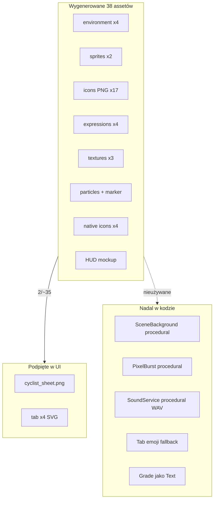

# Audyt spójności Grand Prix — roadmapa po integracji assetów

| | |
|--|--|
| **Status** | Active (historical handoff) |
| **Data** | 2026-06-13 |
| **Owner role** | Mobile Lead / Design |
| **Audience** | Mobile engineers, designers, frontend |
| **lang** | pl |
| **translation** | [English](../../design/GRAND_PRIX_UI_CONSISTENCY_AUDIT.md) |
| **canonical_path** | docs/pl/design/GRAND_PRIX_UI_CONSISTENCY_AUDIT.md |
| **Powiązane** | [DESIGN_SYSTEM_MOBILE.md](../../design/DESIGN_SYSTEM_MOBILE.md) · [MOBILE_ASSET_NANO_BANANA_PROMPTS.md](./MOBILE_ASSET_NANO_BANANA_PROMPTS.md) · [ADR 014](../adr/014-mobile-immersive-pixel-art-and-bike-computer.md) |

---

Pełny audyt po wygenerowaniu paczki **Nano Banana Pro** (`assets/generated/`, `mobile/assets/generated/`, native icons w `mobile/assets/`). **Assety są gotowe; integracja w UI — nie.**

**Commity (2026-06-13):** `c7f5210` (38 assetów + pipeline SSOT), `4cb7586` (regeneracja currency/GPS/HUD/native).

> **Ważne:** ten audyt zawiera historyczne snapshoty z fazy integracji. Za aktualny stan operacyjny przyjmuj:
> - `docs/pl/design/4VELO_MOBILE_FULL_VISION_IMPLEMENTATION.md`
> - `docs/pl/design/MOBILE_REQUIREMENTS_TRACEABILITY_MATRIX.md`
> - `docs/pl/operations/MOBILE_FULL_VISION_VERIFICATION.md`

## Snapshot wykonania (2026-06-14)

- Ten audyt pozostaje historycznym zapisem fazy integracji assetów.
- Operacyjnie aktualny status jest utrzymywany w:
  - `docs/pl/design/4VELO_MOBILE_FULL_VISION_IMPLEMENTATION.md`
  - `docs/pl/design/MOBILE_REQUIREMENTS_TRACEABILITY_MATRIX.md`
  - `docs/pl/operations/MOBILE_SPRINT1_REVIEW_PACKET.md`
- Aktualne bramy techniczne mobile są zielone:
  - `pnpm exec tsc --noEmit`
  - pełna paczka Jest (`19/19` suite, `97/97` testów)
- Pozostałe blokery release są operacyjne:
  - manualna device matrix QA (Android/iOS),
  - finalny cross-functional sign-off GO/NO-GO.

---

## Podsumowanie

| Obszar | Status |
|--------|--------|
| Pipeline generacji | Gotowy — SSOT prompty, referencja, character lock |
| Bundled PNG (37 + sfx JSON) | Gotowy — `mobile/assets/generated/` |
| Native app icons | Gotowy — `mobile/assets/icon.png` itd. |
| **Podpięte w UI** | **Zintegrowane** — taby, sceny, HUD, chrome, particles, sfx, hero prefs (PR1–PR7) |
| Tokeny designu | 4 źródła — niezsynchronizowane z Grand Prix |
| Fonty | Press Start 2P — zła nazwa rodziny; brak VT323 |
| Active Ride HUD | Daleko od mockupu sun-readability |
| Scena / particles / dźwięki | Zintegrowane z bundle assetów |

**Wniosek (historyczny):** pipeline assetów był gotowy wcześniej niż pełna integracja UI. Aktualny status wdrożenia należy czytać z dokumentów SSOT wskazanych w sekcji snapshot.

---

## Diagram stanu



---

## Podpięte vs niepodpięte

### Podpięte

| Konsument | Asset | Ścieżka |
|-----------|-------|---------|
| `SpriteAnimator.tsx` | cyclist sheet | `sprites/cyclist_sheet.png` |
| `CyclistSprite` → wiele ekranów | przez SpriteAnimator | Dashboard, Summary, mapa, itd. |
| `tabIcons.ts` → `PixelTabIcon` | 4× **SVG** (nie PNG) | `icons/tab_*.svg` |

### Niepodpięte (w bundlu, nieużywane)

| ID assetów | Uwagi |
|------------|-------|
| `tab_*` PNG, `tab_history` | PNG są; kod bierze SVG |
| `grade_s`…`grade_d` | Ranga jako `Text` |
| `power_*`, `currency_*` | Tekst / emoji |
| `cyclist_idle/happy/tired/victory` | Sheet zamiast portretów PNG |
| `ghost_sheet` | Brak UI ghost pace |
| `env_*` (4 warstwy) | `SceneBackground` — flat kolory stitch |
| `particle_atlas` | Brak `ParticleSystem`; `PixelBurst` proceduralny |
| `map_marker_cyclist` | Mapa używa `CyclistSprite` |
| tekstury UI | Brak `ImageBackground` |
| `sfx_params` | `SoundService` generuje tony w pamięci |
| `manifest.ts` | Zero importów w runtime |
| `active_ride_hud_mockup` | Tylko referencja layoutu / marketing |

---

## Faza 0 — Fundament (blokuje resztę)

### 0.1 Fonty

| Problem | Pliki |
|---------|-------|
| `App.tsx` ładuje `'Press Start 2P'`, komponenty `'PressStart2P'` → fallback systemowy | `mobile/App.tsx`, `PixelText.tsx`, `ArcadeButton.tsx` |
| Brak VT323 na liczby HUD | [DESIGN_SYSTEM_MOBILE §3](../../design/DESIGN_SYSTEM_MOBILE.md) |

**Akcja:** załadować VT323 + Press Start 2P; alias nazwy; podpiąć w `DataFieldCell`, `ArcadeButton`, status bar.

### 0.2 Jeden SSOT tokenów

Cztery źródła kolorów: `stitch.ts`, `@4velo/tokens`, paleta generatora (hardcode), inline hex.

**Konflikt:** `parchment` `#F5F5DC` vs `#2D2418`; `goldAmber` `#FFB800` vs `#D4A373`.

**Akcja:** zsynchronizować `stitch.ts` z [MOBILE_ASSET_NANO_BANANA_PROMPTS §4](./MOBILE_ASSET_NANO_BANANA_PROMPTS.md); dodać `hudPanel`, `hudOutline`, `hudShadow`, `scrimStrong/Soft`.

### 0.3 Runtime asset registry

**Akcja:** `mobile/src/assets/assetRegistry.ts` — typed `require()` map (Metro wymaga statycznych ścieżek).

---

## Faza 1 — Podpięcie assetów (P0)

1. **Tab bar** — SVG → PNG, integer scale, bez emoji fallback  
2. **SceneBackground** — 4 warstwy PNG parallax + `scenes.ts`  
3. **ParticleSystem** — Skia drawAtlas + `particle_atlas.png`  
4. **Ikony game** — grade/currency/power w UI  
5. **Tekstury** — subtelny `ImageBackground` na kartach  
6. **Dźwięki** — `SoundService` → `sfx_params.json`

---

## Faza 2 — Active Ride HUD (focus zone, P0 bezpieczeństwo)

Referencja: `active_ride_hud_mockup.png` — **tylko chrome HUD**, nie scena 2.5D pod danymi ([ADR 014 §2](../adr/014-mobile-immersive-pixel-art-and-bike-computer.md)).

Brakuje m.in.: status bar (GPS, bateria, zegar), PL labele i18n, VT323/Press Start 2P, pasek STOP/PAUSE/RESUME, confirm na STOP, usunięcie `SpeechBubble`/`EnergyBar` z live ride.

Nowe komponenty: `RideStatusBar`, `RideActionBar`, `HudDataFieldCell`.

---

## Faza 3 — Konfigurowalny bohater (P1)

Jeden base sprite; helmet palette-swap; miasto na koszulce = decal i18n ([MOBILE_ASSET_NANO_BANANA_PROMPTS §2](./MOBILE_ASSET_NANO_BANANA_PROMPTS.md)). Portrety PNG na Summary/Profile.

---

## Faza 4 — Polish (P2)

Share card Skia, edge states pixel-art, HapticService, VoiceCueService TTS, cleanup octopath/solar.

---

## Faza 5 — QA

Maestro, visual regression, performance degrade, rozmiar APK.

---

## Kolejność PR-ów

| PR | Scope | Szac. |
|----|-------|-------|
| **PR1** | Fonty + token SSOT + `assetRegistry.ts` | 1–2 dni |
| **PR2** | Tab PNG + grade/currency icons | 1 dzień |
| **PR3** | SceneBackground parallax PNG | 2 dni |
| **PR4** | Active Ride HUD | 2–3 dni |
| **PR5** | Particles + textures + sfx | 1–2 dni |
| **PR6** | Configurable hero + portrety | 2 dni |
| **PR7** | Share card, edge states, cleanup | 1–2 dni |

**Razem:** ~10–14 dni roboczych.

---

## Checklist (sprint board)

- [x] **f0-fonts-tokens** — `PressStart2P` + VT323 ładowane w `App.tsx`; paleta `stitch.ts` zsynchronizowana z Grand Prix (`goldAmber` `#D4A373`, `parchment` `#F5E6CC`) + tokeny `hudPanel`/`hudPanelNight`/`hudOutline`/`hudShadow` + anchory `gp*`. _Do zrobienia: przepiąć legacy komponenty `@4velo/tokens` (`PixelText`, `ArcadeButton`) na `theme.colors` (w ramach f4)._  
- [x] **f0-asset-registry** — `mobile/src/assets/assetRegistry.ts` (typowana mapa statycznych `require()`)  
- [x] **f1-tab-png** — PNG z `assetRegistry`, integer scale, bez SVG/emoji  
- [x] **f1-scene-parallax** — 4 warstwy env PNG + motion degrade  
- [x] **f1-particles-textures** — `ParticleSystem` + tekstury na kartach  
- [x] **f1-game-icons-sfx** — ikony game + `SoundService` → `sfx_params.json`  
- [x] **f2-hud-chrome** — `RideStatusBar` + `RideActionBar` + HUD cells  
- [x] **f2-hud-i18n** — `ride.fields.*` / `ride.actions.*` PL/EN  
- [x] **f3-configurable-hero** — `HeroPreferencesService` + portrety expression  
- [x] **f4-polish** — share card 1080×1920, GPS banner, HapticService, cleanup  

---

## Czego NIE robić

- Nie compositować mockupu HUD jako warstwy live ride ([ADR 014 §2](../adr/014-mobile-immersive-pixel-art-and-bike-computer.md)).  
- Nie hard-quantize scen w postprocess.  
- Nie generować N sprite sheetów per miasto.  
- Nie mieszać SVG tab z PNG bundle.

---

## Regeneracja assetów

```bash
python scripts/generate_assets.py --no-deepseek --save-prompts --delay 2.5
python scripts/bundle_mobile_assets.py
```

Prompty audytu: `assets/generated/prompts/<id>.txt`

Pełna wersja EN: [GRAND_PRIX_UI_CONSISTENCY_AUDIT.md](../../design/GRAND_PRIX_UI_CONSISTENCY_AUDIT.md)
