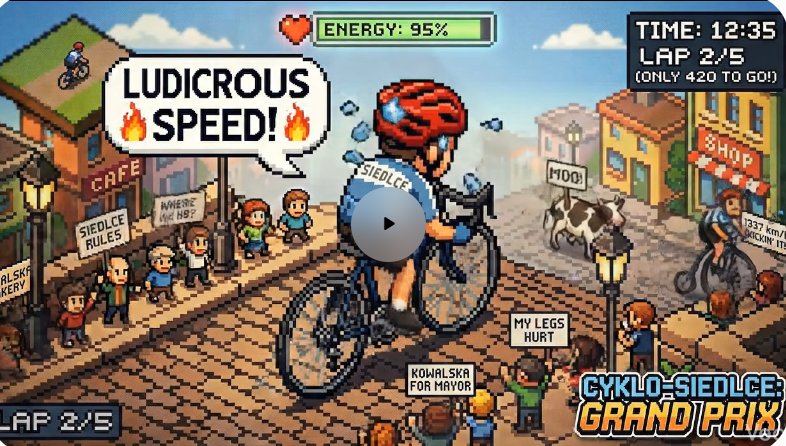

# Prompty assetów mobilnych — SSOT Nano Banana (Cyklo-Siedlce Grand Prix)

| | |
|--|--|
| **Status** | Aktywny (żywa specyfikacja) |
| **Owner role** | Mobile Lead / Design |
| **Last reviewed** | 2026-06-13 |
| **Audience** | Inżynierowie mobile, projektanci, pipeline assetów |
| **lang** | pl |
| **translation** | [English](../../design/MOBILE_ASSET_NANO_BANANA_PROMPTS.md) |
| **canonical_path** | docs/pl/design/MOBILE_ASSET_NANO_BANANA_PROMPTS.md |
| **Decyzja** | [ADR 014](../adr/014-mobile-immersive-pixel-art-and-bike-computer.md) |
| **Design SSOT** | [DESIGN_SYSTEM_MOBILE.md](../../design/DESIGN_SYSTEM_MOBILE.md) |

---

To jest lustro PL. **Kanonem jest wersja angielska**: [docs/design/MOBILE_ASSET_NANO_BANANA_PROMPTS.md](../../design/MOBILE_ASSET_NANO_BANANA_PROMPTS.md). Prompty pozostają po angielsku, bo trafiają bezpośrednio do modelu **Nano Banana Pro** (`gemini-3-pro-image`); nagłówki i opis tłumaczymy na polski.

Te prompty **zastępują** stare opisy w [`scripts/asset_definitions.py`](../../../scripts/asset_definitions.py) (płaska paleta Stitch, bohater w złotym kasku), które nie odpowiadają referencji.

## 1. Arkusz referencyjny (dołączaj do każdego wywołania)

Cel wizualny to klatka konceptu autorstwa użytkownika:



`docs/design/reference/cyklo-siedlce-grand-prix.png` — dołączaj ten obraz jako input do **każdego** zapytania Nano Banana. On blokuje kierunek artystyczny, paletę, projekt bohatera i energię tłumu/miasta. Bez niego model dryfuje do generycznego pixel-artu.

**Jak dołączyć:**

- **AI Studio:** wgraj PNG w polu promptu, potem wklej prompt assetu.
- **Gemini API (Python, `google-genai`):**

```python
from google import genai
from google.genai import types

client = genai.Client()
ref = client.files.upload(file="docs/design/reference/cyklo-siedlce-grand-prix.png")
resp = client.models.generate_content(
    model="gemini-3-pro-image",
    contents=[ref, PROMPT_TEXT],
    config=types.GenerateContentConfig(response_modalities=["IMAGE"]),
)
```

## 2. Biblia postaci (kanon = sylwetka + proporcje; skórka = konfigurowalna)

Bohater jest **konfigurowalny per gracz**. **Kanon** (niezmienne): sylwetka, proporcje i perspektywa. **Skórka** (z onboardingu / personalizacji): kolor kasku i nazwa miasta na koszulce.

**Zablokowany kanon (każdy asset z kolarzem):**

- **Proporcje:** karykatura / chibi — **duża głowa, małe ciało**. Znak rozpoznawczy; bez realistycznych proporcji.
- **Perspektywa (kolarz w świecie — sprite, marker):** **izometryczna, zza pleców (rear three-quarter)**, jak w referencji. Portrety pozostają frontalne.
- **Rower:** ciemny grafitowy szosowy, kierownica drop, cienka rama.
- **Render:** czyste ostre piksele, żywe nasycone kolory, klimat 16-bit.
- **Nastrój:** energetyczny, humorystyczna przesada arcade-sport (czytelność jak Sensible Soccer).
- **Szablon koszulki:** **niebieski dominujący** z płaskim miejscem na nazwę miasta.

**Konfigurowalne (warstwa skórki, NIE wypalane w sprite):**

- **Kolor kasku:** domyślnie **czerwony** aero z białym refleksem; przebarwialny przez palette-swap.
- **Tekst miasta na koszulce:** domyślnie **„SIEDLCE”**; miasto pochodzi z onboardingu (np. `„MIŃSK MAZ.”`). Renderuj jako **decal/overlay i18n na wierzchu sprite'a**, nie jako piksele wypalone w PNG — jeden bazowy sprite obsługuje każde miasto.

> Referencja pokazuje **domyślną** konfigurację (czerwony kask, niebiesko-żółta „SIEDLCE”). Zielony kask + koszulka `„MIŃSK MAZ.”` to po prostu inna konfiguracja tego samego bohatera, NIE inna postać.

**Zakres v1:** jeden bazowy sprite (domyślny czerwony + „SIEDLCE”); wariacja per miasto = palette-swap kasku + decal tekstu w runtime. **Nie** generuj N pełnych sprite-sheetów per miasto. **Nie** używaj starego opisu (złoty kask / deep-sea) ani szczupłego, realistycznego kolarza.

### Potwierdzony przykładowy prompt (lock postaci)

Ten prompt dał bohatera w stylu i jest kanonicznym seedem dla `cyclist_idle` / `cyclist_sheet` / `map_marker_cyclist` (generuj **domyślną** konfigurację SIEDLCE; tekst miasta podmienia decal w runtime):

```
A single caricatured pixel art cyclist in 16-bit style, viewed from an isometric
behind-the-back perspective. Large head, small body, wearing a blue and yellow jersey
with 'SIEDLCE' text. Clean sharp pixels, vibrant colors, on a plain white background
for a clean preview. Character only, no background elements.
```

Generuj bohatera na **białym tle** (czysty podgląd), potem przytnij do transparentnego w post-process przed bundlem.

## 3. Globalny blok stylu (prefiks każdego promptu)

Każdy prompt zaczynaj od tego bloku (część per-asset dodaje temat i kadr):

```
Match the attached reference image "Cyklo-Siedlce Grand Prix" exactly in art direction:
16-bit SNES/GBA-quality pixel art, isometric Polish small-town bike-race energy,
vibrant saturated palette, clean sharp pixels, crisp 1px black outlines (no blur, no anti-aliasing).
Hero cyclist: caricatured large-head/small-body build, blue-and-yellow jersey with white "SIEDLCE" text,
bright red aero helmet, dark charcoal road bike, isometric behind-the-back (rear three-quarter) view.
World cues: cobblestone street, cafe/shop awnings, cheering pixel crowd, playful arcade HUD vibe.
Output exactly {WIDTH}x{HEIGHT}px PNG, {BACKGROUND}, no watermark, no extra logo or caption text unless specified.
```

**Wspólne negatywy** (dołącz do każdego promptu): `flat procedural blocky shapes, Imagen-style smear, gradient blur, anti-aliased soft edges, wrong hero (gold helmet / deep-sea jersey / realistic lean proportions), random English words baked into sprite sheets, photorealism, vector/SVG flat-icon look, drop shadows.`

## 4. Paleta (kotwice tokenów)

Sceny mogą być bogatsze/bardziej nasycone niż chrome UI; chrome UI trzyma tokeny Stitch dla czytelności (patrz [DESIGN_SYSTEM_MOBILE.md](../../design/DESIGN_SYSTEM_MOBILE.md) §5).

| Token | Hex | Zastosowanie |
|-------|-----|--------------|
| deepSea | `#0B1D33` | tła ikon, cień koszulki, góra nieba |
| goldAmber | `#D4A373` | akcenty UI, transparenty, szprychy |
| goldLight | `#EDD9B0` | rozjaśnienia |
| forestGreen | `#7BA05B` | pasek energii, zieleń, wzgórza |
| cream | `#F5E6CC` | pergamin, rozjaśnienie skóry, chmury |
| sepia | `#C8B098` | duch, kurz, dalekie wzgórza |
| error | `#CC4444` | czerwony kask, alert, serca |
| warning | `#E8A840` | piorun energii, brąz |
| silver | `#A0A0A0` | rama roweru, ranga A |
| industrial | `#4A4A4A` | asfalt drogi, ranga C |
| metalGray | `#2B303A` | tekstura metalu |

## 5. Kolejność generacji (rekomendacja)

1. **Lock postaci:** najpierw `cyclist_idle`, potem użyj go (img2img + opisany seed) do `cyclist_sheet`, żeby klatki były spójne.
2. `ghost_sheet` (ta sama sylwetka, dither sepia).
3. Pozostałe portrety: `cyclist_happy`, `cyclist_tired`, `cyclist_victory`.
4. Środowisko: `env_sky_day` → `env_hills_far` → `env_town_mid` → `env_road_near`.
5. `particle_atlas`, `map_marker_cyclist`, tekstury.
6. Ikony UI (17 PNG).
7. Ikony natywne (4, Phase 14).

Budżet: ~36 wywołań Nano Banana Pro; 2–3 s odstępu między zapytaniami.

---

## 6. Inwentarz assetów

| Grupa | Liczba | ID | Format | Rozmiar |
|-------|--------|-----|--------|---------|
| Tab bar | 5 | `tab_home` … `tab_profile` | PNG | 24×24 |
| Odznaki rang | 5 | `grade_s` … `grade_d` | PNG | 32×32 |
| Power-upy | 4 | `power_speed` … `power_gps` | PNG | 24×24 |
| Waluty | 3 | `currency_xp/coin/energy` | PNG | 16×16 |
| Portrety | 4 | `cyclist_idle/happy/tired/victory` | PNG | 64×64 |
| Sprite sheety | 2 | `cyclist_sheet`, `ghost_sheet` | PNG | 512×64, 256×64 |
| Parallax env | 4 | `env_sky_day` … `env_road_near` | PNG | 512×128/96/64 |
| Cząstki / mapa | 2 | `particle_atlas`, `map_marker_cyclist` | PNG | 128×32, 32×32 |
| Tekstury UI | 3 | `parchment_grain`, `metal_plate`, `wood_grain` | PNG | 128×128 tile |
| Natywne (Phase 14) | 4 | `app_icon`, `splash_icon`, `adaptive_icon`, `favicon` | PNG | 1024 / 1280 / 432 / 48 |
| Marketing / layout | 1 | `active_ride_hud_mockup` | PNG | 1080×1920 |
| Wykluczony | 1 | `sfx_params` | JSON | presety jsfxr, nie obraz |

**Łącznie assetów obrazowych: 37.** `sfx_params` to wyjątek (patrz §11). `active_ride_hud_mockup` to ilustracja marketingowa/onboardingowa i wzorzec layoutu danych — **nie** warstwa składana in-app (patrz §16b).

---

> Pełna treść promptów (sekcje 7–16b) jest identyczna jak w kanonie EN — prompty są po angielsku, więc nie tłumaczymy ich tutaj, aby uniknąć rozjazdu. Korzystaj z [docs/design/MOBILE_ASSET_NANO_BANANA_PROMPTS.md](../../design/MOBILE_ASSET_NANO_BANANA_PROMPTS.md) §7–§16b jako źródła prawdy dla treści promptów; poniżej skrót zakresu każdej grupy.

## 7. Ikony tab bar (24×24 PNG, tło `#0B1D33`)

`tab_home` (piasta koła), `tab_history` (trasa z waypointami), `tab_ranking` (podium z rowerem), `tab_rewards` (puchar), `tab_profile` (czerwony kask bohatera). Pixel-perfect, czytelne w 24px, akcent złoty `#D4A373` jak w HUD referencji.

## 8. Odznaki rang (32×32 PNG)

`grade_s` … `grade_d` — ozdobna odznaka z dużą literą w środku i wzorem łańcucha rowerowego na obwódce; kolory: złoto / srebro / brąz / szary / czerwony.

## 9. Power-upy (24×24 PNG, transparentne)

`power_speed` (skrzydlate koło), `power_shield` (kask-tarcza), `power_double_xp` (dwa skrzyżowane rowery), `power_gps` (róża kompasu).

## 10. Waluty (16×16 PNG, transparentne)

`currency_xp` (złota kostka XP), `currency_coin` (moneta z gwiazdką), `currency_energy` (piorun energii). Czytelne w 16px.

## 11. Portrety (64×64 PNG, transparentne)

Karykaturalne popiersie **bohatera** z dużą głową (niebiesko-żółta koszulka SIEDLCE, czerwony aero kask), frontalnie (jedyny widok nie-zza-pleców). Identyczna twarz/kask/koszulka we wszystkich czterech; zmienia się tylko wyraz: `cyclist_idle` (neutralny, kanon do lock), `cyclist_happy` (uśmiech, gwiazdki w oczach), `cyclist_tired` (zmęczenie, kropla potu), `cyclist_victory` (ręce w górze, konfetti).

## 12. Sprite sheety (PNG)

`cyclist_sheet` — 512×64, 8 klatek pedałowania, karykaturalny bohater w rzucie izometrycznym zza pleców, jeden rząd, równy grid 8×64px, białe tło do cięcia, bez napisów (lock do potwierdzonego promptu z §2). `ghost_sheet` — 256×64, 4 klatki ducha (sepia, dither, bez pedałowania).

## 13. Parallax środowiska (PNG)

`env_sky_day` (pas nieba 512×128, full-bleed), `env_hills_far` (dalekie wzgórza 512×96, transparentne krawędzie), `env_town_mid` (miasto finiszu 512×128 z kamienicami/kościołem/łukiem mety/tłumem — NIE płaskie prostokąty), `env_road_near` (bruk/asfalt 512×64, tileable poziomo).

## 14. Cząstki i marker mapy (PNG, transparentne)

`particle_atlas` — 128×32, 4 kafelki 32×32 (płomień, kropla potu, kurz, serce). `map_marker_cyclist` — 32×32, karykaturalny bohater z góry, powiększony czerwony kask, koszulka niebiesko-żółta.

## 15. Tekstury UI (128×128 PNG, bezszwowe tile)

`parchment_grain` (subtelny pergamin), `metal_plate` (szczotkowany metal), `wood_grain` (ciemne drewno). Subtelne, by dane pozostały czytelne.

## 16. Natywne ikony aplikacji (Phase 14, PNG)

Używane przez `mobile/app.config.js`: `app_icon` (1024×1024), `splash_icon` (1280×1280, tło `#f8faf0`), `adaptive_icon` (432×432, strefa bezpieczna ~66%, transparentne tło), `favicon` (48×48). Karykaturalny bohater (duża głowa, niebiesko-żółta koszulka, czerwony kask). Tylko znak marki, bez drobnego tekstu.

## 16b. Mockup HUD Active Ride (marketing / wzorzec layoutu)

`active_ride_hud_mockup` (1080×1920, 9:16) — ilustracja marketingowa/onboardingowa **oraz** kanoniczny wzorzec layoutu pól danych i czytelności w słońcu. **Nie** jest warstwą składaną in-app. Wg [ADR 014](../adr/014-mobile-immersive-pixel-art-and-bike-computer.md) §2 żywy ekran Active Ride pozostaje **strefą skupienia** (mapa MapLibre + marker + minimum ruchu); przewijana scena 2.5D należy do Dashboardu/onboardingu/screenów do sklepu. Pełny prompt (verbatim, domyślna konfiguracja, miasto = SIEDLCE) jest w kanonie EN §16b. Etykiety pól (PL) mapują się 1:1 na `DataFieldRegistry`; wymogi sun-readability (ramki wysokiego kontrastu, czarne obrysy, duże liczby, kolorowy pasek STOP/PAUSE/RESUME, status bar) są normatywne dla realnego HUD (patrz DESIGN_SYSTEM §3).

## 17. Wyjątek (nie-obraz) — `sfx_params`

`sfx_params` (`assets/generated/sounds/sfx_params.json`) to **nie** obraz — to presety parametrów jsfxr dla 9 efektów 8-bit, generowane z [`scripts/generators/jsfxr_params.py`](../../../scripts/generators/jsfxr_params.py). Jest w katalogu dla kompletności, ale nigdy nie trafia do Nano Banana.

## 18. Post-process

- [`scripts/postprocess_assets.py`](../../../scripts/postprocess_assets.py) — skalowanie nearest-neighbor i trymowanie.
- **Palette-quant jest opcjonalny i tylko dla chrome UI** (ikony, odznaki, waluty). **Nie** kwantyzuj scen/portretów/sprite sheetów — spłaszcza to bogatą paletę Grand Prix.
- Bundle przez [`scripts/bundle_mobile_assets.py`](../../../scripts/bundle_mobile_assets.py) → `mobile/assets/generated/` + typowany [`mobile/src/assets/manifest.ts`](../../../mobile/src/assets/manifest.ts).

## 19. Spięcie z pipeline (follow-up, śledzone osobno)

Po akceptacji tego dokumentu: aktualizacja [`scripts/asset_definitions.py`](../../../scripts/asset_definitions.py) (ikony → `format: png`, `model: gemini`), dołączanie referencji w [`scripts/generators/gemini_client.py`](../../../scripts/generators/gemini_client.py), deprecjacja proceduralnego [`scripts/generate_grand_prix_assets.py`](../../../scripts/generate_grand_prix_assets.py) i [`scripts/grand_prix/`](../../../scripts/grand_prix/), oraz import PNG zamiast SVG w [`mobile/src/assets/tabIcons.ts`](../../../mobile/src/assets/tabIcons.ts).

## 20. Sun-readability spec (chrome HUD — normatywne)

Z mockupu §16b; dotyczy realnego HUD Active Ride (`DataFieldGrid`, status bar, pasek akcji), mimo że żywy ekran zostaje focus-mode. Pełna treść w kanonie EN §20.

- **Panele wysokiego kontrastu** w jasnych ramkach, twardy obrys 1–2px + hard pixel shadow.
- **Number-first:** duża wartość, mniejsza jednostka, mała etykieta UPPERCASE; liczby VT323, etykiety Press Start.
- **Status bar:** GPS (zielony przy locku), bateria %, zegar.
- **Pasek akcji:** STOP (kwadrat, czerwony) / PAUSE-RESUME (dwa paski, żółty) / RESUME (trójkąt, zielony); STOP z potwierdzeniem (long-press / slide).
- **Auto dzień/noc** (kontrast AA), **colorblind-safe** (kształt ikony, nie tylko barwa).
- **Etykiety PL** 1:1 z `DataFieldRegistry`: `PRĘDKOŚĆ`, `DYSTANS`, `CZAS`, `PRZEWYŻSZ.`, `ŚR. PRĘDK.`, `TĘTNO`, `KIERUNEK`.

## 21. Rekomendacje seniora (layout + grafika + inżynieria assetów)

Pełna treść w kanonie EN §21. Skrót:

- **Czytelność/bezpieczeństwo:** brak scrollującej sceny 2.5D pod żywymi danymi (bateria/bezpieczeństwo/motion); scrim + obrys pod panelami.
- **Hierarchia danych:** presety 2/4/6/8 + centralna metryka, progi kolorów, limit pól.
- **Grafika/i18n:** zero wypalonego tekstu w PNG (nazwy miast/dymki jako decal); paleta mapy z tokenów scen; landmark per miasto.
- **Inżynieria:** seed+hash w manifeście, budżet `drawAtlas`/<1 MB, integer scaling ikon, tokeny shadow/obrysu.
- **Stany brzegowe + share card:** banner „GPS lost”/offline w pixel-art; formaty social 1080×1920 / 1200×630.
