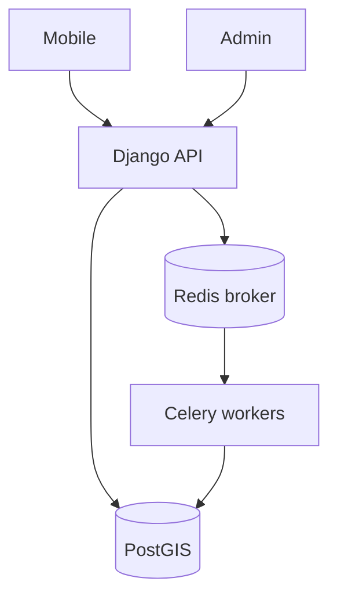
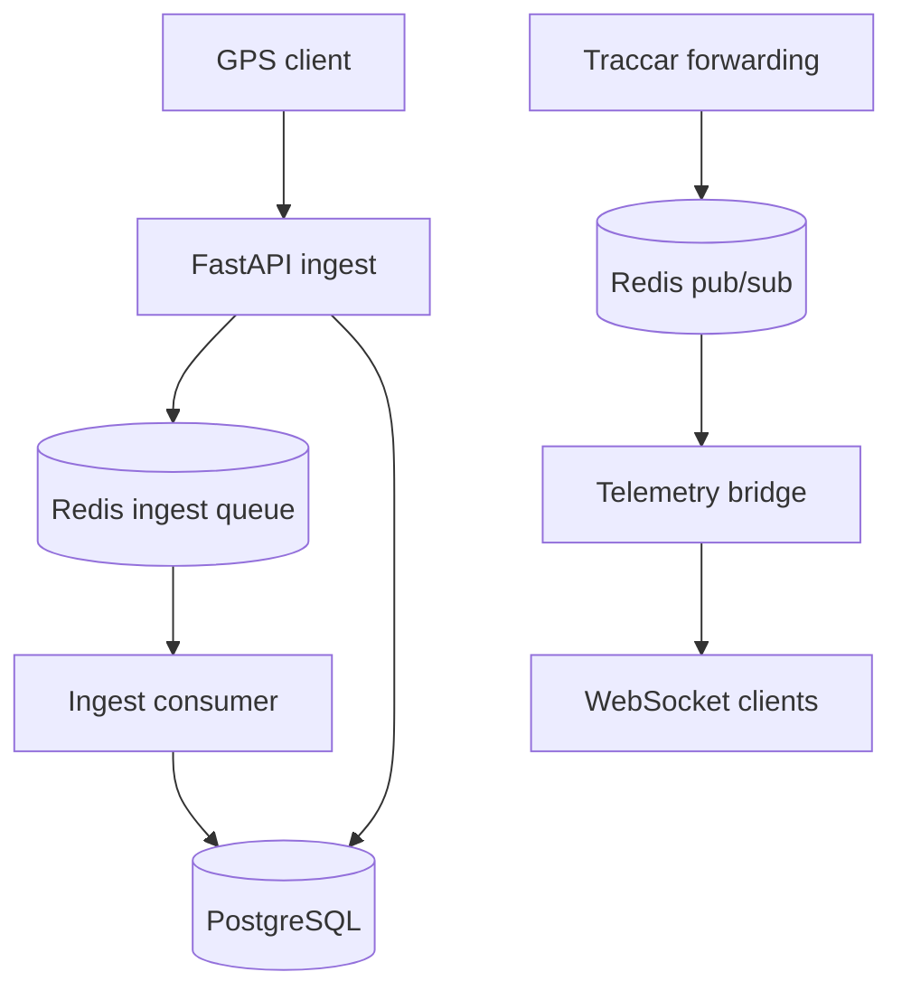

# 4VELO — diagramy kontenerów

| | |
|--|--|
| **Status** | Active |
| **Owner role** | Tech Lead |
| **Last reviewed** | 2026-09-10 |
| **Audience** | Developers |
| **lang** | pl |
| **translation** | [English](../../diagrams/architecture_c4.md) |
| **canonical_path** | docs/pl/diagrams/architecture_c4.md |

[Architektura](../ARCHITECTURE.md). Diagramy pokazują odpowiedzialność kodu, nie status produkcji. Pominięto dawny przykładowy ERD: aktualny schemat określają modele i migracje Django.

## API / tasks

## Telemetry

Źródła: `telemetry/ingest_service.py`, `telemetry/ingest_queue.py`, `telemetry/bridges.py`, `telemetry/ws_manager.py`, `infrastructure/traccar/conf/traccar.xml`.

Kolejkowanie i dostarczanie zależą od konfiguracji. Diagram nie gwarantuje kolejności, trwałości ani kompletności dostarczenia. Railway, Celery, worker i beat to nazwy techniczne; nie tłumaczymy ich automatycznie.
