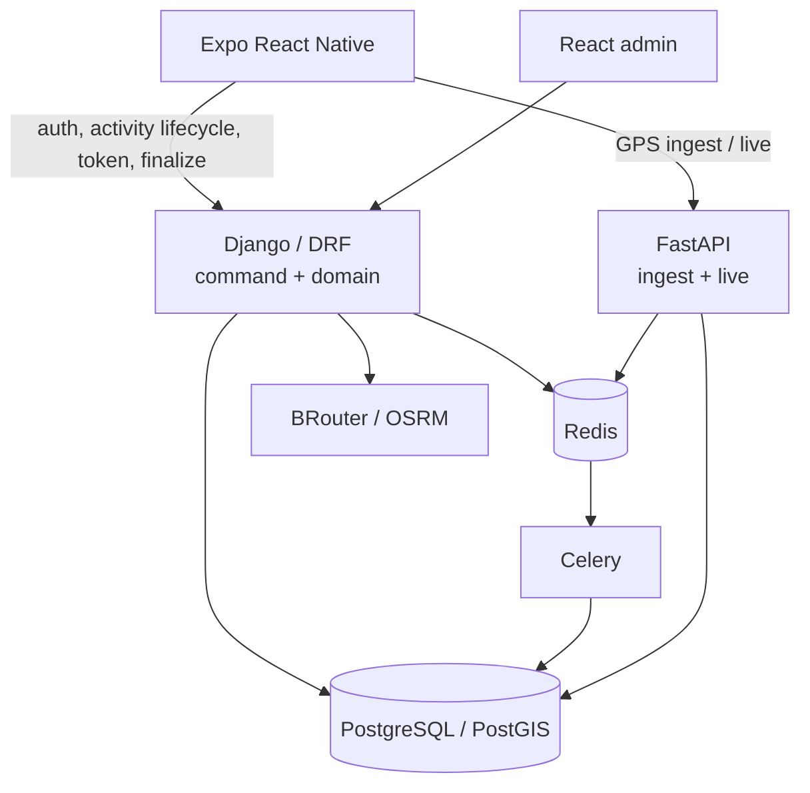
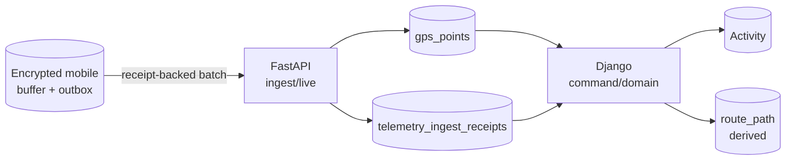
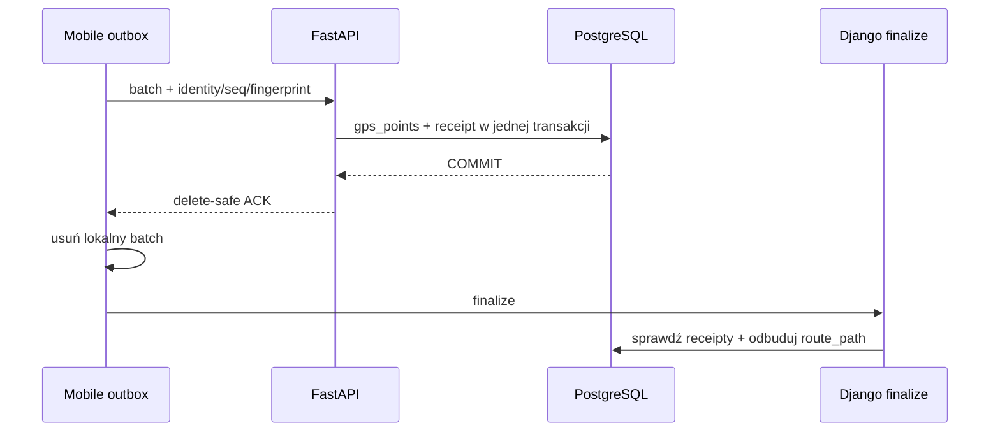
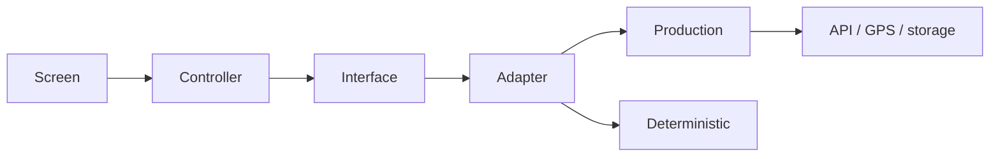

# 4VELO — diagramy kontenerów

| | |
|--|--|
| **Status** | ✅ Active |
| **Document class** | REFERENCE |
| **Owner role** | Tech Lead |
| **Last reviewed** | 2026-09-30 |
| **Audience** | Developerzy, reviewerzy |
| **lang** | pl |
| **translation** | [English](../../diagrams/architecture_c4.md) |
| **canonical_path** | docs/pl/diagrams/architecture_c4.md |

[Architektura](../ARCHITECTURE.md). Diagramy opisują granice kodu/runtime, nie potwierdzony topologicznie production deploy.

## Kontenery

```mermaid
flowchart TB
  Mobile[Expo React Native]
  Admin[React admin]
  Django[Django / DRF\ncommand + domain]
  Tel[FastAPI\ningest + live]
  Celery[Celery]
  DB[(PostgreSQL / PostGIS)]
  Redis[(Redis)]
  Routing[BRouter / OSRM]

  Mobile -->|auth, activity lifecycle, token, finalize| Django
  Mobile -->|GPS ingest / live| Tel
  Admin --> Django
  Django --> DB
  Django --> Redis
  Redis --> Celery
  Celery --> DB
  Tel --> DB
  Tel --> Redis
  Django --> Routing
```

## Activity / Tracking domain

```mermaid
flowchart LR
  Local[(Encrypted mobile\nbuffer + outbox)]
  Django[Django\ncommand/domain]
  Tel[FastAPI\ningest/live]
  Points[(gps_points)]
  Receipts[(telemetry_ingest_receipts)]
  Activity[(Activity)]
  Route[(route_path\nderived)]

  Local -->|receipt-backed batch| Tel
  Tel --> Points
  Tel --> Receipts
  Django --> Activity
  Points --> Django
  Receipts --> Django
  Django --> Route
```

## Durable ACK

```mermaid
sequenceDiagram
  participant M as Mobile outbox
  participant T as FastAPI
  participant P as PostgreSQL
  participant D as Django finalize

  M->>T: batch + identity/seq/fingerprint
  T->>P: gps_points + receipt w jednej transakcji
  P-->>T: COMMIT
  T-->>M: delete-safe ACK
  M->>M: usuń lokalny batch
  M->>D: finalize
  D->>P: sprawdź receipty + odbuduj route_path
```

Redis jest brokerem/cache/buforem operacyjnym. Samo przyjęcie do Redis nie jest krytycznym ACK dla receipt-backed activity telemetry.

## Mobile dependency direction

```mermaid
flowchart LR
  Screen --> Controller --> Interface --> Adapter
  Adapter --> Production
  Adapter --> Deterministic
  Production --> Services[API / GPS / storage]
```

FastAPI i Django pozostają dwoma plane'ami wykonawczymi jednej domeny Activity/Tracking.
