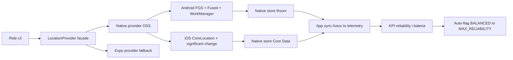

# Migracja trackingu w tle (Android/iOS) — runbook i decyzja architektoniczna

| | |
|--|--|
| **Status** | Proposed (decyzja przyjęta, wdrożenie etapowe) |
| **Owner role** | Mobile Lead |
| **Last reviewed** | 2026-06-11 |
| **Audience** | Mobile Lead, Platform Operator, QA, Founder |
| **lang** | pl |
| **translation** | [English](../../en/operations/MOBILE_BACKGROUND_TRACKING_MIGRATION.md) |
| **canonical_path** | docs/pl/operations/MOBILE_BACKGROUND_TRACKING_MIGRATION.md |
| **Powiązane** | [MOBILE.md](./MOBILE.md) · [DATA_RESILIENCE.md](../../DATA_RESILIENCE.md) · [adr/001-react-native-bridgeless.md](../adr/001-react-native-bridgeless.md) |
| **Kod** | `mobile/src/services/GpsSyncManager.ts`, `mobile/app.config.js`, `mobile/package.json` |

---

## 0. Cel

Zdefiniować, **jak poprawić niezawodność śledzenia lokalizacji w tle** na Android/iOS (oszczędzanie baterii, app w tle, Doze/OEM kill, różne modele telefonów) oraz **udokumentować decyzję** o migracji z czystego Expo do natywnego providera trackingu — bez stałych opłat licencyjnych i bez psucia anti-cheatu backendu.

Decyzja właściciela:
- **Ścieżka:** migracja do natywnej biblioteki background location.
- **Domyślny tryb:** balans bateria/niezawodność.
- **Reguła:** jeśli balans okaże się niewystarczający (KPI poniżej progu), **flagujemy** i w kolejnym cyklu proponujemy przejście na tryb **maksymalnej niezawodności**.

---

## 1. Stan obecny (repozytorium)

| Element | Gdzie | Uwaga |
|---------|-------|-------|
| Tracking | [GpsSyncManager.ts](../../../mobile/src/services/GpsSyncManager.ts) | `expo-location` + `expo-task-manager`, task `BACKGROUND_LOCATION_TASK` |
| Profile | `RESOLUTION_CONFIG` | `HYPERSCALE` / `BALANCED` / `POWER_SAVE` (`distanceInterval`, `deferredUpdatesInterval`, `accuracy`) |
| Foreground service | `startLocationUpdatesAsync(...)` | Notyfikacja "4VELO — Tracking Active" |
| Uprawnienia | [app.config.js](../../../mobile/app.config.js) | `ACCESS_BACKGROUND_LOCATION`, `FOREGROUND_SERVICE`, `FOREGROUND_SERVICE_LOCATION`, iOS `UIBackgroundModes: location, fetch` |
| Persystencja | MMKV buffer + outbox | [DATA_RESILIENCE.md](../../DATA_RESILIENCE.md) |
| Recovery | `recoverGpsDataOnLaunch()` | Baner po relaunchu |
| New Architecture | `app.config.js` `newArchEnabled: true`, RN 0.83.6 | Tryb Bridgeless |

**Wniosek:** fundament jest dobry (profile, foreground service, outbox), ale persystencja stanu i wybudzanie zależą od warstwy JS, co na Bridgeless + agresywnym OEM/Doze bywa zawodne (Headless JS, "Runtime not ready", batchowanie aktualizacji do kilku minut).

---

## 2. Typowe problemy Android/iOS (co realnie psuje tracking)

### Android

| Problem | Objaw | Źródło |
|---------|-------|--------|
| Doze / App Standby | Brak aktualizacji przy zgaszonym ekranie (API 31+) | OS power management |
| OEM kill (Xiaomi/MIUI, Samsung, Huawei, Oppo) | Proces ubijany mimo foreground service | Nakładki producentów |
| Battery optimization ON | Tracking pauzowany w tle | Brak whitelisty `ACTION_REQUEST_IGNORE_BATTERY_OPTIMIZATIONS` |
| FGS Android 14/15 | `SecurityException` bez `FOREGROUND_SERVICE_LOCATION` | Wymóg typu usługi |
| `LocationManager` niestabilny | Brak `onLocationChanged` przy ekranie off | Zalecany Fused Location Provider |
| Batched updates | Punkty dostarczane masowo po kilku minutach | Energy saver buforuje |

### iOS

| Problem | Objaw | Źródło |
|---------|-------|--------|
| Watchdog / 30 s budżet | `SIGKILL 0x8BADF00D` przy długim wybudzeniu | iOS background policy |
| App Nap / suspend | Zatrzymanie w tle | OS |
| `allowsBackgroundLocationUpdates` | Brak updates w tle gdy nieustawione | CoreLocation |
| Deferred updates tylko low-power | Nie działa w debug (Xcode trzyma app aktywną) | CoreLocation |
| "Allow Once" | Cichy fail `requestBackground` | Polityka uprawnień |
| Brak notyfikacji FGS | Niebieski pasek statusu zamiast trwałej karty | iOS UX |

### Różnice modeli telefonów
- Najgorsze: **Xiaomi/Redmi (MIUI/HyperOS), Huawei, Oppo/Realme, Samsung (z agresywnym "Sleeping apps")**.
- Konieczny UX prowadzący użytkownika do ustawień producenta + whitelisty baterii.

---

## 3. Opcje i decyzja

| Opcja | Plus | Minus | Werdykt |
|-------|------|-------|---------|
| Expo hardening (zostać) | Najmniejszy koszt | Nie usuwa root-cause (JS w pętli tła) | Tylko fallback |
| **Native OSS** (`@gabriel-sisjr/react-native-background-location`) | MIT, TurboModules, Room/Core Data, WorkManager, crash recovery | Mniej battle-tested niż komercja | **Wybrane** |
| Transistorsoft `react-native-background-geolocation` | Battle-tested, Motion API | ~350 USD/rok licencja | Odrzucone (koszt) |

**Decyzja:** natywny provider OSS z paradygmatem "ominąć JS w tle" (zapis natywny SQLite/Room/Core Data, synchronizacja po stronie aplikacji), Expo jako fallback za feature-flagą.

> Uwaga korygująca: `expo-location` nie jest "martwe" w New Architecture — działa, ale ma ograniczenia platformowe. OSS native nie jest gwarantowanym 1:1 odpowiednikiem Transistorsoft — wymaga POC i twardych KPI przed pełnym rolloutem.

---

## 4. Architektura docelowa

Zasada: warstwa natywna zbiera i utrwala punkty niezależnie od JS; aplikacja czyta partie (`getLocations(tripId)`), wysyła POST do telemetrii, po `200 OK` czyści `clearTrip(tripId)`.

---

## 5. Parametryzacja pod anti-cheat (NIE psuć backendu)

Backend (Konstytucja §24.2) weryfikuje telemetrię w warstwach; złe parametry klienta psują weryfikację. Wiążące ustawienia:

| Warstwa backendu | Cel | Parametr klienta | Wartość |
|------------------|-----|------------------|---------|
| Fast Selection Gate | Odsiew teleportów/pojazdów | `accuracy` | `HIGH_ACCURACY` (tylko GNSS, nie sieć/BTS) |
| Kalman (`GpsKalmanSmoother`) | Wygładzanie driftu | `distanceFilter` | `0` lub max 2–3 m (gęsty strumień) |
| V-Max kinematics | Limity prędkości (RUN 12, BIKE 25, WALK 3,5 m/s) | `onUpdateInterval` | Stabilny throttle (np. 1 s sample, 3 s UI) |
| BRouter / Viterbi HMM | Map matching do OSM | częstotliwość | Stała, bez sztucznych przerw |
| ML Isolation Forest | Gęste cechy kinetyczne | gęstość punktów | Nie obcinać (wysoka gęstość) |

**Zakaz:** wysokiego `distanceFilter` (15–20 m) "dla baterii" — psuje Kalmana i zaniża dystans.

---

## 6. Plan wdrożenia (etapy)

1. **Provider facade** — interfejs `LocationProvider`, dwie implementacje (`ExpoLocationProvider` legacy, `NativeLocationProvider`), feature flag. Punkt zmiany: [GpsSyncManager.ts](../../../mobile/src/services/GpsSyncManager.ts).
2. **Integracja natywna** — biblioteka + config plugin (Android FGS, iOS bg modes); mapowanie profili `BALANCED/POWER_SAVE/HYPERSCALE` na parametry natywne.
3. **Hardening Android** — diagnostyczny ekran: status uprawnień, battery optimization, power saver, helper do ustawień OEM.
4. **Hardening iOS** — `activityType`, polityka pause/resume, restore po kill/reboot, weryfikacja "Allow Once".
5. **Telemetria KPI** — metryki niezawodności i baterii per sesja.
6. **Reguła eskalacji** — auto-flaga gdy KPI < próg.
7. **Dokumentacja** — aktualizacja [MOBILE.md](./MOBILE.md) + raport testów urządzeń w `docs/reports/`.

---

## 7. Test matrix urządzeń (minimum przed releasem)

| Klasa | Przykład | Scenariusz |
|-------|----------|-----------|
| Android stock | Pixel | Ekran off 60 min, bieg |
| Android OEM agresywny | Xiaomi/Redmi MIUI | Bateria saver ON, app w tle |
| Android OEM | Samsung (Sleeping apps) | Tło + reboot w trakcie |
| iPhone aktualny | iPhone 14/15 | Tło + Always permission |
| iPhone starszy | iPhone SE/11 | Low Power Mode + tło |

Dla każdego: % ukończonych tras bez recovery, liczba luk GPS >60 s, % zgubionych punktów, drain baterii/h.

---

## 8. KPI i reguła eskalacji (decyzja właściciela)

**Domyślnie:** `BALANCED`.

**Progi (per release/tenant, okno 2 tygodnie):**

| KPI | Próg akceptacji |
|-----|------------------|
| Ukończone trasy bez recovery | ≥ 97% |
| Sesje z luką GPS > 60 s | ≤ 3% |
| Sesje wymagające recovery (pending) | ≤ 2% |
| Drain baterii / h trackingu | Raportowany (baseline) |

**Reguła:** jeśli przez 2 kolejne tygodnie którykolwiek próg niespełniony → oznacz jako `BALANCE_INSUFFICIENT` i w kolejnym cyklu zaproponuj przełączenie na **`MAX_RELIABILITY`** (`HYPERSCALE`-like: `HIGH_ACCURACY`, `distanceFilter` ~0, częstszy sampling, agresywniejszy foreground service) kosztem baterii.

---

## 9. Uprawnienia i zgodność ze sklepami

- **Android 14/15:** `FOREGROUND_SERVICE_LOCATION` + trwała notyfikacja; `ACCESS_BACKGROUND_LOCATION` proszony osobno po foreground; review wymaga uzasadnienia.
- **iOS:** `UIBackgroundModes: location`, `allowsBackgroundLocationUpdates`, opisy w `Info.plist`; uzasadnienie: anti-cheat nagród w wyścigach (Milestone Rewards).
- **Uzasadnienie do review:** ciągłe śledzenie wymagane do fair-play w ligach z nagrodami (rower/bieg/nordic walking).

---

## 10. Rollback

| Warstwa | Akcja |
|---------|-------|
| Feature flag | Przełącz provider na `ExpoLocationProvider` (legacy) |
| Build | Poprzedni tag EAS (`eas build`) |
| Profile | Wymuś `POWER_SAVE` lub `BALANCED` jeśli `MAX_RELIABILITY` drenuje baterię |

---

## 11. Referencje

- GitHub: [`@gabriel-sisjr/react-native-background-location`](https://github.com/gabriel-sisjr/react-native-background-location), [`react-native-background-guardian`](https://github.com/ivangonzalezg/react-native-background-guardian) (OEM/Doze helpery), [Transistorsoft `react-native-background-geolocation`](https://github.com/transistorsoft/react-native-background-geolocation) (wzorzec komercyjny)
- [Android — Launch a foreground service](https://developer.android.com/develop/background-work/services/fgs/launch)
- [Apple — deferredLocationUpdatesAvailable](https://developer.apple.com/documentation/corelocation/cllocationmanager/deferredlocationupdatesavailable())
- [Expo Location](https://docs.expo.dev/versions/latest/sdk/location/)
- Wewnętrzne: [DATA_RESILIENCE.md](../../DATA_RESILIENCE.md), [MOBILE.md](./MOBILE.md), [ADR-001 Bridgeless](../adr/001-react-native-bridgeless.md)

---

## 12. Źródło i zakres

Dokument powstał z analizy stacku mobile (RN 0.83.6 / Expo SDK 55 / New Architecture), problemów Android/iOS, oraz researchu GitHub. Decyzja: migracja do natywnego providera OSS, domyślnie balans bateria/niezawodność, z regułą eskalacji do maksymalnej niezawodności. Wdrożenie etapowe z fallbackiem Expo.
